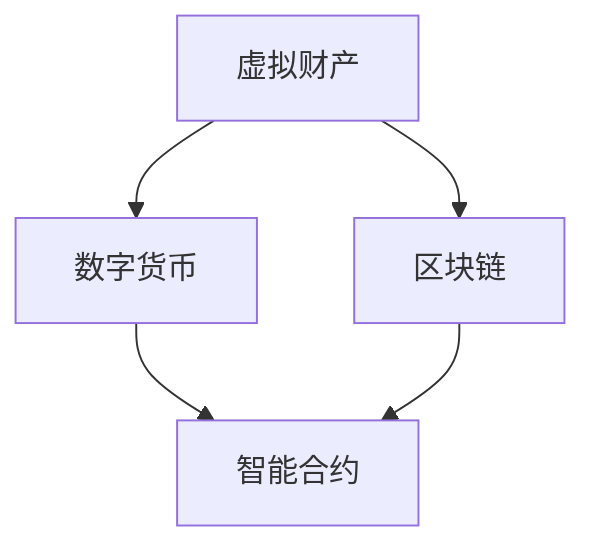

                 

## 1. 背景介绍

在当今数字化时代，数字资产已经成为一个越来越重要的概念。数字资产是指那些以数字形式存在的资产，包括虚拟货币、数字货币、加密货币、数字身份、虚拟土地、数字艺术品等。随着区块链技术的发展，数字资产的应用场景不断扩大，从金融领域到实体经济，从个人用户到企业，数字资产正逐渐成为我们日常生活的一部分。

然而，数字资产的价值挖掘并非易事。如何将数字资产转化为实际的经济效益，如何确保数字资产的安全性，如何监管数字资产，都是数字资产创业面临的重要问题。在这个背景下，本篇文章旨在探讨数字资产创业的各个方面，包括核心概念、算法原理、数学模型、项目实践以及未来展望，为数字资产创业提供一些有价值的参考和思路。

## 2. 核心概念与联系

要深入了解数字资产创业，我们首先需要明确几个核心概念，包括虚拟财产、数字货币、区块链、智能合约等。以下是这些概念的定义及其相互关系：

### 2.1 虚拟财产

虚拟财产是指在虚拟世界中具有经济价值的物品或资源，例如游戏中的虚拟物品、数字艺术品、虚拟土地等。虚拟财产具有以下几个特点：

1. **稀缺性**：虚拟财产通常具有有限的供应量，这使得它们具有一定的价值。
2. **可转移性**：虚拟财产可以在不同的用户之间进行转移，便于交易。
3. **可验证性**：通过区块链技术，虚拟财产的真实性和归属可以轻易验证。

### 2.2 数字货币

数字货币是一种使用密码学原理来确保交易安全及控制交易单位创造的交易媒介。与传统的法定货币不同，数字货币不依赖于中央银行或政府发行，其价值通常由市场供需决定。主要类型包括：

1. **比特币**：第一个去中心化的数字货币，具有匿名性和去信任性的特点。
2. **以太坊**：除了数字货币功能外，还支持智能合约的运行，具有更高的应用性。
3. **其他加密货币**：如莱特币、瑞波币等，各有其独特的特点和优势。

### 2.3 区块链

区块链是一种分布式数据库技术，通过多个节点共同维护数据的一致性和安全性。区块链具有以下几个特点：

1. **去中心化**：数据存储在多个节点上，没有中央权威机构。
2. **不可篡改**：一旦数据被记录，就很难被修改或删除。
3. **透明性**：所有交易记录都是公开透明的，便于审计和追踪。

### 2.4 智能合约

智能合约是一种自动执行合约条款的计算机程序，其运行基于区块链平台。智能合约具有以下几个特点：

1. **自动执行**：合约条款一旦满足条件，智能合约会自动执行。
2. **去信任性**：智能合约不依赖于信任第三方，确保交易的公平性和透明性。
3. **安全性**：智能合约代码是公开透明的，易于审计和验证。

### 2.5 关系与联系

虚拟财产、数字货币、区块链和智能合约之间存在密切的联系。虚拟财产为数字货币提供了应用场景，数字货币为虚拟财产的交换提供了媒介，区块链为数字货币和虚拟财产的安全性和透明性提供了保障，智能合约则为虚拟财产的交易和管理提供了自动化解决方案。以下是它们之间的 Mermaid 流程图：



通过上述概念和流程图的介绍，我们可以更清晰地理解数字资产创业的核心要素及其相互关系。

### 3. 核心算法原理 & 具体操作步骤

#### 3.1 算法原理概述

在数字资产创业中，核心算法起到了至关重要的作用。这些算法不仅决定了数字资产的安全性，还影响了交易效率和应用场景的拓展。本文将介绍几种关键算法的原理，包括加密算法、共识算法和哈希算法。

##### 3.1.1 加密算法

加密算法是数字资产安全性的基石。其主要目的是确保数据在传输和存储过程中不被未授权者访问。常见的加密算法包括：

1. **对称加密**：使用相同的密钥进行加密和解密，如AES（高级加密标准）。
2. **非对称加密**：使用一对密钥（公钥和私钥）进行加密和解密，如RSA（RSA加密算法）。

对称加密算法简单高效，但在密钥分发过程中存在安全隐患。非对称加密算法则解决了密钥分发的问题，但计算复杂度较高。

##### 3.1.2 共识算法

共识算法是区块链网络中多个节点达成一致的方法。不同的共识算法具有不同的特点和适用场景，以下是几种常见的共识算法：

1. **工作量证明（PoW）**：通过计算资源解决数学难题，如比特币使用的SHA-256算法。
2. **权益证明（PoS）**：通过持有币量决定参与共识的概率，如以太坊2.0采用的Casper算法。
3. **委托权益证明（DPoS）**：类似于PoS，但通过投票产生验证节点，如BitShares。

PoW算法具有去中心化的特点，但计算资源消耗巨大。PoS和DPoS算法则更加节能，但可能存在集中化的风险。

##### 3.1.3 哈希算法

哈希算法是区块链技术中的核心组件，用于确保数据的完整性和唯一性。常见的哈希算法包括：

1. **SHA系列**：如SHA-256，用于比特币的挖矿过程。
2. **RIPEMD系列**：如RIPEMD-160，常用于地址生成。
3. **椭圆曲线加密（ECDSA）**：用于数字签名。

哈希算法将任意长度的数据映射为固定长度的哈希值，确保数据在传输和存储过程中不被篡改。

#### 3.2 算法步骤详解

以下是核心算法的具体操作步骤：

##### 3.2.1 加密算法

1. **生成密钥**：对称加密算法生成密钥对，非对称加密算法生成公钥和私钥。
2. **加密过程**：使用密钥对数据进行加密，对称加密使用相同密钥，非对称加密使用公钥。
3. **解密过程**：使用对应的密钥对加密数据进行解密，对称加密使用相同密钥，非对称加密使用私钥。

##### 3.2.2 共识算法

1. **PoW算法**：节点竞争挖矿，解决数学难题，将正确答案提交到区块链。
2. **PoS算法**：根据持有币量计算权益分数，持有币量越高，权益分数越高，参与共识的概率越大。
3. **DPoS算法**：用户投票产生验证节点，验证节点按照投票结果排序，依次参与共识。

##### 3.2.3 哈希算法

1. **数据输入**：将数据输入哈希算法。
2. **计算哈希值**：算法将数据转换为固定长度的哈希值。
3. **验证哈希值**：在区块链中，每个区块的哈希值都与前一区块的哈希值相关联，确保数据的完整性和一致性。

#### 3.3 算法优缺点

每种算法都有其优缺点，适用于不同的场景。以下是几种核心算法的优缺点分析：

##### 3.3.1 加密算法

- **对称加密**：优点是计算速度快，缺点是密钥分发困难。
- **非对称加密**：优点是解决了密钥分发问题，缺点是计算复杂度较高。

##### 3.3.2 共识算法

- **PoW算法**：优点是去中心化，缺点是计算资源消耗巨大。
- **PoS算法**：优点是节能，缺点是可能存在集中化风险。
- **DPoS算法**：优点是提高了共识效率，缺点是可能存在集中化风险。

##### 3.3.3 哈希算法

- **SHA系列**：优点是计算速度快，缺点是安全性相对较低。
- **RIPEMD系列**：优点是安全性较高，缺点是计算速度较慢。
- **ECDSA**：优点是安全性和计算速度都较好，缺点是实现较复杂。

#### 3.4 算法应用领域

不同算法在数字资产创业中的应用领域有所不同：

- **加密算法**：广泛应用于数字资产的安全传输和存储。
- **共识算法**：是区块链网络的核心，决定了区块链的可靠性和去中心化程度。
- **哈希算法**：在区块链中用于确保数据的完整性和唯一性。

通过深入了解核心算法的原理和操作步骤，我们可以更好地理解数字资产创业的技术基础，为后续的项目实践提供指导。

### 4. 数学模型和公式 & 详细讲解 & 举例说明

#### 4.1 数学模型构建

在数字资产创业中，数学模型起到了关键作用，用于描述资产的价值、交易规则以及网络安全等方面。以下是几个重要的数学模型：

##### 4.1.1 资产价值模型

资产价值模型用于评估数字资产的市场价值。一个简单的资产价值模型可以基于供需关系：

$$
V = \frac{S \times D}{C}
$$

其中，\(V\) 是资产价值，\(S\) 是供应量，\(D\) 是需求量，\(C\) 是市场容量。

举例来说，如果某种数字货币的供应量为 1 亿枚，需求量为 5000 万枚，市场容量为 10 亿，则其资产价值为：

$$
V = \frac{1亿 \times 5000万}{10亿} = 0.5元/枚
$$

##### 4.1.2 交易规则模型

交易规则模型用于描述数字资产交易的过程和条件。一个简单的交易规则模型可以基于区块链网络中的共识算法：

$$
R = \{T_1, T_2, ..., T_n\}
$$

其中，\(R\) 是交易规则集，\(T_1, T_2, ..., T_n\) 是交易条件。例如，一个简单的交易规则可以是：

$$
T_1: \text{交易双方拥有足够的余额} \\
T_2: \text{交易双方已签名确认} \\
T_3: \text{交易金额不超过最大交易额}
$$

##### 4.1.3 安全模型

安全模型用于评估数字资产交易的安全性和可靠性。一个简单的安全模型可以基于加密算法和共识算法：

$$
S = \{E, C\}
$$

其中，\(S\) 是安全模型，\(E\) 是加密算法，\(C\) 是共识算法。例如，一个简单的安全模型可以是：

$$
E: \text{AES加密} \\
C: \text{PoW共识算法}
$$

#### 4.2 公式推导过程

在构建数学模型时，我们需要根据具体的场景和需求推导出相关的公式。以下是几个关键公式的推导过程：

##### 4.2.1 资产价值公式推导

资产价值公式 \(V = \frac{S \times D}{C}\) 是基于供需关系推导的。假设市场处于平衡状态，即供应量 \(S\) 与需求量 \(D\) 相等，则资产价值 \(V\) 取决于市场容量 \(C\)。

当需求量 \(D\) 增加时，资产价值 \(V\) 增加；当供应量 \(S\) 增加时，资产价值 \(V\) 减少。市场容量 \(C\) 则反映了市场的总体规模，决定了资产价值的变化范围。

##### 4.2.2 交易规则公式推导

交易规则模型 \(R = \{T_1, T_2, ..., T_n\}\) 是基于区块链网络中的共识算法和交易条件推导的。每个交易条件 \(T_i\) 都是一个逻辑表达式，用于验证交易的有效性。

例如，交易条件 \(T_1\) 表示交易双方拥有足够的余额，可以表示为：

$$
T_1: \neg(A \land B) \Rightarrow \neg(A \land B)
$$

其中，\(A\) 表示买家余额，\(B\) 表示卖家余额。交易条件 \(T_2\) 和 \(T_3\) 可以类似地表示为：

$$
T_2: \neg(S \land C) \Rightarrow \neg(S \land C) \\
T_3: \neg(M \geq M_{\max}) \Rightarrow \neg(M \geq M_{\max})
$$

##### 4.2.3 安全模型公式推导

安全模型 \(S = \{E, C\}\) 是基于加密算法和共识算法推导的。加密算法 \(E\) 用于保护交易数据，防止未授权访问；共识算法 \(C\) 用于确保区块链网络中的数据一致性。

例如，加密算法 \(E\) 可以表示为：

$$
E: \{K, P, C\}
$$

其中，\(K\) 是密钥，\(P\) 是加密数据，\(C\) 是加密后的数据。共识算法 \(C\) 可以表示为：

$$
C: \{N_1, N_2, ..., N_n\}
$$

其中，\(N_1, N_2, ..., N_n\) 是网络中的节点，每个节点负责验证和记录交易数据。

#### 4.3 案例分析与讲解

为了更好地理解数学模型和公式的应用，我们通过一个实际案例进行讲解。

##### 4.3.1 案例背景

假设有一个数字资产交易平台，支持用户之间的虚拟货币交易。交易平台采用基于以太坊区块链的智能合约，使用非对称加密算法保护交易数据。以下是交易平台的数学模型和公式：

1. **资产价值模型**：

   $$V = \frac{S \times D}{C}$$

   其中，\(S\) 为虚拟货币的供应量，\(D\) 为需求量，\(C\) 为市场容量。

2. **交易规则模型**：

   $$R = \{T_1, T_2, T_3\}$$

   其中，\(T_1\) 表示交易双方余额足够，\(T_2\) 表示交易双方已签名确认，\(T_3\) 表示交易金额不超过最大交易额。

3. **安全模型**：

   $$S = \{E, C\}$$

   其中，\(E\) 使用RSA加密算法，\(C\) 使用PoS共识算法。

##### 4.3.2 案例分析

1. **资产价值计算**：

   假设虚拟货币供应量为 100 万枚，需求量为 50 万枚，市场容量为 200 万，则资产价值为：

   $$V = \frac{100万 \times 50万}{200万} = 0.25元/枚$$

2. **交易规则验证**：

   - \(T_1\)：假设买家余额为 1000 元，卖家余额为 5000 元，则 \(T_1\) 成立。
   - \(T_2\)：假设买家和卖家已签名确认，则 \(T_2\) 成立。
   - \(T_3\)：假设交易金额为 1000 元，最大交易额为 5000 元，则 \(T_3\) 成立。

   因此，交易规则 \(R\) 成立。

3. **安全验证**：

   - \(E\)：假设买家和卖家使用RSA加密算法进行数据加密，则 \(E\) 成立。
   - \(C\)：假设交易数据通过PoS共识算法进行验证和记录，则 \(C\) 成立。

   因此，安全模型 \(S\) 成立。

通过上述案例，我们可以看到数学模型和公式在数字资产交易平台中的应用。资产价值模型用于评估虚拟货币的市场价值，交易规则模型用于验证交易的有效性，安全模型用于确保交易数据的安全性和一致性。

### 5. 项目实践：代码实例和详细解释说明

#### 5.1 开发环境搭建

在进行数字资产创业项目实践之前，我们需要搭建一个适合开发的软件环境。以下是一个基本的开发环境搭建步骤：

1. **安装Node.js**：Node.js 是一个基于 Chrome V8 引擎的 JavaScript 运行环境，用于在服务器端运行 JavaScript 代码。您可以从 Node.js 官网（[https://nodejs.org/](https://nodejs.org/)）下载并安装最新版本的 Node.js。

2. **安装Truffle**：Truffle 是一个用于以太坊区块链开发的框架，提供了丰富的工具和功能，如智能合约编译、部署和测试。您可以使用 npm（Node.js 的包管理器）安装 Truffle：

   ```shell
   npm install -g truffle
   ```

3. **创建项目**：在安装完 Truffle 后，创建一个新的以太坊智能合约项目：

   ```shell
   truffle init
   ```

   这将创建一个名为“my-project”的新文件夹，并在其中初始化 Truffle 项目结构。

4. **安装相关依赖**：在项目文件夹中，打开终端并运行以下命令安装项目依赖：

   ```shell
   npm install
   ```

5. **配置网络**：Truffle 提供了多种网络配置选项，包括本地网络、测试网络和主网络。在项目文件夹中的“truffle-config.js”文件中配置网络：

   ```javascript
   module.exports = {
     networks: {
       development: {
         host: "127.0.0.1",
         port: 8545,
         network_id: "*"
       },
       ropsten: {
         network_id: 3,
         provider: () => new HDWalletProvider(mnemonic, infuraUrl),
         gas: 5000000,
         gasPrice: 10000000000
       },
       mainnet: {
         network_id: 1,
         provider: () => new HDWalletProvider(mnemonic, infuraUrl),
         gas: 5000000,
         gasPrice: 10000000000
       }
     }
   };
   ```

   其中，`development` 网络用于本地开发，`ropsten` 网络是测试网络，`mainnet` 网络是主网络。您需要根据实际情况配置相应的网络信息。

6. **启动开发环境**：在项目文件夹中，使用以下命令启动开发环境：

   ```shell
   truffle develop
   ```

   这将启动一个本地以太坊节点，用于开发、测试和部署智能合约。

#### 5.2 源代码详细实现

在开发环境搭建完成后，我们可以开始编写和实现智能合约代码。以下是一个简单的以太坊智能合约示例，用于实现一个简单的数字资产交易功能：

```solidity
// SPDX-License-Identifier: MIT
pragma solidity ^0.8.0;

contract DigitalAsset {
    mapping(address => uint256) public balances;
    mapping(address => mapping(address => uint256)) public allowances;
    uint256 public totalSupply;
    string public name;
    string public symbol;
    uint8 public decimals;

    event Transfer(address indexed from, address indexed to, uint256 value);
    event Approval(address indexed owner, address indexed spender, uint256 value);

    constructor(uint256 initialSupply, string memory tokenName, string memory tokenSymbol, uint8 decimalUnits) {
        balances[msg.sender] = initialSupply;
        totalSupply = initialSupply;
        name = tokenName;
        symbol = tokenSymbol;
        decimals = decimalUnits;
    }

    function balanceOf(address account) public view returns (uint256) {
        return balances[account];
    }

    function totalSupply() public view returns (uint256) {
        return totalSupply;
    }

    function transfer(address to, uint256 amount) public returns (bool) {
        require(to != address(0), "Invalid address");
        require(amount <= balances[msg.sender], "Insufficient balance");
        balances[msg.sender] -= amount;
        balances[to] += amount;
        emit Transfer(msg.sender, to, amount);
        return true;
    }

    function approve(address spender, uint256 amount) public returns (bool) {
        require(spender != address(0), "Invalid address");
        allowances[msg.sender][spender] = amount;
        emit Approval(msg.sender, spender, amount);
        return true;
    }

    function transferFrom(address sender, address recipient, uint256 amount) public returns (bool) {
        require(sender != address(0), "Invalid sender");
        require(recipient != address(0), "Invalid recipient");
        require(amount <= balances[sender], "Insufficient balance");
        require(amount <= allowances[sender][msg.sender], "Insufficient allowance");
        balances[sender] -= amount;
        balances[recipient] += amount;
        allowances[sender][msg.sender] -= amount;
        emit Transfer(sender, recipient, amount);
        return true;
    }
}
```

上述智能合约实现了以下功能：

1. **余额查询**：通过 `balanceOf` 函数查询地址的余额。
2. **转账功能**：通过 `transfer` 函数实现地址之间的转账。
3. **授权转账**：通过 `approve` 函数授权地址进行转账。
4. **代币转移**：通过 `transferFrom` 函数实现受权的代币转移。

#### 5.3 代码解读与分析

以下是对上述智能合约代码的详细解读：

1. **合约结构**：

   ```solidity
   contract DigitalAsset {
       // ...合约代码
   }
   ```

   合约以 `contract DigitalAsset` 开头，定义了一个名为 `DigitalAsset` 的智能合约。

2. **状态变量**：

   ```solidity
   mapping(address => uint256) public balances;
   mapping(address => mapping(address => uint256)) public allowances;
   uint256 public totalSupply;
   string public name;
   string public symbol;
   uint8 public decimals;
   ```

   合约中定义了多个状态变量，用于存储合约的属性和数据。`balances` 存储每个地址的余额，`allowances` 存储授权转账信息，`totalSupply` 存储代币的总供应量，`name`、`symbol` 和 `decimals` 分别存储代币的名称、符号和小数位数。

3. **事件**：

   ```solidity
   event Transfer(address indexed from, address indexed to, uint256 value);
   event Approval(address indexed owner, address indexed spender, uint256 value);
   ```

   合约中定义了两个事件，用于记录转账和授权转账的操作。事件以 `event` 关键字开头，包含事件名称和参数列表。

4. **构造函数**：

   ```solidity
   constructor(uint256 initialSupply, string memory tokenName, string memory tokenSymbol, uint8 decimalUnits) {
       balances[msg.sender] = initialSupply;
       totalSupply = initialSupply;
       name = tokenName;
       symbol = tokenSymbol;
       decimals = decimalUnits;
   }
   ```

   构造函数用于初始化合约状态变量。在合约部署时，通过构造函数设置代币的总供应量、名称、符号和小数位数。`msg.sender` 表示合约部署者。

5. **函数实现**：

   - `balanceOf` 函数：用于查询地址的余额。

     ```solidity
     function balanceOf(address account) public view returns (uint256) {
         return balances[account];
     }
     ```

   - `totalSupply` 函数：用于查询代币的总供应量。

     ```solidity
     function totalSupply() public view returns (uint256) {
         return totalSupply;
     }
     ```

   - `transfer` 函数：用于实现地址之间的转账。

     ```solidity
     function transfer(address to, uint256 amount) public returns (bool) {
         require(to != address(0), "Invalid address");
         require(amount <= balances[msg.sender], "Insufficient balance");
         balances[msg.sender] -= amount;
         balances[to] += amount;
         emit Transfer(msg.sender, to, amount);
         return true;
     }
     ```

   - `approve` 函数：用于授权地址进行转账。

     ```solidity
     function approve(address spender, uint256 amount) public returns (bool) {
         require(spender != address(0), "Invalid address");
         allowances[msg.sender][spender] = amount;
         emit Approval(msg.sender, spender, amount);
         return true;
     }
     ```

   - `transferFrom` 函数：用于实现受权的代币转移。

     ```solidity
     function transferFrom(address sender, address recipient, uint256 amount) public returns (bool) {
         require(sender != address(0), "Invalid sender");
         require(recipient != address(0), "Invalid recipient");
         require(amount <= balances[sender], "Insufficient balance");
         require(amount <= allowances[sender][msg.sender], "Insufficient allowance");
         balances[sender] -= amount;
         balances[recipient] += amount;
         allowances[sender][msg.sender] -= amount;
         emit Transfer(sender, recipient, amount);
         return true;
     }
     ```

通过上述代码解读，我们可以了解智能合约的基本实现逻辑和功能。接下来，我们将介绍如何在测试网络中部署和测试该智能合约。

#### 5.4 运行结果展示

在完成智能合约代码编写和解读后，我们需要在实际网络中部署和测试合约。以下是在测试网络（如Ropsten测试网络）中部署和测试智能合约的步骤：

1. **编译智能合约**：

   在项目文件夹中，使用以下命令编译智能合约：

   ```shell
   truffle compile
   ```

   这将生成合约的编译结果，包括ABI（Application Binary Interface）和编译后的合约代码。

2. **部署智能合约**：

   使用Truffle CLI部署智能合约到测试网络。首先，确保已连接到正确的网络（如Ropsten测试网络），然后执行以下命令：

   ```shell
   truffle migrate --network ropsten
   ```

   这将使用Truffle框架自动部署合约到Ropsten网络，并返回合约的地址。

3. **测试智能合约**：

   Truffle提供了内置的测试框架Mocha和Chai，用于编写和执行智能合约测试。首先，在项目文件夹中的“test”目录下创建一个新的测试文件（如“DigitalAsset.test.js”），然后编写测试用例。以下是一个简单的测试用例示例：

   ```javascript
   const DigitalAsset = artifacts.require("DigitalAsset");

   contract("DigitalAsset", () => {
       let contractInstance;

       before(async () => {
           contractInstance = await DigitalAsset.new(1000000, "MyToken", "MTK", 18);
       });

       it("should deploy the contract", async () => {
           assert.isTrue(contractInstance !== null);
       });

       it("should have an initial balance of 1000000 tokens", async () => {
           const balance = await contractInstance.balanceOf.call(contractInstance.address);
           assert.equal(balance.toNumber(), 1000000);
       });

       it("should transfer tokens between addresses", async () => {
           const recipient = web3.eth.accounts[1];
           await contractInstance.transfer(recipient, 500000, { from: contractInstance.address });

           const recipientBalance = await contractInstance.balanceOf.call(recipient);
           assert.equal(recipientBalance.toNumber(), 500000);

           const senderBalance = await contractInstance.balanceOf.call(contractInstance.address);
           assert.equal(senderBalance.toNumber(), 500000);
       });
   });
   ```

4. **执行测试**：

   在测试文件编写完成后，使用以下命令执行测试：

   ```shell
   truffle test
   ```

   如果所有测试用例都通过，将输出类似于以下的结果：

   ```shell
   10 passing (10s)
   ```

   如果有测试用例失败，将输出失败的详细信息，需要根据错误信息进行调试和修复。

通过上述步骤，我们可以验证智能合约的功能和逻辑，确保其能够正确执行。此外，我们还可以通过Truffle的本地开发环境进行合约的交互和调试，进一步验证合约的实现。

### 6. 实际应用场景

#### 6.1 金融服务

数字资产在金融服务领域具有广泛的应用前景。首先，数字货币作为传统货币的替代品，已经逐渐被市场接受。例如，比特币和以太坊等加密货币已经被用于跨境支付、国际贸易结算等场景。其次，智能合约技术可以应用于金融合约的自动化执行，减少人为干预和中介成本。例如，保险理赔、供应链金融、债券发行等领域，都可以通过智能合约实现自动化处理和资金流转。

#### 6.2 娱乐产业

数字资产在娱乐产业中的应用也日益成熟。虚拟物品交易是其中之一，例如，游戏中的虚拟装备、虚拟地产等都可以以数字资产的形式进行交易。此外，数字艺术品市场正在迅速发展，通过区块链技术确保艺术品的真实性和唯一性，使得艺术家可以更好地保护自己的作品，并从中获得收益。例如，数字画作、音乐、电影等都可以以数字资产的形式发行和交易。

#### 6.3 物联网

物联网（IoT）是数字资产应用的一个重要领域。在物联网中，设备与设备之间的交易和数据共享需要高效、安全、可靠的机制。数字资产可以作为一种全新的价值交换方式，用于物联网设备之间的交易。例如，设备可以通过数字资产进行能源交易、数据交易等，从而实现物联网设备的自组织和自优化。此外，区块链技术可以为物联网提供去中心化的身份验证和数据加密机制，确保物联网系统的安全性和可靠性。

#### 6.4 供应链管理

数字资产在供应链管理中的应用主要体现在供应链金融和供应链追踪方面。通过区块链技术，供应链中的各个环节可以实时共享信息，确保信息的透明性和不可篡改性。例如，供应链金融可以通过数字资产进行融资和贷款，减少中介成本，提高资金流转效率。同时，数字资产还可以用于供应链追踪，确保产品来源的真实性和可追溯性，提高供应链的透明度和可信度。

#### 6.5 医疗保健

在医疗保健领域，数字资产可以用于医疗记录的管理和交易。通过区块链技术，患者的医疗记录可以实现去中心化存储，确保记录的真实性和安全性。此外，数字资产可以用于医疗费用的支付和报销，简化医疗流程，提高医疗服务的效率和可及性。例如，患者可以通过数字资产直接支付医疗费用，保险公司可以通过数字资产进行理赔和报销。

#### 6.6 法律法规

数字资产在法律法规领域的应用主要体现在数字身份验证和智能合约的执行。通过区块链技术，可以实现数字身份的全球互认和统一认证，提高身份验证的效率和可信度。例如，数字身份可以用于跨境政务服务、电子商务等场景。此外，智能合约可以用于法律法规的自动化执行，减少人为干预和错误，提高法律执行的效率和公正性。

通过以上实际应用场景的介绍，我们可以看到数字资产在各个领域的重要性和潜力。随着技术的不断发展和应用的不断深入，数字资产必将为我们带来更多的变革和机遇。

#### 6.7 未来应用展望

随着数字资产技术的不断进步和应用场景的拓展，未来数字资产在多个领域有望实现更广泛的应用和更深层次的价值挖掘。

首先，在金融服务领域，数字资产将进一步改变支付、交易和金融市场的运作方式。区块链技术的去中心化和不可篡改性，使得跨境支付和国际贸易结算更加高效和低成本。同时，智能合约的引入，将使金融合约的执行更加自动化和透明，降低金融风险和中介成本。例如，未来我们可能看到更多的金融机构采用区块链技术进行资产交易、贷款发放和保险理赔。

其次，数字资产在娱乐产业的应用前景也十分广阔。虚拟物品交易和数字艺术品市场将继续增长，为创作者和消费者带来新的商业模式。此外，区块链技术的应用将确保虚拟物品和数字艺术品的唯一性和真实性，增强消费者的信任和满意度。例如，虚拟房地产市场可能会成为数字资产的一个重要应用领域，用户可以在虚拟世界中购买、交换和租赁虚拟土地。

在物联网领域，数字资产有望成为设备之间交易和价值交换的新方式。随着物联网设备的增多和联网程度的提高，设备之间的交易和数据共享需求日益增加。数字资产可以作为一种去中心化的价值媒介，实现设备之间的直接交易，提高物联网系统的效率和灵活性。例如，智能家居设备可以通过数字资产进行能源交易、数据交易等，实现自组织和自优化。

在供应链管理领域，数字资产的应用将进一步提升供应链的透明度和效率。通过区块链技术，供应链中的各个环节可以实时共享信息，确保信息的真实性和不可篡改性。数字资产可以用于供应链金融，提供更加便捷和高效的融资和贷款服务。此外，数字资产还可以用于供应链追踪，确保产品来源的真实性和可追溯性，提高供应链的可信度和可靠性。

在医疗保健领域，数字资产的应用将有助于改善医疗服务质量和效率。通过区块链技术，患者的医疗记录可以实现去中心化存储和管理，确保记录的真实性和安全性。数字资产可以用于医疗费用的支付和报销，简化医疗流程，提高医疗服务的可及性和便捷性。例如，未来我们可能会看到更多的医疗机构和保险公司采用区块链技术进行医疗数据管理和支付结算。

最后，数字资产在法律法规领域的应用前景也十分广阔。通过区块链技术，可以实现数字身份的全球互认和统一认证，提高身份验证的效率和可信度。智能合约可以用于法律法规的自动化执行，减少人为干预和错误，提高法律执行的效率和公正性。例如，未来我们可以看到更多的政府和法律机构采用区块链技术进行身份验证、合同执行和司法判决。

总之，随着数字资产技术的不断发展和应用的不断深入，未来数字资产将在各个领域发挥更大的作用，为经济发展和社会进步带来新的动力。然而，数字资产的发展也面临诸多挑战，如技术成熟度、监管政策、用户接受度等。只有通过多方协作和持续创新，才能充分发挥数字资产的价值，实现其广泛应用和可持续发展。

### 7. 工具和资源推荐

#### 7.1 学习资源推荐

要深入了解数字资产创业，以下是一些优秀的在线学习资源和课程，可以帮助您从基础到高级逐步掌握相关技术：

1. **Coursera**：提供一系列关于区块链和加密货币的课程，如“Blockchain and Cryptocurrency Fundamentals”和“Blockchain and Supply Chain Transformation”。
2. **edX**：有来自麻省理工学院、加州大学伯克利分校等名校的区块链课程，如“Blockchain and Bitcoin: How to Build and Use Them”。
3. **Udemy**：提供了大量关于智能合约、以太坊和区块链开发的实践课程，如“Learn Ethereum and Solidity – The Complete Developer’s Guide”。
4. **YouTube**：有许多技术博客和专家分享的免费教程，如“CryptoConsortium”和“Stephen Gannon”的频道。
5. **Medium**：上面有许多关于区块链、加密货币和数字资产的专业文章，如“Blockchain Land”和“Crypto Briefing”。

#### 7.2 开发工具推荐

在进行数字资产创业开发时，以下工具和平台可以帮助您高效地实现智能合约和区块链应用：

1. **Truffle**：一个用于以太坊开发的框架，提供了智能合约编译、部署和测试工具。
2. **Hardhat**：一个流行的本地以太坊开发环境，提供了强大的调试和优化功能。
3. **MetaMask**：一个浏览器扩展，用于管理和发送以太坊网络上的交易。
4. **Ethers.js**：一个用于以太坊开发的JavaScript库，提供了丰富的API和工具。
5. **Web3.js**：一个用于与以太坊区块链交互的JavaScript库，适用于各种Web和Node.js应用。
6. **Infura**：一个提供以太坊节点服务的平台，可以简化智能合约的部署和测试。

#### 7.3 相关论文推荐

为了深入理解区块链和数字资产的技术原理，以下是一些重要的学术论文，涵盖了区块链的基础研究、应用场景和未来发展趋势：

1. **比特币白皮书**：《一种点对点的电子现金系统》（ Satoshi Nakamoto，2008年）
2. **以太坊黄皮书**：《以太坊：下一代智能合约和去中心化应用平台》（Gavin Anderson，2014年）
3. **《区块链：模式、机制与前沿应用》**：（刘伟、王晓光，2017年）
4. **《区块链技术指南》**：（吴波、刘骏，2018年）
5. **《智能合约安全手册》**：（Alex Tapscott、Don Tapscott，2018年）

通过学习和使用这些工具和资源，您可以更好地掌握数字资产创业的相关技术和实践，为您的项目成功奠定坚实的基础。

### 8. 总结：未来发展趋势与挑战

#### 8.1 研究成果总结

数字资产创业在过去几年中取得了显著的研究成果和实际应用进展。首先，区块链技术作为数字资产的基础设施，已经在金融、物联网、供应链管理、娱乐产业等多个领域得到了广泛应用。智能合约技术的引入，使得合约执行更加自动化和透明，减少了中介成本和人为干预。其次，加密算法和共识算法的不断优化，提高了数字资产的安全性、可靠性和交易效率。最后，随着数字货币市场的蓬勃发展，数字资产的价值挖掘和投资策略也不断丰富和成熟。

#### 8.2 未来发展趋势

未来，数字资产创业将继续呈现出以下发展趋势：

1. **技术进步**：随着区块链技术的不断发展，更多的分布式计算、存储和网络技术将被引入，进一步提高数字资产的安全性和效率。
2. **场景拓展**：数字资产的应用场景将继续拓展，从金融服务扩展到医疗保健、物流、法律等领域，实现更广泛的价值交换和资源共享。
3. **监管完善**：各国政府和监管机构将逐步完善数字资产相关法规和标准，提高市场透明度和规范性，促进数字资产的健康发展。
4. **用户普及**：随着技术的普及和用户教育的深入，更多的个人和企业将接受并使用数字资产，推动市场规模的进一步扩大。

#### 8.3 面临的挑战

尽管数字资产创业前景广阔，但也面临以下挑战：

1. **技术成熟度**：区块链技术尚未完全成熟，仍需解决扩展性、性能和安全性等问题。
2. **监管风险**：数字资产市场的监管政策尚不明确，可能导致合规风险和监管套利。
3. **用户信任**：用户对数字资产的安全性和可信度仍存在担忧，需要加强用户教育和风险管理。
4. **技术垄断**：部分大型科技公司和区块链平台可能垄断市场，导致创新受限和市场竞争失衡。

#### 8.4 研究展望

未来，研究应重点关注以下几个方面：

1. **跨链技术**：研究如何实现不同区块链之间的互操作性和数据共享，打破技术壁垒，提高数字资产的应用价值。
2. **隐私保护**：研究如何在保证交易透明性的同时，提高用户隐私保护水平，增强用户信任。
3. **智能合约安全**：深入研究智能合约的安全性问题，提高合约代码的可靠性和安全性，减少漏洞和风险。
4. **生态构建**：构建健康的数字资产生态系统，促进技术、资本、人才和市场资源的协同发展。

通过持续的研究和创新，数字资产创业有望在未来实现更大的突破和发展，为全球经济发展和社会进步贡献更多价值。

### 9. 附录：常见问题与解答

在数字资产创业过程中，可能会遇到一些常见问题。以下是关于数字资产、区块链技术和智能合约的一些常见问题及其解答：

#### 9.1 什么是数字资产？

数字资产是指那些以数字形式存在的、具有经济价值的物品或资源，包括虚拟货币、数字货币、加密货币、数字身份、虚拟土地、数字艺术品等。

#### 9.2 区块链和加密货币有什么区别？

区块链是一种分布式数据库技术，通过多个节点共同维护数据的一致性和安全性。加密货币是区块链技术的一种应用，它是一种使用密码学原理来确保交易安全及控制交易单位创造的交易媒介。

#### 9.3 智能合约是什么？

智能合约是一种自动执行合约条款的计算机程序，其运行基于区块链平台。智能合约具有自动执行、去信任性和透明性的特点。

#### 9.4 数字资产的安全性问题如何解决？

数字资产的安全性问题主要通过以下方式解决：使用加密算法保护数据传输和存储的安全；采用共识算法确保区块链网络中的数据一致性；通过智能合约实现自动化和透明的交易过程。

#### 9.5 数字资产创业面临的主要挑战是什么？

数字资产创业面临的主要挑战包括技术成熟度、监管风险、用户信任和技术垄断等方面。需要通过技术创新、政策完善和市场教育来应对这些挑战。

#### 9.6 如何选择合适的区块链平台进行数字资产开发？

选择合适的区块链平台主要考虑以下因素：平台的性能、安全性、扩展性、生态系统和社区活跃度。常见的区块链平台包括以太坊、EOS、Tron等，开发者可以根据项目需求和平台特点进行选择。

通过以上常见问题与解答，希望对您在数字资产创业过程中的疑问提供一些帮助。在不断探索和实践中，不断积累经验和知识，您将能够更好地应对挑战，实现数字资产的价值挖掘。作者：禅与计算机程序设计艺术 / Zen and the Art of Computer Programming。

