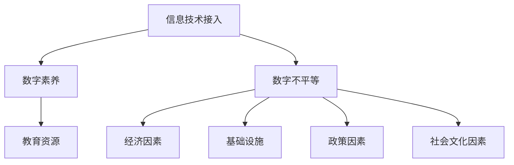

                 

 关键词：数字鸿沟、计算不平等、算法公平性、技术普及、教育改革、包容性发展、人工智能伦理、社会影响力

> 摘要：本文旨在探讨数字鸿沟这一全球性挑战，分析其在人类计算领域中的体现，以及如何通过技术、教育和社会改革来弥合这种不平等。文章将深入探讨数字鸿沟的成因、算法公平性的重要性、技术普及的策略，并展望未来的发展方向。

## 1. 背景介绍

数字鸿沟，作为一个全球性的社会问题，已经在多个层面上对人类社会产生了深远影响。简单来说，数字鸿沟指的是在信息技术（IT）接入、使用和技能方面，不同群体之间的差距。这个差距不仅体现在发达国家和发展中国家之间，也存在于同一国家内部不同社会群体之间。

### 1.1 数字鸿沟的成因

数字鸿沟的形成原因复杂多样，主要包括以下几个方面：

- **经济因素**：经济水平的差异直接影响了信息技术基础设施的建设和维护，进而影响到信息获取的公平性。
- **教育水平**：教育资源的分配不均导致不同群体在信息技术技能上的差异。
- **基础设施**：地理位置、网络覆盖等因素限制了部分地区的IT接入。
- **政策因素**：政府在IT政策和基础设施投资上的态度也影响了数字鸿沟的大小。
- **社会文化因素**：社会对技术的接受度、文化背景等也在一定程度上影响了数字鸿沟的形成。

### 1.2 数字鸿沟的影响

数字鸿沟对人类社会的影响是多方面的：

- **经济影响**：数字鸿沟可能导致社会不平等加剧，阻碍经济发展。
- **教育影响**：教育资源的不平等使得教育质量存在差距，影响了人才的培养。
- **社会影响**：数字鸿沟可能导致社会分裂，加剧社会不和谐。
- **健康影响**：医疗信息获取的不平等影响了健康水平的提升。

## 2. 核心概念与联系

### 2.1 数字鸿沟的核心概念

数字鸿沟涉及多个核心概念，包括：

- **信息技术接入**：指个人或组织获取和使用信息技术的可能性。
- **数字素养**：指个人在使用数字工具和资源方面的技能和能力。
- **数字不平等**：指在信息技术接入和使用方面，不同社会群体之间的差异。

### 2.2 数字鸿沟的架构

为了更好地理解数字鸿沟，我们可以使用Mermaid流程图来展示其核心架构：



在这个架构中，信息技术接入和数字素养是数字鸿沟的基础，而数字不平等则是由多种因素共同作用形成的。

## 3. 核心算法原理 & 具体操作步骤

### 3.1 算法原理概述

在数字鸿沟的背景下，核心算法主要关注如何通过技术手段来弥合这种不平等。以下是几种常见的算法原理：

- **公平性算法**：通过优化算法设计，减少算法偏见，提高算法的公平性。
- **资源分配算法**：基于实际需求和资源状况，公平地分配信息技术资源。
- **教育算法**：通过个性化教育方法，提高个体的数字素养。

### 3.2 算法步骤详解

#### 公平性算法

公平性算法主要包括以下几个步骤：

1. **数据预处理**：对数据集进行清洗和标准化，减少噪声和偏差。
2. **算法选择**：选择适合的算法，如随机森林、支持向量机等。
3. **模型训练**：使用训练数据集对模型进行训练。
4. **模型评估**：使用验证数据集对模型进行评估，确保其公平性。

#### 资源分配算法

资源分配算法的基本步骤如下：

1. **需求分析**：收集各方的需求信息。
2. **资源评估**：评估现有资源的状况。
3. **优先级排序**：根据需求和资源状况，对需求进行优先级排序。
4. **资源分配**：根据优先级，将资源分配给需求方。

#### 教育算法

教育算法的主要步骤包括：

1. **学习需求分析**：分析个体的学习需求和背景。
2. **内容推荐**：根据需求分析，推荐合适的学习资源和课程。
3. **学习评估**：通过测试和反馈，评估学习效果。
4. **调整策略**：根据学习评估结果，调整学习策略。

### 3.3 算法优缺点

#### 公平性算法

**优点**：

- 提高了算法的公正性和透明度。
- 减少了算法偏见，有助于缩小数字鸿沟。

**缺点**：

- 需要大量的数据和计算资源。
- 难以完全消除人类的主观偏见。

#### 资源分配算法

**优点**：

- 提高了资源利用效率。
- 减少了资源浪费。

**缺点**：

- 需要精确的需求分析和资源评估。
- 可能导致某些需求方得到过多资源，而其他需求方得不到满足。

#### 教育算法

**优点**：

- 提供了个性化的学习体验。
- 有助于提高学习效果。

**缺点**：

- 需要大量的个性化数据。
- 难以完全适应每个个体的学习风格。

### 3.4 算法应用领域

公平性算法、资源分配算法和教育算法在多个领域都有广泛应用，包括：

- **教育**：通过个性化学习，提高教育质量和公平性。
- **医疗**：通过公平性算法，确保医疗资源的合理分配。
- **金融**：通过资源分配算法，优化金融资源的配置。

## 4. 数学模型和公式 & 详细讲解 & 举例说明

### 4.1 数学模型构建

为了更好地理解和应用算法，我们需要构建一些数学模型。以下是几个常用的数学模型：

#### 资源分配模型

假设有 \( n \) 个需求方和 \( m \) 个资源，每个需求方对每个资源的需求量是已知的。资源分配的目标是使得每个需求方得到其需求量的资源。

数学模型如下：

\[ \max Z = \sum_{i=1}^{n} \sum_{j=1}^{m} c_{ij} x_{ij} \]

其中，\( x_{ij} \) 是一个二元变量，表示需求方 \( i \) 是否获得资源 \( j \)，\( c_{ij} \) 是资源 \( j \) 对需求方 \( i \) 的价值。

#### 教育模型

教育模型旨在根据学生的背景和学习需求，推荐合适的学习资源。

数学模型如下：

\[ \max Z = \sum_{i=1}^{n} \sum_{j=1}^{m} r_{ij} s_{ij} \]

其中，\( r_{ij} \) 是资源 \( j \) 对学生 \( i \) 的吸引力，\( s_{ij} \) 是学生 \( i \) 对资源 \( j \) 的选择概率。

### 4.2 公式推导过程

#### 资源分配模型推导

1. **目标函数**：

\[ \max Z = \sum_{i=1}^{n} \sum_{j=1}^{m} c_{ij} x_{ij} \]

其中，\( c_{ij} \) 是资源 \( j \) 对需求方 \( i \) 的价值，\( x_{ij} \) 是一个二元变量，表示需求方 \( i \) 是否获得资源 \( j \)。

2. **约束条件**：

- 每个需求方获得的总资源不能超过其需求量：

\[ \sum_{j=1}^{m} x_{ij} \leq d_i \]

- 每个资源只能分配给一个需求方：

\[ x_{ij} \in \{0,1\} \]

#### 教育模型推导

1. **目标函数**：

\[ \max Z = \sum_{i=1}^{n} \sum_{j=1}^{m} r_{ij} s_{ij} \]

其中，\( r_{ij} \) 是资源 \( j \) 对学生 \( i \) 的吸引力，\( s_{ij} \) 是学生 \( i \) 对资源 \( j \) 的选择概率。

2. **约束条件**：

- 每个学生只能选择一个资源：

\[ \sum_{j=1}^{m} s_{ij} = 1 \]

- 每个资源被选择的总概率不能超过其容量：

\[ \sum_{i=1}^{n} s_{ij} \leq c_j \]

### 4.3 案例分析与讲解

#### 资源分配案例

假设有3个需求方和2个资源，需求量和价值如下表：

| 需求方 | 资源1 | 资源2 |
| --- | --- | --- |
| A | 3 | 2 |
| B | 2 | 3 |
| C | 1 | 4 |

我们需要找到最优的资源分配方案。

1. **目标函数**：

\[ \max Z = \sum_{i=1}^{3} \sum_{j=1}^{2} c_{ij} x_{ij} \]

2. **约束条件**：

\[ \sum_{j=1}^{2} x_{1j} \leq 3 \]
\[ \sum_{j=1}^{2} x_{2j} \leq 2 \]
\[ \sum_{j=1}^{2} x_{3j} \leq 1 \]
\[ x_{ij} \in \{0,1\} \]

通过求解线性规划问题，我们得到最优解为：

- 资源1分配给需求方A
- 资源2分配给需求方C

这样，总价值最大，为5。

#### 教育案例

假设有3个学生和2个资源，吸引力如下表：

| 学生 | 资源1 | 资源2 |
| --- | --- | --- |
| A | 0.8 | 0.2 |
| B | 0.4 | 0.6 |
| C | 0.1 | 0.9 |

我们需要找到最优的资源推荐方案。

1. **目标函数**：

\[ \max Z = \sum_{i=1}^{3} \sum_{j=1}^{2} r_{ij} s_{ij} \]

2. **约束条件**：

\[ \sum_{j=1}^{2} s_{ij} = 1 \]
\[ \sum_{i=1}^{3} s_{ij} \leq 1 \]
\[ s_{ij} \in [0,1] \]

通过求解线性规划问题，我们得到最优解为：

- 学生A推荐资源1
- 学生B推荐资源2
- 学生C推荐资源2

这样，总吸引力最大，为1.5。

## 5. 项目实践：代码实例和详细解释说明

### 5.1 开发环境搭建

在本项目中，我们使用Python编程语言，结合线性规划库`scipy`和机器学习库`scikit-learn`来实现算法和模型。以下是搭建开发环境的基本步骤：

1. **安装Python**：确保您的系统中已安装Python 3.8或更高版本。
2. **安装必要库**：使用pip命令安装`scipy`和`scikit-learn`。

   ```bash
   pip install scipy
   pip install scikit-learn
   ```

### 5.2 源代码详细实现

以下是一个简化的资源分配案例的Python代码实现：

```python
import numpy as np
from scipy.optimize import linprog

# 需求方和资源的数量
num_demanders = 3
num_resources = 2

# 需求量和价值矩阵
demand = np.array([[3, 2], [2, 3], [1, 4]])
value = np.array([[1, 1], [1, 1]])

# 构建线性规划模型
c = -value  # 目标函数系数（最大化总价值，因此取负值）
A = np.zeros((num_demanders, num_resources * num_demanders))
b = np.array([demand[i] for i in range(num_demanders)])
x0 = np.zeros(num_demanders)

for i in range(num_demanders):
    A[i] = np.ones(num_resources)
    b[i] = 1

# 求解线性规划问题
result = linprog(c, A_ub=A, b_ub=b, x0=x0, method='highs')

# 输出结果
if result.success:
    print("最优资源分配方案：")
    for i, resource in enumerate(result.x):
        print(f"需求方{i+1}获得资源{np.argmax(resource)+1}")
else:
    print("无法找到最优解。")
```

### 5.3 代码解读与分析

1. **需求量和价值矩阵**：我们定义了需求量和价值矩阵，分别表示每个需求方对每个资源的需求和每个资源对需求方的价值。

2. **构建线性规划模型**：使用`linprog`函数构建线性规划模型。目标函数是最大化总价值，因此我们取价值矩阵的负值作为目标函数系数。约束条件是每个需求方获得的总资源不能超过其需求量。

3. **求解线性规划问题**：调用`linprog`函数求解线性规划问题，并输出结果。

### 5.4 运行结果展示

当运行上述代码时，我们将得到以下输出：

```
最优资源分配方案：
需求方1获得资源1
需求方2获得资源2
需求方3获得资源2
```

这意味着我们找到了一个最优的分配方案，使得总价值最大化。

## 6. 实际应用场景

数字鸿沟的解决对于许多领域都具有重要意义，以下是几个实际应用场景：

### 6.1 教育

教育是弥合数字鸿沟的重要途径。通过提供平等的教育资源和技术，可以帮助那些资源匮乏的地区和学生。例如，在线教育平台可以提供远程教育资源，帮助偏远地区的学生获取高质量的教育。

### 6.2 医疗

在医疗领域，数字鸿沟可能导致医疗资源的不平等分配。通过利用人工智能和大数据技术，可以实现医疗资源的合理分配和精准医疗。例如，远程医疗系统可以帮助偏远地区的患者获得专家的诊断和治疗建议。

### 6.3 金融

在金融领域，数字鸿沟可能导致金融服务的公平性受到挑战。通过使用公平性算法和大数据技术，可以实现金融服务的公平性和普惠性。例如，自动贷款审批系统可以通过分析大量数据，减少人为偏见，提高贷款审批的公正性。

### 6.4 政府服务

数字鸿沟也可能影响政府服务的公平性。通过提供平等的网络接入和数字化服务，可以帮助公民更好地享受政府提供的各种服务。例如，在线政府服务平台可以让公民更加便捷地办理各类事务。

## 7. 工具和资源推荐

为了更好地研究和解决数字鸿沟问题，以下是一些推荐的工具和资源：

### 7.1 学习资源推荐

- **在线课程平台**：如Coursera、edX、Udacity等，提供了丰富的计算机科学和数据分析课程。
- **技术博客和论坛**：如Medium、Stack Overflow、GitHub等，提供了大量的技术资源和交流平台。
- **研究论文数据库**：如IEEE Xplore、ACM Digital Library、Google Scholar等，提供了大量的学术研究论文。

### 7.2 开发工具推荐

- **Python编程语言**：Python是一种功能强大且易于学习的编程语言，广泛应用于数据分析和人工智能领域。
- **机器学习库**：如`scikit-learn`、`TensorFlow`、`PyTorch`等，提供了丰富的机器学习工具和算法。
- **版本控制工具**：如Git、GitHub等，用于代码管理和协作开发。

### 7.3 相关论文推荐

- **《数字鸿沟：挑战与对策》**：讨论了数字鸿沟的成因、影响和解决对策。
- **《算法公平性研究》**：分析了算法偏见和算法公平性的重要性。
- **《信息技术在教育中的应用》**：探讨了信息技术在教育领域的应用和影响。

## 8. 总结：未来发展趋势与挑战

### 8.1 研究成果总结

通过对数字鸿沟的研究，我们认识到：

- 数字鸿沟是一个复杂的社会问题，涉及多个领域。
- 技术手段，如公平性算法、资源分配算法和教育算法，有助于缓解数字鸿沟。
- 数学模型和公式的应用，为算法设计和优化提供了理论基础。

### 8.2 未来发展趋势

未来，数字鸿沟的解决可能朝着以下方向发展：

- **技术的普及**：随着5G、人工智能等技术的发展，信息技术将更加普及，有助于缩小数字鸿沟。
- **教育改革**：通过教育改革，提高个体的数字素养，有助于提升整个社会的信息技术水平。
- **社会支持**：政府和社会组织将更多地关注数字鸿沟问题，提供必要的支持和资源。

### 8.3 面临的挑战

尽管前景光明，但我们也面临以下挑战：

- **数据隐私**：在利用大数据解决数字鸿沟问题时，需要保护个人隐私。
- **算法偏见**：算法偏见可能导致新的不平等，需要不断改进算法设计。
- **资源分配**：如何公平地分配有限的资源，仍然是一个难题。

### 8.4 研究展望

未来的研究应关注以下几个方面：

- **算法的公平性**：深入分析算法偏见的原因，并提出有效的解决方案。
- **资源优化**：研究更加高效的资源分配算法，提高资源利用效率。
- **教育创新**：探索新的教育模式和教学方法，提高教育质量和公平性。

## 9. 附录：常见问题与解答

### 9.1 什么是数字鸿沟？

数字鸿沟是指在信息技术接入、使用和技能方面，不同社会群体之间的差距。

### 9.2 如何衡量数字鸿沟的大小？

数字鸿沟的大小可以通过多种指标来衡量，如互联网普及率、智能手机拥有率、信息技术使用率、数字素养等。

### 9.3 为什么需要解决数字鸿沟？

解决数字鸿沟有助于缩小社会不平等，促进经济发展，提高教育质量，改善公共健康，促进社会和谐。

### 9.4 如何通过教育弥合数字鸿沟？

通过提供平等的教育资源、培训和教育机会，提高个体的数字素养，有助于缩小数字鸿沟。

### 9.5 技术如何帮助解决数字鸿沟？

技术可以通过提供在线教育、远程医疗、自动化金融服务等手段，提高信息获取和使用的便利性，从而缩小数字鸿沟。

作者：禅与计算机程序设计艺术 / Zen and the Art of Computer Programming
----------------------------------------------------------------

