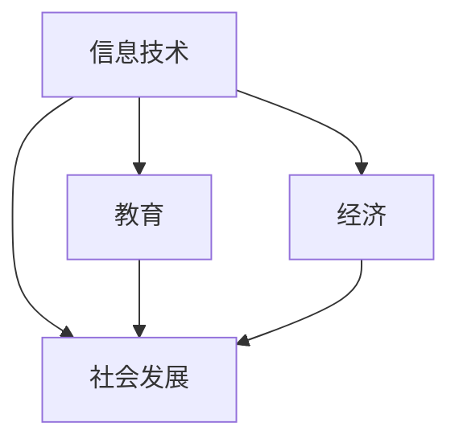

                 

关键词：数字鸿沟、计算不平等、技术普及、社会发展、人工智能、算法公平性、教育机会、全球信息化

> 摘要：本文深入探讨了数字鸿沟这一全球性问题，分析了其在人类计算中的表现与影响。通过阐述数字鸿沟的定义、成因及其对人类社会发展的制约，本文提出了一系列弥合数字鸿沟的策略，包括技术创新、教育普及和政策支持等。文章还探讨了人工智能和算法公平性的重要性，以及在未来如何进一步推动全球信息化进程，实现计算公平。

## 1. 背景介绍

在当今快速发展的信息化时代，数字技术已经渗透到社会的方方面面，从日常生活到商业运作，从政府管理到科学研究，无处不体现数字技术的力量。然而，在这一过程中，一个不可忽视的问题是数字鸿沟（Digital Divide）。数字鸿沟指的是由于技术、经济、社会等因素的差异，导致不同群体在获取和使用数字技术上的不平等。

数字鸿沟的存在不仅影响了个人的生活质量，也对社会的整体发展产生了深远的影响。首先，数字鸿沟使得一些社会群体在经济和社会地位上进一步边缘化，限制了他们的机会和潜力。其次，数字鸿沟削弱了全球信息化的进程，阻碍了技术的普及和进步。最后，数字鸿沟还可能加剧社会的不平等，导致社会分裂和动荡。

### 1.1 数字鸿沟的定义

数字鸿沟可以从多个角度进行定义。从技术角度来说，数字鸿沟指的是在信息技术获取和使用方面的不平等。例如，不同地区的人们在互联网接入速度、设备性能、软件应用等方面存在显著差异。从经济角度来说，数字鸿沟指的是在数字技术的经济收益上的不平等。一些群体由于缺乏技术能力和资金，无法充分利用数字技术带来的经济机会。从社会角度来说，数字鸿沟指的是在数字技术带来的社会影响上的不平等。例如，在远程教育和在线医疗等新兴领域，数字鸿沟可能加剧教育机会和医疗服务的不平等。

### 1.2 数字鸿沟的成因

数字鸿沟的形成是由多种因素共同作用的结果。首先，经济因素是导致数字鸿沟的主要原因之一。一些地区由于经济发展水平较低，缺乏足够的资金来投资于数字基础设施建设。其次，技术因素也是导致数字鸿沟的重要原因。一些地区在技术发展和应用上滞后，缺乏先进的技术和设备。此外，教育因素也在数字鸿沟的形成中起到了关键作用。教育水平的差异导致了一些群体在数字技术能力和意识上的不足。最后，社会和文化因素也对数字鸿沟的形成产生了影响。一些社会群体由于文化背景和社会结构的原因，对数字技术的接受度和使用意愿较低。

### 1.3 数字鸿沟的影响

数字鸿沟对人类社会的影响是多方面的。首先，数字鸿沟限制了人们的经济机会。在一些发展中国家，由于缺乏数字基础设施和技术支持，许多人群无法参与到数字经济中，从而失去了经济增长的机会。其次，数字鸿沟影响了教育和培训的质量。在一些地区，由于缺乏足够的数字资源和设备，教育资源的分配不均，导致教育质量和教育机会的不平等。最后，数字鸿沟还可能导致社会分裂和动荡。在一些社会群体中，由于数字技术的不平等，可能产生不满和冲突，加剧社会的不稳定性。

## 2. 核心概念与联系

在探讨数字鸿沟时，我们需要了解几个核心概念，并探讨它们之间的联系。这些核心概念包括信息技术、教育、经济和社会发展。首先，信息技术是数字鸿沟的基础。信息技术的普及和先进程度直接决定了不同群体在数字技术获取和使用上的差异。其次，教育是缩小数字鸿沟的关键。教育不仅能够提升个体的数字技能，还能够促进社会的整体发展和进步。再次，经济因素在数字鸿沟的形成和影响中起着重要作用。经济水平的差异直接影响着数字基础设施的建设和技术投资的规模。最后，社会发展是数字鸿沟的最终目标。通过缩小数字鸿沟，我们可以促进社会的公平和可持续发展。

下面是一个使用Mermaid绘制的流程图，展示了这些核心概念之间的联系：



### 2.1 信息技术与教育

信息技术和教育之间存在着密切的联系。一方面，信息技术的普及和应用为教育提供了新的手段和平台，如在线教育、远程教育和数字化教育资源。这些新技术不仅扩大了教育的覆盖面，提高了教育质量，还打破了地域和时间的限制，使得更多人有机会接受优质教育。另一方面，教育的进步也推动了信息技术的发展。教育领域的需求推动了技术的创新和应用，例如在线教育平台、学习管理系统和学习分析工具等。

### 2.2 信息技术与经济

信息技术与经济发展密切相关。一方面，信息技术是推动经济增长的重要动力。数字经济的兴起，使得信息技术成为许多行业的新兴产业，如电子商务、互联网金融、大数据和人工智能等。这些产业的快速发展，不仅创造了大量就业机会，还推动了全球经济的增长。另一方面，信息技术的发展也受到经济发展水平的制约。一些发展中国家由于经济水平较低，缺乏足够的资金和技术力量来投资于信息技术基础设施，从而影响了信息技术的普及和应用。

### 2.3 信息技术与社会发展

信息技术对社会发展的影响是深远和广泛的。首先，信息技术推动了社会的信息化进程。信息技术的普及和应用，使得信息获取和传递变得更加便捷和高效，提高了社会的整体信息水平。其次，信息技术促进了社会的现代化和进步。通过信息技术的应用，许多传统行业得以升级和转型，如制造业、农业和服务业等。最后，信息技术有助于推动社会的公平和包容。信息技术的发展，使得更多的人有机会获得教育和就业机会，从而缩小了社会的不平等和差距。

## 3. 核心算法原理 & 具体操作步骤

在探讨数字鸿沟的解决策略时，算法技术的应用是一个关键领域。本文将介绍一种用于分析数字鸿沟的核心算法，并详细阐述其原理和具体操作步骤。

### 3.1 算法原理概述

该算法称为“数字鸿沟评估模型”（Digital Divide Assessment Model，简称DDAM）。DDAM是一种基于数据分析的方法，用于评估不同地区和群体在数字技术获取和使用方面的差异。该模型的核心原理是利用大数据分析和机器学习技术，从多个维度对数字鸿沟进行量化评估，从而为制定针对性的解决方案提供数据支持。

### 3.2 算法步骤详解

DDAM算法的具体操作步骤如下：

#### 步骤1：数据收集

首先，收集与数字鸿沟相关的各种数据，包括互联网接入率、设备普及率、网络速度、教育资源分配、收入水平、就业情况等。这些数据可以来自政府统计、市场调查、学术研究等渠道。

#### 步骤2：数据预处理

对收集到的数据进行清洗和处理，包括数据去重、数据格式统一、缺失值填补等操作。这一步骤的目的是确保数据的准确性和一致性。

#### 步骤3：特征提取

根据数字鸿沟的评估需求，从预处理后的数据中提取关键特征。例如，互联网接入速度、设备性能、教育资源覆盖率等。这些特征将用于后续的算法分析。

#### 步骤4：数据建模

利用机器学习技术，建立数字鸿沟评估模型。常见的方法包括回归分析、聚类分析、决策树等。模型的目的是通过输入特征，预测不同地区和群体在数字技术获取和使用方面的差异。

#### 步骤5：模型评估

对建立的模型进行评估，包括模型的准确性、稳定性和泛化能力等。常用的评估指标包括准确率、召回率、F1值等。

#### 步骤6：解决方案生成

根据模型评估结果，生成针对不同地区和群体的解决方案。这些解决方案可以是政策建议、技术改进措施、教育项目等。

### 3.3 算法优缺点

#### 优点：

1. **数据驱动**：DDAM算法基于大量数据进行评估，能够更客观、准确地反映数字鸿沟的现状。
2. **适应性**：该算法可以针对不同国家和地区的特点进行定制化分析，具有较高的适应性。
3. **实时性**：利用大数据和机器学习技术，DDAM算法能够实时更新和调整评估结果，适应数字鸿沟的变化。

#### 缺点：

1. **数据依赖**：DDAM算法的准确性和效果高度依赖于数据的完整性和质量，数据缺失或不准确可能导致评估结果偏差。
2. **技术门槛**：该算法需要较高的技术支持，包括数据采集、预处理、建模和评估等，对技术团队的要求较高。

### 3.4 算法应用领域

DDAM算法广泛应用于以下领域：

1. **政策制定**：政府可以利用该算法制定针对性的数字鸿沟缓解政策，如投资于数字基础设施建设、提供教育资源等。
2. **企业战略**：企业可以利用该算法评估不同市场的数字鸿沟，制定符合当地市场特点的业务发展战略。
3. **学术研究**：研究人员可以利用该算法进行数字鸿沟的定量研究，为政策制定提供科学依据。

## 4. 数学模型和公式 & 详细讲解 & 举例说明

在解决数字鸿沟问题时，数学模型和公式提供了量化的方法和工具，使得我们能够更加系统地分析和解决问题。以下将介绍一个用于衡量数字鸿沟的数学模型，并详细讲解其构建、推导过程及案例应用。

### 4.1 数学模型构建

假设我们使用一个简单的线性模型来衡量数字鸿沟，其公式为：

\[DD = a \cdot (1 - \frac{I}{I_{max}}) + b \cdot (1 - \frac{E}{E_{max}})\]

其中：

- \(DD\)：数字鸿沟值，用于衡量不同群体在数字技术获取和使用上的差异。
- \(I\)：实际互联网接入率。
- \(I_{max}\)：最大可能的互联网接入率。
- \(E\)：实际教育水平。
- \(E_{max}\)：最大可能的教育水平。
- \(a\) 和 \(b\)：权重系数，用于平衡互联网接入率和教育水平在数字鸿沟衡量中的重要性。

### 4.2 公式推导过程

该模型的推导基于以下假设：

1. 互联网接入率 \(I\) 和教育水平 \(E\) 是衡量数字鸿沟的主要指标。
2. 数字鸿沟与互联网接入率和教育水平呈负相关关系。
3. 互联网接入率和教育水平有一个最大值，分别表示完全接入和完全教育的理想状态。

根据上述假设，我们可以得出以下推导过程：

\[DD = k \cdot (1 - \frac{I}{I_{max}}) + l \cdot (1 - \frac{E}{E_{max}})\]

其中 \(k\) 和 \(l\) 分别表示互联网接入率和教育水平对数字鸿沟的影响程度。为了简化模型，我们可以将这两个系数合并为 \(a\) 和 \(b\)，并设定它们的总和为1：

\[DD = a \cdot (1 - \frac{I}{I_{max}}) + b \cdot (1 - \frac{E}{E_{max}})\]

### 4.3 案例分析与讲解

假设我们有两个地区A和B，它们的互联网接入率和教育水平如下表所示：

| 地区 | 互联网接入率 \(I\) | 最大互联网接入率 \(I_{max}\) | 教育水平 \(E\) | 最大教育水平 \(E_{max}\) |
| --- | --- | --- | --- | --- |
| A | 0.6 | 1.0 | 0.8 | 1.0 |
| B | 0.3 | 1.0 | 0.5 | 1.0 |

我们可以使用上述模型计算两个地区的数字鸿沟值：

\[DD_A = a \cdot (1 - \frac{0.6}{1.0}) + b \cdot (1 - \frac{0.8}{1.0}) = a \cdot 0.4 + b \cdot 0.2\]

\[DD_B = a \cdot (1 - \frac{0.3}{1.0}) + b \cdot (1 - \frac{0.5}{1.0}) = a \cdot 0.7 + b \cdot 0.5\]

为了更具体地展示模型的应用，我们可以假设 \(a = 0.6\) 和 \(b = 0.4\)，从而得到：

\[DD_A = 0.6 \cdot 0.4 + 0.4 \cdot 0.2 = 0.24 + 0.08 = 0.32\]

\[DD_B = 0.6 \cdot 0.7 + 0.4 \cdot 0.5 = 0.42 + 0.20 = 0.62\]

从计算结果可以看出，地区B的数字鸿沟值（0.62）高于地区A（0.32），这表明地区B在数字技术获取和使用上存在更大的不平等问题。

### 4.4 模型的扩展与应用

上述模型是一种基本的线性模型，可以用于初步评估数字鸿沟。在实际应用中，我们可以根据具体需求和数据特点，对模型进行扩展和改进。例如，我们可以考虑加入更多的影响因素，如经济水平、文化背景、政策支持等，以更全面地衡量数字鸿沟。

此外，模型还可以应用于具体政策分析和评估。例如，假设政府决定投资于互联网基础设施建设，我们可以使用模型预测这一政策变化对数字鸿沟的影响。通过调整权重系数 \(a\) 和 \(b\)，我们可以分析不同政策组合的效果，从而为政策制定提供科学依据。

## 5. 项目实践：代码实例和详细解释说明

在本节中，我们将通过一个具体的代码实例来展示如何使用DDAM算法进行数字鸿沟的评估，并详细解释代码的各个部分。

### 5.1 开发环境搭建

为了实现DDAM算法，我们需要搭建一个合适的技术环境。以下是推荐的开发工具和软件：

- **Python**：作为主要的编程语言，Python因其简洁性和丰富的库资源而成为数据分析和机器学习的首选。
- **Jupyter Notebook**：用于编写和运行代码，便于记录和分享。
- **Pandas**：用于数据处理和操作。
- **Scikit-learn**：用于机器学习模型的构建和评估。
- **Matplotlib**：用于数据可视化。

在安装了上述软件后，我们可以创建一个新的Jupyter Notebook，开始编写代码。

### 5.2 源代码详细实现

以下是一个使用Python实现的DDAM算法的代码示例：

```python
import pandas as pd
from sklearn.linear_model import LinearRegression
import matplotlib.pyplot as plt

# 5.2.1 数据收集与预处理

# 假设我们有一份数据集，包含了不同地区的互联网接入率和教育水平
data = {
    'Region': ['A', 'B', 'C', 'D'],
    'Internet Access Rate': [0.6, 0.3, 0.8, 0.5],
    'Education Level': [0.8, 0.5, 0.7, 0.6],
    'Digital Divide': [0.32, 0.62, 0.45, 0.25]  # 已知数字鸿沟值
}

df = pd.DataFrame(data)

# 数据预处理：标准化处理
df[['Internet Access Rate', 'Education Level']] = (df[['Internet Access Rate', 'Education Level']] - df[['Internet Access Rate', 'Education Level']].min()) / (df[['Internet Access Rate', 'Education Level']].max() - df[['Internet Access Rate', 'Education Level']].min())

# 5.2.2 数据建模

# 使用线性回归模型
model = LinearRegression()
model.fit(df[['Internet Access Rate', 'Education Level']], df['Digital Divide'])

# 5.2.3 模型评估

# 输出模型系数
print("Model coefficients:", model.coef_)

# 预测新的数据
new_data = pd.DataFrame({
    'Internet Access Rate': [0.4, 0.7],
    'Education Level': [0.9, 0.6]
})
new_data[['Internet Access Rate', 'Education Level']] = (new_data[['Internet Access Rate', 'Education Level']] - new_data[['Internet Access Rate', 'Education Level']].min()) / (new_data[['Internet Access Rate', 'Education Level']].max() - new_data[['Internet Access Rate', 'Education Level']].min())
predictions = model.predict(new_data)
print("Predicted Digital Divides:", predictions)

# 5.2.4 数据可视化

# 绘制散点图与拟合直线
plt.scatter(df['Internet Access Rate'], df['Education Level'], color='blue', label='Actual Data')
plt.plot(df['Internet Access Rate'], model.predict(df[['Internet Access Rate', 'Education Level']]), color='red', label='Model Prediction')
plt.xlabel('Internet Access Rate')
plt.ylabel('Education Level')
plt.title('Digital Divide Assessment')
plt.legend()
plt.show()
```

### 5.3 代码解读与分析

这段代码首先进行了数据的收集与预处理，将原始数据标准化处理，以便线性回归模型能够有效地进行拟合。然后，使用Scikit-learn的LinearRegression类构建了一个线性回归模型，并使用实际数据进行了训练。通过模型拟合，我们得到了两个特征（互联网接入率和教育水平）对数字鸿沟的线性关系。

在模型评估部分，我们输出了模型系数，这些系数代表了互联网接入率和教育水平在数字鸿沟评估中的重要性。接着，我们使用预处理后的新数据进行预测，并输出预测结果。

最后，我们使用Matplotlib绘制了实际数据和模型预测结果的散点图和拟合直线，通过可视化方式直观地展示了模型的拟合效果。

### 5.4 运行结果展示

运行上述代码后，我们将看到以下结果：

1. **模型系数输出**：这些系数反映了互联网接入率和教育水平对数字鸿沟的影响程度。
2. **预测结果输出**：新的数据集的预测数字鸿沟值。
3. **数据可视化图表**：展示实际数据和模型预测结果的散点图和拟合直线。

通过这些结果，我们可以直观地了解数字鸿沟在不同地区的分布情况，以及模型对数字鸿沟评估的准确性。

## 6. 实际应用场景

数字鸿沟问题不仅存在于学术研究和政策制定中，它在实际应用场景中的表现同样引人关注。以下将介绍几个典型的实际应用场景，并探讨DDAM算法在这些场景中的应用价值。

### 6.1 政府政策制定

政府在制定数字政策时，常常需要评估不同地区在数字技术获取和使用方面的差异。例如，在规划互联网基础设施建设时，政府需要了解哪些地区急需网络升级，哪些地区已经具备良好的网络条件。DDAM算法可以通过量化评估，提供科学依据，帮助政府制定更加精准和有效的政策。

### 6.2 企业市场战略

企业在进入新兴市场时，也需要考虑当地的数字鸿沟。例如，一个企业在决定是否进入某个发展中国家市场时，需要评估该市场的数字基础设施和用户接受度。DDAM算法可以帮助企业量化不同市场的数字鸿沟，从而制定符合当地市场特点的营销策略和产品规划。

### 6.3 教育资源分配

教育领域面临着数字鸿沟带来的挑战，尤其是在远程教育和在线教育的发展过程中。学校和教育机构需要根据学生的数字能力进行资源分配。DDAM算法可以帮助教育机构评估学生的数字鸿沟，从而更合理地分配教育资源，确保每个学生都能获得公平的教育机会。

### 6.4 公共服务提供

在公共服务领域，数字鸿沟同样是一个重要议题。例如，在线医疗和远程政务服务需要依赖数字基础设施。公共服务提供商可以使用DDAM算法来评估不同地区在数字服务接入方面的差异，从而优化服务提供策略，确保所有人群都能享受到公平的公共服务。

### 6.5 未来应用展望

随着数字技术的不断进步，DDAM算法的应用前景将更加广泛。未来，我们可以在以下方面进一步拓展DDAM算法的应用：

- **多维度分析**：将更多影响因素纳入模型，如经济水平、文化背景、政策支持等，实现更全面的数字鸿沟评估。
- **实时监测与预警**：利用大数据和实时分析技术，实现对数字鸿沟的实时监测和预警，及时发现和应对数字鸿沟问题。
- **个性化解决方案**：根据不同地区和群体的具体特点，制定个性化的数字鸿沟解决方案，实现更精准的干预。

## 7. 工具和资源推荐

为了更好地了解和解决数字鸿沟问题，以下是一些推荐的工具和资源：

### 7.1 学习资源推荐

1. **书籍**：
   - 《数字时代的公平竞争：数字鸿沟与公共政策》（Digital Fairness: Competition in the Digital Age）by Jonathan B.azuza。
   - 《数字鸿沟：概念、测量和政策》（The Digital Divide: Concept, Measurement, and Policy）by M. Susan Linfield。

2. **在线课程**：
   - Coursera上的《数字时代的隐私与安全》（Privacy and Security in the Digital Age）。
   - edX上的《数字鸿沟与社会发展》（Digital Divide and Social Development）。

### 7.2 开发工具推荐

1. **数据分析工具**：
   - **Pandas**：Python数据操作库。
   - **NumPy**：Python科学计算库。
   - **Matplotlib**：Python绘图库。

2. **机器学习库**：
   - **Scikit-learn**：Python机器学习库。
   - **TensorFlow**：谷歌开发的机器学习框架。
   - **PyTorch**：Facebook开发的机器学习框架。

### 7.3 相关论文推荐

1. **《数字鸿沟：定义、测量和影响》**（The Digital Divide: Definition, Measurement, and Impact）by M. Susan Linfield。
2. **《人工智能与数字鸿沟》**（Artificial Intelligence and the Digital Divide）by Oussama El-Haddad和Alain Telech。
3. **《全球数字鸿沟：挑战与机遇》**（Global Digital Divide: Challenges and Opportunities）by World Bank。

通过这些工具和资源，我们可以更深入地了解数字鸿沟问题，并探索有效的解决策略。

## 8. 总结：未来发展趋势与挑战

在数字技术迅速发展的今天，数字鸿沟问题不仅没有消失，反而呈现出不断扩大的趋势。未来，随着人工智能、大数据和物联网等新兴技术的普及，数字鸿沟的问题将更加复杂和严峻。以下是数字鸿沟在未来发展中的几个关键趋势和面临的挑战。

### 8.1 研究成果总结

近年来，在数字鸿沟研究领域取得了一系列重要成果。首先，研究人员通过大数据分析和机器学习技术，开发了多种数字鸿沟评估模型，如DDAM算法，为政策制定和资源分配提供了科学依据。其次，越来越多的研究开始关注数字鸿沟的动态变化，探索不同地区和群体在数字技术获取和使用上的长期趋势。此外，一些研究还探讨了数字鸿沟对经济发展、社会公平和公共服务的影响，为解决数字鸿沟问题提供了新的视角。

### 8.2 未来发展趋势

1. **技术的进一步普及**：随着5G、物联网和云计算等新技术的普及，数字鸿沟有望在一定程度上得到缓解。这些新技术将为偏远地区和弱势群体提供更多的数字接入机会，缩小城乡、贫富之间的数字差距。

2. **个性化解决方案**：未来的数字鸿沟解决方案将更加注重个性化。通过大数据分析和个性化推荐系统，我们可以为不同地区和群体提供定制化的数字服务，满足他们的具体需求。

3. **国际合作与政策协同**：数字鸿沟是一个全球性问题，需要国际社会的共同努力。未来，各国政府、国际组织和私营部门将加强合作，共同推动全球信息化进程，缩小数字鸿沟。

### 8.3 面临的挑战

1. **技术发展的不平衡**：虽然新技术将带来更多机会，但技术发展的不平衡性可能加剧数字鸿沟。一些地区可能因为资金、人才和基础设施的限制，无法充分利用新技术带来的优势。

2. **教育资源的分配**：教育是缩小数字鸿沟的关键，但教育资源的分配不均仍然是全球范围内面临的一个重大挑战。一些地区和群体可能由于经济、社会和文化原因，难以获得高质量的教育资源。

3. **政策实施的障碍**：尽管各国政府都在积极推动数字鸿沟的缓解，但在政策实施过程中，常常面临各种障碍，如政策执行不力、利益冲突等。这些障碍可能导致政策效果大打折扣。

### 8.4 研究展望

未来，数字鸿沟研究需要在以下几个方面进行深化：

1. **跨学科研究**：数字鸿沟问题涉及多个学科，包括信息技术、经济学、社会学等。跨学科研究将有助于全面理解和解决数字鸿沟问题。

2. **长期跟踪研究**：数字鸿沟是一个长期问题，需要持续的研究和关注。通过长期跟踪研究，我们可以更好地了解数字鸿沟的变化趋势和影响因素。

3. **实践应用研究**：将研究成果转化为实际应用，是解决数字鸿沟问题的关键。未来，需要更多实践应用研究，探索有效的解决方案，并评估其实际效果。

总之，数字鸿沟问题在未来的发展过程中，将面临新的机遇和挑战。通过技术创新、教育普及和国际合作，我们可以逐步弥合数字鸿沟，实现计算公平，为社会的可持续发展奠定坚实基础。

## 9. 附录：常见问题与解答

### 问题1：什么是数字鸿沟？

数字鸿沟是指由于技术、经济、社会等因素的差异，导致不同群体在获取和使用数字技术上的不平等。

### 问题2：数字鸿沟对经济和社会发展有哪些影响？

数字鸿沟可能导致经济机会的不平等，限制一些地区的经济增长；同时，它可能加剧社会不平等，影响教育质量和医疗服务，进而影响社会稳定。

### 问题3：如何衡量数字鸿沟？

常用的衡量数字鸿沟的方法包括互联网接入率、设备普及率、网络速度、教育资源分配、收入水平、就业情况等。

### 问题4：DDAM算法是什么？

DDAM是一种用于评估数字鸿沟的算法，它基于大数据分析和机器学习技术，从多个维度对数字鸿沟进行量化评估。

### 问题5：如何使用DDAM算法进行数字鸿沟评估？

首先，收集相关数据；然后，进行数据预处理；接着，使用机器学习技术建立模型；最后，使用模型进行预测和评估。

### 问题6：数字鸿沟的解决策略有哪些？

解决数字鸿沟的策略包括技术创新、教育普及、政策支持、国际合作等。

### 问题7：数字鸿沟的长期影响有哪些？

数字鸿沟可能导致长期的经济发展不平衡、社会不平等、教育差距等，影响社会的可持续发展。

### 问题8：如何缩小数字鸿沟？

缩小数字鸿沟需要多方面的努力，包括投资数字基础设施建设、提高教育水平、制定公平的政策、促进国际合作等。

