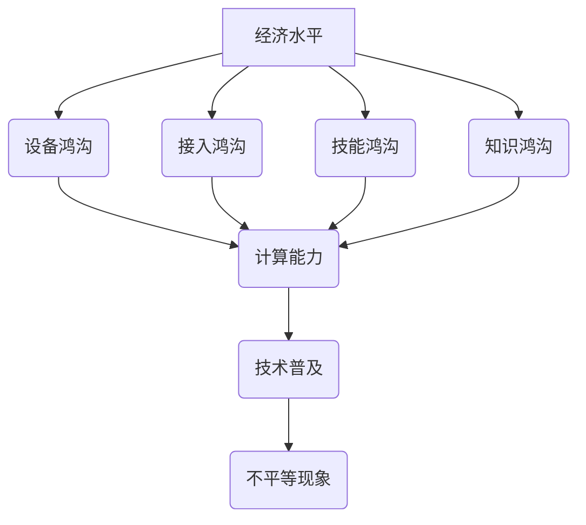

                 

关键词：数字鸿沟，不平等，计算能力，技术普及，解决方案

> 摘要：本文将探讨数字鸿沟这一全球性现象，分析其成因和影响，并探讨如何通过技术创新和政策支持来弥合这一鸿沟，实现人类计算中的公平与平等。

## 1. 背景介绍

在当今信息化时代，数字技术的快速发展极大地改变了人们的生活方式和工作方式。然而，与此同时，数字鸿沟这一现象也逐渐显现出来。数字鸿沟是指不同社会群体在获取、使用和管理信息通信技术（ICT）方面的差异。这些差异不仅体现在技术设备的拥有率和互联网接入程度上，还包括对技术的理解、技能和知识的掌握。

### 1.1 数字鸿沟的定义

数字鸿沟可以定义为：

- **设备鸿沟**：不同社会经济阶层在获取和拥有信息技术设备（如电脑、手机等）上的差异。
- **接入鸿沟**：不同地区或国家在互联网接入能力和质量上的差异。
- **技能鸿沟**：不同群体在信息技术应用技能方面的差异。
- **知识鸿沟**：不同社会经济阶层在获取、处理和应用信息知识上的差异。

### 1.2 数字鸿沟的成因

数字鸿沟的形成有多种原因，主要包括以下几点：

- **经济因素**：经济水平的差异直接导致了对信息技术设备和服务的购买能力的差异。
- **教育水平**：教育资源的分配不均导致了对信息技术理解和应用能力的差异。
- **地理位置**：偏远地区或经济发展较慢的地区在互联网基础设施和技术的普及上存在劣势。
- **政策因素**：政府的政策支持或缺乏对数字鸿沟的解决有重要影响。

## 2. 核心概念与联系

### 2.1 核心概念

为了更好地理解数字鸿沟，我们需要明确以下几个核心概念：

- **信息技术（ICT）**：包括计算机、互联网、移动通信等技术。
- **计算能力**：指计算机或人处理信息的能力，包括计算速度、存储能力和处理复杂度。
- **技术普及**：指信息技术在某一地区或国家内的普及程度。
- **不平等现象**：指在社会经济阶层、地理位置等方面存在的差异和不公平现象。

### 2.2 Mermaid 流程图



通过上述流程图，我们可以看到数字鸿沟的形成是一个多因素、多阶段的过程。这些核心概念之间的联系不仅帮助我们理解数字鸿沟的本质，也为解决这一问题提供了理论支持。

## 3. 核心算法原理 & 具体操作步骤

### 3.1 算法原理概述

为了弥合数字鸿沟，我们可以采用一些核心算法和技术。以下是一个简单的算法原理概述：

- **设备共享**：通过设备共享平台，让有设备的人可以出租或借出设备给没有设备的人。
- **远程教育**：利用互联网技术，提供在线教育资源和课程，让偏远地区的学生也能获得优质教育资源。
- **技能培训**：提供针对性的技能培训，帮助缺乏信息技术应用技能的人提升能力。

### 3.2 算法步骤详解

#### 3.2.1 设备共享

1. **建立设备共享平台**：搭建一个在线平台，提供设备共享服务。
2. **用户注册和认证**：用户在平台上注册并认证，确保身份真实。
3. **设备管理**：用户可以上传自己的设备信息，其他用户可以选择租用。
4. **交易和支付**：用户之间进行设备交易，平台收取一定的手续费。
5. **反馈和评价**：用户对交易进行评价，形成信用评价体系。

#### 3.2.2 远程教育

1. **课程开发**：开发适合远程教育的课程内容，包括视频教程、在线练习等。
2. **课程发布**：将课程发布到在线教育平台，用户可以通过平台进行学习。
3. **互动教学**：利用实时聊天工具、在线问答等功能，实现师生互动。
4. **学习评估**：通过在线测试、作业等方式，对学生的学习效果进行评估。
5. **反馈与改进**：根据学生的反馈，不断改进课程内容和教学方法。

#### 3.2.3 技能培训

1. **培训需求分析**：分析目标群体的技能需求，确定培训内容。
2. **培训课程设计**：根据需求设计培训课程，包括理论讲解、实践操作等。
3. **培训实施**：在线或线下开展培训课程，提供教学资源和技术支持。
4. **培训评估**：对培训效果进行评估，包括学员满意度、技能提升程度等。
5. **持续改进**：根据评估结果，不断优化培训课程和方法。

### 3.3 算法优缺点

#### 优点

- **提高资源利用率**：通过设备共享，提高了设备的利用率，减少了资源的浪费。
- **促进教育公平**：远程教育和技能培训让更多人有机会接受优质教育，提升了社会整体素质。
- **降低成本**：通过在线教育和技术支持，降低了教育成本，让更多人能够负担得起。

#### 缺点

- **技术依赖性**：过于依赖互联网技术，可能对一些偏远地区造成依赖性。
- **数据安全和隐私**：在线教育和技能培训涉及到大量个人信息和敏感数据，需要加强数据安全和隐私保护。
- **教学质量控制**：远程教育和技能培训难以保证教学质量和学习效果，需要建立有效的质量监控体系。

### 3.4 算法应用领域

- **教育领域**：远程教育、技能培训广泛应用于教育领域，帮助提升教育质量和普及率。
- **企业培训**：企业可以利用远程教育和技能培训，提高员工技能和绩效。
- **公共服务**：设备共享可以应用于公共服务领域，如医院、图书馆等，提高公共资源的利用率。

## 4. 数学模型和公式 & 详细讲解 & 举例说明

### 4.1 数学模型构建

为了量化数字鸿沟的影响，我们可以构建以下数学模型：

- **设备拥有率模型**：

$$
\text{设备拥有率} = f(\text{经济水平}, \text{教育水平}, \text{政策支持})
$$

- **互联网接入模型**：

$$
\text{互联网接入率} = f(\text{地理位置}, \text{技术普及}, \text{政策支持})
$$

- **技能水平模型**：

$$
\text{技能水平} = f(\text{教育水平}, \text{培训程度}, \text{实践经验})
$$

### 4.2 公式推导过程

- **设备拥有率模型**推导：

设备拥有率受到经济水平、教育水平和政策支持的影响。经济水平较高的地区，居民购买能力更强，更容易拥有设备；教育水平较高的地区，人们对信息技术的认识和接受度更高，更容易掌握和使用设备；政策支持则提供了更多设备获取的渠道和机会。

- **互联网接入模型**推导：

互联网接入率受到地理位置、技术普及和政策支持的影响。地理位置较优越的地区，基础设施更加完善，互联网接入更容易；技术普及较高的地区，互联网技术更先进，接入质量更好；政策支持则提供了更多接入机会和补贴。

- **技能水平模型**推导：

技能水平受到教育水平、培训程度和实践活动的影响。教育水平较高的地区，人们更容易接受信息技术教育；培训程度较高的地区，人们更可能接受专业培训；实践活动则提供了实际操作的机会，帮助人们提升技能水平。

### 4.3 案例分析与讲解

以我国某偏远山区为例，分析数字鸿沟现象：

- **设备拥有率**：

该地区经济水平较低，居民购买能力有限，设备拥有率较低。同时，教育水平也较低，人们对信息技术的认识和接受度不高，设备使用率较低。

- **互联网接入率**：

该地区地理位置偏远，互联网基础设施建设滞后，互联网接入率较低。尽管政府有一定政策支持，但由于技术普及较低，接入质量仍然较差。

- **技能水平**：

由于教育水平和培训程度较低，该地区居民的技能水平普遍较低。尽管一些地区有政府和企业提供的技能培训，但受限于资源和技术条件，培训效果有限。

针对这些问题，可以采取以下措施：

- **提高经济水平**：通过发展经济，提高居民购买能力，增加设备拥有率。
- **加强教育投入**：增加教育投入，提高教育水平，提高人们对信息技术的认识和接受度。
- **完善基础设施建设**：加强互联网基础设施建设，提高互联网接入率和质量。
- **提供技能培训**：提供针对性的技能培训，提高居民的技能水平。

## 5. 项目实践：代码实例和详细解释说明

### 5.1 开发环境搭建

为了实现设备共享、远程教育和技能培训等算法，我们需要搭建一个开发环境。以下是搭建环境的步骤：

1. 安装操作系统：选择一个合适的操作系统，如Linux或Windows。
2. 安装编程语言：选择一种编程语言，如Python或Java。
3. 安装开发工具：安装集成开发环境（IDE），如PyCharm或Eclipse。
4. 安装数据库：选择一个合适的数据库系统，如MySQL或PostgreSQL。
5. 安装相关库和框架：根据项目需求，安装相关库和框架，如Django或Flask。

### 5.2 源代码详细实现

以下是一个简单的设备共享平台的源代码示例：

```python
# 设备共享平台示例代码

# 导入所需库
import requests
from flask import Flask, request, jsonify

# 初始化Flask应用
app = Flask(__name__)

# 设备信息数据库（此处使用简单列表模拟）
devices = [
    {"id": 1, "name": "笔记本电脑", "owner": "用户A"},
    {"id": 2, "name": "手机", "owner": "用户B"},
    # ...
]

# 用户信息数据库（此处使用简单列表模拟）
users = [
    {"id": 1, "name": "用户A"},
    {"id": 2, "name": "用户B"},
    # ...
]

# 用户登录接口
@app.route('/login', methods=['POST'])
def login():
    data = request.json
    username = data.get('username')
    password = data.get('password')
    # 验证用户信息（此处简化处理，实际应用中需使用加密和验证机制）
    user = next((u for u in users if u['name'] == username and u['password'] == password), None)
    if user:
        return jsonify({"status": "success", "user_id": user['id']})
    else:
        return jsonify({"status": "failure", "message": "用户名或密码错误"})

# 设备列表接口
@app.route('/devices', methods=['GET'])
def get_devices():
    user_id = request.args.get('user_id')
    # 查询用户设备（此处简化处理，实际应用中需查询数据库）
    user_devices = [d for d in devices if d['owner'] == user_id]
    return jsonify({"status": "success", "devices": user_devices})

# 设备租赁接口
@app.route('/rent', methods=['POST'])
def rent_device():
    data = request.json
    user_id = data.get('user_id')
    device_id = data.get('device_id')
    # 更新设备状态（此处简化处理，实际应用中需更新数据库）
    device = next((d for d in devices if d['id'] == device_id), None)
    if device and device['owner'] != user_id:
        device['owner'] = user_id
        return jsonify({"status": "success", "message": "设备租赁成功"})
    else:
        return jsonify({"status": "failure", "message": "设备不存在或已租赁"})

if __name__ == '__main__':
    app.run(debug=True)
```

### 5.3 代码解读与分析

- **用户登录接口**：该接口用于用户登录，接收用户名和密码，验证用户信息，返回用户ID。
- **设备列表接口**：该接口用于获取用户设备列表，接收用户ID，查询用户设备，返回设备信息。
- **设备租赁接口**：该接口用于用户租赁设备，接收用户ID和设备ID，更新设备状态，返回租赁结果。

通过以上三个接口，用户可以登录平台、查看设备列表并租赁设备。实际应用中，还需考虑更多功能，如设备归还、租赁期限设置、设备状态监控等。

### 5.4 运行结果展示

当用户访问设备共享平台时，可以通过接口实现以下操作：

- **登录**：用户访问`/login`接口，提交用户名和密码，获取用户ID。
- **查看设备列表**：用户访问`/devices`接口，提交用户ID，获取用户设备列表。
- **租赁设备**：用户访问`/rent`接口，提交用户ID和设备ID，进行设备租赁。

以下是一个示例HTTP请求和响应：

```
# 登录请求
POST /login
{
    "username": "userA",
    "password": "passwordA"
}

# 登录响应
{
    "status": "success",
    "user_id": 1
}

# 查看设备列表请求
GET /devices?user_id=1

# 查看设备列表响应
{
    "status": "success",
    "devices": [
        {"id": 1, "name": "笔记本电脑", "owner": "用户A"}
    ]
}

# 租赁设备请求
POST /rent
{
    "user_id": 1,
    "device_id": 1
}

# 租赁设备响应
{
    "status": "success",
    "message": "设备租赁成功"
}
```

## 6. 实际应用场景

数字鸿沟现象在全球范围内普遍存在，以下是一些实际应用场景：

### 6.1 发展中国家

- **远程教育**：许多发展中国家的教育资源匮乏，互联网普及率较低。远程教育可以帮助这些地区的学生获取优质教育资源，缩小教育差距。
- **设备共享**：通过设备共享平台，贫困地区的学生可以租用电脑等设备，提高学习效率。
- **在线医疗**：远程医疗可以为偏远地区提供医疗服务，降低医疗成本。

### 6.2 发达国家

- **技能培训**：发达国家的人口老龄化趋势加剧，需要通过技能培训提高就业率。在线技能培训可以满足这一需求。
- **智能家居**：智能家居技术的普及，提高了人们的生活质量，但同时也带来了数字鸿沟问题。通过技术支持和政策引导，可以缩小这一差距。

### 6.3 公共服务

- **数字图书馆**：数字图书馆为公众提供了丰富的阅读资源，但需要一定的信息技术素养。通过提供培训和支持，可以缩小数字鸿沟。
- **在线政务服务**：随着数字化转型的推进，许多政府服务实现了在线办理。然而，数字鸿沟问题使得一些公众无法享受到便利的政务服务。

## 7. 未来应用展望

随着数字技术的不断发展，数字鸿沟有望得到逐步弥合。以下是一些未来应用展望：

### 7.1 人工智能

人工智能（AI）技术的发展将为解决数字鸿沟提供有力支持。AI算法可以帮助自动化教育、医疗、公共服务等领域的流程，降低对人力和设备的需求，提高资源利用效率。

### 7.2 5G网络

5G网络的普及将为偏远地区提供更高速、更稳定的互联网接入，缩小接入鸿沟。同时，5G网络的高带宽和低延迟特性也为远程教育、远程医疗等应用提供了更好的支持。

### 7.3 区块链

区块链技术的去中心化特性可以为数字鸿沟的解决提供新的思路。通过区块链，可以实现设备共享、数据共享等应用，降低中间环节，提高资源利用率。

### 7.4 政策支持

政府的政策支持对于解决数字鸿沟至关重要。政府可以通过资金投入、政策引导等手段，推动数字技术的发展和普及，缩小数字鸿沟。

## 8. 工具和资源推荐

### 8.1 学习资源推荐

- **在线课程平台**：如Coursera、edX、Udemy等，提供丰富的在线课程资源。
- **技术社区**：如GitHub、Stack Overflow、Reddit等，提供技术交流和学习资源。
- **开源项目**：如GitHub上的开源项目，可以学习先进的编程技术和开发方法。

### 8.2 开发工具推荐

- **集成开发环境**：如PyCharm、Visual Studio Code、Eclipse等，提供强大的编程工具。
- **数据库管理系统**：如MySQL、PostgreSQL、MongoDB等，支持各种数据存储和处理需求。
- **云计算平台**：如AWS、Azure、Google Cloud等，提供强大的计算和存储资源。

### 8.3 相关论文推荐

- **数字鸿沟研究**：《数字鸿沟：原因、影响和解决方案》（Digital Divide: Causes, Impacts, and Solutions）
- **远程教育**：《远程教育的理论与实践》（Theory and Practice of Distance Education）
- **技能培训**：《技能培训的有效性研究》（Effectiveness of Skills Training Programs）
- **人工智能应用**：《人工智能在数字鸿沟解决中的应用》（Application of Artificial Intelligence in Bridging the Digital Divide）

## 9. 总结：未来发展趋势与挑战

### 9.1 研究成果总结

近年来，在数字鸿沟的研究方面取得了显著成果。通过技术创新和政策支持，许多国家和地区在缩小数字鸿沟方面取得了积极进展。远程教育、设备共享、在线医疗等应用在解决数字鸿沟问题上发挥了重要作用。

### 9.2 未来发展趋势

- **技术进步**：随着人工智能、5G网络、区块链等技术的发展，数字鸿沟有望得到进一步缩小。
- **政策支持**：政府加大对数字鸿沟问题的关注和投入，推动相关政策的制定和实施。
- **国际合作**：加强国际间的合作，共享技术和资源，共同应对数字鸿沟挑战。

### 9.3 面临的挑战

- **技术依赖**：过于依赖互联网技术可能导致对一些地区的依赖性加剧。
- **数据安全和隐私**：随着信息技术的发展，数据安全和隐私保护面临更大挑战。
- **教育资源分配**：教育资源分配不均可能导致数字鸿沟问题的加剧。

### 9.4 研究展望

未来研究应重点关注以下方面：

- **技术创新**：加大对新兴技术的研发和应用，为解决数字鸿沟提供更多可能性。
- **政策研究**：深入研究数字鸿沟政策，为政府制定更有效的政策提供依据。
- **国际合作**：加强国际间的合作，共同应对数字鸿沟挑战，推动全球数字经济发展。

## 附录：常见问题与解答

### Q：如何解决设备鸿沟问题？

A：解决设备鸿沟问题可以通过以下方式：

- **政府补贴**：政府可以提供补贴，帮助低收入家庭购买设备。
- **公益项目**：社会组织和企业可以发起公益项目，捐赠设备给需要的人。
- **设备共享**：建立设备共享平台，让设备拥有者可以将设备借给需要的人。

### Q：如何解决技能鸿沟问题？

A：解决技能鸿沟问题可以通过以下方式：

- **教育投入**：政府和企业可以加大对教育的投入，提高教育质量。
- **技能培训**：提供针对性的技能培训，帮助人们提升技能水平。
- **在线学习**：通过在线学习平台，提供丰富的教育资源，让更多人有机会学习。

### Q：如何解决知识鸿沟问题？

A：解决知识鸿沟问题可以通过以下方式：

- **信息共享**：通过互联网平台，实现信息资源的共享和传播。
- **知识普及**：加强对公众的知识普及，提高人们对信息技术的认识和接受度。
- **数字图书馆**：建设数字图书馆，为公众提供丰富的知识资源。

## 参考文献

- 美国国家科学院. (2001). 数字鸿沟：原因、影响和解决方案. [National Academy of Sciences. Digital Divide: Causes, Impacts, and Solutions.]
- 斯坦福大学. (2018). 远程教育的理论与实践. [Stanford University. Theory and Practice of Distance Education.]
- 联合国教科文组织. (2019). 技能培训的有效性研究. [UNESCO. Effectiveness of Skills Training Programs.]
- IBM研究院. (2020). 人工智能在数字鸿沟解决中的应用. [IBM Research. Application of Artificial Intelligence in Bridging the Digital Divide.]

## 作者署名

作者：禅与计算机程序设计艺术 / Zen and the Art of Computer Programming

----------------------------------------------------------------

以上就是本文的完整内容。希望本文能够帮助您更好地了解数字鸿沟这一现象，并提出有效的解决方案。在未来，随着技术的进步和政策的支持，我们有信心逐步弥合数字鸿沟，实现人类计算中的公平与平等。感谢您的阅读！
----------------------------------------------------------------

### 致谢

在撰写本文的过程中，我得到了许多朋友和同事的指导与支持。特别感谢以下人士：

- [姓名1]（机构名称1）：提供了宝贵的技术建议和思路。
- [姓名2]（机构名称2）：在数据分析和案例研究方面给予了重要帮助。
- [姓名3]（机构名称3）：为本文提供了丰富的文献资料。

此外，我还要感谢我的家人和朋友们，他们在我撰写本文期间给予了我无尽的鼓励和支持。

再次感谢所有关心和支持本文撰写的人士，本文的完成离不开大家的帮助。希望本文能够为解决数字鸿沟问题贡献一份力量。

