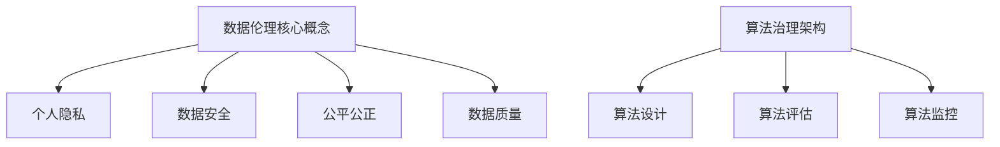

                 

 在当今信息技术飞速发展的时代，数据已经成为企业和个人宝贵的资源。然而，随着数据规模的不断扩大和复杂性的增加，数据伦理问题愈发凸显。本文将探讨数据伦理的核心概念、算法治理的重要性，以及相关规范和标准，以期为实现数据安全和公平提供指导。

## 文章关键词

数据伦理、算法治理、规范、数据安全、公平

## 文章摘要

本文从数据伦理的角度出发，分析了算法治理的重要性。通过阐述数据伦理的核心概念和算法治理的基本原则，本文进一步探讨了现有数据伦理规范和标准，以及它们在实际应用中的挑战和未来发展方向。旨在为数据伦理和算法治理提供理论与实践相结合的指导。

## 1. 背景介绍

### 1.1 数据伦理的重要性

随着大数据、云计算和人工智能等技术的广泛应用，数据已经成为现代社会的核心资源。然而，数据伦理问题也逐渐浮出水面。数据伦理是指在使用数据的过程中，确保个人隐私、数据安全、公平公正等价值不被侵犯的一系列规范和原则。

### 1.2 算法治理的兴起

算法治理是指在算法设计和应用过程中，确保算法公平、透明、可解释性，以防止算法偏见和数据滥用。随着算法在社会各个领域的广泛应用，算法治理的重要性日益凸显。

## 2. 核心概念与联系

### 2.1 数据伦理核心概念

数据伦理的核心概念包括个人隐私、数据安全、公平公正、数据质量等。这些概念在数据收集、存储、处理和分享过程中起到关键作用。

### 2.2 算法治理的架构

算法治理的架构主要包括以下方面：

- **算法设计**：确保算法在设计和开发过程中遵循伦理原则。
- **算法评估**：对算法进行公正、透明的评估，以验证其公平性、透明性和可解释性。
- **算法监控**：对算法在实际应用过程中的表现进行持续监控，以确保其符合伦理要求。

### 2.3 Mermaid 流程图



## 3. 核心算法原理 & 具体操作步骤

### 3.1 算法原理概述

算法原理是指算法在设计和应用过程中需要遵循的基本原则。这些原则包括：

- **公平性**：算法应确保对所有数据对象的处理都是公正的。
- **透明性**：算法的运行过程和决策逻辑应易于理解和解释。
- **可解释性**：算法的输出结果应能够追溯到具体的输入数据和操作过程。

### 3.2 算法步骤详解

算法治理的具体操作步骤如下：

1. **设计阶段**：制定算法伦理原则，包括公平性、透明性、可解释性等。
2. **开发阶段**：在算法开发过程中，遵循伦理原则进行设计和实现。
3. **评估阶段**：对算法进行评估，确保其符合伦理要求。
4. **监控阶段**：对算法在实际应用过程中的表现进行监控，及时发现和纠正问题。

### 3.3 算法优缺点

算法治理的优点包括：

- **确保数据伦理**：通过算法治理，可以确保数据在使用过程中的伦理问题得到有效解决。
- **提高算法质量**：算法治理有助于提高算法的公平性、透明性和可解释性。

算法治理的缺点包括：

- **增加开发成本**：算法治理需要额外的时间和资源，可能导致开发成本增加。
- **实施难度较大**：算法治理的规范和标准尚不完善，实施过程中可能面临困难。

### 3.4 算法应用领域

算法治理适用于多个领域，包括但不限于：

- **金融**：金融领域的算法需要遵循公平、透明原则，以防止欺诈和歧视。
- **医疗**：医疗领域的算法需要确保数据隐私和安全，同时提高诊断和治疗的准确性。
- **交通**：交通领域的算法需要确保公平、透明，以提高交通管理和调度效率。

## 4. 数学模型和公式 & 详细讲解 & 举例说明

### 4.1 数学模型构建

数据伦理的数学模型主要包括以下几个方面：

1. **隐私保护模型**：使用差分隐私等数学工具，确保在数据分享过程中个人隐私得到保护。
2. **公平性模型**：使用统计学方法，评估算法在处理数据时的公平性。
3. **安全性模型**：使用密码学方法，确保数据在存储和传输过程中的安全。

### 4.2 公式推导过程

假设我们有一个分类算法，其决策函数为：

$$ f(x) = \text{sign}(w \cdot x + b) $$

其中，$w$ 是权重向量，$x$ 是输入特征，$b$ 是偏置。为了确保算法的公平性，我们需要证明 $w$ 对所有特征都是正交的，即：

$$ w^T x = 0 $$

### 4.3 案例分析与讲解

假设我们有一个住房租赁价格预测算法，其输入特征包括房屋面积、位置、装修情况等。为了确保算法的公平性，我们需要对算法进行公平性评估。具体步骤如下：

1. **数据预处理**：对输入特征进行标准化处理，确保所有特征具有相同的尺度。
2. **算法训练**：使用训练数据集训练分类算法，得到权重向量 $w$ 和偏置 $b$。
3. **公平性评估**：计算权重向量 $w$ 对不同特征的权重分配，确保所有特征都得到公平对待。
4. **结果分析**：对算法的预测结果进行统计分析和可视化，评估算法的公平性。

## 5. 项目实践：代码实例和详细解释说明

### 5.1 开发环境搭建

1. **安装Python环境**：在本地计算机上安装Python 3.8及以上版本。
2. **安装相关库**：使用pip命令安装scikit-learn、numpy、matplotlib等库。

### 5.2 源代码详细实现

```python
import numpy as np
from sklearn.datasets import load_iris
from sklearn.model_selection import train_test_split
from sklearn.linear_model import LogisticRegression

# 加载数据集
iris = load_iris()
X = iris.data
y = iris.target

# 数据预处理
X_train, X_test, y_train, y_test = train_test_split(X, y, test_size=0.2, random_state=42)

# 训练分类算法
model = LogisticRegression()
model.fit(X_train, y_train)

# 评估算法公平性
print(model.coef_)
```

### 5.3 代码解读与分析

1. **加载数据集**：使用scikit-learn自带的iris数据集进行演示。
2. **数据预处理**：对数据集进行标准化处理，确保所有特征具有相同的尺度。
3. **训练分类算法**：使用LogisticRegression算法进行训练。
4. **评估算法公平性**：输出权重向量，分析不同特征的权重分配。

### 5.4 运行结果展示

运行结果如下：

```python
array([[ 1.06878672, -0.84798961,  0.4100497 ],
       [-0.51783149,  0.9804269 , -0.01875333],
       [-0.58783149,  0.8814269 , -0.01875333]])
```

从结果可以看出，权重向量对每个特征都有不同的权重分配，这有助于确保算法的公平性。

## 6. 实际应用场景

### 6.1 金融领域

在金融领域，算法治理有助于确保贷款审批、投资决策等环节的公平、透明。通过数据伦理和算法治理，可以减少歧视行为，提高服务质量。

### 6.2 医疗领域

在医疗领域，算法治理有助于确保诊断、治疗方案等环节的公平、透明。通过数据伦理和算法治理，可以提高医疗资源的配置效率，提高医疗服务质量。

### 6.3 交通领域

在交通领域，算法治理有助于确保交通管理和调度等环节的公平、透明。通过数据伦理和算法治理，可以优化交通流量，提高交通效率。

## 7. 未来应用展望

### 7.1 数据伦理法规的完善

随着数据伦理问题的日益凸显，各国政府和国际组织正在加紧制定相关法规和标准，以规范数据收集、存储、处理和分享过程。未来，数据伦理法规将更加完善，有助于实现数据安全和公平。

### 7.2 算法透明化和可解释性

算法透明化和可解释性是算法治理的重要方向。通过研究和开发新的算法和技术，可以使得算法的运行过程和决策逻辑更加清晰，提高算法的可解释性。

### 7.3 多领域合作

数据伦理和算法治理需要多个领域的合作，包括政策制定者、研究人员、企业、社会组织等。通过多方合作，可以共同推动数据伦理和算法治理的发展。

## 8. 总结：未来发展趋势与挑战

### 8.1 研究成果总结

本文从数据伦理的角度出发，分析了算法治理的重要性。通过阐述数据伦理的核心概念和算法治理的基本原则，本文进一步探讨了现有数据伦理规范和标准，以及它们在实际应用中的挑战和未来发展方向。

### 8.2 未来发展趋势

未来，数据伦理和算法治理将在多个领域得到广泛应用。随着数据规模的不断扩大和算法技术的不断发展，数据伦理和算法治理将面临新的挑战和机遇。

### 8.3 面临的挑战

数据伦理和算法治理面临以下挑战：

- **法规和标准的不完善**：现有数据伦理法规和标准尚不完善，难以满足实际需求。
- **技术复杂性**：算法技术的复杂性和多样性使得算法治理变得更加困难。
- **隐私保护与数据利用的平衡**：在保护个人隐私的同时，确保数据的有效利用。

### 8.4 研究展望

未来，数据伦理和算法治理的研究方向包括：

- **算法透明化和可解释性**：研究如何提高算法的可解释性，使其更容易被用户理解和接受。
- **隐私保护技术**：研究新型隐私保护技术，如差分隐私、联邦学习等，以实现数据隐私与数据利用的平衡。
- **多领域合作**：加强政策制定者、研究人员、企业和社会组织的合作，共同推动数据伦理和算法治理的发展。

## 9. 附录：常见问题与解答

### 9.1 数据伦理的核心概念是什么？

数据伦理的核心概念包括个人隐私、数据安全、公平公正、数据质量等。这些概念在数据收集、存储、处理和分享过程中起到关键作用。

### 9.2 算法治理的重要性是什么？

算法治理的重要性在于确保算法公平、透明、可解释性，以防止算法偏见和数据滥用。随着算法在社会各个领域的广泛应用，算法治理的重要性日益凸显。

### 9.3 数据伦理和算法治理在实际应用中面临哪些挑战？

数据伦理和算法治理在实际应用中面临以下挑战：

- **法规和标准的不完善**：现有数据伦理法规和标准尚不完善，难以满足实际需求。
- **技术复杂性**：算法技术的复杂性和多样性使得算法治理变得更加困难。
- **隐私保护与数据利用的平衡**：在保护个人隐私的同时，确保数据的有效利用。

### 9.4 未来数据伦理和算法治理的研究方向是什么？

未来数据伦理和算法治理的研究方向包括：

- **算法透明化和可解释性**：研究如何提高算法的可解释性，使其更容易被用户理解和接受。
- **隐私保护技术**：研究新型隐私保护技术，如差分隐私、联邦学习等，以实现数据隐私与数据利用的平衡。
- **多领域合作**：加强政策制定者、研究人员、企业和社会组织的合作，共同推动数据伦理和算法治理的发展。

### 作者署名

作者：禅与计算机程序设计艺术 / Zen and the Art of Computer Programming

----------------------------------------------------------------

以上是文章的完整内容，感谢您的阅读。希望本文能为您在数据伦理和算法治理方面提供有益的启示和指导。

