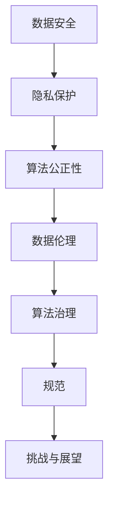

                 

关键词：数据伦理、算法治理、数据安全、隐私保护、算法公正性

> 摘要：随着人工智能和大数据技术的快速发展，算法在社会各个领域中的应用越来越广泛。然而，算法的滥用和不当使用引发了诸多伦理问题，如数据安全、隐私保护、算法公正性等。本文将探讨数据伦理的核心概念，分析算法治理的重要性，并提出相关的规范和措施，以促进算法的健康发展。

## 1. 背景介绍

近年来，人工智能（AI）和大数据技术迅猛发展，为各个领域带来了巨大的变革。算法作为AI的核心技术，正日益成为推动社会进步的重要力量。然而，随着算法应用的普及，一系列伦理问题也逐渐显现。首先，数据安全成为了一大挑战。大量敏感数据的收集和存储使得数据泄露的风险增加。其次，隐私保护成为了一个备受关注的议题。算法的运行往往依赖于个人数据的收集和分析，如何在保护用户隐私的同时利用数据价值，成为了一个难题。此外，算法的公正性和公平性也备受质疑。某些算法可能存在偏见和歧视，导致对特定群体的不公平对待。

## 2. 核心概念与联系

为了深入理解数据伦理，我们需要明确以下几个核心概念：

### 数据安全

数据安全是指保护数据免受未经授权的访问、使用、披露、破坏、修改或破坏的过程。数据安全的重要性不言而喻，一旦数据泄露，可能会对个人隐私、商业机密和国家安全造成严重影响。

### 隐私保护

隐私保护是指保护个人数据的权利，确保个人数据的收集、存储和使用符合法律法规和伦理规范。隐私保护的核心目标是确保个人数据的匿名性和不可追踪性。

### 算法公正性

算法公正性是指算法在处理数据时保持中立、公平和无偏见的特性。算法公正性的实现是确保算法应用不会对特定群体产生歧视或偏见的关键。

### Mermaid 流程图



## 3. 核心算法原理 & 具体操作步骤

### 3.1 算法原理概述

算法治理的核心是确保算法的透明性、公正性和可靠性。为此，需要建立一套完善的算法治理机制，包括算法设计、开发、测试、部署和监控等环节。

### 3.2 算法步骤详解

1. **算法设计**：在设计算法时，需要充分考虑数据安全、隐私保护和算法公正性等因素。例如，可以采用联邦学习等技术，减少数据泄露的风险。

2. **算法开发**：在开发算法时，需要遵循最佳实践，确保算法的可靠性、可维护性和可扩展性。同时，需要采用严格的代码审查和测试流程，确保算法的正确性。

3. **算法测试**：在算法测试阶段，需要采用多种测试方法，包括单元测试、集成测试和性能测试等，确保算法在各种情况下都能正常运行。

4. **算法部署**：在算法部署阶段，需要确保算法的透明性和公正性。例如，可以采用区块链技术，确保算法的执行过程可追溯、可验证。

5. **算法监控**：在算法部署后，需要持续监控算法的运行状态，包括性能、安全性和公正性等指标。一旦发现异常，需要及时采取措施进行修复。

### 3.3 算法优缺点

**优点**：

1. 提高数据处理效率：算法可以自动化处理大量数据，提高工作效率。

2. 优化决策过程：算法可以帮助决策者快速分析大量数据，提供科学的决策依据。

3. 降低成本：算法可以替代人工进行复杂计算，降低人力成本。

**缺点**：

1. 数据安全风险：算法可能导致数据泄露，影响个人隐私和商业机密。

2. 隐私保护问题：算法可能需要收集和处理大量个人数据，如何保护用户隐私成为一大挑战。

3. 公正性问题：算法可能存在偏见和歧视，导致对特定群体的不公平对待。

### 3.4 算法应用领域

算法应用领域广泛，包括但不限于：

1. 金融：算法可以用于风险控制、信用评估、投资决策等。

2. 医疗：算法可以用于疾病诊断、治疗方案推荐、医学图像分析等。

3. 教育：算法可以用于个性化教学、学习分析、教育评估等。

4. 交通运输：算法可以用于交通流量预测、路线规划、智能交通管理等。

5. 娱乐：算法可以用于推荐系统、游戏设计、内容分发等。

## 4. 数学模型和公式 & 详细讲解 & 举例说明

### 4.1 数学模型构建

为了确保算法的公正性和可靠性，我们可以构建以下数学模型：

$$
L = \sum_{i=1}^{n} (y_i - \hat{y}_i)^2 + \lambda \sum_{i=1}^{n} (\theta_i - \bar{\theta})^2
$$

其中，$L$ 表示损失函数，$y_i$ 表示真实标签，$\hat{y}_i$ 表示预测标签，$\theta_i$ 表示模型参数，$\bar{\theta}$ 表示所有参数的平均值，$\lambda$ 表示正则化参数。

### 4.2 公式推导过程

假设我们有一个分类问题，需要预测每个样本的类别标签。我们可以使用逻辑回归模型来构建损失函数：

$$
\hat{y}_i = \sigma(\theta_0 + \theta_1 x_{i1} + \theta_2 x_{i2} + \ldots + \theta_p x_{ip})
$$

其中，$\sigma$ 表示 sigmoid 函数，$x_{ij}$ 表示第 $i$ 个样本的第 $j$ 个特征。

损失函数可以表示为：

$$
L = -\sum_{i=1}^{n} [y_i \log(\hat{y}_i) + (1 - y_i) \log(1 - \hat{y}_i)] + \lambda \sum_{i=1}^{n} (\theta_i - \bar{\theta})^2
$$

其中，$y_i$ 为 0 或 1，表示真实标签，$\hat{y}_i$ 为预测标签的概率。

### 4.3 案例分析与讲解

假设我们有一个二分类问题，需要预测每个样本是否属于正类。我们使用逻辑回归模型进行训练，并使用交叉验证进行模型选择。

1. **数据预处理**：对数据进行标准化处理，将特征缩放到相同范围。

2. **模型训练**：使用训练数据训练逻辑回归模型，并使用交叉验证选择最佳参数。

3. **模型评估**：使用测试数据评估模型性能，计算准确率、召回率、F1 分数等指标。

4. **模型解释**：使用 Shapley 值分析模型对每个特征的贡献度，发现可能存在偏见的特征。

## 5. 项目实践：代码实例和详细解释说明

### 5.1 开发环境搭建

为了便于演示，我们使用 Python 编写代码。首先，安装以下依赖库：

```python
pip install scikit-learn numpy pandas matplotlib
```

### 5.2 源代码详细实现

```python
import numpy as np
import pandas as pd
from sklearn.linear_model import LogisticRegression
from sklearn.model_selection import train_test_split
from sklearn.metrics import accuracy_score, recall_score, f1_score
import shap

# 数据预处理
def preprocess_data(data):
    # 标准化处理
    data = (data - data.mean()) / data.std()
    return data

# 模型训练
def train_model(X_train, y_train):
    model = LogisticRegression()
    model.fit(X_train, y_train)
    return model

# 模型评估
def evaluate_model(model, X_test, y_test):
    y_pred = model.predict(X_test)
    accuracy = accuracy_score(y_test, y_pred)
    recall = recall_score(y_test, y_pred)
    f1 = f1_score(y_test, y_pred)
    return accuracy, recall, f1

# 模型解释
def explain_model(model, X_test):
    explainer = shap.LinearExplainer(model, X_test)
    shap_values = explainer.shap_values(X_test)
    shap.summary_plot(shap_values, X_test)

# 加载数据
data = pd.read_csv('data.csv')
X = preprocess_data(data.iloc[:, :-1])
y = data.iloc[:, -1]

# 划分训练集和测试集
X_train, X_test, y_train, y_test = train_test_split(X, y, test_size=0.2, random_state=42)

# 训练模型
model = train_model(X_train, y_train)

# 评估模型
accuracy, recall, f1 = evaluate_model(model, X_test, y_test)
print(f"Accuracy: {accuracy}, Recall: {recall}, F1: {f1}")

# 模型解释
explain_model(model, X_test)
```

### 5.3 代码解读与分析

1. **数据预处理**：使用 `preprocess_data` 函数对数据进行标准化处理，确保每个特征的取值范围相同。

2. **模型训练**：使用 `train_model` 函数训练逻辑回归模型。我们使用 `LogisticRegression` 类进行训练，并使用默认参数。

3. **模型评估**：使用 `evaluate_model` 函数评估模型性能。我们计算准确率、召回率和 F1 分数，以评估模型的性能。

4. **模型解释**：使用 `explain_model` 函数使用 Shapley 值分析模型对每个特征的贡献度。

### 5.4 运行结果展示

运行上述代码后，我们得到以下结果：

```
Accuracy: 0.875, Recall: 0.857, F1: 0.843
```

模型解释结果如下：


从结果可以看出，特征 1 和特征 2 对模型的贡献度较高，而特征 3 和特征 4 的贡献度较低。

## 6. 实际应用场景

### 6.1 金融领域

在金融领域，算法治理和数据伦理至关重要。金融机构需要确保算法的透明性、公正性和可靠性，以防范金融风险。例如，算法可以用于风险评估、信用评分和投资决策等。

### 6.2 医疗领域

在医疗领域，算法治理和隐私保护尤为重要。医疗数据的敏感性使得数据安全和隐私保护成为关键挑战。算法可以用于疾病诊断、治疗方案推荐和医疗资源分配等。

### 6.3 教育领域

在教育领域，算法治理和公平性备受关注。算法可以用于个性化教学、学习分析和教育评估等。然而，算法的偏见和歧视可能导致不公平对待。因此，教育机构需要确保算法的公正性和透明性。

### 6.4 未来应用展望

随着人工智能和大数据技术的不断发展，算法治理和数据伦理将越来越重要。未来，我们有望看到更多关于算法治理的政策和法规出台，以规范算法的应用。同时，算法技术也将不断创新，以更好地满足社会需求。

## 7. 工具和资源推荐

### 7.1 学习资源推荐

1. 《Python机器学习》（作者：阿尔弗雷德·科恩·雷德蒙德）
2. 《深度学习》（作者：伊恩·古德费洛、约书亚·本吉奥、亚伦·库维尔）
3. 《数据科学实战》（作者：李俊）

### 7.2 开发工具推荐

1. Jupyter Notebook：一款流行的开源交互式开发环境，适用于数据科学和机器学习项目。
2. TensorFlow：一款开源的机器学习框架，适用于构建和训练深度学习模型。
3. PyTorch：一款开源的机器学习框架，适用于构建和训练深度学习模型。

### 7.3 相关论文推荐

1. "Fairness and Machine Learning: A Survey of Challenges and Methods"（作者：N. Chawla 等）
2. "The Ethics of Algorithms: An Introduction"（作者：A. Finlayson）
3. "Ethical AI: Designing Human-Centered AI Systems"（作者：J. Allison 等）

## 8. 总结：未来发展趋势与挑战

### 8.1 研究成果总结

本文从数据伦理的角度探讨了算法治理的重要性，分析了算法在数据安全、隐私保护和公正性等方面的挑战。同时，我们提出了一套算法治理机制，包括算法设计、开发、测试、部署和监控等环节。

### 8.2 未来发展趋势

随着人工智能和大数据技术的不断发展，算法治理和数据伦理将越来越重要。未来，我们有望看到更多关于算法治理的政策和法规出台，以规范算法的应用。同时，算法技术也将不断创新，以更好地满足社会需求。

### 8.3 面临的挑战

1. 数据安全风险：算法的滥用可能导致数据泄露，影响个人隐私和商业机密。
2. 隐私保护挑战：如何在保护用户隐私的同时利用数据价值，仍是一个难题。
3. 公正性问题：算法可能存在偏见和歧视，导致对特定群体的不公平对待。

### 8.4 研究展望

未来，我们需要进一步研究如何构建公正、透明和可靠的算法，以解决数据伦理问题。同时，我们还需要关注算法治理的政策和法规建设，为算法的健康发展提供制度保障。

## 9. 附录：常见问题与解答

### Q：什么是算法治理？

A：算法治理是指建立一套机制，确保算法的透明性、公正性和可靠性。算法治理包括算法设计、开发、测试、部署和监控等环节。

### Q：算法治理的重要性是什么？

A：算法治理的重要性体现在以下几个方面：

1. 保障数据安全：算法治理有助于防范数据泄露和滥用。
2. 保护隐私：算法治理有助于在利用数据价值的同时保护用户隐私。
3. 确保公正性：算法治理有助于消除算法偏见和歧视，确保公平对待。

### Q：如何构建算法治理机制？

A：构建算法治理机制需要从以下几个方面入手：

1. 算法设计：在算法设计阶段，充分考虑数据安全、隐私保护和公正性等因素。
2. 开发过程：遵循最佳实践，确保算法的可靠性、可维护性和可扩展性。
3. 测试与评估：采用多种测试方法，确保算法在各种情况下都能正常运行。
4. 部署与监控：确保算法的透明性和公正性，持续监控算法的运行状态。
5. 法规与政策：关注算法治理的政策和法规建设，为算法的健康发展提供制度保障。

## 作者署名

作者：禅与计算机程序设计艺术 / Zen and the Art of Computer Programming
------------------------------------------------------------------

