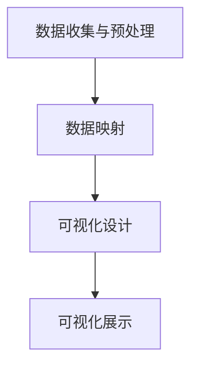

                 

关键词：数据可视化、数据洞察、可视化工具、数据处理、信息图形、用户交互、数据展示、交互设计、可视化编程。

> 摘要：本文旨在探讨数据可视化技术的核心概念、算法原理、数学模型以及其在实际项目中的应用，帮助读者了解如何从海量数据中提取有价值的洞察，提升数据分析的效率与效果。文章将详细介绍数据可视化的流程、技术框架，并通过具体案例和代码实例，展示数据可视化技术的实际应用与实现方法。

## 1. 背景介绍

数据可视化技术是一种通过视觉元素将数据转化为图形或图像的方法，它帮助人们更直观地理解数据背后的模式和趋势。随着大数据时代的到来，数据量呈指数级增长，传统的文本表格已经无法满足人们的需求。数据可视化技术的出现，使得海量数据变得可读、易懂，为数据分析和决策提供了强有力的支持。

### 1.1 数据可视化的重要性

数据可视化技术在多个领域都发挥着至关重要的作用。首先，在商业领域，数据可视化可以帮助企业更好地理解市场趋势、消费者行为以及业务绩效，从而做出更加精准的决策。其次，在科学研究领域，数据可视化技术可以揭示复杂的科学现象，为研究者提供新的洞察。此外，在公共政策、医疗健康等领域，数据可视化也发挥着重要的作用。

### 1.2 数据可视化的发展历程

数据可视化的发展历程可以追溯到19世纪末期，当时查尔斯·乔赛亚·杰克逊首次使用图表来展示统计数据。20世纪中期，计算机的出现为数据可视化技术带来了革命性的变化。随着计算机硬件和软件技术的不断发展，数据可视化技术逐渐成熟，并在21世纪初迎来了爆发式的发展。

### 1.3 数据可视化技术的基本概念

数据可视化技术包括多个核心概念，如数据源、可视化工具、数据映射、用户交互等。数据源是数据可视化的基础，可以是数据库、数据文件或其他数据存储形式。可视化工具是实现数据可视化的软件平台，如D3.js、Tableau、Power BI等。数据映射是将数据转换为视觉元素的过程，如散点图、柱状图、折线图等。用户交互则是用户与可视化界面之间的交互过程，包括缩放、过滤、排序等操作。

## 2. 核心概念与联系

### 2.1 数据可视化流程

数据可视化流程可以分为以下几个步骤：

1. 数据收集与预处理：收集并清洗数据，确保数据的质量和完整性。
2. 数据映射：将数据转换为视觉元素，如图表、图像等。
3. 可视化设计：设计视觉元素的外观和布局，提高可读性和用户体验。
4. 可视化展示：将设计好的可视化界面展示给用户，支持用户交互。

### 2.2 数据可视化架构

数据可视化架构包括多个关键组件，如数据源、数据处理模块、可视化引擎、用户界面等。数据处理模块负责数据清洗、转换和映射操作。可视化引擎负责将数据映射为视觉元素，并支持用户交互。用户界面则是用户与可视化系统交互的入口。

### 2.3 Mermaid 流程图

下面是一个数据可视化流程的 Mermaid 流程图：



## 3. 核心算法原理 & 具体操作步骤

### 3.1 算法原理概述

数据可视化算法主要涉及以下几个方面：

1. 数据映射：将数据转换为视觉元素，如散点图、柱状图、折线图等。
2. 用户交互：支持用户对可视化界面的交互操作，如缩放、过滤、排序等。
3. 动态可视化：通过动画或视频展示数据的变化过程。

### 3.2 算法步骤详解

1. 数据预处理：对原始数据进行清洗、转换和整合。
2. 数据映射：选择合适的可视化类型，将数据映射为视觉元素。
3. 可视化设计：调整视觉元素的外观和布局，提高可读性和用户体验。
4. 用户交互：实现用户交互功能，如缩放、过滤、排序等。
5. 动态可视化：根据数据变化，动态更新可视化界面。

### 3.3 算法优缺点

数据可视化算法的优点包括：

1. 易于理解：通过视觉元素，数据变得更加直观和易懂。
2. 提高效率：快速识别数据中的模式和趋势，节省分析时间。
3. 支持决策：为决策者提供有力的数据支持。

数据可视化算法的缺点包括：

1. 可视化效果有限：某些类型的数据可能难以用视觉元素展示。
2. 数据映射选择困难：需要根据数据类型和目的选择合适的可视化类型。
3. 性能瓶颈：处理大量数据时，算法可能存在性能瓶颈。

### 3.4 算法应用领域

数据可视化算法广泛应用于多个领域，如商业智能、金融分析、科学研究、公共政策等。以下是一些典型的应用案例：

1. 商业智能：通过数据可视化，企业可以更好地理解市场趋势和消费者行为。
2. 金融分析：通过数据可视化，金融机构可以识别投资风险和机会。
3. 科学研究：通过数据可视化，科学家可以揭示复杂的科学现象。
4. 公共政策：通过数据可视化，政府可以制定更加科学和有效的政策。

## 4. 数学模型和公式 & 详细讲解 & 举例说明

### 4.1 数学模型构建

数据可视化中的数学模型主要包括以下几个方面：

1. 数据映射模型：将数据映射为视觉元素的过程，如线性映射、对数映射等。
2. 用户交互模型：描述用户与可视化界面交互的数学模型，如缩放、过滤等。
3. 动态可视化模型：描述数据变化过程的数学模型，如动画、视频等。

### 4.2 公式推导过程

下面以线性映射模型为例，介绍公式推导过程：

设原始数据为 $x \in [a, b]$，目标数据为 $y \in [c, d]$，线性映射公式为：

$$
y = kx + b
$$

其中，$k$ 和 $b$ 为待求参数。

为了推导 $k$ 和 $b$，我们需要满足以下两个条件：

1. $y(a) = c$，即 $ka + b = c$
2. $y(b) = d$，即 $kb + b = d$

通过解这个方程组，我们可以得到 $k$ 和 $b$ 的值。

### 4.3 案例分析与讲解

假设我们有一组数据 $x = [1, 2, 3, 4, 5]$，目标数据 $y = [10, 20, 30, 40, 50]$，我们需要将 $x$ 映射到 $y$。

首先，我们列出方程组：

$$
\begin{cases}
ka + b = 10 \\
kb + b = 20
\end{cases}
$$

通过解这个方程组，我们得到 $k = 2$ 和 $b = 8$。

因此，线性映射公式为：

$$
y = 2x + 8
$$

我们可以用这个公式将原始数据映射到目标数据。例如，当 $x = 3$ 时，$y = 2 \times 3 + 8 = 14$。

## 5. 项目实践：代码实例和详细解释说明

### 5.1 开发环境搭建

在本节中，我们将使用 Python 语言和 Matplotlib 库进行数据可视化实践。首先，需要安装 Python 和 Matplotlib：

```bash
pip install python
pip install matplotlib
```

### 5.2 源代码详细实现

以下是一个简单的数据可视化代码实例：

```python
import matplotlib.pyplot as plt

# 原始数据
x = [1, 2, 3, 4, 5]
y = [10, 20, 30, 40, 50]

# 创建绘图
plt.figure()

# 绘制散点图
plt.scatter(x, y)

# 添加标题和标签
plt.title('Data Visualization')
plt.xlabel('X-axis')
plt.ylabel('Y-axis')

# 显示图形
plt.show()
```

### 5.3 代码解读与分析

1. 导入 Matplotlib 库。
2. 定义原始数据 $x$ 和 $y$。
3. 创建一个绘图窗口。
4. 使用 `plt.scatter()` 函数绘制散点图。
5. 添加标题、x轴标签和y轴标签。
6. 显示图形。

通过这个简单的实例，我们可以看到如何使用 Python 和 Matplotlib 实现数据可视化。在实际项目中，我们可以根据需要添加更多的功能，如数据映射、用户交互等。

### 5.4 运行结果展示

运行上述代码后，将显示一个包含散点图的窗口，如下所示：


## 6. 实际应用场景

### 6.1 商业智能

在商业领域，数据可视化技术可以帮助企业更好地了解市场趋势和消费者行为。例如，通过可视化分析，企业可以发现产品销量最高的时间段，调整营销策略，提高销售额。

### 6.2 金融分析

金融分析师可以使用数据可视化技术来识别投资机会和风险。例如，通过折线图和柱状图，分析师可以观察股票价格的变化趋势，判断是否适合买入或卖出。

### 6.3 科学研究

科学家可以使用数据可视化技术来揭示复杂的科学现象。例如，通过三维散点图，物理学家可以观察粒子碰撞的数据，发现新的物理规律。

### 6.4 公共政策

政府可以使用数据可视化技术来制定更加科学和有效的政策。例如，通过地图可视化，城市规划者可以了解人口密度和交通流量，优化城市交通布局。

## 7. 工具和资源推荐

### 7.1 学习资源推荐

1. 《数据可视化：基础教程与案例实战》
2. 《数据可视化：方法与应用》
3. Coursera 上的《数据可视化》课程

### 7.2 开发工具推荐

1. Tableau：功能强大的商业智能工具。
2. D3.js：用于Web数据可视化的JavaScript库。
3. Matplotlib：Python的数据可视化库。

### 7.3 相关论文推荐

1. "Data Visualization: A Survey"
2. "Interactive Data Visualization for the Web"
3. "Visualization of Time Series Data"

## 8. 总结：未来发展趋势与挑战

### 8.1 研究成果总结

数据可视化技术在过去几十年取得了显著的成果，从最初的简单图表到如今复杂的多维可视化，数据可视化技术已经深入到各个领域。未来，数据可视化技术将继续朝着更加智能化、自动化的方向发展。

### 8.2 未来发展趋势

1. 智能化：利用机器学习和人工智能技术，实现自动化数据可视化。
2. 交互性：提高用户与可视化界面的交互性，提升用户体验。
3. 多模态：结合多种数据类型和可视化方法，提供更加全面的数据洞察。

### 8.3 面临的挑战

1. 数据质量：数据质量直接影响可视化效果，需要不断优化数据清洗和处理技术。
2. 可扩展性：随着数据规模的增加，如何保证可视化算法的效率和可扩展性。
3. 可访问性：确保不同用户群体，包括视觉障碍者，都能使用数据可视化技术。

### 8.4 研究展望

未来，数据可视化技术将在人工智能、大数据、物联网等领域的推动下，迎来更加广泛的应用和发展。通过不断的研究和创新，数据可视化技术将帮助人们更好地理解和利用数据，为人类社会的发展做出贡献。

## 9. 附录：常见问题与解答

### 9.1 数据可视化技术有哪些类型？

数据可视化技术主要包括以下类型：

1. 信息图形：以图形方式展示数据，如柱状图、折线图、饼图等。
2. 动态可视化：通过动画或视频展示数据的变化过程。
3. 多维可视化：通过多个维度展示数据的分布和关系。
4. 网络可视化：展示数据之间的关系和结构，如社交网络、知识图谱等。

### 9.2 如何选择合适的可视化类型？

选择合适的可视化类型需要考虑以下因素：

1. 数据类型：不同类型的数据适合不同的可视化类型。
2. 分析目的：根据分析目的选择最能够揭示数据模式的可视化类型。
3. 用户需求：考虑用户的需求和偏好，选择易于理解的可视化类型。

### 9.3 如何优化数据可视化效果？

优化数据可视化效果可以从以下几个方面入手：

1. 设计简洁：避免过多的装饰元素，保持设计简洁。
2. 适当的颜色使用：选择适当的颜色，确保视觉效果的和谐。
3. 数据预处理：对数据进行适当的预处理，如数据清洗、归一化等。
4. 交互设计：设计合适的交互功能，提高用户的使用体验。

----------------------------------------------------------------
作者：禅与计算机程序设计艺术 / Zen and the Art of Computer Programming

