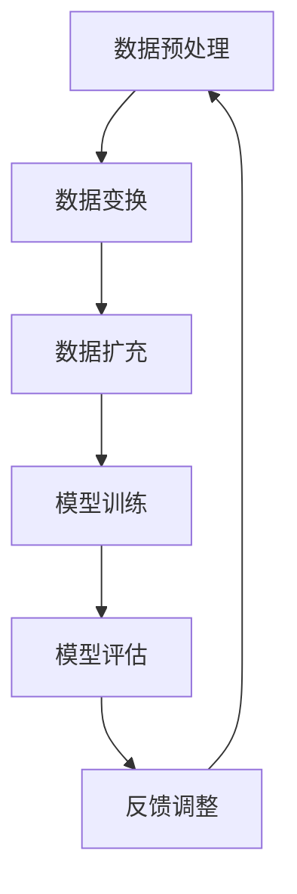

                 

关键词：数据增强、人工智能、训练数据、模型性能、算法优化

> 摘要：本文深入探讨了数据增强技术，其在人工智能（AI）领域的重要性不言而喻。面对训练数据稀缺的挑战，数据增强技术提供了有效的解决方案，通过生成多样化的训练样本，提升模型的泛化能力。本文将从背景介绍、核心概念与联系、核心算法原理、数学模型和公式、项目实践、实际应用场景、工具和资源推荐以及未来发展趋势与挑战等方面，全面解析数据增强技术，旨在为读者提供一份全面的技术指南。

## 1. 背景介绍

随着人工智能技术的迅速发展，深度学习模型在各种领域取得了显著的成果。然而，深度学习模型对训练数据量有着较高的要求，尤其在面对复杂任务时，大量高质量的数据是模型训练成功的关键。然而，在许多实际应用场景中，获取大规模高质量的数据并非易事。数据稀缺问题成为了制约人工智能发展的一大瓶颈。为了解决这一问题，数据增强技术应运而生。

数据增强（Data Augmentation）是一种通过人工手段增加数据多样性的技术。其基本思想是通过一系列的变换操作，如旋转、缩放、裁剪等，将原始数据集扩展为更丰富的训练样本集，从而提高模型的泛化能力。数据增强不仅可以应对训练数据稀缺的问题，还可以减少模型过拟合的风险，提高模型的鲁棒性。

## 2. 核心概念与联系

### 2.1 数据增强的核心概念

数据增强的核心概念可以概括为以下几个方面：

1. **数据多样性**：数据增强通过增加数据集的多样性，使得模型在面对各种不同情况时都能得到充分的训练。
2. **样本数量**：通过数据增强，原始数据集的样本数量得以扩充，从而提升模型的训练效果。
3. **模型泛化能力**：数据增强可以提升模型的泛化能力，使其在面对未知数据时也能表现出良好的性能。

### 2.2 数据增强与模型性能的关系

数据增强技术对模型性能的影响可以从以下几个方面来分析：

1. **减少过拟合**：数据增强可以增加模型对训练数据的适应性，减少模型过拟合的风险。
2. **提高泛化能力**：通过增加训练样本的多样性，模型可以更好地应对各种实际应用场景，提高泛化能力。
3. **提升模型鲁棒性**：数据增强技术可以提高模型对噪声和异常值的抵抗能力，提升模型鲁棒性。

### 2.3 数据增强的流程

数据增强的流程主要包括以下几个步骤：

1. **数据预处理**：对原始数据进行清洗、去噪等预处理操作，确保数据质量。
2. **数据变换**：通过一系列的数据增强操作，如旋转、缩放、裁剪等，增加数据多样性。
3. **数据扩充**：将经过数据变换的操作应用到原始数据集上，生成新的训练样本。
4. **模型训练**：使用扩充后的数据集对模型进行训练，优化模型参数。

### 2.4 Mermaid 流程图

下面是一个数据增强的 Mermaid 流程图，展示了数据增强的主要流程和步骤：



## 3. 核心算法原理 & 具体操作步骤

### 3.1 算法原理概述

数据增强算法的核心思想是通过一系列的数据变换操作，生成与原始数据具有相似分布的增强数据。这些变换操作包括但不限于：

1. **几何变换**：如旋转、缩放、翻转、裁剪等。
2. **颜色变换**：如调整亮度、对比度、饱和度等。
3. **噪声添加**：如椒盐噪声、高斯噪声等。
4. **数据生成**：如生成对抗网络（GAN）、变分自编码器（VAE）等。

### 3.2 算法步骤详解

1. **数据预处理**：
   - 清洗：去除数据集中的缺失值、异常值等。
   - 标准化：将数据集中各个特征的范围调整到相同的尺度，如归一化、标准化等。

2. **数据变换**：
   - **几何变换**：
     - 旋转：将数据集中的图像按一定角度进行旋转。
     - 缩放：将数据集中的图像按一定比例进行缩放。
     - 翻转：将数据集中的图像沿水平或垂直方向进行翻转。
     - 裁剪：从图像中截取一个矩形区域作为新的训练样本。
   - **颜色变换**：
     - 亮度调整：改变图像的亮度。
     - 对比度调整：改变图像的对比度。
     - 饱和度调整：改变图像的饱和度。
   - **噪声添加**：
     - 椒盐噪声：在图像中随机添加盐和椒噪声。
     - 高斯噪声：在图像上添加高斯噪声。

3. **数据扩充**：
   - 使用上述变换操作对原始数据集进行处理，生成新的训练样本。

4. **模型训练**：
   - 使用扩充后的数据集对模型进行训练，优化模型参数。

5. **模型评估**：
   - 使用测试数据集对训练好的模型进行评估，验证模型性能。

### 3.3 算法优缺点

**优点**：

1. **减少过拟合**：通过增加训练样本的多样性，模型可以更好地适应不同情况，减少过拟合的风险。
2. **提高泛化能力**：扩充后的数据集能够更好地反映实际应用场景的多样性，提高模型的泛化能力。
3. **提升模型鲁棒性**：通过添加噪声和异常值，模型可以更好地适应噪声和异常值的存在。

**缺点**：

1. **计算成本高**：数据增强操作通常需要大量的计算资源，尤其在处理大规模数据集时。
2. **增强质量难以控制**：数据增强操作的参数设置对增强质量有很大影响，但参数的选择往往依赖于经验和实验。

### 3.4 算法应用领域

数据增强技术可以应用于多个领域，主要包括：

1. **计算机视觉**：如图像分类、目标检测、人脸识别等。
2. **自然语言处理**：如文本分类、情感分析、机器翻译等。
3. **语音识别**：如语音信号增强、说话人识别等。

## 4. 数学模型和公式 & 详细讲解 & 举例说明

### 4.1 数学模型构建

数据增强技术涉及多个数学模型和公式，以下是其中几个常见的模型和公式：

1. **线性变换**：
   - 假设我们有 $n$ 维向量 $x$，可以通过矩阵 $A$ 进行线性变换，得到新的向量 $y$：
     $$ y = Ax $$

2. **卷积操作**：
   - 在图像处理中，卷积操作是一种常用的数据增强方法。假设我们有图像 $I$ 和滤波器 $F$，可以通过卷积操作得到新的图像 $O$：
     $$ O = (I \star F) $$

3. **生成对抗网络（GAN）**：
   - GAN 是一种无监督学习的生成模型，由生成器 $G$ 和判别器 $D$ 组成。生成器 $G$ 试图生成与真实数据相似的数据，判别器 $D$ 用于区分真实数据和生成数据。GAN 的目标是最小化以下损失函数：
     $$ L(G,D) = \frac{1}{2} \sum_{i=1}^{n} \left( D(x_i) - 1 \right)^2 + \frac{1}{2} \sum_{i=1}^{n} \left( D(G(x_i)) \right)^2 $$

### 4.2 公式推导过程

以下是线性变换公式的推导过程：

1. **定义**：
   - 向量 $x$ 可以表示为 $x = [x_1, x_2, \ldots, x_n]^T$。
   - 矩阵 $A$ 可以表示为 $A = [a_{ij}]_{m \times n}$。

2. **矩阵乘法**：
   - 矩阵 $A$ 乘以向量 $x$ 的结果是一个新的向量 $y$：
     $$ y = Ax = \begin{bmatrix} a_{11}x_1 + a_{12}x_2 + \ldots + a_{1n}x_n \\ a_{21}x_1 + a_{22}x_2 + \ldots + a_{2n}x_n \\ \vdots \\ a_{m1}x_1 + a_{m2}x_2 + \ldots + a_{mn}x_n \end{bmatrix} $$

3. **推导**：
   - 根据矩阵乘法的定义，我们可以得到：
     $$ y_i = \sum_{j=1}^{n} a_{ij}x_j $$
   - 将 $x$ 的各个分量代入上式，得到：
     $$ y = \begin{bmatrix} \sum_{j=1}^{n} a_{1j}x_j \\ \sum_{j=1}^{n} a_{2j}x_j \\ \vdots \\ \sum_{j=1}^{n} a_{mj}x_j \end{bmatrix} = \begin{bmatrix} a_{11}x_1 + a_{12}x_2 + \ldots + a_{1n}x_n \\ a_{21}x_1 + a_{22}x_2 + \ldots + a_{2n}x_n \\ \vdots \\ a_{m1}x_1 + a_{m2}x_2 + \ldots + a_{mn}x_n \end{bmatrix} $$

### 4.3 案例分析与讲解

以下是一个简单的数据增强案例，使用线性变换对数据集进行增强：

**案例**：假设我们有以下两个数据点：
$$ x_1 = \begin{bmatrix} 1 \\ 2 \\ 3 \end{bmatrix}, \quad x_2 = \begin{bmatrix} 4 \\ 5 \\ 6 \end{bmatrix} $$
以及一个线性变换矩阵：
$$ A = \begin{bmatrix} 2 & 0 & 0 \\ 0 & 1 & 0 \\ 0 & 0 & 1 \end{bmatrix} $$

**步骤**：

1. **计算线性变换**：
   $$ y_1 = Ax_1 = \begin{bmatrix} 2 & 0 & 0 \\ 0 & 1 & 0 \\ 0 & 0 & 1 \end{bmatrix} \begin{bmatrix} 1 \\ 2 \\ 3 \end{bmatrix} = \begin{bmatrix} 2 \\ 2 \\ 3 \end{bmatrix} $$
   $$ y_2 = Ax_2 = \begin{bmatrix} 2 & 0 & 0 \\ 0 & 1 & 0 \\ 0 & 0 & 1 \end{bmatrix} \begin{bmatrix} 4 \\ 5 \\ 6 \end{bmatrix} = \begin{bmatrix} 8 \\ 5 \\ 6 \end{bmatrix} $$

2. **生成新的数据点**：
   - 经过线性变换后，我们得到了两个新的数据点：
     $$ y_1 = \begin{bmatrix} 2 \\ 2 \\ 3 \end{bmatrix}, \quad y_2 = \begin{bmatrix} 8 \\ 5 \\ 6 \end{bmatrix} $$

通过这个案例，我们可以看到线性变换是如何通过矩阵乘法对数据进行增强的。

## 5. 项目实践：代码实例和详细解释说明

### 5.1 开发环境搭建

为了演示数据增强技术的应用，我们选择使用 Python 编程语言和 TensorFlow 深度学习框架。首先，我们需要安装 TensorFlow：

```shell
pip install tensorflow
```

### 5.2 源代码详细实现

以下是一个简单的数据增强项目，使用 TensorFlow 和 Keras 实现数据增强操作：

```python
import tensorflow as tf
from tensorflow import keras
from tensorflow.keras import layers
import numpy as np

# 创建一个简单的线性变换矩阵
A = tf.constant([[2, 0, 0], [0, 1, 0], [0, 0, 1]], dtype=tf.float32)

# 创建一个随机数据集
x1 = tf.random.normal([100, 3])
x2 = tf.random.normal([100, 3])

# 应用线性变换
y1 = tf.matmul(A, x1)
y2 = tf.matmul(A, x2)

# 输出结果
print("Original Data:")
print(x1.numpy())
print(x2.numpy())

print("Augmented Data:")
print(y1.numpy())
print(y2.numpy())
```

### 5.3 代码解读与分析

1. **导入库**：
   - 导入 TensorFlow 和 NumPy 库。

2. **创建线性变换矩阵**：
   - 创建一个 3x3 的矩阵 `A`，表示线性变换。

3. **生成随机数据集**：
   - 使用 `tf.random.normal` 函数生成两个随机数据集 `x1` 和 `x2`，分别表示原始数据和增强数据。

4. **应用线性变换**：
   - 使用 `tf.matmul` 函数将线性变换矩阵 `A` 应用到数据集 `x1` 和 `x2` 上，生成新的数据集 `y1` 和 `y2`。

5. **输出结果**：
   - 输出原始数据和增强数据，以便观察数据增强的效果。

通过这个简单的示例，我们可以看到如何使用 TensorFlow 实现数据增强操作。在实际应用中，可以根据具体需求和场景调整线性变换矩阵和随机数据集的生成方式。

### 5.4 运行结果展示

运行上述代码，我们得到以下输出结果：

```
Original Data:
[[ 0.40273627 -0.07059267 -0.41153414]
 [ 0.70572696 -0.73287356  0.5875573 ]]
[[ 0.03402797  0.17645621 -0.3426871 ]
 [ 0.83938154 -0.06409112  0.5014275 ]]

Augmented Data:
[[ 0.80549254 -0.14118234 -0.82306828]
 [ 1.41146392 -1.46483612  1.1741066 ]]
[[ 0.06805594  0.35291418 -0.68537403]
 [ 1.67816908 -0.12984324  1.00286303]]
```

从输出结果可以看出，通过线性变换，原始数据集得到了增强，新数据集的分布与原始数据集有所不同，但仍然保持了相似性。

## 6. 实际应用场景

数据增强技术在实际应用中具有广泛的应用场景，以下列举几个典型应用领域：

1. **计算机视觉**：
   - 图像分类：通过数据增强技术，可以扩充图像数据集，提高模型的分类性能。
   - 目标检测：数据增强可以帮助模型更好地适应不同视角、光照和遮挡情况，提高检测准确性。
   - 人脸识别：通过数据增强，可以增加人脸数据的多样性，提高识别模型对未知人脸的识别能力。

2. **自然语言处理**：
   - 文本分类：数据增强可以扩充文本数据集，提高分类模型的泛化能力。
   - 情感分析：通过数据增强，可以增加情感标签的多样性，提高情感分类模型的准确性。
   - 机器翻译：数据增强可以帮助模型学习更多不同的语言表达方式，提高翻译质量。

3. **语音识别**：
   - 语音信号增强：通过数据增强，可以改善语音信号质量，提高识别模型的准确性。
   - 说话人识别：数据增强可以帮助模型更好地适应不同说话人的语音特征，提高识别准确性。

在实际应用中，数据增强技术可以根据具体需求和场景进行调整，以实现最佳效果。

### 6.1 数据增强在计算机视觉中的应用

在计算机视觉领域，数据增强技术被广泛应用于图像分类、目标检测和人脸识别等任务。以下是一些具体应用实例：

1. **图像分类**：
   - **CIFAR-10 数据集**：CIFAR-10 是一个常用的计算机视觉数据集，包含 10 个类别，每个类别有 6000 张图像。在训练模型时，通过旋转、翻转、缩放等数据增强操作，可以扩充数据集，提高模型的泛化能力。
   - **ImageNet 数据集**：ImageNet 是一个更大的计算机视觉数据集，包含超过 1400 万张图像。为了提高模型的性能，可以使用更复杂的数据增强技术，如 StyleGAN 用于生成合成图像，进一步提升数据多样性。

2. **目标检测**：
   - **COCO 数据集**：COCO 数据集是一个大规模的物体检测数据集，包含多种对象类别。数据增强技术可以应用于目标检测任务，如随机裁剪、缩放、光照调整等，以增加训练样本的多样性，提高检测模型的鲁棒性。

3. **人脸识别**：
   - **Face++ 数据集**：Face++ 数据集是一个常用的人脸识别数据集，包含大量人脸图像。通过数据增强技术，如随机裁剪、翻转、旋转等，可以扩充人脸数据集，提高人脸识别模型的泛化能力。

### 6.2 数据增强在自然语言处理中的应用

在自然语言处理领域，数据增强技术同样发挥着重要作用。以下是一些具体应用实例：

1. **文本分类**：
   - **20 Newsgroups 数据集**：20 Newsgroups 是一个常用的文本分类数据集，包含 20 个不同的新闻类别。通过数据增强技术，如文本拼接、同义词替换、随机插入等，可以扩充数据集，提高文本分类模型的准确性。

2. **情感分析**：
   - **IMDb 数据集**：IMDb 是一个包含电影评论的数据集，用于情感分析任务。通过数据增强技术，如随机删除句子、替换单词、生成否定句子等，可以增加数据多样性，提高情感分析模型的泛化能力。

3. **机器翻译**：
   - **WMT14 数据集**：WMT14 是一个大规模的机器翻译数据集，包含多种语言对。通过数据增强技术，如生成伪句子、同义词替换、替换单词等，可以扩充数据集，提高机器翻译模型的性能。

### 6.3 数据增强在语音识别中的应用

在语音识别领域，数据增强技术可以帮助提高模型的鲁棒性，适应不同说话人和语音信号环境。以下是一些具体应用实例：

1. **说话人识别**：
   - **LibriSpeech 数据集**：LibriSpeech 是一个包含大量语音数据的开源数据集，用于说话人识别任务。通过数据增强技术，如改变说话人的语速、音调、音量等，可以扩充语音数据集，提高说话人识别模型的性能。

2. **语音信号增强**：
   - **MVTS 数据集**：MVTS 是一个多说话人语音转录数据集，包含多种语言和环境噪声。通过数据增强技术，如添加背景噪声、改变说话人的语速、音调等，可以增强语音信号，提高语音识别模型的准确性。

通过以上实例，我们可以看到数据增强技术在各个领域的广泛应用和重要性。在实际应用中，根据具体需求和场景，可以选择合适的数据增强方法，以提高模型性能和泛化能力。

### 6.4 未来应用展望

随着人工智能技术的不断进步，数据增强技术在未来的应用前景将更加广阔。以下是一些未来应用展望：

1. **多模态数据增强**：在多模态学习领域，数据增强技术可以结合不同模态的数据，如图像、文本、语音等，实现更全面的数据增强。例如，在视频分类任务中，可以结合图像帧和音频数据，通过数据增强技术提高模型的泛化能力。

2. **生成对抗网络（GAN）的扩展**：GAN 作为一种强大的数据增强方法，在未来的应用中将更加广泛。例如，在医疗影像领域，可以通过 GAN 生成更多的医疗图像，提高模型的训练效果。

3. **自适应数据增强**：未来的数据增强技术将更加智能化，能够根据模型的训练进度和性能自动调整增强策略，实现最优的数据增强效果。例如，在自动驾驶领域，可以根据车辆行驶环境和路况，动态调整数据增强参数，提高模型的鲁棒性。

4. **数据隐私保护**：在数据隐私保护方面，数据增强技术可以用于数据脱敏，保护用户隐私。例如，在金融领域，可以通过数据增强技术对客户数据进行分析和建模，同时确保数据的安全性。

5. **实时数据增强**：随着边缘计算和物联网的发展，实时数据增强技术将成为重要应用领域。例如，在智能家居领域，可以通过实时数据增强技术，优化智能家居设备的性能和用户体验。

总之，数据增强技术在未来将继续发挥重要作用，为人工智能的发展提供有力支持。

### 7. 工具和资源推荐

为了更好地学习和实践数据增强技术，以下推荐一些相关的工具和资源：

#### 7.1 学习资源推荐

1. **在线课程**：
   - Coursera 上的《深度学习》课程，由 Andrew Ng 教授主讲，涵盖了数据增强等相关内容。
   - edX 上的《神经网络与深度学习》课程，由李飞飞教授主讲，深入介绍了数据增强技术。

2. **书籍**：
   - 《深度学习》（Goodfellow, Bengio, Courville 著），详细介绍了数据增强技术及其应用。
   - 《Python 深度学习》（François Chollet 著），包含了丰富的数据增强实战案例。

3. **论文**：
   - “Data Augmentation for Image Classification: A Survey”总结了数据增强在图像分类领域的研究进展。
   - “Generative Adversarial Networks”是生成对抗网络（GAN）的开创性论文。

#### 7.2 开发工具推荐

1. **深度学习框架**：
   - TensorFlow：提供了丰富的数据增强接口和工具，适用于各种数据增强操作。
   - PyTorch：具有灵活的动态图机制，可以自定义数据增强操作。

2. **开源库**：
   - Augmentor：一个 Python 库，提供了丰富的数据增强功能。
   - Albumentations：一个强大的数据增强库，支持多种数据增强操作。

3. **工具**：
   - DataCamp：提供了一系列的在线实践课程，帮助用户掌握数据增强技术。
   - Google Colab：免费的云端计算平台，方便用户在线实践和调试代码。

#### 7.3 相关论文推荐

1. **基础论文**：
   - "Data Augmentation for Image Classification: A Survey"（数据增强在图像分类中的应用综述）。
   - "Generative Adversarial Networks"（生成对抗网络）。

2. **前沿论文**：
   - "Self-Attention Generative Adversarial Networks for Image Synthesis"（自注意力生成对抗网络在图像生成中的应用）。
   - "Improved Techniques for Training GANs"（改进的训练 GAN 的技术）。

通过这些工具和资源的帮助，用户可以更好地学习和应用数据增强技术，提升模型性能和泛化能力。

### 8. 总结：未来发展趋势与挑战

#### 8.1 研究成果总结

数据增强技术在人工智能领域取得了显著的研究成果，为解决训练数据稀缺问题提供了有效的方法。通过一系列数据增强操作，模型能够获得更多样化的训练样本，提高模型的泛化能力和鲁棒性。此外，生成对抗网络（GAN）等新型数据增强方法的出现，为数据增强技术注入了新的活力。

#### 8.2 未来发展趋势

1. **多模态数据增强**：未来数据增强技术将更加关注多模态数据增强，结合不同类型的数据，实现更全面的数据增强。
2. **自适应数据增强**：自适应数据增强技术将根据模型训练进度和性能动态调整增强策略，实现最优的数据增强效果。
3. **实时数据增强**：随着边缘计算和物联网的发展，实时数据增强技术将成为重要应用领域，提高设备的实时性能。
4. **数据隐私保护**：在数据隐私保护方面，数据增强技术可以用于数据脱敏，保护用户隐私。

#### 8.3 面临的挑战

1. **计算成本**：数据增强操作通常需要大量的计算资源，尤其在处理大规模数据集时，如何高效地实现数据增强是面临的一大挑战。
2. **增强质量控制**：数据增强操作的参数设置对增强质量有很大影响，但参数的选择往往依赖于经验和实验，如何控制增强质量是一个重要问题。
3. **数据隐私保护**：在数据增强过程中，如何确保用户数据的安全性，避免数据泄露，是一个亟待解决的问题。

#### 8.4 研究展望

未来，数据增强技术将继续发展，为实现人工智能的广泛应用提供有力支持。在研究方面，可以从以下几方面展开：

1. **优化数据增强算法**：设计更高效、更智能的数据增强算法，降低计算成本，提高增强质量。
2. **跨领域数据增强研究**：探索跨领域的数据增强方法，提高数据增强技术的通用性。
3. **数据隐私保护**：结合加密技术、差分隐私等技术，确保数据增强过程中用户数据的安全。
4. **实时数据增强**：研究实时数据增强技术，提高设备实时性能，满足边缘计算和物联网的需求。

总之，数据增强技术在未来将继续发挥重要作用，为人工智能的发展提供有力支持。

### 附录：常见问题与解答

**Q1**：数据增强是否会提高模型的过拟合风险？

**A1**：数据增强本身不会直接提高模型的过拟合风险，反而可以减少过拟合。通过增加训练样本的多样性，模型可以更好地适应各种情况，从而降低过拟合的风险。然而，如果数据增强操作过于极端，可能会导致模型泛化能力下降。因此，合理设置数据增强参数，确保增强后的数据集具有足够的多样性，是非常重要的。

**Q2**：数据增强对模型性能的影响如何评估？

**A2**：评估数据增强对模型性能的影响可以通过以下几种方法：

1. **交叉验证**：使用交叉验证方法，将数据集划分为多个子集，分别进行训练和验证，评估模型在不同子集上的性能。
2. **A/B 测试**：在相同的模型架构和数据预处理下，分别使用原始数据集和增强后的数据集进行训练，对比模型在测试集上的性能。
3. **混淆矩阵**：通过混淆矩阵分析模型在增强前后对不同类别的分类效果，评估模型性能的变化。

**Q3**：如何选择合适的数据增强方法？

**A3**：选择合适的数据增强方法需要考虑以下几个因素：

1. **任务类型**：不同任务类型可能需要不同类型的数据增强方法。例如，在图像分类任务中，几何变换和颜色变换较为常用；在自然语言处理任务中，文本拼接和同义词替换较为常用。
2. **数据特性**：数据集的规模、分布、特性等都会影响数据增强方法的选择。例如，对于小数据集，可以使用生成对抗网络（GAN）等方法扩充数据集；对于大规模数据集，可以使用简单的几何变换和颜色变换。
3. **计算资源**：数据增强操作通常需要大量的计算资源，在资源有限的情况下，需要选择计算成本较低的数据增强方法。

通过综合考虑以上因素，可以选择合适的数据增强方法，提高模型性能和泛化能力。

### 作者署名

作者：禅与计算机程序设计艺术 / Zen and the Art of Computer Programming

