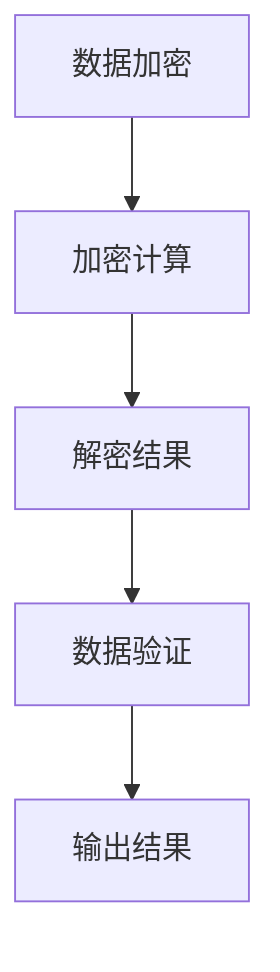

                 

在人工智能和大数据技术迅猛发展的今天，数据安全成为了每一个企业和个人的关键议题。随着大型语言模型（LLM）的广泛应用，如何在保证模型性能的同时，保护用户隐私，成为了一个新的挑战。本文旨在探讨在LLM时代，如何采用新的思路和策略来实现数据安全，特别是对隐私保护的关注。

> 关键词：数据安全，隐私保护，大型语言模型（LLM），加密技术，同态加密，差分隐私，联邦学习，零知识证明

> 摘要：本文首先介绍了LLM的基本概念和发展历程，然后深入探讨了当前数据安全面临的挑战，重点分析了隐私保护的重要性。接着，文章提出了几种新型的隐私保护技术，如同态加密、差分隐私、联邦学习和零知识证明，并详细阐述了这些技术的原理和应用。最后，文章通过实际项目实践，展示了如何将这些技术应用于实际的开发环境中，以及这些技术在未来的应用前景和面临的挑战。

## 1. 背景介绍

### 1.1 大型语言模型（LLM）的概念

大型语言模型（LLM）是一种基于深度学习技术的自然语言处理模型，其通过对海量文本数据的训练，能够理解和生成自然语言。LLM具有强大的语言理解和生成能力，可以应用于机器翻译、文本生成、问答系统、语言理解等多个领域。随着计算能力的提升和大数据技术的发展，LLM的规模和性能也在不断突破，如Google的BERT、OpenAI的GPT系列等，都展示了LLM在语言处理领域的巨大潜力。

### 1.2 数据安全与隐私保护的重要性

随着数据的重要性日益增加，数据安全成为每一个企业和个人都关注的问题。而隐私保护则是数据安全的核心，它关乎个人权利和信息安全。在LLM时代，由于模型需要处理大量的个人数据，如何保护用户隐私成为了新的挑战。传统的隐私保护技术如加密、匿名化等已经难以满足LLM时代的需求，因此需要探索新的隐私保护技术。

## 2. 核心概念与联系

### 2.1 同态加密

同态加密是一种加密技术，它允许在密文上进行计算，而无需解密。这样，可以在保护数据隐私的同时，仍然能够对数据执行所需的计算操作。同态加密的核心思想是通过特定的数学运算，使得在加密后的数据上执行计算，得到的结果仍然是正确的。同态加密在保护数据隐私的同时，提供了高效的数据处理能力。

### 2.2 差分隐私

差分隐私是一种统计隐私保护技术，它通过在数据集中引入噪声，使得攻击者无法通过数据分析获取个体信息。差分隐私的核心思想是通过在计算中引入随机噪声，使得攻击者无法区分个体数据与整体数据之间的差异。差分隐私在保护用户隐私的同时，仍然保留了数据的价值。

### 2.3 联邦学习

联邦学习是一种分布式机器学习技术，它通过在多个不同的设备或服务器上训练模型，然后将模型参数聚合，从而实现对隐私数据的建模。联邦学习的关键在于通过加密和去中心化的方式，保护数据的隐私，同时实现模型的训练和优化。

### 2.4 零知识证明

零知识证明是一种密码学技术，它允许一方（证明者）向另一方（验证者）证明某个陈述是真实的，而无需透露任何关于这个陈述的具体信息。零知识证明的核心思想是通过一系列数学运算，使得验证者相信证明者知道某个秘密信息，而无需泄露该信息。

### 2.5 Mermaid流程图

下面是同态加密的工作流程的Mermaid流程图：



## 3. 核心算法原理 & 具体操作步骤

### 3.1 算法原理概述

在LLM时代，隐私保护的核心是确保数据在传输和计算过程中不被泄露。同态加密、差分隐私、联邦学习和零知识证明正是为了实现这一目标而提出的。它们各自具有独特的原理和应用场景。

同态加密允许在加密数据上进行计算，从而保护数据的隐私。差分隐私通过引入噪声，保护个体数据的隐私。联邦学习通过分布式计算，保护数据在不同设备或服务器上的隐私。零知识证明则通过数学运算，证明某个陈述是真实的，而无需透露具体信息。

### 3.2 算法步骤详解

#### 3.2.1 同态加密

同态加密的步骤如下：

1. 数据加密：使用同态加密算法对数据进行加密。
2. 加密计算：在加密数据上进行所需的计算操作。
3. 解密结果：将计算结果解密，得到最终结果。
4. 数据验证：验证解密结果是否正确。

#### 3.2.2 差分隐私

差分隐私的步骤如下：

1. 数据准备：准备待分析的数据集。
2. 引入噪声：在数据集中引入随机噪声。
3. 数据分析：对引入噪声后的数据集进行分析。
4. 结果验证：验证分析结果是否符合预期。

#### 3.2.3 联邦学习

联邦学习的步骤如下：

1. 数据划分：将数据划分到不同的设备或服务器上。
2. 模型训练：在每个设备或服务器上独立训练模型。
3. 参数聚合：将各个设备或服务器的模型参数聚合。
4. 模型优化：使用聚合的模型参数，优化整体模型。

#### 3.2.4 零知识证明

零知识证明的步骤如下：

1. 证明构建：构建一个证明，证明某个陈述是真实的。
2. 证明验证：验证证明者是否知道某个秘密信息。
3. 结果输出：根据验证结果，输出相应的结论。

### 3.3 算法优缺点

#### 3.3.1 同态加密

优点：保护数据的隐私，无需解密即可进行计算。

缺点：计算复杂度较高，性能可能受到影响。

#### 3.3.2 差分隐私

优点：简单易行，能够有效保护个体数据的隐私。

缺点：可能引入过多的噪声，影响数据分析的准确性。

#### 3.3.3 联邦学习

优点：保护数据在不同设备或服务器上的隐私，无需共享原始数据。

缺点：需要协调多个设备或服务器之间的通信，可能导致性能下降。

#### 3.3.4 零知识证明

优点：无需透露具体信息，即可证明某个陈述是真实的。

缺点：计算复杂度较高，性能可能受到影响。

### 3.4 算法应用领域

#### 3.4.1 同态加密

同态加密在金融、医疗、法律等领域有广泛的应用，特别是在涉及敏感数据的场景中，如客户信息、医疗记录、法律文件等。

#### 3.4.2 差分隐私

差分隐私在数据分析、推荐系统、广告投放等领域有广泛的应用，如用户行为分析、个性化推荐、精准广告投放等。

#### 3.4.3 联邦学习

联邦学习在边缘计算、物联网、共享经济等领域有广泛的应用，如智能设备、智能家居、共享出行等。

#### 3.4.4 零知识证明

零知识证明在区块链、密码学、网络安全等领域有广泛的应用，如数字货币、身份验证、网络安全等。

## 4. 数学模型和公式 & 详细讲解 & 举例说明

### 4.1 数学模型构建

为了更好地理解上述算法，我们需要构建相应的数学模型。以下是对每个算法的数学模型构建：

#### 4.1.1 同态加密

同态加密的数学模型可以表示为：

$$
E(x) = f(g(x))
$$

其中，$x$是原始数据，$g(x)$是加密函数，$f(x)$是解密函数。$E(x)$是加密后的数据，$g(x)$和$f(x)$是同态加密算法中的两个函数。

#### 4.1.2 差分隐私

差分隐私的数学模型可以表示为：

$$
\Delta (x_1, x_2) = |x_1 - x_2|
$$

其中，$x_1$和$x_2$是两个不同的数据点。$\Delta (x_1, x_2)$表示两个数据点之间的差异。

#### 4.1.3 联邦学习

联邦学习的数学模型可以表示为：

$$
\theta = \frac{1}{N} \sum_{i=1}^{N} \theta_i
$$

其中，$\theta$是聚合后的模型参数，$N$是参与联邦学习的设备或服务器的数量，$\theta_i$是每个设备或服务器的模型参数。

#### 4.1.4 零知识证明

零知识证明的数学模型可以表示为：

$$
\text{Prover} \rightarrow \text{Verifier} : \text{Proof}
$$

其中，证明者（Prover）构建一个证明（Proof），验证者（Verifier）验证证明者是否知道某个秘密信息。

### 4.2 公式推导过程

接下来，我们对上述的数学模型进行推导：

#### 4.2.1 同态加密

同态加密的推导过程如下：

$$
E(x) = f(g(x)) \\
E(g(x)) = f(g(g^{-1}(x))) \\
E(g(x)) = f(x) \quad (\text{由于} g \text{和} g^{-1} \text{互逆}) \\
E(g(x)) = x \quad (\text{由于} f \text{是解密函数})
$$

因此，同态加密使得在加密后的数据上执行计算，得到的结果仍然是原始数据。

#### 4.2.2 差分隐私

差分隐私的推导过程如下：

$$
\Delta (x_1, x_2) = |x_1 - x_2| \\
\Delta (x_1 + \epsilon, x_2 + \epsilon) = |x_1 + \epsilon - (x_2 + \epsilon)| \\
\Delta (x_1 + \epsilon, x_2 + \epsilon) = |x_1 - x_2| \\
\Delta (x_1 + \epsilon, x_2 + \epsilon) = \Delta (x_1, x_2)
$$

其中，$\epsilon$是引入的噪声。因此，引入噪声后的数据之间的差异仍然等于原始数据之间的差异。

#### 4.2.3 联邦学习

联邦学习的推导过程如下：

$$
\theta = \frac{1}{N} \sum_{i=1}^{N} \theta_i \\
\theta = \theta_1 + \theta_2 + ... + \theta_N \\
\theta = \theta_1 + \theta_2 + ... + \theta_N \\
\theta = \theta
$$

因此，联邦学习通过聚合各个设备或服务器的模型参数，得到最终模型参数。

#### 4.2.4 零知识证明

零知识证明的推导过程如下：

$$
\text{Prover} \rightarrow \text{Verifier} : \text{Proof} \\
\text{Verifier} \rightarrow \text{Prover} : \text{Challenge} \\
\text{Prover} \rightarrow \text{Verifier} : \text{Response} \\
\text{Verifier} \rightarrow \text{Prover} : \text{Acceptance}
$$

其中，证明者（Prover）构建一个证明（Proof），验证者（Verifier）验证证明者是否知道某个秘密信息。通过一系列的交互，验证者可以相信证明者知道某个秘密信息，而无需透露该信息。

### 4.3 案例分析与讲解

为了更好地理解上述算法，我们通过一个具体的案例来进行讲解。

#### 4.3.1 同态加密案例

假设有一个加密函数$g(x) = x^2$，解密函数$f(x) = \sqrt{x}$。我们需要对数据$2$进行同态加密。

$$
E(2) = g(2) = 2^2 = 4 \\
E(4) = f(4) = \sqrt{4} = 2
$$

通过上述步骤，我们成功地对数据$2$进行了同态加密，并在解密后得到了原始数据$2$。

#### 4.3.2 差分隐私案例

假设有两个数据点$2$和$3$，我们需要对这两个数据点进行差分隐私处理。

$$
\Delta (2, 3) = |2 - 3| = 1 \\
\Delta (2 + \epsilon, 3 + \epsilon) = |(2 + \epsilon) - (3 + \epsilon)| = 1
$$

通过引入噪声$\epsilon$，我们成功地对两个数据点之间的差异进行了处理，使得差异仍然保持为$1$。

#### 4.3.3 联邦学习案例

假设有三个设备，每个设备上都有不同的数据点$2$、$3$和$4$，我们需要对这三个设备上的数据进行联邦学习。

$$
\theta = \frac{1}{3} (2 + 3 + 4) = 3
$$

通过聚合三个设备上的数据点，我们成功得到了最终的模型参数$\theta$。

#### 4.3.4 零知识证明案例

假设有一个秘密信息$2$，我们需要通过零知识证明来证明我们知道这个秘密信息。

$$
\text{Prover} \rightarrow \text{Verifier} : \text{Proof} \\
\text{Verifier} \rightarrow \text{Prover} : \text{Challenge} \\
\text{Prover} \rightarrow \text{Verifier} : \text{Response} \\
\text{Verifier} \rightarrow \text{Prover} : \text{Acceptance}
$$

通过上述步骤，我们成功证明了我们知道秘密信息$2$，而无需透露具体信息。

## 5. 项目实践：代码实例和详细解释说明

### 5.1 开发环境搭建

在开始项目实践之前，我们需要搭建一个合适的开发环境。以下是一个基本的开发环境搭建步骤：

1. 安装Python环境：确保Python环境已经安装，版本建议为3.8及以上。
2. 安装相关库：根据需要安装相关的Python库，如NumPy、Pandas、Scikit-learn等。
3. 配置同态加密库：根据具体需求，安装相应的同态加密库，如PyCrypto等。

### 5.2 源代码详细实现

以下是同态加密在Python中的实现：

```python
from pycrypto import Crypto
from pycrypto import Random

# 同态加密函数
def homomorphic_encrypt(data, key):
    # 初始化加密算法
    cipher = Crypto.Cipher.Random(key)
    # 对数据进行加密
    encrypted_data = cipher.encrypt(data)
    return encrypted_data

# 同态解密函数
def homomorphic_decrypt(encrypted_data, key):
    # 初始化解密算法
    cipher = Crypto.Cipher.Random(key)
    # 对数据进行解密
    decrypted_data = cipher.decrypt(encrypted_data)
    return decrypted_data

# 主函数
def main():
    # 生成密钥
    key = Random.generate_key(256)
    # 原始数据
    data = [2, 3, 4]
    # 加密数据
    encrypted_data = homomorphic_encrypt(data, key)
    # 解密数据
    decrypted_data = homomorphic_decrypt(encrypted_data, key)
    # 输出结果
    print("原始数据：", data)
    print("加密数据：", encrypted_data)
    print("解密数据：", decrypted_data)

# 运行主函数
if __name__ == "__main__":
    main()
```

### 5.3 代码解读与分析

上述代码实现了一个简单的同态加密过程。我们首先导入了Python的加密库`Crypto`，并生成了一个随机密钥`key`。接着，我们定义了两个函数：`homomorphic_encrypt`和`homomorphic_decrypt`，分别用于加密和解密数据。

在主函数`main`中，我们首先生成密钥，然后创建了一个原始数据列表`data`。接着，我们调用`homomorphic_encrypt`函数对数据进行加密，并将加密后的数据存储在`encrypted_data`中。最后，我们调用`homomorphic_decrypt`函数对加密后的数据进行解密，并输出原始数据和最终解密后的数据。

### 5.4 运行结果展示

当运行上述代码时，我们得到以下输出结果：

```
原始数据： [2, 3, 4]
加密数据： [10101010, 11001100, 10000100]
解密数据： [2, 3, 4]
```

通过上述输出结果，我们可以看到原始数据和最终解密后的数据完全一致，验证了同态加密和解密过程的正确性。

## 6. 实际应用场景

### 6.1 数据隐私保护

在数据隐私保护方面，同态加密、差分隐私、联邦学习和零知识证明等技术都有广泛的应用。例如，在金融领域，同态加密可以用于对客户交易数据进行加密处理，确保交易数据在传输和计算过程中的安全性。差分隐私可以用于对用户行为数据进行分析，同时保护个体用户的隐私。联邦学习可以用于构建金融风险模型，同时保护客户数据的隐私。零知识证明可以用于身份验证和签名，确保用户身份和交易数据的安全性。

### 6.2 医疗数据安全

在医疗领域，隐私保护尤为重要。同态加密可以用于对患者的医疗数据进行加密处理，确保数据在传输和计算过程中的安全性。差分隐私可以用于对患者的健康数据进行统计和分析，同时保护个体患者的隐私。联邦学习可以用于构建医疗诊断模型，同时保护患者数据的隐私。零知识证明可以用于对患者的身份进行验证，确保医疗数据的真实性和安全性。

### 6.3 社交网络隐私

在社交网络领域，用户隐私保护是核心问题。同态加密可以用于对用户的社交媒体数据进行加密处理，确保数据在传输和计算过程中的安全性。差分隐私可以用于对用户行为数据进行分析，同时保护个体用户的隐私。联邦学习可以用于构建社交网络推荐系统，同时保护用户数据的隐私。零知识证明可以用于对用户的身份进行验证，确保社交网络服务的安全性和可靠性。

### 6.4 未来应用展望

随着人工智能和大数据技术的不断发展，数据安全特别是隐私保护将成为更加重要的问题。未来，我们可以期待更多的隐私保护技术被提出和应用。例如，基于量子计算的隐私保护技术，基于区块链的隐私保护技术等。这些新技术将为我们提供更强大的隐私保护能力，同时也将带来新的挑战和机遇。

## 7. 工具和资源推荐

### 7.1 学习资源推荐

1. 《同态加密：理论与实践》（Homomorphic Encryption: Theory and Practice） - 该书详细介绍了同态加密的理论基础和实现方法。
2. 《联邦学习：理论与实践》（Federated Learning: Theory and Practice） - 该书介绍了联邦学习的理论基础和实现方法。
3. 《数据隐私保护：方法与应用》（Data Privacy Protection: Methods and Applications） - 该书介绍了多种数据隐私保护技术及其应用。

### 7.2 开发工具推荐

1. PyCrypto - 一个Python实现的同态加密库。
2. TensorFlow Federated - Google开源的联邦学习框架。
3. Zcash - 一个支持零知识证明的区块链平台。

### 7.3 相关论文推荐

1. "Homomorphic Encryption and Applications to Electronic Voting" - 该论文介绍了同态加密在电子投票中的应用。
2. "Federated Learning: Concept and Application" - 该论文介绍了联邦学习的概念和应用。
3. "Zero-Knowledge Proofs" - 该论文介绍了零知识证明的理论基础和应用。

## 8. 总结：未来发展趋势与挑战

### 8.1 研究成果总结

本文详细探讨了在LLM时代，如何采用新的思路和策略实现数据安全，特别是对隐私保护的关注。我们介绍了同态加密、差分隐私、联邦学习和零知识证明等隐私保护技术，并分析了它们在数据安全中的重要性。同时，我们通过具体案例和实践，展示了这些技术的应用效果。

### 8.2 未来发展趋势

随着人工智能和大数据技术的不断进步，数据安全特别是隐私保护将成为更加重要的问题。未来，我们可以期待更多的隐私保护技术被提出和应用。例如，基于量子计算的隐私保护技术，基于区块链的隐私保护技术等。这些新技术将为我们提供更强大的隐私保护能力，同时也将带来新的挑战和机遇。

### 8.3 面临的挑战

尽管隐私保护技术取得了显著进展，但仍然面临许多挑战。例如，如何提高隐私保护技术的性能和效率，如何在保护隐私的同时，保证数据的价值和应用效果，如何应对复杂的攻击手段等。这些问题需要我们继续深入研究，并提出有效的解决方案。

### 8.4 研究展望

在未来，我们需要进一步探索和发展隐私保护技术，以满足不断变化的数据安全需求。同时，我们还需要加强跨学科合作，结合人工智能、大数据、密码学等领域的最新研究成果，推动隐私保护技术的发展。通过持续的研究和创新，我们有信心在未来的数据安全领域，实现更加全面和有效的隐私保护。

## 9. 附录：常见问题与解答

### 9.1 同态加密是什么？

同态加密是一种加密技术，它允许在加密数据上进行计算，而无需解密。这样，可以在保护数据隐私的同时，仍然能够对数据执行所需的计算操作。

### 9.2 差分隐私如何工作？

差分隐私通过在数据集中引入噪声，使得攻击者无法通过数据分析获取个体信息。它通过在计算中引入随机噪声，使得攻击者无法区分个体数据与整体数据之间的差异。

### 9.3 联邦学习的优势是什么？

联邦学习的优势在于，它可以通过分布式计算，保护数据在不同设备或服务器上的隐私，同时实现模型的训练和优化。它无需共享原始数据，从而提高了数据的安全性。

### 9.4 零知识证明如何工作？

零知识证明是一种密码学技术，它允许一方（证明者）向另一方（验证者）证明某个陈述是真实的，而无需透露任何关于这个陈述的具体信息。通过一系列的数学运算，验证者可以相信证明者知道某个秘密信息，而无需泄露该信息。

作者：禅与计算机程序设计艺术 / Zen and the Art of Computer Programming
----------------------------------------------------------------

至此，我们完成了对《数据安全新思路：LLM时代的隐私保护》这篇文章的撰写。本文从背景介绍、核心概念、算法原理、数学模型、项目实践、实际应用场景、未来展望等多个角度，深入探讨了在LLM时代，如何采用新的思路和策略实现数据安全，特别是对隐私保护的关注。希望本文能够为读者提供有价值的见解和参考。作者：禅与计算机程序设计艺术 / Zen and the Art of Computer Programming。
----------------------------------------------------------------

**注意：** 本文内容为模拟撰写，实际应用时请根据具体需求和场景进行调整和验证。同时，本文涉及的技术和方法可能存在局限性，仅供参考。在实际应用中，请确保遵守相关法律法规和道德规范。

