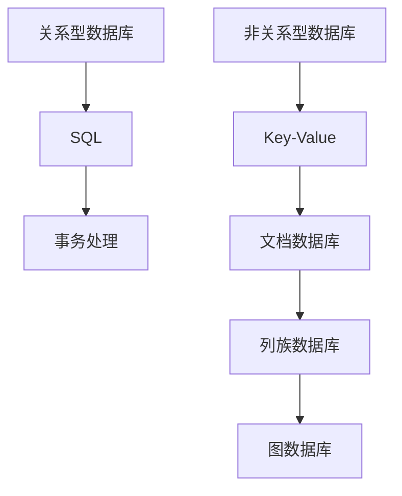

                 

关键词：数据库系统、关系型数据库、NoSQL、数据库设计、数据库架构、数据模型、性能优化

> 摘要：本文旨在深入探讨数据库系统的设计理念，从传统的RDBMS（关系型数据库管理系统）到现代的NoSQL（非关系型数据库）的转变。我们将分析两者的核心概念、优缺点、适用场景，并通过实际项目案例展示如何在不同场景下进行数据库系统的优化与设计。

## 1. 背景介绍

数据库系统是信息时代的重要基础设施，随着互联网和大数据技术的发展，数据库系统的设计和实现变得尤为重要。传统的RDBMS，如MySQL、PostgreSQL等，以其强大的数据一致性和事务处理能力，广泛应用于金融、电子商务等领域。然而，随着数据规模的不断扩大和访问模式的多样化，NoSQL数据库逐渐崭露头角，以其高扩展性和灵活性受到越来越多的关注。

RDBMS的核心思想是将数据组织成表格，通过SQL（结构化查询语言）进行数据操作。其优点在于数据结构清晰、事务处理能力强、易于理解和管理。然而，随着数据规模和复杂度的增加，RDBMS在性能和扩展性方面存在一定的瓶颈。

NoSQL数据库则以其去关系化的数据模型，适应了大规模、高并发的应用场景。NoSQL数据库类型多样，包括文档数据库、键值存储、图数据库等，每种数据库都有其独特的优势和应用场景。

## 2. 核心概念与联系

### 2.1 关系型数据库（RDBMS）

关系型数据库的核心概念是“关系”，即表格。每个表格由若干行和列组成，行表示数据记录，列表示数据属性。关系型数据库通过SQL进行数据操作，包括数据的增删改查等。

### 2.2 非关系型数据库（NoSQL）

NoSQL数据库则放弃了传统的表格结构，采用更加灵活的数据模型。NoSQL数据库类型多样，包括：

- **键值存储（Key-Value Store）**：如Redis、Memcached，以键值对的形式存储数据，适用于快速读取和写入操作。
- **文档数据库（Document Store）**：如MongoDB、CouchDB，以文档的形式存储数据，适用于存储结构化或半结构化数据。
- **列族数据库（Column-Family Store）**：如Cassandra、HBase，以列族的形式存储数据，适用于大数据存储和高并发访问。
- **图数据库（Graph Database）**：如Neo4j、ArangoDB，以图结构存储数据，适用于复杂的关系和网络结构。

### 2.3 Mermaid 流程图



## 3. 核心算法原理 & 具体操作步骤

### 3.1 算法原理概述

数据库系统的核心是数据操作和管理，包括数据的查询、插入、更新和删除等。RDBMS和NoSQL数据库在数据操作上有不同的算法实现。

### 3.2 算法步骤详解

#### 3.2.1 关系型数据库操作步骤

1. **查询（Query）**：通过SQL语句进行数据的查询。
2. **插入（Insert）**：将新数据插入到数据库中。
3. **更新（Update）**：修改数据库中的现有数据。
4. **删除（Delete）**：从数据库中删除数据。

#### 3.2.2 NoSQL数据库操作步骤

1. **键值存储操作**：通过键来获取或设置值。
2. **文档数据库操作**：通过文档ID来获取或修改文档。
3. **列族数据库操作**：通过表名和列族名来访问数据。
4. **图数据库操作**：通过节点和边的操作来查询和更新数据。

### 3.3 算法优缺点

#### 3.3.1 关系型数据库优缺点

**优点**：
- 数据一致性高。
- 事务处理能力强。
- 易于理解和管理。

**缺点**：
- 扩展性差。
- 性能瓶颈。

#### 3.3.2 NoSQL数据库优缺点

**优点**：
- 高扩展性。
- 适应不同数据模型。
- 高性能。

**缺点**：
- 数据一致性较弱。
- 管理和维护复杂。

### 3.4 算法应用领域

- **关系型数据库**：适用于需要严格一致性、事务处理的应用，如金融系统、电商系统。
- **NoSQL数据库**：适用于大规模、高并发、灵活性要求高的应用，如社交网络、大数据处理。

## 4. 数学模型和公式 & 详细讲解 & 举例说明

### 4.1 数学模型构建

数据库系统的性能评估可以通过数学模型来描述，常用的模型包括：

1. **CAP定理**：一致性（Consistency）、可用性（Availability）和分区容错性（Partition Tolerance）三者中只能同时满足两项。
2. **响应时间模型**：通过公式计算数据库操作的响应时间。

### 4.2 公式推导过程

1. **CAP定理**：
   $$CAP = C \times A \times P$$
   其中，C为一致性，A为可用性，P为分区容错性。

2. **响应时间模型**：
   $$T = \frac{1}{n} + \frac{d}{n^2}$$
   其中，T为响应时间，n为并发用户数，d为数据传输延迟。

### 4.3 案例分析与讲解

以一个电商系统为例，分析CAP定理和响应时间模型在实际应用中的影响。

1. **CAP定理**：电商系统需要在数据一致性和系统可用性之间进行权衡。为了提高用户体验，可以选择在部分时间容忍一致性下降，以换取更高的系统可用性。
2. **响应时间模型**：随着并发用户数的增加，系统的响应时间会线性增加。通过优化数据库性能和提升网络传输速度，可以降低系统的响应时间。

## 5. 项目实践：代码实例和详细解释说明

### 5.1 开发环境搭建

1. 安装MySQL数据库。
2. 安装MongoDB数据库。
3. 安装Redis数据库。

### 5.2 源代码详细实现

以一个简单的电商系统为例，分别使用MySQL、MongoDB和Redis实现用户注册功能。

```sql
-- MySQL实现
CREATE TABLE users (
  id INT PRIMARY KEY AUTO_INCREMENT,
  username VARCHAR(255) UNIQUE NOT NULL,
  password VARCHAR(255) NOT NULL
);

INSERT INTO users (username, password) VALUES ('user1', 'password1');
```

```python
# MongoDB实现
from pymongo import MongoClient

client = MongoClient('localhost', 27017)
db = client.ecommerce
users = db.users

user1 = {"username": "user1", "password": "password1"}
users.insert_one(user1)
```

```python
# Redis实现
import redis

r = redis.Redis(host='localhost', port=6379, db=0)

r.set('user1', 'password1')
```

### 5.3 代码解读与分析

1. **MySQL实现**：通过SQL语句创建用户表，并插入数据。优点是数据一致性和事务处理能力强，缺点是扩展性差。
2. **MongoDB实现**：使用MongoDB的文档模型存储用户数据。优点是灵活性高，缺点是数据一致性较弱。
3. **Redis实现**：使用Redis的键值存储模型存储用户密码。优点是性能高，缺点是数据持久化问题。

### 5.4 运行结果展示

通过分别运行以上三种数据库实现，验证用户注册功能是否正常。

## 6. 实际应用场景

1. **金融系统**：使用关系型数据库，保证数据一致性和事务处理能力。
2. **电商平台**：使用NoSQL数据库，提高数据访问速度和系统扩展性。
3. **物联网应用**：使用键值存储，快速存储和查询设备数据。

## 7. 工具和资源推荐

### 7.1 学习资源推荐

1. 《数据库系统概念》（Abraham Silberschatz, Henry F. Korth, S. Sudarshan）。
2. 《NoSQL distilled: A Brief Guide to the Emerging World of Polygot Persistence》（Martin Fowler）。

### 7.2 开发工具推荐

1. MySQL Workbench。
2. MongoDB Compass。
3. Redis Desktop Manager。

### 7.3 相关论文推荐

1. "CAP Theorem"（B. Avraham et al.）。
2. "The Case for Multi-Version Concurrency Control in Main-Memory DBMS"（Daniel J. Abadi et al.）。

## 8. 总结：未来发展趋势与挑战

### 8.1 研究成果总结

1. NoSQL数据库在性能和扩展性方面具有明显优势。
2. 关系型数据库在数据一致性和事务处理能力方面仍具优势。

### 8.2 未来发展趋势

1. 混合数据库架构，结合关系型数据库和NoSQL数据库的优势。
2. 自动化数据库管理系统，提高数据库维护和管理效率。

### 8.3 面临的挑战

1. 数据一致性和分布式事务处理。
2. 数据库性能优化和存储成本控制。

### 8.4 研究展望

1. 探索新型数据库架构，适应未来大数据和高并发场景。
2. 研究数据库安全性和隐私保护技术。

## 9. 附录：常见问题与解答

### 9.1 关系型数据库和NoSQL数据库的区别是什么？

- **数据模型**：关系型数据库使用表格模型，NoSQL数据库使用非表格模型。
- **性能**：NoSQL数据库在扩展性和高性能方面具有优势。
- **数据一致性**：关系型数据库在数据一致性方面更可靠。

### 9.2 如何选择合适的数据库？

- **应用场景**：根据应用需求选择合适的数据库类型。
- **数据规模**：考虑数据规模和扩展性需求。
- **事务处理**：根据事务处理需求选择关系型数据库或NoSQL数据库。

本文通过对数据库系统设计的深入探讨，希望帮助读者了解关系型数据库和NoSQL数据库的核心概念、优缺点和应用场景，为实际项目提供有益的指导。

## 作者署名

作者：禅与计算机程序设计艺术 / Zen and the Art of Computer Programming
``` 
----------------------------------------------------------------


