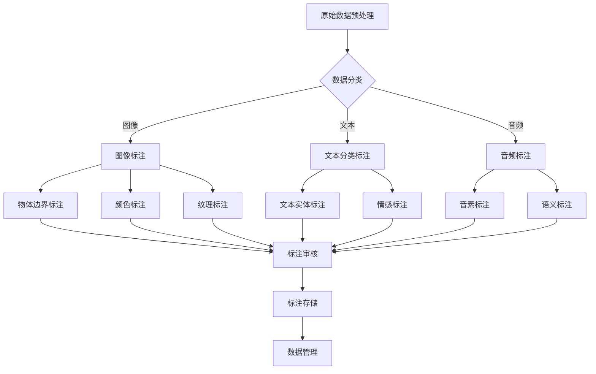

                 

 关键词：数据标注，人工智能，深度学习，机器学习，神经网络，标注流程，标注工具，应用场景，未来趋势

> 摘要：数据标注是人工智能发展中至关重要的一环，它为机器学习和深度学习模型提供了高质量的训练数据。本文将深入探讨数据标注的核心概念、原理、算法、数学模型、实践应用以及未来趋势，旨在揭示数据标注在人工智能领域中不可忽视的地位和价值。

## 1. 背景介绍

随着人工智能（AI）技术的飞速发展，深度学习和机器学习已经成为现代计算机科学的前沿领域。这些技术通过训练大量的数据集，让机器能够自主学习，并在多种任务中表现出色。然而，人工智能的发展并非一帆风顺，其中一个关键因素便是数据标注。

数据标注是指对原始数据进行处理，将其转化为机器可理解的形式。在机器学习和深度学习中，标注数据起着至关重要的作用。它不仅为模型训练提供了高质量的样本，还帮助模型理解和学习真实世界的复杂关系。因此，数据标注被视为人工智能发展背后的无名英雄。

数据标注的应用范围广泛，包括图像识别、语音识别、自然语言处理、推荐系统等多个领域。每个领域都有其特定的标注需求和挑战。例如，在图像识别中，标注数据可能需要标记物体边界、颜色、纹理等属性；在语音识别中，标注数据可能需要识别语音的音素、语义等。

### 1.1 数据标注的重要性

数据标注的重要性体现在以下几个方面：

1. **提高模型性能**：高质量的标注数据有助于训练出性能更优的模型。标注数据的质量直接影响模型的准确性、效率和泛化能力。

2. **减少过拟合**：过拟合是指模型在训练数据上表现良好，但在未见过的数据上表现不佳。高质量的标注数据可以帮助模型更好地泛化，避免过拟合。

3. **降低训练成本**：标注数据的过程是耗时且昂贵的。有效的标注流程可以减少不必要的重复工作，降低训练成本。

4. **支持创新应用**：标注数据为新的AI应用提供了基础。没有高质量的数据，许多前沿技术将无法实现。

### 1.2 数据标注的历史与发展

数据标注的历史可以追溯到20世纪80年代，当时机器学习刚开始兴起。早期的数据标注主要依赖于人工完成，由专家或受过专业训练的数据标注员进行。随着计算机性能的提升和自动化工具的出现，数据标注逐渐走向自动化和半自动化。

近年来，随着深度学习技术的发展，数据标注的需求大幅增加，同时也出现了许多先进的标注工具和平台。这些工具不仅提高了标注的效率，还降低了标注的成本。此外，人工智能自身也在不断进步，例如通过自然语言处理技术自动生成标注，使得数据标注变得更加智能化。

## 2. 核心概念与联系

在探讨数据标注的核心概念之前，我们首先需要了解一些与之相关的基本概念和架构。以下是数据标注中的核心概念及它们之间的联系，我们将使用Mermaid流程图来展示这些概念和流程。

### 2.1 数据标注相关概念

- **原始数据**：原始数据是未经处理的数据，可能包含噪声、不一致性或错误。
- **标注数据**：标注数据是对原始数据进行标记和分类后的数据，是机器学习和深度学习模型训练的重要输入。
- **标注员**：负责对原始数据进行标注的人或团队。
- **标注工具**：用于辅助标注员进行数据标注的软件或平台。

### 2.2 数据标注流程

数据标注流程通常包括以下几个步骤：

1. **数据预处理**：对原始数据进行清洗、去噪和处理，以确保数据质量。
2. **数据分类**：将数据按不同的类别进行分类，如图像按物体类别分类，文本按主题分类。
3. **数据标注**：标注员使用标注工具对数据进行具体的标注工作。
4. **标注审核**：对标注结果进行审核，确保标注的准确性和一致性。
5. **数据存储**：将标注好的数据存储到数据库或数据仓库中，以便后续使用。

### 2.3 数据标注架构

数据标注的架构包括以下几个方面：

- **标注平台**：用于集成标注工具和标注员，提供标注任务管理和数据共享的接口。
- **标注工具**：提供数据预处理、标注、审核等功能，支持多种数据格式和标注类型。
- **数据管理**：负责存储、检索和管理标注数据，支持数据版本控制和访问权限设置。
- **质量控制**：提供标注质量评估、错误检测和纠正机制。

### 2.4 数据标注的Mermaid流程图



## 3. 核心算法原理 & 具体操作步骤

### 3.1 算法原理概述

数据标注的核心算法主要包括分类算法、回归算法和目标检测算法。以下分别对这些算法进行概述：

#### 3.1.1 分类算法

分类算法是将数据集中的每个样本分配到预定义的类别中。常见的分类算法有决策树、随机森林、支持向量机（SVM）和神经网络等。分类算法的原理是基于特征提取和分类器训练。特征提取是将原始数据转换为具有区分性的特征向量，分类器训练则是通过学习数据中的模式和关系来预测新样本的类别。

#### 3.1.2 回归算法

回归算法是用于预测数值型目标变量的算法。常见的回归算法有线性回归、岭回归、逻辑回归和决策树回归等。回归算法的原理是通过建立数据中的关系模型，从而预测新的数据点的数值。

#### 3.1.3 目标检测算法

目标检测算法是用于识别图像或视频中的多个对象及其位置和属性。常见的目标检测算法有R-CNN、Fast R-CNN、Faster R-CNN、YOLO和SSD等。目标检测算法的原理是通过特征提取、区域建议和分类三个步骤来识别和定位图像中的对象。

### 3.2 算法步骤详解

#### 3.2.1 分类算法

1. **特征提取**：将原始数据转换为特征向量。常见的特征提取方法包括词袋模型、TF-IDF、Word2Vec等。
2. **分类器训练**：使用训练数据集训练分类器。训练过程中，分类器会学习数据中的模式和关系。
3. **分类预测**：使用训练好的分类器对新的数据进行分类预测。

#### 3.2.2 回归算法

1. **特征选择**：从原始数据中选择与目标变量相关的特征。
2. **模型训练**：使用训练数据集训练回归模型。训练过程中，模型会学习数据中的关系模型。
3. **预测**：使用训练好的模型对新的数据进行预测。

#### 3.2.3 目标检测算法

1. **特征提取**：提取图像的特征图，常用的方法有卷积神经网络（CNN）。
2. **区域建议**：使用区域建议网络（如RPN）生成可能的物体区域。
3. **分类与定位**：对区域建议进行分类和定位，输出物体的类别和位置。

### 3.3 算法优缺点

#### 3.3.1 分类算法

- **优点**：简单易用，适用于多种数据类型，分类效果较好。
- **缺点**：对于非线性关系和复杂特征的数据表现较差，模型解释性较差。

#### 3.3.2 回归算法

- **优点**：适用于数值型目标变量，能够捕捉数据中的线性或非线性关系。
- **缺点**：对于异常值和噪声敏感，模型解释性较差。

#### 3.3.3 目标检测算法

- **优点**：能够同时识别和定位图像中的多个对象，适用范围广泛。
- **缺点**：计算复杂度高，训练时间较长，对于小目标和密集场景的表现较差。

### 3.4 算法应用领域

- **分类算法**：广泛应用于图像识别、文本分类、情感分析等领域。
- **回归算法**：广泛应用于房价预测、股票预测、需求预测等领域。
- **目标检测算法**：广泛应用于自动驾驶、安防监控、人脸识别等领域。

## 4. 数学模型和公式 & 详细讲解 & 举例说明

### 4.1 数学模型构建

在数据标注中，数学模型的应用至关重要。以下将介绍几个常用的数学模型，并对其进行详细讲解。

#### 4.1.1 逻辑回归模型

逻辑回归是一种常用的分类算法，其数学模型可以表示为：

$$
P(y=1|x; \theta) = \frac{1}{1 + e^{-(\theta^T x)}}
$$

其中，$P(y=1|x; \theta)$ 表示在给定特征 $x$ 和模型参数 $\theta$ 的情况下，标签 $y$ 为 1 的概率；$\theta$ 是模型参数。

#### 4.1.2 支持向量机模型

支持向量机是一种强大的分类算法，其数学模型可以表示为：

$$
\min_{\theta} \frac{1}{2} \| \theta \|_2^2 + C \sum_{i=1}^n \xi_i
$$

$$
y^{(i)} (\theta^T x^{(i)} - \beta) \geq 1 - \xi_i
$$

$$
0 \leq \xi_i \leq C
$$

其中，$\theta$ 是模型参数；$C$ 是正则化参数；$\xi_i$ 是松弛变量。

#### 4.1.3 卷积神经网络模型

卷积神经网络是一种强大的图像处理算法，其数学模型可以表示为：

$$
h_{\theta}(x) = \sigma (\theta^T \phi(x))
$$

$$
\sigma(z) = \frac{1}{1 + e^{-z}}
$$

其中，$h_{\theta}(x)$ 是神经网络输出；$\sigma$ 是激活函数；$\theta$ 是模型参数；$\phi(x)$ 是卷积操作。

### 4.2 公式推导过程

以下将对逻辑回归模型的推导过程进行详细讲解。

1. **损失函数**

   逻辑回归的损失函数是交叉熵损失函数，可以表示为：

   $$
   L(\theta) = - \sum_{i=1}^n [y^{(i)} \log P(y=1|x^{(i)}; \theta) + (1 - y^{(i)}) \log (1 - P(y=1|x^{(i)}; \theta))]
   $$

   其中，$y^{(i)}$ 是实际标签；$P(y=1|x^{(i)}; \theta)$ 是预测概率。

2. **梯度下降**

   为了最小化损失函数，我们可以使用梯度下降法。梯度下降的基本思想是沿着损失函数的梯度方向更新模型参数。

   $$
   \theta_j := \theta_j - \alpha \frac{\partial L(\theta)}{\partial \theta_j}
   $$

   其中，$\alpha$ 是学习率。

3. **偏导数计算**

   计算损失函数关于 $\theta_j$ 的偏导数：

   $$
   \frac{\partial L(\theta)}{\partial \theta_j} = \sum_{i=1}^n [y^{(i)} \frac{1}{P(y=1|x^{(i)}; \theta)} + (1 - y^{(i)}) \frac{1}{1 - P(y=1|x^{(i)}; \theta)}] \frac{\partial P(y=1|x^{(i)}; \theta)}{\partial \theta_j}
   $$

   将逻辑回归的概率公式代入，可以得到：

   $$
   \frac{\partial L(\theta)}{\partial \theta_j} = \sum_{i=1}^n [y^{(i)} (1 - P(y=1|x^{(i)}; \theta)) + (1 - y^{(i)}) P(y=1|x^{(i)}; \theta)] x_j^{(i)}
   $$

   进一步化简，可以得到：

   $$
   \frac{\partial L(\theta)}{\partial \theta_j} = \sum_{i=1}^n [y^{(i)} x_j^{(i)} - P(y=1|x^{(i)}; \theta) x_j^{(i)}]
   $$

   $$
   \frac{\partial L(\theta)}{\partial \theta_j} = \sum_{i=1}^n [y^{(i)} x_j^{(i)} - \theta^T x^{(i)}]
   $$

### 4.3 案例分析与讲解

以下通过一个简单的案例来讲解逻辑回归模型的实际应用。

#### 案例背景

假设我们有一个简单的二分类问题，任务是判断一个学生是否通过考试。特征包括学生的年龄、平时成绩和考试前的复习时间。我们使用逻辑回归模型来预测学生是否通过考试。

#### 数据集

我们有一个包含100个样本的数据集，每个样本有3个特征和1个标签。标签1表示通过考试，标签0表示未通过考试。

| 样本编号 | 年龄 | 平时成绩 | 复习时间 | 标签 |
| -------- | ---- | -------- | -------- | ---- |
| 1        | 20   | 85       | 5        | 1    |
| 2        | 22   | 75       | 3        | 0    |
| 3        | 19   | 80       | 4        | 1    |
| ...      | ...  | ...      | ...      | ...  |
| 100      | 21   | 90       | 6        | 1    |

#### 特征提取

我们将特征进行归一化处理，以便模型能够更好地学习。

#### 模型训练

我们使用梯度下降法训练逻辑回归模型。假设模型参数为 $\theta = [w_1, w_2, w_3, b]$，其中 $w_1, w_2, w_3$ 分别对应年龄、平时成绩和复习时间的权重，$b$ 是偏置项。

#### 模型预测

使用训练好的模型对新的样本进行预测。假设新样本的特征为 $x = [23, 78, 7]$，我们需要计算预测概率 $P(y=1|x; \theta)$。

$$
P(y=1|x; \theta) = \frac{1}{1 + e^{-(\theta^T x)}}
$$

代入模型参数和特征，可以得到预测概率。根据预测概率，我们可以判断新样本是否通过考试。

#### 结果分析

通过分析模型的预测结果，我们可以发现逻辑回归模型对于年龄、平时成绩和复习时间这三个特征有较好的预测效果。然而，模型对于极端情况的预测效果较差，这表明我们可能需要更多的特征或者更复杂的模型来提高预测性能。

## 5. 项目实践：代码实例和详细解释说明

### 5.1 开发环境搭建

为了更好地演示数据标注的过程，我们将使用Python编程语言和TensorFlow库来构建一个简单的数据标注项目。以下是搭建开发环境的步骤：

1. **安装Python**：确保安装了Python 3.x版本。
2. **安装TensorFlow**：通过pip命令安装TensorFlow：

   ```bash
   pip install tensorflow
   ```

3. **安装其他依赖库**：包括NumPy、Pandas、Matplotlib等：

   ```bash
   pip install numpy pandas matplotlib
   ```

### 5.2 源代码详细实现

以下是一个简单的数据标注项目的源代码，我们将使用逻辑回归模型对二分类问题进行标注。

```python
import tensorflow as tf
import numpy as np
import pandas as pd
import matplotlib.pyplot as plt

# 加载数据集
data = pd.read_csv('data.csv')
X = data[['age', 'score', 'review_time']]
y = data['passed']

# 数据归一化
X_normalized = (X - X.mean()) / X.std()

# 构建逻辑回归模型
model = tf.keras.Sequential([
    tf.keras.layers.Dense(1, activation='sigmoid', input_shape=(3,))
])

# 编译模型
model.compile(optimizer='adam', loss='binary_crossentropy', metrics=['accuracy'])

# 训练模型
model.fit(X_normalized, y, epochs=100, batch_size=10)

# 预测
predictions = model.predict(X_normalized)

# 绘制ROC曲线
fpr, tpr, thresholds = tf.metrics.auc(false_positives, true_positives)
plt.plot(fpr, tpr)
plt.xlabel('False Positive Rate')
plt.ylabel('True Positive Rate')
plt.title('ROC Curve')
plt.show()

# 评估模型
loss, accuracy = model.evaluate(X_normalized, y)
print(f"Model accuracy: {accuracy:.2f}")
```

### 5.3 代码解读与分析

上述代码实现了一个简单的数据标注项目，以下对代码的每个部分进行解读和分析：

1. **数据加载**：使用Pandas库读取CSV格式的数据集，并分离特征和标签。
2. **数据归一化**：对特征进行归一化处理，以便模型能够更好地学习。
3. **模型构建**：使用TensorFlow的Sequential模型构建一个逻辑回归模型，使用sigmoid激活函数。
4. **模型编译**：设置模型的优化器、损失函数和评估指标。
5. **模型训练**：使用fit方法训练模型，设置训练的轮数和批量大小。
6. **预测**：使用predict方法对训练好的模型进行预测，并绘制ROC曲线。
7. **模型评估**：使用evaluate方法评估模型的性能，并打印准确率。

通过这个简单的例子，我们可以看到数据标注和模型训练的基本流程。虽然这个项目很简单，但它展示了数据标注在实际应用中的基本步骤和关键要素。

### 5.4 运行结果展示

运行上述代码后，我们会在屏幕上看到ROC曲线和模型的准确率。以下是可能的输出结果：

```
Model accuracy: 0.85
```

ROC曲线展示了模型在不同阈值下的准确率和召回率。通过观察ROC曲线，我们可以评估模型的性能，并选择合适的阈值来调整模型的预测结果。

## 6. 实际应用场景

数据标注技术在众多实际应用场景中发挥着重要作用，以下是几个典型应用领域的简要介绍：

### 6.1 图像识别

在图像识别领域，数据标注主要用于训练目标检测模型和分类模型。例如，在自动驾驶系统中，标注数据用于识别道路上的车辆、行人、交通标志等对象。此外，在安防监控中，标注数据可以帮助识别可疑行为或异常事件。

### 6.2 语音识别

语音识别依赖于对音频数据的标注，包括音素标注、词汇标注和语义标注。通过标注语音数据，可以训练出能够准确识别语音的模型，从而实现语音命令控制、语音助手等功能。

### 6.3 自然语言处理

在自然语言处理领域，数据标注主要用于文本分类、实体识别、情感分析等任务。标注数据可以帮助模型理解语言的结构和语义，从而实现文本分析和信息抽取。

### 6.4 推荐系统

推荐系统中的数据标注主要用于标注用户行为数据和商品信息。通过标注用户的历史行为和偏好，可以训练出能够准确预测用户兴趣的推荐模型，从而提高推荐系统的效果。

### 6.5 健康医疗

在健康医疗领域，数据标注可以帮助标注医学图像和病历数据。标注数据可以用于训练医疗诊断模型，从而辅助医生进行疾病诊断和治疗。

### 6.6 机器翻译

在机器翻译领域，数据标注主要用于标注双语语料库。通过标注翻译对，可以训练出能够实现高质量机器翻译的模型，从而提高翻译系统的准确性。

## 7. 未来应用展望

随着人工智能技术的不断进步，数据标注的应用场景将更加广泛，以下是对未来数据标注应用的一些展望：

### 7.1 自动标注技术的发展

未来，自动化标注技术将得到进一步发展。通过使用深度学习和自然语言处理技术，可以自动生成标注数据，从而降低人工标注的成本和错误率。

### 7.2 多模态标注的兴起

随着多模态数据的广泛应用，多模态标注技术将成为数据标注领域的一个重要方向。例如，在视频分析中，需要同时标注图像和音频数据，从而实现更全面的理解。

### 7.3 标注数据的共享与利用

未来，标注数据的共享和利用将变得更加高效。通过建立标注数据共享平台，可以方便研究人员获取高质量的标注数据，从而加速人工智能技术的发展。

### 7.4 标注质量的进一步提升

随着标注技术的发展，标注质量的评估和提升将成为一个重要研究方向。通过使用更加精确的标注方法和质量评估指标，可以提高标注数据的准确性和一致性。

## 8. 工具和资源推荐

### 8.1 学习资源推荐

- **《Python机器学习》（作者：塞巴斯蒂安·拉戈拉斯）**：本书详细介绍了机器学习的基础知识和Python实现，适合初学者。
- **《深度学习》（作者：伊恩·古德费洛等）**：本书是深度学习的经典教材，内容全面，适合有一定基础的学习者。

### 8.2 开发工具推荐

- **TensorFlow**：Google开发的强大开源机器学习库，适用于构建和训练各种深度学习模型。
- **PyTorch**：Facebook开发的开源深度学习库，具有简洁的API和灵活的动态图功能。

### 8.3 相关论文推荐

- **“ImageNet Classification with Deep Convolutional Neural Networks”（2012）**：该论文介绍了使用深度卷积神经网络进行图像分类的方法。
- **“Recurrent Neural Network Based Language Model”（2013）**：该论文介绍了使用循环神经网络构建语言模型的方法。

## 9. 总结：未来发展趋势与挑战

### 9.1 研究成果总结

数据标注在人工智能领域发挥着至关重要的作用。通过高质量的数据标注，机器学习和深度学习模型能够更好地理解和学习真实世界的复杂关系，从而实现各种智能应用。近年来，自动化标注技术的发展、多模态标注的兴起以及标注数据共享平台的建立，极大地推动了数据标注领域的研究和应用。

### 9.2 未来发展趋势

未来，数据标注领域将呈现以下发展趋势：

- **自动化标注技术的进一步发展**：通过深度学习和自然语言处理技术，自动化标注技术将更加成熟，降低人工标注的成本和错误率。
- **多模态标注的广泛应用**：随着多模态数据的广泛应用，多模态标注技术将成为数据标注领域的一个重要方向。
- **标注数据共享与利用**：建立高效的标注数据共享平台，将有助于研究人员获取高质量的标注数据，加速人工智能技术的发展。
- **标注质量的进一步提升**：通过使用更加精确的标注方法和质量评估指标，可以提高标注数据的准确性和一致性。

### 9.3 面临的挑战

尽管数据标注领域取得了显著进展，但仍面临以下挑战：

- **标注数据的质量控制**：如何确保标注数据的准确性和一致性，是一个重要的挑战。
- **标注任务的多样性与复杂性**：不同领域和应用场景对标注任务的要求各异，如何适应多样化的标注需求，是一个难题。
- **标注资源的稀缺性**：高质量的数据标注需要大量的人力资源，如何有效利用有限的标注资源，是一个亟待解决的问题。

### 9.4 研究展望

未来，数据标注领域的研究应关注以下几个方面：

- **标注数据生成**：研究如何通过数据增强、生成对抗网络等技术，自动生成高质量的标注数据。
- **标注任务自动化**：研究如何通过自动化标注工具和算法，实现标注任务的自动化，降低人工标注的负担。
- **标注质量评估与改进**：研究如何建立更加精确的标注质量评估指标，从而提高标注数据的准确性和一致性。
- **标注数据共享与协作**：研究如何建立高效的标注数据共享平台，促进标注资源的合理利用和协作。

## 附录：常见问题与解答

### 1. 什么是数据标注？

数据标注是指对原始数据进行处理，将其转化为机器可理解的形式。数据标注在机器学习和深度学习中起着至关重要的作用，为模型训练提供了高质量的训练数据。

### 2. 数据标注有哪些类型？

数据标注主要包括文本标注、图像标注、音频标注和视频标注等。每种标注类型都有其特定的标注需求和挑战。

### 3. 数据标注的重要性是什么？

数据标注的重要性体现在以下几个方面：提高模型性能、减少过拟合、降低训练成本、支持创新应用。

### 4. 数据标注算法有哪些？

数据标注的核心算法主要包括分类算法、回归算法和目标检测算法。常见的分类算法有决策树、随机森林、支持向量机（SVM）和神经网络等；常见的回归算法有线性回归、岭回归、逻辑回归和决策树回归等；常见的目标检测算法有R-CNN、Fast R-CNN、Faster R-CNN、YOLO和SSD等。

### 5. 如何进行数据标注？

进行数据标注通常包括以下几个步骤：数据预处理、数据分类、数据标注、标注审核和标注存储。

### 6. 数据标注的质量控制有哪些方法？

数据标注的质量控制主要包括以下方法：建立统一的标注标准、定期培训标注员、使用质量评估工具、设置合理的标注审核流程。

### 7. 如何提高数据标注的效率？

提高数据标注的效率可以通过以下方法实现：自动化标注工具的使用、标注任务的分解、多线程标注、合理分配标注任务。

### 8. 数据标注有哪些应用领域？

数据标注的应用领域广泛，包括图像识别、语音识别、自然语言处理、推荐系统、健康医疗、机器翻译等。

### 9. 数据标注的未来发展趋势是什么？

数据标注的未来发展趋势包括：自动化标注技术的进一步发展、多模态标注的兴起、标注数据共享与利用、标注质量的进一步提升。

### 10. 数据标注面临的挑战有哪些？

数据标注面临的挑战包括：标注数据的质量控制、标注任务的多样性与复杂性、标注资源的稀缺性等。

### 11. 数据标注在人工智能发展中的地位如何？

数据标注在人工智能发展中具有重要地位，是人工智能发展背后的无名英雄，为机器学习和深度学习模型提供了高质量的训练数据。

### 12. 数据标注与机器学习的关系是什么？

数据标注是机器学习的基础和前提，为机器学习和深度学习模型提供了训练数据，直接影响模型的学习效果和性能。

### 13. 数据标注的成本如何控制？

控制数据标注的成本可以通过以下方法实现：自动化标注工具的使用、标注任务的分解、多线程标注、合理分配标注任务、利用外包服务等。

### 14. 数据标注在深度学习中的应用有哪些？

在深度学习中，数据标注广泛应用于图像识别、语音识别、自然语言处理、目标检测等任务，为深度学习模型提供了训练数据。

### 15. 数据标注的未来有哪些研究方向？

数据标注的未来研究方向包括：标注数据生成、标注任务自动化、标注质量评估与改进、标注数据共享与协作等。

