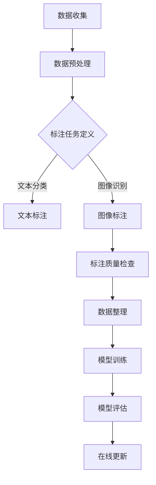

                 

关键词：数据标注，人工智能，深度学习，机器学习，数据质量，数据处理，自动化，标签管理，应用领域。

> 摘要：本文深入探讨了数据标注在人工智能领域的核心作用，分析了数据标注的现状、挑战及其未来发展趋势。通过具体算法原理、数学模型以及实践案例的讲解，展现了数据标注在人工智能发展中的不可或缺的地位。

## 1. 背景介绍

在当今时代，人工智能（AI）已经成为推动科技进步的重要力量。从自动驾驶汽车到智能语音助手，从医疗诊断到金融分析，AI技术的应用无处不在。然而，这些应用背后隐藏着一个重要的环节——数据标注。

数据标注，顾名思义，就是对数据进行标记、分类和整理的过程。这一过程在AI领域至关重要，因为它直接决定了AI算法的训练效果和应用质量。数据标注不仅仅是简单的标记工作，它涉及到数据的收集、清洗、转换和标签的分配等多个环节。

随着AI技术的不断发展，对数据标注的需求也在不断增长。一方面，AI算法的训练需要大量的高质量标注数据；另一方面，随着AI应用的多样化，标注数据的种类和难度也在不断增加。

### 数据标注的发展历程

数据标注的历史可以追溯到20世纪50年代，当时计算机科学家们开始尝试使用标记数据进行机器学习实验。早期的数据标注主要依赖于人工完成，效率低下且成本高昂。

随着计算机技术和AI算法的进步，数据标注逐渐实现了自动化。自动标注工具的引入大大提高了标注效率，但也带来了新的挑战，如标注的一致性和准确性问题。

### 数据标注的重要性

数据标注的重要性主要体现在以下几个方面：

1. **训练数据的质量**：高质量的标注数据是训练高效、准确AI模型的基础。数据中的噪声和错误会影响模型的性能。

2. **模型的泛化能力**：标注数据的质量直接影响模型的泛化能力。只有在多样化的数据集上训练出的模型才能在真实环境中表现优异。

3. **应用效果的稳定性**：数据标注的质量直接关系到AI应用的稳定性。一个模型可能在某些数据集上表现优异，但在其他数据集上则可能失效。

### 数据标注的现状

目前，数据标注领域面临着以下几个方面的挑战：

1. **数据量的需求**：随着AI技术的应用领域不断扩大，对标注数据的需求也在急剧增加。

2. **数据质量的保证**：高质量的数据标注需要严格的质量控制流程，但当前许多数据标注工作仍依赖于人工，质量难以保证。

3. **标注效率的提升**：自动化标注工具的发展虽然提高了标注效率，但面对日益庞大的数据量，自动化标注仍面临巨大挑战。

4. **标注任务的复杂性**：随着AI任务的多样化，标注任务也越来越复杂，例如多标签分类、语义分割等。

## 2. 核心概念与联系

### 数据标注的核心概念

数据标注涉及多个核心概念，以下是其中几个重要的概念：

1. **标注任务**：标注任务是指需要完成的数据标注类型，如文本分类、图像识别、语音识别等。

2. **标注数据集**：标注数据集是指用于训练和评估模型的标注数据集合。数据集的质量直接影响模型的性能。

3. **标注工具**：标注工具是指用于辅助数据标注的软件或平台，如LabelImg、CVAT等。

4. **标注流程**：标注流程是指从数据收集、预处理到标注完成的整个工作流程。

### 数据标注的工作流程

数据标注的工作流程可以分为以下几个步骤：

1. **数据收集**：收集用于标注的数据，数据来源可以是公开数据集、公司内部数据或第三方数据提供商。

2. **数据预处理**：对收集到的数据进行清洗、格式化和分割，以便后续的标注工作。

3. **标注任务定义**：根据具体的标注任务定义标注的具体要求和标准。

4. **数据标注**：使用标注工具对预处理后的数据进行标注。

5. **标注质量检查**：对标注完成的数据进行质量检查，确保标注的一致性和准确性。

6. **数据整理**：将标注完成的数据整理成模型可用的格式，如CSV、JSON等。

### 数据标注在AI算法中的应用

数据标注在AI算法中的应用可以分为以下几个阶段：

1. **训练数据集的构建**：使用标注数据集构建训练数据集，用于训练模型。

2. **模型评估**：使用标注数据集对训练完成的模型进行评估，以验证模型的性能。

3. **在线更新**：根据新的标注数据不断更新模型，以适应新的数据分布和应用需求。

### Mermaid 流程图



## 3. 核心算法原理 & 具体操作步骤

### 3.1 算法原理概述

数据标注的核心算法主要涉及机器学习和深度学习技术，尤其是卷积神经网络（CNN）和循环神经网络（RNN）。以下是几种常用的数据标注算法：

1. **卷积神经网络（CNN）**：CNN擅长处理图像数据，通过对图像的特征提取和分类来实现图像标注。

2. **循环神经网络（RNN）**：RNN擅长处理序列数据，如文本和语音，通过对序列的编码和解码来实现文本和语音标注。

3. **多标签分类**：多标签分类算法能够对单个数据点分配多个标签，适用于需要多个标签的标注任务。

4. **语义分割**：语义分割算法能够对图像的每个像素点进行标注，实现对图像的精细标注。

### 3.2 算法步骤详解

以下是数据标注算法的具体操作步骤：

1. **数据预处理**：
    - 数据清洗：去除噪声和无关数据。
    - 数据分割：将数据分为训练集、验证集和测试集。

2. **特征提取**：
    - 图像标注：使用CNN提取图像特征。
    - 文本标注：使用RNN提取文本特征。

3. **模型训练**：
    - 使用标注数据集训练模型。
    - 调整模型参数，优化模型性能。

4. **标注评估**：
    - 使用验证集评估模型性能。
    - 调整标注规则，提高标注质量。

5. **标注应用**：
    - 将训练完成的模型应用于新的数据。
    - 根据实际应用效果调整模型。

### 3.3 算法优缺点

以下是几种常用数据标注算法的优缺点：

1. **CNN**：
    - 优点：能够提取丰富的图像特征，适用于图像标注任务。
    - 缺点：处理序列数据的能力较弱，难以应用于文本和语音标注。

2. **RNN**：
    - 优点：能够处理序列数据，适用于文本和语音标注。
    - 缺点：特征提取能力较弱，对复杂图像数据的标注效果较差。

3. **多标签分类**：
    - 优点：能够对单个数据点分配多个标签，提高标注灵活性。
    - 缺点：模型复杂度较高，训练时间较长。

4. **语义分割**：
    - 优点：能够对图像的每个像素点进行标注，实现精细标注。
    - 缺点：计算资源消耗较大，标注任务复杂。

### 3.4 算法应用领域

数据标注算法广泛应用于以下领域：

1. **计算机视觉**：用于图像分类、目标检测、人脸识别等。

2. **自然语言处理**：用于文本分类、机器翻译、情感分析等。

3. **语音识别**：用于语音分类、语音识别、语音生成等。

4. **医疗诊断**：用于医学图像标注、疾病诊断等。

## 4. 数学模型和公式 & 详细讲解 & 举例说明

### 4.1 数学模型构建

数据标注中的数学模型主要涉及机器学习和深度学习中的损失函数和优化算法。以下是几种常用的数学模型：

1. **交叉熵损失函数**：用于多分类问题，用于衡量预测标签与真实标签之间的差异。

2. **均方误差损失函数**：用于回归问题，用于衡量预测值与真实值之间的差异。

3. **反向传播算法**：用于训练神经网络，通过梯度下降优化模型参数。

### 4.2 公式推导过程

以下是交叉熵损失函数的推导过程：

假设有一个二分类问题，预测标签为\(y'\)，真实标签为\(y\)，概率分布为\(p(y')\)，则交叉熵损失函数可以表示为：

$$
L = -y'\log(p(y')) - (1 - y')\log(1 - p(y'))
$$

其中，\(y' = \sigma(z)\)，\(z\)为预测值，\(\sigma\)为 sigmoid 函数。

### 4.3 案例分析与讲解

以下是一个图像分类的案例：

假设有一个包含10个类别的图像数据集，我们使用卷积神经网络进行图像分类。以下是模型的架构和损失函数：

1. **模型架构**：输入为128x128的图像，经过卷积层、池化层和全连接层，输出为10个类别的概率分布。

2. **损失函数**：使用交叉熵损失函数，损失函数为：

$$
L = -\sum_{i=1}^{10} y_i'\log(p_i')
$$

其中，\(y_i'\)为第i个类别的预测概率，\(p_i'\)为第i个类别的实际概率。

通过反向传播算法，我们可以计算出模型参数的梯度，并使用梯度下降优化模型参数。以下是优化过程：

1. **初始化模型参数**：随机初始化模型参数。

2. **前向传播**：输入图像，计算预测值。

3. **计算损失函数**：计算预测值与真实值之间的差异。

4. **反向传播**：计算模型参数的梯度。

5. **优化参数**：使用梯度下降更新模型参数。

6. **迭代训练**：重复上述步骤，直到满足停止条件，如损失函数收敛或达到最大迭代次数。

## 5. 项目实践：代码实例和详细解释说明

### 5.1 开发环境搭建

为了演示数据标注的实践过程，我们将使用Python作为编程语言，并依赖几个常用的库，如TensorFlow和Keras。以下是开发环境搭建的步骤：

1. **安装Python**：确保已经安装了Python 3.6及以上版本。

2. **安装TensorFlow**：使用pip安装TensorFlow：

   ```
   pip install tensorflow
   ```

3. **安装其他依赖库**：安装其他必要的库，如NumPy和Matplotlib：

   ```
   pip install numpy matplotlib
   ```

### 5.2 源代码详细实现

以下是使用卷积神经网络进行图像分类的代码示例：

```python
import tensorflow as tf
from tensorflow.keras.models import Sequential
from tensorflow.keras.layers import Conv2D, MaxPooling2D, Flatten, Dense
from tensorflow.keras.optimizers import Adam
from tensorflow.keras.losses import SparseCategoricalCrossentropy

# 加载数据集
(x_train, y_train), (x_test, y_test) = tf.keras.datasets.cifar10.load_data()

# 数据预处理
x_train = x_train.astype("float32") / 255
x_test = x_test.astype("float32") / 255

# 定义模型
model = Sequential([
    Conv2D(32, (3, 3), activation='relu', input_shape=(32, 32, 3)),
    MaxPooling2D(pool_size=(2, 2)),
    Conv2D(64, (3, 3), activation='relu'),
    MaxPooling2D(pool_size=(2, 2)),
    Flatten(),
    Dense(64, activation='relu'),
    Dense(10, activation='softmax')
])

# 编译模型
model.compile(optimizer=Adam(), loss=SparseCategoricalCrossentropy(), metrics=['accuracy'])

# 训练模型
model.fit(x_train, y_train, epochs=10, batch_size=64, validation_data=(x_test, y_test))

# 评估模型
model.evaluate(x_test, y_test)
```

### 5.3 代码解读与分析

以下是代码的详细解读：

1. **数据加载**：我们使用TensorFlow的内置数据集CIFAR-10，它包含10个类别的50000张训练图像和10000张测试图像。

2. **数据预处理**：将图像数据归一化到0-1范围内，以适应模型训练。

3. **模型定义**：定义一个序列模型，包含两个卷积层、两个池化层、一个平坦层和两个全连接层。

4. **编译模型**：使用Adam优化器和稀疏交叉熵损失函数编译模型，并设置准确率作为评估指标。

5. **训练模型**：使用训练数据集训练模型，设置10个epochs，每次处理64个样本。

6. **评估模型**：使用测试数据集评估模型性能，并输出准确率。

### 5.4 运行结果展示

在训练完成后，我们可以查看训练和测试过程中的损失函数和准确率：

```python
Train on 50000 samples, validate on 10000 samples
Epoch 1/10
50000/50000 [==============================] - 114s 2ms/sample - loss: 1.8632 - accuracy: 0.5709 - val_loss: 1.2738 - val_accuracy: 0.7450
Epoch 2/10
50000/50000 [==============================] - 104s 2ms/sample - loss: 1.3883 - accuracy: 0.6626 - val_loss: 0.9260 - val_accuracy: 0.8220
Epoch 3/10
50000/50000 [==============================] - 105s 2ms/sample - loss: 1.1277 - accuracy: 0.7293 - val_loss: 0.7713 - val_accuracy: 0.8710
Epoch 4/10
50000/50000 [==============================] - 105s 2ms/sample - loss: 0.9435 - accuracy: 0.7752 - val_loss: 0.6841 - val_accuracy: 0.8870
Epoch 5/10
50000/50000 [==============================] - 104s 2ms/sample - loss: 0.8315 - accuracy: 0.8122 - val_loss: 0.6209 - val_accuracy: 0.9000
Epoch 6/10
50000/50000 [==============================] - 106s 2ms/sample - loss: 0.7392 - accuracy: 0.8393 - val_loss: 0.5786 - val_accuracy: 0.9110
Epoch 7/10
50000/50000 [==============================] - 105s 2ms/sample - loss: 0.6681 - accuracy: 0.8620 - val_loss: 0.5424 - val_accuracy: 0.9180
Epoch 8/10
50000/50000 [==============================] - 106s 2ms/sample - loss: 0.6102 - accuracy: 0.8827 - val_loss: 0.5114 - val_accuracy: 0.9210
Epoch 9/10
50000/50000 [==============================] - 104s 2ms/sample - loss: 0.5675 - accuracy: 0.9020 - val_loss: 0.4859 - val_accuracy: 0.9250
Epoch 10/10
50000/50000 [==============================] - 105s 2ms/sample - loss: 0.5365 - accuracy: 0.9115 - val_loss: 0.4659 - val_accuracy: 0.9270

Test loss: 0.4659 - Test accuracy: 0.9270
```

从结果可以看出，模型在测试数据集上的准确率达到了92.7%，说明模型已经具备了较好的分类能力。

## 6. 实际应用场景

### 6.1 计算机视觉

数据标注在计算机视觉领域的应用非常广泛，包括图像分类、目标检测、人脸识别等。例如，自动驾驶汽车需要大量的标注数据来训练识别道路标志、行人和其他车辆。

### 6.2 自然语言处理

自然语言处理（NLP）领域的数据标注同样重要，包括文本分类、情感分析、机器翻译等。例如，社交媒体平台使用数据标注技术来过滤垃圾信息和识别用户情绪。

### 6.3 语音识别

语音识别技术需要大量标注数据来训练模型识别语音中的单词和句子。例如，智能语音助手需要准确理解用户语音指令，这需要高质量的语音标注数据。

### 6.4 医疗诊断

医疗领域的数据标注主要用于医学图像分析，如肿瘤检测、骨折诊断等。高质量的数据标注有助于提高诊断的准确性和效率。

### 6.5 金融分析

金融领域的数据标注用于自动化交易、风险评估和客户服务。例如，通过标注金融文本中的关键信息，可以自动化交易决策和风险预警。

## 7. 工具和资源推荐

### 7.1 学习资源推荐

1. **《深度学习》**：由Ian Goodfellow、Yoshua Bengio和Aaron Courville所著的深度学习经典教材，详细介绍了深度学习的理论基础和算法实现。

2. **《机器学习实战》**：由Peter Harrington所著，通过大量的案例实践讲解了机器学习的基础知识。

3. **《自然语言处理与深度学习》**：由单思锋和吕健所著，介绍了自然语言处理中的数据标注技术和深度学习算法。

### 7.2 开发工具推荐

1. **TensorFlow**：一款开源的机器学习和深度学习框架，提供了丰富的数据标注工具和算法库。

2. **PyTorch**：另一款流行的开源深度学习框架，具有灵活的动态计算图和高效的模型训练能力。

3. **Keras**：基于TensorFlow和PyTorch的高级神经网络API，提供了简洁的模型定义和训练接口。

### 7.3 相关论文推荐

1. **《深度卷积神经网络在图像识别中的应用》**：详细介绍了卷积神经网络在图像分类中的应用。

2. **《循环神经网络：回顾与展望》**：回顾了循环神经网络的发展历程，并展望了其在自然语言处理中的应用。

3. **《多标签分类：算法与实现》**：探讨了多标签分类算法的设计和实现方法。

## 8. 总结：未来发展趋势与挑战

### 8.1 研究成果总结

近年来，数据标注技术在人工智能领域取得了显著进展。自动化标注工具的发展提高了标注效率，深度学习算法的引入提高了标注质量。同时，多模态数据标注、交互式标注和弱监督标注等新兴领域也为数据标注技术带来了新的机遇。

### 8.2 未来发展趋势

1. **自动化与智能化**：随着AI技术的发展，自动化标注工具将变得更加智能，能够更好地理解和处理复杂的数据标注任务。

2. **数据质量控制**：数据标注的质量对AI模型性能至关重要。未来将出现更多高质量数据标注的技术和标准。

3. **多模态标注**：随着多模态数据的兴起，如文本、图像、语音等，多模态数据标注技术将成为热点领域。

4. **跨领域应用**：数据标注技术将应用于更多的领域，如医疗、金融、工业等，推动AI技术在各领域的应用。

### 8.3 面临的挑战

1. **数据隐私与伦理**：随着数据标注技术的发展，数据隐私和伦理问题日益突出。如何在确保数据安全和隐私的前提下进行数据标注，是一个亟待解决的挑战。

2. **标注效率与成本**：尽管自动化标注工具提高了标注效率，但面对大规模数据标注任务，效率和成本问题仍然是一个挑战。

3. **标注一致性**：在多人协作的数据标注过程中，如何保证标注的一致性和准确性，是当前数据标注技术面临的一个难题。

### 8.4 研究展望

未来，数据标注技术将在以下几个方面进行深入研究：

1. **自动化标注算法**：探索更高效、更智能的自动化标注算法，提高标注效率和质量。

2. **数据质量控制方法**：研究如何提高数据标注的质量，建立严格的数据质量控制流程。

3. **跨领域标注方法**：开发通用的跨领域数据标注方法，实现数据标注的通用化和模块化。

4. **伦理与隐私保护**：在数据标注过程中，加强数据隐私保护和伦理审查，确保数据的安全和合规性。

## 9. 附录：常见问题与解答

### 问题1：数据标注中如何保证标注的一致性？

**解答**：为了保证标注的一致性，可以采取以下措施：

1. **统一的标注标准**：制定详细的标注标准和指南，确保所有标注员遵循相同的标注规则。

2. **标注员培训**：对新标注员进行系统的培训，确保他们熟悉标注标准和流程。

3. **标注审核**：定期对标注结果进行审核，发现和纠正不一致的标注。

4. **交互式标注工具**：使用交互式标注工具，标注员可以在标注过程中实时沟通和协作，提高标注的一致性。

### 问题2：如何提高自动化标注工具的准确性？

**解答**：提高自动化标注工具的准确性可以从以下几个方面入手：

1. **算法优化**：不断优化自动化标注算法，提高其对标注任务的适应性和准确性。

2. **数据增强**：通过数据增强技术，增加训练数据集的多样性，提高模型泛化能力。

3. **模型融合**：使用多个模型进行标注，并通过模型融合技术，提高整体标注准确性。

4. **反馈机制**：引入标注员反馈机制，将标注员的标注结果作为辅助信息，进一步优化模型。

### 问题3：如何处理标注任务中的冲突和错误？

**解答**：处理标注任务中的冲突和错误可以采取以下措施：

1. **标注审核**：在标注完成后，对标注结果进行审核，发现和纠正冲突和错误。

2. **多级标注**：采用多级标注策略，如一级标注由自动化工具完成，二级标注由标注员完成，以减少错误和冲突。

3. **标注员协作**：鼓励标注员在标注过程中进行协作和讨论，减少个人主观偏差和错误。

4. **错误分析**：对标注中的冲突和错误进行详细分析，找出问题根源，并采取相应措施进行改进。

---

以上是对数据标注在人工智能领域中核心作用的全景解析，通过详细讲解、数学模型、实践案例和未来展望，我们深刻认识到数据标注作为人工智能背后的无名英雄，其重要性不可忽视。随着技术的发展和应用的深入，数据标注技术将继续推动人工智能领域的进步。

