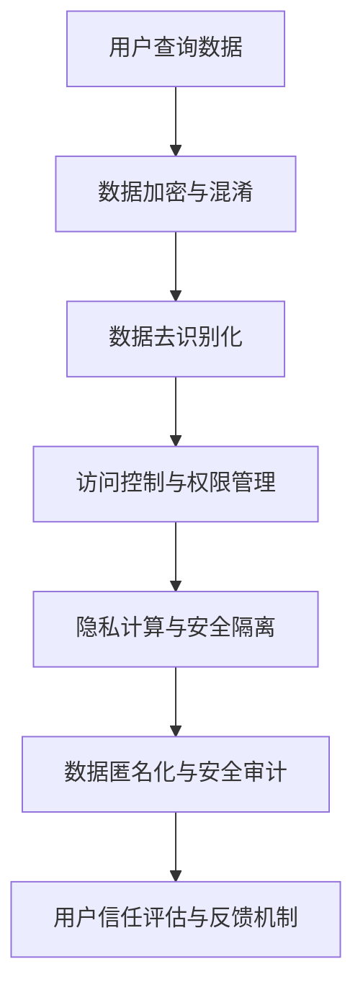

                 

关键词：数据隐私保护、人工智能、AI搜索、信任基础、安全算法、算法原理、数学模型、实际应用、未来展望

> 摘要：随着人工智能技术的发展，AI搜索在各个领域得到了广泛应用。然而，数据隐私保护成为了一个不可忽视的问题。本文将深入探讨数据隐私保护在AI搜索中的重要性，分析核心概念与联系，介绍核心算法原理，并探讨未来发展趋势与挑战。

## 1. 背景介绍

近年来，人工智能（AI）技术取得了显著的进展，尤其是在机器学习、深度学习等领域。AI搜索作为人工智能的一个重要应用方向，通过大数据分析、自然语言处理等技术，提供了更加智能、精准的信息检索服务。然而，随着AI搜索的普及，数据隐私保护问题逐渐凸显。

在传统的搜索过程中，用户查询数据、搜索历史等个人信息被大量收集和存储。这些数据一旦泄露，可能导致用户的隐私被侵犯，甚至引发严重的后果。此外，一些不法分子也可能利用这些信息进行恶意攻击，对个人和社会造成危害。因此，如何在保证AI搜索高效、准确的同时，实现数据隐私保护，成为了一个亟待解决的问题。

## 2. 核心概念与联系

### 2.1 数据隐私保护

数据隐私保护是指保护用户个人信息不被未经授权的第三方获取、使用或泄露。在AI搜索中，数据隐私保护涉及到用户查询数据、搜索历史、个人信息等敏感信息的保护。

### 2.2 AI搜索

AI搜索是指利用人工智能技术，通过对大规模数据的分析、挖掘和处理，为用户提供更加智能、精准的信息检索服务。AI搜索的核心技术包括自然语言处理、机器学习、深度学习等。

### 2.3 信任基础

信任基础是指在AI搜索过程中，用户对搜索结果和数据隐私保护的信任。一个可靠的AI搜索系统应该能够确保用户数据的安全，并提供真实、准确、有用的搜索结果。

### 2.4 Mermaid流程图

以下是数据隐私保护在AI搜索中的核心概念与联系的Mermaid流程图：



## 3. 核心算法原理 & 具体操作步骤

### 3.1 算法原理概述

数据隐私保护在AI搜索中的核心算法主要包括数据加密与混淆、数据去识别化、访问控制与权限管理、隐私计算与安全隔离、数据匿名化与安全审计等。

- 数据加密与混淆：通过对用户查询数据进行加密和混淆处理，防止数据在传输和存储过程中被窃取和篡改。
- 数据去识别化：通过删除或替换用户个人信息中的敏感信息，降低隐私泄露风险。
- 访问控制与权限管理：通过对用户身份进行验证和权限分配，确保数据只能被授权用户访问和使用。
- 隐私计算与安全隔离：通过在数据存储和处理过程中，实现隐私计算和安全隔离，防止数据在传输和存储过程中被窃取和泄露。
- 数据匿名化与安全审计：通过对用户数据进行匿名化处理，降低隐私泄露风险，并建立安全审计机制，确保数据安全。

### 3.2 算法步骤详解

以下是数据隐私保护在AI搜索中的具体操作步骤：

1. 用户查询数据的加密与混淆处理
2. 用户查询数据的数据去识别化处理
3. 用户身份验证与权限分配
4. 数据存储和处理的隐私计算与安全隔离
5. 数据匿名化处理
6. 建立安全审计机制，对数据安全进行持续监控

### 3.3 算法优缺点

数据隐私保护在AI搜索中具有以下优缺点：

- 优点：
  - 提高用户数据的安全性，防止数据泄露和滥用。
  - 保护用户隐私，增强用户对AI搜索的信任。
  - 符合法律法规和道德伦理要求，降低法律风险。
- 缺点：
  - 可能会增加系统复杂度和性能开销。
  - 难以保证完全的隐私保护，存在一定的安全漏洞。

### 3.4 算法应用领域

数据隐私保护在AI搜索中具有广泛的应用领域，包括但不限于以下几个方面：

- 搜索引擎：保护用户查询数据和个人信息，确保用户隐私安全。
- 社交网络：防止用户个人信息泄露，增强社交信任。
- 电子商务：保障用户交易数据的安全，提升用户体验。
- 医疗健康：保护患者个人信息和病历数据，确保医疗信息安全。

## 4. 数学模型和公式 & 详细讲解 & 举例说明

### 4.1 数学模型构建

在数据隐私保护中，我们可以使用以下数学模型：

- 数据加密模型：加密算法（如AES、RSA等）
- 数据去识别化模型：敏感信息删除、替换等操作
- 访问控制模型：基于角色访问控制（RBAC）、基于属性访问控制（ABAC）等
- 隐私计算模型：安全多方计算、安全隔离等

### 4.2 公式推导过程

以数据加密模型为例，我们可以使用以下公式进行加密和解密：

- 加密公式：\(C = E(K, P)\)，其中 \(C\) 表示加密后的数据，\(K\) 表示加密密钥，\(P\) 表示明文数据。
- 解密公式：\(P = D(K, C)\)，其中 \(P\) 表示解密后的数据，\(K\) 表示解密密钥，\(C\) 表示加密后的数据。

### 4.3 案例分析与讲解

假设用户查询数据为 "我喜欢看电影"，我们可以使用AES加密算法对其进行加密和解密：

- 加密过程：
  - 选择AES加密密钥 \(K = 87654321\)。
  - 将用户查询数据 "我喜欢看电影" 分块，每个块为128位。
  - 对每个块进行AES加密，得到加密后的数据 \(C\)。
  - 将加密后的数据 \(C\) 输出。

- 解密过程：
  - 选择AES解密密钥 \(K = 87654321\)。
  - 将加密后的数据 \(C\) 分块，每个块为128位。
  - 对每个块进行AES解密，得到解密后的数据 \(P\)。
  - 将解密后的数据 \(P\) 输出。

## 5. 项目实践：代码实例和详细解释说明

### 5.1 开发环境搭建

- 硬件要求：计算机一台，配置不低于Intel Core i5处理器、8GB内存。
- 软件要求：安装Python 3.8及以上版本、PyCryptoDome库。

### 5.2 源代码详细实现

以下是使用Python实现的简单数据加密与解密示例代码：

```python
from Crypto.Cipher import AES
from Crypto.Util.Padding import pad, unpad
from base64 import b64encode, b64decode

# AES加密算法示例
def encrypt_aes(data, key):
    cipher = AES.new(key, AES.MODE_CBC)
    ct_bytes = cipher.encrypt(pad(data.encode('utf-8'), AES.block_size))
    iv = b64encode(cipher.iv).decode('utf-8')
    ct = b64encode(ct_bytes).decode('utf-8')
    return iv, ct

# AES解密算法示例
def decrypt_aes(iv, ct, key):
    iv = b64decode(iv)
    ct = b64decode(ct)
    cipher = AES.new(key, AES.MODE_CBC, iv)
    pt = unpad(cipher.decrypt(ct), AES.block_size)
    return pt.decode('utf-8')

# 测试数据加密与解密
key = b'1234567890123456'
data = '我喜欢看电影'

iv, ct = encrypt_aes(data, key)
print('加密后的数据:', iv, ct)

iv = b64decode(iv.encode('utf-8'))
ct = b64decode(ct.encode('utf-8'))
pt = decrypt_aes(iv, ct, key)
print('解密后的数据:', pt)
```

### 5.3 代码解读与分析

- 代码首先引入了PyCryptoDome库中的AES加密算法和填充与解填充函数。
- `encrypt_aes` 函数用于实现AES加密过程，包括密钥生成、数据分块加密和IV编码。
- `decrypt_aes` 函数用于实现AES解密过程，包括IV解码、数据分块解密和解填充。
- 测试代码使用了固定的密钥和明文数据进行加密和解密，并输出了结果。

## 6. 实际应用场景

### 6.1 搜索引擎

搜索引擎需要保护用户的查询数据和搜索历史，确保用户隐私不被泄露。通过数据加密、数据去识别化等技术，可以有效地保护用户隐私。

### 6.2 社交网络

社交网络需要保护用户发布的个人信息、聊天记录等敏感数据。通过数据加密、数据匿名化等技术，可以有效地降低隐私泄露风险。

### 6.3 电子商务

电子商务平台需要保护用户的交易数据、收货地址等敏感信息。通过数据加密、访问控制等技术，可以确保用户数据的安全。

### 6.4 医疗健康

医疗健康领域涉及大量患者个人信息和病历数据，需要确保数据安全。通过数据加密、隐私计算等技术，可以有效地保护患者隐私。

## 7. 工具和资源推荐

### 7.1 学习资源推荐

- 《Python数据隐私保护技术》
- 《人工智能：一种现代方法》
- 《深度学习》

### 7.2 开发工具推荐

- PyCryptoDome库：用于实现数据加密与解密
- Keras：用于实现深度学习模型
- TensorFlow：用于实现深度学习模型

### 7.3 相关论文推荐

- "隐私保护机器学习：一种综合方法"
- "基于深度学习的隐私保护推荐系统"
- "隐私计算：安全多方计算与联邦学习"

## 8. 总结：未来发展趋势与挑战

### 8.1 研究成果总结

数据隐私保护在AI搜索中取得了显著的研究成果，主要包括数据加密、数据去识别化、访问控制、隐私计算等技术。这些技术为保护用户隐私提供了有效的手段，推动了AI搜索的发展。

### 8.2 未来发展趋势

- 基于联邦学习的隐私保护：联邦学习通过分布式计算方式保护用户隐私，有望在未来的AI搜索中得到广泛应用。
- 隐私计算技术：隐私计算技术可以在不泄露用户数据的情况下，实现数据的分析和处理，为数据隐私保护提供新的解决方案。
- 基于区块链的隐私保护：区块链技术具有去中心化、不可篡改等特点，可以用于保护AI搜索中的数据隐私。

### 8.3 面临的挑战

- 性能优化：数据隐私保护技术可能增加系统的性能开销，需要不断优化算法和架构，提高效率。
- 法律法规：随着数据隐私保护的重要性逐渐凸显，法律法规也在不断更新，需要确保技术符合相关法规要求。
- 安全性：数据隐私保护技术需要不断提高安全性，防止数据泄露和滥用。

### 8.4 研究展望

- 随着AI搜索技术的不断发展，数据隐私保护将成为一个长期的研究课题。
- 未来研究应重点关注隐私计算、联邦学习等新型技术，为AI搜索提供更加有效的数据隐私保护手段。
- 需要加强与法律、伦理等领域的合作，推动数据隐私保护技术的规范化和标准化。

## 9. 附录：常见问题与解答

### 问题1：数据加密会影响搜索效率吗？

解答：是的，数据加密可能会增加系统的性能开销，从而影响搜索效率。然而，随着硬件性能的提升和加密算法的优化，这种影响正在逐渐减小。此外，可以采用并行计算、分布式计算等技术，提高加密和解密的效率。

### 问题2：数据去识别化是否会降低搜索准确性？

解答：是的，数据去识别化可能会降低搜索准确性。然而，通过合理的设计和优化，可以在保证数据隐私的同时，尽可能保留搜索的准确性。此外，可以采用其他技术，如数据增强、数据匹配等，提高搜索准确性。

### 问题3：如何保证数据隐私保护技术的安全性？

解答：为保证数据隐私保护技术的安全性，可以从以下几个方面进行：

- 选用成熟的加密算法和框架。
- 对数据进行多层次的加密和保护。
- 定期进行安全审计和漏洞扫描。
- 遵守相关法律法规和道德伦理要求。

---

本文从数据隐私保护在AI搜索中的重要性出发，分析了核心概念与联系，介绍了核心算法原理和具体操作步骤，并探讨了实际应用场景、未来发展趋势与挑战。数据隐私保护是AI搜索中的关键问题，需要持续关注和研究，以实现数据安全和用户信任的平衡。作者：禅与计算机程序设计艺术 / Zen and the Art of Computer Programming。

