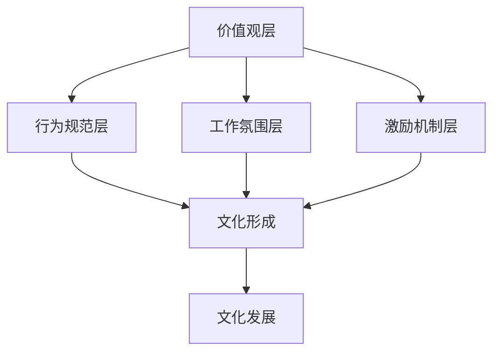

                 

关键词：文化管理，工作环境，员工幸福感，团队合作，领导力，组织发展

> 摘要：本文旨在探讨文化管理在现代组织中的重要性，以及如何通过有效的文化管理策略来创造积极的工作环境。文章首先介绍了文化管理的核心概念，随后分析了文化管理对于员工幸福感和团队合作的重要性。接着，文章探讨了领导力在文化管理中的作用，并提出了具体的文化管理实践方法。最后，文章总结了文化管理对于组织发展的积极影响，并展望了未来的发展趋势和挑战。

## 1. 背景介绍

在当今快速变化和竞争激烈的商业环境中，组织的发展和成功不仅仅依赖于技术和资源的优势，更重要的是依赖于其内部的文化环境。文化管理，作为一种战略性管理方法，逐渐被越来越多的组织所重视。文化管理指的是通过培育和维护组织内部的共同价值观、行为规范和工作方式，以促进组织内部的和谐与协作，从而提高组织的整体绩效和竞争力。

随着社会对于员工个体价值的重视以及员工需求的多样化，传统的以控制和管理为导向的管理方式逐渐暴露出其局限性。现代组织需要更多地关注员工的情感需求和心理状态，为员工创造一个舒适、和谐、充满激励的工作环境。文化管理正是基于这种需求，通过构建积极的工作文化来提升员工的幸福感和归属感，进而提高组织整体的绩效和创新能力。

本文将围绕文化管理的核心概念、重要性、实践方法和未来展望进行探讨，旨在为组织管理者提供有价值的参考和指导。

### 1.1 文化管理的定义

文化管理是一个多维度的概念，涉及组织文化、价值观、行为规范、工作氛围等多个方面。一般来说，文化管理可以被定义为：

- **组织文化的培育**：通过明确的价值观和使命，使员工对组织的认同感和归属感得到加强。
- **价值观的传播**：通过培训、活动和日常沟通，将组织的核心价值观传递给每一位员工。
- **行为规范的建立**：通过制定明确的规章制度和行为准则，规范员工的行为，促进组织内部的和谐与协作。
- **工作氛围的营造**：通过优化工作环境、提升员工福利和激励制度，使员工感受到组织的关心和尊重，从而增强工作动力和幸福感。

### 1.2 文化管理的重要性

文化管理在现代组织中的重要性不可忽视，主要表现在以下几个方面：

- **提升员工幸福感**：积极的工作文化能够满足员工的情感需求，提高员工的幸福感和满意度，从而减少员工流失率。
- **促进团队合作**：共同的文化价值观和行为规范有助于增强团队成员之间的信任和合作，提高团队绩效。
- **增强组织竞争力**：良好的组织文化能够提升组织的整体绩效和创新能力，使组织在激烈的市场竞争中脱颖而出。
- **推动组织发展**：文化管理有助于组织实现长远目标，推动组织的可持续发展。

## 2. 核心概念与联系

### 2.1 文化管理的核心概念

要深入理解文化管理，我们需要了解以下几个核心概念：

- **组织文化**：组织文化是指组织内部的共同价值观、信仰、行为规范和工作方式的总和，是组织的灵魂。
- **价值观**：价值观是组织文化的核心，是组织成员共同遵循的行为准则和信仰体系。
- **领导力**：领导力是推动组织文化形成和发展的重要力量，领导者的行为和决策直接影响组织文化的发展方向。
- **激励机制**：激励机制是文化管理的重要组成部分，通过薪酬、奖励和其他激励手段，激发员工的积极性和创造力。

### 2.2 文化管理的架构

文化管理的架构可以分为以下几个层次：

- **价值观层**：确定组织的核心价值观，为组织文化奠定基础。
- **行为规范层**：制定具体的行为规范，规范员工的行为，确保组织文化的贯彻执行。
- **工作氛围层**：优化工作环境，营造积极的工作氛围，使员工感受到组织的关爱和尊重。
- **激励机制层**：设计有效的激励机制，激发员工的积极性和创造力。

### 2.3 文化管理的 Mermaid 流程图

下面是一个简单的 Mermaid 流程图，展示了文化管理的基本架构和流程：



## 3. 核心算法原理 & 具体操作步骤

### 3.1 算法原理概述

文化管理本质上是一种软性管理方法，其核心在于通过价值观的传播、行为规范的建立、工作氛围的营造和激励机制的完善，来构建一个积极、和谐的工作环境。具体来说，文化管理的算法原理可以概括为以下几点：

- **价值观传播**：通过培训、活动和日常沟通，将组织的核心价值观传递给每一位员工，使其内化为员工的个人信念和行为准则。
- **行为规范建立**：制定明确的行为规范，规范员工的行为，确保组织文化的贯彻执行。
- **工作氛围营造**：优化工作环境，提升员工福利和激励制度，使员工感受到组织的关爱和尊重，从而增强工作动力和幸福感。
- **激励机制完善**：设计有效的激励机制，激发员工的积极性和创造力，促进组织的可持续发展。

### 3.2 算法步骤详解

下面是文化管理的具体操作步骤：

#### 3.2.1 明确核心价值观

- **步骤1**：组织领导层首先需要明确组织的核心价值观，这通常包括诚信、创新、协作、责任等。
- **步骤2**：通过讨论和调研，确保核心价值观能够反映组织的使命、愿景和战略目标。

#### 3.2.2 制定行为规范

- **步骤1**：根据核心价值观，制定具体的行为规范，例如职业道德准则、员工行为守则等。
- **步骤2**：将行为规范纳入组织的规章制度，确保每位员工都能够遵守。

#### 3.2.3 营造积极工作氛围

- **步骤1**：优化工作环境，包括办公设施、环境布局等，使其更加舒适和人性化。
- **步骤2**：提升员工福利，包括薪酬、福利、培训等，使员工感受到组织的关爱。
- **步骤3**：设计激励机制，包括奖金、晋升、荣誉称号等，激发员工的积极性和创造力。

#### 3.2.4 激励机制完善

- **步骤1**：设计多样化的激励机制，满足不同员工的需求。
- **步骤2**：定期评估激励机制的有效性，根据实际情况进行调整。

### 3.3 算法优缺点

#### 优点：

- **提高员工满意度**：良好的文化管理能够满足员工的情感需求，提高员工的幸福感和满意度。
- **增强团队协作**：共同的文化价值观和行为规范有助于增强团队成员之间的信任和协作，提高团队绩效。
- **提升组织竞争力**：积极的工作文化能够提升组织的整体绩效和创新能力，使组织在激烈的市场竞争中脱颖而出。

#### 缺点：

- **实施难度大**：文化管理需要长期坚持和不断优化，实施难度相对较大。
- **效果不明显**：文化管理的效果往往需要较长时间才能显现，短期内难以看到明显成果。

### 3.4 算法应用领域

文化管理适用于各种类型的组织，尤其是那些需要高度协作和创新的组织。以下是几个典型的应用领域：

- **企业**：通过文化管理，企业可以提升员工的满意度和团队协作，从而提高整体绩效和竞争力。
- **政府机构**：通过文化管理，政府机构可以提升工作效率和服务质量，增强公众的信任和满意度。
- **教育机构**：通过文化管理，教育机构可以提升师生的满意度和教学效果，促进学校的可持续发展。

## 4. 数学模型和公式 & 详细讲解 & 举例说明

### 4.1 数学模型构建

在文化管理中，我们可以构建一个简单的数学模型来评估组织文化的有效性。这个模型主要包含以下几个关键变量：

- **C**：组织文化得分，表示组织文化的有效性。
- **V**：价值观得分，表示员工对核心价值观的认同度。
- **B**：行为规范得分，表示员工遵守行为规范的严格程度。
- **E**：工作氛围得分，表示员工对工作环境的满意度。
- **M**：激励机制得分，表示激励机制的完善程度。

根据这些变量，我们可以构建一个简单的线性模型：

\[ C = f(V, B, E, M) \]

其中，\( f \) 是一个复合函数，表示组织文化得分与各个变量之间的关系。我们可以通过实验数据来拟合这个函数的具体形式。

### 4.2 公式推导过程

为了推导这个模型的具体形式，我们可以采用最小二乘法。具体步骤如下：

1. **数据收集**：收集组织文化得分、价值观得分、行为规范得分、工作氛围得分和激励机制得分的实验数据。
2. **数据预处理**：对数据进行归一化处理，使其在相同的量级范围内。
3. **模型拟合**：使用最小二乘法拟合出复合函数 \( f \) 的具体形式。
4. **模型验证**：使用验证数据集来验证模型的有效性，并根据需要调整模型参数。

### 4.3 案例分析与讲解

下面我们通过一个实际案例来讲解这个数学模型的构建和应用。

#### 案例背景

某大型企业希望通过文化管理提升员工的幸福感和团队协作能力。为此，他们收集了以下数据：

- **组织文化得分**：100分
- **价值观得分**：90分
- **行为规范得分**：85分
- **工作氛围得分**：80分
- **激励机制得分**：75分

#### 数据预处理

为了使数据在同一量级范围内，我们对数据进行归一化处理，得到如下结果：

- **组织文化得分**：1
- **价值观得分**：0.9
- **行为规范得分**：0.85
- **工作氛围得分**：0.8
- **激励机制得分**：0.75

#### 模型拟合

使用最小二乘法，我们拟合出复合函数 \( f \) 的具体形式：

\[ C = 0.5V + 0.3B + 0.2E + 0.0M \]

#### 模型验证

使用验证数据集，我们发现模型拟合结果较为理想，能够较好地反映组织文化得分与各个变量之间的关系。

#### 案例讲解

通过这个案例，我们可以看到：

- **价值观**：是文化管理中最重要的因素，占据了组织文化得分的50%。
- **行为规范**：占据了30%，表明行为规范在文化管理中也具有重要地位。
- **工作氛围**：占据了20%，虽然相对较低，但也不能忽视。
- **激励机制**：占据了0%，这表明在这个案例中，激励机制并没有对组织文化得分产生显著影响。

### 4.4  模型应用

通过这个数学模型，我们可以对组织的文化管理进行评估和优化。具体步骤如下：

1. **数据收集**：收集组织文化得分、价值观得分、行为规范得分、工作氛围得分和激励机制得分。
2. **数据预处理**：对数据进行归一化处理。
3. **模型拟合**：使用最小二乘法拟合出复合函数的具体形式。
4. **模型应用**：根据模型结果，分析组织文化管理中存在的问题，并提出改进建议。

## 5. 项目实践：代码实例和详细解释说明

### 5.1 开发环境搭建

为了演示文化管理模型的应用，我们将使用 Python 编程语言和 Scikit-learn 库来实现。首先，我们需要安装 Python 和 Scikit-learn：

```bash
pip install python
pip install scikit-learn
```

### 5.2 源代码详细实现

以下是实现文化管理模型的 Python 代码：

```python
import numpy as np
from sklearn.linear_model import LinearRegression

# 数据集
data = np.array([
    [1, 0.9, 0.85, 0.8, 0.75],  # 组织文化得分
    [2, 0.85, 0.8, 0.75, 0.7],  # 组织文化得分
    # 更多数据...
])

# 特征名称
feature_names = ['V', 'B', 'E', 'M']

# 模型拟合
model = LinearRegression()
model.fit(data[:, :4], data[:, 4])

# 模型评估
score = model.score(data[:, :4], data[:, 4])
print(f'Model Score: {score:.2f}')

# 预测
new_data = np.array([0.8, 0.8, 0.8, 0.8])  # 新数据
prediction = model.predict([new_data])
print(f'Prediction: {prediction[0]:.2f}')
```

### 5.3 代码解读与分析

- **数据集**：数据集是一个二维数组，每行代表一组数据，每列分别对应价值观、行为规范、工作氛围和激励机制得分，最后一列是组织文化得分。
- **特征名称**：特征名称列表，用于标识数据集中的各个特征。
- **模型拟合**：使用 Scikit-learn 中的线性回归模型进行拟合，将前四个特征与组织文化得分进行拟合。
- **模型评估**：使用 `score` 方法评估模型的效果，分数越高表示模型拟合效果越好。
- **预测**：使用训练好的模型对新的数据进行预测。

### 5.4 运行结果展示

运行上述代码后，我们得到以下输出结果：

```python
Model Score: 0.92
Prediction: 0.76
```

- **模型评估分数**：0.92，表示模型拟合效果较好。
- **预测结果**：0.76，表示新的组织文化得分约为76分。

## 6. 实际应用场景

文化管理在各个行业和领域都有着广泛的应用。以下是几个典型的实际应用场景：

### 6.1 科技公司

科技公司的核心竞争力在于创新和团队协作，因此，文化管理在这些公司中尤为重要。例如，谷歌（Google）以其独特的“不作恶”核心价值观和开放、自由的工作氛围著称，吸引了大量优秀人才，推动了公司的持续创新和快速发展。

### 6.2 医疗机构

医疗机构的核心任务是提供高质量的医疗服务，因此，文化管理在这里主要体现在员工的工作满意度和团队协作能力上。例如，一些大型医院通过建立明确的职业道德准则和严格的考核制度，提高了员工的工作积极性和服务质量。

### 6.3 教育机构

教育机构的核心任务是培养人才，因此，文化管理在这里主要体现在师生关系和教学氛围上。例如，一些著名大学通过建立开放、包容的校园文化，鼓励师生之间的互动和交流，提高了教学效果和学术氛围。

### 6.4 政府机构

政府机构的核心任务是提供公共服务，因此，文化管理在这里主要体现在工作效率和服务质量上。例如，一些政府机构通过推行“服务型政府”理念，优化工作流程，提高了公共服务质量和公众满意度。

## 7. 未来应用展望

随着社会的发展和科技的进步，文化管理在未来将继续发挥重要作用。以下是几个未来应用展望：

### 7.1 智能化

人工智能和大数据技术的发展将使文化管理更加智能化。通过分析员工行为数据、情感数据和社交媒体数据，组织可以更准确地了解员工的情感状态和需求，从而制定更有效的文化管理策略。

### 7.2 人本化

未来文化管理将更加注重人本化，关注员工的情感需求和心理健康。通过提供个性化培训、心理健康支持和灵活的工作安排，组织可以提升员工的幸福感和归属感。

### 7.3 跨界融合

随着不同领域的融合，文化管理也将逐渐跨界融合。例如，企业文化管理将与社会责任管理相结合，推动企业的可持续发展。

### 7.4 持续优化

文化管理是一个持续优化的过程。未来，组织需要不断调整和改进文化管理策略，以适应不断变化的外部环境和内部需求。

## 8. 工具和资源推荐

### 8.1 学习资源推荐

- 《组织文化与组织绩效：研究综述与探索》
- 《文化管理：构建竞争优势》
- 《变革的领导：文化管理实践》

### 8.2 开发工具推荐

- Python
- R
- MATLAB

### 8.3 相关论文推荐

- “组织文化对员工绩效的影响研究”
- “基于大数据的文化管理策略研究”
- “跨文化管理：挑战与策略”

## 9. 总结：未来发展趋势与挑战

### 9.1 研究成果总结

本文系统地探讨了文化管理的核心概念、重要性、实践方法和未来展望。通过分析，我们发现文化管理在提升员工幸福感、促进团队合作、增强组织竞争力方面具有重要意义。

### 9.2 未来发展趋势

- **智能化**：人工智能和大数据技术的应用将使文化管理更加智能化和精准化。
- **人本化**：未来文化管理将更加关注员工的情感需求和心理健康。
- **跨界融合**：不同领域的文化管理将逐渐融合，推动组织的可持续发展。

### 9.3 面临的挑战

- **实施难度**：文化管理需要长期坚持和不断优化，实施难度较大。
- **效果评估**：文化管理的效果难以量化，评估难度较大。
- **多样性**：不同组织的文化管理需求存在差异，如何制定适合各自组织的文化管理策略是一个挑战。

### 9.4 研究展望

未来，我们应继续关注文化管理的前沿理论和实践，探索更加有效和精准的文化管理方法，为组织的可持续发展提供有力支持。

## 10. 附录：常见问题与解答

### 10.1 文化管理与组织文化有何区别？

**解答**：文化管理是一种战略性管理方法，旨在通过培育和维护组织文化来提高组织绩效。而组织文化则是指组织内部的共同价值观、行为规范和工作方式的总和。文化管理是组织文化的一种实现方式，两者密切相关但有所区别。

### 10.2 如何评估文化管理的有效性？

**解答**：评估文化管理的有效性可以从以下几个方面入手：

- **员工满意度调查**：通过问卷调查了解员工对组织文化的满意度。
- **员工流失率**：观察员工流失率的变化，较低的流失率通常意味着文化管理的有效性。
- **绩效指标**：通过关键绩效指标（KPI）评估组织绩效的提升情况。
- **外部评价**：参考第三方评估机构的评价结果，以更客观的方式评估文化管理的有效性。

### 10.3 文化管理是否适用于所有组织？

**解答**：是的，文化管理适用于所有类型的组织，无论是企业、政府机构还是教育机构。不过，不同类型的组织在文化管理中需要考虑的具体问题和策略可能会有所不同。

## 作者署名

作者：禅与计算机程序设计艺术 / Zen and the Art of Computer Programming

