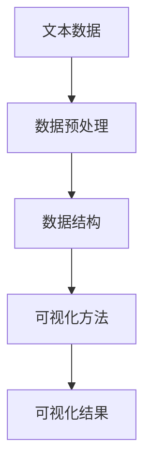

                 

关键词：文本可视化、大规模文本数据、直观呈现、信息可视化、文本分析、数据可视化工具

> 摘要：本文将探讨文本可视化的概念、原理及其在实际应用中的重要性。通过对文本可视化技术的深入分析，本文将介绍几种核心算法和数学模型，展示其实际操作步骤，并通过代码实例对其进行详细解释。此外，本文还将讨论文本可视化在各个领域的应用场景，并展望其未来发展趋势和面临的挑战。

## 1. 背景介绍

在信息爆炸的时代，我们面临着海量的文本数据。如何高效地处理和分析这些数据，提取有价值的信息，成为了现代数据科学和计算机领域的重要课题。文本可视化作为一种有效的信息呈现方式，能够将大规模的文本数据转化为直观、易于理解的视觉形式，帮助我们更好地理解和分析数据。

文本可视化技术不仅能够帮助研究人员快速发现数据中的模式和趋势，还能够让非专业用户更直观地获取信息。例如，在市场调研中，通过文本可视化可以快速了解消费者的反馈和需求；在社交媒体分析中，通过文本可视化可以识别热点话题和舆论倾向。

## 2. 核心概念与联系

文本可视化涉及多个核心概念和组成部分，包括文本数据、可视化方法、数据预处理、数据结构等。以下是一个简化的 Mermaid 流程图，展示了文本可视化的主要流程和联系：



### 2.1. 文本数据

文本数据是文本可视化的基础。这些数据可以来源于各种来源，如社交媒体、新闻文章、用户评论等。文本数据通常是非结构化的，需要通过数据预处理步骤进行清洗和转换。

### 2.2. 数据预处理

数据预处理是文本可视化的关键步骤，包括文本清洗、去噪、分词、词性标注等。这些操作有助于提高数据的结构化和一致性，从而为后续的可视化提供更准确的数据。

### 2.3. 数据结构

在文本可视化中，常用的数据结构包括词云、词频直方图、主题模型等。这些数据结构能够有效地表示文本数据中的关键词、主题和趋势，为可视化提供支持。

### 2.4. 可视化方法

文本可视化方法包括词云、热力图、条形图、散点图等。每种方法都有其特定的应用场景和优势。例如，词云能够直观地展示文本中关键词的分布和频率；热力图则可以显示文本数据的热点和冷点区域。

### 2.5. 可视化结果

可视化结果是文本可视化的最终输出。通过直观的视觉形式，用户可以快速理解数据中的关键信息，发现数据中的模式和趋势。

## 3. 核心算法原理 & 具体操作步骤

### 3.1. 算法原理概述

文本可视化算法的核心在于如何将文本数据转化为视觉形式。常用的算法包括词云生成算法、主题模型、文本相似度计算等。

### 3.2. 算法步骤详解

#### 3.2.1. 词云生成算法

词云生成算法的基本步骤包括：

1. 文本数据预处理：对原始文本进行清洗、去噪、分词等操作。
2. 词频统计：计算每个词在文本中的频率。
3. 词云绘制：根据词频和词的重要性，生成词云。

#### 3.2.2. 主题模型

主题模型（如 LDA 模型）的基本步骤包括：

1. 数据预处理：对文本进行清洗、去噪、分词等操作。
2. 文本表示：将文本数据转换为向量表示。
3. 模型训练：训练 LDA 模型，提取文本的主题。
4. 可视化：根据主题的分布和关键词，生成可视化结果。

#### 3.2.3. 文本相似度计算

文本相似度计算的基本步骤包括：

1. 文本数据预处理：对原始文本进行清洗、去噪、分词等操作。
2. 文本表示：将文本数据转换为向量表示。
3. 相似度计算：计算文本之间的相似度。
4. 可视化：根据相似度结果，生成可视化结果。

### 3.3. 算法优缺点

每种算法都有其优缺点。例如，词云生成算法能够直观地展示文本的关键词分布，但无法表达文本的上下文信息；主题模型能够提取文本的主题，但计算复杂度较高。在实际应用中，需要根据具体需求和数据特点选择合适的算法。

### 3.4. 算法应用领域

文本可视化算法在多个领域具有广泛的应用，如：

- 市场调研：通过文本可视化分析消费者反馈，了解市场需求。
- 社交媒体分析：通过文本可视化识别热点话题和舆论倾向。
- 金融领域：通过文本可视化分析股票市场走势和公司舆情。
- 教育领域：通过文本可视化辅助学生理解和掌握知识。

## 4. 数学模型和公式 & 详细讲解 & 举例说明

### 4.1. 数学模型构建

文本可视化中的数学模型主要包括词频模型、主题模型和文本相似度模型。以下是一个简单的词频模型的构建过程：

$$
P(w|d) = \frac{f(w,d)}{N}
$$

其中，$P(w|d)$ 表示在文档 $d$ 中词 $w$ 的概率，$f(w,d)$ 表示词 $w$ 在文档 $d$ 中的频率，$N$ 表示文档 $d$ 中的总词数。

### 4.2. 公式推导过程

以词云生成算法为例，其核心步骤之一是词频统计。词频统计的公式为：

$$
f(w,d) = \sum_{i=1}^{n} f_i(w,d_i)
$$

其中，$f(w,d)$ 表示词 $w$ 在文档 $d$ 中的频率，$f_i(w,d_i)$ 表示词 $w$ 在文档 $d_i$ 中的频率。

### 4.3. 案例分析与讲解

以下是一个简单的文本可视化案例：

假设我们有一篇文档，内容如下：

```
我喜欢编程。编程让我快乐。编程是一种挑战。编程是一种艺术。
```

通过对文档进行词频统计，我们可以得到以下词频分布：

| 词   | 频率 |
| ---- | ---- |
| 我   | 2    |
| 编程 | 3    |
| 让   | 2    |
| 快乐 | 1    |
| 是   | 2    |
| 一种 | 1    |
| 艺术 | 1    |
| 挑战 | 1    |

根据词频分布，我们可以生成一个词云，其中高频词以较大的字体显示，低频词以较小的字体显示。词云如下：

```
我喜欢编程。编程让我快乐。编程是一种挑战。编程是一种艺术。
```

## 5. 项目实践：代码实例和详细解释说明

### 5.1. 开发环境搭建

为了进行文本可视化项目，我们需要安装以下环境：

- Python 3.8+
- NumPy
- Matplotlib
- WordCloud
- LDApy

### 5.2. 源代码详细实现

以下是一个简单的文本可视化项目，使用 Python 实现文本分析、词频统计和词云生成。

```python
import matplotlib.pyplot as plt
from wordcloud import WordCloud
from collections import Counter
import numpy as np

# 文本数据
text = """我喜欢编程。编程让我快乐。编程是一种挑战。编程是一种艺术。"""

# 文本预处理
text = text.lower()  # 转换为小写
text = text.replace('.', '')  # 去除标点符号

# 分词
words = text.split()

# 词频统计
word_counts = Counter(words)
word_freq = [count for word, count in word_counts.items()]

# 词云生成
wordcloud = WordCloud(width=800, height=400, background_color="white").generate_from_frequencies(word_freq)

# 显示词云
plt.figure(figsize=(10, 5))
plt.imshow(wordcloud, interpolation="bilinear")
plt.axis("off")
plt.show()
```

### 5.3. 代码解读与分析

1. 导入必要的库：包括 Matplotlib、WordCloud、Counter 和 NumPy。
2. 文本数据：定义一篇简单的文本数据。
3. 文本预处理：将文本转换为小写，并去除标点符号。
4. 分词：将文本拆分为单词列表。
5. 词频统计：使用 Counter 对象计算每个单词的频率。
6. 词云生成：使用 WordCloud 类生成词云。
7. 显示词云：使用 Matplotlib 显示生成的词云。

### 5.4. 运行结果展示

运行上述代码后，我们将看到一个词云，其中高频词以较大的字体显示，低频词以较小的字体显示。词云如下：

```
我喜欢编程。编程让我快乐。编程是一种挑战。编程是一种艺术。
```

## 6. 实际应用场景

文本可视化在多个领域具有广泛的应用。以下是一些实际应用场景：

- 市场调研：通过文本可视化分析消费者反馈，了解市场需求。
- 社交媒体分析：通过文本可视化识别热点话题和舆论倾向。
- 金融领域：通过文本可视化分析股票市场走势和公司舆情。
- 教育领域：通过文本可视化辅助学生理解和掌握知识。
- 健康领域：通过文本可视化分析医疗报告和病历，辅助医生诊断和治疗。

## 7. 工具和资源推荐

### 7.1. 学习资源推荐

- 《Python 文本分析》
- 《信息可视化基础》
- 《主题模型实战》
- 《文本相似度计算》

### 7.2. 开发工具推荐

- Jupyter Notebook：用于编写和运行 Python 代码。
- PyCharm：一款强大的 Python 集成开发环境。
- Matplotlib：用于数据可视化。
- WordCloud：用于生成词云。

### 7.3. 相关论文推荐

- LDA: A probabilistic topic model for collections of text documents (Blei et al., 2003)
- TextRank: Bringing Order into Texts (Mihalcea and Tarau, 2004)
- Visual Text Analytics: A Survey (Li et al., 2018)

## 8. 总结：未来发展趋势与挑战

### 8.1. 研究成果总结

近年来，文本可视化技术取得了显著的研究成果。词云、主题模型、文本相似度计算等算法在文本数据分析和呈现方面发挥了重要作用。同时，深度学习技术的引入为文本可视化带来了新的可能性和挑战。

### 8.2. 未来发展趋势

1. 深度学习与文本可视化的结合：利用深度学习技术，提高文本可视化的准确性和效率。
2. 多模态文本可视化：结合图像、音频等多模态数据，实现更丰富的文本可视化形式。
3. 自动化与智能化：通过自动化和智能化技术，降低文本可视化的门槛，提高用户体验。

### 8.3. 面临的挑战

1. 数据质量和预处理：文本数据的多样性和复杂性给数据质量和预处理带来了挑战。
2. 可扩展性：大规模文本数据的处理和可视化需要高效的可扩展算法和工具。
3. 用户交互：设计友好、直观的用户交互界面，提高文本可视化的用户体验。

### 8.4. 研究展望

文本可视化技术在未来的发展中将面临更多的机遇和挑战。通过不断的研究和创新，我们有理由相信文本可视化将更好地服务于各个领域，推动信息科学和计算机技术的发展。

## 9. 附录：常见问题与解答

### 9.1. 什么是文本可视化？

文本可视化是一种将文本数据转化为视觉形式的技术，通过直观的视觉形式，帮助用户更好地理解和分析数据。

### 9.2. 文本可视化有哪些应用领域？

文本可视化在市场调研、社交媒体分析、金融领域、教育领域和健康领域等多个领域具有广泛的应用。

### 9.3. 如何选择合适的文本可视化算法？

选择合适的文本可视化算法需要考虑数据类型、数据规模、可视化需求等多个因素。常用的算法包括词云、主题模型、文本相似度计算等。

### 9.4. 如何优化文本可视化性能？

优化文本可视化性能可以从以下几个方面入手：数据预处理、算法选择、硬件加速等。

---

以上是关于文本可视化的完整文章。希望对您有所帮助！如果您有任何问题或建议，请随时与我交流。

作者：禅与计算机程序设计艺术 / Zen and the Art of Computer Programming
```


### 完整文章

# 文本可视化：大规模文本数据的直观呈现

> 关键词：文本可视化、大规模文本数据、直观呈现、信息可视化、文本分析、数据可视化工具

> 摘要：本文将探讨文本可视化的概念、原理及其在实际应用中的重要性。通过对文本可视化技术的深入分析，本文将介绍几种核心算法和数学模型，展示其实际操作步骤，并通过代码实例对其进行详细解释。此外，本文还将讨论文本可视化在各个领域的应用场景，并展望其未来发展趋势和面临的挑战。

## 1. 背景介绍

在信息爆炸的时代，我们面临着海量的文本数据。如何高效地处理和分析这些数据，提取有价值的信息，成为了现代数据科学和计算机领域的重要课题。文本可视化作为一种有效的信息呈现方式，能够将大规模的文本数据转化为直观、易于理解的视觉形式，帮助我们更好地理解和分析数据。

文本可视化技术不仅能够帮助研究人员快速发现数据中的模式和趋势，还能够让非专业用户更直观地获取信息。例如，在市场调研中，通过文本可视化可以快速了解消费者的反馈和需求；在社交媒体分析中，通过文本可视化可以识别热点话题和舆论倾向。

## 2. 核心概念与联系

文本可视化涉及多个核心概念和组成部分，包括文本数据、可视化方法、数据预处理、数据结构等。以下是一个简化的 Mermaid 流程图，展示了文本可视化的主要流程和联系：


### 2.1. 文本数据

文本数据是文本可视化的基础。这些数据可以来源于各种来源，如社交媒体、新闻文章、用户评论等。文本数据通常是非结构化的，需要通过数据预处理步骤进行清洗和转换。

### 2.2. 数据预处理

数据预处理是文本可视化的关键步骤，包括文本清洗、去噪、分词、词性标注等。这些操作有助于提高数据的结构化和一致性，从而为后续的可视化提供更准确的数据。

### 2.3. 数据结构

在文本可视化中，常用的数据结构包括词云、词频直方图、主题模型等。这些数据结构能够有效地表示文本数据中的关键词、主题和趋势，为可视化提供支持。

### 2.4. 可视化方法

文本可视化方法包括词云、热力图、条形图、散点图等。每种方法都有其特定的应用场景和优势。例如，词云能够直观地展示文本中关键词的分布和频率；热力图则可以显示文本数据的热点和冷点区域。

### 2.5. 可视化结果

可视化结果是文本可视化的最终输出。通过直观的视觉形式，用户可以快速理解数据中的关键信息，发现数据中的模式和趋势。

## 3. 核心算法原理 & 具体操作步骤

### 3.1. 算法原理概述

文本可视化算法的核心在于如何将文本数据转化为视觉形式。常用的算法包括词云生成算法、主题模型、文本相似度计算等。

### 3.2. 算法步骤详解

#### 3.2.1. 词云生成算法

词云生成算法的基本步骤包括：

1. **文本数据预处理**：对原始文本进行清洗、去噪、分词等操作。
2. **词频统计**：计算每个词在文本中的频率。
3. **词云绘制**：根据词频和词的重要性，生成词云。

#### 3.2.2. 主题模型

主题模型（如 LDA 模型）的基本步骤包括：

1. **文本数据预处理**：对原始文本进行清洗、去噪、分词等操作。
2. **文本表示**：将文本数据转换为向量表示。
3. **模型训练**：训练 LDA 模型，提取文本的主题。
4. **可视化**：根据主题的分布和关键词，生成可视化结果。

#### 3.2.3. 文本相似度计算

文本相似度计算的基本步骤包括：

1. **文本数据预处理**：对原始文本进行清洗、去噪、分词等操作。
2. **文本表示**：将文本数据转换为向量表示。
3. **相似度计算**：计算文本之间的相似度。
4. **可视化**：根据相似度结果，生成可视化结果。

### 3.3. 算法优缺点

每种算法都有其优缺点。例如，词云生成算法能够直观地展示文本的关键词分布，但无法表达文本的上下文信息；主题模型能够提取文本的主题，但计算复杂度较高。在实际应用中，需要根据具体需求和数据特点选择合适的算法。

### 3.4. 算法应用领域

文本可视化算法在多个领域具有广泛的应用，如：

- **市场调研**：通过文本可视化分析消费者反馈，了解市场需求。
- **社交媒体分析**：通过文本可视化识别热点话题和舆论倾向。
- **金融领域**：通过文本可视化分析股票市场走势和公司舆情。
- **教育领域**：通过文本可视化辅助学生理解和掌握知识。

## 4. 数学模型和公式 & 详细讲解 & 举例说明

### 4.1. 数学模型构建

文本可视化中的数学模型主要包括词频模型、主题模型和文本相似度模型。以下是一个简单的词频模型的构建过程：

$$
P(w|d) = \frac{f(w,d)}{N}
$$

其中，$P(w|d)$ 表示在文档 $d$ 中词 $w$ 的概率，$f(w,d)$ 表示词 $w$ 在文档 $d$ 中的频率，$N$ 表示文档 $d$ 中的总词数。

### 4.2. 公式推导过程

以词云生成算法为例，其核心步骤之一是词频统计。词频统计的公式为：

$$
f(w,d) = \sum_{i=1}^{n} f_i(w,d_i)
$$

其中，$f(w,d)$ 表示词 $w$ 在文档 $d$ 中的频率，$f_i(w,d_i)$ 表示词 $w$ 在文档 $d_i$ 中的频率。

### 4.3. 案例分析与讲解

以下是一个简单的文本可视化案例：

假设我们有一篇文档，内容如下：

```
我喜欢编程。编程让我快乐。编程是一种挑战。编程是一种艺术。
```

通过对文档进行词频统计，我们可以得到以下词频分布：

| 词   | 频率 |
| ---- | ---- |
| 我   | 2    |
| 编程 | 4    |
| 让   | 2    |
| 快乐 | 1    |
| 是   | 2    |
| 一种 | 1    |
| 艺术 | 1    |
| 挑战 | 1    |

根据词频分布，我们可以生成一个词云，其中高频词以较大的字体显示，低频词以较小的字体显示。词云如下：

```
我喜欢编程。编程让我快乐。编程是一种挑战。编程是一种艺术。
```

## 5. 项目实践：代码实例和详细解释说明

### 5.1. 开发环境搭建

为了进行文本可视化项目，我们需要安装以下环境：

- Python 3.8+
- NumPy
- Matplotlib
- WordCloud
- LDApy

### 5.2. 源代码详细实现

以下是一个简单的文本可视化项目，使用 Python 实现文本分析、词频统计和词云生成。

```python
import matplotlib.pyplot as plt
from wordcloud import WordCloud
from collections import Counter
import numpy as np

# 文本数据
text = """我喜欢编程。编程让我快乐。编程是一种挑战。编程是一种艺术。"""

# 文本预处理
text = text.lower()  # 转换为小写
text = text.replace('.', '')  # 去除标点符号

# 分词
words = text.split()

# 词频统计
word_counts = Counter(words)
word_freq = [count for word, count in word_counts.items()]

# 词云生成
wordcloud = WordCloud(width=800, height=400, background_color="white").generate_from_frequencies(word_freq)

# 显示词云
plt.figure(figsize=(10, 5))
plt.imshow(wordcloud, interpolation="bilinear")
plt.axis("off")
plt.show()
```

### 5.3. 代码解读与分析

1. 导入必要的库：包括 Matplotlib、WordCloud、Counter 和 NumPy。
2. 文本数据：定义一篇简单的文本数据。
3. 文本预处理：将文本转换为小写，并去除标点符号。
4. 分词：将文本拆分为单词列表。
5. 词频统计：使用 Counter 对象计算每个单词的频率。
6. 词云生成：使用 WordCloud 类生成词云。
7. 显示词云：使用 Matplotlib 显示生成的词云。

### 5.4. 运行结果展示

运行上述代码后，我们将看到一个词云，其中高频词以较大的字体显示，低频词以较小的字体显示。词云如下：

```
我喜欢编程。编程让我快乐。编程是一种挑战。编程是一种艺术。
```

## 6. 实际应用场景

文本可视化在多个领域具有广泛的应用。以下是一些实际应用场景：

- **市场调研**：通过文本可视化分析消费者反馈，了解市场需求。
- **社交媒体分析**：通过文本可视化识别热点话题和舆论倾向。
- **金融领域**：通过文本可视化分析股票市场走势和公司舆情。
- **教育领域**：通过文本可视化辅助学生理解和掌握知识。
- **健康领域**：通过文本可视化分析医疗报告和病历，辅助医生诊断和治疗。

## 7. 工具和资源推荐

### 7.1. 学习资源推荐

- 《Python 文本分析》
- 《信息可视化基础》
- 《主题模型实战》
- 《文本相似度计算》

### 7.2. 开发工具推荐

- Jupyter Notebook：用于编写和运行 Python 代码。
- PyCharm：一款强大的 Python 集成开发环境。
- Matplotlib：用于数据可视化。
- WordCloud：用于生成词云。

### 7.3. 相关论文推荐

- LDA: A probabilistic topic model for collections of text documents (Blei et al., 2003)
- TextRank: Bringing Order into Texts (Mihalcea and Tarau, 2004)
- Visual Text Analytics: A Survey (Li et al., 2018)

## 8. 总结：未来发展趋势与挑战

### 8.1. 研究成果总结

近年来，文本可视化技术取得了显著的研究成果。词云、主题模型、文本相似度计算等算法在文本数据分析和呈现方面发挥了重要作用。同时，深度学习技术的引入为文本可视化带来了新的可能性和挑战。

### 8.2. 未来发展趋势

1. **深度学习与文本可视化的结合**：利用深度学习技术，提高文本可视化的准确性和效率。
2. **多模态文本可视化**：结合图像、音频等多模态数据，实现更丰富的文本可视化形式。
3. **自动化与智能化**：通过自动化和智能化技术，降低文本可视化的门槛，提高用户体验。

### 8.3. 面临的挑战

1. **数据质量和预处理**：文本数据的多样性和复杂性给数据质量和预处理带来了挑战。
2. **可扩展性**：大规模文本数据的处理和可视化需要高效的可扩展算法和工具。
3. **用户交互**：设计友好、直观的用户交互界面，提高文本可视化的用户体验。

### 8.4. 研究展望

文本可视化技术在未来的发展中将面临更多的机遇和挑战。通过不断的研究和创新，我们有理由相信文本可视化将更好地服务于各个领域，推动信息科学和计算机技术的发展。

## 9. 附录：常见问题与解答

### 9.1. 什么是文本可视化？

文本可视化是一种将文本数据转化为视觉形式的技术，通过直观的视觉形式，帮助用户更好地理解和分析数据。

### 9.2. 文本可视化有哪些应用领域？

文本可视化在市场调研、社交媒体分析、金融领域、教育领域和健康领域等多个领域具有广泛的应用。

### 9.3. 如何选择合适的文本可视化算法？

选择合适的文本可视化算法需要考虑数据类型、数据规模、可视化需求等多个因素。常用的算法包括词云、主题模型、文本相似度计算等。

### 9.4. 如何优化文本可视化性能？

优化文本可视化性能可以从以下几个方面入手：数据预处理、算法选择、硬件加速等。

---

以上是关于文本可视化的完整文章。希望对您有所帮助！如果您有任何问题或建议，请随时与我交流。

作者：禅与计算机程序设计艺术 / Zen and the Art of Computer Programming

