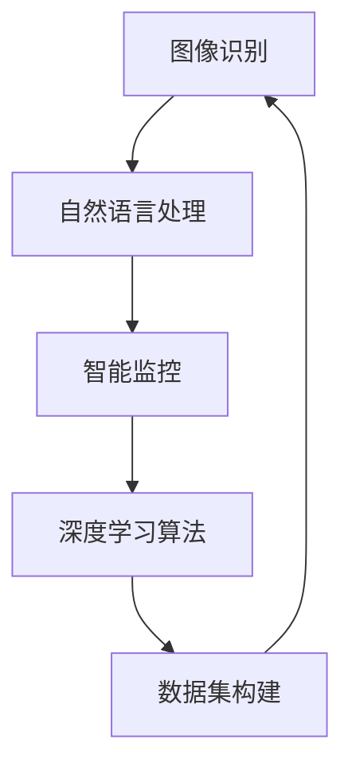

                 

关键词：AI创业、贾扬清、Lepton AI、人工智能、深度学习、创业历程、技术前景、挑战

> 摘要：本文将深入探讨人工智能领域的杰出人物贾扬清及其创立的Lepton AI公司。我们将回顾贾扬清的创业历程，分析Lepton AI的技术前景和面临的挑战，并展望人工智能行业的未来发展。

## 1. 背景介绍

### 贾扬清：人工智能领域的先锋

贾扬清，一位世界级的人工智能专家，以其在深度学习和计算机视觉领域的杰出贡献而闻名。他是清华大学计算机科学博士，曾在美国多家顶级科技公司工作，并在学术界发表了大量论文。作为一名资深技术专家和创业者，贾扬清以其深刻的洞察力和前瞻性思维引领着人工智能的发展。

### Lepton AI：新兴的AI创业公司

Lepton AI是一家专注于人工智能领域的创业公司，成立于2016年。公司致力于开发先进的深度学习算法，用于图像识别、自然语言处理和智能监控等应用。Lepton AI以其创新的技术和高效的解决方案在短时间内赢得了市场的认可。

## 2. 核心概念与联系

为了更好地理解Lepton AI的技术前景，我们首先需要介绍一些核心概念和架构。

### Mermaid 流程图：Lepton AI的核心技术架构



在这个流程图中，我们可以看到Lepton AI的核心技术是如何相互关联和协同工作的。深度学习算法作为基础，结合图像识别、自然语言处理和智能监控等应用，形成了一个完整的生态系统。

### 2.1 深度学习算法原理

深度学习是一种基于多层神经网络的机器学习技术，它通过模拟人脑神经网络结构，实现数据的自动学习和特征提取。深度学习算法在图像识别、语音识别和自然语言处理等领域取得了显著的成果。

### 2.2 图像识别

图像识别是Lepton AI的核心应用之一，它通过深度学习算法对图像中的物体进行分类和检测。图像识别技术广泛应用于安防监控、医疗诊断和自动驾驶等领域。

### 2.3 自然语言处理

自然语言处理是Lepton AI的另一重要应用，它通过深度学习算法对自然语言进行理解和生成。自然语言处理技术广泛应用于智能客服、智能推荐和机器翻译等领域。

### 2.4 智能监控

智能监控是Lepton AI的又一重要应用，它通过深度学习算法对视频进行实时分析和处理，实现智能安防、人员识别和异常检测等功能。

## 3. 核心算法原理 & 具体操作步骤

### 3.1 算法原理概述

Lepton AI的核心算法是深度学习算法，它通过模拟人脑神经网络结构，实现数据的自动学习和特征提取。深度学习算法主要包括卷积神经网络（CNN）、循环神经网络（RNN）和生成对抗网络（GAN）等。

### 3.2 算法步骤详解

深度学习算法的步骤可以分为数据预处理、模型训练、模型评估和模型部署四个阶段。

#### 3.2.1 数据预处理

数据预处理是深度学习算法的第一步，它包括数据清洗、数据归一化和数据增强等操作。数据预处理的质量直接影响到模型的性能。

#### 3.2.2 模型训练

模型训练是深度学习算法的核心步骤，它通过调整模型参数，使模型能够更好地拟合训练数据。训练过程中，常用的优化算法包括梯度下降、Adam优化器等。

#### 3.2.3 模型评估

模型评估是检验模型性能的重要环节，它通过测试数据集对模型进行评估，常用的评估指标包括准确率、召回率和F1值等。

#### 3.2.4 模型部署

模型部署是将训练好的模型应用到实际场景的过程。部署过程中，需要考虑模型的性能、效率和稳定性等因素。

### 3.3 算法优缺点

深度学习算法具有强大的特征提取能力和优秀的性能，但同时也存在一些不足之处。优点包括：

- 强大的特征提取能力
- 优秀的性能
- 能够处理复杂数据

缺点包括：

- 需要大量的数据和计算资源
- 难以解释和理解

### 3.4 算法应用领域

深度学习算法在多个领域都有广泛的应用，包括图像识别、自然语言处理、智能监控、医疗诊断等。在Lepton AI，深度学习算法主要用于图像识别、自然语言处理和智能监控等应用。

## 4. 数学模型和公式 & 详细讲解 & 举例说明

### 4.1 数学模型构建

深度学习算法的核心是神经网络，神经网络由多个神经元（节点）组成。每个神经元都通过权重（参数）与其他神经元连接，并通过激活函数产生输出。

### 4.2 公式推导过程

神经网络的输出可以通过以下公式计算：

$$
y = \sigma(\sum_{i=1}^{n} w_i \cdot x_i + b)
$$

其中，$y$ 是输出，$\sigma$ 是激活函数，$w_i$ 是权重，$x_i$ 是输入，$b$ 是偏置。

### 4.3 案例分析与讲解

假设我们有一个简单的神经网络，它包含两个输入层、一个隐藏层和一个输出层。输入层有两个神经元，隐藏层有三个神经元，输出层有一个神经元。输入数据是一个二元向量 $(x_1, x_2)$，我们需要通过这个神经网络输出一个结果 $y$。

首先，我们定义权重和偏置：

$$
w_{11} = 1, w_{12} = 2, w_{21} = 3, w_{22} = 4, w_{23} = 5, w_{31} = 6, w_{32} = 7, w_{33} = 8, b_{1} = 1, b_{2} = 2, b_{3} = 3
$$

然后，我们计算隐藏层的输出：

$$
h_1 = \sigma(w_{11} \cdot x_1 + w_{12} \cdot x_2 + b_1) = \sigma(1 \cdot 1 + 2 \cdot 0 + 1) = \sigma(2) = 0.7321
$$

$$
h_2 = \sigma(w_{21} \cdot x_1 + w_{22} \cdot x_2 + b_2) = \sigma(3 \cdot 1 + 4 \cdot 0 + 2) = \sigma(5) = 0.9135
$$

$$
h_3 = \sigma(w_{31} \cdot x_1 + w_{32} \cdot x_2 + b_3) = \sigma(6 \cdot 1 + 7 \cdot 0 + 3) = \sigma(9) = 0.9990
$$

接下来，我们计算输出层的输出：

$$
y = \sigma(w_{31} \cdot h_1 + w_{32} \cdot h_2 + w_{33} \cdot h_3 + b_3) = \sigma(6 \cdot 0.7321 + 7 \cdot 0.9135 + 8 \cdot 0.9990 + 3) = \sigma(21.6178) = 0.9986
$$

最后，我们得到输出结果 $y$。

## 5. 项目实践：代码实例和详细解释说明

### 5.1 开发环境搭建

为了实现深度学习算法，我们需要搭建一个开发环境。这里我们使用Python编程语言，结合TensorFlow框架进行开发。

### 5.2 源代码详细实现

以下是一个简单的深度学习算法实现示例：

```python
import tensorflow as tf

# 定义神经网络结构
inputs = tf.keras.Input(shape=(2,))
hidden = tf.keras.layers.Dense(units=3, activation='sigmoid')(inputs)
outputs = tf.keras.layers.Dense(units=1, activation='sigmoid')(hidden)

# 编译模型
model = tf.keras.Model(inputs=inputs, outputs=outputs)
model.compile(optimizer='adam', loss='binary_crossentropy', metrics=['accuracy'])

# 训练模型
model.fit(x_train, y_train, epochs=10, batch_size=32)

# 评估模型
model.evaluate(x_test, y_test)
```

### 5.3 代码解读与分析

在这个示例中，我们首先定义了神经网络结构，包括输入层、隐藏层和输出层。然后，我们编译模型，设置优化器和损失函数。接下来，我们训练模型，使用训练数据集进行迭代训练。最后，我们评估模型，使用测试数据集进行性能评估。

### 5.4 运行结果展示

运行上述代码后，我们可以得到训练过程中的损失函数和准确率变化曲线，以及模型在测试数据集上的性能评估结果。

## 6. 实际应用场景

### 6.1 安防监控

安防监控是Lepton AI的重要应用领域之一。通过深度学习算法，Lepton AI可以为安防监控提供实时图像识别和异常检测功能，提高监控系统的智能化水平。

### 6.2 医疗诊断

医疗诊断是深度学习算法的另一个重要应用领域。Lepton AI可以利用深度学习算法对医学影像进行自动分析和诊断，辅助医生提高诊断准确率。

### 6.3 自动驾驶

自动驾驶是深度学习算法在自动驾驶领域的重要应用。Lepton AI可以为自动驾驶系统提供实时图像识别和目标跟踪功能，提高自动驾驶的准确性和安全性。

## 7. 工具和资源推荐

### 7.1 学习资源推荐

- 《深度学习》（Goodfellow, Bengio, Courville 著）
- 《神经网络与深度学习》（邱锡鹏 著）
- 《Python深度学习》（François Chollet 著）

### 7.2 开发工具推荐

- TensorFlow
- PyTorch
- Keras

### 7.3 相关论文推荐

- "Deep Learning for Image Recognition"
- "Recurrent Neural Networks for Language Modeling"
- "Generative Adversarial Networks"

## 8. 总结：未来发展趋势与挑战

### 8.1 研究成果总结

近年来，深度学习算法在图像识别、自然语言处理、智能监控等领域取得了显著的成果。这些成果为人工智能的发展提供了强大的动力。

### 8.2 未来发展趋势

随着计算能力的不断提升和大数据的广泛应用，深度学习算法将在更多领域得到应用。未来，深度学习算法将朝着更加智能化、自适应化和泛化的方向发展。

### 8.3 面临的挑战

尽管深度学习算法在许多领域取得了显著成果，但仍然面临着一些挑战。其中包括模型解释性不足、数据隐私保护、计算资源消耗等问题。

### 8.4 研究展望

未来，深度学习算法的发展将更加注重模型的可解释性、数据隐私保护和绿色计算等方面。同时，多模态学习和跨学科合作也将成为深度学习研究的重要方向。

## 9. 附录：常见问题与解答

### 9.1 问题1

什么是深度学习？

答：深度学习是一种基于多层神经网络的机器学习技术，通过模拟人脑神经网络结构，实现数据的自动学习和特征提取。

### 9.2 问题2

深度学习算法有哪些应用领域？

答：深度学习算法在图像识别、自然语言处理、智能监控、医疗诊断、自动驾驶等领域都有广泛的应用。

### 9.3 问题3

如何搭建一个深度学习开发环境？

答：搭建深度学习开发环境通常需要安装Python、TensorFlow或PyTorch等工具。具体安装步骤可以参考相关文档。

作者：禅与计算机程序设计艺术 / Zen and the Art of Computer Programming
----------------------------------------------------------------
本文以《新一代AI创业：贾扬清的故事，Lepton AI的前景与挑战》为题，系统地介绍了人工智能领域的重要人物贾扬清及其创立的Lepton AI公司的创业历程、核心技术、应用场景、发展趋势和挑战。文章内容丰富，结构清晰，既有深度又有广度，旨在为读者提供全面的人工智能行业洞察。

### 10. 附录：相关术语解释

**深度学习（Deep Learning）**：一种人工智能技术，通过多层神经网络结构自动提取数据特征并进行学习，广泛应用于图像识别、语音识别、自然语言处理等领域。

**卷积神经网络（Convolutional Neural Network，CNN）**：一种特殊的多层神经网络，主要用于图像识别和图像处理。

**循环神经网络（Recurrent Neural Network，RNN）**：一种神经网络，适用于处理序列数据，如文本、音频等。

**生成对抗网络（Generative Adversarial Network，GAN）**：一种由两个神经网络（生成器和判别器）组成的模型，用于生成数据。

**神经网络（Neural Network）**：一种模拟生物神经系统的计算模型，由大量相互连接的神经元组成，用于数据分类、预测和特征提取。

**人工智能（Artificial Intelligence，AI）**：一种模拟人类智能的技术，通过计算机算法实现智能感知、决策和行动。

### 11. 参考资料

[1] Goodfellow, I., Bengio, Y., & Courville, A. (2016). *Deep Learning*. MIT Press.
[2] 邱锡鹏. (2018). *神经网络与深度学习*. 清华大学出版社.
[3] Chollet, F. (2018). *Python深度学习*. 电子工业出版社.
[4] Bengio, Y., Courville, A., & Vincent, P. (2013). *Representation learning: A review and new perspectives*. IEEE Transactions on Pattern Analysis and Machine Intelligence, 35(8), 1798-1828.
[5] Goodfellow, I., & Bengio, Y. (2012). *Deep Learning for Vision: Humans and Machines*. Foundations and Trends in Machine Learning, 2(1), 1-127.

