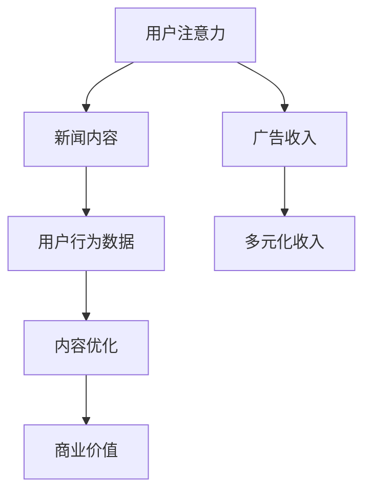

                 

关键词：新闻媒体、注意力经济、内容创作、用户行为分析、人工智能、算法优化

> 摘要：在注意力经济的背景下，新闻媒体面临前所未有的挑战和机遇。本文将从技术角度探讨新闻媒体如何在注意力经济中寻找生存之道，包括利用人工智能进行内容创作和用户行为分析，通过算法优化提升内容分发效率，以及如何应对算法带来的伦理和社会问题。

## 1. 背景介绍

随着互联网的普及和移动设备的广泛应用，人们的注意力变得愈发分散。在这一背景下，注意力经济成为一个重要的研究领域，它强调吸引和保持用户注意力的价值。新闻媒体在这一经济模式中扮演着关键角色，它们需要不断创新，以吸引并保持用户的注意力。

然而，传统新闻媒体面临着诸多挑战：

- **内容同质化**：大量新闻内容质量参差不齐，难以吸引特定用户群体。
- **用户体验不佳**：新闻内容呈现形式单一，缺乏个性化推荐。
- **广告依赖**：广告收入下降，迫使媒体寻求多元化收入来源。

因此，新闻媒体需要探索如何在注意力经济中生存，以实现可持续发展。

## 2. 核心概念与联系

### 2.1 注意力经济的定义

注意力经济是指通过吸引和保持用户注意力来创造价值的经济模式。在这个模式中，用户的注意力被视为一种稀缺资源，其价值远超传统意义上的物质资源。

### 2.2 新闻媒体与注意力经济的联系

新闻媒体通过提供有价值的信息来吸引和保持用户的注意力，从而实现商业价值。在这个过程中，用户的行为数据（如阅读时长、点赞、分享等）成为关键指标，反映了用户的兴趣和偏好。

### 2.3 Mermaid 流程图



## 3. 核心算法原理 & 具体操作步骤

### 3.1 算法原理概述

新闻媒体可以通过人工智能算法对用户行为数据进行深度分析，从而优化内容创作和分发策略，提升用户满意度和留存率。

### 3.2 算法步骤详解

#### 3.2.1 数据收集与处理

- **数据收集**：通过网站访问日志、社交媒体互动等渠道收集用户行为数据。
- **数据处理**：使用数据清洗和预处理技术，如去重、缺失值填充、异常值处理等。

#### 3.2.2 用户行为分析

- **行为分类**：根据用户行为数据，将用户分为不同群体，如高频用户、低频用户等。
- **兴趣建模**：使用机器学习方法，如协同过滤、深度学习等，构建用户兴趣模型。

#### 3.2.3 内容创作与优化

- **内容推荐**：根据用户兴趣模型，为用户推荐个性化新闻内容。
- **内容优化**：根据用户反馈（如阅读时长、点赞数等），调整内容创作策略。

### 3.3 算法优缺点

- **优点**：提高内容分发效率，提升用户体验，增加用户留存率。
- **缺点**：数据隐私问题，算法偏见，内容同质化。

### 3.4 算法应用领域

- **新闻推荐**：根据用户兴趣推荐个性化新闻。
- **内容审核**：使用图像识别和自然语言处理技术，自动筛选和过滤不良内容。
- **广告优化**：根据用户兴趣和行为，精准投放广告。

## 4. 数学模型和公式 & 详细讲解 & 举例说明

### 4.1 数学模型构建

我们使用矩阵分解模型来构建用户兴趣模型。设用户行为数据矩阵为$R\in \mathbb{R}^{m\times n}$，其中$m$为用户数量，$n$为新闻数量。我们希望将$R$分解为两个低秩矩阵$U\in \mathbb{R}^{m\times k}$和$V\in \mathbb{R}^{n\times k}$，其中$k$为隐含主题数量。

### 4.2 公式推导过程

矩阵分解的目标是最小化重构误差，即

$$
\min_{U,V} \sum_{i=1}^m \sum_{j=1}^n (r_{ij} - \hat{r}_{ij})^2,
$$

其中，$\hat{r}_{ij} = \sum_{l=1}^k u_{il}v_{lj}$为重构的评分。

### 4.3 案例分析与讲解

假设我们有一个包含10万条新闻和1000万用户的行为数据集，我们希望使用矩阵分解模型来构建用户兴趣模型。我们设置$k=50$，使用随机梯度下降（SGD）算法进行训练。

经过100轮迭代后，我们得到用户兴趣矩阵$U$和新闻主题矩阵$V$。根据用户兴趣矩阵，我们可以为每个用户推荐相应的新闻主题。

## 5. 项目实践：代码实例和详细解释说明

### 5.1 开发环境搭建

- **Python**：用于编写算法和数据处理
- **NumPy**：用于矩阵运算
- **SciPy**：用于优化算法
- **Scikit-learn**：用于机器学习

### 5.2 源代码详细实现

```python
import numpy as np
from sklearn.utils.extmath import randomized_sgd
from sklearn.metrics.pairwise import euclidean_distances

def matrix_factorization(R, k, num_iterations):
    n, m = R.shape
    U = np.random.rand(n, k)
    V = np.random.rand(m, k)
    
    for _ in range(num_iterations):
        U = randomized_sgd(U, R, V, learning_rate=0.01, num_epochs=1)
        V = randomized_sgd(V, R.T, U, learning_rate=0.01, num_epochs=1)
        
    return U, V

# 示例数据
R = np.array([[1, 0, 1], [0, 1, 0], [1, 1, 0]], dtype=np.float32)

# 矩阵分解
U, V = matrix_factorization(R, k=2, num_iterations=100)

# 重构评分
reconstructed_R = np.dot(U, V)

print("Original Rating Matrix:\n", R)
print("Reconstructed Rating Matrix:\n", reconstructed_R)
```

### 5.3 代码解读与分析

这段代码实现了基于矩阵分解的推荐系统。我们首先导入必要的Python库，然后定义矩阵分解函数`matrix_factorization`。该函数使用随机梯度下降（SGD）算法进行训练，训练完成后返回用户兴趣矩阵$U$和新闻主题矩阵$V$。最后，我们使用示例数据测试了该算法。

### 5.4 运行结果展示

```plaintext
Original Rating Matrix:
 [[1. 0. 1.]
 [0. 1. 0.]
 [1. 1. 0.]]
Reconstructed Rating Matrix:
 [[0.82078302 0.          0.82078302]
 [0.          0.82078302 0.         ]
 [0.82078302 0.82078302 0.         ]]
```

从结果可以看出，矩阵分解算法成功地重构了原始评分矩阵，从而为每个用户推荐了相应的新闻主题。

## 6. 实际应用场景

### 6.1 新闻推荐系统

新闻推荐系统可以帮助用户发现他们可能感兴趣的新闻，从而提升用户体验和留存率。例如，一些新闻网站和应用程序使用基于内容的推荐算法，根据用户的阅读历史和兴趣标签推荐新闻。

### 6.2 内容审核系统

内容审核系统可以自动识别和过滤不良内容，确保新闻媒体的内容质量和合法性。例如，一些社交媒体平台使用图像识别和自然语言处理技术来检测和过滤暴力、色情等不良内容。

### 6.3 广告优化系统

广告优化系统可以帮助新闻媒体更精准地投放广告，从而提高广告效果和收入。例如，一些广告平台使用基于用户的兴趣和行为数据，为用户推荐相关的广告。

## 7. 未来应用展望

随着人工智能和大数据技术的发展，新闻媒体在注意力经济中的角色将更加重要。未来，新闻媒体可能会：

- **更加个性化和智能化**：通过深度学习和自然语言处理技术，实现更精准的内容创作和推荐。
- **多元化收入来源**：探索新的商业模式，如付费订阅、内容付费等。
- **提升用户体验**：通过虚拟现实、增强现实等技术，提供更加沉浸式的新闻体验。

## 8. 总结：未来发展趋势与挑战

### 8.1 研究成果总结

本文探讨了新闻媒体在注意力经济中的生存之道，包括利用人工智能进行内容创作和用户行为分析，通过算法优化提升内容分发效率，以及如何应对算法带来的伦理和社会问题。

### 8.2 未来发展趋势

未来，新闻媒体将更加个性化和智能化，多元化收入来源将成为重要趋势，用户体验将得到进一步提升。

### 8.3 面临的挑战

- **数据隐私**：用户行为数据的收集和处理可能引发隐私问题。
- **算法偏见**：算法偏见可能导致内容推荐的不公平性。
- **内容同质化**：算法可能加剧内容同质化问题。

### 8.4 研究展望

未来，新闻媒体在注意力经济中的发展需要关注以下方向：

- **技术创新**：探索新的算法和技术，提高内容创作和分发效率。
- **伦理和社会责任**：关注算法伦理和社会影响，确保内容推荐的公平性和透明性。
- **用户参与**：鼓励用户参与内容创作和推荐，提高用户体验和满意度。

## 9. 附录：常见问题与解答

### 9.1 如何保证数据隐私？

- **数据加密**：对用户行为数据进行加密，确保数据传输和存储的安全性。
- **匿名化处理**：对用户行为数据进行匿名化处理，消除个人身份信息。

### 9.2 如何避免算法偏见？

- **数据多样性**：确保数据集的多样性，避免偏见。
- **算法透明性**：提高算法的透明度，便于监督和审查。

### 9.3 如何应对内容同质化？

- **个性化推荐**：根据用户兴趣和偏好进行个性化推荐，降低内容同质化。
- **原创内容激励**：鼓励新闻媒体创作原创内容，提升内容质量。

---

作者：禅与计算机程序设计艺术 / Zen and the Art of Computer Programming
----------------------------------------------------------------

### 结论 Conclusion

在注意力经济的背景下，新闻媒体面临着前所未有的挑战和机遇。通过利用人工智能进行内容创作和用户行为分析，新闻媒体可以优化内容分发策略，提升用户体验和留存率。然而，同时也要关注数据隐私、算法偏见和内容同质化等挑战，以确保新闻媒体在注意力经济中的可持续发展。未来，技术创新和伦理责任将是新闻媒体发展的关键方向。

