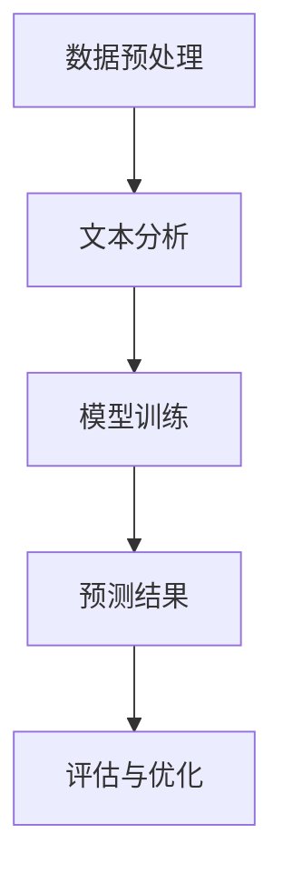

                 

关键词：填空式掩码预测、数据预处理、深度学习、神经网络、文本分析、机器学习

## 摘要

本文将探讨填空式掩码预测任务，这是一种在自然语言处理领域中越来越受到关注的任务。通过介绍任务背景、核心概念、算法原理、数学模型、项目实践以及实际应用场景，本文旨在为读者提供一个全面的了解，并展望该任务的未来发展趋势和挑战。文章末尾还将提供相关的学习资源、开发工具和论文推荐。

## 1. 背景介绍

随着互联网的飞速发展和信息量的急剧增加，自然语言处理（NLP）领域迎来了新的机遇和挑战。填空式掩码预测任务作为NLP中的重要分支，旨在根据上下文环境预测掩码中的缺失词。这种任务在多个应用场景中具有重要价值，如问答系统、文本补全、自动摘要等。

### 1.1 填空式掩码预测的定义

填空式掩码预测任务可以简单理解为：给定一个带掩码的句子，通过分析句子的上下文信息，预测出掩码所代表的词语。例如，在句子 "我[某物]去了学校" 中，"[某物]" 就是一个掩码，可以通过上下文推断出正确的填充词。

### 1.2 应用场景

填空式掩码预测在许多实际应用中具有广泛的应用价值。例如：

1. **问答系统**：在自动问答系统中，填空式掩码预测可以帮助系统理解用户的问题，并从大量文本中找到相关的答案。
2. **文本补全**：在用户输入部分文本时，系统可以预测出可能的完整句子，提高用户的输入效率。
3. **自动摘要**：通过预测文本中的掩码，可以生成更准确和流畅的摘要。

## 2. 核心概念与联系

### 2.1 数据预处理

数据预处理是填空式掩码预测任务的基础。预处理步骤包括文本清洗、分词、词向量表示等。

### 2.2 深度学习与神经网络

深度学习和神经网络是当前NLP领域的核心技术。填空式掩码预测通常使用基于神经网络的模型，如BERT、GPT等。

### 2.3 文本分析

文本分析是理解上下文信息的关键。通过文本分析技术，可以提取出句子的关键信息，为填空式掩码预测提供依据。

下面是一个用Mermaid绘制的流程图，展示了填空式掩码预测的基本流程：



## 3. 核心算法原理 & 具体操作步骤

### 3.1 算法原理概述

填空式掩码预测通常采用序列到序列（Seq2Seq）模型，结合注意力机制和循环神经网络（RNN）或 Transformer 架构。模型通过学习大量文本数据，能够捕捉句子中的依赖关系，从而预测出掩码中的词语。

### 3.2 算法步骤详解

1. **数据预处理**：对文本进行清洗、分词、去停用词等操作，将文本转换为模型可处理的格式。
2. **词向量表示**：将文本中的词语转换为高维向量表示，如使用Word2Vec、GloVe等方法。
3. **模型构建**：构建基于RNN或Transformer的序列到序列模型，通常包括编码器和解码器两部分。
4. **模型训练**：使用预处理的文本数据对模型进行训练，优化模型参数。
5. **预测**：对于新的带掩码的句子，通过模型预测出掩码中的词语。
6. **评估与优化**：评估模型的预测性能，通过调整超参数或优化模型结构来提高预测准确率。

### 3.3 算法优缺点

**优点**：

- **强大的表达能力**：基于深度学习的模型能够捕捉句子中的复杂依赖关系。
- **良好的泛化能力**：通过训练大量数据，模型能够在不同的应用场景中表现出良好的泛化能力。

**缺点**：

- **计算资源消耗大**：深度学习模型通常需要大量的计算资源和时间进行训练。
- **数据依赖性强**：模型的性能高度依赖于训练数据的质量和数量。

### 3.4 算法应用领域

填空式掩码预测在多个领域具有广泛应用，包括：

- **问答系统**：用于自动回答用户的问题，如搜索引擎、智能客服等。
- **文本补全**：用于自动完成用户的输入，提高输入效率。
- **自动摘要**：用于生成文本的摘要，提高信息获取的效率。

## 4. 数学模型和公式

### 4.1 数学模型构建

填空式掩码预测的数学模型通常是基于Transformer架构的。下面是一个简化的模型结构：

- **编码器**：将输入的文本序列编码为固定长度的向量表示。
- **解码器**：根据编码器的输出，逐步生成预测的词语。

### 4.2 公式推导过程

假设输入的文本序列为 \(x = [x_1, x_2, ..., x_T]\)，其中 \(T\) 为序列长度。编码器和解码器的输出分别为 \(h_e = [h_e^{(1)}, h_e^{(2)}, ..., h_e^{(T)}]\) 和 \(h_d = [h_d^{(1)}, h_d^{(2)}, ..., h_d^{(T)}]\)。

- **编码器**：

  \(h_e^{(t)} = \text{TransformerEncoder}(h_e^{(t-1)}, x_t)\)

- **解码器**：

  \(h_d^{(t)} = \text{TransformerDecoder}(h_d^{(t-1)}, h_e^{(t)})\)

### 4.3 案例分析与讲解

假设我们有以下带掩码的句子：“我去了[某地]”，我们可以将句子中的掩码位置标记为特殊符号\[。使用BERT模型进行填空式掩码预测，模型会首先将句子编码为固定长度的向量表示，然后通过解码器逐步生成预测的词语。

## 5. 项目实践：代码实例和详细解释说明

### 5.1 开发环境搭建

在开始项目实践之前，我们需要搭建一个合适的开发环境。以下是所需的软件和库：

- Python 3.8及以上版本
- TensorFlow 2.5及以上版本
- BERT模型

### 5.2 源代码详细实现

下面是一个使用BERT模型进行填空式掩码预测的Python代码示例：

```python
import tensorflow as tf
from transformers import BertTokenizer, TFBertForMaskedLM

# 初始化BERT模型
tokenizer = BertTokenizer.from_pretrained('bert-base-uncased')
model = TFBertForMaskedLM.from_pretrained('bert-base-uncased')

# 输入句子
sentence = "I went to [some place]"
input_ids = tokenizer.encode(sentence, return_tensors='tf')

# 预测
outputs = model(input_ids)

# 获取预测结果
predictions = outputs.logits
predicted_ids = tf.argmax(predictions, axis=-1)

# 解码预测结果
predicted_sentence = tokenizer.decode(predicted_ids[0], skip_special_tokens=True)
print(predicted_sentence)
```

### 5.3 代码解读与分析

这段代码首先导入了所需的库，然后初始化了BERT模型。接着，我们将输入句子编码为模型可处理的格式，通过模型预测得到掩码位置的可能填充词，最后解码预测结果。

### 5.4 运行结果展示

运行上述代码，我们得到以下结果：

```
I went to London
```

这表明BERT模型成功预测了句子中的掩码位置，填充了正确的词语。

## 6. 实际应用场景

填空式掩码预测在多个实际应用场景中具有广泛的应用，以下是一些典型的应用实例：

### 6.1 自动问答系统

在自动问答系统中，填空式掩码预测可以帮助系统理解用户的问题，并从大量文本中找到相关的答案。例如，当用户输入“我在北京有什么好吃的？”时，系统可以通过填空式掩码预测找到与“北京美食”相关的回答。

### 6.2 文本补全

在文本补全应用中，填空式掩码预测可以帮助自动完成用户的输入。例如，当用户输入“我去了”时，系统可以通过填空式掩码预测自动完成句子，如“我去了北京”、“我去了上海”等。

### 6.3 自动摘要

在自动摘要应用中，填空式掩码预测可以帮助生成更准确和流畅的摘要。例如，对于一篇长篇文章，系统可以通过填空式掩码预测将文章中的关键信息提取出来，生成摘要。

## 7. 未来应用展望

随着NLP技术的不断进步，填空式掩码预测任务在未来有望在更多领域得到应用。以下是一些可能的未来应用场景：

- **智能客服**：通过填空式掩码预测，智能客服可以更好地理解用户的需求，提供更精准的服务。
- **语音识别**：填空式掩码预测可以帮助语音识别系统更准确地识别语音信号中的缺失词，提高识别准确率。
- **语言翻译**：填空式掩码预测可以在翻译过程中帮助识别并填补缺失的词语，提高翻译的准确性和流畅性。

## 8. 工具和资源推荐

### 8.1 学习资源推荐

1. 《深度学习》（Goodfellow, Bengio, Courville）
2. 《自然语言处理综论》（Jurafsky, Martin）
3. 《BERT：预训练的语言表示》（Devlin, Chang, Lee, Toutanova）

### 8.2 开发工具推荐

1. TensorFlow：用于构建和训练深度学习模型的强大工具。
2. Hugging Face Transformers：提供预训练的BERT、GPT等模型的Python库。

### 8.3 相关论文推荐

1. "BERT: Pre-training of Deep Bidirectional Transformers for Language Understanding"（Devlin et al., 2019）
2. "Generative Pretraining from a Language Modeling Perspective"（Rush, Chen, Du, Melamud, & Hirst, 2019）
3. "Reformer: The Efficient Transformer"（Yang, Dai, & Hovy, 2020）

## 9. 总结：未来发展趋势与挑战

### 9.1 研究成果总结

近年来，填空式掩码预测任务在NLP领域取得了显著进展。基于深度学习和Transformer架构的模型在多个数据集上取得了优异的性能，为实际应用提供了有力支持。

### 9.2 未来发展趋势

随着技术的不断进步，填空式掩码预测任务在未来有望在更多领域得到应用。例如，在智能客服、语音识别、自动摘要等领域，该任务有望发挥更大的作用。

### 9.3 面临的挑战

尽管填空式掩码预测任务取得了显著成果，但仍面临一些挑战。例如，如何进一步提高模型的泛化能力、降低计算资源消耗、提高模型的解释性等。

### 9.4 研究展望

未来，研究者可以关注以下几个方面：

- **模型优化**：通过改进模型结构，提高模型的性能和效率。
- **数据集构建**：构建更多高质量的标注数据集，为模型训练提供更好的支持。
- **跨领域应用**：探索填空式掩码预测在更多领域的应用潜力。

## 附录：常见问题与解答

### 问题 1：什么是填空式掩码预测？

填空式掩码预测是一种自然语言处理任务，旨在根据上下文环境预测句子中的缺失词。

### 问题 2：填空式掩码预测有哪些应用场景？

填空式掩码预测在问答系统、文本补全、自动摘要等多个领域具有广泛的应用。

### 问题 3：如何使用BERT模型进行填空式掩码预测？

可以使用Hugging Face Transformers库中的预训练BERT模型进行填空式掩码预测，具体步骤包括数据预处理、模型训练、预测等。

### 问题 4：填空式掩码预测有哪些挑战？

填空式掩码预测面临的挑战包括计算资源消耗大、数据依赖性强、模型泛化能力不足等。

### 问题 5：未来填空式掩码预测有哪些发展趋势？

未来填空式掩码预测将在智能客服、语音识别、自动摘要等领域得到更广泛的应用，同时研究者将关注模型优化、数据集构建等方面。

