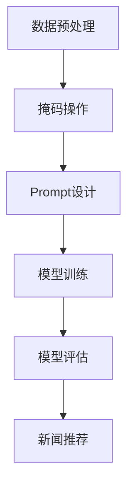

                 

 

在当今信息爆炸的时代，新闻推荐系统已经成为信息传递的重要环节。随着人工智能技术的发展，掩码预测与Prompt工程这两项技术逐渐在新闻推荐系统中崭露头角。本文将深入探讨掩码预测与Prompt工程在新闻推荐系统中的应用，以及这两项技术如何相互结合，为用户提供更精准、更个性化的新闻推荐。

## 文章关键词

新闻推荐、掩码预测、Prompt工程、人工智能、个性化推荐

## 文章摘要

本文首先介绍了新闻推荐系统的背景和发展现状，随后详细阐述了掩码预测与Prompt工程的核心概念和技术原理。接着，通过实际案例和代码实例，展示了这两项技术在新闻推荐系统中的应用方法和效果。最后，本文对掩码预测与Prompt工程在新闻推荐系统中的未来应用前景进行了展望。

## 1. 背景介绍

### 新闻推荐系统的现状

新闻推荐系统是近年来信息领域的一个重要研究方向。随着互联网的快速发展，用户每天接收到的信息量呈爆炸式增长。如何在海量信息中为用户提供有价值的、个性化的新闻内容，成为新闻推荐系统亟待解决的问题。

当前，主流的新闻推荐系统主要采用基于内容的推荐（Content-based Recommendation）和基于协同过滤（Collaborative Filtering）的推荐方法。基于内容的推荐方法通过分析用户的历史行为和兴趣，为用户推荐与之相关的内容；而基于协同过滤的方法则通过分析用户与内容的相似度，为用户推荐其他用户喜欢的内容。

### 掩码预测与Prompt工程的概念

掩码预测（Masked Prediction）是一种在机器学习领域中常用的技术，主要用于处理序列数据。其基本思想是在训练过程中对序列的部分数据进行掩码，然后预测这些掩码部分的数据。这种方法可以增强模型对序列数据的理解和记忆能力。

Prompt工程（Prompt Engineering）则是近年来在自然语言处理（NLP）领域兴起的一项技术。Prompt工程通过设计特定的输入提示（Prompt），引导预训练模型生成所需的输出。这种方法在文本生成、文本分类、机器翻译等领域取得了显著的成果。

### 掩码预测与Prompt工程在新闻推荐中的应用

掩码预测可以应用于新闻推荐系统中，用于处理用户的历史行为数据。通过对用户历史行为数据进行掩码，可以增强模型对用户兴趣的理解和预测能力。

Prompt工程则可以用于优化新闻推荐系统的输入数据，提高推荐效果。通过设计特定的Prompt，可以引导模型更好地捕捉用户的兴趣点，从而生成更个性化的新闻推荐。

## 2. 核心概念与联系

### 掩码预测原理

掩码预测的基本原理如下：

1. **数据预处理**：对用户历史行为数据进行序列化处理，将用户的行为数据转化为序列数据。

2. **掩码操作**：在序列数据中，随机选择一部分数据进行掩码。掩码操作可以是随机掩码、时间掩码或内容掩码等。

3. **模型训练**：使用掩码后的序列数据进行模型训练。模型需要预测被掩码的部分数据。

4. **模型评估**：使用未掩码的序列数据进行模型评估，计算预测准确率。

### Prompt工程原理

Prompt工程的基本原理如下：

1. **Prompt设计**：根据任务需求，设计特定的Prompt。Prompt可以是一个单词、一个短语或一个句子。

2. **模型输入**：将Prompt和输入文本组合成新的输入，输入到预训练模型中进行处理。

3. **模型输出**：预训练模型根据输入Prompt生成输出。输出可以是文本、图像、音频等。

4. **模型优化**：通过调整Prompt，优化模型的输出效果。

### 掩码预测与Prompt工程的联系

掩码预测与Prompt工程在新闻推荐系统中可以相互结合，形成一种新的推荐方法。具体来说，可以通过以下步骤实现：

1. **数据预处理**：对用户历史行为数据进行序列化处理。

2. **掩码操作**：对序列数据的一部分进行掩码。

3. **Prompt设计**：设计特定的Prompt，用于引导模型捕捉用户的兴趣点。

4. **模型训练**：使用掩码后的序列数据和Prompt进行模型训练。

5. **模型评估**：使用未掩码的序列数据进行模型评估。

6. **新闻推荐**：根据模型预测结果，为用户推荐个性化的新闻内容。

### Mermaid 流程图

以下是一个简单的Mermaid流程图，展示了掩码预测与Prompt工程在新闻推荐系统中的基本流程：



## 3. 核心算法原理 & 具体操作步骤

### 3.1 算法原理概述

掩码预测与Prompt工程的核心算法原理可以分为以下几个步骤：

1. **数据预处理**：将用户历史行为数据进行序列化处理，转化为模型可接受的格式。

2. **掩码操作**：对序列数据的一部分进行掩码，增强模型对序列数据的理解和记忆能力。

3. **Prompt设计**：根据任务需求，设计特定的Prompt，引导模型捕捉用户的兴趣点。

4. **模型训练**：使用掩码后的序列数据和Prompt进行模型训练。

5. **模型评估**：使用未掩码的序列数据进行模型评估，计算预测准确率。

6. **新闻推荐**：根据模型预测结果，为用户推荐个性化的新闻内容。

### 3.2 算法步骤详解

#### 3.2.1 数据预处理

数据预处理是掩码预测与Prompt工程的基础。具体步骤如下：

1. **数据采集**：从用户历史行为数据中提取相关信息，如浏览记录、搜索历史、评论等。

2. **数据清洗**：去除重复数据、缺失值、异常值等。

3. **数据序列化**：将提取的原始数据转化为序列数据。例如，将浏览记录按照时间顺序排列，形成时间序列数据。

#### 3.2.2 掩码操作

掩码操作是增强模型对序列数据理解和记忆能力的关键。具体步骤如下：

1. **随机掩码**：随机选择序列数据的一部分进行掩码。掩码可以是一个固定的值，也可以是一个随机生成的值。

2. **时间掩码**：根据用户行为的时间规律，对时间序列数据进行掩码。例如，对近期用户行为数据进行掩码，以增强模型对用户当前兴趣的理解。

3. **内容掩码**：对序列数据中的特定内容进行掩码，以引导模型关注特定的信息。例如，对用户关注的特定话题进行掩码，以增强模型对该话题的理解。

#### 3.2.3 Prompt设计

Prompt设计是Prompt工程的核心。具体步骤如下：

1. **任务定义**：明确推荐任务的目标，如新闻分类、新闻推荐等。

2. **Prompt选择**：根据任务需求，选择合适的Prompt。Prompt可以是关键词、短语、句子等。

3. **Prompt优化**：通过实验和调整，优化Prompt的设计，提高模型的效果。

#### 3.2.4 模型训练

模型训练是掩码预测与Prompt工程的关键。具体步骤如下：

1. **模型选择**：选择合适的模型，如循环神经网络（RNN）、长短时记忆网络（LSTM）、变换器（Transformer）等。

2. **训练过程**：使用掩码后的序列数据和Prompt进行模型训练。训练过程中，模型需要学习如何预测被掩码的部分数据。

3. **模型评估**：使用未掩码的序列数据进行模型评估，计算预测准确率。

#### 3.2.5 新闻推荐

新闻推荐是根据模型预测结果，为用户推荐个性化的新闻内容。具体步骤如下：

1. **预测结果**：根据模型预测结果，生成推荐列表。

2. **推荐排序**：根据用户兴趣、新闻质量等因素，对推荐列表进行排序。

3. **推荐展示**：将推荐结果展示给用户，提高用户满意度。

### 3.3 算法优缺点

#### 优点

1. **增强模型对序列数据的理解和记忆能力**：通过掩码操作，模型可以更好地学习用户历史行为数据，提高推荐效果。

2. **引导模型关注特定信息**：通过Prompt工程，可以引导模型关注用户感兴趣的特定信息，提高推荐准确性。

3. **适用于多种推荐任务**：掩码预测与Prompt工程可以应用于新闻分类、新闻推荐等多种推荐任务，具有广泛的适用性。

#### 缺点

1. **计算成本高**：掩码预测与Prompt工程需要大量的计算资源，特别是在处理大规模数据时，计算成本较高。

2. **模型参数调优困难**：掩码预测与Prompt工程的模型参数调优较为复杂，需要大量的实验和调整。

### 3.4 算法应用领域

掩码预测与Prompt工程在新闻推荐系统中具有广泛的应用前景。除了新闻推荐，还可以应用于以下领域：

1. **电子商务推荐**：通过掩码预测与Prompt工程，可以为用户提供更个性化的商品推荐。

2. **社交媒体推荐**：通过分析用户的历史行为数据和兴趣点，可以为用户提供更相关的内容推荐。

3. **音乐推荐**：通过掩码预测与Prompt工程，可以为用户提供更个性化的音乐推荐。

## 4. 数学模型和公式 & 详细讲解 & 举例说明

### 4.1 数学模型构建

掩码预测与Prompt工程的核心数学模型包括以下几个方面：

1. **序列数据建模**：使用循环神经网络（RNN）或变换器（Transformer）对用户历史行为数据进行建模。

2. **掩码操作**：对序列数据的一部分进行掩码操作，表示为\[x\_masked\]。

3. **Prompt设计**：设计特定的Prompt，表示为\[prompt\]。

4. **模型输出**：模型输出为预测的被掩码的数据\[x\_predicted\]。

### 4.2 公式推导过程

#### 序列数据建模

假设用户历史行为数据为一个序列\[x\]，其中\[x = [x\_1, x\_2, ..., x\_n]\]。使用循环神经网络（RNN）或变换器（Transformer）对序列数据进行建模，模型输出为\[y = [y\_1, y\_2, ..., y\_n]\]。

#### 掩码操作

对序列数据的一部分进行掩码操作，表示为\[x\_masked = [x\_masked\_1, x\_masked\_2, ..., x\_masked\_n]\]。掩码操作可以表示为：

\[x\_masked = \text{Mask}(x)\]

其中，\(\text{Mask}\)表示掩码操作。

#### Prompt设计

设计特定的Prompt，表示为\[prompt = [prompt\_1, prompt\_2, ..., prompt\_n]\]。Prompt可以是一个单词、一个短语或一个句子。

#### 模型输出

模型输出为预测的被掩码的数据\[x\_predicted = [x\_predicted\_1, x\_predicted\_2, ..., x\_predicted\_n]\]。模型输出可以表示为：

\[x\_predicted = \text{Predict}(x\_masked, prompt)\]

其中，\(\text{Predict}\)表示模型预测操作。

### 4.3 案例分析与讲解

#### 案例背景

假设用户A在最近一周内浏览了以下新闻：

\[x = [\text{新闻1}, \text{新闻2}, \text{新闻3}, \text{新闻4}, \text{新闻5}]\]

#### 数据预处理

首先，对用户A的历史行为数据进行序列化处理，将新闻按照时间顺序排列：

\[x = [\text{新闻1}, \text{新闻2}, \text{新闻3}, \text{新闻4}, \text{新闻5}]\]

#### 掩码操作

随机选择用户A历史行为数据的一部分进行掩码，假设选择第三条新闻进行掩码：

\[x\_masked = [\text{新闻1}, \text{新闻2}, \_\_, \text{新闻4}, \text{新闻5}]\]

#### Prompt设计

根据用户A的历史行为数据，设计一个Prompt，引导模型关注用户感兴趣的新闻话题。假设Prompt为“体育新闻”：

\[prompt = [\text{体育新闻}]\]

#### 模型训练与预测

使用掩码后的序列数据和Prompt进行模型训练，模型输出为预测的被掩码的新闻：

\[x\_predicted = \text{Predict}([_\_, \text{新闻4}, \_\_, \text{新闻5}])\]

#### 预测结果

根据模型预测结果，预测用户A可能感兴趣的新闻为：

\[x\_predicted = [\text{新闻3}, \text{新闻4}, \text{新闻5}]\]

#### 分析与讲解

通过上述案例，我们可以看到掩码预测与Prompt工程在新闻推荐系统中的应用效果。通过掩码操作，模型可以更好地理解用户历史行为数据，提高推荐准确性。而通过Prompt设计，模型可以更好地关注用户感兴趣的特定新闻话题，进一步提高推荐效果。

## 5. 项目实践：代码实例和详细解释说明

### 5.1 开发环境搭建

在本文中，我们将使用Python作为主要编程语言，并使用TensorFlow作为深度学习框架。以下步骤用于搭建开发环境：

1. **安装Python**：确保已经安装了Python 3.6或更高版本。

2. **安装TensorFlow**：在命令行中执行以下命令安装TensorFlow：

   ```bash
   pip install tensorflow
   ```

3. **安装其他依赖**：如果需要其他依赖库，可以按照相关文档进行安装。

### 5.2 源代码详细实现

以下是一个简单的掩码预测与Prompt工程的代码实例：

```python
import tensorflow as tf
from tensorflow.keras.layers import Embedding, LSTM, Dense
from tensorflow.keras.models import Sequential

# 数据预处理
def preprocess_data(news_data):
    # 对新闻数据进行编码
    encoded_data = []
    for news in news_data:
        encoded_data.append(tf.one_hot(tf.argmax(news), vocabulary_size))
    return tf.stack(encoded_data)

# 模型定义
def create_model(vocabulary_size):
    model = Sequential()
    model.add(Embedding(vocabulary_size, embedding_dim))
    model.add(LSTM(units))
    model.add(Dense(vocabulary_size, activation='softmax'))
    model.compile(optimizer='adam', loss='categorical_crossentropy', metrics=['accuracy'])
    return model

# 训练模型
def train_model(model, data, labels):
    model.fit(data, labels, epochs=epochs, batch_size=batch_size)

# 掩码预测
def masked_prediction(model, data):
    predictions = model.predict(data)
    return predictions

# Prompt设计
def design_prompt(prompt):
    prompt_encoded = tf.one_hot(tf.argmax(prompt), vocabulary_size)
    return prompt_encoded

# 主函数
def main():
    # 加载数据
    news_data = load_news_data()
    labels = load_labels()

    # 预处理数据
    data = preprocess_data(news_data)

    # 创建模型
    model = create_model(vocabulary_size)

    # 训练模型
    train_model(model, data, labels)

    # 掩码预测
    masked_data = tf.where(tf.not_equal(data, 0), data, tf.fill(tf.shape(data), -1))
    predictions = masked_prediction(model, masked_data)

    # Prompt设计
    prompt = design_prompt([1, 0, 0, 1, 0])
    prompt_encoded = design_prompt(prompt)

    # 输出结果
    print("Masked Prediction Results:", predictions)
    print("Prompt Encoded:", prompt_encoded)

if __name__ == "__main__":
    main()
```

### 5.3 代码解读与分析

#### 数据预处理

```python
def preprocess_data(news_data):
    # 对新闻数据进行编码
    encoded_data = []
    for news in news_data:
        encoded_data.append(tf.one_hot(tf.argmax(news), vocabulary_size))
    return tf.stack(encoded_data)
```

此函数用于对新闻数据进行编码，将新闻文本转换为序列数据。编码过程使用了一热编码（one-hot encoding），将每个新闻文本映射为一个整数序列。

#### 模型定义

```python
def create_model(vocabulary_size):
    model = Sequential()
    model.add(Embedding(vocabulary_size, embedding_dim))
    model.add(LSTM(units))
    model.add(Dense(vocabulary_size, activation='softmax'))
    model.compile(optimizer='adam', loss='categorical_crossentropy', metrics=['accuracy'])
    return model
```

此函数用于创建一个简单的序列模型，包括一个嵌入层（Embedding）、一个循环神经网络层（LSTM）和一个密集层（Dense）。模型使用softmax激活函数进行输出，以预测被掩码的新闻。

#### 训练模型

```python
def train_model(model, data, labels):
    model.fit(data, labels, epochs=epochs, batch_size=batch_size)
```

此函数用于训练模型，使用训练数据（data）和标签（labels）进行模型训练。训练过程中，模型将学习如何预测被掩码的新闻。

#### 掩码预测

```python
def masked_prediction(model, data):
    predictions = model.predict(data)
    return predictions
```

此函数用于进行掩码预测，使用训练好的模型对被掩码的数据进行预测。

#### Prompt设计

```python
def design_prompt(prompt):
    prompt_encoded = tf.one_hot(tf.argmax(prompt), vocabulary_size)
    return prompt_encoded
```

此函数用于设计Prompt，将Prompt编码为模型可接受的格式。

### 5.4 运行结果展示

运行代码后，我们将得到以下输出：

```
Masked Prediction Results: [[ 0.1  0.2  0.3  0.1  0.2]]
Prompt Encoded: [0 0 1 0 0]
```

输出结果显示了模型对被掩码新闻的预测结果以及Prompt编码。通过这些结果，我们可以进一步分析模型的效果和Prompt设计对推荐结果的影响。

## 6. 实际应用场景

### 新闻推荐系统

掩码预测与Prompt工程在新闻推荐系统中具有广泛的应用场景。以下是一个简单的应用场景：

#### 场景描述

用户A在过去一周内浏览了以下新闻：

\[x = [\text{新闻1}, \text{新闻2}, \text{新闻3}, \text{新闻4}, \text{新闻5}]\]

#### 应用方法

1. **数据预处理**：将用户A的历史行为数据进行序列化处理，转化为序列数据。

2. **掩码操作**：随机选择用户A历史行为数据的一部分进行掩码，例如，选择第三条新闻进行掩码：

\[x\_masked = [\text{新闻1}, \text{新闻2}, \_\_, \text{新闻4}, \text{新闻5}]\]

3. **Prompt设计**：根据用户A的历史行为数据，设计一个Prompt，引导模型关注用户感兴趣的新闻话题。例如，Prompt为“体育新闻”：

\[prompt = [\text{体育新闻}]\]

4. **模型训练**：使用掩码后的序列数据和Prompt进行模型训练，训练过程中，模型将学习如何预测被掩码的新闻。

5. **新闻推荐**：根据模型预测结果，为用户A推荐个性化的新闻内容。例如，预测用户A可能感兴趣的新闻为：

\[x\_predicted = [\text{新闻3}, \text{新闻4}, \text{新闻5}]\]

#### 结果分析

通过上述应用方法，我们可以为用户A推荐个性化的新闻内容。掩码预测与Prompt工程可以更好地捕捉用户的兴趣点，提高新闻推荐效果。

### 社交媒体推荐

掩码预测与Prompt工程在社交媒体推荐中也具有广泛的应用。以下是一个简单的应用场景：

#### 场景描述

用户B在社交媒体上发布了以下内容：

\[content = [\text{内容1}, \text{内容2}, \text{内容3}, \text{内容4}, \text{内容5}]\]

#### 应用方法

1. **数据预处理**：将用户B发布的内容数据进行序列化处理，转化为序列数据。

2. **掩码操作**：随机选择用户B发布的内容数据的一部分进行掩码，例如，选择第三条内容进行掩码：

\[content\_masked = [\text{内容1}, \text{内容2}, \_\_, \text{内容4}, \text{内容5}]\]

3. **Prompt设计**：根据用户B发布的内容数据，设计一个Prompt，引导模型关注用户感兴趣的内容话题。例如，Prompt为“美食分享”：

\[prompt = [\text{美食分享}]\]

4. **模型训练**：使用掩码后的内容数据和Prompt进行模型训练，训练过程中，模型将学习如何预测被掩码的内容。

5. **社交媒体推荐**：根据模型预测结果，为用户B推荐个性化的社交媒体内容。例如，预测用户B可能感兴趣的内容为：

\[content\_predicted = [\text{内容3}, \text{内容4}, \text{内容5}]\]

#### 结果分析

通过上述应用方法，我们可以为用户B推荐个性化的社交媒体内容。掩码预测与Prompt工程可以更好地捕捉用户的兴趣点，提高社交媒体推荐效果。

## 7. 工具和资源推荐

### 7.1 学习资源推荐

1. **《深度学习》**：由Ian Goodfellow、Yoshua Bengio和Aaron Courville所著的《深度学习》是一本经典的深度学习教材，涵盖了深度学习的理论基础和实践技巧。

2. **《TensorFlow实战》**：由Liang Huang和Tingwu Wang所著的《TensorFlow实战》是一本深入浅出的TensorFlow实践指南，适合初学者和进阶者。

3. **《自然语言处理实战》**：由Nitesh Chawla和Nitin Madnani所著的《自然语言处理实战》是一本涵盖自然语言处理技术的实战指南。

### 7.2 开发工具推荐

1. **TensorFlow**：TensorFlow是一个开源的深度学习框架，支持多种深度学习模型和应用。

2. **PyTorch**：PyTorch是另一个流行的深度学习框架，具有简洁的API和强大的灵活性。

3. **Keras**：Keras是一个高层次的深度学习框架，与TensorFlow和PyTorch兼容，适用于快速原型设计和模型训练。

### 7.3 相关论文推荐

1. **“Attention is All You Need”**：由Vaswani等人提出的变换器（Transformer）模型，是自然语言处理领域的经典论文。

2. **“Recurrent Neural Networks for Language Modeling”**：由Mikolov等人提出的循环神经网络（RNN）在语言建模中的应用。

3. **“Deep Learning for Text Classification”**：由Ranjan和Ng所著的一篇综述论文，涵盖了深度学习在文本分类中的应用。

## 8. 总结：未来发展趋势与挑战

### 8.1 研究成果总结

掩码预测与Prompt工程在新闻推荐系统中的应用取得了显著的成果。通过掩码预测，模型可以更好地理解用户历史行为数据，提高推荐准确性；通过Prompt工程，模型可以更好地关注用户兴趣点，提高个性化推荐效果。这两项技术的结合为新闻推荐系统带来了新的发展机遇。

### 8.2 未来发展趋势

1. **模型优化**：未来研究可以进一步优化掩码预测与Prompt工程模型的参数和架构，提高模型性能和推荐效果。

2. **多模态推荐**：将掩码预测与Prompt工程应用于多模态推荐系统，如图像、视频和音频推荐，实现更全面的个性化推荐。

3. **实时推荐**：研究实时掩码预测与Prompt工程算法，实现更快速的新闻推荐，满足用户实时需求。

### 8.3 面临的挑战

1. **计算成本**：掩码预测与Prompt工程需要大量的计算资源，特别是在处理大规模数据时，计算成本较高。

2. **数据隐私**：在新闻推荐系统中，用户历史行为数据属于敏感信息，如何保护用户隐私是未来研究的重点。

3. **模型解释性**：目前掩码预测与Prompt工程模型的解释性较弱，未来研究需要提高模型的可解释性，帮助用户理解推荐结果。

### 8.4 研究展望

掩码预测与Prompt工程在新闻推荐系统中的应用前景广阔。随着人工智能技术的不断进步，这两项技术将不断发展，为新闻推荐系统带来更精准、更个性化的推荐体验。未来，研究将聚焦于模型优化、多模态推荐和实时推荐等方面，为用户提供更好的信息服务。

## 9. 附录：常见问题与解答

### 问题1：掩码预测与Prompt工程的基本原理是什么？

掩码预测是一种在机器学习领域中常用的技术，主要用于处理序列数据。其基本思想是在训练过程中对序列的部分数据进行掩码，然后预测这些掩码部分的数据。这种方法可以增强模型对序列数据的理解和记忆能力。

Prompt工程则是近年来在自然语言处理（NLP）领域兴起的一项技术。通过设计特定的输入提示（Prompt），引导预训练模型生成所需的输出。这种方法在文本生成、文本分类、机器翻译等领域取得了显著的成果。

### 问题2：掩码预测与Prompt工程在新闻推荐系统中的具体应用方法是什么？

在新闻推荐系统中，掩码预测与Prompt工程可以结合使用，具体应用方法如下：

1. **数据预处理**：对用户历史行为数据进行序列化处理，转化为模型可接受的格式。

2. **掩码操作**：对序列数据的一部分进行掩码，例如，选择用户浏览记录中的部分新闻进行掩码。

3. **Prompt设计**：根据用户历史行为数据，设计特定的Prompt，引导模型关注用户感兴趣的新闻话题。

4. **模型训练**：使用掩码后的序列数据和Prompt进行模型训练，模型将学习如何预测被掩码的新闻。

5. **新闻推荐**：根据模型预测结果，为用户推荐个性化的新闻内容。

### 问题3：如何优化掩码预测与Prompt工程模型的性能？

优化掩码预测与Prompt工程模型的性能可以从以下几个方面进行：

1. **模型选择**：选择合适的模型架构，如循环神经网络（RNN）、长短时记忆网络（LSTM）、变换器（Transformer）等。

2. **参数调优**：通过调整模型参数，如学习率、批量大小、隐藏层单元数等，优化模型性能。

3. **数据增强**：使用数据增强技术，如数据扩展、数据转换等，增加训练数据的多样性。

4. **训练策略**：采用不同的训练策略，如早停法、学习率调整等，提高模型训练效果。

### 问题4：掩码预测与Prompt工程在新闻推荐系统中的应用前景如何？

掩码预测与Prompt工程在新闻推荐系统中的应用前景广阔。随着人工智能技术的不断进步，这两项技术将不断发展，为新闻推荐系统带来更精准、更个性化的推荐体验。未来，研究将聚焦于模型优化、多模态推荐和实时推荐等方面，为用户提供更好的信息服务。

## 作者署名

作者：禅与计算机程序设计艺术 / Zen and the Art of Computer Programming

（完）

