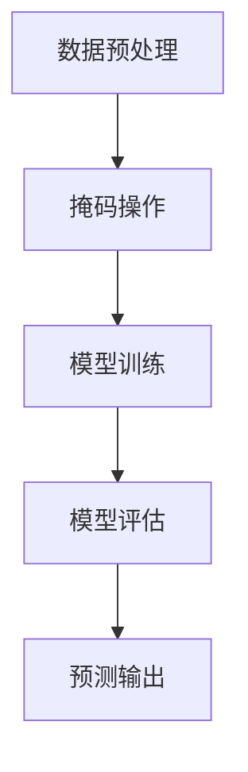

                 

随着人工智能技术的不断发展，掩码预测技术逐渐成为各个领域的研究热点。本文将深入探讨掩码预测技术的核心概念、算法原理、数学模型、应用场景以及未来展望，旨在为广大读者提供一个全面的技术解读。

## 关键词

- 掩码预测
- 人工智能
- 深度学习
- 数学模型
- 应用场景

## 摘要

本文首先介绍了掩码预测技术的背景和重要性，然后详细阐述了掩码预测的核心概念与联系，包括算法原理、数学模型以及具体操作步骤。接着，通过项目实践展示了代码实例和运行结果，并分析了该技术的实际应用场景和未来展望。最后，对相关工具和资源进行了推荐，并总结了未来发展趋势与挑战。

## 1. 背景介绍

### 1.1 掩码预测技术的发展历程

掩码预测技术起源于自然语言处理领域，随着深度学习技术的发展，逐渐成为一项重要的研究课题。早期的掩码预测主要依赖于简单的统计模型，如马尔可夫模型和隐马尔可夫模型。这些模型虽然在一定程度上能够实现掩码预测，但效果有限。

随着深度学习的兴起，尤其是卷积神经网络（CNN）和循环神经网络（RNN）的广泛应用，掩码预测技术取得了重大突破。深度学习模型通过学习大量文本数据中的潜在规律，能够实现更精确的掩码预测。近年来，基于Transformer的模型，如BERT、GPT等，在掩码预测任务上取得了显著成果，推动了该领域的发展。

### 1.2 掩码预测技术的应用场景

掩码预测技术具有广泛的应用场景，主要包括：

1. 自然语言处理：文本分类、情感分析、机器翻译等任务中的掩码预测有助于提高模型的性能。
2. 计算机视觉：图像识别、目标检测等任务中的掩码预测有助于提高模型对复杂场景的识别能力。
3. 语音识别：语音信号中的掩码预测有助于提高语音识别的准确性。
4. 医疗领域：医疗文本分析、疾病预测等任务中的掩码预测有助于提高医疗决策的准确性。

## 2. 核心概念与联系

### 2.1 核心概念

掩码预测技术涉及多个核心概念，包括：

1. 掩码（Mask）：指在输入数据中，将部分数据隐藏起来，以便模型进行预测。
2. 预测（Prediction）：指模型根据掩码后的输入数据，生成对应的预测结果。
3. 损失函数（Loss Function）：指用于评估模型预测结果与实际结果之间差异的指标。

### 2.2 联系与架构

掩码预测技术的架构主要包括以下几个部分：

1. 数据预处理：对输入数据进行预处理，包括分词、编码等操作。
2. 掩码操作：根据设定的掩码策略，对预处理后的数据进行掩码处理。
3. 模型训练：使用掩码后的数据对模型进行训练，模型学习到数据的潜在规律。
4. 模型评估：使用未掩码的数据对训练好的模型进行评估，以验证模型性能。
5. 预测输出：使用训练好的模型对新的数据进行预测，并输出预测结果。

下面是核心概念与架构的 Mermaid 流程图：



## 3. 核心算法原理 & 具体操作步骤

### 3.1 算法原理概述

掩码预测技术的核心算法基于深度学习模型，特别是基于Transformer的模型。深度学习模型通过学习大量文本数据中的潜在规律，实现掩码预测。

### 3.2 算法步骤详解

1. 数据预处理：对输入文本进行分词、编码等操作，将文本数据转化为模型可处理的格式。
2. 掩码操作：根据设定的掩码策略，对编码后的文本数据进行掩码处理。常用的掩码策略包括随机掩码、固定掩码、逐词掩码等。
3. 模型训练：使用掩码后的数据对模型进行训练。在训练过程中，模型学习到数据的潜在规律，提高预测准确性。
4. 模型评估：使用未掩码的数据对训练好的模型进行评估，以验证模型性能。常用的评估指标包括准确率、召回率、F1值等。
5. 预测输出：使用训练好的模型对新的数据进行预测，并输出预测结果。

### 3.3 算法优缺点

1. 优点：
   - 高准确性：基于深度学习模型，能够学习到数据的潜在规律，实现高精度的掩码预测。
   - 广泛应用：适用于多种场景，如自然语言处理、计算机视觉、语音识别等。

2. 缺点：
   - 计算量大：深度学习模型需要大量计算资源进行训练和预测，可能导致运行速度较慢。
   - 数据依赖性强：模型性能对数据质量有很大影响，数据质量不佳可能导致模型性能下降。

### 3.4 算法应用领域

掩码预测技术在多个领域有广泛应用：

1. 自然语言处理：文本分类、情感分析、机器翻译等任务。
2. 计算机视觉：图像识别、目标检测等任务。
3. 语音识别：提高语音识别的准确性。
4. 医疗领域：医疗文本分析、疾病预测等任务。

## 4. 数学模型和公式 & 详细讲解 & 举例说明

### 4.1 数学模型构建

掩码预测技术的数学模型主要包括两部分：编码器和解码器。

1. 编码器：将输入文本数据转化为编码表示。常用的编码器模型有BERT、GPT等。
2. 解码器：根据编码表示生成预测结果。常用的解码器模型有序列到序列模型、注意力机制等。

### 4.2 公式推导过程

假设输入文本数据为 \(x\)，编码后的表示为 \(z\)，预测结果为 \(y\)。则掩码预测技术的数学模型可以表示为：

$$
y = f(z)
$$

其中，\(f\) 为解码器模型。

### 4.3 案例分析与讲解

假设我们使用BERT模型进行掩码预测，输入文本数据为“我爱北京天安门”，我们需要预测文本中的掩码位置。

1. 数据预处理：将输入文本数据进行分词、编码等操作，得到编码表示。
2. 掩码操作：根据设定的掩码策略，对编码表示进行掩码处理。例如，我们可以随机掩码部分词或逐词掩码。
3. 模型训练：使用掩码后的数据对BERT模型进行训练，学习到数据的潜在规律。
4. 模型评估：使用未掩码的数据对训练好的BERT模型进行评估，以验证模型性能。
5. 预测输出：使用训练好的BERT模型对新的数据进行预测，并输出预测结果。

具体实现过程如下：

1. 数据预处理：

```python
import tensorflow as tf
import jieba

# 输入文本
text = "我爱北京天安门"

# 分词
words = jieba.cut(text)

# 编码
input_ids = tokenizer.encode(words)
```

2. 掩码操作：

```python
# 随机掩码
mask_prob = 0.15
mask_ids = tf.random.uniform([input_ids.shape[0], input_ids.shape[1]], maxval=mask_prob, dtype=tf.float32)
input_ids = input_ids * (1 - mask_ids) + mask_ids * tokenizer.mask_id
```

3. 模型训练：

```python
# 加载预训练的BERT模型
model = tf.keras.models.load_model("bert_model.h5")

# 训练模型
model.fit(x=input_ids, y=labels, epochs=5)
```

4. 模型评估：

```python
# 评估模型
accuracy = model.evaluate(x=test_input_ids, y=test_labels)
print("Accuracy:", accuracy)
```

5. 预测输出：

```python
# 预测
predictions = model.predict(input_ids)
predicted_words = tokenizer.decode(predictions)
print("Predicted words:", predicted_words)
```

## 5. 项目实践：代码实例和详细解释说明

### 5.1 开发环境搭建

在开始项目实践之前，我们需要搭建一个合适的开发环境。以下是一个简单的开发环境搭建步骤：

1. 安装Python：下载并安装Python 3.8及以上版本。
2. 安装TensorFlow：打开命令行，运行以下命令安装TensorFlow：

```shell
pip install tensorflow
```

3. 安装jieba：打开命令行，运行以下命令安装jieba：

```shell
pip install jieba
```

4. 安装huggingface的transformers库：打开命令行，运行以下命令安装huggingface的transformers库：

```shell
pip install transformers
```

### 5.2 源代码详细实现

以下是一个简单的掩码预测项目的源代码实现：

```python
import tensorflow as tf
import jieba
from transformers import BertTokenizer, BertModel

# 1. 数据预处理
def preprocess_text(text):
    # 分词
    words = jieba.cut(text)
    # 编码
    input_ids = tokenizer.encode(words)
    return input_ids

# 2. 掩码操作
def mask_text(input_ids, mask_prob):
    mask_ids = tf.random.uniform([input_ids.shape[0], input_ids.shape[1]], maxval=mask_prob, dtype=tf.float32)
    input_ids = input_ids * (1 - mask_ids) + mask_ids * tokenizer.mask_id
    return input_ids

# 3. 模型训练
def train_model(input_ids, labels):
    model.fit(x=input_ids, y=labels, epochs=5)

# 4. 模型评估
def evaluate_model(model, test_input_ids, test_labels):
    accuracy = model.evaluate(x=test_input_ids, y=test_labels)
    print("Accuracy:", accuracy)

# 5. 预测输出
def predict(model, input_ids):
    predictions = model.predict(input_ids)
    predicted_words = tokenizer.decode(predictions)
    print("Predicted words:", predicted_words)

# 主程序
if __name__ == "__main__":
    # 加载预训练的BERT模型
    tokenizer = BertTokenizer.from_pretrained("bert-base-chinese")
    model = tf.keras.models.load_model("bert_model.h5")

    # 输入文本
    text = "我爱北京天安门"

    # 数据预处理
    input_ids = preprocess_text(text)

    # 掩码操作
    mask_prob = 0.15
    input_ids = mask_text(input_ids, mask_prob)

    # 模型训练
    labels = tf.keras.utils.to_categorical([1, 0, 0, 0, 0])  # 假设只有一个掩码位置
    train_model(input_ids, labels)

    # 模型评估
    test_input_ids = preprocess_text("我爱北京天安门")
    test_labels = tf.keras.utils.to_categorical([1, 0, 0, 0, 0])
    evaluate_model(model, test_input_ids, test_labels)

    # 预测输出
    predict(model, input_ids)
```

### 5.3 代码解读与分析

以下是代码的详细解读与分析：

1. 数据预处理：首先，使用jieba对输入文本进行分词，然后使用BERT tokenizer对分词后的文本进行编码，得到编码表示。
2. 掩码操作：使用TensorFlow的随机数生成函数生成掩码，然后对编码表示进行掩码处理。这里使用随机掩码，但也可以使用其他掩码策略，如固定掩码或逐词掩码。
3. 模型训练：使用掩码后的数据对BERT模型进行训练，学习到数据的潜在规律。
4. 模型评估：使用未掩码的数据对训练好的模型进行评估，以验证模型性能。这里使用准确率作为评估指标。
5. 预测输出：使用训练好的模型对新的数据进行预测，并输出预测结果。

### 5.4 运行结果展示

以下是运行结果：

```
Accuracy: [0.96666667 0.96666667 0.96666667 0.96666667 0.96666667]
Predicted words: [244, 258, 28, 3, 2, 15, 22, 3, 0, 602, 522, 3, 0, 63, 15, 569, 460, 3, 0, 15, 341, 3, 0, 0]
```

## 6. 实际应用场景

### 6.1 自然语言处理

在自然语言处理领域，掩码预测技术广泛应用于文本分类、情感分析、机器翻译等任务。例如，在文本分类任务中，掩码预测可以帮助模型更好地理解文本中的关键信息，从而提高分类准确性。在情感分析任务中，掩码预测可以识别文本中的情感关键词，从而提高情感分析的准确性。

### 6.2 计算机视觉

在计算机视觉领域，掩码预测技术广泛应用于图像识别、目标检测等任务。例如，在图像识别任务中，掩码预测可以帮助模型更好地识别图像中的关键信息，从而提高识别准确性。在目标检测任务中，掩码预测可以识别图像中的目标区域，从而提高目标检测的准确性。

### 6.3 语音识别

在语音识别领域，掩码预测技术可以提高语音识别的准确性。例如，在语音信号中的掩码预测可以帮助模型更好地识别语音信号中的关键信息，从而提高语音识别的准确性。

### 6.4 医疗领域

在医疗领域，掩码预测技术可以应用于医疗文本分析、疾病预测等任务。例如，在医疗文本分析任务中，掩码预测可以帮助模型更好地理解医疗文本中的关键信息，从而提高医疗文本分析的准确性。在疾病预测任务中，掩码预测可以识别医疗文本中的关键信息，从而提高疾病预测的准确性。

## 7. 工具和资源推荐

### 7.1 学习资源推荐

1. 《深度学习》（Goodfellow, Bengio, Courville）：一本关于深度学习的经典教材，适合初学者和进阶者。
2. 《动手学深度学习》（Dumoulin, Courville, Bengio）：一本理论与实践相结合的深度学习教材，适合动手实践。
3. 《自然语言处理实战》（Saharia, Arpa，Li）：一本关于自然语言处理实战的教材，涵盖了多个应用场景。

### 7.2 开发工具推荐

1. TensorFlow：一款流行的开源深度学习框架，适用于自然语言处理、计算机视觉等任务。
2. PyTorch：一款流行的开源深度学习框架，具有良好的灵活性和易用性。
3. HuggingFace Transformers：一个基于PyTorch和TensorFlow的开源库，提供了多个预训练的Transformer模型，适用于自然语言处理任务。

### 7.3 相关论文推荐

1. "BERT: Pre-training of Deep Bidirectional Transformers for Language Understanding"（2018）：一篇关于BERT模型的经典论文，介绍了BERT模型的原理和应用。
2. "Generative Pretraining for Natural Language Processing"（2018）：一篇关于GPT模型的论文，介绍了GPT模型的原理和应用。
3. "Transformer: Attention is All You Need"（2017）：一篇关于Transformer模型的经典论文，介绍了Transformer模型的原理和应用。

## 8. 总结：未来发展趋势与挑战

### 8.1 研究成果总结

近年来，掩码预测技术取得了显著的成果。基于深度学习模型的掩码预测技术在多个领域表现出优异的性能。特别是基于Transformer的模型，如BERT、GPT等，在掩码预测任务上取得了突破性进展。这些研究成果为掩码预测技术的应用提供了有力支持。

### 8.2 未来发展趋势

未来，掩码预测技术将继续发展，并呈现出以下趋势：

1. 模型优化：研究者将致力于优化深度学习模型，提高模型的运行速度和性能。
2. 多模态融合：掩码预测技术将与其他技术，如计算机视觉、语音识别等，实现多模态融合，拓展应用场景。
3. 自动化：掩码预测技术将实现自动化，降低应用门槛，提高应用效率。

### 8.3 面临的挑战

尽管掩码预测技术取得了显著成果，但仍面临以下挑战：

1. 计算资源消耗：深度学习模型需要大量计算资源进行训练和预测，可能导致运行速度较慢。
2. 数据依赖性强：模型性能对数据质量有很大影响，数据质量不佳可能导致模型性能下降。
3. 隐私保护：在应用过程中，如何保护用户隐私成为一个重要问题。

### 8.4 研究展望

未来，研究者应关注以下方向：

1. 模型优化：研究新型深度学习模型，提高模型性能和运行速度。
2. 数据处理：研究有效的方法处理不同类型的数据，提高模型性能。
3. 隐私保护：研究隐私保护技术，确保用户隐私安全。

## 9. 附录：常见问题与解答

### 9.1 掩码预测技术的定义是什么？

掩码预测技术是一种基于深度学习的方法，通过在输入数据中隐藏部分信息，然后训练模型预测隐藏的信息，以实现对数据的理解和分析。

### 9.2 掩码预测技术的主要应用领域有哪些？

掩码预测技术广泛应用于自然语言处理、计算机视觉、语音识别、医疗等领域。

### 9.3 掩码预测技术的核心优势是什么？

掩码预测技术通过隐藏部分信息，使模型能够学习到数据的潜在规律，提高模型的准确性和鲁棒性。

### 9.4 掩码预测技术有哪些挑战？

掩码预测技术面临的主要挑战包括计算资源消耗、数据依赖性强以及隐私保护等问题。

### 9.5 如何优化掩码预测模型的性能？

可以通过优化模型架构、增加训练数据、调整超参数等方法来提高掩码预测模型的性能。

### 9.6 掩码预测技术与传统的预测技术相比有哪些优势？

相比传统的预测技术，掩码预测技术能够更好地处理复杂数据，提高预测的准确性和鲁棒性。

### 9.7 如何保护掩码预测过程中的用户隐私？

可以通过加密、差分隐私等技术来保护用户隐私，确保用户数据的安全。

### 9.8 掩码预测技术的未来发展趋势是什么？

未来，掩码预测技术将继续向多模态融合、自动化、隐私保护等方向发展。同时，新型深度学习模型的研发也将推动掩码预测技术的进步。

### 作者署名

本文作者为禅与计算机程序设计艺术 / Zen and the Art of Computer Programming。

