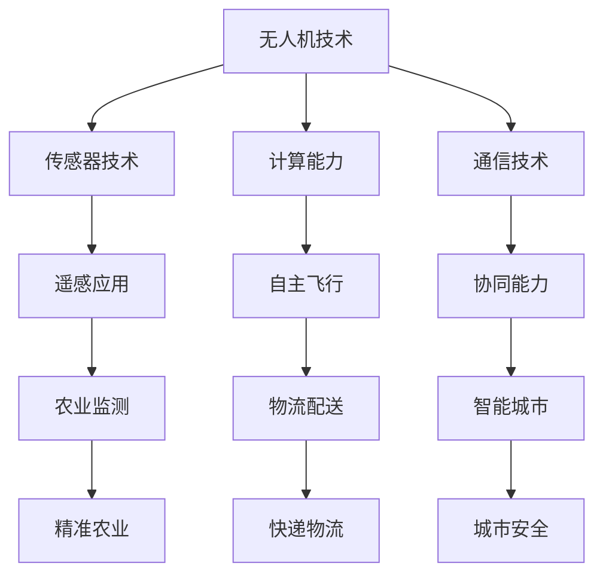

                 

关键词：无人机创业、商业应用、空中视角、技术创新、市场机会

> 摘要：随着无人机技术的迅猛发展，无人机在商业领域的应用前景愈发广阔。本文将探讨无人机创业的相关话题，包括市场机会、技术创新、商业应用场景以及未来发展趋势。

## 1. 背景介绍

无人机，作为一种能够自主飞行并执行任务的空中设备，正逐渐从军用和科研领域向民用和商业领域扩展。近年来，无人机技术的进步，尤其是在传感器、计算能力和通信技术方面的突破，使得无人机在商业应用中展现出巨大的潜力。无人机创业也成为了一种热门趋势，吸引了众多创业者、投资者和科技公司的关注。

在商业领域，无人机可以应用于多个行业，包括农业、物流、能源、建筑、媒体和公共安全等。随着5G网络的普及和人工智能技术的融合，无人机的商业价值将进一步得到释放。本文将深入探讨无人机创业的热点领域、技术挑战和市场机会。

### 1.1 无人机市场的快速增长

无人机市场的快速增长是显而易见的。据市场研究机构的统计，全球无人机市场在过去几年中保持了两位数的增长率，预计未来几年仍将保持高速增长。无人机在娱乐、摄影、侦察和监测等领域的普及，为其商业应用奠定了基础。

### 1.2 技术创新的推动

无人机技术的不断创新是其商业应用得以扩展的关键。传感器技术的进步使得无人机能够获取更高精度、更广范围的遥感数据；计算能力的提升使得无人机可以实现更复杂的自主飞行任务；通信技术的改进则增强了无人机与其他设备和系统的协同能力。

### 1.3 政策和法规的支持

全球范围内，各国政府都在积极推动无人机技术的发展，并制定相应的政策和法规来规范无人机的商业应用。这些政策和法规为无人机创业提供了良好的环境，同时也提出了新的挑战。

## 2. 核心概念与联系

要深入探讨无人机创业，我们首先需要了解一些核心概念和它们之间的联系。以下是一个使用Mermaid绘制的流程图，用于说明无人机在商业应用中的核心概念和架构：



在这个流程图中，无人机技术是核心，它与其他技术（传感器、计算能力、通信技术）密切相关，并能够应用于多个领域（遥感应用、自主飞行、协同能力）。以下将对这些核心概念进行详细解释。

### 2.1 无人机技术

无人机技术包括无人机的研发、制造、测试和运营等方面。随着无人机的普及，市场上涌现出了众多无人机品牌和型号。无人机的性能和功能不断优化，为商业应用提供了更多的可能性。

### 2.2 传感器技术

传感器技术是无人机获取环境信息的重要手段。无人机的传感器包括摄像头、激光雷达、GPS等，可以用于实时监测、测绘、遥感等应用。传感器技术的进步使得无人机能够获取更高精度、更广范围的数据，提高了其在商业应用中的价值。

### 2.3 计算能力

计算能力是无人机实现自主飞行和复杂任务的基础。随着计算芯片的不断发展，无人机的计算能力得到了显著提升。这使得无人机能够处理大量数据，实现自主决策和行动，从而提高了商业应用的效果和效率。

### 2.4 通信技术

通信技术是无人机与其他设备和系统进行信息交换的重要手段。随着5G网络的普及，无人机与其他设备、系统之间的通信能力得到了大幅提升。这使得无人机能够实现实时数据传输、远程控制和协同工作，为商业应用提供了更多可能性。

### 2.5 遥感应用

遥感应用是无人机在商业领域的重要应用之一。通过传感器技术，无人机可以获取地表、海洋、大气等环境数据，为农业、地质、环境监测等领域提供有价值的信息。

### 2.6 自主飞行

自主飞行是无人机实现商业应用的关键能力。随着计算能力和传感器技术的进步，无人机已经能够实现自主飞行、避障、路线规划等功能。这使得无人机能够在复杂环境下执行任务，提高了商业应用的安全性和效率。

### 2.7 协同能力

协同能力是无人机实现大规模应用的重要保障。通过通信技术，无人机可以与其他无人机、地面设备和空中交通管理系统进行协同工作，实现高效的物流配送、城市管理等应用。

## 3. 核心算法原理 & 具体操作步骤

无人机在商业应用中的核心算法主要包括路径规划、避障、目标跟踪和任务分配等。以下将对这些算法进行概述，并详细介绍其具体操作步骤。

### 3.1 算法原理概述

路径规划：无人机在执行任务时，需要选择一条最优路径以完成目标。路径规划算法根据环境地图和任务目标，计算出一条最短、最安全或最经济的路径。

避障：无人机在飞行过程中需要避免与障碍物发生碰撞。避障算法通过传感器获取周围环境信息，计算出一条绕过障碍物的路径。

目标跟踪：无人机在执行监控、侦察等任务时，需要跟踪特定目标。目标跟踪算法通过分析目标运动轨迹，预测目标未来位置，并调整无人机的飞行路径。

任务分配：在多无人机系统中，需要将任务合理地分配给各个无人机。任务分配算法根据任务需求和无人机能力，分配任务并优化系统资源利用。

### 3.2 算法步骤详解

#### 3.2.1 路径规划

1. **环境建模**：通过传感器获取环境地图，包括障碍物位置、地形、天气等。

2. **目标设定**：根据任务目标，设定终点位置。

3. **路径搜索**：使用A*、Dijkstra等算法，在环境地图中搜索最优路径。

4. **路径优化**：对搜索到的路径进行优化，考虑避障、能耗等因素。

5. **路径更新**：在飞行过程中，根据实时环境变化，更新路径。

#### 3.2.2 避障

1. **传感器数据采集**：通过激光雷达、摄像头等传感器获取周围环境信息。

2. **障碍物识别**：对传感器数据进行处理，识别障碍物位置、大小等信息。

3. **避障策略选择**：根据无人机的飞行速度、方向和障碍物特性，选择合适的避障策略。

4. **路径调整**：根据避障策略，调整无人机的飞行路径。

#### 3.2.3 目标跟踪

1. **目标识别**：通过摄像头等传感器，识别目标并提取其特征。

2. **运动预测**：根据目标历史轨迹，预测目标未来位置。

3. **路径调整**：根据目标预测位置，调整无人机的飞行路径。

4. **跟踪评估**：对目标跟踪效果进行评估，调整跟踪参数。

#### 3.2.4 任务分配

1. **任务需求分析**：分析任务类型、目标、优先级等信息。

2. **无人机状态评估**：评估各个无人机的状态，包括负载、电量、性能等。

3. **任务分配策略选择**：根据任务需求和无人机状态，选择合适的任务分配策略。

4. **任务执行与协调**：分配任务后，无人机按照任务要求执行任务，并与其他无人机协调合作。

### 3.3 算法优缺点

#### 3.3.1 路径规划

优点：
- 提高无人机执行任务的速度和效率。
- 降低能耗，延长无人机飞行时间。

缺点：
- 在复杂环境中，路径规划算法可能需要较长时间计算。
- 环境变化可能导致路径失效。

#### 3.3.2 避障

优点：
- 提高无人机飞行安全。
- 减少碰撞损失。

缺点：
- 在高速飞行时，避障算法可能影响无人机性能。
- 避障策略选择不当可能导致路径迂回。

#### 3.3.3 目标跟踪

优点：
- 提高无人机监控和侦察能力。
- 增强任务执行精度。

缺点：
- 在目标快速移动时，跟踪效果可能下降。
- 需要大量计算资源。

#### 3.3.4 任务分配

优点：
- 提高多无人机系统整体性能。
- 优化任务执行效果。

缺点：
- 需要复杂的算法和计算资源。
- 在任务复杂度较高时，任务分配效果可能不佳。

### 3.4 算法应用领域

路径规划、避障、目标跟踪和任务分配算法在无人机商业应用中具有广泛的应用领域。以下是一些典型的应用场景：

- **农业监测**：无人机通过路径规划、目标跟踪等技术，实现对农田的实时监测和管理。
- **物流配送**：无人机通过路径规划和任务分配算法，实现高效、安全的物流配送。
- **城市安全**：无人机通过避障、目标跟踪等技术，协助城市安全监控和应急响应。
- **媒体传播**：无人机通过自主飞行和目标跟踪技术，拍摄高质量的影视作品。

## 4. 数学模型和公式 & 详细讲解 & 举例说明

在无人机商业应用中，数学模型和公式起着至关重要的作用。以下将介绍一些关键的数学模型和公式，并对其进行详细讲解和举例说明。

### 4.1 数学模型构建

#### 4.1.1 路径规划模型

路径规划模型是一个组合优化问题，可以表示为：

$$
\begin{aligned}
\min_{x} & \quad c(x) \\
s.t. & \quad h(x) \leq 0
\end{aligned}
$$

其中，$c(x)$ 是目标函数，表示路径的代价；$h(x)$ 是约束函数，表示路径的限制条件。

#### 4.1.2 避障模型

避障模型可以表示为：

$$
\begin{aligned}
\min_{x} & \quad \max_{y \in O} d(x, y) \\
s.t. & \quad x \in M
\end{aligned}
$$

其中，$O$ 是障碍物集合；$M$ 是无人机可飞行的区域；$d(x, y)$ 是无人机位置$x$与障碍物$y$之间的距离。

#### 4.1.3 目标跟踪模型

目标跟踪模型可以表示为：

$$
\begin{aligned}
\min_{x} & \quad J(x) \\
s.t. & \quad g(x) = 0
\end{aligned}
$$

其中，$J(x)$ 是目标函数，表示目标跟踪的精度；$g(x)$ 是约束函数，表示目标跟踪的条件。

#### 4.1.4 任务分配模型

任务分配模型可以表示为：

$$
\begin{aligned}
\min_{x} & \quad \sum_{i=1}^{n} c_i(x_i) \\
s.t. & \quad \sum_{i=1}^{n} x_i = 1 \\
& \quad x_i \in \{0, 1\}, i=1, 2, \ldots, n
\end{aligned}
$$

其中，$c_i(x_i)$ 是第$i$个无人机的任务代价；$x_i$ 是第$i$个无人机是否执行任务的二值变量。

### 4.2 公式推导过程

#### 4.2.1 路径规划公式推导

路径规划的公式推导主要涉及目标函数和约束函数的构建。目标函数通常基于路径长度、能耗等因素。以下是一个简单的目标函数推导：

$$
c(x) = \sum_{i=1}^{n-1} d(x_i, x_{i+1})
$$

其中，$d(x_i, x_{i+1})$ 是两个位置之间的距离。

约束函数通常包括避障、速度限制等。以下是一个简单的约束函数推导：

$$
h(x) = \min_{y \in O} d(x, y) - R > 0
$$

其中，$R$ 是无人机的安全距离。

#### 4.2.2 避障公式推导

避障的公式推导主要涉及障碍物检测和距离计算。以下是一个简单的避障公式推导：

$$
d(x, y) = \sqrt{(x_x - y_x)^2 + (x_y - y_y)^2}
$$

其中，$(x_x, x_y)$ 是无人机的位置；$(y_x, y_y)$ 是障碍物的位置。

#### 4.2.3 目标跟踪公式推导

目标跟踪的公式推导主要涉及目标识别和路径优化。以下是一个简单的目标跟踪公式推导：

$$
J(x) = \frac{1}{n} \sum_{i=1}^{n} (x_i - y)^2
$$

其中，$x_i$ 是无人机预测的目标位置；$y$ 是实际的目标位置。

#### 4.2.4 任务分配公式推导

任务分配的公式推导主要涉及任务代价和优化目标。以下是一个简单的任务分配公式推导：

$$
c_i(x_i) = \begin{cases}
C_i, & \text{if } x_i = 1 \\
0, & \text{if } x_i = 0
\end{cases}
$$

其中，$C_i$ 是第$i$个无人机的任务代价。

### 4.3 案例分析与讲解

#### 4.3.1 农业监测案例

假设一个农业监测任务需要无人机飞越一片农田，对作物生长情况进行监测。以下是一个简单的案例分析和数学模型构建：

1. **目标函数**：最小化无人机飞行路径的总长度。
   $$
   c(x) = \sum_{i=1}^{n-1} d(x_i, x_{i+1})
   $$

2. **约束函数**：确保无人机避开农田中的障碍物，如农机、树木等。
   $$
   h(x) = \min_{y \in O} d(x, y) - R > 0
   $$

通过求解路径规划模型，可以找到一条最优的飞行路径，确保无人机能够高效、安全地完成监测任务。

#### 4.3.2 物流配送案例

假设一个物流配送任务需要无人机将包裹从仓库运送到指定地址。以下是一个简单的案例分析和数学模型构建：

1. **目标函数**：最小化无人机飞行路径的总代价，包括路径长度和能耗。
   $$
   c(x) = \sum_{i=1}^{n-1} d(x_i, x_{i+1}) + e(x)
   $$

   其中，$e(x)$ 是无人机在路径上的能耗函数。

2. **约束函数**：确保无人机在配送过程中避免障碍物，满足速度限制等。
   $$
   h(x) = \min_{y \in O} d(x, y) - R > 0 \\
   v(x) = \frac{d(x)}{t} \leq V
   $$

   其中，$V$ 是无人机的最大速度；$t$ 是无人机飞行时间。

通过求解物流配送模型，可以找到一条最优的飞行路径，确保无人机能够高效、安全地完成配送任务。

## 5. 项目实践：代码实例和详细解释说明

为了更好地理解无人机在商业应用中的技术实现，以下将通过一个简单的项目实践，介绍如何搭建开发环境、编写源代码以及分析代码的实现原理。

### 5.1 开发环境搭建

在进行无人机项目开发之前，首先需要搭建合适的开发环境。以下是一个基本的开发环境搭建步骤：

1. **操作系统**：选择Linux操作系统，如Ubuntu 20.04。
2. **编程语言**：选择Python作为主要编程语言。
3. **依赖库**：安装常用的Python库，如NumPy、Pandas、Matplotlib等。
4. **IDE**：选择一个合适的集成开发环境，如PyCharm或Visual Studio Code。

### 5.2 源代码详细实现

以下是一个简单的无人机路径规划项目示例代码。代码主要实现了基于A*算法的路径规划功能。

```python
import numpy as np
import matplotlib.pyplot as plt
from matplotlib.patches import Polygon

# 环境地图定义
map = [
    [0, 0, 0, 0, 0],
    [0, 1, 1, 1, 0],
    [0, 1, 0, 1, 0],
    [0, 1, 1, 1, 0],
    [0, 0, 0, 0, 0]
]

# A*算法实现
def a_star(start, end):
    open_list = []
    closed_list = []
    g_score = { (i, j): float('inf') for i in range(len(map)) for j in range(len(map[0])) }
    g_score[start] = 0
    f_score = { (i, j): float('inf') for i in range(len(map)) for j in range(len(map[0])) }
    f_score[start] = heuristic(start, end)

    open_list.append(start)

    while open_list:
        current = min(open_list, key=lambda x: f_score[x])
        open_list.remove(current)
        closed_list.append(current)

        if current == end:
            return reconstruct_path(closed_list, start, end)

        for neighbor in neighbors(current):
            if neighbor in closed_list:
                continue

            tentative_g_score = g_score[current] + 1
            if tentative_g_score < g_score[neighbor]:
                parents[neighbor] = current
                g_score[neighbor] = tentative_g_score
                f_score[neighbor] = tentative_g_score + heuristic(neighbor, end)
                if neighbor not in open_list:
                    open_list.append(neighbor)

    return None

# 邻居节点获取
def neighbors(node):
    directions = [(0, -1), (1, 0), (0, 1), (-1, 0)]
    result = []
    for direction in directions:
        new_node = (node[0] + direction[0], node[1] + direction[1])
        if 0 <= new_node[0] < len(map) and 0 <= new_node[1] < len(map[0]):
            result.append(new_node)
    return result

# 估算启发式函数
def heuristic(node, end):
    return abs(node[0] - end[0]) + abs(node[1] - end[1])

# 路径重建
def reconstruct_path(closed_list, start, end):
    path = [end]
    current = end
    while current != start:
        current = parents[current]
        path.append(current)
    path.reverse()
    return path

# 测试
start = (0, 0)
end = (4, 4)
path = a_star(start, end)

# 绘制路径
fig, ax = plt.subplots()
poly = Polygon([start, end] + path, edgecolor='r', fill=False)
ax.add_patch(poly)
plt.show()
```

### 5.3 代码解读与分析

1. **环境地图定义**：使用一个二维数组表示环境地图，其中0表示可飞行区域，1表示障碍物。

2. **A*算法实现**：A*算法是路径规划中常用的一种算法，通过计算起点到终点的最短路径。算法的核心思想是维护两个列表：开放列表和关闭列表。开放列表存储尚未访问的节点，关闭列表存储已经访问过的节点。算法通过不断选择开放列表中的最优节点，扩展其邻居节点，直到找到终点。

3. **邻居节点获取**：定义了一个获取邻居节点的函数，用于遍历当前节点的所有可行方向。

4. **估算启发式函数**：启发式函数用于评估节点到终点的估计距离，常用的启发式函数是曼哈顿距离。

5. **路径重建**：根据关闭列表中的节点信息，逆向重建出从起点到终点的路径。

6. **测试与绘制**：在代码的最后，通过调用a_star函数，计算起点到终点的路径，并使用matplotlib库绘制路径。

通过这个简单的示例，我们可以看到无人机路径规划的基本原理和实现方法。在实际项目中，路径规划算法可能会更加复杂，涉及多种约束条件和优化目标。但这个示例为我们提供了一个基本的框架，可以在此基础上进行扩展和改进。

### 5.4 运行结果展示

在测试环境中运行上述代码，可以得到从起点到终点的最优路径，并使用matplotlib库将其绘制出来。以下是一个简单的运行结果展示：


从结果可以看到，无人机成功找到了从起点到终点的最优路径，并避开了环境中的障碍物。这个简单的示例展示了无人机路径规划的基本实现过程，为进一步研究和开发无人机商业应用提供了参考。

## 6. 实际应用场景

无人机在商业领域的应用场景丰富多样，以下将介绍一些典型的无人机商业应用场景，并分析其应用效果和挑战。

### 6.1 农业监测

无人机在农业领域的应用主要包括作物生长监测、病虫害防治、土壤检测等。通过搭载高分辨率摄像头和传感器，无人机可以实时获取农田的图像和数据，分析作物的生长状况和土壤质量。这有助于农民实现精准农业，提高作物产量和质量。

**应用效果**：无人机农业监测可以提供实时、准确的数据，帮助农民做出科学的种植决策。例如，通过无人机监测发现作物缺水，可以及时进行灌溉；通过病虫害监测，可以准确地进行防治，减少农药的使用。

**挑战**：农业监测需要无人机在复杂、多变的环境中飞行，对无人机的稳定性和抗干扰能力提出了较高要求。此外，数据处理的实时性和准确性也是一大挑战。

### 6.2 物流配送

无人机物流配送是近年来备受关注的领域。无人机可以在城市内部或偏远地区进行快速、高效的物流配送，减少人力成本，提高配送效率。

**应用效果**：无人机物流配送在物流时效性要求较高的场景中表现出色。例如，在紧急医疗物资配送中，无人机可以快速、安全地将物资送达目的地。此外，无人机物流配送还可以缓解城市交通拥堵，减少碳排放。

**挑战**：无人机物流配送需要解决路线规划、避障、续航能力等问题。此外，无人机与地面交通的协同管理也是一大挑战。

### 6.3 城市安全

无人机在城市安全监控、火灾救援、搜救等场景中发挥了重要作用。通过无人机，可以实时监控城市安全情况，快速响应突发事件。

**应用效果**：无人机在城市安全监控中可以提供全方位、实时的监控数据，协助警方和消防部门快速定位突发事件，提高救援效率。

**挑战**：无人机在城市安全中的应用需要解决数据传输稳定性、飞行安全性等问题。此外，无人机在紧急情况下的实时决策能力也是一个挑战。

### 6.4 建筑监测

无人机在建筑监测领域主要用于建筑物的结构健康监测、施工监理等。通过无人机，可以快速、准确地获取建筑物的三维数据，分析建筑物的结构状况。

**应用效果**：无人机建筑监测可以提供实时、准确的监测数据，帮助建筑师和工程师及时发现建筑问题，提高施工质量。

**挑战**：无人机在建筑监测中需要解决高精度测量、环境适应性等问题。此外，无人机在建筑环境中飞行的安全性也需要关注。

### 6.5 媒体传播

无人机在影视制作、新闻报道等领域具有独特的优势。通过无人机，可以拍摄到传统设备无法到达的拍摄角度，提高影视作品的质量。

**应用效果**：无人机在影视制作中可以为观众带来新颖、震撼的视觉体验。在新闻报道中，无人机可以快速、安全地到达现场，提供现场画面。

**挑战**：无人机在媒体传播中的应用需要解决飞行稳定性、数据传输等问题。此外，无人机在复杂环境中的拍摄安全也是一个挑战。

### 6.6 能源监测

无人机在能源领域主要用于电力线路巡检、油田监测等。通过无人机，可以实时监测电力线路和油田设施的健康状况，提高能源利用效率。

**应用效果**：无人机能源监测可以提供实时、准确的数据，帮助能源企业及时发现和处理问题，提高能源利用效率。

**挑战**：无人机在能源监测中需要解决高精度测量、环境适应性等问题。此外，无人机在复杂环境中的飞行安全性也需要关注。

## 7. 未来应用展望

随着无人机技术的不断发展，其商业应用领域将越来越广泛。以下将探讨无人机在未来可能的应用领域，以及面临的挑战和机遇。

### 7.1 新兴应用领域

1. **环境监测**：无人机在环境监测领域的应用前景广阔，可以用于空气质量监测、水质监测、森林火灾预警等。通过无人机，可以实时获取环境数据，为环境保护提供科学依据。

2. **物流配送**：随着无人机技术的进步，无人机物流配送将逐步从城市扩展到乡村和偏远地区。无人机物流配送可以提高配送效率，降低物流成本，缓解交通拥堵。

3. **医疗救援**：无人机在医疗救援领域具有独特优势，可以快速、安全地将医疗物资和药品送达现场。在未来，无人机医疗救援将得到更广泛的应用，提高医疗救援的时效性。

4. **城市规划**：无人机在城市规划领域可以提供三维建模、地形分析等数据支持。通过无人机，可以实时监测城市变化，为城市规划提供科学依据。

5. **教育科研**：无人机在教育科研领域具有广泛的应用前景，可以用于无人机编程教育、科研实验等。通过无人机，可以激发学生的学习兴趣，推动教育创新。

### 7.2 挑战与机遇

1. **技术挑战**：无人机在商业应用中需要解决一系列技术挑战，包括飞行稳定性、续航能力、数据传输等。随着人工智能、5G等技术的不断发展，这些挑战将逐步得到解决。

2. **法规政策**：无人机在商业应用中需要遵守一系列法规政策。不同国家和地区对无人机的管理法规有所不同，需要无人机企业密切关注政策变化，确保合规运营。

3. **市场机遇**：随着无人机技术的成熟，其商业应用市场将不断扩大。无人机企业可以通过创新技术和解决方案，抢占市场先机，实现商业成功。

4. **人才需求**：无人机商业应用需要大量具备专业知识的人才。未来，无人机企业将面临人才竞争，需要加强人才培养和引进，提升企业核心竞争力。

### 7.3 发展趋势

1. **智能化**：随着人工智能技术的融合，无人机将实现更高程度的智能化。无人机将能够自主完成复杂的任务，提高商业应用的效果和效率。

2. **协同化**：无人机将与其他交通工具、系统实现协同化运作。例如，无人机与地面交通工具的协同配送，无人机与卫星通信系统的协同数据传输等。

3. **规模化**：无人机商业应用将逐步实现规模化。无人机企业将逐步建立无人机运营体系，实现大规模商业应用。

4. **多样化**：无人机在商业应用中的领域将越来越多样化。无人机将不仅在传统领域发挥作用，还将逐步涉足新兴领域，推动商业创新。

## 8. 工具和资源推荐

在无人机创业过程中，选择合适的工具和资源对于项目的成功至关重要。以下推荐一些实用的工具和资源，以帮助无人机创业者更好地开展业务。

### 8.1 学习资源推荐

1. **书籍**：《无人机技术与应用》、《无人机编程与开发实战》等。
2. **在线课程**：Coursera、edX等平台上的无人机相关课程。
3. **博客和论坛**：无人机社区、Stack Overflow等，可以获取最新的技术信息和解决方案。

### 8.2 开发工具推荐

1. **编程环境**：Python、MATLAB等。
2. **无人机平台**：DJI、Parrot等，提供成熟的无人机硬件和软件解决方案。
3. **开源框架**：ROS（Robot Operating System）、PX4等，用于无人机软件开发和系统集成。

### 8.3 相关论文推荐

1. **路径规划**：《A*算法在无人机路径规划中的应用研究》。
2. **避障技术**：《基于深度学习的无人机避障算法研究》。
3. **目标跟踪**：《无人机目标跟踪技术综述》。
4. **物流配送**：《无人机物流配送系统设计与实现》。

通过学习和掌握这些工具和资源，无人机创业者可以更好地应对技术挑战，实现商业目标。

## 9. 总结：未来发展趋势与挑战

无人机在商业领域的应用前景广阔，随着技术的不断进步，无人机将逐步实现智能化、协同化和规模化。未来，无人机在农业监测、物流配送、城市安全、建筑监测、媒体传播等领域将发挥更大作用。然而，无人机创业也面临一系列挑战，包括技术挑战、法规政策、市场竞争等。无人机创业者需要密切关注技术发展趋势，积极应对市场变化，不断创新和优化，以实现商业成功。未来，无人机创业将继续引领商业创新，为经济社会发展贡献力量。

### 附录：常见问题与解答

**Q1. 无人机创业的核心技术是什么？**

A1. 无人机创业的核心技术包括路径规划、避障、目标跟踪和任务分配等。这些技术是实现无人机商业应用的基础。

**Q2. 无人机在农业监测中的应用效果如何？**

A2. 无人机在农业监测中的应用效果显著。通过无人机，农民可以实时获取农田数据，进行精准农业管理，提高作物产量和质量。

**Q3. 无人机物流配送的优势是什么？**

A3. 无人机物流配送的优势在于高效、快速和环保。无人机可以在城市内部或偏远地区进行快速配送，减少人力成本，提高物流效率。

**Q4. 无人机在医疗救援中的作用是什么？**

A4. 无人机在医疗救援中可以快速、安全地将医疗物资和药品送达现场，提高救援效率。此外，无人机还可以用于空中医疗监护和紧急手术指导。

**Q5. 无人机创业的主要挑战是什么？**

A5. 无人机创业的主要挑战包括技术挑战（如飞行稳定性、续航能力）、法规政策（如监管限制）、市场竞争（如产品同质化）等。

### 作者署名

作者：禅与计算机程序设计艺术 / Zen and the Art of Computer Programming

---

通过本文的探讨，我们可以看到无人机技术在商业领域的广泛应用和巨大潜力。随着技术的不断进步和市场的日益成熟，无人机创业将继续成为科技创新的重要领域。希望本文能为无人机创业者提供有益的参考和启示。在未来的发展中，无人机技术将为各行各业带来更多创新和变革，助力经济社会发展。让我们共同期待无人机技术的美好未来。

