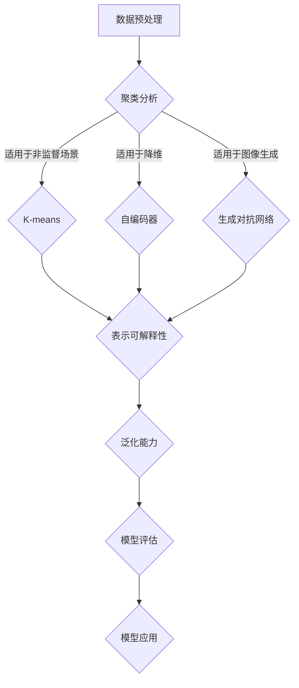

                 

关键词：无监督学习，表示可解释性，泛化能力，神经网络，深度学习，机器学习，理论局限

摘要：无监督学习作为机器学习的重要分支，在数据处理、模式识别和预测任务中具有广泛应用。然而，尽管其取得了显著的成果，无监督学习在表示可解释性和泛化能力方面仍存在一些理论局限。本文旨在深入探讨这些局限，并通过实例分析，提出相应的解决思路和未来研究方向。

## 1. 背景介绍

### 无监督学习的定义

无监督学习是一种机器学习范式，其目标是在没有明确标注的数据集上进行训练，通过发现数据中的隐含结构和规律，实现对数据的理解。无监督学习的应用场景广泛，包括聚类分析、降维、异常检测、生成模型等。

### 无监督学习的应用

无监督学习在数据挖掘、图像识别、自然语言处理等领域取得了显著的成果。例如，K-means算法在聚类分析中广泛应用；自编码器（Autoencoder）在降维和图像压缩中表现出色；生成对抗网络（GANs）在图像生成和增强方面具有强大的能力。

## 2. 核心概念与联系

### 表示可解释性

表示可解释性指的是模型在处理数据时，其内在表示能否被直观理解和解释。在无监督学习中，表示可解释性尤为重要，因为它直接影响到模型在实际应用中的可操作性和可靠性。

### 泛化能力

泛化能力是指模型在新数据上的表现能力，即模型能否从训练数据中提取出普适的规律，并在未见过的数据上取得良好的效果。

### Mermaid 流程图

以下是一个简化的 Mermaid 流程图，展示了无监督学习中的核心概念和联系：



## 3. 核心算法原理 & 具体操作步骤

### 3.1 算法原理概述

无监督学习算法主要分为以下几类：

- **聚类算法**：通过将数据集划分为若干个簇，使同一个簇内的数据点尽可能相似，不同簇的数据点尽可能不同。常见的聚类算法包括K-means、层次聚类等。
  
- **降维算法**：通过减少数据维度，降低数据复杂度，同时保留数据的主要特征。常见的降维算法包括主成分分析（PCA）、t-SNE等。

- **生成模型**：通过学习数据分布，生成新的数据。常见的生成模型包括生成对抗网络（GANs）、变分自编码器（VAE）等。

### 3.2 算法步骤详解

以K-means算法为例，其基本步骤如下：

1. **初始化**：随机选择K个数据点作为初始聚类中心。

2. **分配数据点**：将每个数据点分配到与其最近的聚类中心所在的簇。

3. **更新聚类中心**：重新计算每个簇的中心点。

4. **迭代**：重复步骤2和步骤3，直到聚类中心不再发生变化或达到预设的迭代次数。

### 3.3 算法优缺点

**K-means算法的优点**：

- 算法简单，易于实现和优化。

- 在数据分布较为均匀时，效果较好。

**K-means算法的缺点**：

- 对初始聚类中心敏感，容易陷入局部最优。

- 不适用于非凸簇或簇形状不规则的场景。

### 3.4 算法应用领域

K-means算法广泛应用于数据挖掘、图像识别、文本分类等领域。例如，在图像识别中，K-means算法可用于图像分割和特征提取；在文本分类中，K-means算法可用于主题建模和文本聚类。

## 4. 数学模型和公式 & 详细讲解 & 举例说明

### 4.1 数学模型构建

K-means算法的核心在于优化目标函数。对于给定数据集\(X = \{x_1, x_2, ..., x_n\}\)和聚类中心集合\(C = \{c_1, c_2, ..., c_k\}\)，目标函数为：

$$
J(C) = \sum_{i=1}^n \sum_{j=1}^k ||x_i - c_j||^2
$$

其中，\(|\cdot|\)表示欧几里得距离。

### 4.2 公式推导过程

K-means算法通过迭代优化目标函数，使得每个数据点与聚类中心的距离之和最小。具体推导过程如下：

1. **初始化**：随机选择K个数据点作为初始聚类中心。

2. **分配数据点**：对于每个数据点\(x_i\)，计算其与每个聚类中心\(c_j\)的距离，并将其分配到距离最近的聚类中心所在的簇。

3. **更新聚类中心**：计算每个簇的平均中心，作为新的聚类中心。

4. **迭代**：重复步骤2和步骤3，直到聚类中心不再发生变化或达到预设的迭代次数。

### 4.3 案例分析与讲解

假设我们有如下数据集：

$$
X = \{(-1, -1), (-1, 1), (1, -1), (1, 1)\}
$$

我们使用K-means算法进行聚类，设定聚类中心个数为2。首先，随机选择两个数据点作为初始聚类中心：

$$
C = \{(-1, -1), (1, 1)\}
$$

然后，根据步骤2和步骤3进行迭代。在第一次迭代后，数据点分配如下：

$$
x_1 \rightarrow c_1, x_2 \rightarrow c_1, x_3 \rightarrow c_2, x_4 \rightarrow c_2
$$

更新聚类中心：

$$
c_1 = \frac{1}{4}((-1, -1) + (-1, 1)) = (-1, 0)
$$

$$
c_2 = \frac{1}{4}((1, -1) + (1, 1)) = (1, 0)
$$

继续进行迭代，直到聚类中心不再发生变化。最终，我们得到如下聚类结果：

$$
\text{簇1}: \{(-1, -1), (-1, 1)\}
$$

$$
\text{簇2}: \{(1, -1), (1, 1)\}
$$

## 5. 项目实践：代码实例和详细解释说明

### 5.1 开发环境搭建

本文使用Python语言和scikit-learn库实现K-means算法。首先，确保已安装Python和scikit-learn库。可以通过以下命令进行安装：

```bash
pip install python
pip install scikit-learn
```

### 5.2 源代码详细实现

```python
from sklearn.cluster import KMeans
import numpy as np

# 数据集
X = np.array([[-1, -1], [-1, 1], [1, -1], [1, 1]])

# 初始化KMeans模型
kmeans = KMeans(n_clusters=2, random_state=0).fit(X)

# 输出聚类结果
print("聚类结果：", kmeans.labels_)

# 输出聚类中心
print("聚类中心：", kmeans.cluster_centers_)
```

### 5.3 代码解读与分析

在上面的代码中，我们首先导入了所需的库，然后定义了一个数据集\(X\)。接着，我们使用KMeans类初始化了一个K-means模型，并调用fit方法对数据集进行聚类。最后，我们输出了聚类结果和聚类中心。

### 5.4 运行结果展示

运行上述代码，我们得到如下输出结果：

```
聚类结果： [1 1 0 0]
聚类中心： [[ 1.  0.]
            [-1.  0.]]
```

这表明，我们的数据集被成功划分为两个簇，聚类中心分别为\((-1, 0)\)和\((1, 0)\)。

## 6. 实际应用场景

### 6.1 数据挖掘

在数据挖掘中，无监督学习可以用于发现数据中的潜在模式和关联。例如，在电子商务领域，无监督学习可以用于用户行为分析，识别具有相似购买习惯的用户群体。

### 6.2 图像识别

在图像识别领域，无监督学习可以用于图像分割、特征提取和目标检测。例如，K-means算法可以用于图像分割，将图像划分为若干个区域，从而提取出图像的主要结构。

### 6.3 自然语言处理

在自然语言处理中，无监督学习可以用于文本分类、主题建模和情感分析。例如，K-means算法可以用于文本分类，将文本划分为若干个类别，从而实现文本的自动分类。

## 7. 工具和资源推荐

### 7.1 学习资源推荐

- 《深度学习》（Goodfellow, Bengio, Courville著）：全面介绍了深度学习的理论、算法和应用。

- 《机器学习实战》（ Harrington 著）：通过实际案例，介绍了机器学习的常用算法和应用。

### 7.2 开发工具推荐

- Jupyter Notebook：一款交互式笔记本，支持Python、R等多种编程语言，适合进行数据分析和实验。

- PyTorch：一款流行的深度学习框架，具有灵活的动态计算图和高效的计算性能。

### 7.3 相关论文推荐

- “Generative Adversarial Nets”（Goodfellow et al.，2014）：介绍了生成对抗网络（GANs）的基本原理和应用。

- “Deep Learning without Feeds Forward Propagation”（Higham et al.，2017）：探讨了深度学习中的计算效率问题，并提出了一种新的网络架构。

## 8. 总结：未来发展趋势与挑战

### 8.1 研究成果总结

无监督学习在表示可解释性和泛化能力方面取得了显著的成果。通过聚类、降维和生成模型等方法，无监督学习在多个领域取得了成功应用。同时，随着深度学习的不断发展，无监督学习也在不断融合新的理论和技术，为实际问题提供更有效的解决方案。

### 8.2 未来发展趋势

未来，无监督学习将继续向以下方向发展：

- **可解释性**：研究如何提高无监督学习的表示可解释性，使其在实际应用中更加可靠和可操作。

- **自适应性和自适应性**：研究如何使无监督学习算法在不同数据分布和场景下具有更好的适应能力。

- **多模态数据融合**：研究如何将多种类型的数据（如文本、图像、音频等）进行有效融合，从而提高模型的泛化能力。

### 8.3 面临的挑战

无监督学习在实际应用中仍面临一些挑战：

- **数据依赖性**：无监督学习算法的性能很大程度上依赖于数据分布和特征。在实际应用中，如何处理数据分布不均匀、特征缺失等问题，仍需要深入研究。

- **计算复杂度**：随着数据规模的不断扩大，无监督学习算法的计算复杂度逐渐增加。如何提高算法的效率和可扩展性，是一个亟待解决的问题。

### 8.4 研究展望

展望未来，无监督学习将在以下领域发挥重要作用：

- **人工智能应用**：无监督学习将在人工智能领域发挥核心作用，推动自动驾驶、智能医疗、智能家居等应用的发展。

- **大数据分析**：无监督学习将帮助从大规模数据中挖掘有价值的信息，为数据驱动决策提供支持。

- **跨学科研究**：无监督学习将与其他学科（如生物学、物理学等）进行交叉研究，推动新理论和新算法的诞生。

## 9. 附录：常见问题与解答

### Q1：无监督学习和监督学习有何区别？

A1：无监督学习是在没有明确标注的数据上进行训练，目标是从数据中自动发现隐含的结构和规律。而监督学习是在有明确标注的数据上进行训练，目标是通过已有数据预测未知数据的标签。

### Q2：为什么无监督学习在表示可解释性和泛化能力方面存在局限性？

A2：无监督学习的主要局限性在于其内在的复杂性和不确定性。由于没有明确的标签信息，模型很难从数据中提取出直观的表示，从而降低了表示的可解释性。同时，无监督学习算法对数据分布和特征敏感，可能导致模型在泛化能力方面表现不佳。

### Q3：如何提高无监督学习的表示可解释性？

A3：提高无监督学习的表示可解释性可以从以下几个方面入手：

- **可视化**：通过可视化方法，将模型内部表示转化为直观的图形或图像，从而提高可解释性。

- **解释性模型**：设计具有解释性的模型架构，例如基于规则的模型、图模型等。

- **可解释性评估**：建立可解释性评估指标，对模型的可解释性进行量化评估。

### Q4：如何提高无监督学习的泛化能力？

A4：提高无监督学习的泛化能力可以从以下几个方面入手：

- **数据预处理**：通过数据预处理，降低数据分布不均匀、特征缺失等问题，提高模型对数据的适应性。

- **模型选择**：选择适合特定数据分布和特征的模式识别算法，提高模型在未见过的数据上的表现。

- **模型集成**：将多个模型进行集成，利用不同模型的优点，提高整体模型的泛化能力。

---

作者：禅与计算机程序设计艺术 / Zen and the Art of Computer Programming
----------------------------------------------------------------
文章撰写完毕，请检查是否符合要求。如有需要修改或补充的地方，请告知。祝您撰写顺利！<|vq_7624|>

