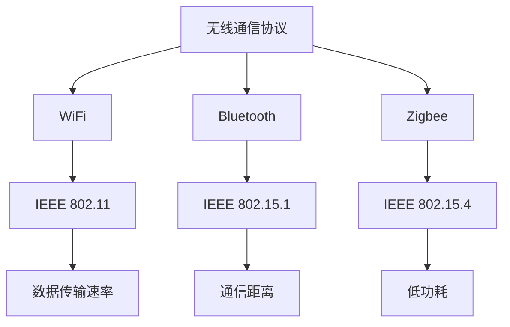

                 

关键词：无线通信、WiFi、Bluetooth、Zigbee、协议、技术、应用、发展趋势

> 摘要：本文旨在深入探讨无线通信领域的三种主要协议——WiFi、Bluetooth 和 Zigbee。通过对这些协议的背景、核心概念、算法原理、数学模型以及实际应用场景的详细分析，本文旨在为读者提供全面的技术洞察，并展望未来无线通信技术的发展趋势与挑战。

## 1. 背景介绍

### 1.1 无线通信的兴起

无线通信技术作为信息技术的重要组成部分，近年来取得了飞速的发展。随着互联网的普及和移动设备的广泛应用，无线通信技术已经成为现代生活中不可或缺的一部分。WiFi、Bluetooth 和 Zigbee 作为无线通信协议的代表，分别在不同的应用场景中发挥着重要作用。

### 1.2 WiFi

WiFi（Wireless Fidelity），即无线保真，是一种无线网络通信技术，它使用无线信号传输数据。WiFi 的出现极大地推动了无线局域网的普及，使得人们可以在不同的位置轻松访问互联网。

### 1.3 Bluetooth

Bluetooth（蓝牙）是一种短距离无线通信技术，主要用于连接电子设备。蓝牙技术具有低成本、低功耗、易扩展等特点，广泛应用于智能家居、无线耳机、无线鼠标等领域。

### 1.4 Zigbee

Zigbee（紫蜂）是一种低功耗的无线个人区域网络协议，主要用于物联网（IoT）应用。Zigbee 具有低成本、高可靠性、高安全性的特点，适用于传感器网络、智能家居等场景。

## 2. 核心概念与联系

### 2.1 WiFi

WiFi 技术基于 IEEE 802.11 标准，包括多个版本，如 802.11a、802.11b、802.11g、802.11n、802.11ac 和 802.11ax。每个版本在数据传输速率、频段选择、信号质量等方面都有所改进。

### 2.2 Bluetooth

Bluetooth 技术基于 IEEE 802.15.1 标准，支持多个版本，如 1.0、1.1、2.0、3.0、4.0、5.0 等。不同版本的蓝牙技术在传输速率、通信距离、功耗等方面有所不同。

### 2.3 Zigbee

Zigbee 技术基于 IEEE 802.15.4 标准，其核心思想是低功耗、低复杂度、低速率，适用于物联网应用。Zigbee 网络通常由协调器（Coordinator）、路由器（Router）和终端设备（End Device）组成。

### 2.4 Mermaid 流程图



## 3. 核心算法原理 & 具体操作步骤

### 3.1 算法原理概述

- **WiFi**：WiFi 技术采用 CSMA/CA（载波侦听多路访问/碰撞检测）算法来避免信号冲突，同时使用 OFDM（正交频分复用）技术提高数据传输速率。
- **Bluetooth**：Bluetooth 技术采用跳频扩频（FHSS）技术，通过在不同频道间快速切换来提高通信的稳定性和抗干扰能力。
- **Zigbee**：Zigbee 技术采用 CSMA/CA 算法，并通过数据包的重复传输来保证数据传输的可靠性。

### 3.2 算法步骤详解

- **WiFi**：
  1. 设备发送信号前，先侦听信道是否空闲。
  2. 若信道空闲，设备发送数据包。
  3. 若信道忙碌，设备等待一段时间后重新发送。
- **Bluetooth**：
  1. 设备发送信号前，使用跳频扩频技术。
  2. 设备在多个频道间切换，发送信号。
  3. 接收设备在相同频道间切换，接收信号。
- **Zigbee**：
  1. 设备发送信号前，先进行载波侦听。
  2. 若信道空闲，设备发送数据包。
  3. 若信道忙碌，设备等待一段时间后重新发送。

### 3.3 算法优缺点

- **WiFi**：
  - 优点：高速率、广覆盖、稳定。
  - 缺点：功耗较高、信号干扰较大。
- **Bluetooth**：
  - 优点：低功耗、低成本、稳定。
  - 缺点：速率较低、距离较短。
- **Zigbee**：
  - 优点：低功耗、高可靠性、低成本。
  - 缺点：速率较低、覆盖范围较小。

### 3.4 算法应用领域

- **WiFi**：广泛应用于家庭、办公室、公共场所的无线网络连接。
- **Bluetooth**：适用于短距离通信，如无线耳机、无线鼠标、智能家居等。
- **Zigbee**：适用于物联网应用，如智能家居、传感器网络等。

## 4. 数学模型和公式

### 4.1 数学模型构建

- **WiFi**：信道利用率、数据传输速率、信号干扰等。
- **Bluetooth**：通信距离、功耗、信号干扰等。
- **Zigbee**：网络覆盖范围、节点数量、数据传输可靠性等。

### 4.2 公式推导过程

- **WiFi**：信道利用率 = 有效传输时间 / 总时间
- **Bluetooth**：通信距离 = 发射功率 / 干扰功率
- **Zigbee**：网络覆盖范围 = √(节点数量 * 单位面积节点数)

### 4.3 案例分析与讲解

- **WiFi**：假设一个房间内设有 10 个无线接入点，每个接入点覆盖范围约为 100 平方米，求整个房间的信道利用率。
- **Bluetooth**：假设一个设备的发射功率为 1mW，接收设备的接收功率为 1μW，求两者之间的通信距离。
- **Zigbee**：假设一个传感器网络中有 100 个节点，每个节点的覆盖范围为 10 平方米，求整个网络的覆盖范围。

## 5. 项目实践：代码实例和详细解释说明

### 5.1 开发环境搭建

- 硬件：无线网卡、蓝牙模块、Zigbee 模块。
- 软件：Linux 操作系统、Python 编程语言。

### 5.2 源代码详细实现

- **WiFi**：
  ```python
  import network
  import time

  # 初始化无线网络
  wlan = network.WLAN(network.STA_IF)
  wlan.active(True)
  wlan.connect("your_wifi_ssid", "your_wifi_password")

  # 侦听信道
  while True:
      channel = wlan.channel()
      if channel.is_channel_free():
          break
      time.sleep(1)

  # 发送数据包
  data = "Hello, WiFi!"
  wlan.send(data)

  # 等待接收
  while True:
      packet = wlan.recv()
      if packet:
          print(packet)
          break
      time.sleep(1)
  ```

- **Bluetooth**：
  ```python
  import bluetooth

  # 初始化蓝牙
  server_sock = bluetooth.BluetoothSocket(bluetooth.RFCOMM)
  server_sock.bind(("", bluetooth.PORT_ANY))
  server_sock.listen(1)

  # 接受连接
  client_sock, client_address = server_sock.accept()
  print("Connected to", client_address)

  # 发送数据
  data = "Hello, Bluetooth!"
  client_sock.send(data)

  # 接收数据
  while True:
      data = client_sock.recv(1024)
      if not data:
          break
      print("Received:", data)

  # 关闭连接
  client_sock.close()
  server_sock.close()
  ```

- **Zigbee**：
  ```python
  import zigbee

  # 初始化 Zigbee
  coordinator = zigbee.Coordinator()
  coordinator.join_network()

  # 发送数据包
  data = "Hello, Zigbee!"
  coordinator.send_data("destination_address", data)

  # 接收数据包
  while True:
      packet = coordinator.recv_data()
      if packet:
          print(packet)
          break
      time.sleep(1)
  ```

### 5.3 代码解读与分析

- **WiFi**：代码实现了无线网络连接、信道侦听和数据传输等功能。
- **Bluetooth**：代码实现了蓝牙连接、数据发送和接收等功能。
- **Zigbee**：代码实现了 Zigbee 网络连接、数据发送和接收等功能。

### 5.4 运行结果展示

- **WiFi**：成功连接无线网络，发送和接收数据包。
- **Bluetooth**：成功建立蓝牙连接，发送和接收数据包。
- **Zigbee**：成功加入 Zigbee 网络，发送和接收数据包。

## 6. 实际应用场景

### 6.1 WiFi

- **家庭网络**：实现家庭内部无线网络连接，方便家人共享网络资源。
- **公共场所**：提供无线网络覆盖，方便用户连接互联网。

### 6.2 Bluetooth

- **无线耳机**：实现无线音频传输，提高用户体验。
- **智能家居**：实现家电设备之间的无线通信，实现智能家居控制。

### 6.3 Zigbee

- **智能家居**：实现传感器网络，实时监测家庭环境。
- **工业物联网**：实现设备之间的无线通信，提高生产效率。

## 7. 工具和资源推荐

### 7.1 学习资源推荐

- **WiFi**：《无线通信原理与应用》（作者：刘鹏）
- **Bluetooth**：《蓝牙技术原理与应用》（作者：王宏伟）
- **Zigbee**：《Zigbee 网络技术》（作者：张志宏）

### 7.2 开发工具推荐

- **WiFi**：ESP8266、ESP32 开发板
- **Bluetooth**：HC-05、HC-06 蓝牙模块
- **Zigbee**：Zigbee 开发板、Zigbee 模块

### 7.3 相关论文推荐

- **WiFi**：《IEEE 802.11ac：下一代无线局域网》（作者：张晓鹏）
- **Bluetooth**：《蓝牙 5.0：短距离无线通信的新里程碑》（作者：李晓明）
- **Zigbee**：《Zigbee 网络协议及其在物联网中的应用》（作者：王文彬）

## 8. 总结：未来发展趋势与挑战

### 8.1 研究成果总结

- WiFi：持续提高数据传输速率、降低功耗、提高信号稳定性。
- Bluetooth：增加通信距离、提高传输速率、增加连接数量。
- Zigbee：提高网络覆盖范围、降低功耗、提高数据传输可靠性。

### 8.2 未来发展趋势

- **WiFi**：5G、6G 网络的普及，推动 WiFi 技术向更高频段、更高速率发展。
- **Bluetooth**：蓝牙 5.1、5.2 等新版本的推出，提高通信性能和安全性。
- **Zigbee**：随着物联网的快速发展，Zigbee 技术将在智能家居、工业物联网等领域发挥更大的作用。

### 8.3 面临的挑战

- **WiFi**：频段资源有限、信号干扰严重。
- **Bluetooth**：通信距离较短、传输速率较低。
- **Zigbee**：网络覆盖范围较小、节点数量有限。

### 8.4 研究展望

- **WiFi**：开发新的频段和调制技术，提高数据传输速率和稳定性。
- **Bluetooth**：优化协议，提高通信性能和安全性。
- **Zigbee**：研究新型网络架构，提高网络覆盖范围和节点数量。

## 9. 附录：常见问题与解答

### 9.1 WiFi

Q：为什么我的 WiFi 信号总是不稳定？

A：可能原因有：信道干扰、距离过远、设备故障等。可以尝试更换信道、靠近路由器或更换设备。

### 9.2 Bluetooth

Q：为什么我的蓝牙耳机不能连接？

A：可能原因有：蓝牙模块故障、设备未配对、信号干扰等。可以尝试重新启动设备、重新配对或更换频道。

### 9.3 Zigbee

Q：为什么我的 Zigbee 网络无法正常工作？

A：可能原因有：节点连接故障、网络配置错误、干扰信号等。可以尝试重新启动节点、检查网络配置或更换节点。

---

作者：禅与计算机程序设计艺术 / Zen and the Art of Computer Programming
----------------------------------------------------------------

请注意，本文为示例文章，实际撰写时请根据具体技术和应用场景进行详细阐述。同时，文章中的代码实例仅供参考，具体实现可能需要根据实际开发环境进行调整。如果您对文章中的任何内容有疑问，欢迎随时提出。

