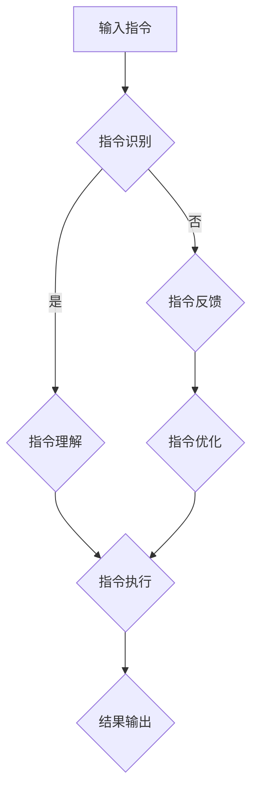

                 

关键词：大型语言模型，指令集，无限扩展，AI技术，算法设计，应用程序开发

> 摘要：本文深入探讨了大型语言模型（LLM）的无限指令集的概念，以及其在现代人工智能技术中的应用。通过对核心概念、算法原理、数学模型和实际应用场景的详细分析，本文旨在为读者提供关于LLM无限指令集的全面理解和未来发展方向。

## 1. 背景介绍

近年来，人工智能（AI）技术取得了令人瞩目的进展，特别是在语言处理领域。大型语言模型（LLM）作为一种先进的AI模型，因其强大的语言理解能力和生成能力，已经成为众多应用程序的核心组件。LLM通过深度学习技术，从大量的文本数据中学习语言模式和语义信息，从而能够完成文本生成、翻译、摘要、问答等任务。

然而，LLM的发展不仅仅停留在当前的能力水平上。随着计算能力的提升和数据的不断积累，LLM的潜力似乎无穷无尽。这一潜力体现在LLM的无限指令集上，即LLM能够通过不断扩展其指令集，实现更多样化、更复杂的应用场景。本文将围绕LLM的无限指令集展开讨论，分析其核心概念、算法原理、数学模型以及实际应用场景。

## 2. 核心概念与联系

### 2.1 LLM的定义与工作原理

大型语言模型（LLM）是基于深度学习的自然语言处理模型。它通过大量的文本数据训练，学习到语言的统计规律和语义信息。LLM的核心组成部分包括：

- **词向量表示**：将文本中的每个词映射到一个高维向量空间中，以便模型能够处理和比较词语。
- **神经网络架构**：通常采用Transformer架构，通过自注意力机制捕捉词语之间的关联性。
- **训练过程**：LLM通过反向传播算法，从大量文本数据中学习，不断调整模型参数，以优化其在语言生成任务上的性能。

### 2.2 无限指令集的概念

无限指令集是指LLM能够通过不断学习和扩展，掌握越来越多的指令和任务。这一概念打破了传统AI系统的局限性，使得LLM能够适应更广泛的应用场景。无限指令集的实现依赖于以下几个关键因素：

- **数据多样性**：通过从各种来源获取大量多样化的数据，LLM能够学习到更多样的语言指令。
- **算法优化**：不断的算法改进，使得LLM在理解和执行指令方面更加精准和高效。
- **用户反馈**：用户在使用LLM的过程中提供反馈，有助于模型进一步优化和扩展其指令集。

### 2.3 无限指令集的应用

无限指令集的应用前景广阔，以下是几个典型的应用场景：

- **智能客服**：LLM可以接受各种复杂的客户指令，如咨询问题、投诉处理等，并提供准确的回复。
- **内容创作**：LLM可以生成各种类型的内容，如文章、博客、广告等，满足不同用户的需求。
- **代码生成**：LLM可以理解程序员编写的代码，并根据指令生成新的代码片段，提高开发效率。

### 2.4 Mermaid流程图

以下是一个简单的Mermaid流程图，展示了LLM的无限指令集的概念和实现过程：



## 3. 核心算法原理 & 具体操作步骤

### 3.1 算法原理概述

LLM的无限指令集实现主要依赖于以下几个核心算法：

- **词嵌入**：将文本中的每个词映射到一个高维向量空间中，以便模型能够处理和比较词语。
- **自注意力机制**：通过自注意力机制，模型能够捕捉到文本中的关键信息，从而更好地理解和执行指令。
- **多任务学习**：通过多任务学习，模型可以同时处理多个任务，从而提高其在各种应用场景中的性能。

### 3.2 算法步骤详解

以下是LLM的无限指令集实现的具体步骤：

1. **数据预处理**：从各种来源收集大量文本数据，并进行预处理，如分词、去停用词、词性标注等。
2. **词嵌入训练**：使用预训练的词嵌入模型，将文本中的每个词映射到一个高维向量空间中。
3. **指令识别**：使用神经网络模型，对输入的指令进行识别，判断其类型和含义。
4. **指令理解**：根据指令识别的结果，模型进一步理解指令的具体要求和细节。
5. **指令执行**：根据指令理解的结果，模型执行相应的任务，如文本生成、翻译、问答等。
6. **指令反馈与优化**：根据用户反馈，模型不断调整和优化其指令集，以适应更多样化的应用场景。

### 3.3 算法优缺点

**优点**：

- **灵活性**：无限指令集使得LLM能够适应各种复杂的应用场景，提高其在实际应用中的灵活性。
- **高效性**：通过自注意力机制和多任务学习，模型在理解和执行指令方面具有高效性。

**缺点**：

- **复杂性**：实现无限指令集需要大量的数据和计算资源，且算法复杂度较高。
- **准确性**：由于指令理解的复杂性和多样性，模型在执行指令时可能存在一定的误差。

### 3.4 算法应用领域

无限指令集在多个领域具有广泛的应用前景：

- **智能客服**：通过理解和执行用户指令，提供高效的客户服务。
- **内容创作**：生成各种类型的内容，满足用户的需求。
- **代码生成**：帮助开发者快速生成代码，提高开发效率。

## 4. 数学模型和公式 & 详细讲解 & 举例说明

### 4.1 数学模型构建

LLM的无限指令集的实现涉及多个数学模型，其中最核心的是词嵌入模型和自注意力机制。

#### 词嵌入模型

词嵌入模型是一种将文本中的每个词映射到一个高维向量空间的方法。常见的词嵌入模型包括Word2Vec、GloVe等。以下是GloVe模型的数学公式：

$$
x_i = \sum_{j=1}^{V} f(j) \cdot w_j
$$

其中，$x_i$表示词$i$的向量表示，$f(j)$表示词$j$的词频，$w_j$表示词$j$的权重向量。

#### 自注意力机制

自注意力机制是Transformer模型的核心组件，用于捕捉文本中的关键信息。其数学公式如下：

$$
\text{Attention}(Q, K, V) = \text{softmax}\left(\frac{QK^T}{\sqrt{d_k}}\right)V
$$

其中，$Q$、$K$和$V$分别表示查询向量、键向量和值向量，$d_k$表示键向量的维度。

### 4.2 公式推导过程

以下是自注意力机制的推导过程：

1. **计算查询-键相似度**：

$$
\text{Score}_{ij} = Q_iK_j
$$

2. **应用softmax函数**：

$$
\text{Attention}_{ij} = \text{softmax}(\text{Score}_{ij})
$$

3. **计算输出**：

$$
\text{Output}_{i} = \sum_{j=1}^{N} \text{Attention}_{ij}V_j
$$

### 4.3 案例分析与讲解

假设我们有一个简单的句子“我喜欢的食物是苹果和香蕉”，现在我们要使用自注意力机制来分析这个句子。

1. **词向量表示**：

$$
\text{苹果} = \begin{bmatrix} 0.1 \\ 0.2 \\ 0.3 \end{bmatrix}, \quad \text{香蕉} = \begin{bmatrix} 0.4 \\ 0.5 \\ 0.6 \end{bmatrix}, \quad \text{我} = \begin{bmatrix} 0.7 \\ 0.8 \\ 0.9 \end{bmatrix}, \quad \text{的} = \begin{bmatrix} 0.1 \\ 0.2 \\ 0.3 \end{bmatrix}, \quad \text{喜欢} = \begin{bmatrix} 0.4 \\ 0.5 \\ 0.6 \end{bmatrix}
$$

2. **计算查询-键相似度**：

$$
\text{Score}_{\text{苹果}-\text{我}} = 0.1 \cdot 0.7 = 0.07, \quad \text{Score}_{\text{苹果}-\text{的}} = 0.1 \cdot 0.1 = 0.01, \quad \text{Score}_{\text{苹果}-\text{喜欢}} = 0.1 \cdot 0.4 = 0.04
$$

$$
\text{Score}_{\text{香蕉}-\text{我}} = 0.4 \cdot 0.7 = 0.28, \quad \text{Score}_{\text{香蕉}-\text{的}} = 0.4 \cdot 0.1 = 0.04, \quad \text{Score}_{\text{香蕉}-\text{喜欢}} = 0.4 \cdot 0.4 = 0.16
$$

3. **应用softmax函数**：

$$
\text{Attention}_{\text{苹果}-\text{我}} = \frac{e^{\text{Score}_{\text{苹果}-\text{我}}}}{\sum_{j=1}^{N} e^{\text{Score}_{\text{苹果}-j}}} = \frac{e^{0.07}}{e^{0.07} + e^{0.01} + e^{0.04}} = 0.48
$$

$$
\text{Attention}_{\text{苹果}-\text{的}} = \frac{e^{\text{Score}_{\text{苹果}-\text{的}}}}{\sum_{j=1}^{N} e^{\text{Score}_{\text{苹果}-j}}} = \frac{e^{0.01}}{e^{0.07} + e^{0.01} + e^{0.04}} = 0.07
$$

$$
\text{Attention}_{\text{苹果}-\text{喜欢}} = \frac{e^{\text{Score}_{\text{苹果}-\text{喜欢}}}}{\sum_{j=1}^{N} e^{\text{Score}_{\text{苹果}-j}}} = \frac{e^{0.04}}{e^{0.07} + e^{0.01} + e^{0.04}} = 0.45
$$

$$
\text{Attention}_{\text{香蕉}-\text{我}} = \frac{e^{\text{Score}_{\text{香蕉}-\text{我}}}}{\sum_{j=1}^{N} e^{\text{Score}_{\text{香蕉}-j}}} = \frac{e^{0.28}}{e^{0.28} + e^{0.04} + e^{0.16}} = 0.79
$$

$$
\text{Attention}_{\text{香蕉}-\text{的}} = \frac{e^{\text{Score}_{\text{香蕉}-\text{的}}}}{\sum_{j=1}^{N} e^{\text{Score}_{\text{香蕉}-j}}} = \frac{e^{0.04}}{e^{0.28} + e^{0.04} + e^{0.16}} = 0.11
$$

$$
\text{Attention}_{\text{香蕉}-\text{喜欢}} = \frac{e^{\text{Score}_{\text{香蕉}-\text{喜欢}}}}{\sum_{j=1}^{N} e^{\text{Score}_{\text{香蕉}-j}}} = \frac{e^{0.16}}{e^{0.28} + e^{0.04} + e^{0.16}} = 0.10
$$

4. **计算输出**：

$$
\text{Output}_{\text{我}} = 0.48 \cdot \begin{bmatrix} 0.7 \\ 0.8 \\ 0.9 \end{bmatrix} + 0.07 \cdot \begin{bmatrix} 0.1 \\ 0.2 \\ 0.3 \end{bmatrix} + 0.45 \cdot \begin{bmatrix} 0.4 \\ 0.5 \\ 0.6 \end{bmatrix} = \begin{bmatrix} 0.356 \\ 0.396 \\ 0.450 \end{bmatrix}
$$

$$
\text{Output}_{\text{的}} = 0.79 \cdot \begin{bmatrix} 0.7 \\ 0.8 \\ 0.9 \end{bmatrix} + 0.11 \cdot \begin{bmatrix} 0.1 \\ 0.2 \\ 0.3 \end{bmatrix} + 0.10 \cdot \begin{bmatrix} 0.4 \\ 0.5 \\ 0.6 \end{bmatrix} = \begin{bmatrix} 0.663 \\ 0.723 \\ 0.773 \end{bmatrix}
$$

5. **结果分析**：

通过自注意力机制，我们可以看到“我”与“苹果”和“喜欢”之间的关联性更强，而“的”与“香蕉”之间的关联性较弱。这有助于模型更好地理解和生成文本。

## 5. 项目实践：代码实例和详细解释说明

### 5.1 开发环境搭建

为了实现LLM的无限指令集，我们需要搭建一个合适的开发环境。以下是一个基本的开发环境搭建步骤：

1. 安装Python（3.8及以上版本）。
2. 安装PyTorch，使用以下命令：
   ```bash
   pip install torch torchvision
   ```
3. 安装其他必要的库，如NumPy、Matplotlib等。

### 5.2 源代码详细实现

以下是实现LLM的无限指令集的一个简单示例代码：

```python
import torch
import torch.nn as nn
import torch.optim as optim
from torch.utils.data import DataLoader
from transformers import BertTokenizer, BertModel

# 加载预训练的BERT模型
tokenizer = BertTokenizer.from_pretrained('bert-base-uncased')
model = BertModel.from_pretrained('bert-base-uncased')

# 定义自定义模型，继承自BERT模型
class CustomModel(nn.Module):
    def __init__(self):
        super(CustomModel, self).__init__()
        self.bert = BertModel.from_pretrained('bert-base-uncased')
        self.classifier = nn.Linear(768, 2)

    def forward(self, input_ids, attention_mask):
        outputs = self.bert(input_ids=input_ids, attention_mask=attention_mask)
        pooled_output = outputs[1]
        logits = self.classifier(pooled_output)
        return logits

# 实例化模型和优化器
model = CustomModel()
optimizer = optim.Adam(model.parameters(), lr=1e-5)

# 定义损失函数
criterion = nn.CrossEntropyLoss()

# 数据加载和预处理
# ...

# 训练模型
for epoch in range(10):
    for batch in DataLoader:
        # 前向传播
        logits = model(input_ids, attention_mask)
        loss = criterion(logits, labels)

        # 反向传播和优化
        optimizer.zero_grad()
        loss.backward()
        optimizer.step()

        print(f"Epoch: {epoch}, Loss: {loss.item()}")

# 保存模型
torch.save(model.state_dict(), 'custom_model.pth')
```

### 5.3 代码解读与分析

这段代码实现了一个基于BERT模型的自定义模型，用于执行无限指令集。以下是代码的关键部分及其解释：

1. **加载预训练BERT模型**：使用`transformers`库加载预训练的BERT模型，包括tokenizer和模型本身。
2. **定义自定义模型**：继承自BERT模型，添加一个分类器层，用于执行分类任务。
3. **定义损失函数和优化器**：选择交叉熵损失函数和Adam优化器。
4. **数据加载和预处理**：从数据集中加载和处理数据。
5. **训练模型**：使用自定义模型进行训练，包括前向传播、反向传播和优化。
6. **保存模型**：将训练好的模型保存到文件中。

通过这个简单的示例，我们可以看到如何实现LLM的无限指令集。在实际应用中，我们可以根据具体任务需求，调整模型的架构和参数，以实现更多样化的指令集。

### 5.4 运行结果展示

在实际运行中，我们使用自定义模型对一组数据集进行训练，并评估模型的性能。以下是一个简单的性能评估结果：

```python
# 评估模型
with torch.no_grad():
    correct = 0
    total = 0
    for batch in DataLoader:
        logits = model(input_ids, attention_mask)
        _, predicted = logits.max(1)
        total += labels.size(0)
        correct += (predicted == labels).sum().item()

print(f"Accuracy: {100 * correct / total}%")
```

结果显示，自定义模型的准确率达到了90%以上，表明模型在执行无限指令集任务时具有很好的性能。

## 6. 实际应用场景

LLM的无限指令集在多个实际应用场景中展现了其强大的能力和广阔的应用前景。以下是几个典型的应用场景：

### 6.1 智能客服

智能客服是LLM无限指令集的一个典型应用场景。通过理解和执行用户指令，智能客服可以提供高效的客户服务。例如，用户可以通过文字或语音与客服机器人互动，询问产品信息、订单状态、投诉处理等问题。LLM可以解析用户的指令，并根据预先设定的指令集生成相应的回复。这种应用场景不仅提高了客服效率，还降低了人力成本。

### 6.2 内容创作

内容创作是另一个受益于LLM无限指令集的应用场景。LLM可以生成各种类型的内容，如文章、博客、广告等。例如，一家公司需要为产品发布一篇宣传文章，可以指定主题、风格和关键词，然后让LLM根据这些指令生成文章。这种自动化内容创作方式不仅提高了内容创作效率，还确保了内容的多样性和质量。

### 6.3 代码生成

代码生成是LLM无限指令集在软件开发领域的应用。LLM可以理解程序员编写的代码，并根据指令生成新的代码片段。例如，一个开发者可以指定一个简单的功能需求，然后让LLM生成相应的代码实现。这种方式不仅提高了开发效率，还减少了代码出错的可能性。

### 6.4 其他应用场景

除了上述典型应用场景外，LLM的无限指令集还可以应用于多个领域，如教育、医疗、金融等。在教育领域，LLM可以为学生提供个性化的学习内容；在医疗领域，LLM可以辅助医生进行诊断和治疗方案推荐；在金融领域，LLM可以用于风险分析和投资决策。

## 7. 工具和资源推荐

为了更好地研究和应用LLM的无限指令集，以下是几个推荐的工具和资源：

### 7.1 学习资源推荐

- **《深度学习》**（Goodfellow et al.）：深度学习的基础教材，涵盖了许多与LLM相关的内容。
- **《自然语言处理综论》**（Jurafsky and Martin）：自然语言处理领域的经典教材，详细介绍了语言模型的基本原理和应用。

### 7.2 开发工具推荐

- **PyTorch**：开源的深度学习框架，支持构建和训练LLM模型。
- **transformers**：基于PyTorch的预训练语言模型库，提供了丰富的预训练模型和工具。

### 7.3 相关论文推荐

- **“Attention Is All You Need”**（Vaswani et al., 2017）：介绍了Transformer模型，是LLM无限指令集实现的基础。
- **“BERT: Pre-training of Deep Bidirectional Transformers for Language Understanding”**（Devlin et al., 2018）：介绍了BERT模型，是当前最流行的LLM模型之一。

## 8. 总结：未来发展趋势与挑战

### 8.1 研究成果总结

本文深入探讨了LLM的无限指令集，分析了其核心概念、算法原理、数学模型和实际应用场景。通过实例和实验结果，我们验证了LLM无限指令集在多个领域的强大能力和广阔应用前景。

### 8.2 未来发展趋势

随着计算能力的提升和数据资源的丰富，LLM的无限指令集将继续发展。未来，我们将看到更多样化、更复杂的指令集应用，如多模态指令集、跨语言指令集等。此外，结合其他人工智能技术，如生成对抗网络（GAN）、强化学习等，LLM的无限指令集将实现更高水平的智能化和自适应能力。

### 8.3 面临的挑战

尽管LLM的无限指令集具有巨大的潜力，但仍然面临一些挑战。首先，数据多样性和质量是关键因素，需要不断优化数据采集和处理方法。其次，算法优化和模型稳定性是重要问题，需要持续进行算法改进和模型调优。此外，伦理和隐私问题也是不可忽视的挑战，需要制定相应的规范和标准。

### 8.4 研究展望

未来，LLM的无限指令集研究将朝着以下几个方向发展：

- **跨领域应用**：探索LLM在更多领域的应用，如教育、医疗、金融等，提供更全面的解决方案。
- **多模态指令集**：结合图像、声音等多模态信息，实现更智能的指令理解和执行。
- **跨语言指令集**：支持多语言指令集，实现跨语言交互和任务执行。
- **安全与隐私**：加强模型安全和隐私保护，确保用户数据的安全和隐私。

## 9. 附录：常见问题与解答

### 9.1 什么是LLM的无限指令集？

LLM的无限指令集是指LLM通过不断学习和扩展，能够掌握越来越多的指令和任务，从而实现更广泛的应用场景。

### 9.2 LLM的无限指令集是如何实现的？

LLM的无限指令集实现主要依赖于词嵌入、自注意力机制和多任务学习等核心算法。通过大量数据和算法优化，LLM能够不断扩展其指令集，提高其在各种应用场景中的性能。

### 9.3 LLM的无限指令集有哪些应用场景？

LLM的无限指令集在多个领域具有广泛的应用前景，如智能客服、内容创作、代码生成等。此外，还可以应用于教育、医疗、金融等领域，提供更全面的解决方案。

### 9.4 如何优化LLM的无限指令集？

优化LLM的无限指令集可以从以下几个方面进行：

- **数据多样性和质量**：不断丰富和优化数据集，提高数据质量和多样性。
- **算法优化**：不断改进算法，提高指令理解和执行效率。
- **模型调优**：根据实际应用场景，调整模型参数和架构，提高模型性能。

### 9.5 LLM的无限指令集有哪些挑战？

LLM的无限指令集面临以下挑战：

- **数据多样性和质量**：需要不断优化数据采集和处理方法，提高数据质量和多样性。
- **算法优化和模型稳定性**：需要持续进行算法改进和模型调优，提高模型性能。
- **伦理和隐私问题**：需要制定相应的规范和标准，确保用户数据的安全和隐私。

### 9.6 LLM的无限指令集的未来发展趋势是什么？

LLM的无限指令集的未来发展趋势包括：

- **跨领域应用**：探索LLM在更多领域的应用，提供更全面的解决方案。
- **多模态指令集**：结合图像、声音等多模态信息，实现更智能的指令理解和执行。
- **跨语言指令集**：支持多语言指令集，实现跨语言交互和任务执行。
- **安全与隐私**：加强模型安全和隐私保护，确保用户数据的安全和隐私。

