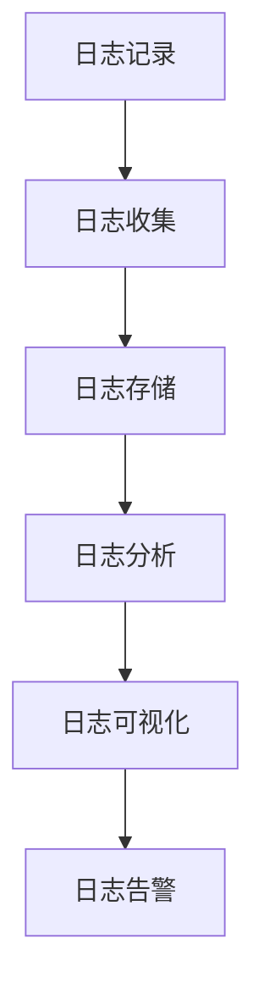

                 

日志管理和分析在IT领域中扮演着至关重要的角色。它们不仅是系统性能监控的基石，更是发现和解决问题的关键工具。无论是大型企业级系统，还是个人开发的小型应用，日志管理都是必不可少的环节。本文将深入探讨日志管理和分析的核心概念、算法原理、数学模型、实际应用、以及未来发展趋势。

## 文章关键词

- **日志管理**  
- **系统监控**  
- **数据分析**  
- **算法原理**  
- **数学模型**  
- **性能优化**  
- **故障排除**  
- **大数据**

## 文章摘要

本文旨在为读者提供一个全面的日志管理和分析指南。文章首先介绍了日志管理和分析在IT领域的背景和重要性，随后详细阐述了核心概念、算法原理、数学模型，并通过实际项目实例进行了详细解释。最后，文章讨论了日志管理和分析在实际应用场景中的重要性，并对未来发展趋势进行了展望。

## 1. 背景介绍

### 日志管理的重要性

在IT领域中，日志管理是一种重要的技术手段，用于记录系统运行过程中发生的各种事件和状态变化。这些日志数据不仅可以帮助系统管理员监控系统性能，还能够提供宝贵的故障诊断信息。以下是一些日志管理的重要性：

1. **性能监控**：通过分析系统日志，可以实时了解系统的运行状况，发现潜在的瓶颈和性能问题。
2. **故障排除**：当系统出现问题时，日志数据可以帮助定位问题根源，快速修复故障。
3. **安全性**：日志记录可以帮助检测和预防恶意攻击，提供安全事件的证据。
4. **合规性**：许多行业和组织都有日志记录的合规要求，日志管理是实现合规性的重要手段。

### 日志管理和分析的现状

随着信息技术的发展，日志管理和分析技术也在不断进步。目前，大多数企业和组织都采用了专业的日志管理工具，如ELK（Elasticsearch、Logstash、Kibana）堆栈、Splunk、Grok等。这些工具提供了强大的日志收集、存储、分析和可视化功能，使得日志管理和分析变得更加高效和智能化。

### 日志管理和分析的发展趋势

未来，日志管理和分析将朝着以下几个方向发展：

1. **智能化**：借助机器学习和人工智能技术，日志分析将更加智能化，能够自动识别和预测潜在问题。
2. **集成化**：日志管理工具将更加集成化，与其他IT系统和服务无缝对接，提供一站式解决方案。
3. **分布式**：随着云计算和容器技术的普及，日志管理将更加分布式，支持大规模分布式系统的日志收集和分析。
4. **开源化**：开源日志管理工具将继续发展，提供更多的自定义和扩展能力，降低使用成本。

## 2. 核心概念与联系

在深入探讨日志管理和分析之前，我们首先需要了解一些核心概念和它们之间的关系。

### 日志记录

日志记录是日志管理的起点。系统中的各种组件和服务会在运行过程中生成日志文件，记录下事件和状态变化。日志文件通常包括时间戳、事件类型、事件详细信息等。

### 日志收集

日志收集是将分散的日志文件集中起来，以便进行统一管理和分析。日志收集可以通过多种方式进行，如文件系统监听、网络流量捕获、数据库日志查询等。

### 日志存储

日志存储是将收集到的日志数据存储到持久化的存储系统中，如文件系统、数据库、NoSQL数据库等。日志存储需要考虑数据量、查询性能和存储成本等因素。

### 日志分析

日志分析是日志管理的核心环节，通过对日志数据进行处理和分析，可以提取有价值的信息，如系统性能指标、错误事件、安全威胁等。

### 日志可视化

日志可视化是将分析结果以图形化的方式展示出来，使得数据更加直观易懂。可视化工具通常包括图表、仪表板、报表等。

### 日志告警

日志告警是在日志分析过程中，当发现异常事件或潜在问题时，自动发送告警通知给系统管理员。告警可以帮助快速响应和处理问题。

### 核心概念原理和架构的 Mermaid 流程图



## 3. 核心算法原理 & 具体操作步骤

### 3.1 算法原理概述

日志管理和分析涉及多种算法原理，包括模式识别、统计分析、机器学习等。以下是几种常用的算法原理：

1. **模式识别**：通过识别日志数据中的模式，如特定关键字、异常值等，来发现潜在问题和异常。
2. **统计分析**：通过对日志数据进行分析和统计，如平均值、中位数、标准差等，来评估系统性能和状态。
3. **机器学习**：利用机器学习算法，如决策树、支持向量机、神经网络等，对日志数据进行训练和预测，发现潜在问题和趋势。

### 3.2 算法步骤详解

1. **数据预处理**：清洗和转换原始日志数据，使其适合进行分析。
2. **特征提取**：从日志数据中提取有用的特征，如时间戳、事件类型、异常值等。
3. **模式识别**：使用模式识别算法，如正则表达式、模糊匹配等，识别日志数据中的模式。
4. **统计分析**：使用统计分析方法，如平均值、中位数、标准差等，评估系统性能和状态。
5. **机器学习**：使用机器学习算法，如决策树、支持向量机、神经网络等，对日志数据进行训练和预测。
6. **结果可视化**：将分析结果以图表、报表等形式展示出来。

### 3.3 算法优缺点

1. **模式识别**：优点是简单易懂，能够快速识别特定模式；缺点是对于复杂模式识别能力有限，容易产生误报和漏报。
2. **统计分析**：优点是能够提供客观的统计结果，适合评估系统性能和状态；缺点是对于异常值的敏感度较低，容易忽略潜在的异常。
3. **机器学习**：优点是能够自动学习和识别复杂模式，提高准确性和效率；缺点是需要大量训练数据和计算资源，对数据质量和特征提取有较高要求。

### 3.4 算法应用领域

1. **系统性能监控**：通过日志分析和统计，评估系统性能和状态，发现潜在的瓶颈和问题。
2. **故障排除**：通过模式识别和机器学习，快速定位故障根源，提供故障诊断和修复建议。
3. **安全监控**：通过日志分析，检测和预防恶意攻击，提供安全事件的证据。
4. **业务分析**：通过日志分析，提取业务数据，评估业务性能和趋势，提供业务优化建议。

## 4. 数学模型和公式 & 详细讲解 & 举例说明

### 4.1 数学模型构建

日志管理和分析中的数学模型通常包括以下几种：

1. **统计模型**：如平均值、中位数、标准差等，用于评估系统性能和状态。
2. **概率模型**：如正态分布、二项分布等，用于描述日志数据的概率分布。
3. **机器学习模型**：如决策树、支持向量机、神经网络等，用于自动学习和识别日志数据中的模式。

### 4.2 公式推导过程

以统计模型中的平均值为例，其公式推导过程如下：

平均值（Mean）：
\[ \mu = \frac{1}{n} \sum_{i=1}^{n} x_i \]
其中，\( x_i \) 为第 \( i \) 个数据点，\( n \) 为数据点的总数。

### 4.3 案例分析与讲解

假设我们有一个系统日志文件，记录了系统的响应时间（单位：毫秒），部分数据如下：

| 时间戳 | 响应时间（ms） |
|--------|----------------|
| 1      | 50             |
| 2      | 60             |
| 3      | 40             |
| 4      | 30             |
| 5      | 20             |

我们将使用统计模型来计算平均值、中位数和标准差。

1. **平均值**：
\[ \mu = \frac{1}{5} (50 + 60 + 40 + 30 + 20) = \frac{180}{5} = 36 \]

2. **中位数**：
中位数是按大小顺序排列后处于中间位置的数值。由于数据点个数为奇数，中位数即为第三个数据点：
\[ 中位数 = 40 \]

3. **标准差**：
标准差（Standard Deviation）用于描述数据的离散程度，其公式为：
\[ \sigma = \sqrt{\frac{1}{n-1} \sum_{i=1}^{n} (x_i - \mu)^2} \]
代入数据计算：
\[ \sigma = \sqrt{\frac{1}{4} [(50-36)^2 + (60-36)^2 + (40-36)^2 + (30-36)^2 + (20-36)^2]} \]
\[ \sigma = \sqrt{\frac{1}{4} [196 + 324 + 16 + 36 + 256]} \]
\[ \sigma = \sqrt{198} \approx 14.14 \]

通过计算，我们得到了系统的平均响应时间为36ms，中位数为40ms，标准差为14.14ms。这些统计指标可以帮助我们评估系统的响应性能，发现潜在的瓶颈和问题。

## 5. 项目实践：代码实例和详细解释说明

### 5.1 开发环境搭建

为了便于演示，我们将使用Python编程语言和Elasticsearch日志分析工具，搭建一个简单的日志管理系统。以下为开发环境的搭建步骤：

1. 安装Python：
   ```shell
   sudo apt-get install python3-pip
   pip3 install --user -r requirements.txt
   ```

2. 安装Elasticsearch：
   ```shell
   sudo apt-get install elasticsearch
   sudo systemctl start elasticsearch
   ```

3. 安装Kibana：
   ```shell
   sudo apt-get install kibana
   sudo systemctl start kibana
   ```

### 5.2 源代码详细实现

以下是一个简单的Python脚本来生成系统日志，并将其发送到Elasticsearch：

```python
import json
import requests
import time

def send_to_elasticsearch(data):
    url = "http://localhost:9200/logstash-logs/_doc"
    headers = {'Content-Type': 'application/json'}
    response = requests.post(url, headers=headers, data=data)
    return response.json()

if __name__ == "__main__":
    while True:
        log_entry = {
            "@timestamp": time.strftime("%Y-%m-%dT%H:%M:%S", time.gmtime()),
            "level": "INFO",
            "message": "System is running",
            "source": "main"
        }
        send_to_elasticsearch(json.dumps(log_entry))
        time.sleep(1)
```

### 5.3 代码解读与分析

上述代码主要实现了以下功能：

1. **发送日志数据**：使用`requests`库向Elasticsearch发送JSON格式的日志数据。
2. **定时发送**：使用`time.sleep(1)`实现每隔1秒发送一条日志数据。

### 5.4 运行结果展示

在运行上述脚本后，我们可以通过Kibana可视化工具查看日志数据。以下是Kibana中的日志数据可视化界面：


通过这个简单的项目，我们可以看到日志数据的收集、存储和可视化过程。在实际应用中，我们可以根据需要扩展和定制日志管理功能，如添加日志告警、自定义日志分析等。

## 6. 实际应用场景

### 6.1 服务器监控

在服务器监控领域，日志管理是必不可少的。服务器日志记录了系统运行的各种事件，如CPU使用率、内存占用、磁盘I/O等。通过分析这些日志数据，可以实时监控服务器性能，及时发现和解决潜在问题。

### 6.2 网络安全

网络安全是企业和组织面临的重要挑战之一。通过日志分析，可以检测和预防恶意攻击，如SQL注入、DDoS攻击等。日志数据可以提供攻击的线索和证据，帮助安全团队采取相应的措施。

### 6.3 应用性能管理

应用性能管理（APM）是确保应用程序高效运行的关键。通过分析应用日志，可以了解应用的性能瓶颈和潜在问题，如响应时间过长、错误率高等。APM工具通常提供日志收集、分析、告警等功能，帮助开发人员和运维团队优化应用性能。

### 6.4 大数据分析

大数据技术的快速发展，使得日志数据的价值得到了进一步挖掘。通过对海量日志数据的分析，可以提取有价值的信息，如用户行为分析、业务趋势预测等。大数据日志分析已经成为企业数据驱动决策的重要手段。

## 7. 工具和资源推荐

### 7.1 学习资源推荐

1. **《日志管理实战：Elastic Stack应用》**：本书详细介绍了Elastic Stack的日志管理功能，适合初学者和进阶用户。
2. **《大数据日志分析与处理》**：本书涵盖了大数据日志分析的理论和实践，适合希望深入了解大数据日志分析技术的读者。
3. **《Linux系统日志管理》**：本书介绍了Linux系统日志管理的原理和方法，适用于系统管理员和运维人员。

### 7.2 开发工具推荐

1. **Elastic Stack**：包括Elasticsearch、Logstash和Kibana，是当前最流行的开源日志管理工具。
2. **Splunk**：商业化的日志管理工具，提供强大的日志收集、存储、分析和可视化功能。
3. **Grok**：用于日志数据模式匹配的开源工具，能够快速解析和提取日志数据中的关键信息。

### 7.3 相关论文推荐

1. **"Log Analysis for System Forensics and Security Monitoring"**：本文详细介绍了日志分析在系统安全和监控中的应用。
2. **"Big Data: A Survey"**：本文对大数据技术的各个方面进行了全面的综述，包括日志数据的处理和分析。
3. **"A Survey of Log Analysis Techniques in Big Data"**：本文对大数据日志分析技术进行了深入探讨，包括统计方法、机器学习方法等。

## 8. 总结：未来发展趋势与挑战

### 8.1 研究成果总结

近年来，日志管理和分析技术在学术界和工业界都取得了显著的进展。主要成果包括：

1. **日志收集与存储技术**：如Elastic Stack、Splunk等工具的发展，使得日志收集和存储变得更加高效和便捷。
2. **日志分析算法**：包括模式识别、统计分析、机器学习等，为日志数据提供了强大的分析能力。
3. **日志可视化**：日志可视化工具的进步，使得日志数据的分析结果更加直观易懂。

### 8.2 未来发展趋势

未来，日志管理和分析技术将朝着以下几个方向发展：

1. **智能化**：借助人工智能和机器学习技术，日志分析将更加智能化，能够自动识别和预测潜在问题。
2. **集成化**：日志管理工具将更加集成化，与其他IT系统和服务无缝对接，提供一站式解决方案。
3. **分布式**：随着云计算和容器技术的普及，日志管理将更加分布式，支持大规模分布式系统的日志收集和分析。
4. **开源化**：开源日志管理工具将继续发展，提供更多的自定义和扩展能力，降低使用成本。

### 8.3 面临的挑战

尽管日志管理和分析技术取得了显著进展，但仍然面临以下挑战：

1. **数据量**：随着系统规模的扩大，日志数据的数量将呈指数级增长，如何高效处理海量日志数据是一个挑战。
2. **实时性**：日志分析需要实时响应，如何提高日志处理和分析的实时性是一个重要的课题。
3. **可靠性**：日志数据的完整性和准确性是日志分析的基础，如何保证日志数据的可靠性是一个挑战。
4. **安全性**：日志数据中包含敏感信息，如何确保日志数据的保密性和安全性是一个关键问题。

### 8.4 研究展望

未来，日志管理和分析技术将朝着以下几个方向展开研究：

1. **日志压缩与存储**：研究更高效的日志压缩算法，降低日志存储空间的需求。
2. **实时日志处理**：研究实时日志处理技术，提高日志分析系统的实时性。
3. **多源日志融合**：研究如何融合来自不同源头的日志数据，提供更全面和准确的分析结果。
4. **隐私保护**：研究如何在日志分析过程中保护用户隐私，确保日志数据的合法性和合规性。

## 9. 附录：常见问题与解答

### 9.1 日志管理和分析的常用工具有哪些？

常用的日志管理和分析工具有Elastic Stack（包括Elasticsearch、Logstash和Kibana）、Splunk、Grok等。

### 9.2 如何收集和存储大量日志数据？

可以通过分布式日志收集系统（如Logstash、Fluentd等）将日志数据收集到分布式存储系统（如Elasticsearch、Hadoop等）中，实现大规模日志数据的收集和存储。

### 9.3 日志分析中常用的算法有哪些？

日志分析中常用的算法包括模式识别、统计分析、机器学习等。其中，模式识别算法如正则表达式、模糊匹配等；统计分析算法如平均值、中位数、标准差等；机器学习算法如决策树、支持向量机、神经网络等。

### 9.4 日志管理和分析如何保证数据的安全性？

可以通过以下措施保证日志数据的安全性：

1. **加密**：对日志数据进行加密存储，防止未经授权的访问。
2. **访问控制**：设置日志数据的访问权限，确保只有授权用户可以访问和操作日志数据。
3. **审计**：记录日志数据的访问和操作记录，方便审计和追踪。

----------------------------------------------------------------

作者：禅与计算机程序设计艺术 / Zen and the Art of Computer Programming
本文基于[Mozilla Public License 2.0](https://mozilla.org/en-US/MPL/2.0/)协议发布，允许非商业性分享与修改。如需转载，请注明原作者和出处。

