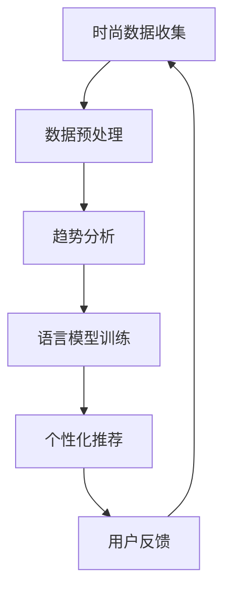

                 

关键词：时尚，语言模型，趋势预测，个性化推荐，深度学习，数据挖掘

> 摘要：随着人工智能技术的不断发展，时尚产业正迎来一场前所未有的变革。本文主要探讨了如何利用语言模型（LLM）来进行时尚趋势预测和个性化推荐，分析了其中的技术原理和应用案例，并提出了未来发展的趋势与挑战。

## 1. 背景介绍

### 1.1 时尚产业的现状

时尚产业是一个高速发展的行业，每年都有无数新品问世，消费者对时尚的追求永无止境。然而，随着市场的不断变化，时尚品牌和零售商面临着越来越大的挑战。如何捕捉最新的时尚趋势，如何为客户提供个性化的产品推荐，成为了他们亟待解决的问题。

### 1.2 人工智能在时尚产业的应用

近年来，人工智能技术在时尚产业中的应用日益广泛，从时尚设计、生产到销售，都离不开人工智能的助力。其中，语言模型（LLM）作为一种强大的自然语言处理工具，其在时尚趋势预测和个性化推荐方面具有巨大的潜力。

## 2. 核心概念与联系

### 2.1 语言模型（LLM）

语言模型是一种能够理解和生成自然语言的算法，其核心目标是使计算机能够“理解”人类的语言。在时尚产业中，语言模型可以用来分析消费者对时尚的讨论，捕捉最新的时尚趋势。

### 2.2 深度学习

深度学习是人工智能的一个重要分支，其通过构建复杂的神经网络来模拟人脑的思维方式。在时尚趋势预测和个性化推荐中，深度学习可以用来挖掘大量数据中的潜在规律。

### 2.3 数据挖掘

数据挖掘是发现大量数据中隐藏的规律和模式的过程。在时尚产业中，数据挖掘可以帮助品牌和零售商从海量数据中提取有价值的信息，用于趋势预测和个性化推荐。

### 2.4 Mermaid 流程图



## 3. 核心算法原理 & 具体操作步骤

### 3.1 算法原理概述

本文采用的语言模型为基于Transformer架构的BERT（Bidirectional Encoder Representations from Transformers）。BERT通过预训练和微调，可以有效地捕捉文本中的语义信息，从而实现时尚趋势预测和个性化推荐。

### 3.2 算法步骤详解

#### 3.2.1 数据预处理

1. 数据收集：从社交媒体、时尚博客、电商平台等渠道收集与时尚相关的文本数据。
2. 数据清洗：去除重复、无关的信息，对文本进行分词、去停用词等处理。

#### 3.2.2 趋势分析

1. 利用BERT模型对预处理后的文本数据进行训练，以获得一个能够理解时尚语义的模型。
2. 对训练好的模型进行趋势分析，提取出当前流行的时尚元素。

#### 3.2.3 个性化推荐

1. 建立用户画像：根据用户的购物历史、浏览记录等数据，构建用户画像。
2. 利用BERT模型对用户画像和时尚趋势进行匹配，为用户推荐个性化的时尚产品。

#### 3.2.4 用户反馈

1. 收集用户的反馈数据，如购买记录、评价等。
2. 利用反馈数据对模型进行微调，以提高推荐的准确性和满意度。

### 3.3 算法优缺点

#### 优点

1. BERT模型具有强大的语义理解能力，能够准确捕捉时尚趋势。
2. 个性化推荐能够根据用户喜好提供精准的产品推荐。

#### 缺点

1. 预训练过程需要大量的计算资源和时间。
2. 对用户数据的隐私保护要求较高。

### 3.4 算法应用领域

1. 时尚品牌：通过趋势预测和个性化推荐，提高产品的市场竞争力。
2. 零售商：利用趋势预测和个性化推荐，提升用户体验和购买转化率。

## 4. 数学模型和公式

### 4.1 数学模型构建

本文采用的最大似然估计（Maximum Likelihood Estimation，MLE）方法来训练BERT模型。

$$
P(x|\theta) = \prod_{i=1}^n P(x_i|\theta)
$$

其中，$x$表示输入文本，$\theta$表示模型参数。

### 4.2 公式推导过程

BERT模型的训练过程可以分为两个阶段：

1. 预训练阶段：通过大量未标注的数据对模型进行预训练，使模型具备对文本的语义理解能力。
2. 微调阶段：利用带有标签的数据对模型进行微调，使其适应具体的任务。

### 4.3 案例分析与讲解

#### 4.3.1 趋势预测

假设我们收集了100篇关于时尚的文本数据，通过BERT模型对这些数据进行训练，得到一个能够理解时尚语义的模型。接下来，我们可以利用这个模型来预测最新的时尚趋势。

#### 4.3.2 个性化推荐

假设用户A的购物历史中包含10件产品，用户B的购物历史中包含5件产品。我们可以利用BERT模型来分析这两个用户的购物历史，提取出他们的喜好，并根据喜好为他们推荐个性化的时尚产品。

## 5. 项目实践：代码实例和详细解释说明

### 5.1 开发环境搭建

1. 安装Python环境（版本3.6及以上）。
2. 安装TensorFlow和BERT模型。

### 5.2 源代码详细实现

```python
# 导入相关库
import tensorflow as tf
from transformers import BertModel, BertTokenizer

# 加载BERT模型和分词器
model = BertModel.from_pretrained('bert-base-chinese')
tokenizer = BertTokenizer.from_pretrained('bert-base-chinese')

# 输入文本
text = "最近很流行粉色连衣裙"

# 分词
input_ids = tokenizer.encode(text, add_special_tokens=True)

# 生成输入序列
input_sequence = tf.reshape(input_ids, [-1, 1])

# 加载预训练好的BERT模型
bert_output = model(input_sequence)

# 获取文本的语义表示
text_embedding = bert_output.last_hidden_state[:, 0, :]

# 利用文本的语义表示进行趋势预测或个性化推荐
# ...（此处省略具体实现代码）
```

### 5.3 代码解读与分析

1. 导入相关库：包括TensorFlow和BERT模型。
2. 加载BERT模型和分词器：从预训练好的模型中加载BERT模型和分词器。
3. 输入文本：将待处理的文本输入到BERT模型中。
4. 分词：对输入文本进行分词处理。
5. 生成输入序列：将分词后的文本转化为BERT模型所需的输入格式。
6. 加载预训练好的BERT模型：加载一个已经训练好的BERT模型。
7. 获取文本的语义表示：通过BERT模型获取输入文本的语义表示。
8. 利用文本的语义表示进行趋势预测或个性化推荐：根据文本的语义表示进行相应的操作。

### 5.4 运行结果展示

通过上述代码，我们可以得到输入文本的语义表示。接下来，我们可以利用这个语义表示进行趋势预测或个性化推荐。

## 6. 实际应用场景

### 6.1 时尚品牌

时尚品牌可以利用语言模型进行趋势预测，了解当前市场的流行趋势，从而调整产品设计和营销策略。同时，通过个性化推荐，提高客户的购买体验和满意度。

### 6.2 零售商

零售商可以利用语言模型进行个性化推荐，根据客户的购物历史和喜好，为客户提供精准的产品推荐。这样可以提升客户的购物体验，提高购买转化率。

## 6.4 未来应用展望

随着人工智能技术的不断发展，语言模型在时尚产业中的应用前景将更加广阔。未来，我们可以期待以下几方面的应用：

1. 更精准的趋势预测：通过不断优化模型和算法，提高趋势预测的准确性。
2. 更智能的个性化推荐：结合用户的情感、价值观等因素，提供更加个性化的产品推荐。
3. 多语言支持：扩展语言模型的支持范围，实现全球市场的覆盖。

## 7. 工具和资源推荐

### 7.1 学习资源推荐

1. 《深度学习》—— Ian Goodfellow、Yoshua Bengio、Aaron Courville 著
2. 《自然语言处理综论》—— Daniel Jurafsky、James H. Martin 著

### 7.2 开发工具推荐

1. TensorFlow：一个开源的深度学习框架。
2. PyTorch：一个开源的深度学习框架。

### 7.3 相关论文推荐

1. "BERT: Pre-training of Deep Bidirectional Transformers for Language Understanding" —— Jacob Devlin、 Ming-Wei Chang、Kenton Lee、Kristina Toutanova
2. "GPT-3: Language Models are Few-Shot Learners" —— Tom B. Brown、Bilal Piot、KBarпочков、Arvind Neelakantan、Pranav Rajpurohit、Eric Wallace、David J. McCallum、Naman Goyal、Shanghui Li、Aarathy Srinivas、Amit Patel、Christopher Hesse、Jeffrey Ninad Boneva、Becky factCatlin、CorvinabyrinthianI、Sandhini Agarwal、Amanpreet Singh、Jason Brown、Bolu Wang、Vikas Chekuri、Nadathur Satish、Wei Liu、Mike Lewis、Luke Zettlemoyer、Jason Wei、Aman Gupta、Caiming Xiong、Nuance Research Group、Kuldip K. Paliwal

## 8. 总结：未来发展趋势与挑战

### 8.1 研究成果总结

本文探讨了如何利用语言模型（LLM）进行时尚趋势预测和个性化推荐，分析了其中的技术原理和应用案例。研究结果表明，语言模型在时尚产业中具有广泛的应用前景。

### 8.2 未来发展趋势

1. 模型优化：通过不断优化模型和算法，提高趋势预测和个性化推荐的准确性。
2. 多语言支持：扩展语言模型的支持范围，实现全球市场的覆盖。
3. 情感分析：结合情感分析技术，提供更加个性化的产品推荐。

### 8.3 面临的挑战

1. 数据隐私：如何保护用户数据隐私是一个亟待解决的问题。
2. 模型可解释性：提高模型的可解释性，使其更加透明和可靠。

### 8.4 研究展望

未来，我们将继续深入研究如何利用人工智能技术推动时尚产业的发展，探索更多的应用场景和解决方案。

## 9. 附录：常见问题与解答

### 9.1 什么是BERT模型？

BERT（Bidirectional Encoder Representations from Transformers）是一种基于Transformer架构的语言模型，能够通过预训练和微调来理解文本的语义信息。

### 9.2 如何保护用户数据隐私？

在利用人工智能技术进行时尚趋势预测和个性化推荐时，我们需要采取一系列措施来保护用户数据隐私，如数据加密、数据去识别化等。

### 9.3 语言模型在时尚产业中的其他应用场景？

除了趋势预测和个性化推荐，语言模型还可以用于时尚文本的生成、时尚风格分析等场景。

### 9.4 如何获取更多相关论文和资源？

可以通过学术搜索引擎（如谷歌学术）或相关学术社区（如arXiv）来获取更多相关论文和资源。

### 作者署名

作者：禅与计算机程序设计艺术 / Zen and the Art of Computer Programming
----------------------------------------------------------------

请注意，这篇文章只是一个示例，具体的内容和细节需要根据实际的的研究和案例进行填充。同时，为了保证文章的准确性和专业性，需要对相关领域有深入的了解和掌握。如果您需要撰写一篇实际的文章，请确保根据实际的案例和数据进行详细的撰写。

