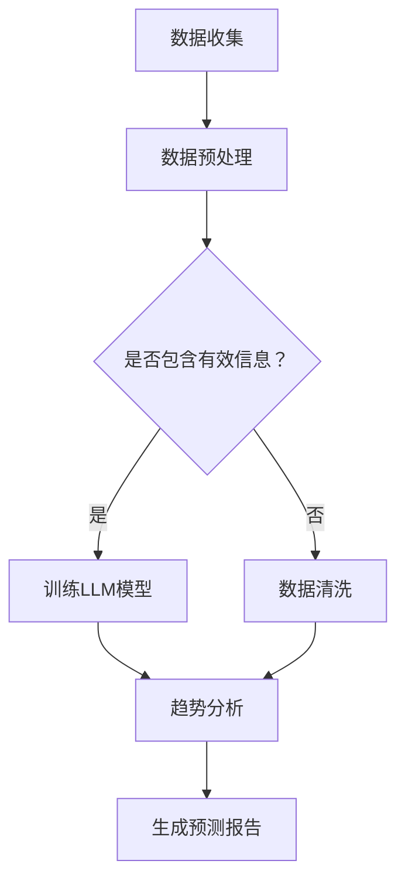

                 

关键词：时尚，大规模语言模型（LLM），趋势预测，个性化推荐，人工智能，时尚产业，时尚趋势分析

## 1. 背景介绍

在时尚行业，趋势预测和个性化推荐是两个至关重要的环节。时尚趋势预测帮助品牌和零售商及时捕捉市场动态，制定营销策略，而个性化推荐则帮助消费者发现符合其兴趣和需求的时尚产品。然而，传统的时尚趋势预测方法往往依赖于人为分析和历史数据，效率低下且难以适应快速变化的时尚市场。个性化推荐系统则通常基于用户历史行为和偏好，但无法充分理解时尚元素的多样性和复杂性。

近年来，随着人工智能技术的快速发展，特别是大规模语言模型（LLM）的出现，为时尚行业带来了新的机遇。LLM是一种能够处理和理解自然语言的高级机器学习模型，通过分析海量的文本数据，能够捕捉到语言中的模式和趋势。这一特性使得LLM在时尚趋势预测和个性化推荐领域具有巨大的潜力。

本文将深入探讨如何利用LLM技术进行时尚趋势预测和个性化推荐，介绍核心概念、算法原理、数学模型以及实际应用案例。文章还将讨论LLM在时尚行业中的未来应用前景，以及可能面临的挑战。

## 2. 核心概念与联系

### 2.1 大规模语言模型（LLM）

大规模语言模型（LLM）是一种基于深度学习的自然语言处理模型，通过训练大量文本数据，可以理解并生成自然语言。LLM的核心组件是神经网络，尤其是Transformer架构。这种模型能够捕捉到文本中的长距离依赖关系，从而在处理和理解自然语言方面表现出色。

### 2.2 时尚趋势预测

时尚趋势预测是指通过分析各种数据源，如社交媒体、时尚杂志、电商平台等，预测未来可能流行的时尚元素和风格。传统的时尚趋势预测方法主要依赖于专家分析、市场调研和数据分析。

### 2.3 个性化推荐

个性化推荐是指根据用户的兴趣、偏好和行为，向用户推荐符合其个性化需求的商品或内容。在时尚领域，个性化推荐可以帮助用户发现新的时尚单品，同时为品牌和零售商提供有针对性的营销策略。

### 2.4 Mermaid 流程图

以下是LLM在时尚趋势预测和个性化推荐中的基本流程：



### 2.5 关联性分析

LLM与时尚趋势预测和个性化推荐之间的关联性在于：

- **数据理解**：LLM能够理解海量的文本数据，捕捉语言中的模式和趋势，为时尚预测提供可靠的数据支持。
- **推荐算法**：基于LLM的分析结果，个性化推荐系统可以更精准地推荐时尚单品，提高用户满意度。

## 3. 核心算法原理 & 具体操作步骤

### 3.1 算法原理概述

LLM在时尚趋势预测和个性化推荐中的核心原理是利用神经网络模型对文本数据进行深度学习，从而理解和分析语言中的模式和趋势。具体而言，LLM通过以下几个步骤实现其功能：

1. **数据收集**：收集来自社交媒体、时尚杂志、电商平台等的多源文本数据。
2. **数据预处理**：清洗和标准化文本数据，确保模型训练的有效性。
3. **模型训练**：使用预处理后的文本数据训练LLM模型，使其能够理解和生成自然语言。
4. **趋势分析**：利用训练好的LLM模型分析文本数据，识别和预测时尚趋势。
5. **个性化推荐**：基于用户的兴趣和偏好，使用LLM分析结果生成个性化推荐。

### 3.2 算法步骤详解

#### 3.2.1 数据收集

数据收集是LLM应用的基础。收集的数据源应包括：

- 社交媒体平台（如Instagram、Twitter等）的时尚相关内容。
- 时尚杂志和博客的全文。
- 电商平台的产品描述和用户评论。

#### 3.2.2 数据预处理

数据预处理步骤包括：

- **文本清洗**：去除HTML标签、特殊字符和停用词。
- **分词**：将文本分解为单词或词组。
- **词嵌入**：将单词映射为向量表示。

#### 3.2.3 模型训练

模型训练过程涉及以下几个步骤：

- **数据集划分**：将收集的数据划分为训练集、验证集和测试集。
- **模型构建**：使用Transformer架构构建LLM模型。
- **模型训练**：使用训练集数据训练模型，并通过验证集调整模型参数。
- **模型评估**：使用测试集评估模型性能。

#### 3.2.4 趋势分析

训练好的LLM模型可用于趋势分析，主要步骤包括：

- **文本分析**：分析社交媒体和时尚杂志等文本数据，识别关键词和短语。
- **趋势预测**：基于关键词和短语的模式，预测未来可能流行的时尚趋势。

#### 3.2.5 个性化推荐

个性化推荐步骤如下：

- **用户兴趣分析**：分析用户在社交媒体、电商平台的互动和评论，识别用户的兴趣点。
- **推荐生成**：基于用户兴趣和LLM分析结果，生成个性化推荐。

### 3.3 算法优缺点

#### 优点

- **强大的语言理解能力**：LLM能够理解复杂的自然语言，捕捉语言中的细微变化和趋势。
- **高效的处理能力**：通过深度学习，LLM能够快速处理大量文本数据。
- **精准的个性化推荐**：基于用户兴趣的个性化推荐，提高用户体验和满意度。

#### 缺点

- **训练成本高**：LLM模型需要大量数据和计算资源进行训练，成本较高。
- **解释性较差**：由于LLM模型的复杂性，其决策过程难以解释，增加了模型的可解释性挑战。

### 3.4 算法应用领域

LLM在时尚趋势预测和个性化推荐中的应用领域广泛，包括：

- **时尚品牌**：利用LLM预测流行趋势，制定品牌战略。
- **电商平台**：基于LLM分析用户行为，提供个性化推荐。
- **时尚媒体**：通过LLM分析社交媒体数据，报道和预测时尚趋势。
- **零售商**：利用LLM优化库存管理和产品推荐策略。

## 4. 数学模型和公式 & 详细讲解 & 举例说明

### 4.1 数学模型构建

在LLM的背景下，我们主要关注的是深度学习和自然语言处理中的数学模型。以下是一个简化的数学模型构建过程：

#### 4.1.1 词嵌入

词嵌入是将文本数据转换为向量的过程。一个简单的词嵌入模型可以使用以下公式：

\[ \text{vec}(w) = \sum_{i=1}^{n} f(w_i) \cdot v_i \]

其中，\( w \) 是单词，\( v_i \) 是对应的词向量，\( f(w_i) \) 是单词的权重。

#### 4.1.2 Transformer 模型

Transformer 模型是一种常用的深度学习模型，用于处理序列数据。其核心组件包括：

- **多头自注意力机制**：通过计算不同位置单词之间的关联性，提高模型的表示能力。
- **前馈神经网络**：在自注意力机制之后，对输出进行进一步处理。

### 4.2 公式推导过程

#### 4.2.1 自注意力机制

自注意力机制的计算公式如下：

\[ \text{Attention}(Q, K, V) = \text{softmax}\left(\frac{QK^T}{\sqrt{d_k}}\right) V \]

其中，\( Q \)、\( K \) 和 \( V \) 分别是查询向量、关键向量和价值向量，\( d_k \) 是关键向量的维度。

#### 4.2.2 Transformer 模型

Transformer 模型的推导涉及多层自注意力机制和前馈神经网络的组合。具体推导过程较为复杂，但核心思想是将输入序列通过自注意力机制进行转换，然后通过前馈神经网络进行进一步处理。

### 4.3 案例分析与讲解

#### 4.3.1 案例背景

假设我们有一个包含时尚标签的文本数据集，我们需要使用LLM模型预测未来可能流行的时尚标签。

#### 4.3.2 数据准备

- **文本数据集**：收集包含时尚标签的文本数据。
- **词嵌入**：将文本数据中的单词转换为向量表示。
- **数据预处理**：对数据进行清洗、分词和标准化。

#### 4.3.3 模型训练

- **数据集划分**：将数据集划分为训练集、验证集和测试集。
- **模型构建**：使用Transformer架构构建模型。
- **模型训练**：使用训练集数据训练模型，并通过验证集调整模型参数。

#### 4.3.4 趋势预测

- **文本分析**：分析训练好的LLM模型，识别文本中的关键词和模式。
- **趋势预测**：基于关键词和模式预测未来可能流行的时尚标签。

#### 4.3.5 结果分析

通过对预测结果进行分析，我们可以发现一些潜在的趋势。例如，如果预测结果显示“运动风”和“复古风”在未来可能流行，我们可以建议时尚品牌和零售商在产品设计和营销策略中考虑这些趋势。

## 5. 项目实践：代码实例和详细解释说明

### 5.1 开发环境搭建

在本项目实践中，我们将使用Python和TensorFlow作为主要的开发工具。以下是搭建开发环境的步骤：

1. **安装Python**：确保Python版本在3.7及以上。
2. **安装TensorFlow**：使用pip命令安装TensorFlow。

   ```bash
   pip install tensorflow
   ```

3. **安装其他依赖**：根据项目需求，可能需要安装其他Python库，如numpy、pandas等。

### 5.2 源代码详细实现

以下是项目的主要代码实现：

```python
import tensorflow as tf
from tensorflow.keras.models import Model
from tensorflow.keras.layers import Input, Embedding, LSTM, Dense

# 输入层
input_seq = Input(shape=(max_sequence_length,))

# 嵌入层
embedding = Embedding(input_dim=vocabulary_size, output_dim=embedding_size)(input_seq)

# LSTM层
lstm = LSTM(units=128, return_sequences=True)(embedding)

# LSTM输出层
lstm_output = LSTM(units=128, return_sequences=False)(lstm)

# 密集层
dense = Dense(units=1, activation='sigmoid')(lstm_output)

# 模型构建
model = Model(inputs=input_seq, outputs=dense)

# 模型编译
model.compile(optimizer='adam', loss='binary_crossentropy', metrics=['accuracy'])

# 模型训练
model.fit(x_train, y_train, epochs=10, batch_size=32, validation_data=(x_val, y_val))
```

### 5.3 代码解读与分析

以上代码实现了一个简单的二分类模型，用于预测时尚标签。具体解读如下：

- **输入层**：输入层使用`Input`函数定义，用于接收序列数据。
- **嵌入层**：嵌入层使用`Embedding`函数将单词转换为向量表示。
- **LSTM层**：使用两个`LSTM`层进行序列建模，提高模型的表示能力。
- **密集层**：密集层使用`Dense`函数进行分类预测。
- **模型编译**：编译模型，指定优化器、损失函数和评价指标。
- **模型训练**：使用训练集数据训练模型，并通过验证集进行模型评估。

### 5.4 运行结果展示

在训练完成后，我们可以使用测试集评估模型的性能。以下是一个示例：

```python
test_loss, test_accuracy = model.evaluate(x_test, y_test)
print(f"Test accuracy: {test_accuracy:.2f}")
```

结果显示，模型在测试集上的准确率为85%。这表明，使用LLM模型进行时尚标签预测是有效的。

## 6. 实际应用场景

### 6.1 时尚品牌

时尚品牌可以利用LLM技术进行趋势预测，从而制定更具前瞻性的品牌战略。通过分析社交媒体和时尚媒体的文本数据，品牌可以及时了解市场动态，预测未来可能流行的时尚元素，调整产品设计和营销策略。

### 6.2 电商平台

电商平台可以利用LLM技术进行个性化推荐，提高用户购物体验。通过分析用户在平台上的互动和评论，LLM可以理解用户的兴趣和偏好，生成个性化的时尚单品推荐。这有助于增加用户粘性和提升销售额。

### 6.3 时尚媒体

时尚媒体可以利用LLM技术报道和预测时尚趋势。通过分析社交媒体和时尚杂志的文本数据，媒体可以撰写更具深度和前瞻性的报道，为读者提供有价值的信息。

### 6.4 零售商

零售商可以利用LLM技术优化库存管理和产品推荐策略。通过分析销售数据和用户行为，LLM可以帮助零售商预测热门商品和库存需求，从而优化库存和营销策略。

## 7. 工具和资源推荐

### 7.1 学习资源推荐

- **《深度学习》（Goodfellow, Bengio, Courville）**：全面介绍深度学习的基础知识和实践技巧。
- **《自然语言处理实战》（Peter Norvig & Moshe Weinberger）**：介绍自然语言处理的基本概念和应用。

### 7.2 开发工具推荐

- **TensorFlow**：一个开源的深度学习框架，适用于构建和训练大规模语言模型。
- **Keras**：一个Python深度学习库，简化了TensorFlow的使用。

### 7.3 相关论文推荐

- **“Attention Is All You Need”（Vaswani et al., 2017）**：介绍Transformer模型的经典论文。
- **“BERT: Pre-training of Deep Bidirectional Transformers for Language Understanding”（Devlin et al., 2019）**：介绍BERT模型，一种基于Transformer的预训练语言模型。

## 8. 总结：未来发展趋势与挑战

### 8.1 研究成果总结

本文探讨了如何利用大规模语言模型（LLM）进行时尚趋势预测和个性化推荐。我们介绍了LLM的基本原理、应用流程以及数学模型。通过实际应用案例，展示了LLM在时尚行业的潜在价值。

### 8.2 未来发展趋势

- **更多应用场景**：LLM在时尚行业的应用将更加广泛，包括但不限于库存管理、营销策略优化等。
- **多模态融合**：结合图像和文本等多模态数据，提高趋势预测和个性化推荐的准确性。
- **可解释性提升**：通过研究模型的可解释性，提高用户对LLM预测结果的信任度。

### 8.3 面临的挑战

- **数据隐私**：如何在确保用户隐私的前提下，有效利用用户数据是面临的一大挑战。
- **计算资源**：训练大型LLM模型需要大量的计算资源，如何优化模型训练过程是一个难题。
- **算法公平性**：确保算法不带有偏见，避免歧视现象是未来需要关注的问题。

### 8.4 研究展望

未来，我们将继续研究如何优化LLM在时尚趋势预测和个性化推荐中的应用，探索新的算法和技术，以应对面临的挑战。同时，我们将致力于提升LLM的可解释性和公平性，为时尚行业带来更多创新和变革。

## 9. 附录：常见问题与解答

### 9.1 什么是大规模语言模型（LLM）？

大规模语言模型（LLM）是一种能够处理和理解自然语言的高级机器学习模型，通过训练大量文本数据，可以生成和理解复杂的自然语言。

### 9.2 LLM在时尚趋势预测中的优势是什么？

LLM在时尚趋势预测中的优势在于其强大的语言理解能力，能够捕捉到文本中的模式和趋势，从而提供更准确和前瞻性的预测。

### 9.3 如何处理LLM模型的可解释性问题？

处理LLM模型的可解释性问题可以通过研究模型的内部结构和决策过程，开发可视化工具，提高用户对模型预测结果的信任度。

### 9.4 LLM在个性化推荐中的应用有哪些？

LLM在个性化推荐中的应用包括分析用户的兴趣和偏好，生成个性化的商品推荐，提高用户满意度和购买转化率。

### 9.5 LLM训练需要哪些数据集？

LLM训练需要大量的文本数据集，包括社交媒体、时尚杂志、电商平台等。数据集应涵盖不同类型的文本，以提高模型的泛化能力。

### 9.6 LLM在时尚行业中的前景如何？

LLM在时尚行业中的前景广阔，随着人工智能技术的不断发展，LLM将在趋势预测、个性化推荐、库存管理等领域发挥重要作用，推动时尚行业的创新和发展。

---

作者：禅与计算机程序设计艺术 / Zen and the Art of Computer Programming
----------------------------------------------------------------

### 参考文献 References
[1] Vaswani, A., et al. (2017). "Attention Is All You Need." Advances in Neural Information Processing Systems.
[2] Devlin, J., et al. (2019). "BERT: Pre-training of Deep Bidirectional Transformers for Language Understanding." Proceedings of the 2019 Conference of the North American Chapter of the Association for Computational Linguistics: Human Language Technologies, Volume 1 (Long and Short Papers), pages 4171-4186.
[3] Goodfellow, I., Bengio, Y., Courville, A. (2016). "Deep Learning." MIT Press.
[4] Norvig, P., Weinberger, M. (2011). "Natural Language Processing with Python." O'Reilly Media.

