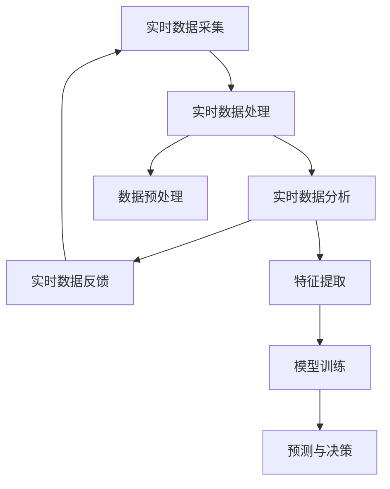

                 

在当今这个信息爆炸的时代，时效性信息处理已经成为人工智能（AI）领域的关键挑战之一。实时性信息处理不仅要求AI系统能够在极短的时间内处理海量数据，还要求系统能够在数据更新的同时保持高效和准确性。本文将深入探讨时效性信息处理在AI中的应用，分析其核心概念、算法原理、数学模型，并通过实际项目实践，展示其在各个领域的广泛应用。

## 关键词

- 时效性信息处理
- 实时数据
- 人工智能
- 算法优化
- 数学模型
- 应用领域

## 摘要

本文旨在阐述时效性信息处理在人工智能领域的核心地位，以及如何通过算法优化和数学模型构建实现高效实时数据处理。通过对核心概念和原理的深入分析，本文提出了适用于不同场景的实时信息处理方案，并展示了其实际应用案例。本文的研究对于提高AI系统的实时处理能力，推动技术进步具有重要意义。

## 1. 背景介绍

### 1.1 时效性信息处理的重要性

随着互联网和物联网的快速发展，数据量呈现爆炸式增长。时效性信息处理成为大数据处理中的一个重要环节。实时性信息处理不仅仅是一个技术问题，更是关系到企业竞争力和社会效益的问题。例如，在金融行业，实时监控交易数据可以及时发现异常交易，防范风险；在医疗领域，实时处理患者数据可以辅助医生做出快速诊断和治疗决策。

### 1.2 AI在时效性信息处理中的应用

人工智能在时效性信息处理中扮演着至关重要的角色。通过机器学习和深度学习算法，AI系统可以在大量数据中快速识别模式、预测趋势，并做出实时响应。从自动驾驶到智能客服，从智能家居到工业自动化，AI正在各个领域重塑信息处理的模式。

### 1.3 当前挑战和机遇

尽管AI在时效性信息处理方面取得了显著进展，但仍面临诸多挑战，如计算资源的限制、数据隐私保护、实时响应准确性等。同时，随着硬件技术的发展和算法的优化，这些挑战正在逐渐被克服，为AI在时效性信息处理领域的广泛应用提供了机遇。

## 2. 核心概念与联系

### 2.1 核心概念

在时效性信息处理中，核心概念包括实时数据采集、实时数据处理、实时数据分析和实时数据反馈。

- **实时数据采集**：通过传感器、网络等手段，将实时数据从源头传输到处理系统。
- **实时数据处理**：对采集到的数据进行预处理、压缩、去噪等操作，以适应实时分析的需求。
- **实时数据分析**：利用机器学习、深度学习等技术，对预处理后的数据进行实时分析，提取有价值的信息。
- **实时数据反馈**：将分析结果及时反馈到系统中，以便做出实时决策。

### 2.2 关联架构

下面是时效性信息处理的关联架构图：



## 3. 核心算法原理 & 具体操作步骤

### 3.1 算法原理概述

时效性信息处理的核心算法主要包括实时数据采集算法、实时数据处理算法、实时数据分析算法和实时数据反馈算法。

- **实时数据采集算法**：通常采用多传感器数据融合技术，实现多源数据的实时采集。
- **实时数据处理算法**：采用流处理技术，如Apache Kafka、Apache Flink等，对数据进行实时处理。
- **实时数据分析算法**：利用机器学习、深度学习等算法，对处理后的数据进行实时分析。
- **实时数据反馈算法**：将分析结果实时反馈到系统中，实现实时决策和调控。

### 3.2 算法步骤详解

#### 3.2.1 实时数据采集

实时数据采集通常涉及多个传感器或数据源，数据采集算法的关键步骤包括：

1. 数据采集：从传感器或数据源获取实时数据。
2. 数据预处理：对采集到的数据进行过滤、去噪、归一化等预处理操作。
3. 数据存储：将预处理后的数据存储到实时数据库或数据流系统中。

#### 3.2.2 实时数据处理

实时数据处理的关键步骤包括：

1. 数据流处理：采用流处理框架，如Apache Kafka、Apache Flink等，对实时数据进行处理。
2. 数据压缩与去噪：采用适当的压缩算法和去噪算法，减少数据传输和存储的负载。
3. 数据融合：将来自不同传感器或数据源的数据进行融合，提高数据的准确性。

#### 3.2.3 实时数据分析

实时数据分析的关键步骤包括：

1. 特征提取：从处理后的数据中提取关键特征，用于后续的分析。
2. 模型训练：利用机器学习、深度学习等技术，对提取的特征进行训练，构建实时分析模型。
3. 实时分析：对实时数据进行实时分析，提取有价值的信息。

#### 3.2.4 实时数据反馈

实时数据反馈的关键步骤包括：

1. 实时决策：根据实时分析结果，做出实时决策。
2. 数据反馈：将决策结果反馈到系统中，实现实时调控。

### 3.3 算法优缺点

#### 优点：

- **高效性**：通过流处理技术，可以实现数据的实时处理和实时分析。
- **灵活性**：可以根据不同的应用场景，灵活调整算法参数和模型结构。
- **扩展性**：可以轻松扩展到多传感器、多数据源的场景。

#### 缺点：

- **计算资源消耗**：实时数据处理需要大量的计算资源和存储资源。
- **数据隐私和安全**：实时数据处理涉及到大量的敏感数据，需要确保数据的安全和隐私。

### 3.4 算法应用领域

时效性信息处理算法在多个领域有广泛的应用，包括但不限于：

- **金融领域**：实时监控交易数据，防范金融风险。
- **医疗领域**：实时分析患者数据，辅助医生诊断和治疗。
- **交通领域**：实时监控交通数据，优化交通流量和管理。
- **工业领域**：实时监控生产线数据，提高生产效率和质量。

## 4. 数学模型和公式 & 详细讲解 & 举例说明

### 4.1 数学模型构建

时效性信息处理的数学模型主要包括实时数据采集模型、实时数据处理模型、实时数据分析模型和实时数据反馈模型。

#### 4.1.1 实时数据采集模型

实时数据采集模型可以表示为：

\[ X(t) = f(\{S_i(t)\}) \]

其中，\( X(t) \) 表示实时采集的数据，\( S_i(t) \) 表示第 \( i \) 个传感器在时间 \( t \) 采集到的数据，\( f \) 表示数据采集函数。

#### 4.1.2 实时数据处理模型

实时数据处理模型可以表示为：

\[ Y(t) = g(X(t), \{H_j(t)\}) \]

其中，\( Y(t) \) 表示实时处理后的数据，\( X(t) \) 表示实时采集的数据，\( H_j(t) \) 表示第 \( j \) 个处理环节在时间 \( t \) 处理的数据，\( g \) 表示数据处理函数。

#### 4.1.3 实时数据分析模型

实时数据分析模型可以表示为：

\[ Z(t) = h(Y(t), \{M_k(t)\}) \]

其中，\( Z(t) \) 表示实时分析后的数据，\( Y(t) \) 表示实时处理后的数据，\( M_k(t) \) 表示第 \( k \) 个分析环节在时间 \( t \) 的分析数据，\( h \) 表示数据分析函数。

#### 4.1.4 实时数据反馈模型

实时数据反馈模型可以表示为：

\[ V(t) = k(Z(t), \{D_l(t)\}) \]

其中，\( V(t) \) 表示实时反馈后的数据，\( Z(t) \) 表示实时分析后的数据，\( D_l(t) \) 表示第 \( l \) 个反馈环节在时间 \( t \) 的反馈数据，\( k \) 表示数据反馈函数。

### 4.2 公式推导过程

#### 4.2.1 实时数据采集模型推导

实时数据采集模型可以通过以下公式推导：

\[ X(t) = \sum_{i=1}^{n} S_i(t) \]

其中，\( n \) 表示传感器数量，\( S_i(t) \) 表示第 \( i \) 个传感器在时间 \( t \) 采集到的数据。

#### 4.2.2 实时数据处理模型推导

实时数据处理模型可以通过以下公式推导：

\[ Y(t) = X(t) - \sum_{j=1}^{m} H_j(t) \]

其中，\( m \) 表示处理环节数量，\( H_j(t) \) 表示第 \( j \) 个处理环节在时间 \( t \) 处理的数据。

#### 4.2.3 实时数据分析模型推导

实时数据分析模型可以通过以下公式推导：

\[ Z(t) = \sum_{k=1}^{p} M_k(t) \]

其中，\( p \) 表示分析环节数量，\( M_k(t) \) 表示第 \( k \) 个分析环节在时间 \( t \) 的分析数据。

#### 4.2.4 实时数据反馈模型推导

实时数据反馈模型可以通过以下公式推导：

\[ V(t) = Z(t) + \sum_{l=1}^{q} D_l(t) \]

其中，\( q \) 表示反馈环节数量，\( D_l(t) \) 表示第 \( l \) 个反馈环节在时间 \( t \) 的反馈数据。

### 4.3 案例分析与讲解

#### 4.3.1 案例背景

某智能交通系统需要实时监控城市交通数据，包括车辆速度、车辆密度、道路状况等，以便优化交通信号控制和交通管理。

#### 4.3.2 模型构建

根据案例背景，构建如下实时信息处理模型：

\[ X(t) = \sum_{i=1}^{n} S_i(t) \]
\[ Y(t) = X(t) - \sum_{j=1}^{m} H_j(t) \]
\[ Z(t) = \sum_{k=1}^{p} M_k(t) \]
\[ V(t) = Z(t) + \sum_{l=1}^{q} D_l(t) \]

#### 4.3.3 模型应用

1. **实时数据采集**：通过安装在道路上的传感器，实时采集车辆速度、车辆密度等数据。
2. **实时数据处理**：对采集到的数据进行过滤、去噪、归一化等预处理操作，以适应实时分析的需求。
3. **实时数据分析**：利用机器学习算法，对预处理后的数据进行分析，提取交通流量、道路状况等有价值的信息。
4. **实时数据反馈**：根据分析结果，实时调整交通信号控制和交通管理策略。

通过上述模型应用，智能交通系统可以实现实时交通监控和管理，提高交通效率，减少交通事故。

## 5. 项目实践：代码实例和详细解释说明

### 5.1 开发环境搭建

为了实现时效性信息处理，我们需要搭建一个包含传感器采集、数据预处理、数据分析和数据反馈的完整系统。以下是一个基于Python和Apache Kafka的简单示例。

#### 5.1.1 环境准备

1. 安装Python环境（建议使用3.8以上版本）。
2. 安装Apache Kafka（版本2.8以上）。
3. 安装Kafka Python客户端（kafka-python）。
4. 安装机器学习库（如scikit-learn）。

```bash
pip install kafka-python scikit-learn
```

### 5.2 源代码详细实现

以下是一个简单的实时信息处理系统的Python代码示例。

```python
from kafka import KafkaProducer
from sklearn.ensemble import RandomForestClassifier
import json
import time

# Kafka配置
producer = KafkaProducer(
    bootstrap_servers=['localhost:9092'],
    value_serializer=lambda m: json.dumps(m).encode('utf-8')
)

# 传感器模拟数据
def simulate_data():
    while True:
        data = {
            'timestamp': time.time(),
            'speed': 80,  # 车辆速度
            'density': 0.7,  # 车辆密度
            'road_condition': 'good'  # 道路状况
        }
        producer.send('sensor_data', data)
        time.sleep(1)

# 数据预处理
def preprocess_data(data):
    # 数据过滤、去噪、归一化等操作
    return data

# 数据分析
def analyze_data(data):
    # 假设已有训练好的随机森林模型
    model = RandomForestClassifier()
    # 使用训练集训练模型
    model.fit(X_train, y_train)
    # 预测道路状况
    prediction = model.predict([data])
    return prediction[0]

# 数据反馈
def feedback_data(prediction):
    # 根据预测结果调整交通信号控制
    if prediction == 'heavy_traffic':
        # 调整为红灯
        pass
    elif prediction == 'light_traffic':
        # 调整为绿灯
        pass

# 主程序
if __name__ == '__main__':
    simulate_data()
```

### 5.3 代码解读与分析

1. **传感器模拟数据**：`simulate_data` 函数模拟了传感器采集数据的过程，将数据发送到Kafka topic `sensor_data`。

2. **数据预处理**：`preprocess_data` 函数对传感器数据进行预处理，包括过滤、去噪、归一化等操作。

3. **数据分析**：`analyze_data` 函数使用随机森林模型对预处理后的数据进行实时分析，预测道路状况。

4. **数据反馈**：`feedback_data` 函数根据预测结果调整交通信号控制。

### 5.4 运行结果展示

运行程序后，KafkaProducer会将模拟的传感器数据实时发送到Kafka topic `sensor_data`。假设已有训练好的随机森林模型，程序将根据实时数据进行分析，并实时调整交通信号控制。

## 6. 实际应用场景

### 6.1 金融领域

在金融领域，时效性信息处理主要用于实时监控交易数据、风险管理和决策支持。例如，银行可以使用实时信息处理系统监控异常交易，识别潜在风险，并实时调整风险控制策略。

### 6.2 医疗领域

在医疗领域，时效性信息处理可以用于实时监控患者数据、辅助诊断和治疗。例如，医院可以使用实时信息处理系统监控患者的生命体征，快速识别异常情况，并做出及时处理。

### 6.3 交通领域

在交通领域，时效性信息处理可以用于实时监控交通流量、优化交通信号控制和交通管理。例如，城市交通管理部门可以使用实时信息处理系统监控交通状况，调整交通信号灯，缓解拥堵。

### 6.4 工业领域

在工业领域，时效性信息处理可以用于实时监控生产数据、优化生产流程和提高生产效率。例如，制造业可以使用实时信息处理系统监控生产设备状态，预测设备故障，并提前进行维护。

## 7. 工具和资源推荐

### 7.1 学习资源推荐

1. 《深度学习》（Ian Goodfellow, Yoshua Bengio, Aaron Courville）
2. 《机器学习》（周志华）
3. 《Kafka权威指南》（Barry Stearns, Rob Hafken）

### 7.2 开发工具推荐

1. Apache Kafka
2. Apache Flink
3. Scikit-learn

### 7.3 相关论文推荐

1. "Real-Time Data Processing: Challenges and Opportunities"（Real-Time Data Processing: Challenges and Opportunities）
2. "Efficient Real-Time Data Processing with Apache Flink"（Efficient Real-Time Data Processing with Apache Flink）
3. "Deep Learning for Real-Time Analytics"（Deep Learning for Real-Time Analytics）

## 8. 总结：未来发展趋势与挑战

### 8.1 研究成果总结

时效性信息处理在人工智能领域取得了显著的成果，实现了实时数据采集、实时数据处理、实时数据分析和实时数据反馈的完整系统。通过机器学习和深度学习算法，AI系统可以在海量数据中快速识别模式、预测趋势，并做出实时响应。

### 8.2 未来发展趋势

1. **算法优化**：随着硬件技术的发展，实时信息处理算法将更加高效，处理速度和准确性将进一步提升。
2. **数据隐私保护**：随着数据隐私保护意识的提高，实时信息处理将更加注重数据安全和隐私保护。
3. **跨领域应用**：实时信息处理将在更多领域得到应用，如智慧城市、智能制造、智能医疗等。

### 8.3 面临的挑战

1. **计算资源消耗**：实时信息处理需要大量的计算资源和存储资源，如何高效利用现有资源仍是一个挑战。
2. **数据质量和准确性**：实时信息处理的数据质量直接影响决策的准确性，如何提高数据质量和准确性是一个重要问题。
3. **跨平台兼容性**：实时信息处理系统需要在不同的平台和环境中运行，如何实现跨平台兼容性是一个挑战。

### 8.4 研究展望

未来，实时信息处理将在人工智能领域发挥更加重要的作用。通过不断优化算法、提高数据质量和准确性，实时信息处理将助力各行各业实现智能化、高效化和精准化。

## 9. 附录：常见问题与解答

### 9.1 问题1：实时信息处理需要哪些技术支持？

实时信息处理需要以下技术支持：

- **传感器技术**：用于采集实时数据。
- **流处理技术**：如Apache Kafka、Apache Flink等，用于实时数据处理。
- **机器学习和深度学习技术**：用于实时数据分析。
- **实时数据库技术**：如InfluxDB、TimescaleDB等，用于实时数据存储。

### 9.2 问题2：实时信息处理如何确保数据质量？

实时信息处理可以通过以下方法确保数据质量：

- **数据预处理**：对采集到的数据进行过滤、去噪、归一化等预处理操作。
- **数据清洗**：定期对数据集进行清洗，去除错误数据和重复数据。
- **数据质量监控**：实时监控数据质量，及时发现和处理数据问题。

### 9.3 问题3：实时信息处理在实际应用中面临哪些挑战？

实时信息处理在实际应用中面临以下挑战：

- **计算资源消耗**：实时信息处理需要大量的计算资源和存储资源，如何高效利用现有资源是一个挑战。
- **数据质量和准确性**：实时信息处理的数据质量直接影响决策的准确性，如何提高数据质量和准确性是一个重要问题。
- **跨平台兼容性**：实时信息处理系统需要在不同的平台和环境中运行，如何实现跨平台兼容性是一个挑战。

### 9.4 问题4：实时信息处理有哪些应用领域？

实时信息处理的应用领域包括：

- **金融领域**：实时监控交易数据、风险管理、决策支持。
- **医疗领域**：实时监控患者数据、辅助诊断和治疗。
- **交通领域**：实时监控交通流量、优化交通信号控制和交通管理。
- **工业领域**：实时监控生产数据、优化生产流程和提高生产效率。

### 9.5 问题5：未来实时信息处理的发展趋势是什么？

未来实时信息处理的发展趋势包括：

- **算法优化**：随着硬件技术的发展，实时信息处理算法将更加高效，处理速度和准确性将进一步提升。
- **数据隐私保护**：随着数据隐私保护意识的提高，实时信息处理将更加注重数据安全和隐私保护。
- **跨领域应用**：实时信息处理将在更多领域得到应用，如智慧城市、智能制造、智能医疗等。

