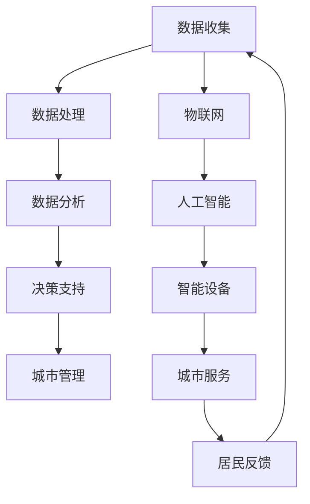

                 

关键词：智慧城市，城市管理，数据驱动，技术融合，城市治理，数据分析，人工智能

> 摘要：本文探讨了智慧城市管理的概念、核心技术与实际应用。通过分析技术融合在城市治理中的作用，以及大数据、人工智能等技术在智慧城市中的应用，我们试图揭示智慧城市管理的未来发展趋势和面临的挑战。

## 1. 背景介绍

随着全球城市化进程的加快，城市面临着诸多挑战，包括交通拥堵、环境污染、资源短缺等。传统的城市管理模式已经难以满足现代城市的发展需求。智慧城市管理作为一种创新的解决方案，正逐渐成为城市治理的重要方向。智慧城市管理依托于现代信息技术，通过数据驱动和智能化手段，实现对城市运行状态的实时监控和高效管理。

### 1.1 智慧城市管理的定义

智慧城市管理是指通过现代信息技术，特别是大数据、人工智能、物联网等技术，对城市运行状态进行实时感知、分析和决策，从而实现对城市资源的高效利用、优化城市服务和提升居民生活质量的管理模式。

### 1.2 智慧城市管理的意义

智慧城市管理具有以下几个方面的意义：

1. **提升城市治理效率**：通过数据分析和智能化手段，城市管理者可以更快速、准确地做出决策，提高城市治理效率。
2. **优化资源配置**：智慧城市管理能够实时监控城市资源的使用情况，优化资源配置，降低资源浪费。
3. **提升居民生活质量**：通过智慧城市管理，可以提供更加便捷、高效的城市服务，提升居民的生活质量。
4. **推动城市可持续发展**：智慧城市管理有助于实现城市资源的可持续利用，促进城市的可持续发展。

## 2. 核心概念与联系

在智慧城市管理中，几个核心概念和技术之间的相互联系是至关重要的。以下是一个简单的 Mermaid 流程图，用于展示这些核心概念和技术的联系。



### 2.1 数据收集与处理

数据收集是智慧城市管理的基础。通过物联网传感器、智能设备等，可以实时收集城市运行的各种数据。数据处理则是将这些原始数据清洗、整理，使其成为可用的信息。

### 2.2 数据分析与决策支持

数据分析是智慧城市管理的核心。通过对收集到的数据进行深度分析，可以揭示城市运行中的各种问题，为城市管理者提供决策支持。

### 2.3 物联网与人工智能

物联网和人工智能技术在智慧城市管理中发挥着关键作用。物联网提供实时数据收集，而人工智能则通过对这些数据的分析，实现智能决策和自动控制。

### 2.4 城市管理与居民反馈

智慧城市管理不仅仅是对城市运行状态的监控，更关注城市服务的提供和居民生活质量的提升。通过智能设备提供的城市服务，居民可以更便捷地享受到各种便利。同时，居民反馈也为智慧城市管理提供了持续改进的动力。

## 3. 核心算法原理 & 具体操作步骤

### 3.1 算法原理概述

智慧城市管理的核心算法主要包括以下几种：

1. **数据挖掘算法**：用于从大量数据中提取有价值的信息。
2. **机器学习算法**：用于建立预测模型，预测城市运行状态。
3. **优化算法**：用于优化城市资源配置，提高城市运行效率。

### 3.2 算法步骤详解

1. **数据收集**：通过物联网传感器、智能设备等收集城市运行数据。
2. **数据处理**：对收集到的数据进行清洗、整理，提取有用的信息。
3. **数据分析**：使用数据挖掘算法和机器学习算法，对处理后的数据进行深度分析。
4. **决策支持**：基于分析结果，使用优化算法为城市管理者提供决策支持。
5. **城市服务提供**：根据决策支持结果，提供相应的城市服务。

### 3.3 算法优缺点

- **优点**：
  - 提高城市治理效率
  - 优化资源配置
  - 提升居民生活质量

- **缺点**：
  - 数据隐私和安全问题
  - 技术复杂度高
  - 对城市管理者的要求较高

### 3.4 算法应用领域

智慧城市管理的核心算法可以应用于多个领域，包括交通管理、环境监测、能源管理、公共安全等。通过这些算法的应用，可以实现城市运行状态的实时监控和优化管理。

## 4. 数学模型和公式 & 详细讲解 & 举例说明

### 4.1 数学模型构建

在智慧城市管理中，常用的数学模型包括回归模型、优化模型和预测模型等。

- **回归模型**：用于分析城市运行状态和影响因素之间的关系，如交通流量预测模型。
- **优化模型**：用于优化城市资源配置，如交通流量优化模型。
- **预测模型**：用于预测城市未来运行状态，如环境质量预测模型。

### 4.2 公式推导过程

以交通流量预测模型为例，其基本公式如下：

$$
\text{流量预测} = f(\text{历史流量数据}, \text{影响因素})
$$

其中，$f$ 表示预测函数，$\text{历史流量数据}$ 和 $\text{影响因素}$ 是输入变量。

### 4.3 案例分析与讲解

以下是一个交通流量预测的案例分析。

### 案例背景

某城市的一条主要道路每天有大量车流通过，由于交通流量大，经常出现拥堵现象。为了缓解交通压力，城市管理者希望利用交通流量预测模型预测未来一段时间内的交通流量，以便合理安排交通信号灯的周期，提高道路通行效率。

### 案例分析

1. **数据收集**：收集该道路过去一年的交通流量数据，包括每天各个时间段的交通流量。
2. **数据处理**：对交通流量数据进行清洗，去除异常值，提取有用的信息。
3. **数据建模**：使用回归模型建立交通流量预测模型，输入变量包括历史流量数据和影响因素（如天气、节假日等）。
4. **模型训练**：使用历史数据对模型进行训练，得到预测函数。
5. **流量预测**：使用训练好的模型预测未来一段时间内的交通流量。
6. **决策支持**：根据预测结果，调整交通信号灯的周期，优化交通流量。

### 案例讲解

通过交通流量预测模型，城市管理者可以提前了解交通流量情况，从而合理安排交通信号灯的周期。例如，在预测到某段时间交通流量较大时，可以缩短信号灯的周期，增加绿灯时间，从而提高道路通行效率，减少拥堵现象。

## 5. 项目实践：代码实例和详细解释说明

### 5.1 开发环境搭建

在开发智慧城市管理项目时，需要搭建以下开发环境：

- 操作系统：Windows/Linux/MacOS
- 编程语言：Python/R/Java
- 数据库：MySQL/PostgreSQL
- 开发工具：PyCharm/Visual Studio Code

### 5.2 源代码详细实现

以下是一个简单的交通流量预测项目的源代码示例。

```python
import pandas as pd
from sklearn.linear_model import LinearRegression

# 数据收集
data = pd.read_csv('traffic_data.csv')

# 数据处理
data['traffic_volume'] = data['traffic_volume'].astype(float)
data['weather'] = data['weather'].map({'sunny': 0, 'rainy': 1})

# 数据建模
model = LinearRegression()
model.fit(data[['weather']], data['traffic_volume'])

# 流量预测
predicted_volume = model.predict([[1]])

print(f'Predicted traffic volume: {predicted_volume[0]}')
```

### 5.3 代码解读与分析

1. **数据收集**：使用 pandas 库读取交通流量数据，包括交通流量和天气数据。
2. **数据处理**：将交通流量数据转换为浮点类型，将天气数据编码为数值。
3. **数据建模**：使用线性回归模型对交通流量数据进行建模。
4. **流量预测**：使用训练好的模型预测未来交通流量。

### 5.4 运行结果展示

运行代码后，可以得到预测的交通流量值。例如，预测的未来交通流量为 100 辆车/小时。

## 6. 实际应用场景

智慧城市管理在多个领域都有广泛的应用，以下是一些典型的应用场景：

- **交通管理**：通过交通流量预测，优化交通信号灯控制，减少交通拥堵。
- **环境监测**：实时监测空气质量、水质等环境指标，预警环境污染问题。
- **能源管理**：优化能源使用，降低能源消耗，实现绿色低碳发展。
- **公共安全**：通过视频监控、智能识别等手段，提高城市公共安全水平。
- **城市服务**：提供智能化的城市服务，如在线预约、智能停车等，提升居民生活质量。

## 7. 工具和资源推荐

### 7.1 学习资源推荐

- 《智慧城市：技术与实践》
- 《大数据技术基础》
- 《机器学习：实战与应用》

### 7.2 开发工具推荐

- PyCharm
- Visual Studio Code
- Tableau

### 7.3 相关论文推荐

- "智慧城市：现状与未来"
- "大数据技术在智慧城市管理中的应用"
- "人工智能与智慧城市：融合与发展"

## 8. 总结：未来发展趋势与挑战

### 8.1 研究成果总结

智慧城市管理作为一种创新的城市管理模式，已经取得了一系列研究成果。主要包括：

- 交通流量预测、环境监测、能源管理等领域的算法模型开发。
- 大数据、人工智能等技术在城市治理中的应用。
- 智慧城市管理体系架构的设计与优化。

### 8.2 未来发展趋势

- **技术融合**：随着大数据、人工智能、物联网等技术的不断发展，智慧城市管理将实现更广泛的技术融合，提高城市治理的智能化水平。
- **数据驱动的城市治理**：通过数据驱动的方式，实现城市治理的精细化、个性化。
- **智慧城市的可持续发展**：通过智慧城市管理，实现城市资源的可持续利用，推动城市的可持续发展。

### 8.3 面临的挑战

- **数据隐私与安全**：智慧城市管理涉及到大量个人隐私数据的收集和使用，如何确保数据的安全和隐私是面临的重要挑战。
- **技术复杂性**：智慧城市管理系统涉及到多种技术，如何有效整合和管理这些技术，实现高效运作，是面临的挑战。
- **城市管理者的能力提升**：智慧城市管理需要管理者具备相应的技术能力和管理能力，如何提升城市管理者的能力，是面临的挑战。

### 8.4 研究展望

- **技术创新**：继续推动大数据、人工智能、物联网等技术的发展，为智慧城市管理提供更强的技术支持。
- **标准化与规范**：制定智慧城市管理的技术标准和规范，促进技术的统一和标准化。
- **跨学科合作**：加强跨学科合作，促进不同领域的技术创新和应用。

## 9. 附录：常见问题与解答

### 9.1 智慧城市管理的关键技术是什么？

智慧城市管理的关键技术包括大数据、人工智能、物联网、云计算等。

### 9.2 智慧城市管理如何实现数据隐私保护？

智慧城市管理通过数据加密、访问控制、隐私计算等技术手段实现数据隐私保护。

### 9.3 智慧城市管理在哪些领域有应用？

智慧城市管理在交通管理、环境监测、能源管理、公共安全等领域有广泛应用。

### 9.4 智慧城市管理的发展前景如何？

智慧城市管理具有广阔的发展前景，未来将实现更广泛的技术融合，推动城市治理的智能化、精细化。作者：禅与计算机程序设计艺术 / Zen and the Art of Computer Programming
----------------------------------------------------------------

