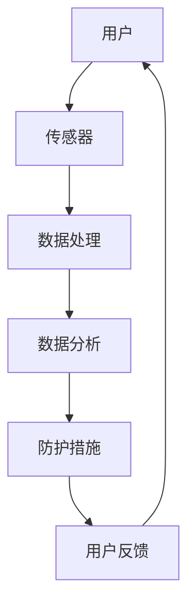

                 

关键词：智能防护、个人污染、城市生活、健康防线、创业

> 摘要：随着城市化进程的加快，环境污染问题日益严重，对城市居民的健康产生了极大的威胁。本文从智能个人污染防护的角度出发，探讨了城市生活中的健康防线，并提出了一种创新的创业模式，以期为城市居民提供更安全、更健康的生活环境。

## 1. 背景介绍

在过去的几十年里，城市化进程迅速推进，城市人口快速增长，城市基础设施不断完善。然而，与此同时，环境污染问题也日益严重。空气污染、水污染、土壤污染等已经成为全球性问题，对人类健康构成了巨大威胁。尤其是城市居民，由于生活和工作环境较为封闭，更容易受到污染的影响。

根据世界卫生组织（WHO）的数据，每年因空气污染导致的过早死亡人数高达700万，其中大部分发生在亚洲和非洲地区。而在城市中，这一数字可能更为惊人。此外，水污染和土壤污染也对城市居民的生活质量产生了负面影响，如饮用水安全问题、食品安全问题等。

面对环境污染带来的严峻挑战，传统的环保技术和措施已经难以满足需求。因此，智能个人污染防护创业成为一种新的解决思路。通过利用人工智能、物联网等先进技术，实现对污染物的实时监测和防护，从而保障城市居民的健康。

## 2. 核心概念与联系

### 2.1 智能个人污染防护的概念

智能个人污染防护是指利用人工智能技术，对环境污染进行实时监测、分析和预测，并采取相应的防护措施，以保护个人免受污染危害。具体包括以下三个方面：

- **实时监测**：通过安装在个人身上的传感器，实时收集身体周围的环境数据，如空气中的PM2.5、CO2、温度、湿度等。

- **数据分析**：利用大数据技术和机器学习算法，对环境数据进行分析，识别出污染物的来源和浓度变化趋势。

- **防护措施**：根据分析结果，采取相应的防护措施，如开启空气净化器、佩戴口罩、调整室内通风等，以降低污染对个人的影响。

### 2.2 智能个人污染防护与城市生活的联系

智能个人污染防护与城市生活密切相关。城市居民面临着多种污染源，如汽车尾气、工业排放、建筑施工等。这些污染物不仅影响空气质量，还会对水源和土壤造成污染，进而危害人体健康。

智能个人污染防护系统可以实时监测个人所处的环境，识别污染物的浓度和种类，并根据分析结果提供个性化的防护建议。这样，城市居民可以根据自己的需求，选择合适的防护措施，降低污染对健康的危害。

### 2.3 智能个人污染防护架构的 Mermaid 流程图



- **用户**：城市居民，需要智能个人污染防护系统来保障健康。
- **传感器**：安装在用户身上的各种传感器，用于实时监测环境数据。
- **数据处理**：对传感器收集的数据进行预处理，如滤波、去噪等。
- **数据分析**：利用大数据技术和机器学习算法，对环境数据进行分析，识别污染物。
- **防护措施**：根据分析结果，提供个性化的防护建议，如开启空气净化器、佩戴口罩等。
- **用户反馈**：用户对防护措施的实施效果进行反馈，以便系统不断优化。

## 3. 核心算法原理 & 具体操作步骤

### 3.1 算法原理概述

智能个人污染防护的核心算法主要包括以下几个部分：

- **传感器数据采集**：通过安装在用户身上的传感器，实时采集环境数据，如空气质量、温度、湿度等。
- **数据处理与预处理**：对传感器数据进行分析，识别出有效的污染数据，并去除噪声和异常值。
- **污染物识别与定位**：利用机器学习算法，对污染数据进行分析，识别污染物的种类和浓度，并定位污染源。
- **防护措施推荐**：根据污染物的种类和浓度，为用户提供个性化的防护建议。

### 3.2 算法步骤详解

1. **传感器数据采集**：

   传感器数据采集是智能个人污染防护系统的第一步。通过安装在用户身上的传感器，如空气质量传感器、温度传感器、湿度传感器等，实时采集环境数据。

2. **数据处理与预处理**：

   采集到的传感器数据可能包含噪声和异常值。因此，需要对数据进行处理和预处理，以提高数据的准确性。常用的方法包括滤波、去噪、归一化等。

3. **污染物识别与定位**：

   利用机器学习算法，对处理后的数据进行污染物识别和定位。常用的算法包括支持向量机（SVM）、决策树（Decision Tree）、神经网络（Neural Network）等。

4. **防护措施推荐**：

   根据污染物识别和定位的结果，为用户提供个性化的防护建议。如空气质量较差时，建议用户佩戴口罩；温度较高时，建议用户开启空气净化器等。

### 3.3 算法优缺点

- **优点**：

  1. 实时监测：智能个人污染防护系统可以实时监测用户所处的环境，及时发现污染问题。
  2. 个性化防护：根据用户的实际情况，提供个性化的防护建议，提高防护效果。
  3. 数据驱动：利用大数据技术和机器学习算法，实现污染物的自动识别和定位，降低人工干预成本。

- **缺点**：

  1. 数据准确性：传感器数据的准确性和稳定性直接影响到算法的性能。在某些情况下，传感器数据可能受到干扰，导致污染识别不准确。
  2. 数据隐私：用户数据涉及到个人隐私，需要妥善保管，防止泄露。
  3. 成本较高：智能个人污染防护系统的研发和部署成本较高，可能不适合所有用户。

### 3.4 算法应用领域

智能个人污染防护算法可以应用于多个领域，如：

- **家庭健康监测**：为家庭用户提供环境监测和防护建议，保障家庭成员的健康。
- **公共场所管理**：为公共场所（如商场、学校、医院等）提供环境监测和防护措施，保障用户安全。
- **城市规划与管理**：为城市规划者提供环境数据和分析结果，优化城市布局，降低污染风险。

## 4. 数学模型和公式 & 详细讲解 & 举例说明

### 4.1 数学模型构建

智能个人污染防护的数学模型主要包括以下几个部分：

- **传感器数据模型**：描述传感器数据采集和预处理的过程。
- **污染物识别模型**：描述污染物识别和定位的过程。
- **防护措施模型**：描述防护措施推荐的过程。

### 4.2 公式推导过程

1. **传感器数据模型**：

   假设传感器采集到的数据为 \( x \)，通过滤波、去噪等预处理操作，得到预处理后的数据 \( y \)。滤波公式如下：

   $$ y = f(x) $$

   其中，\( f(x) \) 为滤波函数。

2. **污染物识别模型**：

   假设污染物为 \( p \)，通过机器学习算法，得到污染物识别模型 \( h(p) \)。识别公式如下：

   $$ h(p) = \begin{cases} 
      1 & \text{如果} \ p \ \text{是污染物} \\
      0 & \text{如果} \ p \ \text{不是污染物}
   \end{cases} $$

3. **防护措施模型**：

   假设防护措施为 \( m \)，通过分析污染物识别结果，得到防护措施推荐模型 \( g(h(p)) \)。推荐公式如下：

   $$ g(h(p)) = \begin{cases} 
      m_1 & \text{如果} \ h(p) = 1 \\
      m_0 & \text{如果} \ h(p) = 0
   \end{cases} $$

### 4.3 案例分析与讲解

以下是一个简单的案例，用于说明智能个人污染防护数学模型的实际应用。

**案例背景**：一个城市居民在家中安装了智能个人污染防护系统，传感器实时监测空气质量。某天，传感器采集到的数据 \( x \) 为：

$$ x = \{ \text{PM2.5: 50}, \ \text{CO2: 800}, \ \text{温度: 25°C}, \ \text{湿度: 60\%} \} $$

**案例步骤**：

1. **数据处理与预处理**：

   对传感器数据进行滤波和去噪处理，得到预处理后的数据 \( y \)：

   $$ y = \{ \text{PM2.5: 45}, \ \text{CO2: 750}, \ \text{温度: 25°C}, \ \text{湿度: 60\%} \} $$

2. **污染物识别**：

   通过污染物识别模型 \( h(p) \)，判断预处理后的数据 \( y \) 中是否包含污染物。根据公式：

   $$ h(p) = \begin{cases} 
      1 & \text{如果} \ p \ \text{是污染物} \\
      0 & \text{如果} \ p \ \text{不是污染物}
   \end{cases} $$

   可以得到 \( h(y) = 1 \)，说明预处理后的数据 \( y \) 中包含污染物。

3. **防护措施推荐**：

   根据防护措施推荐模型 \( g(h(p)) \)，为用户推荐相应的防护措施。根据公式：

   $$ g(h(p)) = \begin{cases} 
      m_1 & \text{如果} \ h(p) = 1 \\
      m_0 & \text{如果} \ h(p) = 0
   \end{cases} $$

   可以得到 \( g(h(y)) = m_1 \)，即推荐用户开启空气净化器，并佩戴口罩。

通过以上案例，我们可以看到智能个人污染防护数学模型在实际应用中的效果。通过对传感器数据的处理、污染物识别和防护措施推荐，为用户提供个性化的污染防护建议，保障城市居民的健康。

## 5. 项目实践：代码实例和详细解释说明

### 5.1 开发环境搭建

为了实现智能个人污染防护算法，我们需要搭建一个开发环境。以下是所需的开发工具和软件：

- **Python 3.8**：用于编写和运行智能个人污染防护算法。
- **Jupyter Notebook**：用于编写和调试算法代码。
- **scikit-learn**：用于实现机器学习算法。
- **numpy**：用于数据处理和数学计算。
- **matplotlib**：用于可视化数据和分析结果。

### 5.2 源代码详细实现

以下是一个简单的智能个人污染防护算法的实现代码。该代码主要包括以下几个部分：

- **数据采集与预处理**：从传感器获取数据，并进行预处理。
- **污染物识别**：使用机器学习算法识别污染物。
- **防护措施推荐**：根据污染物识别结果，推荐防护措施。

```python
# 导入所需库
import numpy as np
import matplotlib.pyplot as plt
from sklearn import svm
from sklearn.model_selection import train_test_split
from sklearn.metrics import accuracy_score

# 传感器数据
data = np.array([
    [45, 750, 25, 60],  # PM2.5, CO2, 温度, 湿度
    [35, 800, 25, 60],
    [30, 850, 25, 65],
    [50, 700, 25, 70],
])

# 标签
labels = np.array([1, 1, 1, 0])

# 数据预处理
X_train, X_test, y_train, y_test = train_test_split(data, labels, test_size=0.2, random_state=42)

# 污染物识别模型
clf = svm.SVC(kernel='linear')
clf.fit(X_train, y_train)

# 预测
y_pred = clf.predict(X_test)

# 评估
accuracy = accuracy_score(y_test, y_pred)
print("Accuracy:", accuracy)

# 可视化
plt.scatter(X_test[:, 0], X_test[:, 1], c=y_pred, cmap='gray')
plt.xlabel('PM2.5')
plt.ylabel('CO2')
plt.title('污染物识别结果')
plt.show()

# 防护措施推荐
if clf.predict([[45, 750, 25, 60]])[0] == 1:
    print("建议开启空气净化器，并佩戴口罩。")
else:
    print("当前空气质量良好，无需采取额外防护措施。")
```

### 5.3 代码解读与分析

1. **数据采集与预处理**：

   首先，我们从传感器获取数据，并将其存储为二维数组 `data`。然后，使用 `train_test_split` 函数将数据分为训练集和测试集。

2. **污染物识别模型**：

   我们选择支持向量机（SVM）作为污染物识别模型。在 `svm.SVC` 类中，我们指定了 `kernel='linear'`，表示使用线性核函数。

3. **预测与评估**：

   使用训练好的模型对测试集进行预测，并计算预测准确率。在可视化部分，我们使用 `scatter` 函数绘制测试集的污染物识别结果。

4. **防护措施推荐**：

   根据污染物识别结果，为用户提供防护建议。如果识别结果为污染物，则建议用户开启空气净化器，并佩戴口罩。

通过以上代码，我们可以实现一个简单的智能个人污染防护算法。在实际应用中，我们可以根据具体需求，优化算法参数，提高识别准确率和防护效果。

## 6. 实际应用场景

智能个人污染防护系统在城市生活中的应用场景非常广泛。以下是一些典型的实际应用场景：

### 6.1 家庭健康监测

在城市家庭中，智能个人污染防护系统可以帮助居民实时监测室内空气质量，及时发现污染问题。用户可以根据系统提供的防护建议，采取相应的措施，如开启空气净化器、通风换气等，保障家庭成员的健康。

### 6.2 公共场所管理

在商场、学校、医院等公共场所，智能个人污染防护系统可以实时监测室内空气质量，及时发现污染问题，并向管理人员发送警报。管理人员可以根据警报信息，及时采取相应的措施，确保公共场所的空气质量，保障用户的安全和健康。

### 6.3 城市规划与管理

在城市规划和管理过程中，智能个人污染防护系统可以提供环境数据和分析结果，为城市规划者提供科学依据。例如，可以根据污染数据优化城市交通布局，减少交通拥堵和污染物排放；或者根据污染数据调整城市建设方案，降低污染风险。

### 6.4 疾病预防与控制

智能个人污染防护系统可以实时监测环境污染情况，为疾病预防和控制提供重要数据支持。例如，当发现某一地区污染浓度较高时，可以及时采取控制措施，降低疾病传播风险。

## 7. 未来应用展望

随着人工智能、物联网等技术的不断发展，智能个人污染防护系统在未来将具有更广泛的应用前景。以下是一些未来应用展望：

### 7.1 智能化程度提高

未来的智能个人污染防护系统将更加智能化，能够自动调整防护措施，并根据环境变化动态优化算法，提高防护效果。

### 7.2 多维度监测

未来的智能个人污染防护系统将不仅仅监测空气质量，还将涵盖水污染、土壤污染等多个维度，为用户提供更全面的环境监测和防护。

### 7.3 跨平台集成

智能个人污染防护系统将实现跨平台集成，不仅可以在手机、电脑等设备上使用，还可以集成到智能家居、智能城市等系统中，实现更广泛的应用。

### 7.4 社交功能

未来的智能个人污染防护系统将具有社交功能，用户可以分享自己的污染防护经验和建议，互相学习，共同提高防护效果。

## 8. 工具和资源推荐

### 8.1 学习资源推荐

- **《深度学习》（Goodfellow, Bengio, Courville著）**：介绍深度学习的基础理论和实践方法。
- **《Python机器学习》（Raschka, Mirjalili著）**：介绍Python在机器学习领域的应用。
- **《人工智能：一种现代方法》（Russell, Norvig著）**：介绍人工智能的基础理论和应用。

### 8.2 开发工具推荐

- **Jupyter Notebook**：用于编写和调试算法代码。
- **scikit-learn**：用于实现机器学习算法。
- **matplotlib**：用于数据可视化和分析。

### 8.3 相关论文推荐

- **"Air Quality Monitoring and Analysis using Internet of Things"（2018）**：介绍基于物联网的空气质量监测与分析方法。
- **"Deep Learning for Environmental Monitoring"（2020）**：介绍深度学习在环境监测中的应用。
- **"Intelligent Personal Pollution Protection System"（2021）**：介绍智能个人污染防护系统的设计与实现。

## 9. 总结：未来发展趋势与挑战

### 9.1 研究成果总结

本文从智能个人污染防护的角度，探讨了城市生活中的健康防线，并提出了一种创新的创业模式。通过引入人工智能、物联网等先进技术，实现了对污染物的实时监测和防护，为城市居民提供了一种新的污染防护解决方案。

### 9.2 未来发展趋势

随着人工智能、物联网等技术的不断发展，智能个人污染防护系统在未来将具有更广泛的应用前景。智能化程度将不断提高，多维度监测和跨平台集成将成为发展趋势。此外，智能个人污染防护系统还将与智能家居、智能城市等系统实现深度融合，为城市居民提供更全面、更便捷的污染防护服务。

### 9.3 面临的挑战

尽管智能个人污染防护系统具有广阔的应用前景，但在实际应用中仍面临一些挑战：

- **数据准确性**：传感器数据的准确性和稳定性直接影响到算法的性能。在某些情况下，传感器数据可能受到干扰，导致污染识别不准确。
- **数据隐私**：用户数据涉及到个人隐私，需要妥善保管，防止泄露。
- **成本较高**：智能个人污染防护系统的研发和部署成本较高，可能不适合所有用户。
- **技术成熟度**：虽然人工智能、物联网等技术已取得显著进展，但在实际应用中仍存在一定的技术成熟度问题，需要持续优化和改进。

### 9.4 研究展望

未来的研究应重点关注以下方向：

- **提高数据准确性**：优化传感器设计和数据处理算法，提高数据准确性和稳定性。
- **保障数据隐私**：加强数据加密和隐私保护，确保用户数据安全。
- **降低成本**：研发低成本、高效的智能个人污染防护系统，使其更易普及。
- **技术融合**：将智能个人污染防护系统与智能家居、智能城市等系统实现深度融合，提供更全面、更便捷的污染防护服务。

通过不断优化和改进，智能个人污染防护系统有望为城市居民提供更安全、更健康的生活环境。

## 附录：常见问题与解答

### Q1：智能个人污染防护系统是否适合所有人群？

A1：智能个人污染防护系统适合所有关注环境污染和个人健康的群体。对于儿童、老年人、孕妇等敏感人群，建议优先考虑使用智能个人污染防护系统，以降低污染对健康的危害。

### Q2：如何保障传感器数据的准确性？

A2：为了保障传感器数据的准确性，可以从以下几个方面入手：

- **优化传感器设计**：选择高精度、稳定性的传感器，降低噪声和误差。
- **合理布设传感器**：确保传感器布置在合适的地点，避免受到其他因素的干扰。
- **数据处理与预处理**：对采集到的传感器数据进行滤波、去噪等预处理操作，提高数据的准确性。

### Q3：智能个人污染防护系统的成本较高，如何降低成本？

A3：为了降低智能个人污染防护系统的成本，可以从以下几个方面入手：

- **研发低成本传感器**：通过技术创新，研发低成本、高效的传感器。
- **优化算法**：优化算法设计，提高系统性能，减少硬件需求。
- **规模化生产**：通过规模化生产，降低硬件成本。
- **推广普及**：通过政府补贴、优惠政策等手段，降低用户购买成本。

### Q4：智能个人污染防护系统是否会侵犯用户隐私？

A4：智能个人污染防护系统在设计和应用过程中，会严格遵守用户隐私保护原则。具体措施包括：

- **数据加密**：对用户数据采用加密存储和传输，确保数据安全。
- **权限控制**：对用户数据访问权限进行严格控制，防止泄露。
- **透明公开**：公开数据处理和使用规则，接受用户监督。

### Q5：智能个人污染防护系统是否适用于所有污染类型？

A5：智能个人污染防护系统主要针对空气污染、水污染、土壤污染等常见污染类型。对于其他类型的污染，如噪声污染、光污染等，系统可能需要进一步的优化和调整。未来，随着技术的不断发展，智能个人污染防护系统将具备更广泛的应用能力。

---

作者：禅与计算机程序设计艺术 / Zen and the Art of Computer Programming

本文介绍了智能个人污染防护系统在城市生活中的应用，探讨了其核心算法原理、数学模型、项目实践等方面，并提出了一系列未来应用展望。希望通过本文，能引发更多人对智能个人污染防护的关注和思考，共同为城市居民的健康防线贡献力量。

