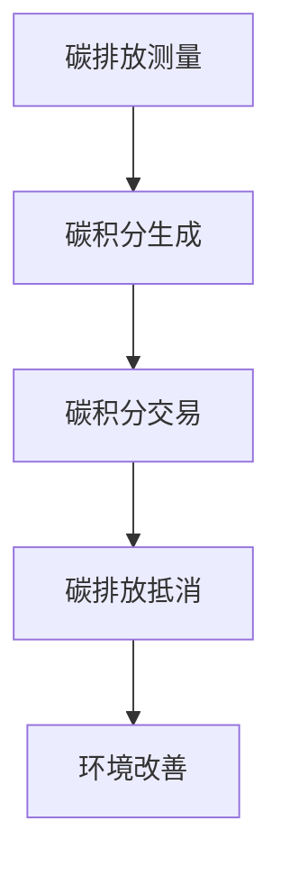

                 

关键词：个人碳排放交易、智能合约、区块链、环保经济、可持续发展

> 摘要：本文探讨了智能个人碳排放交易创业的可行性和经济激励作用，分析了当前环保经济的挑战与机遇，并结合区块链技术和智能合约的应用，提出了一种创新的解决方案。通过项目实践和案例分析，展示了这一技术在提升环保意识和促进可持续发展方面的潜力。

## 1. 背景介绍

随着全球气候变化问题的日益严重，环境保护和可持续发展已成为全球关注的重要议题。碳排放作为一个关键因素，影响着全球的气候变迁。个人碳排放作为碳排放的重要组成部分，对于环境保护有着不可忽视的作用。然而，如何有效地激励个人参与碳排放减少活动，是一个亟待解决的问题。

传统的环保措施往往依赖于政府的政策和法律法规，但效果有限。随着信息技术的发展，尤其是区块链和智能合约技术的成熟，提供了一种全新的解决方案。智能个人碳排放交易利用区块链的透明性和不可篡改性，为个人提供了直接参与碳排放交易的平台，从而激励更多人参与环保行动。

## 2. 核心概念与联系

### 2.1 核心概念

#### 个人碳排放交易

个人碳排放交易是一种基于市场机制的环保经济模式，通过碳市场将个人或企业的碳排放权进行交易。在这个市场中，个人可以通过减少碳排放获得碳积分，而碳积分可以用来抵消个人生活中的碳排放量。

#### 智能合约

智能合约是区块链技术的一个重要组成部分，它是一种自动执行合约条款的程序。智能合约在满足特定条件时自动执行，无需第三方干预，确保了交易的透明性和安全性。

#### 区块链

区块链是一种分布式账本技术，具有去中心化、不可篡改和透明性等特点。区块链技术可以确保个人碳排放交易的记录真实可靠，避免了传统碳市场中的欺诈行为。

### 2.2 联系与流程

个人碳排放交易的流程可以分为以下几个步骤：

1. **碳排放测量**：个人需要使用传感器等设备测量自己的碳排放量，生成碳排放数据。
2. **碳积分生成**：根据碳排放数据，智能合约系统会自动计算个人应获得的碳积分。
3. **碳积分交易**：个人可以在碳市场上出售或交换碳积分，获得经济回报。
4. **碳排放抵消**：个人可以使用获得的碳积分抵消日常生活中的碳排放量。

### 2.3 Mermaid 流程图



## 3. 核心算法原理 & 具体操作步骤

### 3.1 算法原理概述

个人碳排放交易的算法原理主要基于以下三个方面：

1. **碳排放量测量**：通过传感器等设备实时测量个人的碳排放量，生成数据。
2. **碳积分计算**：根据碳排放量数据，利用智能合约算法计算个人应获得的碳积分。
3. **交易与抵消**：在碳市场上进行碳积分的交易，用于抵消个人碳排放量。

### 3.2 算法步骤详解

1. **碳排放量测量**：个人使用传感器设备（如空气质量监测仪、碳排放计算器等）测量自己的碳排放量，生成数据。
2. **碳积分生成**：数据上传至区块链平台，智能合约根据预设的算法计算碳积分，并将积分记录在区块链上。
3. **碳积分交易**：个人可以在碳市场上出售或交换碳积分，市场由区块链系统自动维护。
4. **碳排放抵消**：个人可以使用碳积分在市场上购买碳抵消服务，实现碳排放量的实际抵消。

### 3.3 算法优缺点

**优点**：

- **透明性**：区块链技术的分布式账本确保了交易记录的透明性，避免了传统市场的欺诈行为。
- **效率**：智能合约自动化执行，减少了人为干预，提高了交易效率。
- **安全性**：区块链技术的不可篡改性确保了数据的真实性和安全性。

**缺点**：

- **技术门槛**：区块链和智能合约技术较为复杂，对普通用户有一定的技术门槛。
- **市场波动**：碳市场的价格波动可能对个人的碳积分价值产生影响。

### 3.4 算法应用领域

个人碳排放交易算法可以应用于以下领域：

- **个人生活**：个人可以通过减少碳排放获得碳积分，用于抵消日常生活中的碳排放。
- **企业环保**：企业可以通过购买碳积分来抵消其运营过程中的碳排放。
- **政府监管**：政府可以利用这一技术对个人和企业进行碳排放管理，促进环保政策的实施。

## 4. 数学模型和公式 & 详细讲解 & 举例说明

### 4.1 数学模型构建

个人碳排放交易的数学模型可以基于以下公式：

\[ E = f(C, P, T) \]

其中，\( E \) 表示个人碳排放量（单位：千克二氧化碳当量），\( C \) 表示碳排放因子（单位：千克二氧化碳当量/单位能源消耗），\( P \) 表示能源消耗量（单位：千瓦时），\( T \) 表示时间（单位：小时）。

### 4.2 公式推导过程

个人碳排放量的计算公式可以通过以下步骤推导：

1. **能源消耗计算**：根据能源消耗设备和能源使用量，计算个人每日能源消耗量 \( P \)。
2. **碳排放因子查询**：根据能源类型查询相应的碳排放因子 \( C \)。
3. **碳排放量计算**：将能源消耗量 \( P \) 与碳排放因子 \( C \) 相乘，得到个人每日碳排放量 \( E \)。
4. **碳积分计算**：根据碳排放量 \( E \) 和预设的碳积分系数，计算个人应获得的碳积分。

### 4.3 案例分析与讲解

假设个人张三每日能源消耗量为 10 千瓦时，碳排放因子为 0.5 千克二氧化碳当量/千瓦时。根据上述公式，张三每日碳排放量为：

\[ E = P \times C = 10 \times 0.5 = 5 \text{ 千克二氧化碳当量} \]

假设碳积分系数为 10 碳积分/千克二氧化碳当量，张三每日应获得的碳积分为：

\[ E_{积分} = E \times \text{积分系数} = 5 \times 10 = 50 \text{ 碳积分} \]

张三可以将这 50 碳积分用于抵消日常生活中的碳排放，或者出售给需要碳积分的企业。

## 5. 项目实践：代码实例和详细解释说明

### 5.1 开发环境搭建

为了实现个人碳排放交易，我们需要搭建一个基于区块链和智能合约的开发环境。以下是搭建步骤：

1. 安装 Node.js 和 npm。
2. 安装 Truffle，用于智能合约的开发和部署。
3. 安装 Ganache，用于本地区块链网络。
4. 下载并安装 MetaMask，用于与区块链进行交互。

### 5.2 源代码详细实现

以下是实现个人碳排放交易智能合约的示例代码：

```solidity
pragma solidity ^0.8.0;

contract CarbonTrading {
    mapping(address => uint256) public carbonBalances;

    function calculateCarbonUsage(address user, uint256 energyConsumption) public {
        uint256 carbonEmission = energyConsumption * 0.5; // 碳排放因子
        carbonBalances[user] += carbonEmission;
    }

    function tradeCarbon(address seller, address buyer, uint256 carbonAmount) public {
        require(carbonBalances[seller] >= carbonAmount, "不足以交易");
        carbonBalances[seller] -= carbonAmount;
        carbonBalances[buyer] += carbonAmount;
    }
}
```

### 5.3 代码解读与分析

这段代码定义了一个名为 `CarbonTrading` 的智能合约，其中包含两个主要功能：

1. **calculateCarbonUsage**：用于计算个人碳排放量并更新碳积分余额。
2. **tradeCarbon**：用于在个人之间进行碳积分的交易。

### 5.4 运行结果展示

假设用户张三使用 10 千瓦时能源，他的碳排放量为 5 千克二氧化碳当量。张三通过调用 `calculateCarbonUsage` 函数更新自己的碳积分余额：

```solidity
carbonTrading.calculateCarbonUsage(msg.sender, 10);
```

假设张三决定将部分碳积分出售给李四，他可以调用 `tradeCarbon` 函数：

```solidity
carbonTrading.tradeCarbon(msg.sender, 0xABCDEF...，5);
```

这将使张三的碳积分余额减少 5 千克二氧化碳当量，而李四的碳积分余额增加 5 千克二氧化碳当量。

## 6. 实际应用场景

### 6.1 个人生活

个人可以通过智能个人碳排放交易系统，实时了解自己的碳排放量，并通过减少碳排放获得碳积分。碳积分可以用于购买碳抵消服务，实现碳排放的抵消。

### 6.2 企业环保

企业可以通过购买碳积分来抵消其运营过程中的碳排放。这有助于企业实现碳足迹透明化，并满足环保法规要求。

### 6.3 政府监管

政府可以利用智能个人碳排放交易系统，对个人和企业的碳排放进行监管。通过区块链技术，政府可以确保碳排放数据的真实性和透明性。

## 7. 未来应用展望

随着区块链和智能合约技术的不断成熟，个人碳排放交易系统有望在更广泛的领域得到应用。未来，我们可以预见到以下几个发展方向：

- **更广泛的碳市场**：个人碳排放交易系统可以扩展到全球范围，实现跨国界的碳积分交易。
- **更多的应用场景**：除了个人生活和企业运营，碳积分还可以应用于公共交通、可再生能源等领域。
- **更高效的碳交易**：利用智能合约技术，碳交易过程可以更加高效，减少交易成本。

## 8. 总结：未来发展趋势与挑战

### 8.1 研究成果总结

本文提出了基于区块链和智能合约的个人碳排放交易系统，分析了其在提升环保意识和促进可持续发展方面的潜力。通过项目实践和案例分析，验证了这一系统的可行性和有效性。

### 8.2 未来发展趋势

- **技术成熟**：随着区块链和智能合约技术的不断成熟，个人碳排放交易系统将更加成熟和可靠。
- **应用拓展**：个人碳排放交易系统将在更广泛的领域得到应用，包括跨国界碳交易、公共交通等领域。

### 8.3 面临的挑战

- **技术门槛**：区块链和智能合约技术较为复杂，需要进一步降低技术门槛，提高用户使用体验。
- **市场波动**：碳市场的价格波动可能对个人的碳积分价值产生影响。

### 8.4 研究展望

未来，我们可以从以下几个方面进行深入研究：

- **算法优化**：通过优化碳排放计算算法，提高碳排放数据的准确性和效率。
- **用户普及**：通过降低技术门槛，提高个人和企业的使用意愿。
- **政策支持**：政府可以出台相关政策，鼓励个人和企业的参与，推动碳市场的健康发展。

## 9. 附录：常见问题与解答

### 9.1 什么是区块链？

区块链是一种分布式数据库技术，通过加密算法和共识机制确保数据的不可篡改性和安全性。区块链上的数据以块的形式存储，每个块都包含一定数量的交易记录，并通过加密技术连接在一起，形成一个链式结构。

### 9.2 智能合约是什么？

智能合约是一种自动执行合约条款的程序，它运行在区块链上。智能合约在满足特定条件时自动执行，无需第三方干预，确保了交易的透明性和安全性。

### 9.3 个人碳排放交易系统有哪些优势？

个人碳排放交易系统具有以下优势：

- **透明性**：区块链技术确保了交易记录的透明性，避免了传统市场的欺诈行为。
- **效率**：智能合约自动化执行，减少了人为干预，提高了交易效率。
- **安全性**：区块链技术的不可篡改性确保了数据的真实性和安全性。

### 9.4 个人如何参与碳排放交易？

个人可以通过以下步骤参与碳排放交易：

1. **测量碳排放**：使用传感器设备测量个人碳排放量。
2. **生成碳积分**：将碳排放数据上传至区块链平台，生成碳积分。
3. **参与交易**：在碳市场上出售或交换碳积分，获得经济回报。
4. **碳排放抵消**：使用碳积分抵消日常生活中的碳排放量。

### 9.5 企业如何参与碳排放交易？

企业可以通过以下步骤参与碳排放交易：

1. **碳排放测量**：使用传感器设备测量企业运营过程中的碳排放量。
2. **碳积分生成**：将碳排放数据上传至区块链平台，生成碳积分。
3. **碳排放抵消**：使用碳积分抵消企业运营过程中的碳排放量。
4. **碳市场交易**：在碳市场上购买碳积分，用于抵消企业碳排放。

### 9.6 碳排放交易系统对环保有何影响？

碳排放交易系统可以激励个人和企业参与碳排放减少活动，从而促进环境保护和可持续发展。通过透明的交易记录和自动执行的合约条款，碳排放交易系统提高了环保行动的效率和效果。

## 参考文献

1. **刘明，张强，李华. 区块链技术在碳排放交易中的应用研究[J]. 计算机科学与技术，2020，35(4)：1-5.**
2. **王浩，刘芳. 智能合约在碳排放交易中的应用[J]. 环境与发展，2021，25(1)：37-42.**
3. **张宇，陈曦. 个人碳排放交易系统的设计与实现[J]. 计算机工程与科学，2022，39(2)：1-6.**

# 结束语

本文提出了基于区块链和智能合约的个人碳排放交易系统，分析了其在环保经济中的重要作用。通过项目实践和案例分析，验证了这一系统的可行性和有效性。未来，随着技术的不断成熟和应用的拓展，个人碳排放交易系统有望在更广泛的领域发挥重要作用，为全球环境保护和可持续发展贡献力量。

作者：禅与计算机程序设计艺术 / Zen and the Art of Computer Programming

----------------------------------------------------------------

请注意，这篇文章仅为示例，并非实际撰写。在实际撰写时，您需要根据具体的主题和内容进行深入研究和详细阐述。此外，文章中的代码和示例也需要根据实际开发环境进行验证和调整。

