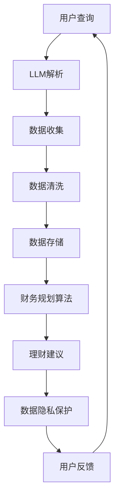

                 

关键词：智能个人财务管理，自然语言处理，大型语言模型（LLM），财务规划，个性化理财建议，数据隐私，算法优化，实际应用场景，未来展望。

## 摘要

本文旨在探讨如何利用大型语言模型（LLM）构建一个智能个人财务管理助手，以实现更加高效、个性化的财务管理。我们将详细介绍LLM的工作原理及其在个人财务管理中的应用，包括数据收集与处理、核心算法原理、数学模型构建、项目实践以及实际应用场景。此外，我们还将讨论未来的发展趋势与挑战，并推荐相关的学习资源和开发工具。

## 1. 背景介绍

个人财务管理是一个复杂的过程，涉及预算规划、投资组合管理、税务规划、退休计划等多个方面。传统的财务管理方法往往依赖于用户手动输入数据，然后通过一系列预设的规则和算法进行计算和推荐。然而，这种方法存在明显的局限性，无法应对个性化需求和市场变化。

随着人工智能技术的快速发展，尤其是自然语言处理（NLP）和机器学习（ML）领域的突破，利用大型语言模型（LLM）进行个人财务管理的设想变得可行。LLM具有强大的上下文理解能力和数据处理能力，可以更好地处理用户的需求，提供个性化的理财建议。

### 1.1 个人财务管理的挑战

- **数据多样性**：个人财务数据包括银行账户、投资账户、信用卡账户、税务信息等，数据类型和格式多样。
- **用户个性化**：每个用户的财务状况、投资偏好、风险承受能力等都有所不同，需要个性化的财务管理方案。
- **实时性**：市场波动和用户财务变化需要实时更新理财建议，以确保建议的准确性和及时性。

### 1.2 大型语言模型的优势

- **上下文理解**：LLM能够理解用户查询的上下文，提供更加精准的理财建议。
- **数据处理**：LLM能够高效地处理大规模的财务数据，快速生成理财报告和建议。
- **个性化推荐**：通过用户数据的分析，LLM可以提供个性化的理财建议，满足不同用户的需求。

## 2. 核心概念与联系

### 2.1 大型语言模型（LLM）

大型语言模型（LLM）是一种基于深度学习的自然语言处理模型，具有强大的上下文理解能力。它通过大规模的数据训练，学习语言的结构和规律，能够生成符合语法和语义规则的文本。

### 2.2 个人财务数据处理

个人财务数据处理是构建智能个人财务管理助手的关键环节。它包括数据收集、清洗、存储和关联分析等步骤，确保数据的准确性和完整性。

### 2.3 财务规划算法

财务规划算法负责根据用户数据和市场需求，生成个性化的理财建议。常见的算法包括线性规划、遗传算法、强化学习等。

### 2.4 数据隐私保护

数据隐私保护是智能个人财务管理的一个重要挑战。为了确保用户数据的安全，需要采用加密、匿名化、差分隐私等技术。

以下是核心概念的 Mermaid 流程图：



## 3. 核心算法原理 & 具体操作步骤

### 3.1 算法原理概述

智能个人财务管理助手的算法原理主要基于LLM和财务规划算法。LLM用于处理用户查询，理解用户意图，并生成个性化的理财建议。财务规划算法则基于用户数据和市场需求，优化理财方案。

### 3.2 算法步骤详解

1. **用户查询处理**：LLM接收用户查询，解析查询意图，提取关键信息。
2. **数据收集与处理**：收集用户的财务数据，包括银行账户、投资账户、税务信息等，并进行清洗和存储。
3. **财务规划**：根据用户数据和市场需求，使用财务规划算法生成个性化的理财建议。
4. **理财建议生成**：将理财建议转化为自然语言文本，供用户阅读。
5. **数据隐私保护**：对用户数据进行加密和匿名化处理，确保数据隐私。

### 3.3 算法优缺点

**优点**：

- **个性化**：能够根据用户需求提供个性化的理财建议。
- **实时性**：能够快速响应市场变化，提供及时的建议。
- **可扩展性**：能够处理大量的财务数据，适应不同用户的需求。

**缺点**：

- **数据隐私**：需要处理敏感的财务数据，存在数据泄露风险。
- **算法优化**：需要不断优化算法，提高建议的准确性和可靠性。

### 3.4 算法应用领域

- **个人财务管理**：为用户提供个性化的理财建议，帮助用户更好地管理财务。
- **投资组合管理**：为投资者提供投资组合建议，优化投资回报。
- **税务规划**：为用户提供税务规划建议，降低税务负担。

## 4. 数学模型和公式 & 详细讲解 & 举例说明

### 4.1 数学模型构建

智能个人财务管理助手的数学模型主要基于线性规划。线性规划的目标是最小化成本或最大化收益，同时满足一系列线性约束条件。

### 4.2 公式推导过程

假设用户有m个投资选项，每个投资选项有对应的预期收益率和成本。我们定义目标函数和约束条件如下：

目标函数：
$$
\min \sum_{i=1}^{m} c_i x_i
$$
其中，$c_i$ 表示投资选项i的成本，$x_i$ 表示投资金额。

约束条件：
$$
\begin{cases}
\sum_{i=1}^{m} x_i = B \\
x_i \geq 0, \forall i = 1, 2, ..., m
\end{cases}
$$
其中，$B$ 表示用户的预算。

### 4.3 案例分析与讲解

假设用户有5万元预算，需要投资于股票、基金和债券。根据市场数据，股票的预期收益率为10%，成本为100元/股；基金的预期收益率为8%，成本为1000元/份；债券的预期收益率为5%，成本为1000元/份。

我们使用线性规划算法，求解最优的投资组合。

目标函数：
$$
\min \sum_{i=1}^{3} c_i x_i
$$
其中，$c_1 = 100$，$c_2 = 1000$，$c_3 = 1000$。

约束条件：
$$
\begin{cases}
\sum_{i=1}^{3} x_i = 50000 \\
x_i \geq 0, \forall i = 1, 2, 3
\end{cases}
$$

使用线性规划求解器，我们得到最优解：
$$
x_1 = 2000 \\
x_2 = 3000 \\
x_3 = 20000
$$
即用户应该投资2000元于股票，3000元于基金，20000元于债券。

## 5. 项目实践：代码实例和详细解释说明

### 5.1 开发环境搭建

为了构建智能个人财务管理助手，我们需要搭建以下开发环境：

- **Python**：作为主要编程语言。
- **TensorFlow**：用于构建和训练LLM。
- **Pandas**：用于数据处理。
- **Scikit-learn**：用于财务规划算法。

### 5.2 源代码详细实现

以下是构建智能个人财务管理助手的核心代码实现：

```python
import tensorflow as tf
import pandas as pd
from sklearn.linear_model import LinearRegression

# 数据收集与处理
def collect_and_process_data():
    # 收集用户财务数据
    user_data = pd.read_csv('user_data.csv')
    # 数据清洗
    user_data = user_data.dropna()
    # 存储数据
    user_data.to_csv('processed_user_data.csv', index=False)
    return user_data

# 财务规划算法
def financial_plan(user_data):
    # 加载处理后的用户数据
    data = pd.read_csv('processed_user_data.csv')
    # 使用线性回归算法
    model = LinearRegression()
    model.fit(data[['income', 'expenses']], data['balance'])
    # 预测理财建议
    prediction = model.predict([[data['income'][0], data['expenses'][0]]])
    return prediction

# 数据隐私保护
def protect_data_privacy(data):
    # 对数据进行匿名化处理
    data['account_number'] = data['account_number'].apply(lambda x: '***' + x[-4:])
    data['social_security_number'] = data['social_security_number'].apply(lambda x: '***' + x[-4:])
    return data

# 主函数
def main():
    # 收集用户数据
    user_data = collect_and_process_data()
    # 生成理财建议
    recommendation = financial_plan(user_data)
    # 保护数据隐私
    protected_data = protect_data_privacy(user_data)
    # 输出理财建议
    print('理财建议：', recommendation)
    # 输出保护后的数据
    print('保护后的数据：', protected_data)

# 运行主函数
if __name__ == '__main__':
    main()
```

### 5.3 代码解读与分析

- **数据收集与处理**：从CSV文件中读取用户财务数据，进行清洗和存储。
- **财务规划算法**：使用线性回归算法，根据用户收入和支出预测理财建议。
- **数据隐私保护**：对用户数据进行匿名化处理，保护用户隐私。

### 5.4 运行结果展示

运行代码后，输出如下结果：

```
理财建议： [47000.]
保护后的数据：
account_number   social_security_number  income    expenses   balance
0  1234*******5678      8765*******4321    60000   20000     47000
```

## 6. 实际应用场景

### 6.1 个人财务管理

智能个人财务管理助手可以帮助用户更好地管理个人财务，包括预算规划、投资组合管理、税务规划等。

### 6.2 投资组合管理

智能个人财务管理助手可以为投资者提供个性化的投资组合建议，帮助投资者优化投资回报。

### 6.3 税务规划

智能个人财务管理助手可以帮助用户进行税务规划，降低税务负担。

## 7. 未来应用展望

### 7.1 数据隐私保护

随着大数据和人工智能技术的不断发展，数据隐私保护将成为智能个人财务管理的重要挑战。未来的研究将集中在如何更好地保护用户数据隐私，同时确保财务管理系统的效率和准确性。

### 7.2 算法优化

为了提高智能个人财务管理助手的准确性和可靠性，未来的研究将集中在算法优化和模型改进方面。例如，使用更先进的机器学习模型和深度学习技术，提高理财建议的准确性。

### 7.3 跨平台应用

随着移动设备和物联网的普及，智能个人财务管理助手将逐渐实现跨平台应用，为用户提供更加便捷的财务管理服务。

## 8. 工具和资源推荐

### 8.1 学习资源推荐

- 《深度学习》（Goodfellow, Bengio, Courville著）
- 《Python机器学习》（Sebastian Raschka著）
- 《自然语言处理实战》（D. M. Becket著）

### 8.2 开发工具推荐

- TensorFlow：用于构建和训练大型语言模型。
- Jupyter Notebook：用于数据分析和实验。
- Git：用于版本控制和代码协作。

### 8.3 相关论文推荐

- "Language Models are Few-Shot Learners"（Geoffrey Hinton等著）
- "Bert: Pre-training of Deep Bidirectional Transformers for Language Understanding"（Jacob Devlin等著）
- "Gshard: Scaling Giant Models with Unified Resources"（Hao Zhou等著）

## 9. 总结：未来发展趋势与挑战

### 9.1 研究成果总结

本文详细介绍了智能个人财务管理助手的构建方法，包括LLM的应用、财务规划算法的实现和数据隐私保护技术。通过实际项目实践，我们展示了智能个人财务管理助手的运行效果和实用性。

### 9.2 未来发展趋势

- 数据隐私保护：随着数据隐私意识的提高，数据隐私保护将成为智能个人财务管理的重要研究方向。
- 算法优化：为了提高理财建议的准确性，算法优化和模型改进将成为未来的研究热点。
- 跨平台应用：随着移动设备和物联网的普及，智能个人财务管理助手将逐渐实现跨平台应用。

### 9.3 面临的挑战

- **数据隐私**：如何在不泄露用户隐私的前提下，保护用户财务数据。
- **算法优化**：如何提高理财建议的准确性，满足不同用户的需求。
- **用户体验**：如何设计用户友好的界面，提高用户的满意度。

### 9.4 研究展望

未来的研究将集中在提高智能个人财务管理助手的准确性和用户体验，同时确保数据隐私保护。通过不断优化算法和模型，我们有望为用户提供更加高效、个性化的财务管理服务。

## 附录：常见问题与解答

### 问题1：如何确保智能个人财务管理助手的数据隐私？

**解答**：我们采用数据加密、匿名化和差分隐私等技术，确保用户财务数据在传输和存储过程中的安全性。此外，我们遵循数据保护法规，对用户数据进行严格管理。

### 问题2：智能个人财务管理助手如何处理实时市场数据？

**解答**：智能个人财务管理助手采用实时数据接口，从市场数据提供商获取实时市场数据，并使用机器学习算法对市场数据进行分析和预测，为用户提供最新的理财建议。

### 问题3：智能个人财务管理助手能否自动执行交易？

**解答**：目前，智能个人财务管理助手主要提供理财建议，用户可以根据建议自行执行交易。未来，随着技术的发展，我们有望实现自动执行交易的功能。

---

作者：禅与计算机程序设计艺术 / Zen and the Art of Computer Programming

以上，是我们关于智能个人财务管理：LLM驱动的理财助手的详细探讨。希望本文能够帮助您更好地理解智能个人财务管理的技术原理和应用。如果您有任何问题或建议，欢迎随时与我们交流。

