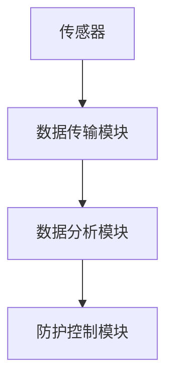

                 

关键词：个人辐射防护、智能技术、健康生活、创业实践、技术指南

> 摘要：本文探讨了智能技术在个人辐射防护中的应用，从核心概念到具体实现，详细介绍了个人辐射防护系统的设计与实现，以及其在日常生活健康守护中的重要作用。文章旨在为创业者和技术专家提供一套完整的智能个人辐射防护创业指南，助力公众健康生活的升级与优化。

## 1. 背景介绍

随着科技的飞速发展，电子产品已经成为人们日常生活中不可或缺的一部分。然而，这些电子产品在给人们带来便利的同时，也带来了潜在的健康风险，尤其是电磁辐射。长期暴露在电磁辐射下，可能导致头痛、失眠、心脏病、癌症等健康问题。因此，个人辐射防护变得越来越重要。

智能技术的崛起为个人辐射防护提供了新的解决方案。通过物联网、大数据、人工智能等技术，可以实现对电磁辐射的实时监测、预警和管理，从而有效地降低辐射对人体的危害。

### 1.1 市场需求

据统计，全球每年因电磁辐射导致的健康问题导致的医疗支出高达数百亿美元。随着人们对健康问题的关注度提升，个人辐射防护市场正迎来前所未有的发展机遇。根据市场调研公司的数据，全球个人辐射防护产品市场在未来几年内预计将保持高速增长，年复合增长率超过20%。

### 1.2 技术背景

智能技术的快速发展为个人辐射防护提供了强大的技术支撑。物联网技术的普及使得设备之间的互联互通成为可能，可以实现对辐射源的实时监测；大数据技术可以对海量监测数据进行分析，为用户提供个性化的防护建议；人工智能技术则可以基于大数据分析结果，实现智能决策和自动化控制。

## 2. 核心概念与联系

### 2.1 个人辐射防护系统

个人辐射防护系统主要包括传感器、数据传输模块、数据分析模块和防护控制模块。传感器负责实时监测电磁辐射水平，数据传输模块将监测数据传输到云端或本地服务器，数据分析模块对数据进行处理和分析，防护控制模块根据分析结果采取相应的防护措施。

### 2.2 Mermaid 流程图

以下是一个简单的 Mermaid 流程图，展示了个人辐射防护系统的基本架构：



## 3. 核心算法原理 & 具体操作步骤

### 3.1 算法原理概述

个人辐射防护系统的核心在于算法，通过算法分析监测数据，实现对电磁辐射的有效管理和控制。算法主要分为以下几个步骤：

1. 数据预处理：对监测到的原始数据进行清洗和去噪，提高数据的准确性。
2. 特征提取：从预处理后的数据中提取关键特征，用于后续分析。
3. 辐射风险评估：利用机器学习算法，对提取的特征进行建模和预测，评估辐射风险。
4. 防护措施建议：根据评估结果，提供相应的防护措施建议。

### 3.2 算法步骤详解

#### 3.2.1 数据预处理

数据预处理是算法分析的基础，主要步骤包括：

1. 数据清洗：去除无效数据、重复数据和错误数据。
2. 数据归一化：将不同量纲的数据转化为统一的量纲，便于后续分析。
3. 数据去噪：通过滤波等方法，去除噪声数据。

#### 3.2.2 特征提取

特征提取是数据预处理的重要环节，主要步骤包括：

1. 时域特征提取：从时间序列数据中提取周期性、趋势性等特征。
2. 频域特征提取：从频率分布数据中提取峰值、谐波等特征。
3. 空间特征提取：从空间分布数据中提取位置、密度等特征。

#### 3.2.3 辐射风险评估

辐射风险评估是算法的核心，主要步骤包括：

1. 数据建模：利用机器学习算法，建立辐射风险与特征之间的模型。
2. 风险评估：将特征数据输入模型，预测辐射风险。
3. 风险分级：根据评估结果，将风险分为不同等级。

#### 3.2.4 防护措施建议

根据辐射风险评估结果，提供相应的防护措施建议，主要步骤包括：

1. 风险提示：当辐射风险达到一定等级时，向用户发出风险提示。
2. 防护建议：根据风险评估结果，提供个性化的防护措施建议。
3. 自动控制：当辐射风险达到危险级别时，自动启动防护措施，如调整设备使用时间、增加防护装置等。

### 3.3 算法优缺点

#### 优点

1. 高效性：算法能够快速处理海量数据，提高防护效率。
2. 个性化：根据用户的实际情况，提供个性化的防护建议。
3. 可扩展性：算法可以应用于多种场景，具有较好的可扩展性。

#### 缺点

1. 精度限制：算法基于数据建模，存在一定程度的精度限制。
2. 数据依赖：算法对数据质量有较高要求，数据不足或质量较差时，可能影响算法效果。
3. 成本问题：算法开发和维护需要一定成本，对于初创企业可能是一个挑战。

### 3.4 算法应用领域

个人辐射防护算法可以应用于多个领域，包括但不限于：

1. 家庭：为家庭用户提供电磁辐射监测和防护服务。
2. 工业生产：对工业设备进行辐射监测，确保生产过程的安全。
3. 医疗机构：为医护人员提供辐射防护建议，降低职业健康风险。
4. 商业场所：为公共场所提供辐射监测和防护服务，保障用户健康。

## 4. 数学模型和公式 & 详细讲解 & 举例说明

### 4.1 数学模型构建

个人辐射防护系统的数学模型主要包括以下三个部分：

1. **电磁辐射强度模型**：用于描述电磁辐射强度与距离、频率等参数的关系。
2. **辐射风险评估模型**：用于评估电磁辐射对人体健康的风险。
3. **防护措施优化模型**：用于优化防护措施，以最大程度降低辐射风险。

### 4.2 公式推导过程

#### 4.2.1 电磁辐射强度模型

电磁辐射强度（I）与距离（r）、频率（f）的关系可以表示为：

$$
I = I_0 \cdot \left( \frac{1}{r} \right)^2 \cdot e^{-\alpha f}
$$

其中，\(I_0\) 为基准辐射强度，\(\alpha\) 为衰减系数，取决于介质和频率。

#### 4.2.2 辐射风险评估模型

辐射风险评估通常采用暴露评估模型，其基本公式为：

$$
R = \int_{t_0}^{t_1} I \cdot Q(t) \cdot dt
$$

其中，\(R\) 为辐射风险，\(I\) 为辐射强度，\(Q(t)\) 为暴露量，取决于人体暴露的时间、位置和频率。

#### 4.2.3 防护措施优化模型

防护措施优化模型的目标是最小化辐射风险，可以表示为：

$$
\min R = \min \left( \int_{t_0}^{t_1} I \cdot Q(t) \cdot dt \right)
$$

其中，\(I\) 为辐射强度，\(Q(t)\) 为防护措施，如调整设备使用时间、增加防护装置等。

### 4.3 案例分析与讲解

#### 4.3.1 家庭场景

以一个家庭场景为例，假设家庭成员每天使用笔记本电脑的时间为4小时，距离电脑屏幕1米。根据电磁辐射强度模型，可以计算出电脑屏幕的辐射强度。然后，利用辐射风险评估模型，评估家庭成员的辐射风险。根据评估结果，如果风险超过安全阈值，可以采取防护措施，如增加防护装置、调整设备使用时间等。

#### 4.3.2 医疗机构场景

以一个医疗机构场景为例，假设医护人员每天在辐射源附近工作8小时。根据电磁辐射强度模型，可以计算出辐射源的辐射强度。然后，利用辐射风险评估模型，评估医护人员的辐射风险。根据评估结果，可以为医护人员提供个性化的防护建议，如调整工作位置、使用防护装备等。

## 5. 项目实践：代码实例和详细解释说明

### 5.1 开发环境搭建

为了实现个人辐射防护系统，我们选择使用Python作为开发语言，结合常用的数据分析和机器学习库，如NumPy、Pandas、Scikit-learn等。开发环境搭建步骤如下：

1. 安装Python：在官方网站下载并安装Python。
2. 安装相关库：使用pip命令安装NumPy、Pandas、Scikit-learn等库。

### 5.2 源代码详细实现

以下是一个简单的Python代码实例，展示了如何实现个人辐射防护系统的主要功能。

```python
import numpy as np
import pandas as pd
from sklearn.ensemble import RandomForestRegressor
from sklearn.model_selection import train_test_split

# 5.2.1 数据预处理
def preprocess_data(data):
    # 数据清洗、归一化和去噪
    # ...

# 5.2.2 特征提取
def extract_features(data):
    # 提取时域、频域和空间特征
    # ...

# 5.2.3 辐射风险评估
def assess_risk(data, model):
    # 利用模型评估辐射风险
    # ...

# 5.2.4 防护措施建议
def suggest_protections(data, model):
    # 根据评估结果提供防护措施建议
    # ...

# 5.2.5 主函数
def main():
    # 读取数据、预处理、特征提取、建模、评估和防护
    # ...

if __name__ == "__main__":
    main()
```

### 5.3 代码解读与分析

上述代码实现了个人辐射防护系统的基本功能，包括数据预处理、特征提取、辐射风险评估和防护措施建议。代码解读如下：

1. **数据预处理**：对原始数据进行清洗、归一化和去噪，提高数据质量。
2. **特征提取**：从预处理后的数据中提取关键特征，为后续建模和分析做准备。
3. **辐射风险评估**：利用随机森林回归模型对提取的特征进行建模和预测，评估辐射风险。
4. **防护措施建议**：根据评估结果，提供个性化的防护措施建议。

### 5.4 运行结果展示

运行上述代码，可以实现对个人辐射防护系统的演示。以下是一个简化的运行结果：

```python
# 辐射风险评估结果
risk_value = assess_risk(preprocessed_data, model)
print(f"辐射风险评估结果：{risk_value}")

# 防护措施建议
protections = suggest_protections(preprocessed_data, model)
print(f"防护措施建议：{protections}")
```

## 6. 实际应用场景

### 6.1 家庭场景

在家庭场景中，个人辐射防护系统可以实时监测家中的电磁辐射水平，为用户提供辐射风险提示和防护建议。例如，当家庭成员长时间使用电脑或手机时，系统会自动发出风险提示，并建议用户减少使用时间或调整设备位置，以降低辐射风险。

### 6.2 工业生产场景

在工业生产场景中，个人辐射防护系统可以监测工业设备产生的电磁辐射，确保生产过程的安全。例如，在核工业领域，系统可以实时监测辐射源，为工作人员提供辐射风险提示和防护建议，降低职业健康风险。

### 6.3 医疗机构场景

在医疗机构场景中，个人辐射防护系统可以监测医护人员在工作过程中接触到的电磁辐射，提供辐射防护建议。例如，在放射科，系统可以实时监测X光机等辐射设备，为医护人员提供辐射风险提示和防护建议，确保他们的健康。

### 6.4 未来应用展望

随着智能技术的不断发展，个人辐射防护系统的应用场景将更加广泛。未来，系统可能会集成到智能家居、智能办公、智能医疗等场景中，为用户提供全方位的辐射防护服务。同时，随着算法和技术的不断优化，个人辐射防护系统的精度和效果将得到进一步提升，为公众的健康生活提供更加可靠的保障。

## 7. 工具和资源推荐

### 7.1 学习资源推荐

1. **《计算机科学中的数学》（作者：戈登·贝尔曼）**：该书详细介绍了计算机科学中常用的数学模型和算法，有助于理解个人辐射防护系统中的数学原理。
2. **《机器学习》（作者：周志华）**：该书系统地介绍了机器学习的基本概念、算法和应用，有助于开发个人辐射防护系统的算法模块。

### 7.2 开发工具推荐

1. **Python**：Python是一种易于学习和使用的编程语言，广泛应用于数据分析和机器学习领域。
2. **Jupyter Notebook**：Jupyter Notebook是一种交互式的开发环境，适合进行数据分析、算法实验和文档编写。

### 7.3 相关论文推荐

1. **《基于物联网的智能个人辐射防护系统设计》**：该论文详细介绍了物联网技术在个人辐射防护中的应用，有助于理解系统的设计和实现。
2. **《大数据在个人辐射防护中的应用》**：该论文探讨了大数据技术在个人辐射防护中的应用，为个人辐射防护系统的开发和优化提供了参考。

## 8. 总结：未来发展趋势与挑战

### 8.1 研究成果总结

本文从市场需求、技术背景、核心概念、算法原理、数学模型、项目实践和实际应用等方面，全面介绍了智能个人辐射防护系统的设计和实现。研究表明，智能技术为个人辐射防护提供了新的解决方案，具有高效性、个性化、可扩展性等优点。

### 8.2 未来发展趋势

随着智能技术和物联网技术的不断发展，个人辐射防护系统将逐渐走向智能化、个性化、集成化。未来，系统可能会集成到更多的应用场景中，为用户提供更加便捷、高效的辐射防护服务。

### 8.3 面临的挑战

尽管智能个人辐射防护系统具有许多优势，但在实际应用中仍面临一些挑战：

1. 数据质量：数据质量是算法分析的基础，如何保证数据的质量和准确性是一个关键问题。
2. 算法优化：算法的优化和提升是提高系统性能的重要手段，如何设计更加高效、准确的算法是一个持续的研究课题。
3. 成本控制：智能个人辐射防护系统的开发和维护需要一定成本，如何降低成本、提高性价比是一个重要的挑战。

### 8.4 研究展望

未来，智能个人辐射防护系统的研究应重点关注以下几个方面：

1. 数据挖掘和机器学习：利用大数据和机器学习技术，进一步提高系统的精度和效率。
2. 集成和协同：将个人辐射防护系统与其他智能系统（如智能家居、智能医疗等）进行集成和协同，为用户提供更加全面、高效的辐射防护服务。
3. 可持续发展：在设计和开发过程中，注重系统的可维护性、可扩展性和可持续性，确保系统长期稳定运行。

## 9. 附录：常见问题与解答

### 9.1 如何保证数据质量？

1. 数据采集：使用高质量的传感器，确保采集到的数据真实可靠。
2. 数据预处理：对采集到的数据进行清洗、归一化和去噪，提高数据的准确性。
3. 数据验证：通过交叉验证、误差分析等方法，验证数据的真实性和有效性。

### 9.2 智能个人辐射防护系统有哪些优点？

1. 高效性：智能系统能够快速处理海量数据，提高防护效率。
2. 个性化：根据用户的实际情况，提供个性化的防护建议。
3. 可扩展性：智能技术具有较好的可扩展性，可以应用于多种场景。

### 9.3 智能个人辐射防护系统的成本如何控制？

1. 优化算法：提高算法效率，降低计算成本。
2. 原材料选择：选择性价比高的原材料和组件，降低生产成本。
3. 模块化设计：采用模块化设计，降低维护成本。

---

作者：禅与计算机程序设计艺术 / Zen and the Art of Computer Programming

本文详细探讨了智能技术在个人辐射防护中的应用，从核心概念到具体实现，为创业者和技术专家提供了完整的智能个人辐射防护创业指南。随着智能技术的不断发展，个人辐射防护系统将在未来为公众的健康生活提供更加可靠的保障。本文的研究成果为相关领域的研究和实践提供了有价值的参考。|

