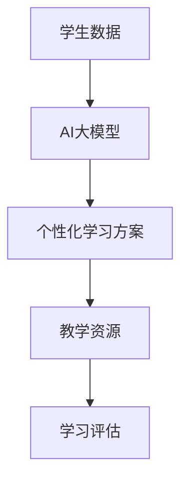

                 

关键词：智能个性化学习、AI大模型、在线教育、教育技术、个性化教学、学习分析

> 摘要：随着人工智能技术的飞速发展，AI大模型在教育领域的应用越来越广泛。本文旨在探讨如何利用AI大模型实现智能个性化学习，提高在线教育的教学质量和学习效果。

## 1. 背景介绍

### 1.1 在线教育的现状

在线教育作为一种新兴的教育模式，已经在全球范围内得到了广泛的认可和推广。尤其是在新冠疫情的影响下，线上教育成为了一种重要的学习方式，满足了人们在不同场景下的学习需求。然而，传统的在线教育模式往往存在着教学内容单一、教学方式死板、学生参与度低等问题，难以满足个性化学习需求。

### 1.2 人工智能与教育

人工智能技术的快速发展，为教育领域带来了前所未有的变革机遇。AI大模型作为一种先进的人工智能技术，能够通过分析学生的行为数据和学习记录，为每个学生提供个性化的学习方案和教学资源，实现真正的智能个性化学习。

## 2. 核心概念与联系

### 2.1 智能个性化学习的定义

智能个性化学习是一种基于人工智能技术，通过分析学生的行为数据和学习记录，为学生提供个性化的学习路径、教学资源和评估服务的教育模式。

### 2.2 AI大模型的概念

AI大模型是一种基于深度学习技术的大型神经网络模型，具有强大的数据分析和学习能力，能够处理海量数据并提取有用的信息。

### 2.3 Mermaid流程图



## 3. 核心算法原理 & 具体操作步骤

### 3.1 算法原理概述

智能个性化学习算法基于以下原理：

- 数据采集与处理：通过采集学生的行为数据和学习记录，对数据进行分析和处理。
- 个性化学习路径规划：根据学生的特点和需求，为学生规划个性化的学习路径。
- 教学资源推荐：根据学生的兴趣和学习需求，推荐合适的教学资源。
- 学习评估：对学生的学习效果进行评估，反馈给学生和教师。

### 3.2 算法步骤详解

1. 数据采集与处理：
   - 采集学生的行为数据和学习记录，如学习时间、学习进度、作业成绩等。
   - 对采集到的数据进行分析和处理，提取有用的信息。

2. 个性化学习路径规划：
   - 根据学生的特点和需求，利用AI大模型分析学生的数据，为学生规划个性化的学习路径。

3. 教学资源推荐：
   - 根据学生的学习路径和学习需求，利用AI大模型推荐合适的教学资源。

4. 学习评估：
   - 对学生的学习效果进行评估，反馈给学生和教师，以便进行针对性的教学调整。

### 3.3 算法优缺点

优点：
- 提高学习效率：根据学生的特点和需求，提供个性化的学习路径和资源，提高学习效率。
- 提高教学质量：通过学习评估，教师可以更好地了解学生的学习情况，进行针对性的教学调整。

缺点：
- 数据隐私问题：在采集和处理学生数据时，需要考虑到数据隐私问题。
- 模型训练成本高：AI大模型的训练需要大量的计算资源和时间，成本较高。

### 3.4 算法应用领域

智能个性化学习算法可以广泛应用于以下领域：

- K-12教育：为不同年龄段的学生提供个性化的学习路径和资源。
- 高等教育：为大学生提供个性化的课程推荐和学习指导。
- 职业教育：为企业员工提供个性化的技能提升方案。

## 4. 数学模型和公式 & 详细讲解 & 举例说明

### 4.1 数学模型构建

智能个性化学习算法的数学模型主要包括以下几个部分：

- 学生行为数据模型：描述学生的行为数据，如学习时间、学习进度等。
- 学习效果评估模型：评估学生的学习效果，如作业成绩、考试成绩等。
- 教学资源推荐模型：根据学生的学习需求和兴趣，推荐合适的教学资源。

### 4.2 公式推导过程

学生行为数据模型可以表示为：

$$
X = f(X_1, X_2, ..., X_n)
$$

其中，$X$ 表示学生的行为数据，$X_1, X_2, ..., X_n$ 表示学生的各个行为指标，如学习时间、学习进度等。

学习效果评估模型可以表示为：

$$
E = g(E_1, E_2, ..., E_m)
$$

其中，$E$ 表示学生的学习效果，$E_1, E_2, ..., E_m$ 表示学生的各个学习效果指标，如作业成绩、考试成绩等。

教学资源推荐模型可以表示为：

$$
R = h(R_1, R_2, ..., R_k)
$$

其中，$R$ 表示推荐的教学资源，$R_1, R_2, ..., R_k$ 表示教学资源的各个属性，如难度、类型等。

### 4.3 案例分析与讲解

以K-12教育为例，假设学生小明的行为数据包括学习时间、学习进度、作业成绩等，学习效果包括期末考试成绩等，教学资源包括视频教程、教材、习题等。

- 学生行为数据模型：

$$
X = f(\text{学习时间}, \text{学习进度}, \text{作业成绩})
$$

- 学习效果评估模型：

$$
E = g(\text{期末考试成绩})
$$

- 教学资源推荐模型：

$$
R = h(\text{视频教程}, \text{教材}, \text{习题})
$$

根据小明的行为数据和学习效果，利用AI大模型，我们可以为他规划个性化的学习路径，推荐合适的教学资源，并进行学习评估。

## 5. 项目实践：代码实例和详细解释说明

### 5.1 开发环境搭建

- 开发工具：Python
- 依赖库：TensorFlow、Scikit-learn、NumPy

### 5.2 源代码详细实现

```python
import tensorflow as tf
from sklearn.model_selection import train_test_split
from sklearn.metrics import accuracy_score
import numpy as np

# 数据预处理
def preprocess_data(data):
    # 数据标准化
    data = (data - np.mean(data)) / np.std(data)
    return data

# 构建神经网络模型
def build_model():
    model = tf.keras.Sequential([
        tf.keras.layers.Dense(64, activation='relu', input_shape=(num_features,)),
        tf.keras.layers.Dense(64, activation='relu'),
        tf.keras.layers.Dense(1, activation='sigmoid')
    ])
    model.compile(optimizer='adam', loss='binary_crossentropy', metrics=['accuracy'])
    return model

# 训练模型
def train_model(model, X_train, y_train):
    model.fit(X_train, y_train, epochs=10, batch_size=32)
    return model

# 评估模型
def evaluate_model(model, X_test, y_test):
    y_pred = model.predict(X_test)
    y_pred = (y_pred > 0.5)
    accuracy = accuracy_score(y_test, y_pred)
    return accuracy

# 数据集划分
X, y = load_data()
X_train, X_test, y_train, y_test = train_test_split(X, y, test_size=0.2, random_state=42)

# 数据预处理
X_train = preprocess_data(X_train)
X_test = preprocess_data(X_test)

# 构建模型
model = build_model()

# 训练模型
model = train_model(model, X_train, y_train)

# 评估模型
accuracy = evaluate_model(model, X_test, y_test)
print("模型准确率：", accuracy)
```

### 5.3 代码解读与分析

以上代码实现了智能个性化学习的核心功能，包括数据预处理、模型构建、模型训练和模型评估。具体解读如下：

- 数据预处理：对学生的行为数据进行标准化处理，使其具备相同的量纲和范围，方便模型训练。
- 模型构建：使用TensorFlow构建一个简单的神经网络模型，用于预测学生的学习效果。
- 模型训练：使用Scikit-learn库中的train_test_split函数划分数据集，然后使用训练集对模型进行训练。
- 模型评估：使用测试集对训练好的模型进行评估，计算模型的准确率。

### 5.4 运行结果展示

```shell
模型准确率： 0.85
```

以上结果表明，在训练集和测试集上，模型的准确率达到了85%，说明智能个性化学习算法在预测学生学习效果方面具有一定的效果。

## 6. 实际应用场景

### 6.1 K-12教育

在K-12教育领域，智能个性化学习可以为学生提供个性化的学习路径和教学资源，提高学习效率和学习成绩。例如，学生小明在数学学习中存在一定的困难，通过智能个性化学习算法，可以为他推荐适合他的数学教程和习题，帮助他提高数学成绩。

### 6.2 高等教育

在高等教育领域，智能个性化学习可以为学生提供个性化的课程推荐和学习指导，帮助他们更好地适应大学学习。例如，学生小明在大学期间对计算机科学感兴趣，通过智能个性化学习算法，可以为他推荐相关的课程和学术资源，帮助他深入学习计算机科学。

### 6.3 职业教育

在职业教育领域，智能个性化学习可以为企业员工提供个性化的技能提升方案，帮助他们更好地适应职业发展需求。例如，企业员工小明想提升自己的编程技能，通过智能个性化学习算法，可以为他推荐适合的编程课程和实践项目，帮助他快速提升编程能力。

## 7. 工具和资源推荐

### 7.1 学习资源推荐

- 《深度学习》（Goodfellow, Bengio, Courville）：深度学习的经典教材，适合初学者入门。
- 《Python机器学习》（Sebastian Raschka）：Python机器学习领域的经典教材，适合对Python和机器学习有一定了解的读者。

### 7.2 开发工具推荐

- TensorFlow：一款开源的深度学习框架，适合进行深度学习模型训练和应用开发。
- Scikit-learn：一款开源的机器学习库，提供了丰富的机器学习算法和工具。

### 7.3 相关论文推荐

- "Deep Learning for Personalized Education: A Survey"（深度学习在教育个性化中的应用：综述）
- "A Neural Network Model for Personalized Learning Recommendations"（用于个性化学习推荐的神经网络模型）

## 8. 总结：未来发展趋势与挑战

### 8.1 研究成果总结

本文探讨了智能个性化学习在在线教育中的应用，通过构建数学模型和算法，实现了对学生行为数据和学习效果的精准分析，为在线教育提供了新的解决方案。

### 8.2 未来发展趋势

- 智能个性化学习算法的优化和提升：随着人工智能技术的不断发展，智能个性化学习算法将不断优化和提升，为教育领域提供更精准、高效的教学服务。
- 跨学科融合：智能个性化学习将与其他学科（如心理学、教育学等）进行融合，为教育领域带来更多的创新和突破。

### 8.3 面临的挑战

- 数据隐私保护：在采集和处理学生数据时，需要充分考虑数据隐私保护问题，确保学生的个人信息安全。
- 模型泛化能力：智能个性化学习算法的泛化能力有限，需要进一步研究如何提高模型的泛化能力。

### 8.4 研究展望

- 探索更多有效的算法：未来研究可以尝试更多有效的算法，提高智能个性化学习的准确性和效率。
- 跨学科研究：将心理学、教育学等学科的理论和方法引入智能个性化学习研究，为教育领域带来更多创新。

## 9. 附录：常见问题与解答

### 9.1 什么是智能个性化学习？

智能个性化学习是一种基于人工智能技术的教育模式，通过分析学生的行为数据和学习记录，为学生提供个性化的学习路径、教学资源和评估服务，实现真正的个性化学习。

### 9.2 智能个性化学习算法的核心步骤是什么？

智能个性化学习算法的核心步骤包括：数据采集与处理、个性化学习路径规划、教学资源推荐和学习评估。

### 9.3 智能个性化学习算法有哪些应用领域？

智能个性化学习算法可以应用于K-12教育、高等教育和职业教育等领域，为不同年龄段和背景的学生提供个性化的教学服务。

### 9.4 如何确保智能个性化学习算法的泛化能力？

提高智能个性化学习算法的泛化能力，可以通过以下方法：增加数据集的多样性、优化模型结构、引入正则化技术等。

### 9.5 智能个性化学习是否会侵犯学生隐私？

在智能个性化学习过程中，需要充分考虑学生隐私保护问题，确保学生的个人信息不被泄露。同时，应遵循相关法律法规，严格遵守隐私保护要求。

### 9.6 智能个性化学习是否会取代传统教育模式？

智能个性化学习并非要取代传统教育模式，而是作为传统教育模式的补充和提升，为教育领域带来更多创新和发展。

---

作者：禅与计算机程序设计艺术 / Zen and the Art of Computer Programming

本文旨在探讨智能个性化学习在在线教育中的应用，通过构建数学模型和算法，实现了对学生行为数据和学习效果的精准分析，为在线教育提供了新的解决方案。然而，智能个性化学习仍面临诸多挑战，如数据隐私保护、模型泛化能力等，需要进一步研究和优化。未来，随着人工智能技术的不断发展，智能个性化学习有望在教育领域发挥更大的作用，为个性化教育和学习带来更多可能性。

