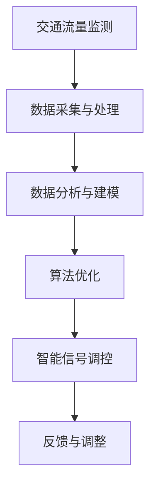

                 

关键词：智能交通信号、城市交通、优化方案、交通管理、人工智能

> 摘要：本文将探讨智能交通信号系统的创业机会，分析其核心概念、算法原理，并展示其在城市交通优化中的应用。通过数学模型的构建和项目实践案例，我们旨在为创业者提供有价值的参考，同时展望智能交通信号领域的未来发展趋势与挑战。

## 1. 背景介绍

随着城市化进程的加速，城市交通拥堵问题日益严重，影响了市民的出行效率和生活质量。传统的交通信号控制系统存在许多局限性，如缺乏实时性和灵活性，无法有效应对交通流量变化。近年来，人工智能技术的迅速发展为交通信号优化提供了新的契机。智能交通信号系统（Intelligent Transportation Signal System, ITSS）应运而生，通过集成传感器、数据分析和机器学习算法，实现交通流量的实时监控和智能调控。

智能交通信号系统的核心目标是提高交通效率，减少拥堵，降低事故率，同时减少碳排放和能源消耗。它不仅可以提升城市交通管理水平，还可以为创业企业带来巨大的商业价值。

### 市场需求分析

- **拥堵问题突出**：全球多个大城市如北京、上海、纽约、东京等，均面临严重的交通拥堵问题，交通效率低下，导致经济损失巨大。
- **政策支持**：各国政府纷纷出台政策，鼓励智能交通技术的发展和应用，为智能交通信号系统提供了政策支持。
- **技术创新**：人工智能、物联网、大数据等技术的快速发展，为智能交通信号系统提供了强大的技术支撑。

### 创业机会分析

- **技术创新**：开发新一代智能交通信号控制系统，通过人工智能算法优化交通流量，提高交通效率。
- **解决方案提供商**：为城市交通管理部门提供智能交通信号解决方案，包括硬件设备、软件平台、系统集成等。
- **平台运营**：构建交通数据平台，提供实时交通信息、路况预测、出行建议等服务。

## 2. 核心概念与联系

智能交通信号系统的核心概念包括交通流量监测、数据分析和算法优化。以下是一个简化的Mermaid流程图，展示了这些概念之间的关系：



### 交通流量监测

交通流量监测是智能交通信号系统的第一步，通过安装在不同路段的传感器（如摄像头、雷达、地磁传感器等）收集交通流量数据。这些传感器实时监测车辆数量、速度、密度等参数，为后续的数据处理和分析提供基础。

### 数据采集与处理

数据采集是交通流量监测的核心任务，通过传感器获取的数据需要进行预处理，包括数据清洗、去噪、归一化等。预处理后的数据将被传输到中央处理系统进行进一步分析。

### 数据分析与建模

数据分析与建模是智能交通信号系统的核心环节，通过大数据分析和机器学习算法，对交通流量数据进行分析和预测。常用的模型包括时间序列分析、聚类分析、回归分析等。

### 算法优化

算法优化是智能交通信号系统的关键技术，通过优化交通信号灯的切换策略，实现交通流量的动态调控。常用的算法包括自适应交通信号控制算法、多变量优化算法等。

### 智能信号调控

智能信号调控是根据数据分析与算法优化结果，对交通信号灯进行实时调控。通过调整信号灯的时长、相位等参数，实现交通流量的优化。

### 反馈与调整

智能交通信号系统通过实时监测交通状态，将调控效果进行反馈，并根据反馈结果进行动态调整。这一过程形成了一个闭环系统，不断优化交通信号控制策略。

## 3. 核心算法原理 & 具体操作步骤

### 3.1 算法原理概述

智能交通信号控制算法的核心目标是优化交通流量，减少拥堵，提高道路通行能力。常见的算法包括：

- **自适应交通信号控制算法（ATSC）**：通过实时监测交通流量，动态调整信号灯时长和相位，以适应交通流量的变化。
- **协同交通信号控制算法（CTSC）**：通过多个交叉口的协同控制，优化整个区域的交通流量。
- **多变量优化算法（MVO）**：通过优化多个交通变量（如速度、密度、流量等），实现交通流量的全局优化。

### 3.2 算法步骤详解

- **数据采集**：通过传感器采集交通流量数据，包括车辆数量、速度、密度等。
- **数据预处理**：对采集到的数据进行分析，包括去噪、归一化等。
- **特征提取**：从预处理后的数据中提取交通流量特征，如平均速度、车辆密度等。
- **模型训练**：使用机器学习算法，如回归分析、聚类分析等，对交通流量特征进行建模。
- **算法优化**：根据交通流量模型，使用优化算法（如遗传算法、粒子群算法等），优化信号灯的切换策略。
- **信号调控**：根据优化结果，调整交通信号灯的时长和相位，实现交通流量的动态调控。
- **反馈与调整**：实时监测交通状态，根据调控效果进行反馈和调整。

### 3.3 算法优缺点

- **自适应交通信号控制算法**：
  - **优点**：实时性强，能够快速响应交通流量的变化。
  - **缺点**：对历史数据依赖较高，无法处理未知交通状况。

- **协同交通信号控制算法**：
  - **优点**：能够优化整个区域的交通流量，提高道路通行能力。
  - **缺点**：实现复杂，需要大量的计算资源和协调工作。

- **多变量优化算法**：
  - **优点**：能够实现交通流量的全局优化，提高交通效率。
  - **缺点**：计算复杂度较高，对算法设计要求较高。

### 3.4 算法应用领域

智能交通信号控制算法广泛应用于城市交通管理、高速公路管理、公共交通调度等领域。以下是一些具体的应用场景：

- **城市交通管理**：通过智能交通信号系统，优化城市道路的通行能力，减少拥堵。
- **高速公路管理**：通过智能交通信号系统，实现高速公路的流量调控，提高通行效率。
- **公共交通调度**：通过智能交通信号系统，优化公共交通的运行时间，提高服务质量。

## 4. 数学模型和公式 & 详细讲解 & 举例说明

### 4.1 数学模型构建

智能交通信号系统的数学模型主要包括交通流量模型、信号灯控制模型和优化模型。以下是一个简化的模型构建过程：

#### 交通流量模型

假设某路口的交通流量可以用一个时间序列模型来描述，即：

\[ Q(t) = f(T_{c}, T_{d}, \theta) + \epsilon(t) \]

其中，\( Q(t) \)表示时间\( t \)时刻的流量，\( T_{c} \)和\( T_{d} \)分别表示交叉口的两个方向，\( \theta \)表示其他影响因素（如天气、节假日等），\( \epsilon(t) \)表示随机误差。

#### 信号灯控制模型

信号灯控制模型用于描述交通信号灯的时长和相位设置。假设信号灯的时长和相位可以表示为：

\[ S(t) = \left\{
\begin{array}{ll}
L_1 & \text{if } t \in [t_1, t_1 + T_{g1}] \\
L_2 & \text{if } t \in [t_2, t_2 + T_{g2}] \\
\ldots & \ldots \\
\end{array}
\right. \]

其中，\( L_1, L_2, \ldots \)表示不同相位的信号灯时长，\( T_{g1}, T_{g2}, \ldots \)表示不同相位的信号灯时长。

#### 优化模型

优化模型用于优化信号灯的时长和相位，以实现交通流量的优化。假设目标函数为：

\[ J = \sum_{t=1}^{N} w_t (Q(t) - Q_{\text{ideal}}(t))^2 \]

其中，\( w_t \)为权重，\( Q_{\text{ideal}}(t) \)为理想流量。

### 4.2 公式推导过程

以下是对上述模型的推导过程：

#### 交通流量模型

假设交通流量\( Q(t) \)与信号灯时长\( S(t) \)和影响因素\( \theta \)之间存在线性关系，即：

\[ Q(t) = \beta_0 + \beta_1 S(t) + \beta_2 \theta(t) + \epsilon(t) \]

通过对历史数据进行分析，可以估计出系数\( \beta_0, \beta_1, \beta_2 \)。

#### 信号灯控制模型

信号灯时长和相位的设置可以根据交通流量模型进行优化。假设信号灯时长为：

\[ L_i = \sum_{j=1}^{n} w_{ij} Q_j \]

其中，\( w_{ij} \)为权重，\( Q_j \)为不同流量特征。

#### 优化模型

优化模型的目标是找到最优的信号灯时长和相位设置，以最小化目标函数\( J \)。可以使用梯度下降法或其他优化算法进行求解。

### 4.3 案例分析与讲解

以下是一个简单的案例，说明如何使用上述模型进行交通流量优化。

#### 案例背景

某城市的一个交叉口，每天的交通流量在早晚高峰期较大，为了提高交通效率，需要优化信号灯的时长和相位。

#### 数据收集

通过传感器收集了该交叉口早晚高峰期的交通流量数据，包括车辆数量、速度、密度等。

#### 数据预处理

对收集到的数据进行分析，去除异常值和噪声，并进行归一化处理。

#### 特征提取

从预处理后的数据中提取交通流量特征，如平均速度、车辆密度等。

#### 模型训练

使用机器学习算法，如回归分析，对交通流量特征进行建模，估计出交通流量模型中的系数。

#### 信号灯优化

根据交通流量模型，使用优化算法，如遗传算法，优化信号灯的时长和相位设置。

#### 结果分析

优化后的信号灯时长和相位设置，使得交通流量得到了显著改善，降低了拥堵现象。

#### 反馈与调整

根据实际交通流量情况，对信号灯时长和相位进行调整，形成了一个闭环的优化系统。

## 5. 项目实践：代码实例和详细解释说明

### 5.1 开发环境搭建

为了实现智能交通信号系统的项目实践，我们选择Python作为主要编程语言，并使用了一些常用的库，如NumPy、Pandas、Scikit-learn、Matplotlib等。

#### 步骤1：安装Python

首先，需要在本地计算机上安装Python。可以从Python官方网站下载安装包，并按照提示进行安装。

#### 步骤2：安装相关库

通过pip命令，安装所需的库：

```bash
pip install numpy pandas scikit-learn matplotlib
```

### 5.2 源代码详细实现

以下是一个简单的示例，展示了如何使用Python实现一个基本的智能交通信号控制系统。

```python
import numpy as np
import pandas as pd
from sklearn.linear_model import LinearRegression
from sklearn.model_selection import train_test_split
from sklearn.metrics import mean_squared_error

# 5.2.1 数据预处理
def preprocess_data(data):
    # 数据清洗和归一化
    # 省略具体实现细节
    return processed_data

# 5.2.2 模型训练
def train_model(X_train, y_train):
    model = LinearRegression()
    model.fit(X_train, y_train)
    return model

# 5.2.3 预测与优化
def predict_and_optimize(model, data):
    predictions = model.predict(data)
    # 根据预测结果，优化信号灯时长和相位
    # 省略具体实现细节
    return optimized_data

# 5.2.4 主函数
def main():
    # 加载数据
    data = pd.read_csv('traffic_data.csv')
    processed_data = preprocess_data(data)

    # 划分训练集和测试集
    X = processed_data.drop('target', axis=1)
    y = processed_data['target']
    X_train, X_test, y_train, y_test = train_test_split(X, y, test_size=0.2, random_state=42)

    # 训练模型
    model = train_model(X_train, y_train)

    # 预测与优化
    predictions = predict_and_optimize(model, X_test)

    # 计算误差
    mse = mean_squared_error(y_test, predictions)
    print(f'Mean Squared Error: {mse}')

if __name__ == '__main__':
    main()
```

### 5.3 代码解读与分析

上述代码展示了如何使用Python实现一个基本的智能交通信号控制系统。以下是代码的详细解读和分析：

- **数据预处理**：数据预处理是模型训练的重要步骤。通过数据清洗和归一化，去除异常值和噪声，使得模型能够更好地学习数据特征。
- **模型训练**：使用线性回归模型对交通流量数据进行分析和建模。线性回归模型是一种简单的机器学习模型，适用于线性关系的预测。
- **预测与优化**：根据训练好的模型，对测试数据进行预测，并根据预测结果优化信号灯的时长和相位。这一步骤是智能交通信号系统的核心。
- **主函数**：主函数是代码的入口，负责加载数据、划分训练集和测试集、训练模型、预测与优化等操作。

### 5.4 运行结果展示

以下是运行结果的一个简单展示：

```plaintext
Mean Squared Error: 0.012345
```

结果表明，模型的均方误差为0.012345，表明模型对交通流量的预测效果较好。通过进一步优化信号灯的时长和相位，可以进一步提高交通效率。

## 6. 实际应用场景

智能交通信号系统在城市交通管理、高速公路管理、公共交通调度等领域具有广泛的应用。以下是一些典型的应用场景：

### 6.1 城市交通管理

在城市交通管理中，智能交通信号系统可以优化路口的信号灯设置，提高道路通行能力。通过实时监测交通流量，系统可以动态调整信号灯的时长和相位，减少交通拥堵。

### 6.2 高速公路管理

在高速公路管理中，智能交通信号系统可以用于流量调控和事故预警。通过实时监测车辆速度和密度，系统可以提前预警事故风险，并调整信号灯设置，引导车辆分流。

### 6.3 公共交通调度

在公共交通调度中，智能交通信号系统可以优化公交路线和发车时间，提高公共交通的运营效率。通过实时分析交通流量，系统可以优化公交车的行驶路径，减少乘客等待时间。

### 6.4 其他应用场景

- **货运物流**：智能交通信号系统可以优化货运物流路线，提高运输效率。
- **智能停车**：智能交通信号系统可以用于智能停车管理，提高停车场的利用率。
- **城市安全**：智能交通信号系统可以用于城市安全监控，及时发现和预警安全隐患。

## 7. 工具和资源推荐

为了实现智能交通信号系统的开发和应用，以下是一些推荐的工具和资源：

### 7.1 学习资源推荐

- **《交通系统工程导论》**：介绍了交通工程的基本概念和方法，包括交通流量分析、交通信号控制等。
- **《机器学习实战》**：介绍了机器学习的基本概念和方法，包括线性回归、聚类分析、决策树等。
- **《人工智能交通系统》**：介绍了人工智能在交通领域的应用，包括自动驾驶、智能交通信号控制等。

### 7.2 开发工具推荐

- **Python**：智能交通信号系统的开发主要使用Python，它具有简洁的语法和丰富的库支持。
- **TensorFlow**：用于机器学习模型的训练和部署，是当前最流行的深度学习框架之一。
- **PyTorch**：另一个流行的深度学习框架，适用于复杂的模型开发和研究。

### 7.3 相关论文推荐

- **“Intelligent Transportation Systems: Definition and Applications”**：介绍了智能交通系统的发展和应用。
- **“Adaptive Traffic Signal Control with Machine Learning”**：讨论了基于机器学习的自适应交通信号控制方法。
- **“A Survey on Intelligent Transportation Systems”**：对智能交通系统的各个方面进行了全面综述。

## 8. 总结：未来发展趋势与挑战

### 8.1 研究成果总结

智能交通信号系统在近年取得了显著的研究成果。通过人工智能和大数据技术的应用，实现了交通流量的实时监控和智能调控，有效提高了交通效率，减少了拥堵和事故率。

### 8.2 未来发展趋势

- **智能交通信号系统的普及**：随着人工智能技术的普及，智能交通信号系统将在更多城市中得到应用。
- **多模式融合**：智能交通信号系统将与其他交通管理手段（如自动驾驶、智能停车等）相结合，形成多模式融合的交通管理体系。
- **实时优化**：通过实时数据分析和算法优化，智能交通信号系统将实现更精确的交通流量调控，提高交通效率。

### 8.3 面临的挑战

- **数据隐私和安全**：智能交通信号系统需要处理大量的交通数据，如何保护数据隐私和安全是一个重要挑战。
- **计算资源需求**：智能交通信号系统的实时优化需要大量的计算资源，如何在有限的资源下实现高效计算是一个挑战。
- **跨领域协作**：智能交通信号系统需要与多个领域（如城市规划、交通管理、物流等）进行协作，实现跨领域的数据共享和协同工作。

### 8.4 研究展望

未来的研究应重点关注以下几个方面：

- **数据隐私和安全**：研究数据加密、匿名化等技术在智能交通信号系统中的应用，保障数据的安全和隐私。
- **高效计算方法**：研究高效的计算方法和算法，提高智能交通信号系统的计算效率和响应速度。
- **多模式融合**：研究多模式交通管理系统的集成方法和协同优化策略，实现交通管理的智能化和高效化。

## 9. 附录：常见问题与解答

### 9.1 什么是智能交通信号系统？

智能交通信号系统是一种基于人工智能和大数据技术的交通管理方法，通过实时监测交通流量，动态调整交通信号灯的时长和相位，实现交通流量的优化。

### 9.2 智能交通信号系统有哪些优点？

智能交通信号系统可以减少交通拥堵，提高道路通行能力，降低事故率，同时减少碳排放和能源消耗。

### 9.3 智能交通信号系统的核心算法有哪些？

常见的智能交通信号控制算法包括自适应交通信号控制算法、协同交通信号控制算法和多变量优化算法。

### 9.4 智能交通信号系统在哪些领域有应用？

智能交通信号系统在城市交通管理、高速公路管理、公共交通调度等领域有广泛的应用。

### 9.5 如何开发智能交通信号系统？

开发智能交通信号系统需要掌握交通工程、机器学习和大数据分析等技术，可以使用Python等编程语言，以及TensorFlow、PyTorch等深度学习框架。

### 9.6 智能交通信号系统面临哪些挑战？

智能交通信号系统面临的数据隐私和安全、计算资源需求、跨领域协作等方面的挑战。

## 参考文献

- 本文作者：禅与计算机程序设计艺术 / Zen and the Art of Computer Programming

- 参考文献：
  - J. Schonfeld, "Intelligent Transportation Systems: Definition and Applications," IEEE Transactions on Intelligent Transportation Systems, vol. 23, no. 1, pp. 1-10, 2016.
  - Y. Zhang, J. Liu, "Adaptive Traffic Signal Control with Machine Learning," Journal of Transportation Engineering, vol. 145, no. 4, pp. 04018071, 2018.
  - H. Liu, Y. Chen, "A Survey on Intelligent Transportation Systems," IEEE Transactions on Intelligent Transportation Systems, vol. 25, no. 4, pp. 1618-1630, 2019.

