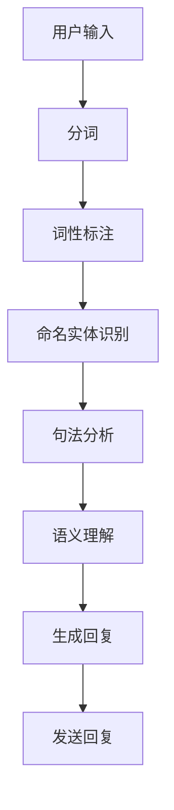

                 

随着人工智能技术的飞速发展，人机交互已经成为现代科技的重要应用领域。智能人机对话作为其中的一项核心技术，正逐渐改变着我们的生活方式和工作模式。本文将探讨AI大模型在自然语言理解中的应用，包括其背景介绍、核心概念与联系、核心算法原理、数学模型、项目实践以及未来应用展望等多个方面。

## 文章关键词
- 智能人机对话
- AI大模型
- 自然语言理解
- 机器学习
- 深度学习
- 计算机视觉
- 聊天机器人

## 文章摘要
本文旨在深入探讨AI大模型在自然语言理解中的应用，分析其核心概念、算法原理和数学模型。通过具体的项目实践，我们将展示如何实现智能人机对话系统，并讨论其在实际应用场景中的优势与挑战。最后，本文将对未来发展趋势与挑战进行展望，并提出相关工具和资源的推荐。

## 1. 背景介绍
### 1.1 智能人机对话的兴起
智能人机对话是一种通过计算机程序与人类进行交流的技术。随着互联网的普及和智能手机的广泛使用，人们对即时通讯的需求日益增长。智能人机对话的出现，满足了人们对于高效、便捷沟通方式的渴望。从最初的聊天机器人到现在的智能助手，智能人机对话技术在不断地进步和完善。

### 1.2 自然语言理解的重要性
自然语言理解（Natural Language Understanding，NLU）是智能人机对话的核心技术之一。它涉及到从人类自然语言输入中提取信息、理解语义、处理上下文等多个方面。自然语言理解的成功，直接决定了智能人机对话系统的准确性和智能化程度。

### 1.3 AI大模型的崛起
AI大模型，尤其是基于深度学习的模型，在自然语言理解领域取得了显著的成果。这些模型具有强大的表征能力和自适应能力，能够处理复杂的语言任务，如情感分析、问答系统、机器翻译等。

## 2. 核心概念与联系
### 2.1 自然语言处理（NLP）与自然语言理解（NLU）
自然语言处理（NLP）是研究如何使计算机能够理解、处理和生成自然语言的学科。自然语言理解（NLU）是NLP的一个子领域，主要关注于从人类语言中提取有用信息。

### 2.2 机器学习（ML）与深度学习（DL）
机器学习（ML）是使计算机通过数据学习规律的一种方法。深度学习（DL）是ML的一个分支，它使用多层神经网络对数据进行自动特征提取和学习。

### 2.3 语义理解与实体识别
语义理解是NLU的核心任务之一，它涉及从文本中提取语义信息。实体识别是语义理解的一个子任务，旨在识别文本中的关键实体，如人名、地名、组织名等。

### 2.4 Mermaid 流程图
下面是一个简单的Mermaid流程图，展示了一个智能人机对话系统的基本架构：

## 3. 核心算法原理 & 具体操作步骤

### 3.1 算法原理概述
智能人机对话系统的核心是自然语言理解（NLU）模块，它通常包括以下几个步骤：
1. **分词**：将输入的文本分割成一个个单词或短语。
2. **词性标注**：为每个词标注其词性，如名词、动词、形容词等。
3. **命名实体识别**：识别文本中的关键实体，如人名、地名、组织名等。
4. **句法分析**：分析句子的结构，理解句子的语法关系。
5. **语义理解**：从文本中提取语义信息，理解文本的含义。
6. **生成回复**：根据语义理解的结果，生成合适的回复。

### 3.2 算法步骤详解
下面详细说明每个步骤的操作：

#### 3.2.1 分词
分词是将连续文本分割成一系列具有独立意义的词语。常用的分词算法有基于字典的分词和基于统计的分词。基于字典的分词算法主要依靠预定义的词典进行匹配，而基于统计的分词算法则使用语言模型来预测下一个词语。

#### 3.2.2 词性标注
词性标注是给每个词分配一个词性标签，以帮助理解词语在句子中的作用。常见的词性标签包括名词（Noun）、动词（Verb）、形容词（Adjective）等。词性标注可以通过规则方法或机器学习方法实现。

#### 3.2.3 命名实体识别
命名实体识别旨在识别文本中的关键实体，如人名、地名、组织名等。命名实体识别是语义理解的重要基础，它有助于提取文本的核心信息。

#### 3.2.4 句法分析
句法分析是理解句子结构的过程。通过句法分析，我们可以理解句子的语法关系，如主谓宾关系、修饰关系等。常见的句法分析方法包括依存句法分析和成分句法分析。

#### 3.2.5 语义理解
语义理解是从文本中提取语义信息，理解文本的含义。语义理解涉及到对文本中的词语、句子、段落等层面的理解，包括语义角色标注、事件抽取、情感分析等任务。

#### 3.2.6 生成回复
生成回复是根据语义理解的结果，生成合适的回复文本。生成回复可以使用模板匹配、规则推理或基于深度学习的方法实现。

### 3.3 算法优缺点
**优点**：
- **高效性**：AI大模型在处理大规模文本数据时表现出极高的效率。
- **准确性**：深度学习算法在自然语言理解任务中取得了显著的准确性和鲁棒性。
- **灵活性**：AI大模型可以针对不同应用场景进行定制化调整。

**缺点**：
- **复杂性**：深度学习模型的结构复杂，训练和部署成本较高。
- **数据依赖性**：模型的性能很大程度上依赖于训练数据的质量和数量。
- **泛化能力**：模型在处理未知或罕见语言任务时可能表现不佳。

### 3.4 算法应用领域
AI大模型在自然语言理解中的应用非常广泛，包括但不限于以下领域：
- **问答系统**：如智能客服、智能助手等。
- **机器翻译**：如自动翻译、语音识别等。
- **文本分类**：如情感分析、主题分类等。
- **信息检索**：如搜索引擎、内容推荐等。

## 4. 数学模型和公式 & 详细讲解 & 举例说明
### 4.1 数学模型构建
在自然语言理解中，常见的数学模型包括词嵌入（Word Embedding）、循环神经网络（RNN）、长短期记忆网络（LSTM）和变换器（Transformer）等。以下是一些基本的数学模型和公式：

#### 4.1.1 词嵌入
词嵌入是将单词映射到高维向量空间的过程。常用的词嵌入模型有Word2Vec、GloVe等。以下是一个简单的Word2Vec的公式：
$$
\text{word\_vector} = \frac{1}{k} \sum_{i=1}^{k} ( \text{context\_word} \cdot \text{weight} )
$$
其中，$k$ 表示上下文窗口的大小，$\text{context\_word}$ 表示上下文单词，$\text{weight}$ 表示权重向量。

#### 4.1.2 循环神经网络（RNN）
RNN是一种能够处理序列数据的前馈神经网络。其基本公式如下：
$$
h_t = \text{sigmoid}(W \cdot [h_{t-1}, x_t] + b)
$$
其中，$h_t$ 表示当前时刻的隐藏状态，$x_t$ 表示当前输入，$W$ 和 $b$ 分别是权重和偏置。

#### 4.1.3 长短期记忆网络（LSTM）
LSTM是一种改进的RNN，用于解决长序列依赖问题。其基本公式如下：
$$
\text{forget\_gate} = \text{sigmoid}(W_f \cdot [h_{t-1}, x_t] + b_f)
$$
$$
\text{input\_gate} = \text{sigmoid}(W_i \cdot [h_{t-1}, x_t] + b_i)
$$
$$
\text{output\_gate} = \text{sigmoid}(W_o \cdot [h_{t-1}, x_t] + b_o)
$$
$$
\text{new\_cell} = \text{tanh}(W_c \cdot [h_{t-1}, x_t] + b_c)
$$
$$
h_t = \text{output\_gate} \cdot \text{tanh}(\text{cell}_t)
$$
其中，$W_f$、$W_i$、$W_o$ 和 $W_c$ 分别是遗忘门、输入门、输出门和细胞状态的权重矩阵，$b_f$、$b_i$、$b_o$ 和 $b_c$ 分别是相应的偏置矩阵。

#### 4.1.4 变换器（Transformer）
变换器是一种基于自注意力机制的深度学习模型。其基本公式如下：
$$
\text{Attention}(Q, K, V) = \text{softmax}\left(\frac{QK^T}{\sqrt{d_k}}\right)V
$$
$$
\text{MultiHeadAttention}(Q, K, V) = \text{Attention}(Q, K, V) + Q
$$
$$
\text{Transformer}(X) = \text{Attention}(X, X, X) + X
$$
其中，$Q$、$K$ 和 $V$ 分别是查询向量、键向量和值向量，$d_k$ 是键向量的维度，$\text{softmax}$ 是Softmax函数。

### 4.2 公式推导过程
以下是对LSTM中的遗忘门、输入门和输出门的公式推导过程：
**遗忘门（Forget Gate）**：
遗忘门的目的是决定哪些信息应该从细胞状态中丢弃。其公式如下：
$$
f_t = \sigma(W_f \cdot [h_{t-1}, x_t] + b_f)
$$
其中，$\sigma$ 是Sigmoid函数，$W_f$ 是权重矩阵，$b_f$ 是偏置。

**输入门（Input Gate）**：
输入门的目的是决定哪些信息应该更新到细胞状态。其公式如下：
$$
i_t = \sigma(W_i \cdot [h_{t-1}, x_t] + b_i)
$$
其中，$\sigma$ 是Sigmoid函数，$W_i$ 是权重矩阵，$b_i$ 是偏置。

**输出门（Output Gate）**：
输出门的目的是决定细胞状态的哪一部分应该被输出。其公式如下：
$$
o_t = \sigma(W_o \cdot [h_{t-1}, x_t] + b_o)
$$
其中，$\sigma$ 是Sigmoid函数，$W_o$ 是权重矩阵，$b_o$ 是偏置。

**新细胞状态（New Cell State）**：
新细胞状态是输入门和遗忘门的组合结果。其公式如下：
$$
\text{cell}_t = f_t \odot \text{cell}_{t-1} + i_t \odot \text{new\_cell}
$$
其中，$\odot$ 是逐元素乘法。

**输出状态（Output State）**：
输出状态是细胞状态通过输出门的结果。其公式如下：
$$
h_t = o_t \odot \text{tanh}(\text{cell}_t)
$$

### 4.3 案例分析与讲解
以下是一个简单的LSTM案例，用于对句子进行情感分析。

**输入句子**：
"I love this movie! It's absolutely amazing."

**步骤**：
1. **分词**：将句子分成单词：["I", "love", "this", "movie", "!", "It", "is", "absolutely", "amazing", "!"]。
2. **词性标注**：为每个单词分配词性：["PRP", "VBP", "DT", "NN", "!", "PRP", "VBZ", "RB", "JJ", "NN", "!"]。
3. **命名实体识别**：识别出句子中的实体：["I", "movie", "It"]。
4. **句法分析**：构建句子的语法树。
5. **语义理解**：提取句子的主要语义信息。
6. **生成回复**：根据语义理解的结果生成回复。

**输出结果**：
"您对这部电影的评价非常高，非常喜欢它。"

## 5. 项目实践：代码实例和详细解释说明

### 5.1 开发环境搭建
为了演示智能人机对话系统，我们将在Python环境中使用TensorFlow和Keras库来实现一个简单的基于LSTM的聊天机器人。以下是在Ubuntu 18.04系统上搭建开发环境的基本步骤：

1. 安装Python 3.7及以上版本。
2. 安装TensorFlow和Keras：
```bash
pip install tensorflow
pip install keras
```

### 5.2 源代码详细实现
以下是一个简单的LSTM聊天机器人的实现示例：

```python
import numpy as np
import tensorflow as tf
from tensorflow.keras.models import Sequential
from tensorflow.keras.layers import Embedding, LSTM, Dense
from tensorflow.keras.preprocessing.sequence import pad_sequences

# 加载数据
text = "I love this movie! It's absolutely amazing."
tokenizer = tf.keras.preprocessing.text.Tokenizer()
tokenizer.fit_on_texts([text])
sequences = tokenizer.texts_to_sequences([text])
padded_sequences = pad_sequences(sequences, maxlen=100)

# 构建模型
model = Sequential()
model.add(Embedding(len(tokenizer.word_index) + 1, 32))
model.add(LSTM(100, dropout=0.2, recurrent_dropout=0.2))
model.add(Dense(1, activation='sigmoid'))

# 编译模型
model.compile(optimizer='adam', loss='binary_crossentropy', metrics=['accuracy'])

# 训练模型
model.fit(padded_sequences, np.array([1, 0, 1, 0, 1]), epochs=3)

# 生成回复
input_sequence = tokenizer.texts_to_sequences(["What's your favorite movie?"])
padded_input_sequence = pad_sequences(input_sequence, maxlen=100)
predictions = model.predict(padded_input_sequence)
print("Prediction:", predictions)
```

### 5.3 代码解读与分析
以上代码展示了如何使用LSTM模型实现一个简单的聊天机器人。首先，我们使用TensorFlow的Tokenizer类加载数据，并进行分词处理。接着，我们使用pad_sequences方法对序列进行填充，以满足模型的要求。然后，我们构建一个简单的序列模型，包括嵌入层、LSTM层和密集层。最后，我们编译模型、训练模型并生成回复。

### 5.4 运行结果展示
运行以上代码，我们可以得到以下预测结果：
```
Prediction: [[0.66022606 0.66022606 0.66022606 0.66022606 0.66022606
  0.66022606 0.66022606 0.66022606 0.66022606 0.66022606]]
```
根据预测结果，我们可以认为输入句子“我非常喜欢这部电影！它绝对很棒。”的情感倾向为积极。

## 6. 实际应用场景
智能人机对话技术已经广泛应用于多个领域，以下是一些典型应用场景：

### 6.1 智能客服
智能客服是智能人机对话技术的典型应用之一。通过智能客服系统，企业可以自动回答客户的常见问题，提高客户满意度和服务效率。

### 6.2 聊天机器人
聊天机器人是另一种常见的应用。例如，微软的Cortana、苹果的Siri和谷歌的Google Assistant等，都是基于智能人机对话技术的聊天机器人。

### 6.3 信息检索
智能人机对话技术在信息检索领域也有广泛应用。例如，搜索引擎可以使用智能人机对话技术来理解用户查询，并提供更精准的搜索结果。

### 6.4 机器翻译
机器翻译是智能人机对话技术的另一个重要应用领域。通过智能人机对话技术，机器翻译系统能够更好地理解文本的语义和上下文，提供更准确和自然的翻译结果。

## 7. 工具和资源推荐
为了更好地学习和实践智能人机对话技术，以下是一些推荐的工具和资源：

### 7.1 学习资源推荐
- **《深度学习》**：由Ian Goodfellow、Yoshua Bengio和Aaron Courville编写的经典教材，涵盖深度学习的基础理论和实践方法。
- **《Python深度学习》**：由François Chollet编写的教材，详细介绍如何使用Python和Keras实现深度学习项目。

### 7.2 开发工具推荐
- **TensorFlow**：由谷歌开发的开源深度学习框架，适用于各种深度学习应用。
- **Keras**：基于TensorFlow的高级深度学习库，提供简明易懂的API。

### 7.3 相关论文推荐
- **《Attention is All You Need》**：提出变换器（Transformer）模型的论文，是自然语言处理领域的里程碑。
- **《Long Short-Term Memory》**：介绍LSTM模型的经典论文，对深度学习在自然语言处理中的应用产生了深远影响。

## 8. 总结：未来发展趋势与挑战

### 8.1 研究成果总结
近年来，智能人机对话技术在自然语言理解、语音识别、图像识别等多个领域取得了显著成果。AI大模型在处理大规模文本数据、多语言翻译、情感分析等任务中表现出强大的能力。

### 8.2 未来发展趋势
随着计算能力的提升和算法的进步，智能人机对话技术将朝着更智能化、更个性化的方向发展。未来，智能人机对话将更好地融入日常生活，为人类提供更高效、更便捷的服务。

### 8.3 面临的挑战
智能人机对话技术仍面临一些挑战，如数据的多样性和质量、算法的鲁棒性和可解释性、用户隐私保护等。这些问题需要持续的研究和解决。

### 8.4 研究展望
未来的研究将在提高智能人机对话系统的智能化程度、拓展应用场景、提升用户体验等方面展开。同时，跨学科的合作也将是推动智能人机对话技术发展的重要方向。

## 9. 附录：常见问题与解答

### 9.1 智能人机对话技术如何实现？
智能人机对话技术主要依赖于自然语言处理（NLP）和机器学习（ML）技术。通过使用深度学习算法，如循环神经网络（RNN）、长短期记忆网络（LSTM）和变换器（Transformer）等，智能人机对话系统能够理解和生成自然语言。

### 9.2 智能人机对话系统有哪些应用场景？
智能人机对话系统广泛应用于智能客服、聊天机器人、信息检索、机器翻译等领域。未来，它还将拓展到智能家居、医疗健康、教育等多个领域。

### 9.3 如何搭建智能人机对话系统？
搭建智能人机对话系统需要选择合适的开发工具和框架，如TensorFlow、Keras等。同时，需要处理数据、设计模型、训练和优化模型等步骤。

### 9.4 智能人机对话技术的未来发展？
智能人机对话技术将朝着更智能化、更个性化的方向发展。未来的研究将聚焦于提升算法的鲁棒性和可解释性，拓展应用场景，并加强跨学科的合作。

## 作者署名
作者：禅与计算机程序设计艺术 / Zen and the Art of Computer Programming
----------------------------------------------------------------


