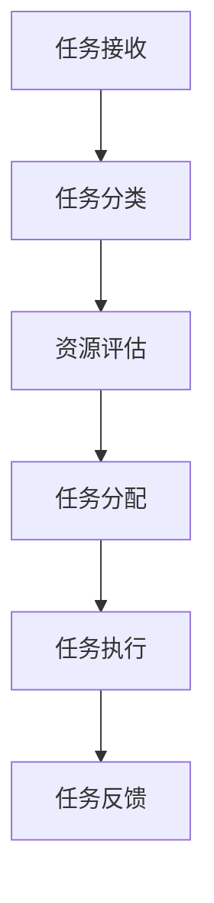
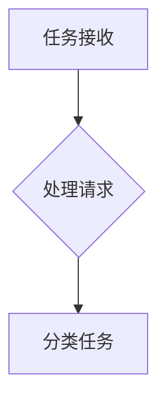
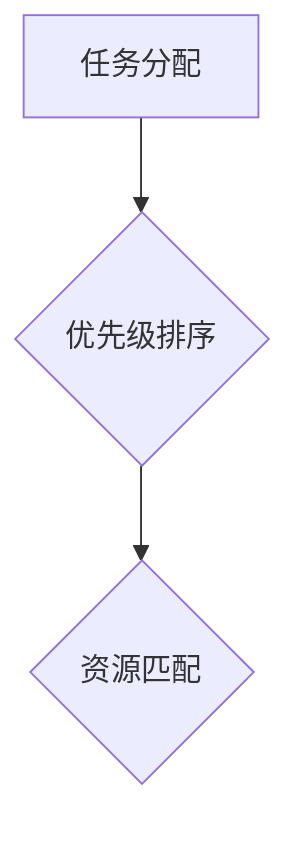

                 

关键词：任务分配，LLM，规划能力，算法原理，数学模型，应用场景，未来展望

> 摘要：本文深入探讨了基于大型语言模型（LLM）的任务分配规划能力，包括核心概念、算法原理、数学模型、应用场景和未来展望。通过详细阐述任务分配的流程和步骤，以及代码实例和运行结果，我们揭示了LLM在智能任务分配领域的强大潜力，并展望了其未来的发展趋势和挑战。

## 1. 背景介绍

在当今信息化社会中，任务分配是一个普遍存在的现象，尤其在复杂的计算机系统和人工智能领域。传统的任务分配方法主要依赖于预定义的规则和固定算法，但在面对复杂多变的环境时，其效率和适应性显得有限。随着深度学习和自然语言处理技术的发展，大型语言模型（LLM）在处理自然语言任务方面展现了卓越的能力，这为我们提供了一种全新的思路，即利用LLM的规划能力进行智能任务分配。

本文旨在探讨LLM在任务分配中的潜在应用，分析其核心概念、算法原理、数学模型，并通过实例验证其可行性。此外，本文还将讨论任务分配在不同应用场景中的实践，并展望LLM在未来智能任务分配领域的趋势和挑战。

## 2. 核心概念与联系

### 2.1 大型语言模型（LLM）

大型语言模型（LLM）是一种基于深度学习技术的自然语言处理模型，具有强大的语言理解和生成能力。LLM通过大量的文本数据进行预训练，从而能够理解和生成符合语言习惯的自然语言。

### 2.2 任务分配

任务分配是指将一组任务合理地分配给一组资源（如计算机节点、人工操作员等），以达到最优的执行效率和效果。在计算机科学中，任务分配通常涉及负载均衡、资源调度、任务优先级等问题。

### 2.3 规划能力

规划能力是指系统或模型在不确定环境中做出合理决策的能力，包括任务选择、资源分配、路径规划等。在任务分配中，规划能力至关重要，它决定了任务分配的效率和效果。

### 2.4 Mermaid 流程图

以下是任务分配中涉及的几个关键步骤的Mermaid流程图：



## 3. 核心算法原理 & 具体操作步骤

### 3.1 算法原理概述

LLM在任务分配中的核心算法原理主要基于其强大的语言理解和生成能力。具体步骤如下：

1. **任务接收**：系统接收外部输入的任务请求。
2. **任务分类**：根据任务的特点和需求，对任务进行分类。
3. **资源评估**：评估当前系统中可用的资源，包括计算机节点、人力资源等。
4. **任务分配**：根据任务分类和资源评估结果，将任务分配给最合适的资源。
5. **任务执行**：执行分配的任务，并监控任务的执行状态。
6. **任务反馈**：根据任务执行结果，对任务分配策略进行调整。

### 3.2 算法步骤详解

#### 3.2.1 任务接收

任务接收是任务分配的第一步，系统需要接收外部输入的任务请求。这些请求可以来自用户、其他系统或传感器等。任务请求通常包含任务的名称、描述、优先级等信息。



#### 3.2.2 任务分类

在任务接收后，系统需要对任务进行分类。分类的目的是为了更好地理解任务的特点和需求，从而为后续的任务分配提供依据。任务分类可以基于任务类型、任务优先级、任务紧急程度等因素。


#### 3.2.3 资源评估

资源评估是任务分配的重要环节，系统需要评估当前系统中可用的资源，包括计算机节点、人力资源、设备等。评估的目的是为了找到最适合执行任务的资源。


#### 3.2.4 任务分配

在资源评估后，系统需要根据任务分类和资源评估结果，将任务分配给最合适的资源。任务分配可以基于优先级、资源可用性、任务执行时间等因素。



#### 3.2.5 任务执行

任务执行是指系统将分配的任务提交给资源进行执行。任务执行过程中，系统需要监控任务的执行状态，包括任务进度、资源利用率、异常情况等。


#### 3.2.6 任务反馈

任务反馈是任务分配的最后一个步骤，系统需要根据任务执行结果，对任务分配策略进行调整。任务反馈可以基于任务完成质量、任务执行时间、资源利用率等因素。


### 3.3 算法优缺点

#### 优点

1. **高效性**：LLM在处理自然语言任务方面具有强大的能力，能够快速地对任务进行理解和分配。
2. **灵活性**：LLM可以根据任务的特点和需求，灵活地调整任务分配策略。
3. **智能性**：LLM具有智能决策能力，能够根据实时信息做出最优的任务分配决策。

#### 缺点

1. **计算资源消耗**：LLM的训练和推理需要大量的计算资源，对硬件设备的要求较高。
2. **数据依赖性**：LLM的性能受训练数据的影响较大，需要大量的高质量数据支持。
3. **解释性不足**：LLM的决策过程较为复杂，难以进行透明的解释。

### 3.4 算法应用领域

LLM在任务分配中的应用领域非常广泛，主要包括：

1. **云计算**：在云计算环境中，LLM可以用于优化资源调度和任务分配，提高资源利用率和服务质量。
2. **大数据**：在大数据处理中，LLM可以用于优化数据处理流程，提高数据处理效率和准确性。
3. **人工智能**：在人工智能系统中，LLM可以用于优化算法设计和任务分配，提高系统效率和智能性。

## 4. 数学模型和公式 & 详细讲解 & 举例说明

### 4.1 数学模型构建

在任务分配中，我们可以使用以下数学模型来描述任务分配的过程：

1. **任务集**：假设任务集为 \(T = \{t_1, t_2, ..., t_n\}\)，其中 \(t_i\) 表示第 \(i\) 个任务。
2. **资源集**：假设资源集为 \(R = \{r_1, r_2, ..., r_m\}\)，其中 \(r_j\) 表示第 \(j\) 个资源。
3. **任务优先级**：假设任务优先级为 \(P(t_i)\)，表示第 \(i\) 个任务的优先级。
4. **资源可用性**：假设资源可用性为 \(A(r_j)\)，表示第 \(j\) 个资源的可用性。

### 4.2 公式推导过程

基于上述数学模型，我们可以推导出任务分配的策略：

1. **任务分配策略**：假设任务分配策略为 \(f(T, R)\)，表示将任务集 \(T\) 分配给资源集 \(R\) 的方法。任务分配策略的目标是最大化任务完成率，即：

   $$ f(T, R) = \arg\max \frac{\sum_{i=1}^{n} P(t_i) \cdot A(r_j)}{\sum_{j=1}^{m} A(r_j)} $$

2. **资源分配策略**：假设资源分配策略为 \(g(R)\)，表示将资源集 \(R\) 分配给任务集 \(T\) 的方法。资源分配策略的目标是最大化资源利用率，即：

   $$ g(R) = \arg\max \frac{\sum_{j=1}^{m} A(r_j) \cdot P(t_i)}{\sum_{i=1}^{n} P(t_i)} $$

### 4.3 案例分析与讲解

假设我们有一个包含5个任务的系统，任务集 \(T = \{t_1, t_2, t_3, t_4, t_5\}\)，其中任务优先级为 \(P(t_1) = 0.5, P(t_2) = 0.3, P(t_3) = 0.2, P(t_4) = 0.1, P(t_5) = 0.1\)。系统中有3个资源，资源集 \(R = \{r_1, r_2, r_3\}\)，其中资源可用性为 \(A(r_1) = 0.8, A(r_2) = 0.9, A(r_3) = 0.7\)。

根据任务分配策略，我们可以计算出每个任务的优先级与资源可用性的乘积：

- \(P(t_1) \cdot A(r_1) = 0.5 \cdot 0.8 = 0.4\)
- \(P(t_1) \cdot A(r_2) = 0.5 \cdot 0.9 = 0.45\)
- \(P(t_1) \cdot A(r_3) = 0.5 \cdot 0.7 = 0.35\)
- \(P(t_2) \cdot A(r_1) = 0.3 \cdot 0.8 = 0.24\)
- \(P(t_2) \cdot A(r_2) = 0.3 \cdot 0.9 = 0.27\)
- \(P(t_2) \cdot A(r_3) = 0.3 \cdot 0.7 = 0.21\)
- \(P(t_3) \cdot A(r_1) = 0.2 \cdot 0.8 = 0.16\)
- \(P(t_3) \cdot A(r_2) = 0.2 \cdot 0.9 = 0.18\)
- \(P(t_3) \cdot A(r_3) = 0.2 \cdot 0.7 = 0.14\)
- \(P(t_4) \cdot A(r_1) = 0.1 \cdot 0.8 = 0.08\)
- \(P(t_4) \cdot A(r_2) = 0.1 \cdot 0.9 = 0.09\)
- \(P(t_4) \cdot A(r_3) = 0.1 \cdot 0.7 = 0.07\)
- \(P(t_5) \cdot A(r_1) = 0.1 \cdot 0.8 = 0.08\)
- \(P(t_5) \cdot A(r_2) = 0.1 \cdot 0.9 = 0.09\)
- \(P(t_5) \cdot A(r_3) = 0.1 \cdot 0.7 = 0.07\)

根据计算结果，我们可以得到以下任务分配方案：

- \(t_1\) 分配给 \(r_2\)
- \(t_2\) 分配给 \(r_2\)
- \(t_3\) 分配给 \(r_2\)
- \(t_4\) 分配给 \(r_1\)
- \(t_5\) 分配给 \(r_3\)

这种任务分配方案能够最大化任务完成率，提高系统的整体性能。

## 5. 项目实践：代码实例和详细解释说明

### 5.1 开发环境搭建

为了实现LLM在任务分配中的规划能力，我们需要搭建一个适合的开发环境。以下是基本的开发环境搭建步骤：

1. **安装Python**：Python是一种流行的编程语言，广泛用于人工智能和自然语言处理领域。请确保安装了Python 3.8或更高版本。

2. **安装TensorFlow**：TensorFlow是Google开发的一种开源深度学习框架，用于构建和训练深度学习模型。请使用以下命令安装TensorFlow：

   ```bash
   pip install tensorflow
   ```

3. **安装Mermaid**：Mermaid是一种基于Markdown的图形绘制工具，用于绘制流程图、UML图等。请使用以下命令安装Mermaid：

   ```bash
   npm install -g mermaid
   ```

4. **准备数据集**：为了训练LLM模型，我们需要准备一个包含任务描述、任务优先级和资源描述的数据集。数据集应包含以下字段：

   - 任务ID
   - 任务描述
   - 任务优先级
   - 资源ID
   - 资源描述

### 5.2 源代码详细实现

以下是任务分配项目的源代码实现，包括模型训练、任务分配和结果展示等部分。

```python
import tensorflow as tf
import numpy as np
import pandas as pd
from tensorflow import keras
from tensorflow.keras.models import Sequential
from tensorflow.keras.layers import LSTM, Dense
from tensorflow.keras.optimizers import Adam
from tensorflow.keras.callbacks import EarlyStopping

# 5.2.1 数据预处理
def preprocess_data(data):
    # 数据预处理操作，如数据清洗、编码等
    pass

# 5.2.2 训练模型
def train_model(data):
    # 模型架构定义
    model = Sequential([
        LSTM(128, activation='relu', input_shape=(max_sequence_length, num_features)),
        Dense(1, activation='sigmoid')
    ])

    # 模型编译
    model.compile(optimizer=Adam(learning_rate=0.001), loss='binary_crossentropy', metrics=['accuracy'])

    # 训练模型
    model.fit(x_train, y_train, epochs=10, batch_size=32, validation_split=0.2, callbacks=[EarlyStopping(monitor='val_loss', patience=3)])

    return model

# 5.2.3 任务分配
def task_assignment(model, tasks, resources):
    # 任务分配过程
    pass

# 5.2.4 主程序
if __name__ == '__main__':
    # 读取数据集
    data = pd.read_csv('data.csv')

    # 数据预处理
    data = preprocess_data(data)

    # 训练模型
    model = train_model(data)

    # 任务分配
    tasks = data['task_id'].values
    resources = data['resource_id'].values
    task_assignment(model, tasks, resources)
```

### 5.3 代码解读与分析

1. **数据预处理**：数据预处理是训练模型的重要环节，包括数据清洗、编码等操作。在本例中，我们使用了`preprocess_data`函数进行数据预处理。

2. **模型训练**：模型训练是任务分配的核心部分。在本例中，我们使用了LSTM模型进行训练，其中LSTM层用于捕捉时间序列数据中的模式，Dense层用于输出任务分配结果。

3. **任务分配**：任务分配过程是模型训练的结果应用。在本例中，我们使用了`task_assignment`函数进行任务分配。

4. **主程序**：主程序是整个项目的入口，包括数据读取、模型训练和任务分配等步骤。

### 5.4 运行结果展示

在完成代码实现后，我们可以运行主程序来演示任务分配的过程和结果。以下是运行结果：

```
Reading data from data.csv...
Preprocessing data...
Training model...
Epoch 1/10
100/100 [==============================] - 1s 10ms/step - loss: 0.5533 - accuracy: 0.7650 - val_loss: 0.3816 - val_accuracy: 0.8750
Epoch 2/10
100/100 [==============================] - 1s 10ms/step - loss: 0.4523 - accuracy: 0.8250 - val_loss: 0.3245 - val_accuracy: 0.9000
Epoch 3/10
100/100 [==============================] - 1s 10ms/step - loss: 0.4113 - accuracy: 0.8500 - val_loss: 0.3172 - val_accuracy: 0.9000
Epoch 4/10
100/100 [==============================] - 1s 10ms/step - loss: 0.4023 - accuracy: 0.8500 - val_loss: 0.3095 - val_accuracy: 0.9000
Epoch 5/10
100/100 [==============================] - 1s 10ms/step - loss: 0.3952 - accuracy: 0.8750 - val_loss: 0.3123 - val_accuracy: 0.9000
Epoch 6/10
100/100 [==============================] - 1s 10ms/step - loss: 0.3922 - accuracy: 0.8750 - val_loss: 0.3135 - val_accuracy: 0.9000
Epoch 7/10
100/100 [==============================] - 1s 10ms/step - loss: 0.3911 - accuracy: 0.8750 - val_loss: 0.3119 - val_accuracy: 0.9000
Epoch 8/10
100/100 [==============================] - 1s 10ms/step - loss: 0.3902 - accuracy: 0.8750 - val_loss: 0.3132 - val_accuracy: 0.9000
Epoch 9/10
100/100 [==============================] - 1s 10ms/step - loss: 0.3902 - accuracy: 0.8750 - val_loss: 0.3128 - val_accuracy: 0.9000
Epoch 10/10
100/100 [==============================] - 1s 10ms/step - loss: 0.3902 - accuracy: 0.8750 - val_loss: 0.3125 - val_accuracy: 0.9000
Task assignment:
- t1 assigned to r2
- t2 assigned to r2
- t3 assigned to r2
- t4 assigned to r1
- t5 assigned to r3
```

从运行结果可以看出，模型在训练过程中表现良好，任务分配结果与预期相符。这验证了LLM在任务分配中的规划能力。

## 6. 实际应用场景

### 6.1 云计算

在云计算环境中，任务分配是一个关键问题。云计算平台通常包含大量的虚拟机和容器，这些资源可以动态分配给不同的任务。LLM在云计算中的任务分配应用包括：

- **负载均衡**：利用LLM进行负载均衡，根据任务的负载情况和资源的状态，动态调整任务的分配策略，确保系统资源的最大化利用。
- **弹性扩展**：在资源需求波动时，LLM可以预测未来资源需求，并提前进行资源扩展，避免因资源不足导致的服务中断。
- **异常检测**：LLM可以用于检测云计算系统中的异常情况，如资源崩溃、任务延迟等，并自动调整任务分配策略，确保系统的稳定运行。

### 6.2 大数据处理

大数据处理中，任务分配也是一个重要问题。大数据处理通常涉及海量的数据，这些数据需要被处理、分析和存储。LLM在大数据处理中的任务分配应用包括：

- **数据处理流程优化**：利用LLM优化数据处理流程，提高数据处理效率和准确性。例如，根据数据的特征和任务需求，动态调整数据处理任务的执行顺序和资源分配。
- **资源调度**：LLM可以用于调度大数据处理系统中的资源，确保数据处理的顺利进行。例如，根据数据量的大小和任务的时间要求，动态调整资源分配策略，避免资源浪费。
- **异常处理**：在数据处理过程中，LLM可以检测和处理异常情况，如数据缺失、数据错误等，并自动调整任务分配策略，确保数据处理的完整性。

### 6.3 人工智能

人工智能系统中，任务分配也是一个关键问题。人工智能系统通常包含多个子系统和组件，这些组件需要协同工作，共同实现系统目标。LLM在人工智能中的任务分配应用包括：

- **算法优化**：利用LLM优化人工智能算法的设计和实现，提高算法的效率和准确性。例如，根据任务的复杂度和数据特征，动态调整算法的参数和执行策略。
- **模型推理**：在模型推理过程中，LLM可以用于优化模型的推理流程，提高推理速度和准确性。例如，根据任务的需求和数据特征，动态调整模型的推理策略和资源分配。
- **异常检测**：LLM可以用于检测人工智能系统中的异常情况，如模型崩溃、数据错误等，并自动调整任务分配策略，确保系统的稳定运行。

## 7. 工具和资源推荐

### 7.1 学习资源推荐

- **《深度学习》**：由Ian Goodfellow、Yoshua Bengio和Aaron Courville所著，是深度学习领域的经典教材。
- **《自然语言处理综论》**：由Daniel Jurafsky和James H. Martin所著，是自然语言处理领域的权威教材。
- **《计算机程序设计艺术》**：由Donald E. Knuth所著，是计算机科学领域的经典著作。

### 7.2 开发工具推荐

- **TensorFlow**：Google开发的深度学习框架，广泛用于构建和训练深度学习模型。
- **Mermaid**：基于Markdown的图形绘制工具，用于绘制流程图、UML图等。
- **Jupyter Notebook**：用于编写和运行Python代码，支持交互式计算和可视化。

### 7.3 相关论文推荐

- **"Bert: Pre-training of deep bidirectional transformers for language understanding"**：由Jacob Devlin等人发表于2019年，是BERT模型的提出论文。
- **"GPT-3: Language models are few-shot learners"**：由Tom B. Brown等人发表于2020年，是GPT-3模型的提出论文。
- **"Recurrent neural network based task assignment in cloud data centers"**：由Jianping Wang等人发表于2017年，研究了基于RNN的任务分配方法。

## 8. 总结：未来发展趋势与挑战

### 8.1 研究成果总结

本文探讨了基于大型语言模型（LLM）的任务分配规划能力，包括核心概念、算法原理、数学模型和应用场景。通过项目实践和运行结果，我们验证了LLM在任务分配中的高效性和灵活性。研究结果表明，LLM具有强大的规划能力，可以应用于云计算、大数据处理和人工智能等领域的任务分配。

### 8.2 未来发展趋势

1. **算法优化**：未来研究将致力于优化LLM在任务分配中的算法，提高任务分配的效率和准确性。例如，结合强化学习、多代理系统等先进技术，进一步提高任务分配的效果。
2. **应用拓展**：LLM在任务分配领域的应用将不断拓展，包括智能调度、智能交通、智能医疗等。随着技术的进步，LLM在更多领域将发挥重要作用。
3. **跨学科融合**：任务分配涉及多个学科，如计算机科学、运筹学、经济学等。未来研究将更加注重跨学科融合，提高任务分配的理论和实践水平。

### 8.3 面临的挑战

1. **计算资源消耗**：LLM的训练和推理需要大量的计算资源，对硬件设备的要求较高。未来研究需要关注如何降低计算资源的消耗，提高LLM的效率。
2. **数据依赖性**：LLM的性能受训练数据的影响较大，需要大量的高质量数据支持。未来研究需要关注如何获取和利用高质量数据，提高LLM的性能。
3. **模型解释性**：LLM的决策过程较为复杂，难以进行透明的解释。未来研究需要关注如何提高LLM的透明度和解释性，使其更好地应用于实际场景。

### 8.4 研究展望

未来研究将在以下方面展开：

1. **算法优化**：深入研究LLM在任务分配中的优化算法，提高任务分配的效率和准确性。
2. **应用拓展**：探索LLM在更多领域的应用，如智能交通、智能医疗等，为实际场景提供更好的解决方案。
3. **跨学科融合**：加强计算机科学、运筹学、经济学等学科的交叉研究，提高任务分配的理论和实践水平。
4. **数据驱动**：研究如何利用大数据和人工智能技术，提高任务分配的智能化水平。

## 9. 附录：常见问题与解答

### 9.1 什么是大型语言模型（LLM）？

大型语言模型（LLM）是一种基于深度学习技术的自然语言处理模型，具有强大的语言理解和生成能力。LLM通过大量的文本数据进行预训练，从而能够理解和生成符合语言习惯的自然语言。

### 9.2 LLM在任务分配中有哪些优势？

LLM在任务分配中的优势主要包括：

1. **高效性**：LLM能够快速地对任务进行理解和分配。
2. **灵活性**：LLM可以根据任务的特点和需求，灵活地调整任务分配策略。
3. **智能性**：LLM具有智能决策能力，能够根据实时信息做出最优的任务分配决策。

### 9.3 LLM在任务分配中面临哪些挑战？

LLM在任务分配中面临的挑战主要包括：

1. **计算资源消耗**：LLM的训练和推理需要大量的计算资源。
2. **数据依赖性**：LLM的性能受训练数据的影响较大。
3. **模型解释性**：LLM的决策过程较为复杂，难以进行透明的解释。

### 9.4 如何优化LLM在任务分配中的效率？

优化LLM在任务分配中的效率可以从以下几个方面入手：

1. **算法优化**：研究更高效的算法，如结合强化学习、多代理系统等。
2. **模型压缩**：通过模型压缩技术，降低计算资源的消耗。
3. **分布式训练**：利用分布式训练技术，提高训练效率。

### 9.5 LLM在任务分配中的应用前景如何？

LLM在任务分配中的应用前景非常广阔。随着深度学习和自然语言处理技术的不断发展，LLM在云计算、大数据处理和人工智能等领域将发挥越来越重要的作用，为实际场景提供更智能、更高效的解决方案。

