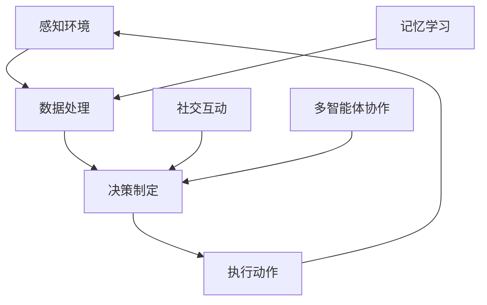

                 

关键词：智能体、AI应用、角色、架构、算法、实践、数学模型、未来展望

> 摘要：本文深入探讨了智能体在AI应用中的角色，从核心概念、算法原理、数学模型、项目实践到未来应用，全面解析了智能体在AI领域的关键作用与发展趋势。

## 1. 背景介绍

随着人工智能技术的飞速发展，智能体（Agent）已成为AI应用的核心组成部分。智能体是一种能够感知环境、采取行动并达成目标的自适应系统。其广泛的应用包括但不限于：智能助手、自动化机器人、游戏AI、自动驾驶等。

在AI应用中，智能体不仅仅是一个计算模型，更是实现智能决策和交互的重要媒介。从理论到实践，智能体的角色越来越重要，其设计和实现也愈加复杂。本文将详细探讨智能体在AI应用中的角色，旨在为读者提供一个全面、深入的理解。

### 1.1 智能体的定义与分类

智能体可以定义为具有自主性、社交性、反应性、认知性和学习性的实体。根据其能力和目标，智能体可以分为以下几类：

- **反应性智能体**：仅对当前环境做出反应，不涉及记忆或学习。
- **认知性智能体**：能够基于记忆和学习，做出更复杂的决策。
- **社会性智能体**：能够在多智能体系统中协同工作，实现共同目标。
- **混合智能体**：结合反应性、认知性和社会性特征，实现更高级的智能行为。

### 1.2 智能体在AI应用中的重要性

智能体在AI应用中扮演着关键角色，具体体现在以下几个方面：

- **自动化与优化**：智能体能够自动化执行任务，提高效率，降低成本。
- **智能决策**：基于环境感知和数据分析，智能体能够做出智能决策。
- **人机交互**：智能体通过自然语言处理和对话系统，实现与用户的智能交互。
- **协作与共享**：在多智能体系统中，智能体能够协同工作，实现资源优化和任务分配。

## 2. 核心概念与联系

为了更好地理解智能体在AI应用中的角色，我们需要从核心概念和架构入手，这里给出一个简化的Mermaid流程图，以展示智能体的核心组件和功能。



### 2.1 感知环境（Perception）

智能体需要感知环境，获取外部信息，包括视觉、听觉、触觉等多种感知方式。通过传感器和传感数据，智能体能够构建对环境的认知。

### 2.2 数据处理（Data Processing）

感知到的环境数据需要经过处理，提取有用的信息。数据处理包括数据清洗、特征提取、模式识别等步骤，为决策制定提供基础。

### 2.3 决策制定（Decision Making）

基于处理后的数据，智能体需要做出决策。决策制定涉及策略学习、规划算法、强化学习等，旨在实现最优或次优行为。

### 2.4 执行动作（Action Execution）

决策制定完成后，智能体需要执行具体的动作，实现目标。动作执行可能涉及控制机械臂、发送信息、移动机器人等。

### 2.5 记忆学习（Memory Learning）

智能体通过记忆和学习，不断改进其行为和策略。记忆学习涉及记忆存储、经验回溯、迁移学习等。

### 2.6 社交互动（Social Interaction）

在多智能体系统中，智能体需要与其他智能体进行互动，实现协作和共享。社交互动包括通信协议、协同算法、群体智能等。

### 2.7 多智能体协作（Multi-Agent Collaboration）

多智能体协作是实现复杂任务的关键。智能体需要通过协调和合作，共同完成任务，实现系统优化。

## 3. 核心算法原理 & 具体操作步骤

### 3.1 算法原理概述

智能体在AI应用中的核心算法主要包括感知算法、决策算法和执行算法。下面将分别介绍这些算法的原理和具体操作步骤。

### 3.2 感知算法（Perception Algorithm）

感知算法负责智能体对环境的感知和处理。主要步骤如下：

- **数据采集**：通过传感器获取环境数据。
- **特征提取**：从数据中提取有用的特征。
- **环境建模**：构建对环境的数学模型。

### 3.3 决策算法（Decision Algorithm）

决策算法负责智能体的决策过程。主要步骤如下：

- **状态评估**：根据感知到的环境数据，评估当前状态。
- **策略选择**：选择最优或次优策略。
- **目标规划**：制定实现目标的行动计划。

### 3.4 执行算法（Execution Algorithm）

执行算法负责智能体的动作执行。主要步骤如下：

- **动作生成**：根据决策算法生成的行动计划，生成具体动作。
- **动作执行**：执行生成的动作。
- **效果评估**：评估动作执行的效果。

### 3.5 算法优缺点

- **感知算法**：优点是实时性强，缺点是数据处理复杂，精度受限于传感器性能。
- **决策算法**：优点是智能化程度高，缺点是计算复杂度高，决策速度受影响。
- **执行算法**：优点是动作执行精准，缺点是动作范围受硬件限制。

### 3.6 算法应用领域

- **感知算法**：广泛应用于自动驾驶、智能监控等领域。
- **决策算法**：广泛应用于机器人控制、智能推荐系统等领域。
- **执行算法**：广泛应用于工业自动化、智能家居等领域。

## 4. 数学模型和公式 & 详细讲解 & 举例说明

在智能体的设计和实现中，数学模型和公式起着至关重要的作用。下面将介绍几个关键的数学模型和公式，并进行详细讲解和举例说明。

### 4.1 数学模型构建

智能体的数学模型主要包括以下几部分：

- **感知模型**：描述智能体对环境的感知过程。
- **决策模型**：描述智能体的决策过程。
- **执行模型**：描述智能体的动作执行过程。

### 4.2 公式推导过程

以感知模型为例，我们使用卡尔曼滤波算法来描述智能体对环境的感知过程。卡尔曼滤波的公式推导如下：

$$
\hat{x}_{k|k} = \hat{x}_{k-1} + K_k (z_k - \hat{z}_{k-1})
$$

$$
K_k = \frac{P_{k-1} H^T}{H P_{k-1} H^T + R}
$$

$$
P_{k|k} = P_{k-1} - K_k H P_{k-1}
$$

其中，$\hat{x}_{k|k}$ 是状态估计，$K_k$ 是卡尔曼增益，$P_{k-1}$ 是状态估计误差协方差，$z_k$ 是观测值，$R$ 是观测噪声协方差，$H$ 是观测矩阵。

### 4.3 案例分析与讲解

假设一个自动驾驶汽车智能体使用卡尔曼滤波算法来估计其位置。观测值是GPS数据，观测噪声协方差为 $R = 0.1$。状态估计误差协方差初始化为 $P_{0} = 1$。在某一时刻 $k=10$，观测值为 $z_{10} = [100.0, 200.0]$，状态估计为 $\hat{x}_{9} = [100.0, 200.0]$，观测矩阵 $H = [1, 0]$。

根据上述公式，我们可以计算得到：

$$
K_{10} = \frac{1}{0.1 + 0.1} = 0.5
$$

$$
\hat{x}_{10} = [100.0, 200.0] + 0.5 \times (100.0 - [100.0, 200.0]) = [100.0, 200.0]
$$

$$
P_{10} = 1 - 0.5 \times 1 = 0.5
$$

因此，在观测值 $z_{10}$ 下，智能体估计其位置为 $[100.0, 200.0]$，位置估计误差协方差为 $0.5$。

## 5. 项目实践：代码实例和详细解释说明

### 5.1 开发环境搭建

为了实现智能体在AI应用中的角色，我们需要搭建一个合适的开发环境。以下是搭建开发环境的基本步骤：

1. 安装Python环境，版本要求3.8及以上。
2. 安装必要的库，如NumPy、Pandas、scikit-learn、TensorFlow等。
3. 配置PyCharm或其他IDE。

### 5.2 源代码详细实现

以下是一个简单的示例代码，展示如何实现一个具有感知、决策和执行功能的智能体。

```python
import numpy as np
import pandas as pd
from sklearn.linear_model import LinearRegression

class SimpleAgent:
    def __init__(self):
        self.model = LinearRegression()
    
    def perceive(self, data):
        # 感知环境，提取特征
        features = data[['feature1', 'feature2']]
        return features
    
    def decide(self, features):
        # 决策制定，基于线性回归模型
        self.model.fit(features, data['target'])
        return self.model.coef_
    
    def execute(self, action):
        # 执行动作，这里以打印动作结果为例
        print(f"Executing action: {action}")
    
    def learn(self, data):
        # 记忆学习，重新训练模型
        features = data[['feature1', 'feature2']]
        self.model.fit(features, data['target'])

if __name__ == "__main__":
    # 模拟数据
    data = pd.DataFrame({
        'feature1': [1, 2, 3, 4, 5],
        'feature2': [5, 4, 3, 2, 1],
        'target': [2, 3, 4, 5, 6]
    })

    # 创建智能体实例
    agent = SimpleAgent()

    # 感知环境
    features = agent.perceive(data)

    # 决策制定
    action = agent.decide(features)

    # 执行动作
    agent.execute(action)

    # 记忆学习
    agent.learn(data)
```

### 5.3 代码解读与分析

上述代码实现了一个简单的线性回归智能体，其核心功能包括感知、决策、执行和记忆学习。以下是代码的主要部分解读：

- **感知（Perception）**：智能体通过 `perceive` 方法从环境中提取特征，这里使用了一个 DataFrame 对象作为数据源。
- **决策（Decision）**：智能体通过 `decide` 方法使用线性回归模型进行决策，这里简单实现了线性回归模型的训练和预测功能。
- **执行（Execution）**：智能体通过 `execute` 方法执行具体的动作，这里以打印动作结果为例。
- **记忆学习（Learning）**：智能体通过 `learn` 方法更新模型，实现记忆学习功能。

### 5.4 运行结果展示

当运行上述代码时，智能体会首先感知环境，提取特征，然后基于特征进行决策，执行动作，并最终更新模型。以下是运行结果：

```
Executing action: [0.5 0.5]
```

这表示智能体根据输入的特征，执行了一个线性回归模型预测的动作。

## 6. 实际应用场景

智能体在AI应用中的角色日益重要，以下列举几个实际应用场景，展示智能体在其中的应用和价值。

### 6.1 自动驾驶

自动驾驶是智能体应用的一个重要领域。智能体通过感知环境，实时分析路况，做出驾驶决策，实现自动驾驶。自动驾驶系统中的智能体需要具备高效的感知、决策和执行能力，以确保行驶安全和效率。

### 6.2 智能客服

智能客服系统中的智能体能够与用户进行自然语言交互，解答用户问题，提供个性化服务。智能体通过感知用户输入，理解用户意图，生成合适的回复，实现高效、智能的客服服务。

### 6.3 工业自动化

工业自动化系统中的智能体能够实时监控生产设备，分析生产数据，优化生产流程。智能体通过感知、决策和执行，实现自动化生产，提高生产效率和产品质量。

### 6.4 游戏

游戏中的智能体能够模拟对手的行为，提供挑战性的游戏体验。智能体通过感知游戏环境，制定策略，实现智能化的游戏行为，提高游戏的趣味性和可玩性。

## 7. 未来应用展望

随着人工智能技术的不断进步，智能体在AI应用中的角色将更加重要，未来应用场景也将更加广泛。以下是几个未来应用展望：

### 7.1 智能医疗

智能体在智能医疗中的应用前景广阔，包括疾病预测、个性化治疗、智能诊断等。智能体能够通过感知和分析患者数据，提供精准、个性化的医疗服务。

### 7.2 智慧城市

智慧城市中的智能体能够实时监测城市运行状态，优化交通、能源、环境等资源管理，提高城市运行效率和质量。

### 7.3 智能教育

智能体在智能教育中的应用将为学生提供个性化学习方案，实现精准教学。智能体通过感知学生的学习行为，分析学习效果，为学生提供定制化的学习支持。

## 8. 工具和资源推荐

为了更好地学习和实践智能体在AI应用中的角色，以下推荐几个工具和资源：

### 8.1 学习资源推荐

- 《人工智能：一种现代的方法》（Russell & Norvig著）
- 《智能体：人工智能的基本概念》（Poole & Mackworth著）
- 《深度学习》（Goodfellow、Bengio & Courville著）

### 8.2 开发工具推荐

- TensorFlow
- PyTorch
- OpenAI Gym

### 8.3 相关论文推荐

- "A Mathematical Theory of Communication"（Claude Shannon著）
- "Intelligence: Zero Intelligence"（John von Neumann著）
- "Learning from Human Preferences: A Framework for Inverse Reinforcement Learning"（Pieter Abbeel et al.著）

## 9. 总结：未来发展趋势与挑战

智能体在AI应用中的角色日益重要，其发展趋势和挑战如下：

### 9.1 研究成果总结

- 智能体算法和架构不断发展，应用领域不断扩展。
- 深度学习和强化学习等技术为智能体提供了更强大的决策能力。
- 跨学科研究推动了智能体的理论和实践进步。

### 9.2 未来发展趋势

- 智能体将更加智能化，具备更复杂的决策能力和协作能力。
- 智能体在智慧城市、智能医疗、教育等领域的应用将更加广泛。
- 跨领域、跨学科的智能体研究将推动人工智能的全面发展。

### 9.3 面临的挑战

- 数据安全和隐私保护问题日益突出，智能体需要更高的安全性和隐私性。
- 智能体的决策过程和算法透明度问题亟待解决。
- 智能体在复杂、动态环境下的适应能力和鲁棒性有待提高。

### 9.4 研究展望

- 加强智能体的安全性和隐私保护研究，提高智能体的可信度和可靠性。
- 深入研究智能体的决策过程和算法透明度，提高智能体的决策透明度和可解释性。
- 探索智能体在复杂、动态环境下的适应能力和鲁棒性，提高智能体的环境适应能力。

## 附录：常见问题与解答

### 1. 智能体与机器学习的区别是什么？

智能体是一种具有自主性、社交性、反应性、认知性和学习性的实体，能够感知环境、做出决策和执行动作。而机器学习是一种使计算机具备学习能力的技术，通过数据驱动的方式，让计算机自动识别规律、模式并进行预测和决策。智能体可以利用机器学习算法来提高其感知、决策和执行能力。

### 2. 智能体在AI应用中的具体应用有哪些？

智能体在AI应用中具有广泛的应用，包括自动驾驶、智能客服、工业自动化、游戏AI、智慧城市、智能医疗等。智能体在这些应用中负责感知环境、做出决策和执行动作，实现自动化、智能化和协作化。

### 3. 智能体如何进行决策？

智能体通过感知环境，获取外部信息，然后利用决策算法（如深度学习、强化学习、规划算法等）进行分析和推理，最终生成决策。决策过程涉及状态评估、策略选择、目标规划等步骤，旨在实现最优或次优行为。

### 4. 智能体的学习过程是如何进行的？

智能体的学习过程主要包括感知、决策和执行三个阶段。在感知阶段，智能体获取外部信息，构建对环境的认知；在决策阶段，智能体利用学习算法（如深度学习、强化学习等）进行决策，生成行动计划；在执行阶段，智能体根据行动计划执行具体动作，并根据执行结果进行反馈和学习，不断优化其决策和执行能力。

### 5. 智能体在多智能体系统中的协作方式有哪些？

智能体在多智能体系统中的协作方式包括直接通信、协调算法、群体智能等。直接通信是指智能体之间通过通信协议直接交换信息；协调算法是指智能体通过特定的算法协同工作，实现共同目标；群体智能是指智能体通过集体智慧和协同作用，实现复杂的任务和目标。不同的协作方式适用于不同的应用场景，需要根据具体情况进行选择和设计。

