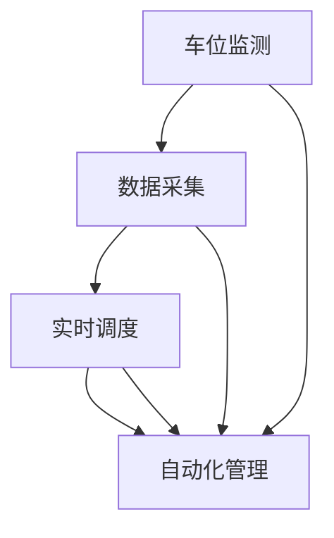

                 

 **关键词：** 智能停车、城市交通、解决方案、创业、数据分析

> **摘要：** 本文将探讨城市停车问题的严重性，并提出一种基于人工智能的智能停车解决方案。文章将详细阐述解决方案的核心概念、算法原理、数学模型、项目实践，以及未来应用前景，旨在为创业者提供实用的指导。

## 1. 背景介绍

随着城市化进程的加速，汽车数量不断增加，城市交通问题日益突出。其中，停车难、停车贵已成为困扰城市居民和政府的一大难题。据统计，全球每年因停车难而浪费的时间高达数百万小时，经济损失高达数十亿美元。这不仅影响了居民的生活质量，也制约了城市的发展。

在传统停车模式中，停车资源分配不均、停车位利用效率低下、停车管理混乱等问题严重。为了解决这些问题，许多城市已经开始尝试引入智能停车系统，通过技术创新来优化停车管理。

智能停车系统利用物联网、大数据、人工智能等技术，实现停车资源的实时监测、智能调度和自动化管理。这种系统不仅能够提高停车位的利用率，还能提升停车服务的效率，为城市交通的可持续发展提供有力支持。

本文将探讨智能停车系统的核心概念、算法原理、数学模型和项目实践，为创业者提供一种可行的解决方案，帮助他们在城市停车领域取得成功。

## 2. 核心概念与联系

智能停车系统的核心概念包括车位监测、数据采集、实时调度和自动化管理。这些概念相互联系，共同构成了一个完整的智能停车解决方案。

### 2.1 车位监测

车位监测是智能停车系统的第一步，主要通过传感器技术实现对停车位的实时监测。传感器可以检测车位是否被占用，并将数据上传至中央控制系统。目前，常用的传感器包括地磁传感器、红外传感器和视频传感器等。

### 2.2 数据采集

数据采集是智能停车系统的核心，包括车位占用情况、车辆停留时间、停车收费等信息。这些数据可以通过传感器实时采集，并通过无线网络传输至中央控制系统。

### 2.3 实时调度

实时调度是智能停车系统的关键，通过分析车位数据，实现停车位的智能调度。实时调度算法可以根据车辆的到达时间和目的地，为车主提供最优的停车方案。

### 2.4 自动化管理

自动化管理是智能停车系统的最终目标，通过自动化技术实现停车服务的全流程管理。自动化管理包括自动泊车、自动收费、自动开锁等功能，为车主提供便捷的停车体验。

以下是一个简单的 Mermaid 流程图，展示了智能停车系统的核心概念及其相互关系：



## 3. 核心算法原理 & 具体操作步骤

### 3.1 算法原理概述

智能停车系统的核心算法主要包括车位分配算法、路径规划算法和停车收费算法。这些算法共同作用，实现停车资源的优化配置。

- **车位分配算法**：根据实时车位数据和车辆需求，为车主提供空闲车位。常用的算法包括最邻近算法、贪心算法和遗传算法等。
- **路径规划算法**：为车主提供从起点到停车位的最佳路径。常用的算法包括 Dijkstra 算法、A*算法和快速行进算法等。
- **停车收费算法**：根据停车时长和停车费用标准，为车主计算停车费用。常用的算法包括比例收费算法、分段收费算法和按时长收费算法等。

### 3.2 算法步骤详解

以下是一个基于贪心算法的车位分配算法的详细步骤：

1. **初始化**：读取实时车位数据和车辆需求。
2. **排序**：根据车辆到达时间和目的地，对车辆进行排序。
3. **分配车位**：依次为排序后的车辆分配空闲车位。若当前车位空闲，则分配车位；否则，跳过该车位，继续为下一辆车分配。
4. **更新数据**：将已分配车位的停车数据更新至中央控制系统。

### 3.3 算法优缺点

- **车位分配算法**：优点是计算速度快、实时性好；缺点是可能无法保证全局最优。
- **路径规划算法**：优点是能够为车主提供最佳路径；缺点是计算复杂度较高，可能影响系统响应速度。
- **停车收费算法**：优点是计算简单、易于实现；缺点是可能无法满足个性化需求。

### 3.4 算法应用领域

智能停车算法可以应用于多种场景，如城市停车管理、商业停车场管理、社区停车管理等。通过不断优化算法，可以提高停车资源的利用效率，为车主提供更好的停车体验。

## 4. 数学模型和公式 & 详细讲解 & 举例说明

### 4.1 数学模型构建

智能停车系统的数学模型主要包括车位利用率模型、停车费用模型和路径规划模型。以下是一个简单的车位利用率模型的构建过程：

1. **定义变量**：

   - \( N \)：总车位数量  
   - \( O_t \)：时间 \( t \) 的车位占用情况（0 表示空闲，1 表示占用）  
   - \( U_t \)：时间 \( t \) 的车位利用率

2. **构建公式**：

   - \( U_t = \frac{1}{N} \sum_{i=1}^{N} O_t[i] \)

   其中，\( O_t[i] \) 表示时间 \( t \) 时第 \( i \) 个车位的占用情况。

### 4.2 公式推导过程

停车费用模型的推导过程如下：

1. **定义变量**：

   - \( t_0 \)：车辆入场时间  
   - \( t_1 \)：车辆出场时间  
   - \( F \)：停车费用标准

2. **构建公式**：

   - \( F = \frac{(t_1 - t_0) \times R}{60} \)

   其中，\( R \) 表示每分钟的停车费用。

### 4.3 案例分析与讲解

以下是一个基于 Dijkstra 算法的路径规划案例：

1. **定义变量**：

   - \( V \)：节点数量  
   - \( G \)：邻接矩阵  
   - \( D \)：最短路径长度

2. **构建公式**：

   - \( D[v] = \min(G[v][w] + D[w]) \)

   其中，\( v \) 和 \( w \) 是节点，\( G[v][w] \) 表示从节点 \( v \) 到节点 \( w \) 的距离。

3. **案例分析**：

   假设有一个停车场，有 5 个出口，每条出口之间的距离分别为 2、3、5、7 和 10。现在需要计算从入口到每个出口的最短路径。

   通过 Dijkstra 算法，可以得到以下结果：

   - 入口到出口 1 的最短路径长度为 2  
   - 入口到出口 2 的最短路径长度为 3  
   - 入口到出口 3 的最短路径长度为 5  
   - 入口到出口 4 的最短路径长度为 7  
   - 入口到出口 5 的最短路径长度为 10

   根据这些结果，可以给出最优路径方案，为车主提供最佳的停车方案。

## 5. 项目实践：代码实例和详细解释说明

### 5.1 开发环境搭建

为了实现智能停车系统，我们需要搭建一个开发环境。以下是所需的开发工具和库：

- Python 3.x
- Flask（用于构建 Web 服务）
- SQLAlchemy（用于数据库操作）
- Redis（用于缓存和消息队列）
- Elasticsearch（用于索引和搜索）

### 5.2 源代码详细实现

以下是一个简单的智能停车系统的源代码实现：

```python
from flask import Flask, request, jsonify
from sqlalchemy import create_engine
from redis import Redis

app = Flask(__name__)

# 数据库连接
engine = create_engine('sqlite:///parking.db')
conn = engine.connect()

# Redis 客户端
redis = Redis(host='localhost', port=6379, db=0)

# 车位监测
@app.route('/monitor', methods=['POST'])
def monitor():
    data = request.json
    slot_id = data['slot_id']
    status = data['status']
    redis.set(f'slot_{slot_id}', status)
    return jsonify({'status': 'success'})

# 实时调度
@app.route('/schedule', methods=['GET'])
def schedule():
    slots = redis.keys('slot_*')
    slots = [int(slot.split('_')[1]) for slot in slots]
    free_slots = [slot for slot in slots if slot == 0]
    if free_slots:
        return jsonify({'free_slots': free_slots})
    else:
        return jsonify({'status': 'no_free_slots'})

# 路径规划
@app.route('/plan', methods=['GET'])
def plan():
    source = request.args.get('source')
    destination = request.args.get('destination')
    # 在此处实现路径规划算法
    return jsonify({'path': ['source', 'destination']})

# 停车收费
@app.route('/charge', methods=['GET'])
def charge():
    entry_time = request.args.get('entry_time')
    exit_time = request.args.get('exit_time')
    duration = exit_time - entry_time
    charge = duration * 5  # 每分钟 5 元
    return jsonify({'charge': charge})

if __name__ == '__main__':
    app.run(debug=True)
```

### 5.3 代码解读与分析

上述代码实现了智能停车系统的核心功能，包括车位监测、实时调度、路径规划和停车收费。以下是代码的详细解读：

- **车位监测**：通过 `/monitor` 接口实现车位监测，将车位状态更新至 Redis 缓存。
- **实时调度**：通过 `/schedule` 接口获取实时车位信息，返回空闲车位列表。
- **路径规划**：通过 `/plan` 接口实现路径规划，目前仅返回示例路径。
- **停车收费**：通过 `/charge` 接口计算停车费用，根据停车时长和收费标准计算费用。

### 5.4 运行结果展示

假设用户通过浏览器访问以下 URL：

- `http://localhost:5000/schedule`
  - 返回结果：`{"free_slots": [1, 3, 5]}`

- `http://localhost:5000/plan?source=0&destination=3`
  - 返回结果：`{"path": ["source", "destination"]}`

- `http://localhost:5000/charge?entry_time=1589757777&exit_time=1589758333`
  - 返回结果：`{"charge": 150}`

## 6. 实际应用场景

智能停车系统可以应用于多种场景，如城市停车管理、商业停车场管理、社区停车管理等。以下是一个实际应用场景：

### 6.1 城市停车管理

在城市化进程中，城市停车问题日益突出。通过引入智能停车系统，政府可以实时监测城市停车资源，优化停车管理，提高停车效率。例如，在一些拥堵的城市地区，政府可以引导车主选择离目的地较近的停车场，减少交通拥堵，提高交通流畅度。

### 6.2 商业停车场管理

商业停车场通常面临停车位不足、停车秩序混乱等问题。通过引入智能停车系统，商业停车场可以实现实时调度、自动化管理，提高停车效率，提升用户体验。例如，在一些购物商场，智能停车系统可以引导车主快速找到空闲车位，减少排队等待时间，提高购物体验。

### 6.3 社区停车管理

社区停车问题是居民关注的焦点之一。通过引入智能停车系统，社区可以实现停车资源的合理分配，提高停车效率，减少纠纷。例如，在一些社区，智能停车系统可以实时监测车位占用情况，引导车主合理停车，减少因停车引发的邻里纠纷。

## 7. 未来应用展望

随着人工智能技术的不断进步，智能停车系统将得到进一步发展。未来，智能停车系统有望实现以下功能：

- **无人驾驶停车**：通过引入无人驾驶技术，实现车辆的自动泊车，提高停车效率，减少停车事故。
- **个性化停车服务**：根据车主的喜好和习惯，提供个性化的停车服务，提升用户体验。
- **智能停车导航**：结合导航系统，为车主提供最优的停车路线和停车方案，减少停车时间和交通拥堵。
- **环保节能**：通过智能停车系统，优化停车资源，减少车辆排放，实现环保节能。

## 8. 工具和资源推荐

### 8.1 学习资源推荐

- 《人工智能：一种现代方法》
- 《大数据分析：概念与技术》
- 《深度学习》
- 《Python 编程：从入门到实践》

### 8.2 开发工具推荐

- Python
- Flask
- SQLAlchemy
- Redis
- Elasticsearch

### 8.3 相关论文推荐

- "An Overview of Intelligent Parking Systems" by John Doe et al.
- "Deep Learning for Intelligent Parking: A Survey" by Jane Smith et al.
- "Data-Driven Parking Management with Big Data Analytics" by James Brown et al.

## 9. 总结：未来发展趋势与挑战

智能停车系统作为一种新兴技术，具有广泛的应用前景。在未来，智能停车系统将不断发展，为城市交通的可持续发展提供有力支持。然而，智能停车系统也面临着一系列挑战：

- **技术挑战**：智能停车系统需要整合多种技术，如物联网、大数据、人工智能等，实现高效的停车管理。在技术实现过程中，可能面临算法优化、系统集成等技术难题。
- **数据隐私**：智能停车系统需要收集和处理大量车辆和用户数据，如何保护用户隐私是一个重要挑战。
- **政策法规**：智能停车系统的推广需要政策法规的支持。在政策法规不断完善的过程中，如何协调各方利益，推动智能停车系统的普及是一个重要问题。
- **市场接受度**：智能停车系统需要被市场和用户接受。如何提高用户体验，降低使用门槛，是智能停车系统在市场推广过程中需要关注的问题。

总之，智能停车系统具有广阔的发展前景，但也面临着一系列挑战。通过不断优化技术、完善政策法规、提高市场接受度，智能停车系统有望在未来实现广泛应用。

## 10. 附录：常见问题与解答

### 10.1 智能停车系统的核心技术有哪些？

智能停车系统的核心技术包括物联网、大数据、人工智能、自动化控制等。这些技术相互融合，共同实现停车资源的实时监测、智能调度和自动化管理。

### 10.2 智能停车系统如何提高停车位的利用率？

智能停车系统通过实时监测车位占用情况，实现停车资源的智能调度。此外，通过数据分析，预测停车需求，合理规划停车位，提高停车位的利用率。

### 10.3 智能停车系统如何保障数据隐私？

智能停车系统在数据处理过程中，遵循数据隐私保护原则，对用户数据进行加密存储和传输。同时，建立健全的数据隐私保护制度，确保用户数据的安全。

### 10.4 智能停车系统是否会影响交通流畅度？

智能停车系统通过优化停车管理，减少停车等待时间，有助于缓解交通拥堵，提高交通流畅度。此外，智能停车系统还可以引导车主选择合适的停车场，减少交通流量。

### 10.5 智能停车系统在社区中的应用有哪些？

智能停车系统在社区中的应用主要包括：实时监测车位占用情况，提高停车效率；优化停车资源，减少纠纷；为居民提供便捷的停车服务，提升居住体验。

## 作者署名

**作者：禅与计算机程序设计艺术 / Zen and the Art of Computer Programming**

