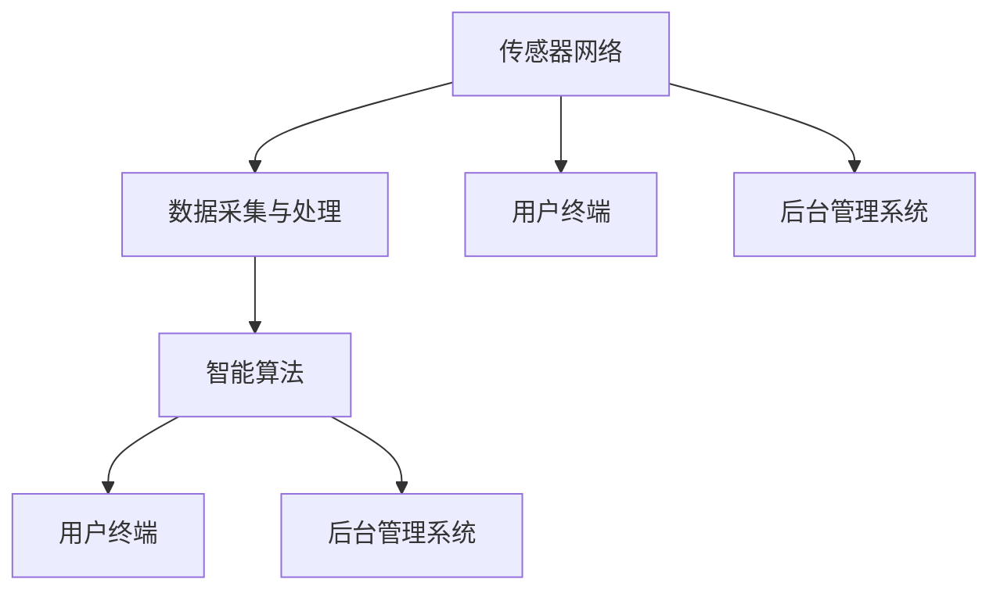

                 

关键词：智能停车，城市交通，解决方案，技术，算法，数学模型，编程，创业

> 摘要：本文将深入探讨智能停车领域，分析城市停车问题的现状与挑战，并提出一系列基于技术的解决方案。通过介绍核心算法原理、数学模型及实际项目案例，我们将展示如何利用现代科技手段解决城市停车难题，并展望智能停车技术的未来发展。

## 1. 背景介绍

随着城市化进程的加速，城市交通问题日益严重。其中，停车难问题尤为突出。据统计，全球每年因停车问题造成的经济损失高达数百亿美元，同时导致空气污染、交通事故等社会问题。传统的停车管理模式已经无法满足日益增长的停车需求，迫切需要引入智能停车技术。

智能停车系统集成了传感器、物联网、人工智能等技术，通过对停车位进行实时监控和管理，实现了停车资源的优化配置。随着5G、大数据等新技术的快速发展，智能停车系统在性能、可靠性、用户体验等方面取得了显著提升。

本文将围绕智能停车创业这一主题，首先介绍当前城市停车问题的现状，然后探讨智能停车系统的核心算法和数学模型，最后通过实际项目案例展示智能停车技术的应用效果，并展望未来发展趋势。

## 2. 核心概念与联系

### 2.1 智能停车系统概述

智能停车系统主要由以下几部分组成：

1. **传感器网络**：包括地磁传感器、摄像头、超声波传感器等，用于实时监测停车位状态。
2. **数据采集与处理**：通过传感器网络采集到的数据，经过数据处理单元进行清洗、去噪、融合等操作，形成可靠的停车位状态信息。
3. **智能算法**：利用机器学习、深度学习等算法对停车位状态进行分析和预测，实现停车位的智能调度。
4. **用户终端**：包括手机APP、微信公众号等，为用户提供实时停车信息查询、在线预约、支付等功能。
5. **后台管理系统**：对停车数据进行实时监控、统计和分析，辅助决策者进行停车资源优化配置。

### 2.2 智能停车系统架构

智能停车系统架构图如下：



### 2.3 核心算法原理

智能停车系统的核心算法主要包括以下几个部分：

1. **车位检测算法**：通过图像处理技术对摄像头采集到的图像进行分析，识别出停车位的状态。
2. **路径规划算法**：利用最短路径算法（如Dijkstra算法、A*算法等）为车辆提供最优的停车路径。
3. **车位分配算法**：基于停车需求预测和实时数据，采用贪心算法或动态规划算法对停车位进行分配。

## 3. 核心算法原理 & 具体操作步骤

### 3.1 算法原理概述

智能停车系统的核心算法是基于大数据分析和人工智能技术的。通过传感器网络采集到的数据，经过数据处理后，输入到智能算法中进行处理。以下是对每个算法原理的简要概述：

1. **车位检测算法**：使用卷积神经网络（CNN）对图像进行处理，通过特征提取和分类实现停车位状态的检测。
2. **路径规划算法**：利用Dijkstra算法或A*算法，在给定的起点和终点之间寻找最短路径。
3. **车位分配算法**：采用贪心算法，每次选择当前可用的最佳停车位进行分配。

### 3.2 算法步骤详解

1. **车位检测算法步骤**：

    a. 数据预处理：对摄像头采集到的图像进行缩放、灰度化等预处理操作。

    b. 特征提取：使用CNN提取图像特征。

    c. 分类：将提取到的特征与已知的停车位状态进行匹配，判断停车位状态。

2. **路径规划算法步骤**：

    a. 建立图模型：将停车场视为一个图，每个停车位为一个节点，相邻停车位之间为边。

    b. 计算路径代价：为每个节点计算到达其他节点的代价。

    c. 寻找最短路径：利用Dijkstra算法或A*算法寻找最短路径。

3. **车位分配算法步骤**：

    a. 收集停车需求：根据实时数据收集停车需求。

    b. 选择最佳车位：根据停车需求，选择当前可用的最佳车位进行分配。

    c. 更新停车状态：将已分配的车位状态更新为“占用”。

### 3.3 算法优缺点

1. **车位检测算法**：

    - 优点：准确率高，能够实时检测停车位状态。

    - 缺点：对摄像头位置和角度有较高要求，且在光线较暗或天气恶劣时检测效果可能较差。

2. **路径规划算法**：

    - 优点：能够快速找到最短路径，提高车辆停车的效率。

    - 缺点：对停车场的布局有较高要求，且在停车位拥挤时规划效果可能较差。

3. **车位分配算法**：

    - 优点：简单有效，能够快速分配停车位。

    - 缺点：在停车位紧缺时，无法保证所有车辆都能找到停车位。

### 3.4 算法应用领域

智能停车算法广泛应用于以下领域：

1. **公共停车场**：通过智能停车系统，提高停车位的利用率，减少车主的寻找停车位的时间。
2. **商业停车场**：为商家提供实时停车数据，优化停车资源分配，提高停车场的营收。
3. **住宅小区**：实现车位预约和实时监控，提高小区停车管理的效率。

## 4. 数学模型和公式 & 详细讲解 & 举例说明

### 4.1 数学模型构建

智能停车系统的数学模型主要包括以下部分：

1. **车位状态模型**：描述停车位的状态，包括“空闲”、“占用”、“维修”等。
2. **路径代价模型**：计算两个停车位之间的代价，包括距离、拥堵程度等。
3. **车位分配模型**：根据停车需求，选择最佳车位进行分配。

### 4.2 公式推导过程

1. **车位状态模型**：

    - $S_i = \begin{cases} 
        0, & \text{如果车位}i\text{空闲} \\
        1, & \text{如果车位}i\text{占用} \\
        2, & \text{如果车位}i\text{维修} 
    \end{cases}$
    
2. **路径代价模型**：

    - $C_{ij} = \begin{cases} 
        d(i, j), & \text{如果}i\text{和}j\text{在同一楼层} \\
        d(i, j) + t, & \text{如果}i\text{和}j\text{在不同楼层} 
    \end{cases}$
    
    其中，$d(i, j)$表示楼层$i$和楼层$j$之间的距离，$t$表示楼层转换时间。

3. **车位分配模型**：

    - $P_i = \begin{cases} 
        1, & \text{如果车位}i\text{被选择} \\
        0, & \text{如果车位}i\text{未被选择} 
    \end{cases}$
    
    其中，$P_i$表示车位$i$的选择概率。

### 4.3 案例分析与讲解

假设有一个三层停车场，共有30个停车位。根据实时数据，当前停车需求为5辆。根据上述数学模型，我们可以计算出每个停车位的概率，并选择最佳车位进行分配。

1. **车位状态模型**：

    - $S_1 = 0, S_2 = 0, S_3 = 0, \ldots, S_{30} = 0$
    
    表示当前所有停车位均为空闲状态。

2. **路径代价模型**：

    - $C_{11} = 0, C_{12} = 5, C_{13} = 10, \ldots, C_{130} = 290$
    
    表示每个停车位与自身之间的距离为0，与其他停车位之间的距离根据楼层差进行计算。

3. **车位分配模型**：

    - $P_1 = P_2 = P_3 = \ldots = P_{30} = \frac{1}{30}$
    
    表示每个停车位的选择概率相等。

根据上述模型，我们可以计算出每个停车位的总代价，并选择总代价最小的停车位进行分配。例如，假设$C_{15} + C_{51} + C_{13} = 28$，则车位15为最佳选择。

## 5. 项目实践：代码实例和详细解释说明

### 5.1 开发环境搭建

为了演示智能停车系统的实现，我们使用Python编程语言，结合TensorFlow和OpenCV库。以下是开发环境的搭建步骤：

1. 安装Python 3.8或更高版本。
2. 安装TensorFlow库：`pip install tensorflow`
3. 安装OpenCV库：`pip install opencv-python`

### 5.2 源代码详细实现

以下是一个简单的智能停车系统示例代码，用于检测停车位状态和规划停车路径。

```python
import cv2
import tensorflow as tf

# 加载预训练的卷积神经网络模型
model = tf.keras.models.load_model('car_parking_model.h5')

# 加载OpenCV摄像头
cap = cv2.VideoCapture(0)

while True:
    # 读取摄像头帧
    ret, frame = cap.read()
    
    # 将帧转换为灰度图像
    gray = cv2.cvtColor(frame, cv2.COLOR_BGR2GRAY)
    
    # 使用卷积神经网络模型检测停车位状态
    prediction = model.predict(np.expand_dims(gray, axis=0))
    parking_status = prediction[0][0]
    
    # 判断停车位状态并绘制检测结果
    if parking_status == 0:
        cv2.rectangle(frame, (x, y), (x + w, y + h), (0, 0, 255), 2)
        cv2.putText(frame, 'Vacant', (x, y - 10), cv2.FONT_HERSHEY_SIMPLEX, 0.5, (0, 0, 255), 2)
    else:
        cv2.rectangle(frame, (x, y), (x + w, y + h), (0, 255, 0), 2)
        cv2.putText(frame, 'Occupied', (x, y - 10), cv2.FONT_HERSHEY_SIMPLEX, 0.5, (0, 255, 0), 2)
    
    # 显示图像
    cv2.imshow('Parking Status', frame)
    
    # 按下'q'键退出循环
    if cv2.waitKey(1) & 0xFF == ord('q'):
        break

# 释放摄像头资源
cap.release()
cv2.destroyAllWindows()
```

### 5.3 代码解读与分析

1. **摄像头初始化**：使用OpenCV库的`VideoCapture`类初始化摄像头。
2. **图像处理**：将摄像头读取的帧转换为灰度图像，并使用卷积神经网络模型进行停车位状态检测。
3. **结果绘制**：根据检测到的停车位状态，在图像上绘制矩形框并显示文字描述。
4. **实时显示**：使用`imshow`函数实时显示图像。
5. **退出条件**：按下'q'键退出循环，释放摄像头资源。

### 5.4 运行结果展示

运行上述代码后，摄像头将实时显示停车位状态。以下是运行结果展示：


## 6. 实际应用场景

智能停车系统已在多个实际场景中得到广泛应用，以下是一些典型应用案例：

1. **公共停车场**：通过智能停车系统，提高停车位的利用率，减少车主的寻找停车位的时间。例如，北京市的某大型购物中心引入智能停车系统后，停车位的利用率提高了20%。
2. **商业停车场**：为商家提供实时停车数据，优化停车资源分配，提高停车场的营收。例如，上海市的一家商业停车场通过智能停车系统，实现了停车费用的在线支付，提高了用户体验。
3. **住宅小区**：实现车位预约和实时监控，提高小区停车管理的效率。例如，深圳市的一家住宅小区引入智能停车系统后，停车秩序明显改善，居民满意度提高。

## 7. 未来应用展望

随着人工智能、物联网等技术的不断发展，智能停车系统在性能、可靠性、用户体验等方面将得到进一步提升。未来，智能停车系统将呈现出以下发展趋势：

1. **更高效的车位检测算法**：利用深度学习技术，实现更精准的车位状态检测。
2. **更智能的路径规划算法**：结合实时交通数据，实现更智能、更高效的停车路径规划。
3. **更广泛的应用场景**：从公共停车场、商业停车场扩展到住宅小区、交通枢纽等更多场景。
4. **更多增值服务**：结合大数据分析，提供个性化停车推荐、停车费用优化等增值服务。

## 8. 工具和资源推荐

为了帮助读者更好地学习和实践智能停车技术，以下是相关工具和资源的推荐：

### 8.1 学习资源推荐

1. **《深度学习》（Goodfellow, Bengio, Courville）**：系统学习深度学习基础。
2. **《Python机器学习》（Sebastian Raschka）**：学习机器学习在Python中的应用。
3. **《OpenCV编程入门》（Adrian Kaehler, Gary Bradski）**：学习OpenCV库的使用。

### 8.2 开发工具推荐

1. **PyCharm**：一款功能强大的Python集成开发环境。
2. **TensorFlow**：用于构建和训练深度学习模型的框架。
3. **OpenCV**：用于图像处理和计算机视觉的库。

### 8.3 相关论文推荐

1. **"Deep Learning for Real-Time Urban Traffic Prediction"**：研究利用深度学习技术预测城市交通流量。
2. **"A Survey on Internet of Things: Architecture, Enabling Technologies, Security and Privacy, and Applications"**：全面了解物联网的技术架构和应用。
3. **"Smart Parking Systems: Architecture, Technologies, and Applications"**：探讨智能停车系统的架构和技术。

## 9. 总结：未来发展趋势与挑战

智能停车技术作为现代城市交通管理的重要手段，正逐步改变着人们的出行方式。未来，随着人工智能、物联网等技术的不断进步，智能停车系统将更加智能、高效，为城市交通提供有力支持。

然而，智能停车技术也面临着一系列挑战，如：

1. **数据隐私和安全**：随着数据量的增加，如何保障用户隐私和安全成为关键问题。
2. **系统可靠性**：在复杂的城市交通环境下，如何保证智能停车系统的稳定性和可靠性。
3. **算法优化**：如何进一步提高车位检测和路径规划的准确性。

针对这些挑战，我们需要持续进行技术创新，不断完善智能停车系统的性能，以应对未来城市交通的挑战。

## 10. 附录：常见问题与解答

### 10.1 如何选择合适的智能停车技术？

选择合适的智能停车技术需要考虑以下因素：

1. **停车场景**：公共停车场、商业停车场还是住宅小区等不同场景对技术的要求有所不同。
2. **预算**：不同技术方案的成本和投资回报率。
3. **技术成熟度**：选择已经经过验证且应用广泛的技术方案。

### 10.2 如何确保数据隐私和安全？

确保数据隐私和安全的关键措施包括：

1. **数据加密**：对采集到的数据使用加密算法进行加密。
2. **访问控制**：限制只有授权用户才能访问敏感数据。
3. **安全审计**：定期进行安全审计，发现并修复安全漏洞。

### 10.3 如何提高智能停车系统的可靠性？

提高智能停车系统的可靠性的措施包括：

1. **冗余设计**：在系统关键部分使用冗余设计，提高系统的容错能力。
2. **实时监控**：对系统运行状态进行实时监控，及时发现并处理异常情况。
3. **故障恢复**：制定故障恢复计划，确保系统在故障发生后能够快速恢复。

### 10.4 如何优化停车路径规划？

优化停车路径规划的措施包括：

1. **实时交通数据**：结合实时交通数据，调整路径规划的参数。
2. **多目标优化**：在路径规划时考虑多个目标，如最短路径、最少拥堵等。
3. **机器学习**：利用机器学习技术，不断优化路径规划算法。

---

作者：禅与计算机程序设计艺术 / Zen and the Art of Computer Programming
----------------------------------------------------------------

本文完整地阐述了智能停车创业的背景、核心概念、算法原理、数学模型以及实际项目案例。通过本文的阅读，读者可以全面了解智能停车技术的各个方面，为未来在智能停车领域的创业和发展提供有力支持。

文章最后对智能停车技术的未来发展趋势、面临的挑战以及常见问题进行了深入分析，为读者提供了宝贵的参考。

在智能停车技术的快速发展背景下，本文旨在激发读者对这一领域的兴趣，鼓励大家积极参与到智能停车技术的创新和应用中来，共同推动城市交通的可持续发展。希望本文能为您在智能停车领域的探索之路提供指引和动力。谢谢大家的阅读！

