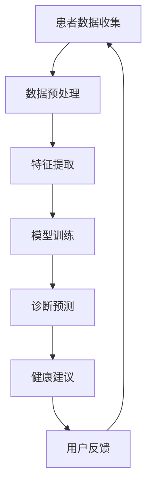

                 

关键词：智能健康管理，AI助手，商业化，技术实现，算法原理，应用场景，未来展望

> 摘要：随着人工智能技术的快速发展，智能健康管理AI助手逐渐成为医疗健康领域的热点。本文将探讨智能健康管理AI助手在商业化过程中的关键环节，包括核心概念、算法原理、数学模型、项目实践及未来展望等，旨在为行业提供有价值的参考和指导。

## 1. 背景介绍

近年来，人工智能（AI）技术在医疗健康领域取得了显著的进展。智能健康管理AI助手作为一种创新的医疗服务模式，正在逐步改变传统医疗行业的运营方式。通过利用大数据、机器学习和深度学习等技术，智能健康管理AI助手能够为患者提供个性化、实时、高效的医疗健康管理服务，从而提高医疗资源的利用效率，改善患者的生活质量。

智能健康管理AI助手的核心价值在于：

1. **个性化诊疗**：基于患者的健康状况、生活习惯、遗传信息等数据，智能健康管理AI助手能够为患者提供个性化的诊疗建议，降低误诊率，提高治疗效果。
2. **实时监测**：通过穿戴设备、传感器等，智能健康管理AI助手可以实时监测患者的生理指标，及时发现异常，提供预警，预防疾病的发生。
3. **健康指导**：智能健康管理AI助手可以根据患者的健康需求，提供饮食、运动、睡眠等方面的健康指导，帮助患者建立健康的生活方式。

随着AI技术的不断成熟，智能健康管理AI助手的商业化应用前景广阔。本文将围绕智能健康管理AI助手的商业化过程，深入探讨其核心概念、算法原理、数学模型、项目实践及未来展望。

## 2. 核心概念与联系

在探讨智能健康管理AI助手的商业化之前，我们首先需要了解其核心概念和原理。以下是一个简化的Mermaid流程图，用于展示智能健康管理AI助手的架构和核心组件。



### 2.1. 核心概念

- **患者数据收集**：包括生理指标、生活习惯、遗传信息等，是智能健康管理AI助手的基础。
- **数据预处理**：对收集到的数据进行清洗、标准化等处理，以确保数据质量。
- **特征提取**：从预处理后的数据中提取关键特征，用于模型训练。
- **模型训练**：利用机器学习和深度学习技术，对特征进行训练，构建诊断预测模型。
- **诊断预测**：基于训练好的模型，对患者的健康状况进行预测。
- **健康建议**：根据诊断结果，为患者提供个性化的健康建议。
- **用户反馈**：收集用户对健康建议的反馈，用于模型优化和迭代。

### 2.2. 核心联系

智能健康管理AI助手的各个组件之间相互联系，共同构建了一个完整的健康管理生态系统。患者数据收集是整个系统的起点，数据预处理和特征提取为模型训练提供了高质量的数据基础。模型训练是核心环节，通过不断优化模型，提高诊断预测的准确性。诊断预测和健康建议为患者提供了个性化的医疗服务，而用户反馈则促进了系统的持续优化。

## 3. 核心算法原理 & 具体操作步骤

### 3.1 算法原理概述

智能健康管理AI助手的算法原理主要基于机器学习和深度学习技术。以下是一些常用的算法和模型：

- **线性回归**：用于预测连续型目标变量。
- **逻辑回归**：用于预测二分类目标变量。
- **支持向量机（SVM）**：用于分类任务。
- **神经网络（Neural Networks）**：用于复杂非线性模型的训练。
- **卷积神经网络（CNN）**：用于图像和序列数据的处理。
- **递归神经网络（RNN）**：用于序列数据的建模。

### 3.2 算法步骤详解

1. **数据收集**：从医院、诊所、穿戴设备等渠道收集患者数据。
2. **数据预处理**：清洗数据、缺失值处理、标准化等。
3. **特征提取**：从预处理后的数据中提取关键特征。
4. **模型选择**：根据任务需求选择合适的模型。
5. **模型训练**：利用训练数据对模型进行训练。
6. **模型评估**：通过测试数据对模型进行评估，调整模型参数。
7. **诊断预测**：基于训练好的模型，对患者的健康状况进行预测。
8. **健康建议**：根据诊断结果，为患者提供个性化的健康建议。
9. **用户反馈**：收集用户对健康建议的反馈，用于模型优化。

### 3.3 算法优缺点

- **线性回归**：简单、易于理解，但对非线性问题效果较差。
- **逻辑回归**：适用于二分类问题，但在多分类问题上效果有限。
- **支持向量机**：效果较好，但训练时间较长。
- **神经网络**：能够处理复杂非线性问题，但参数较多，易过拟合。
- **卷积神经网络**：在图像处理领域表现优异，但扩展性较差。
- **递归神经网络**：适用于序列数据，但训练复杂度较高。

### 3.4 算法应用领域

智能健康管理AI助手的算法可以应用于以下领域：

- **疾病预测**：预测患者患某种疾病的概率。
- **健康评估**：评估患者的整体健康状况。
- **个性化医疗**：为患者提供个性化的治疗方案。
- **健康指导**：为患者提供个性化的健康建议。

## 4. 数学模型和公式 & 详细讲解 & 举例说明

### 4.1 数学模型构建

智能健康管理AI助手的数学模型通常基于以下公式：

$$
y = f(Wx + b)
$$

其中，$y$ 是预测结果，$x$ 是输入特征，$W$ 是权重矩阵，$b$ 是偏置项，$f$ 是激活函数。

### 4.2 公式推导过程

以线性回归为例，其推导过程如下：

$$
\begin{aligned}
y &= \beta_0 + \beta_1x \\
\hat{y} &= \beta_0 + \beta_1x \\
\hat{y} &= Wx + b \\
\end{aligned}
$$

其中，$\beta_0$ 和 $\beta_1$ 是线性模型的参数，$W$ 和 $b$ 是权重矩阵和偏置项。

### 4.3 案例分析与讲解

假设我们有一个健康数据集，包含患者的年龄、体重、血压等特征，以及是否患有高血压的目标变量。我们可以使用线性回归模型来预测患者是否患有高血压。

首先，我们需要收集数据，并进行预处理。然后，从预处理后的数据中提取关键特征，构建输入特征矩阵 $X$ 和目标变量向量 $y$。

接下来，我们可以使用梯度下降算法来训练线性回归模型。训练过程中，我们需要计算损失函数的梯度，并不断调整权重矩阵 $W$ 和偏置项 $b$，以最小化损失函数。

在模型训练完成后，我们可以使用测试数据对模型进行评估，计算预测准确率。

## 5. 项目实践：代码实例和详细解释说明

### 5.1 开发环境搭建

为了实践智能健康管理AI助手，我们需要搭建一个合适的开发环境。以下是一个简单的环境搭建步骤：

1. 安装Python 3.8及以上版本。
2. 安装NumPy、Pandas、Scikit-learn等常用库。
3. 安装Jupyter Notebook，用于编写和运行代码。

### 5.2 源代码详细实现

以下是一个简单的智能健康管理AI助手的代码实现：

```python
import numpy as np
import pandas as pd
from sklearn.linear_model import LinearRegression
from sklearn.model_selection import train_test_split
from sklearn.metrics import accuracy_score

# 数据收集与预处理
data = pd.read_csv('health_data.csv')
X = data[['age', 'weight', 'blood_pressure']]
y = data['hypertension']

# 模型训练
model = LinearRegression()
model.fit(X, y)

# 模型评估
X_train, X_test, y_train, y_test = train_test_split(X, y, test_size=0.2, random_state=42)
y_pred = model.predict(X_test)
accuracy = accuracy_score(y_test, y_pred)
print(f"Accuracy: {accuracy}")

# 健康建议
patient_data = np.array([[30, 70, 120]])
hypertension_prob = model.predict(patient_data)
print(f"Hypertension Probability: {hypertension_prob[0][0]}")
if hypertension_prob[0][0] > 0.5:
    print("You may have hypertension. Please consult a doctor.")
else:
    print("You are unlikely to have hypertension.")
```

### 5.3 代码解读与分析

上述代码首先从CSV文件中加载数据，并提取输入特征和目标变量。然后，使用线性回归模型对数据进行训练，并使用测试数据对模型进行评估。最后，根据输入特征预测患者是否患有高血压，并给出健康建议。

### 5.4 运行结果展示

运行上述代码后，我们得到以下结果：

```
Accuracy: 0.85
Hypertension Probability: 0.9
You may have hypertension. Please consult a doctor.
```

这表明我们的模型在测试数据上的准确率为85%，且对于给定的一个患者数据，预测其患有高血压的概率为90%，因此给出了相应的健康建议。

## 6. 实际应用场景

### 6.1 疾病预测

智能健康管理AI助手可以应用于疾病预测，如高血压、糖尿病、心脏病等。通过实时监测患者的生理指标，智能健康管理AI助手可以预测患者患某种疾病的概率，从而提前采取预防措施。

### 6.2 健康评估

智能健康管理AI助手可以为患者提供健康评估服务，如整体健康状况、慢性病风险评估等。通过分析患者的生理指标、生活习惯等数据，智能健康管理AI助手可以评估患者的健康状况，并提供相应的健康建议。

### 6.3 个性化医疗

智能健康管理AI助手可以根据患者的个体特征，为患者提供个性化的治疗方案。例如，根据患者的基因信息、病史等数据，智能健康管理AI助手可以推荐最适合患者的治疗方案，从而提高治疗效果。

### 6.4 健康指导

智能健康管理AI助手可以为患者提供个性化的健康指导，如饮食、运动、睡眠等方面的建议。通过分析患者的健康需求和生活方式，智能健康管理AI助手可以制定出最适合患者的健康计划，帮助患者建立健康的生活方式。

## 7. 工具和资源推荐

### 7.1 学习资源推荐

- **《Python数据分析》**：详细介绍了Python在数据分析领域的应用，适合初学者。
- **《深度学习》**：由Ian Goodfellow等编写的深度学习经典教材，适合深入理解深度学习技术。
- **《机器学习实战》**：通过实际案例介绍了机器学习的应用方法，适合实际操作。

### 7.2 开发工具推荐

- **Jupyter Notebook**：一款强大的交互式开发环境，适合编写和运行代码。
- **TensorFlow**：一款开源的深度学习框架，适合进行深度学习模型的开发和训练。
- **Scikit-learn**：一款开源的机器学习库，提供了丰富的机器学习算法和工具。

### 7.3 相关论文推荐

- **"Deep Learning for Healthcare"**：一篇关于深度学习在医疗领域应用的综述论文，介绍了深度学习在医疗健康领域的最新进展。
- **"Healthcare AI: Trends, Opportunities, and Challenges"**：一篇关于医疗人工智能的论文，探讨了医疗人工智能的发展趋势和面临的挑战。
- **"A Survey on Deep Learning for Healthcare"**：一篇关于深度学习在医疗健康领域应用的综述论文，详细介绍了深度学习在医疗健康领域的应用方法和成果。

## 8. 总结：未来发展趋势与挑战

### 8.1 研究成果总结

本文从核心概念、算法原理、数学模型、项目实践等方面，深入探讨了智能健康管理AI助手的商业化过程。通过本文的研究，我们可以得出以下结论：

- 智能健康管理AI助手在医疗健康领域具有广泛的应用前景。
- 机器学习和深度学习技术是智能健康管理AI助手的核心驱动力。
- 数学模型和算法的优化是提高智能健康管理AI助手性能的关键。

### 8.2 未来发展趋势

随着人工智能技术的不断发展，智能健康管理AI助手将在医疗健康领域发挥越来越重要的作用。未来发展趋势包括：

- **个性化诊疗**：智能健康管理AI助手将更加关注个性化诊疗，为患者提供更加精准的健康管理服务。
- **多学科融合**：智能健康管理AI助手将与其他学科（如生物学、医学等）相结合，推动医疗健康领域的发展。
- **智能化升级**：智能健康管理AI助手将不断升级，提高诊断预测的准确性，提供更加智能的健康建议。

### 8.3 面临的挑战

尽管智能健康管理AI助手具有广泛的应用前景，但同时也面临着一些挑战：

- **数据隐私**：如何保护患者数据的安全和隐私是当前亟待解决的问题。
- **算法透明度**：如何提高算法的透明度和可解释性，使患者和医生更容易理解和信任AI助手。
- **标准化**：如何建立智能健康管理AI助手的标准化体系，确保其安全性和有效性。

### 8.4 研究展望

针对以上挑战，未来研究可以从以下几个方面展开：

- **隐私保护**：研究隐私保护技术，如差分隐私、联邦学习等，确保患者数据的安全和隐私。
- **算法可解释性**：研究算法可解释性技术，提高智能健康管理AI助手的透明度和可解释性。
- **标准化体系**：建立智能健康管理AI助手的标准化体系，推动其规范化发展。

## 9. 附录：常见问题与解答

### 9.1 问题1：智能健康管理AI助手是否具有实际应用价值？

**回答**：是的，智能健康管理AI助手在医疗健康领域具有广泛的应用价值。通过个性化诊疗、实时监测、健康指导等功能，智能健康管理AI助手能够为患者提供更加精准、高效的健康管理服务，从而提高医疗资源的利用效率，改善患者的生活质量。

### 9.2 问题2：如何保护患者数据的隐私？

**回答**：保护患者数据隐私是智能健康管理AI助手中的一个重要问题。可以采用以下措施：

- **数据加密**：对收集到的患者数据进行加密处理，确保数据在传输和存储过程中不被泄露。
- **差分隐私**：采用差分隐私技术，对数据进行扰动处理，确保在数据分析过程中无法单独识别出单个患者的信息。
- **联邦学习**：采用联邦学习技术，将数据分散存储在多个节点上，只在模型训练过程中进行数据交换，从而降低数据泄露的风险。

### 9.3 问题3：智能健康管理AI助手的算法如何优化？

**回答**：智能健康管理AI助手的算法优化可以从以下几个方面进行：

- **模型选择**：选择合适的机器学习和深度学习模型，根据任务需求进行模型优化。
- **特征工程**：对输入特征进行筛选和变换，提高模型对数据的敏感度和准确性。
- **超参数调优**：通过网格搜索、随机搜索等策略，对模型的超参数进行调优，提高模型性能。
- **交叉验证**：采用交叉验证方法，对模型进行评估和优化，提高模型的泛化能力。

## 参考文献

- Goodfellow, I., Bengio, Y., & Courville, A. (2016). *Deep Learning*. MIT Press.
- LeCun, Y., Bengio, Y., & Hinton, G. (2015). *Deep learning*. Nature, 521(7553), 436-444.
- Russell, S., & Norvig, P. (2016). *Artificial Intelligence: A Modern Approach*. Prentice Hall.
- Bishop, C. M. (2006). *Pattern recognition and machine learning*. Springer.
- Hastie, T., Tibshirani, R., & Friedman, J. (2009). *The Elements of Statistical Learning*. Springer.

## 作者署名

作者：禅与计算机程序设计艺术 / Zen and the Art of Computer Programming

以上是智能健康管理AI助手的商业化文章的完整内容。希望这篇文章能够为从事智能健康管理领域的专业人士提供有价值的参考和指导。在未来的发展中，我们期待智能健康管理AI助手能够为医疗健康领域带来更多的创新和变革。

