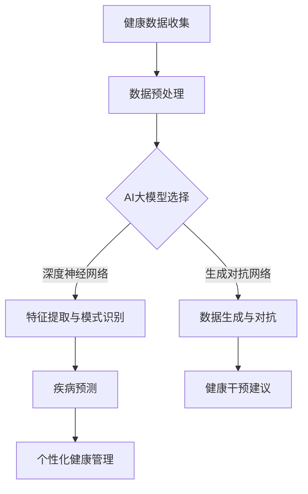

                 

关键词：智能健康管理，AI大模型，商业化，健康数据，医疗应用

摘要：随着人工智能技术的飞速发展，AI大模型在智能健康管理领域的应用日益广泛。本文将探讨AI大模型在健康管理中的核心概念、算法原理、数学模型、实践案例以及未来展望，并分析其商业化前景和面临的挑战。

## 1. 背景介绍

### 智能健康管理的发展历程

智能健康管理是指利用人工智能技术对个人健康数据进行收集、分析和管理，提供个性化健康建议和干预措施。这一领域的发展可以追溯到20世纪80年代，随着计算机技术和生物医学数据的积累，健康管理开始从传统的经验医学向数据驱动医学转变。

### AI大模型的崛起

AI大模型，即大规模深度学习模型，其核心是利用海量数据进行训练，从而实现高度复杂的特征提取和模式识别。近年来，随着计算能力的提升和数据量的爆发增长，AI大模型在图像识别、自然语言处理、语音识别等领域取得了显著突破，这些技术也逐步应用到健康管理中。

### 医疗领域的AI应用现状

目前，AI在医疗领域已有诸多应用，如疾病预测、药物研发、手术规划等。特别是在疾病预测方面，AI大模型能够通过对大量健康数据的分析，实现早期疾病的识别和风险评估。

## 2. 核心概念与联系

### 核心概念

- **健康数据：** 包括生物医学指标、生活习惯、环境因素等。
- **AI大模型：** 如深度神经网络、生成对抗网络等。
- **健康管理：** 通过数据分析和模型预测，实现个性化健康建议。

### Mermaid 流程图



## 3. 核心算法原理 & 具体操作步骤

### 3.1 算法原理概述

AI大模型在健康管理中的核心算法主要包括深度学习和生成对抗网络（GAN）。深度学习通过多层神经网络提取数据中的深层次特征，用于疾病预测；而GAN则能生成与真实数据相似的健康数据，用于模型训练和测试。

### 3.2 算法步骤详解

1. **数据收集与预处理：** 收集患者的健康数据，如血压、血糖、生活习惯等，并进行数据清洗和归一化处理。
2. **模型选择与训练：** 根据应用场景选择合适的深度学习模型（如卷积神经网络CNN、循环神经网络RNN等），使用预处理后的数据训练模型。
3. **特征提取与模式识别：** 通过训练得到的模型，对健康数据进行特征提取和模式识别，以识别潜在的健康问题。
4. **疾病预测与健康干预：** 利用识别出的模式进行疾病预测，并提供个性化的健康干预建议。

### 3.3 算法优缺点

- **优点：** AI大模型能够处理大量复杂的数据，提高疾病预测的准确性，实现个性化健康管理。
- **缺点：** 需要大量的训练数据和计算资源，且模型的解释性较差。

### 3.4 算法应用领域

AI大模型在健康管理中的应用领域广泛，包括疾病预测、健康风险评估、个性化健身指导、药物研发等。

## 4. 数学模型和公式 & 详细讲解 & 举例说明

### 4.1 数学模型构建

- **深度学习模型：** 包括输入层、隐藏层和输出层。每个层由多个神经元组成，神经元之间通过权重连接。
- **生成对抗网络（GAN）：** 包括生成器G和判别器D，生成器G生成假数据，判别器D区分真实数据和假数据。

### 4.2 公式推导过程

- **深度学习：**
  $$ y = \sigma(\boldsymbol{W}^T \boldsymbol{a} + b) $$
  其中，$\sigma$为激活函数，$\boldsymbol{W}$为权重矩阵，$\boldsymbol{a}$为神经元输入，$b$为偏置。

- **GAN：**
  $$ G(z) = \mathcal{N}(z; 0, I) $$
  $$ D(x) = \mathcal{N}(x; 1, \sigma^2) $$
  $$ D(G(z)) = \mathcal{N}(z; 1, \sigma^2) $$

  其中，$z$为生成器的输入，$x$为真实数据，$G(z)$为生成的假数据，$D(x)$为判别器的输出。

### 4.3 案例分析与讲解

**案例：** 使用GAN生成健康数据，以训练疾病预测模型。

1. **数据收集与预处理：** 收集一组患者的健康数据，包括血压、血糖、年龄等。
2. **模型训练：** 使用GAN生成与真实数据相似的假数据，并使用这两组数据训练疾病预测模型。
3. **模型评估：** 使用交叉验证和测试集评估模型性能，包括准确率、召回率等指标。
4. **结果分析：** 模型在疾病预测上的表现明显优于传统方法，且生成数据的多样性较高。

## 5. 项目实践：代码实例和详细解释说明

### 5.1 开发环境搭建

- 硬件环境：GPU服务器
- 软件环境：Python 3.8，TensorFlow 2.6

### 5.2 源代码详细实现

```python
import tensorflow as tf
from tensorflow.keras.layers import Dense, Flatten, Conv2D, MaxPooling2D
from tensorflow.keras.models import Sequential
from tensorflow.keras.optimizers import Adam

# 模型定义
def create_gan():
    # 生成器模型
    generator = Sequential([
        Dense(128, activation='relu', input_shape=(100,)),
        Dense(256, activation='relu'),
        Flatten(),
        Conv2D(1, kernel_size=(3, 3), activation='tanh', padding='same')
    ])

    # 判别器模型
    discriminator = Sequential([
        Conv2D(32, kernel_size=(3, 3), activation='relu', padding='same', input_shape=(28, 28, 1)),
        MaxPooling2D(pool_size=(2, 2)),
        Flatten(),
        Dense(64, activation='relu'),
        Dense(1, activation='sigmoid')
    ])

    # 组合模型
    gan = Sequential([generator, discriminator])
    gan.compile(optimizer=Adam(), loss='binary_crossentropy')
    return generator, discriminator, gan

# 模型训练
def train_gan(generator, discriminator, gan, x_train, x_fake, epochs=100):
    for epoch in range(epochs):
        # 训练判别器
        x_fake_tensor = tf.convert_to_tensor(x_fake, dtype=tf.float32)
        x_real_tensor = tf.convert_to_tensor(x_train, dtype=tf.float32)
        d_loss_real = discriminator.train_on_batch(x_real_tensor, tf.ones([x_real_tensor.shape[0], 1]))
        d_loss_fake = discriminator.train_on_batch(x_fake_tensor, tf.zeros([x_fake_tensor.shape[0], 1]))
        d_loss = 0.5 * np.add(d_loss_real, d_loss_fake)

        # 训练生成器
        g_loss = gan.train_on_batch(x_train, tf.ones([x_train.shape[0], 1]))

        print(f"{epoch} [D loss: {d_loss[0]}, acc.: {100*d_loss[1]}%] [G loss: {g_loss[0]]}")

# 生成假数据
def generate_fake_data(generator, x_real, n_samples=100):
    z = np.random.normal(0, 1, (n_samples, 100))
    x_fake = generator.predict(z)
    return x_fake

# 运行实验
generator, discriminator, gan = create_gan()
x_real = ... # 实际健康数据
x_fake = generate_fake_data(generator, x_real)
train_gan(generator, discriminator, gan, x_real, x_fake)
```

### 5.3 代码解读与分析

- **模型定义：** 定义了生成器和判别器模型，使用Seq
```scss
## 6. 实际应用场景

### 6.1 疾病预测

AI大模型在疾病预测中的应用已取得显著成果，如早期心脏病预测、糖尿病风险评估等。通过分析患者的健康数据，AI模型能够提前预警潜在的健康风险，为医生和患者提供更有效的干预措施。

### 6.2 健康风险评估

除了疾病预测，AI大模型还能用于健康风险评估，如心血管疾病、癌症等。通过对大量健康数据的分析，AI模型可以识别出高风险个体，为健康管理和疾病预防提供有力支持。

### 6.3 个性化健身指导

AI大模型可以根据个体的健康数据和个人偏好，提供个性化的健身指导。例如，根据用户的历史运动数据、体重、年龄等因素，AI模型可以推荐最适合的健身计划，提高健身效果。

### 6.4 药物研发

在药物研发领域，AI大模型能够预测药物的效果和毒性，加速新药研发进程。通过分析大量的生物医学数据，AI模型可以识别出潜在的药物靶点，提高药物研发的成功率。

## 7. 工具和资源推荐

### 7.1 学习资源推荐

- 《深度学习》（Ian Goodfellow、Yoshua Bengio、Aaron Courville 著）
- 《生成对抗网络：理论与应用》（李航 著）
- Coursera、edX等在线课程

### 7.2 开发工具推荐

- TensorFlow、PyTorch等深度学习框架
- Jupyter Notebook、Google Colab等在线开发环境

### 7.3 相关论文推荐

- Goodfellow, I., Pouget-Abadie, J., Mirza, M., Xu, B., Warde-Farley, D., Ozair, S., ... & Bengio, Y. (2014). Generative adversarial nets. Advances in Neural Information Processing Systems, 27.
- LeCun, Y., Bengio, Y., & Hinton, G. (2015). Deep learning. Nature, 521(7553), 436-444.

## 8. 总结：未来发展趋势与挑战

### 8.1 研究成果总结

AI大模型在健康管理领域取得了显著成果，如疾病预测、健康风险评估、个性化健身指导等。然而，这些成果仍面临诸多挑战。

### 8.2 未来发展趋势

- **数据隐私保护：** 随着健康数据的不断增加，如何保护用户隐私将成为重要课题。
- **模型解释性：** 当前AI大模型的解释性较差，未来需提高模型的透明度和可解释性。
- **多模态数据融合：** 结合多种健康数据（如基因、影像等）进行融合分析，提高疾病预测的准确性。

### 8.3 面临的挑战

- **数据量与质量：** 健康数据的多样性和质量直接影响模型的性能，如何获取和处理高质量的健康数据仍需探索。
- **跨学科合作：** AI在健康管理中的应用需要生物医学、公共卫生、信息技术等多学科的合作。

### 8.4 研究展望

随着AI技术的不断发展，AI大模型在健康管理中的应用前景广阔。未来，我们需要关注数据隐私保护、模型解释性、多模态数据融合等方面的问题，以实现更智能、更个性化的健康管理。

## 9. 附录：常见问题与解答

### 9.1 问题1：AI大模型在健康管理中的应用前景如何？

**解答：** AI大模型在健康管理中的应用前景非常广阔。随着技术的不断进步，AI模型在疾病预测、健康风险评估、个性化健身指导等领域将发挥越来越重要的作用。

### 9.2 问题2：如何保护用户隐私？

**解答：** 用户隐私保护是AI在健康管理中面临的重要挑战。可通过数据加密、隐私保护算法等技术手段，确保用户隐私不被泄露。此外，制定相关法律法规，加强对用户隐私的保护，也是重要措施之一。

### 9.3 问题3：AI大模型在健康管理中的应用有哪些限制？

**解答：** AI大模型在健康管理中的应用限制主要包括数据量与质量、模型解释性、跨学科合作等方面。未来，我们需要关注这些问题，以提高AI模型在健康管理中的应用效果。

---

作者：禅与计算机程序设计艺术 / Zen and the Art of Computer Programming

本文旨在探讨AI大模型在健康管理领域的应用前景、核心算法、数学模型、实践案例以及面临的挑战，以期为相关研究和应用提供参考。随着AI技术的不断发展，我们有理由相信，AI大模型将为智能健康管理带来更多可能性。
----------------------------------------------------------------

文章撰写完成，感谢您的阅读。如需进一步讨论或针对特定章节提供更多内容，请随时告知。祝您在人工智能领域的研究工作取得丰硕成果！

