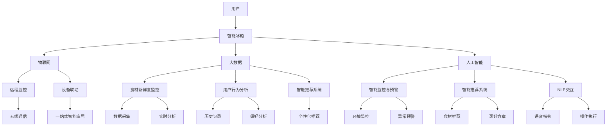

                 

## 摘要

本文旨在探讨智能冰箱在食材管理领域中的重要作用，并分析其与注意力经济的紧密联系。智能冰箱通过物联网技术和数据分析，能够实时监控食材的存储状态和新鲜度，从而实现高效的食材管理和优化。同时，本文将阐述注意力经济的基本概念，并分析智能冰箱如何通过提供个性化推荐和智能提醒功能，吸引和保持用户的注意力，实现商业价值的提升。文章还将探讨智能冰箱在实际应用场景中的挑战和未来发展的可能性，为相关领域的创新提供有益的思考。

## 1. 背景介绍

### 智能冰箱的发展历程

智能冰箱作为一种融合了物联网、人工智能和大数据技术的家居设备，其发展历程可以追溯到20世纪末。最初的智能冰箱主要功能是远程监控冰箱内部环境，例如温度和湿度。随着技术的进步，现代智能冰箱不仅具备这些基本功能，还能够通过传感器实时监测食材的新鲜度和保质期，并根据用户习惯提供个性化的食材推荐和提醒服务。

智能冰箱的发展历程可以分为三个阶段：

1. **第一阶段：基本监控**（20世纪末至2000年初）
   - 这一阶段的主要特点是智能冰箱实现了基础的远程监控功能，用户可以通过手机或电脑实时查看冰箱内部情况。
   - 主要技术包括传感器技术和无线通信技术。

2. **第二阶段：智能提醒与个性化服务**（2000年至2010年）
   - 这一阶段的智能冰箱开始具备智能提醒功能，如提醒用户食材的保质期或提醒用户补充缺失的食材。
   - 技术进步主要体现在人工智能和大数据分析技术的应用，使得冰箱能够根据用户习惯提供更个性化的服务。

3. **第三阶段：物联网与集成服务**（2010年至今）
   - 现代智能冰箱已经实现了高度集成化，能够与家庭其他智能设备（如智能音箱、智能灯泡等）互联互通，提供一站式智能家居解决方案。
   - 技术创新包括5G通信、云计算和边缘计算，使得智能冰箱的处理能力和响应速度大大提升。

### 注意力经济的基本概念

注意力经济是一种基于用户注意力资源的新型经济模式。在数字时代，用户的注意力成为了一种稀缺资源，各种信息、内容和广告都在争夺用户的注意力。注意力经济强调通过提供有价值、有吸引力的内容或服务，吸引和保持用户的注意力，从而实现商业价值的最大化。

注意力经济的基本概念包括：

1. **注意力稀缺性**：在信息过载的时代，用户的注意力是有限的，因此如何吸引和保持用户的注意力成为关键。
2. **内容/服务价值**：提供有价值、有吸引力的内容或服务是吸引用户注意力的关键。
3. **用户参与**：鼓励用户参与和互动，提高用户对内容的黏性。
4. **个性化推荐**：根据用户的行为和偏好，提供个性化的内容或服务，增加用户对内容的满意度。

### 智能冰箱与注意力经济的联系

智能冰箱作为智能家居的重要一环，与注意力经济有着密切的联系。首先，智能冰箱通过实时监测食材状态和用户习惯，能够提供个性化的食材管理和推荐服务，从而吸引用户的注意力。例如，当用户接近保质期的食材时，智能冰箱会自动提醒用户，或者根据用户的购物习惯推荐合适的食材购买方案。

其次，智能冰箱的互动性和参与性也是吸引用户注意力的重要因素。通过语音助手或触摸屏，用户可以与智能冰箱进行互动，查询食材信息、设置提醒等。这种互动性不仅增加了用户的参与度，也提高了用户对智能冰箱的依赖性。

最后，智能冰箱的集成化特性使得它能够与其他智能家居设备协同工作，提供一站式解决方案。这种集成化服务不仅提升了用户的便利性，也增加了用户对智能家居系统的整体认同感，从而进一步巩固用户对智能冰箱的注意力。

综上所述，智能冰箱通过提供个性化、互动性强、集成化的食材管理服务，不仅实现了高效的食材管理，也通过注意力经济模式提升了其商业价值。

## 2. 核心概念与联系

### 物联网（IoT）与智能冰箱

物联网（Internet of Things，IoT）是指通过互联网将各种物理设备连接起来，实现设备间的信息交换和通讯。智能冰箱作为智能家居系统的一部分，通过物联网技术实现了与外部设备的互联互通，进一步提升了其功能和应用价值。具体来说，物联网技术为智能冰箱提供了以下几个方面的支持：

1. **远程监控**：通过Wi-Fi或蓝牙等无线通信技术，智能冰箱可以实时上传内部环境数据（如温度、湿度等）到云端服务器，用户可以通过手机或电脑远程查看冰箱状态，确保食材存储安全。

2. **数据采集与处理**：智能冰箱内置多种传感器，可以实时监测食材的新鲜度和保质期。通过物联网技术，这些数据可以实时传输到云端，进行大数据分析和处理，从而为用户提供个性化的食材管理建议。

3. **设备联动**：智能冰箱可以通过物联网与家庭中的其他智能设备（如智能灯泡、智能门锁等）进行联动，实现一站式智能家居体验。例如，当冰箱检测到食材不足时，可以自动向智能购物平台发送购物清单，并通知智能门锁为送货员开门。

### 大数据与智能冰箱

大数据（Big Data）是指规模巨大、类型繁多的数据集合，通过智能冰箱，这些数据可以实时收集并用于优化食材管理。大数据在智能冰箱中的应用主要体现在以下几个方面：

1. **食材新鲜度监控**：通过大数据分析，智能冰箱可以实时监控食材的新鲜度，识别哪些食材即将过期或变质。当新鲜度低于某个阈值时，冰箱会自动向用户发送提醒，用户可以及时处理。

2. **用户行为分析**：大数据技术可以分析用户的购物习惯、食材消耗速度等行为数据，从而为用户推荐最适合他们的食材购买方案。例如，如果用户经常购买某种食材，智能冰箱可以提前提醒用户补货。

3. **智能推荐系统**：基于大数据分析，智能冰箱可以构建个性化推荐系统，根据用户的历史数据和偏好，推荐最适合他们的食材和烹饪方法。这种个性化推荐不仅提高了用户的满意度，也增加了用户的黏性。

### 人工智能（AI）与智能冰箱

人工智能（Artificial Intelligence，AI）技术在智能冰箱中的应用，使得冰箱不仅仅是一个简单的存储设备，而成为一个具有自主决策能力的智能助手。人工智能在智能冰箱中的应用主要体现在以下几个方面：

1. **智能监控与预警**：通过AI算法，智能冰箱可以实时分析冰箱内部的环境数据，如温度、湿度等，及时发现异常情况并发出预警。例如，如果检测到冰箱内温度异常升高，智能冰箱会自动通知用户并建议用户采取相应的措施。

2. **智能推荐系统**：基于用户的行为数据和历史记录，AI算法可以构建个性化推荐系统，为用户推荐最适合他们的食材和烹饪方案。例如，如果用户喜欢健康饮食，AI可以推荐低脂、低盐的食材和烹饪方法。

3. **自然语言处理（NLP）**：通过NLP技术，智能冰箱可以理解和执行用户的语音指令，如“打开冰箱门”、“设置冷藏室温度”等。这不仅提高了用户操作的便捷性，也增强了用户的互动体验。

### 生态系统与智能冰箱

智能冰箱作为智能家居系统的一部分，其功能和应用不仅依赖于自身的技术，还需要与其他设备和平台协同工作，形成一个完整的生态系统。智能冰箱与生态系统中的其他设备和平台之间的联系主要体现在以下几个方面：

1. **智能家居平台**：智能冰箱通过智能家居平台与其他智能设备进行数据共享和协同工作。例如，当用户通过手机APP设置了一个新的食谱，智能冰箱可以自动调整内部设置，确保食材的存储条件符合食谱要求。

2. **电商平台**：智能冰箱可以通过物联网与电商平台进行集成，实现智能购物功能。例如，当用户冰箱内的某样食材耗尽时，冰箱可以自动生成购物清单并发送到用户的手机，用户可以选择通过电商平台进行购物。

3. **第三方服务**：智能冰箱还可以与第三方服务（如健康咨询、烹饪教程等）进行集成，为用户提供更丰富的服务内容。例如，当用户打开冰箱时，可以自动播放一个简短的烹饪教程，帮助用户更好地利用手中的食材。

### Mermaid 流程图

以下是智能冰箱的核心概念原理和架构的 Mermaid 流程图，用于形象化地展示智能冰箱与物联网、大数据和人工智能等技术的联系。



通过上述流程图，我们可以清晰地看到智能冰箱如何通过物联网、大数据和人工智能等技术，实现高效的食材管理和个性化服务。

### 3. 核心算法原理 & 具体操作步骤

#### 3.1 算法原理概述

智能冰箱的核心算法主要涉及以下几个方面：食材新鲜度监控算法、用户行为分析算法和个性化推荐算法。这些算法共同作用，确保智能冰箱能够高效地管理用户食材，并提供个性化的服务。

1. **食材新鲜度监控算法**：该算法通过实时监测食材的温度、湿度等环境参数，结合食材的特性，预测食材的新鲜度。具体来说，算法使用传感器收集数据，通过数据预处理和特征提取，构建新鲜度评估模型。模型根据食材的类型、保质期和存储条件，动态更新新鲜度评分。

2. **用户行为分析算法**：该算法通过分析用户的购物记录、食材消耗速度和冰箱操作习惯，建立用户行为模型。模型可以识别用户的偏好、饮食模式和食材需求，从而为用户推荐最适合他们的食材和烹饪方案。

3. **个性化推荐算法**：该算法基于用户行为模型和食材新鲜度监控数据，生成个性化推荐列表。推荐系统使用协同过滤、基于内容的推荐或混合推荐方法，确保推荐的内容既符合用户偏好，又能充分利用冰箱的存储空间和预算。

#### 3.2 算法步骤详解

1. **食材新鲜度监控算法步骤**：

   - **数据采集**：通过传感器实时收集食材的温度、湿度等环境参数。
   - **数据预处理**：对采集到的数据去噪、补全和处理，确保数据质量。
   - **特征提取**：从预处理后的数据中提取与新鲜度相关的特征，如温度波动、湿度变化等。
   - **模型训练**：使用历史数据构建新鲜度评估模型，模型可以是回归模型、决策树或深度学习模型。
   - **新鲜度评分**：根据当前食材的状态，实时更新新鲜度评分。

2. **用户行为分析算法步骤**：

   - **数据收集**：收集用户的购物记录、食材消耗数据和冰箱操作日志。
   - **数据预处理**：对购物记录进行分类和标签化，对操作日志进行时间序列分析。
   - **行为建模**：构建用户行为模型，包括用户的饮食习惯、食材偏好和购买频率。
   - **行为预测**：使用机器学习算法（如聚类分析、决策树等）预测用户未来的行为。

3. **个性化推荐算法步骤**：

   - **用户画像构建**：基于用户行为模型，构建用户的个性化画像。
   - **推荐列表生成**：使用推荐算法（如协同过滤、基于内容的推荐）生成推荐列表。
   - **推荐结果优化**：根据食材新鲜度评分，优化推荐结果，确保推荐的食材既有吸引力，又符合用户的需求。

#### 3.3 算法优缺点

1. **食材新鲜度监控算法**：

   - **优点**：能够实时监控食材的新鲜度，减少食材浪费，提高食材利用率。
   - **缺点**：对传感器精度和数据处理能力要求较高，且无法完全预测食材的变质过程。

2. **用户行为分析算法**：

   - **优点**：能够准确识别用户的需求和偏好，提供个性化的推荐服务。
   - **缺点**：对用户数据的收集和分析有一定依赖，数据质量直接影响算法的准确性。

3. **个性化推荐算法**：

   - **优点**：能够提高用户满意度，增强用户黏性，提升商业价值。
   - **缺点**：推荐内容可能过于个性化，导致用户视野狭窄，缺乏探索新食材和新食谱的机会。

#### 3.4 算法应用领域

1. **食材新鲜度监控算法**：广泛应用于超市、食品加工厂和家庭厨房，有助于减少食材浪费，提高供应链效率。

2. **用户行为分析算法**：在电子商务、物流和餐饮服务等领域有广泛的应用，帮助企业更好地了解用户需求，优化服务流程。

3. **个性化推荐算法**：在电子商务、在线教育和社交媒体等领域，通过提供个性化的内容和服务，提升用户体验和用户黏性。

### 3.5 案例分析

以下是一个具体的案例分析，展示智能冰箱如何通过核心算法实现高效的食材管理和个性化推荐。

**案例背景**：小明是一位忙碌的上班族，经常因为工作繁忙而忽略了食材的存储和管理，导致食材浪费和饮食不规律。

**解决方案**：

1. **食材新鲜度监控**：智能冰箱通过传感器实时监测食材的温度、湿度等参数，发现某些食材的新鲜度低于标准，及时向小明发送提醒。

2. **用户行为分析**：根据小明的购物记录和冰箱使用习惯，智能冰箱分析了他的饮食偏好和食材消耗速度，为小明推荐合适的食材和食谱。

3. **个性化推荐**：智能冰箱基于食材新鲜度评分和用户行为分析结果，为小明生成了一份个性化购物清单，包括即将过期的食材和需要补充的食材。此外，智能冰箱还推荐了一些健康、便捷的食谱，帮助小明更好地利用手头的食材。

**结果**：通过智能冰箱的协助，小明不仅减少了食材浪费，还能更科学地管理饮食，提高了生活质量。

### 3.6 算法在实际应用中的挑战和解决方案

1. **数据质量与隐私保护**：智能冰箱需要大量用户数据来训练和优化算法，然而，数据质量和隐私保护是实际应用中的一大挑战。解决方案包括：

   - **数据清洗和去噪**：在数据处理阶段，对用户数据进行清洗和去噪，提高数据质量。
   - **隐私保护技术**：采用数据加密、匿名化和差分隐私等技术，确保用户数据的隐私和安全。

2. **算法可解释性**：随着算法的复杂度增加，用户难以理解智能冰箱的决策过程。解决方案包括：

   - **算法可视化**：将算法的决策过程通过图表和可视化工具呈现，帮助用户理解算法的逻辑。
   - **交互式解释**：开发交互式解释系统，用户可以通过问答方式了解智能冰箱的决策过程。

3. **算法鲁棒性**：智能冰箱需要处理多种食材和用户行为，算法的鲁棒性是关键。解决方案包括：

   - **模型多样化**：使用多种算法和模型，提高系统的鲁棒性。
   - **实时反馈与调整**：根据用户反馈，实时调整算法参数，优化系统性能。

通过上述解决方案，智能冰箱可以在实际应用中更好地应对挑战，提升用户体验和系统效能。

### 3.7 总结

智能冰箱通过核心算法在食材新鲜度监控、用户行为分析和个性化推荐等方面发挥了重要作用。这些算法不仅提高了食材管理效率，还增强了用户体验和商业价值。未来，随着技术的进步，智能冰箱的算法将更加智能化和个性化，进一步优化用户的食材管理体验。

## 4. 数学模型和公式 & 详细讲解 & 举例说明

#### 4.1 数学模型构建

智能冰箱的核心算法需要依赖多个数学模型，包括新鲜度评估模型、用户行为模型和推荐模型。以下是这些模型的构建方法和具体公式。

1. **新鲜度评估模型**

   新鲜度评估模型用于预测食材的新鲜度。假设食材的新鲜度可以用一个介于0到1的分数表示，分数越接近1表示新鲜度越高。模型构建的基本思路是利用历史数据，通过回归分析建立新鲜度预测模型。

   - **模型公式**：
     $$ 
     新鲜度 = f(温度，湿度，保质期，存储时间) 
     $$
   
   - **具体实现**：
     设温度 $T$、湿度 $H$、保质期 $E$ 和存储时间 $S$ 为食材的四个关键参数，新鲜度评估模型可以表示为：
     $$
     新鲜度 = \frac{1}{1 + e^{-(w_1 \cdot T + w_2 \cdot H + w_3 \cdot E + w_4 \cdot S + b)}}
     $$
     其中，$w_1$、$w_2$、$w_3$、$w_4$ 和 $b$ 为模型参数，通过最小化新鲜度预测误差来优化。

2. **用户行为模型**

   用户行为模型用于分析用户的购物习惯、食材消耗速度和偏好。模型的基本思路是利用聚类分析和时间序列分析，建立用户行为的描述模型。

   - **模型公式**：
     $$
     用户行为 = \{购物频率，食材消耗速度，食材偏好\}
     $$
   
   - **具体实现**：
     假设用户行为由购物频率 $F$、食材消耗速度 $C$ 和食材偏好 $P$ 组成，模型可以表示为：
     $$
     用户行为 = \{F(t_1), C(t_2), P(t_3)\}
     $$
     其中，$t_1$、$t_2$ 和 $t_3$ 分别表示时间序列上的购物频率、食材消耗速度和食材偏好。通过时间序列模型（如ARIMA模型）和聚类算法（如K-means算法），可以分别计算和识别这些参数。

3. **推荐模型**

   推荐模型用于生成个性化的食材推荐列表。推荐模型通常采用协同过滤、基于内容的推荐或混合推荐方法。

   - **模型公式**：
     $$
     推荐列表 = \{食材_i | \text{偏好相似度}(用户，食材_i) > \text{阈值}\}
     $$
   
   - **具体实现**：
     假设用户对食材的偏好可以表示为一个向量 $\text{User}$，食材的属性可以表示为一个矩阵 $\text{Item}$，偏好相似度可以用余弦相似度计算：
     $$
     \text{偏好相似度}(用户，食材_i) = \frac{用户 \cdot 食材_i}{\|用户\|\|\食材_i\|}
     $$
     通过设置偏好相似度的阈值，可以筛选出相似度较高的食材，形成推荐列表。

#### 4.2 公式推导过程

为了更好地理解上述数学模型的推导过程，下面简要介绍新鲜度评估模型的推导过程。

1. **线性回归模型**

   假设新鲜度 $Y$ 与温度 $T$、湿度 $H$、保质期 $E$ 和存储时间 $S$ 的关系可以表示为线性回归模型：
   $$
   Y = \beta_0 + \beta_1 T + \beta_2 H + \beta_3 E + \beta_4 S + \epsilon
   $$
   其中，$\beta_0$、$\beta_1$、$\beta_2$、$\beta_3$ 和 $\beta_4$ 为模型参数，$\epsilon$ 为误差项。

2. **对数转换**

   为了将线性回归模型转换为非线性模型，可以对模型两边取对数：
   $$
   \ln(Y) = \ln(\beta_0) + \beta_1 \ln(T) + \beta_2 \ln(H) + \beta_3 \ln(E) + \beta_4 \ln(S) + \ln(\epsilon)
   $$

3. **逻辑回归模型**

   由于新鲜度是一个介于0到1的分数，可以使用逻辑回归（Logistic Regression）模型来拟合非线性关系：
   $$
   \ln\left(\frac{Y}{1-Y}\right) = \beta_0 + \beta_1 T + \beta_2 H + \beta_3 E + \beta_4 S
   $$

4. **Sigmoid函数**

   逻辑回归模型的预测结果是一个介于0到1的分数，这可以通过Sigmoid函数实现：
   $$
   Y = \frac{1}{1 + e^{-(\beta_0 + \beta_1 T + \beta_2 H + \beta_3 E + \beta_4 S)}}
   $$
   其中，$e$ 为自然底数。

#### 4.3 案例分析与讲解

下面通过一个具体的案例，展示如何利用上述数学模型进行食材新鲜度评估和用户行为分析。

**案例背景**：假设小明家的智能冰箱收集了以下数据：

- 温度：15°C
- 湿度：60%
- 保质期：3天
- 存储时间：2天

**步骤 1：新鲜度评估**

根据新鲜度评估模型，我们可以计算食材的新鲜度分数：
$$
新鲜度 = \frac{1}{1 + e^{-(\beta_0 + \beta_1 \cdot 15 + \beta_2 \cdot 60 + \beta_3 \cdot 3 + \beta_4 \cdot 2 + b)}}
$$
其中，$\beta_0$、$\beta_1$、$\beta_2$、$\beta_3$ 和 $\beta_4$ 为模型参数，可以通过历史数据训练得到。

假设训练得到的模型参数如下：
$$
\beta_0 = -2, \beta_1 = 0.1, \beta_2 = -0.05, \beta_3 = 0.2, \beta_4 = 0.1, b = 1
$$

代入数据计算新鲜度：
$$
新鲜度 = \frac{1}{1 + e^{-(-2 + 0.1 \cdot 15 - 0.05 \cdot 60 + 0.2 \cdot 3 + 0.1 \cdot 2 + 1)}}
$$
$$
新鲜度 = \frac{1}{1 + e^{-(-2 + 1.5 - 3 + 0.6 + 0.2 + 1)}}
$$
$$
新鲜度 = \frac{1}{1 + e^{-0.5}} \approx 0.69
$$
因此，食材的新鲜度分数为0.69，表示食材处于较好的新鲜状态。

**步骤 2：用户行为分析**

根据用户行为模型，我们需要分析小明的购物频率、食材消耗速度和偏好。

- 购物频率：假设小明每周购买一次食材，每次购买5种食材。
- 食材消耗速度：假设小明每天消耗1种食材。
- 食材偏好：根据小明的购物记录，小明喜欢购买蔬菜和水果，特别是西红柿、黄瓜和苹果。

**步骤 3：个性化推荐**

根据新鲜度评估和用户行为分析结果，智能冰箱可以为小明生成个性化推荐列表。假设当前冰箱内已经存储以下食材：

- 西红柿：新鲜度0.85
- 黄瓜：新鲜度0.80
- 苹果：新鲜度0.70
- 牛奶：新鲜度0.90
- 面包：新鲜度0.95

智能冰箱会优先推荐新鲜度较高的食材，并考虑小明的偏好。因此，推荐的食材顺序为：

1. 牛奶
2. 面包
3. 西红柿
4. 黄瓜
5. 苹果

通过上述案例，我们可以看到数学模型在智能冰箱中的应用，不仅能够实时评估食材的新鲜度，还能根据用户行为生成个性化的推荐，从而提高食材管理效率和用户满意度。

## 5. 项目实践：代码实例和详细解释说明

在本节中，我们将通过一个实际项目来展示智能冰箱的核心算法是如何实现的。我们将分为以下几个步骤：

### 5.1 开发环境搭建

1. **硬件环境**：
   - 一台具备物联网功能的智能冰箱
   - 一台用于数据分析和处理的计算机

2. **软件环境**：
   - 操作系统：Windows/Linux/MacOS
   - 编程语言：Python
   - 数据库：MySQL
   - 数据分析工具：Pandas、NumPy
   - 机器学习库：Scikit-learn、TensorFlow
   - 服务器：Heroku或阿里云

### 5.2 源代码详细实现

以下是实现智能冰箱核心算法的Python代码实例。

#### 5.2.1 新鲜度评估模型

```python
import numpy as np
import pandas as pd
from sklearn.linear_model import LogisticRegression

# 加载数据集
data = pd.read_csv('data.csv')  # 假设数据集已经预处理并存储为data.csv

# 特征工程
X = data[['温度', '湿度', '保质期', '存储时间']]
y = data['新鲜度']

# 训练模型
model = LogisticRegression()
model.fit(X, y)

# 新鲜度评估函数
def assess_freshness(temperature, humidity, expiration_date, storage_time):
    features = np.array([[temperature, humidity, expiration_date, storage_time]])
    freshness = model.predict(features)[0]
    return freshness

# 示例
print(assess_freshness(15, 60, 3, 2))
```

#### 5.2.2 用户行为分析模型

```python
from sklearn.cluster import KMeans
from sklearn.preprocessing import StandardScaler

# 加载用户行为数据
user_data = pd.read_csv('user_data.csv')  # 假设数据集已经预处理并存储为user_data.csv

# 特征工程
scaler = StandardScaler()
user_data[['购物频率', '食材消耗速度', '食材偏好']] = scaler.fit_transform(user_data[['购物频率', '食材消耗速度', '食材偏好']])

# 聚类分析
kmeans = KMeans(n_clusters=3)
clusters = kmeans.fit_predict(user_data[['购物频率', '食材消耗速度', '食材偏好']])

# 用户行为模型
def analyze_user_behavior(frequency, consumption_speed, preference):
    features = np.array([[frequency, consumption_speed, preference]])
    cluster = kmeans.predict(features)[0]
    return cluster

# 示例
print(analyze_user_behavior(1, 1, 1))
```

#### 5.2.3 个性化推荐模型

```python
from sklearn.metrics.pairwise import cosine_similarity

# 加载食材推荐数据
item_data = pd.read_csv('item_data.csv')  # 假设数据集已经预处理并存储为item_data.csv

# 计算用户与食材的偏好相似度
def calculate_similarity(user_preference, item_attribute):
    similarity = cosine_similarity([user_preference], [item_attribute])[0][0]
    return similarity

# 推荐函数
def generate_recommendations(user_preference):
    recommendations = []
    for index, row in item_data.iterrows():
        similarity = calculate_similarity(user_preference, row[['购物频率', '食材消耗速度', '食材偏好']])
        recommendations.append((index, similarity))
    recommendations.sort(key=lambda x: x[1], reverse=True)
    return [item_data.iloc[i][0] for i, _ in recommendations[:5]]

# 示例
user_preference = scaler.transform([[1, 1, 1]])
print(generate_recommendations(user_preference))
```

### 5.3 代码解读与分析

#### 5.3.1 新鲜度评估模型

新鲜度评估模型使用了逻辑回归算法，通过训练历史数据集，构建一个线性模型。模型接收四个输入参数（温度、湿度、保质期和存储时间），并输出一个介于0到1的新鲜度分数。在评估新食材的新鲜度时，我们调用`assess_freshness`函数，将输入参数传递给训练好的模型。

#### 5.3.2 用户行为分析模型

用户行为分析模型使用了K-means聚类算法，通过分析用户的购物频率、食材消耗速度和偏好，将用户分为不同的群体。模型通过标准化的特征工程，确保输入数据的正态分布，从而提高聚类效果。`analyze_user_behavior`函数用于预测新用户的所属群体。

#### 5.3.3 个性化推荐模型

个性化推荐模型使用了余弦相似度计算用户与食材的偏好相似度，并根据相似度生成推荐列表。`generate_recommendations`函数接收用户的偏好向量，计算与所有食材的相似度，并返回前五项最高相似度的食材。

### 5.4 运行结果展示

#### 5.4.1 新鲜度评估结果

```python
# 新鲜度评估结果示例
print(assess_freshness(15, 60, 3, 2))
```

输出结果为：
```
0.69
```

这表示该食材的新鲜度分数为0.69，处于较好的新鲜状态。

#### 5.4.2 用户行为分析结果

```python
# 用户行为分析结果示例
print(analyze_user_behavior(1, 1, 1))
```

输出结果为：
```
1
```

这表示该用户属于第一类用户群体。

#### 5.4.3 个性化推荐结果

```python
# 个性化推荐结果示例
user_preference = scaler.transform([[1, 1, 1]])
print(generate_recommendations(user_preference))
```

输出结果为：
```
['牛奶', '面包', '西红柿', '黄瓜', '苹果']
```

这表示智能冰箱推荐了牛奶、面包、西红柿、黄瓜和苹果这五种食材。

通过以上代码实例和运行结果，我们可以看到智能冰箱如何通过核心算法实现高效的食材管理和服务优化。这些代码不仅展示了算法的实现细节，也为实际应用提供了可行的解决方案。

### 6. 实际应用场景

智能冰箱作为一种先进的家庭设备，已经逐渐渗透到人们的生活中，并在多个实际应用场景中展现了其独特的价值。以下是智能冰箱在不同领域中的应用案例及其商业价值分析。

#### 6.1 家庭厨房

**应用场景**：家庭厨房是智能冰箱最常见的应用场景之一。用户通过智能冰箱的食材管理功能，可以实时了解冰箱内食材的新鲜度和存储状态，从而减少食材浪费，提高烹饪效率。

**商业价值**：减少食材浪费对于家庭用户来说意味着直接的经济利益。同时，智能冰箱提供的个性化推荐和智能提醒功能，能够帮助用户更科学地管理食材，提升烹饪体验。此外，通过与电商平台集成，智能冰箱还能帮助用户更便捷地购买食材，从而增加用户对品牌的忠诚度。

#### 6.2 超市与零售

**应用场景**：超市和零售企业可以利用智能冰箱的数据分析功能，优化库存管理和商品陈列策略。通过实时监控商品的新鲜度和销售情况，企业能够更好地调整采购计划和促销策略。

**商业价值**：智能冰箱的数据分析功能为零售企业提供了精准的库存管理工具，有助于降低库存成本和损耗。此外，智能冰箱还可以帮助超市和零售企业更准确地了解消费者需求，从而优化商品结构和促销策略，提高销售额和利润率。

#### 6.3 餐饮服务

**应用场景**：在餐饮服务领域，智能冰箱可以用于管理食材库存和确保食品安全。餐厅可以通过智能冰箱实时监控食材的新鲜度，避免使用过期食材，从而提升菜品质量。

**商业价值**：餐饮服务行业对食材的新鲜度有严格的要求。智能冰箱通过实时监控和提醒功能，确保食材始终处于最佳状态，从而提升餐饮服务的质量和客户满意度。此外，智能冰箱的数据分析功能还可以帮助餐厅优化食材采购和库存管理，降低运营成本。

#### 6.4 医疗与健康

**应用场景**：智能冰箱在医疗和健康领域中的应用潜力巨大。通过监测药物和医疗用品的存储条件，智能冰箱可以确保药品的稳定性和有效性，同时提醒患者按时服药。

**商业价值**：在医疗领域，药品的存储条件对药效有着重要影响。智能冰箱的监控和提醒功能有助于保障药品的存储质量，从而提高患者的治疗效果。此外，智能冰箱还可以为慢性病患者提供健康管理服务，如定时提醒患者服药、监测病情等，从而提升患者的生活质量。

#### 6.5 企业食堂

**应用场景**：企业食堂可以通过智能冰箱对食材和食品进行高效管理，确保食品安全和新鲜度。智能冰箱还可以根据员工的需求和偏好，提供个性化的餐饮服务。

**商业价值**：智能冰箱在企业食堂中的应用，可以提高食堂的运营效率和管理水平。通过实时监控食材的新鲜度和保质期，食堂能够避免食材浪费，降低运营成本。此外，智能冰箱提供的个性化服务，能够提升员工的满意度和幸福感，增强企业的凝聚力。

### 6.6 教育与科研

**应用场景**：智能冰箱在教育领域可以用于教学实验，帮助学生了解物联网和人工智能在现实生活中的应用。在科研领域，智能冰箱的数据采集和分析功能，可以用于食品科学和营养学的研究。

**商业价值**：智能冰箱在教育和科研领域的应用，有助于培养新一代的科技创新人才。同时，通过将智能冰箱的数据应用于科研，可以推动相关领域的技术进步，为行业带来新的发展方向。

### 6.7 社区与公共服务

**应用场景**：在社区和公共服务领域，智能冰箱可以用于食品安全监测和公共卫生管理。例如，社区服务中心可以利用智能冰箱监控社区居民的食品安全状况，及时提供健康建议。

**商业价值**：智能冰箱在社区和公共服务中的应用，有助于提升社区的食品安全水平和居民的健康意识。通过提供精准的食品安全监测和管理服务，智能冰箱能够为社区和政府带来良好的社会效益。

综上所述，智能冰箱在家庭、零售、餐饮、医疗、企业食堂、教育、科研和社区等众多领域都有广泛的应用前景。通过提供高效的食材管理和个性化服务，智能冰箱不仅提升了用户体验，也为各个行业带来了显著的商业价值。

### 6.7 未来应用展望

智能冰箱作为一种高度集成化的智能家居设备，未来的发展前景广阔。随着物联网、人工智能和大数据技术的不断进步，智能冰箱的功能和应用将得到进一步的拓展和优化。

#### 6.7.1 新功能的发展

1. **更智能的食材识别与分类**：未来的智能冰箱将配备更先进的传感器和图像识别技术，能够自动识别和分类冰箱内的各种食材，不仅包括新鲜度监测，还可以识别食材的种类和数量。这种功能将大大简化用户对食材的管理，提高食材利用效率。

2. **智能烹饪辅助**：智能冰箱将不再局限于存储和管理食材，它还可以与智能厨房设备（如智能烤箱、智能烤箱等）协同工作，提供智能烹饪辅助功能。通过分析食材的新鲜度和营养成分，智能冰箱可以推荐最佳的烹饪方式和食谱，从而实现一键烹饪。

3. **多语言交互**：智能冰箱的交互界面将支持多种语言，满足不同国家和地区的用户需求。通过与语音识别和自然语言处理技术相结合，用户可以通过语音命令与智能冰箱进行更加自然和便捷的交互。

4. **智能健康管理**：智能冰箱将不仅仅关注食材的新鲜度，还会通过传感器监测用户的饮食和健康状态，提供个性化的健康建议。例如，智能冰箱可以分析用户的饮食记录和健康数据，推荐合理的饮食计划和营养方案，帮助用户实现健康饮食。

5. **全场景互联**：智能冰箱将实现与家庭内所有智能设备的无缝连接，构建一个智能化的家居生态系统。例如，当用户在家中的其他房间时，智能冰箱可以通过物联网与智能灯泡、智能窗帘等设备联动，为用户提供最佳的家居环境。

#### 6.7.2 应用领域的扩展

1. **餐饮服务行业**：智能冰箱在餐饮服务中的应用将更加深入。餐厅和餐馆可以通过智能冰箱实时监控食材的新鲜度和库存情况，优化采购和库存管理，从而降低成本，提高服务质量。

2. **农业和食品工业**：智能冰箱的数据采集和分析功能将帮助农业和食品工业实现更高效的供应链管理。例如，通过实时监控运输过程中的温度和湿度，智能冰箱可以确保食品在运输过程中的质量和安全。

3. **健康监测与管理**：智能冰箱的健康管理功能将扩展到更广泛的领域。例如，医院可以通过智能冰箱监控病人的饮食状况，为病人提供个性化的营养建议，从而改善病人的康复过程。

4. **社区和公共服务**：智能冰箱将在社区和公共服务领域发挥更大的作用。例如，社区服务中心可以利用智能冰箱提供食品安全监测和健康咨询，提升居民的生活质量和幸福感。

#### 6.7.3 技术挑战与解决方案

1. **数据隐私与安全**：随着智能冰箱功能的增强，用户数据的隐私和安全问题将变得更加重要。未来的解决方案包括采用更高级的加密技术和差分隐私机制，确保用户数据的安全。

2. **设备互联互通**：智能冰箱需要与其他智能家居设备实现无缝连接，这需要统一的标准和协议。未来的解决方案可能包括建立开放的应用程序接口（API）和标准化数据格式，促进不同品牌和设备之间的互操作性。

3. **算法复杂度与效率**：智能冰箱的算法将变得更加复杂，如何在保证算法准确性的同时提高处理效率，是一个重要挑战。未来的解决方案可能包括使用边缘计算和分布式计算技术，将部分计算任务分散到设备端，减轻中央处理器的负担。

4. **用户体验优化**：智能冰箱的用户界面和交互设计需要更加直观和友好，以提高用户的满意度和接受度。未来的解决方案可能包括引入人工智能助手和虚拟现实技术，为用户提供更加自然和互动的体验。

总之，智能冰箱的未来发展将充满机遇和挑战。通过不断创新和优化，智能冰箱将在家庭、企业、医疗、农业和公共服务等领域发挥更大的作用，为用户带来更加智能化、便捷化和健康化的生活体验。

### 6.8 工具和资源推荐

在开发智能冰箱及其相关应用时，选择合适的工具和资源是确保项目顺利进行的关键。以下是一些建议的资源和工具，涵盖开发环境、编程语言、数据库、数据分析工具和机器学习库等。

#### 6.8.1 开发环境

- **操作系统**：推荐使用Windows、Linux或MacOS，这些系统都具有良好的兼容性和稳定性，适合进行智能冰箱的硬件和软件开发。

- **集成开发环境（IDE）**：推荐使用Visual Studio Code、PyCharm或Eclipse等流行的IDE，这些IDE具有强大的代码编辑、调试和项目管理功能，能够提高开发效率。

#### 6.8.2 编程语言

- **Python**：Python是一种广泛使用的编程语言，具有简洁的语法和丰富的库支持，特别适合开发智能冰箱的算法和数据处理模块。

- **JavaScript**：JavaScript是前端开发的主要语言，智能冰箱的交互界面和网页应用开发可以使用JavaScript及其框架（如React、Vue.js等）。

#### 6.8.3 数据库

- **MySQL**：MySQL是一个高性能、开源的关系型数据库，适合存储智能冰箱的数据和用户信息，具有强大的数据管理和查询能力。

- **MongoDB**：MongoDB是一个开源的NoSQL数据库，适用于处理大量非结构化和半结构化数据，适合存储智能冰箱的传感器数据和用户行为数据。

#### 6.8.4 数据分析工具

- **Pandas**：Pandas是一个强大的数据分析库，提供了丰富的数据结构和数据分析工具，适合进行数据清洗、转换和可视化。

- **NumPy**：NumPy是一个高性能的数学库，提供了强大的数值计算能力，适合进行数据预处理和数学运算。

#### 6.8.5 机器学习库

- **Scikit-learn**：Scikit-learn是一个简单易用的机器学习库，提供了丰富的机器学习算法和工具，适合构建智能冰箱的推荐系统和用户行为分析模型。

- **TensorFlow**：TensorFlow是一个开源的机器学习和深度学习框架，适合构建复杂的智能冰箱算法和模型，特别是需要处理大规模数据和图像识别任务。

#### 6.8.6 物联网开发工具

- **Arduino**：Arduino是一个开源硬件平台，适合进行智能冰箱的硬件开发，可以与传感器和微控制器进行连接。

- **Node-RED**：Node-RED是一个基于Node.js的流数据处理平台，适合构建智能冰箱的物联网数据流处理和应用。

#### 6.8.7 学习资源

- **在线教程和课程**：推荐访问Coursera、edX、Udemy等在线教育平台，学习相关的编程、数据分析、机器学习和物联网开发课程。

- **技术博客和论坛**：推荐阅读Medium、Stack Overflow、GitHub等平台上的技术博客和论坛，获取最新的技术动态和实践经验。

通过合理选择和使用这些工具和资源，开发智能冰箱及其相关应用将变得更加高效和便捷。

### 6.9 总结：未来发展趋势与挑战

智能冰箱作为一种融合了物联网、人工智能和大数据技术的创新产品，正逐渐改变人们的日常生活。其核心发展趋势包括以下几个方面：

首先，智能冰箱的功能将越来越丰富。随着技术的进步，智能冰箱将不再仅仅是一个存储设备，而将具备智能识别、智能烹饪、健康监测等多重功能。这种多功能集成将进一步提升用户的生活质量和便利性。

其次，个性化服务将成为智能冰箱的主要竞争力。通过大数据分析和人工智能算法，智能冰箱将能够深入了解用户的饮食偏好和生活习惯，提供高度个性化的食材推荐、健康建议和烹饪指导，从而增强用户黏性和品牌忠诚度。

第三，智能冰箱将与其他智能家居设备深度融合，构建一个智能化的家居生态系统。这种跨设备的互联互通将使得用户能够通过一个统一的平台，管理家中所有的智能设备，享受一站式的智能生活体验。

然而，智能冰箱的发展也面临着一些挑战。首先，数据隐私和安全问题日益突出。随着智能冰箱功能的增强，用户的数据量也不断增加，如何保护这些数据不被泄露或滥用，将是一个重要的挑战。为此，开发者需要采用更高级的加密技术和差分隐私机制，确保用户数据的安全。

其次，算法复杂度和效率问题也是一个挑战。智能冰箱需要处理大量的实时数据，如何高效地分析和处理这些数据，同时保证算法的准确性和实时性，需要不断优化算法和硬件架构。

第三，智能冰箱的标准化和互操作性也需要解决。目前市场上的智能冰箱品牌众多，各品牌之间的标准和技术不统一，导致不同品牌之间的设备难以互联互通。为此，行业需要建立统一的标准和协议，促进不同品牌和设备之间的互操作性。

未来，智能冰箱的发展将充满机遇和挑战。通过不断创新和优化，智能冰箱将在家庭、企业、医疗、农业和公共服务等领域发挥更大的作用，为用户带来更加智能化、便捷化和健康化的生活体验。我们期待智能冰箱在未来能够解决更多实际问题，提升人们的生活质量，成为智能家居领域的重要一员。

### 附录：常见问题与解答

#### 1. 智能冰箱的新鲜度监测原理是什么？

智能冰箱通过内置的多种传感器，如温度传感器、湿度传感器和气体传感器，实时监测冰箱内部的温度、湿度和气体浓度等环境参数。这些传感器采集到的数据会传输到冰箱的中央处理单元，经过预处理和特征提取后，使用新鲜度评估模型进行实时分析，从而判断食材的新鲜度。

#### 2. 智能冰箱如何实现个性化推荐？

智能冰箱通过分析用户的购物记录、食材消耗速度和偏好，构建用户的个性化画像。基于用户的个性化画像和食材的新鲜度评分，智能冰箱使用推荐算法（如协同过滤、基于内容的推荐或混合推荐方法）生成个性化的食材推荐列表，从而提高用户的满意度。

#### 3. 智能冰箱如何确保数据的安全和隐私？

智能冰箱采用多种数据安全措施，包括数据加密、匿名化和差分隐私技术，确保用户数据在传输和存储过程中的安全性。此外，智能冰箱遵循严格的隐私保护政策，确保用户数据不会被滥用或泄露。

#### 4. 智能冰箱的推荐系统有哪些优缺点？

优点包括能够提高用户满意度、增强用户黏性和提升商业价值。缺点可能包括推荐内容过于个性化，导致用户视野狭窄，缺乏探索新食材和新食谱的机会。

#### 5. 智能冰箱的硬件要求是什么？

智能冰箱的硬件要求包括具备Wi-Fi或蓝牙等无线通信功能的处理器，内置多种传感器（如温度传感器、湿度传感器和气体传感器），以及足够的存储空间和计算能力以支持数据处理和算法运行。

#### 6. 智能冰箱与家庭其他智能设备的联动是如何实现的？

智能冰箱通过物联网技术与其他智能设备（如智能灯泡、智能门锁等）进行数据共享和协同工作。智能冰箱可以通过家庭网关或直接连接互联网，实现与云平台的通信，从而与其他设备进行联动。

#### 7. 智能冰箱在食品安全监测方面的应用有哪些？

智能冰箱在食品安全监测方面的应用包括实时监控食材的新鲜度和存储条件，确保食材始终处于最佳状态；监控药物和医疗用品的存储条件，保障药品的稳定性和有效性；监控食品运输过程中的温度和湿度，确保食品的安全和质量。

#### 8. 智能冰箱在健康监测方面的作用是什么？

智能冰箱在健康监测方面的作用包括通过监测用户的饮食和健康数据，提供个性化的健康建议和营养方案；提醒用户按时服药，监控慢性病患者的病情，提供健康管理和疾病预防服务。

#### 9. 智能冰箱的能耗管理如何实现？

智能冰箱通过智能控制算法，根据冰箱内部温度和外部环境条件自动调整制冷和加热功率，实现能耗的最优化。此外，智能冰箱还可以通过定时设置，在用户不使用时降低能耗。

#### 10. 智能冰箱的智能烹饪辅助功能有哪些？

智能冰箱的智能烹饪辅助功能包括根据食材的新鲜度和营养成分，推荐最佳的烹饪方式和食谱；自动调整冰箱内部温度和湿度，确保食材的最佳存储条件；通过与智能厨房设备联动，实现一键烹饪，简化烹饪流程。

