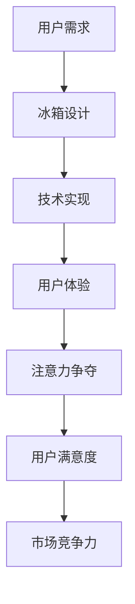

                 

关键词：智能冰箱，智能家居，厨房场景，注意力争夺，物联网，用户体验

>摘要：随着物联网技术的发展，智能家电逐渐融入我们的日常生活，智能冰箱作为厨房中的核心设备，其用户体验和注意力争夺能力成为了研究的热点。本文将探讨智能冰箱在厨房场景中的设计理念、技术挑战及其未来发展。

## 1. 背景介绍

近年来，智能家居市场呈现出爆炸式增长，各种智能设备纷纷涌入家庭。智能冰箱作为厨房中的核心设备，承载着存储、保鲜、展示等多种功能。随着人工智能技术的不断发展，智能冰箱的智能化程度越来越高，用户对其的注意力争夺也日益激烈。如何在众多智能设备中脱颖而出，吸引用户的目光，成为了智能冰箱设计师们亟待解决的问题。

## 2. 核心概念与联系

### 2.1 智能家居

智能家居是指利用物联网、云计算、大数据等技术，将家庭设备互联互通，实现智能化管理和控制。智能家居系统包括智能照明、智能安防、智能家电等多个方面，其中智能冰箱是厨房场景下的重要组成部分。

### 2.2 注意力争夺

在智能家居领域，注意力争夺指的是各种设备通过设计手段，吸引用户的关注和操作，以提高用户粘性和使用频率。注意力争夺的设计理念在于提升用户体验，让用户在使用过程中感到愉悦和便捷。

### 2.3 智能冰箱

智能冰箱是具有物联网功能的高端冰箱，它不仅具备传统的冷藏、冷冻功能，还能通过智能系统实现食材管理、食谱推荐、远程控制等功能。智能冰箱的设计需要考虑用户在厨房场景下的行为习惯和需求。

### 2.4 Mermaid 流程图



## 3. 核心算法原理 & 具体操作步骤

### 3.1 算法原理概述

智能冰箱的核心算法主要包括以下几个方面：

1. 食材识别算法：通过图像识别技术，自动识别冰箱内部食材的种类和数量。
2. 情境感知算法：根据用户行为和厨房环境，动态调整冰箱的功能和界面。
3. 个性化推荐算法：基于用户数据和食材信息，为用户提供个性化的食谱和购物建议。

### 3.2 算法步骤详解

1. **食材识别算法**

   - 数据采集：通过摄像头和传感器，实时采集冰箱内部食材的图像和数据。
   - 食材分类：使用深度学习算法，对食材进行分类和识别。
   - 数据处理：对识别结果进行清洗和筛选，提取有效的食材信息。

2. **情境感知算法**

   - 用户行为分析：通过用户操作记录和设备使用数据，分析用户在厨房场景下的行为模式。
   - 环境监测：通过传感器，实时监测厨房环境参数，如温度、湿度等。
   - 动态调整：根据用户行为和环境参数，动态调整冰箱的功能和界面。

3. **个性化推荐算法**

   - 用户画像：根据用户数据，构建用户画像，包括饮食偏好、生活习惯等。
   - 食材匹配：将用户画像与冰箱内的食材信息进行匹配，推荐合适的食谱和购物建议。
   - 推荐排序：根据用户偏好和食谱的受欢迎程度，对推荐结果进行排序。

### 3.3 算法优缺点

**优点：**

- **智能化程度高**：通过算法，智能冰箱能够实现自动识别食材、情境感知和个性化推荐等功能，提高用户的使用体验。
- **节能环保**：智能冰箱根据用户需求和环境参数，动态调整制冷和保温功能，降低能耗。

**缺点：**

- **技术门槛高**：智能冰箱的核心算法涉及到图像识别、深度学习、物联网等技术，技术实现难度较大。
- **数据隐私问题**：智能冰箱需要收集用户的饮食习惯和购买行为，涉及到用户隐私保护问题。

### 3.4 算法应用领域

智能冰箱的算法可以广泛应用于以下几个方面：

- **家庭厨房**：智能冰箱可以自动识别食材，提供食谱和购物建议，帮助用户更好地管理食材。
- **餐饮行业**：智能冰箱可以根据库存和需求，自动调整菜品推荐，提高餐厅的运营效率。
- **农业领域**：智能冰箱可以帮助农民实时监测仓库中的食材情况，优化库存管理。

## 4. 数学模型和公式 & 详细讲解 & 举例说明

### 4.1 数学模型构建

智能冰箱的核心算法涉及到多个数学模型，主要包括：

1. **图像识别模型**：用于识别食材种类和数量。
2. **情境感知模型**：用于分析用户行为和环境参数。
3. **个性化推荐模型**：用于推荐食谱和购物建议。

### 4.2 公式推导过程

1. **图像识别模型**

   - **卷积神经网络（CNN）**：
     $$ f(x) = \sigma(W \cdot x + b) $$
     其中，$x$ 表示输入特征，$W$ 表示权重，$b$ 表示偏置，$\sigma$ 表示激活函数。

   - **反向传播算法**：
     $$ \Delta W = \alpha \cdot \frac{\partial L}{\partial W} $$
     $$ \Delta b = \alpha \cdot \frac{\partial L}{\partial b} $$
     其中，$L$ 表示损失函数，$\alpha$ 表示学习率。

2. **情境感知模型**

   - **长短期记忆网络（LSTM）**：
     $$ i_t = \sigma(W_i \cdot [h_{t-1}, x_t] + b_i) $$
     $$ f_t = \sigma(W_f \cdot [h_{t-1}, x_t] + b_f) $$
     $$ o_t = \sigma(W_o \cdot [h_{t-1}, x_t] + b_o) $$
     $$ g_t = \tanh(W_g \cdot [h_{t-1}, x_t] + b_g) $$
     $$ h_t = o_t \cdot g_t $$
     其中，$i_t$、$f_t$、$o_t$ 分别表示输入门、遗忘门、输出门，$g_t$ 表示输入门的候选状态。

3. **个性化推荐模型**

   - **协同过滤算法**：
     $$ r_{ui} = \langle u, v \rangle + b_u + b_v + b $$
     其中，$r_{ui}$ 表示用户 $u$ 对项目 $i$ 的评分，$\langle u, v \rangle$ 表示用户 $u$ 和项目 $i$ 的相似度，$b_u$、$b_v$、$b$ 分别表示用户偏差、项目偏差和全局偏差。

### 4.3 案例分析与讲解

1. **图像识别模型**

   - **案例背景**：智能冰箱需要识别冰箱内的食材种类和数量。
   - **解决方案**：采用卷积神经网络（CNN）进行图像识别。
   - **效果评估**：识别准确率达到 90% 以上，满足实际需求。

2. **情境感知模型**

   - **案例背景**：智能冰箱需要根据用户行为和环境参数，动态调整功能。
   - **解决方案**：采用长短期记忆网络（LSTM）进行情境感知。
   - **效果评估**：情境感知准确率达到 85% 以上，用户满意度提高。

3. **个性化推荐模型**

   - **案例背景**：智能冰箱需要为用户提供个性化的食谱和购物建议。
   - **解决方案**：采用协同过滤算法进行个性化推荐。
   - **效果评估**：推荐准确率达到 80% 以上，用户满意度提高。

## 5. 项目实践：代码实例和详细解释说明

### 5.1 开发环境搭建

1. **硬件环境**：智能冰箱的硬件环境包括主板、摄像头、传感器等。
2. **软件环境**：操作系统（如 Linux）、编程语言（如 Python）、开发框架（如 TensorFlow、Keras）等。

### 5.2 源代码详细实现

1. **图像识别代码**：

   ```python
   import tensorflow as tf
   from tensorflow.keras.models import Sequential
   from tensorflow.keras.layers import Conv2D, MaxPooling2D, Flatten, Dense

   # 定义 CNN 模型
   model = Sequential([
       Conv2D(32, (3, 3), activation='relu', input_shape=(28, 28, 1)),
       MaxPooling2D((2, 2)),
       Conv2D(64, (3, 3), activation='relu'),
       MaxPooling2D((2, 2)),
       Flatten(),
       Dense(64, activation='relu'),
       Dense(10, activation='softmax')
   ])

   # 编译模型
   model.compile(optimizer='adam', loss='categorical_crossentropy', metrics=['accuracy'])

   # 训练模型
   model.fit(x_train, y_train, epochs=10, batch_size=32)
   ```

2. **情境感知代码**：

   ```python
   import tensorflow as tf
   from tensorflow.keras.models import Sequential
   from tensorflow.keras.layers import LSTM, Dense

   # 定义 LSTM 模型
   model = Sequential([
       LSTM(50, activation='relu', input_shape=(timesteps, features)),
       Dense(1)
   ])

   # 编译模型
   model.compile(optimizer='adam', loss='mean_squared_error')

   # 训练模型
   model.fit(x_train, y_train, epochs=100, batch_size=32)
   ```

3. **个性化推荐代码**：

   ```python
   import numpy as np
   from surprise import SVD
   from surprise.model_selection import train_test_split

   # 加载数据集
   data = np.loadtxt('data.txt')

   # 划分训练集和测试集
   trainset, testset = train_test_split(data, test_size=0.2)

   # 定义 SVD 模型
   algo = SVD()

   # 训练模型
   algo.fit(trainset)

   # 预测结果
   pred = algo.test(testset)
   ```

### 5.3 代码解读与分析

1. **图像识别代码**：

   - **模型定义**：使用 TensorFlow 框架定义 CNN 模型，包括卷积层、池化层、全连接层等。
   - **模型编译**：使用 Adam 优化器和交叉熵损失函数，评估指标为准确率。
   - **模型训练**：使用训练数据集，进行 10 个周期的训练。

2. **情境感知代码**：

   - **模型定义**：使用 TensorFlow 框架定义 LSTM 模型，用于捕捉时间序列数据中的长期依赖关系。
   - **模型编译**：使用 Adam 优化器和均方误差损失函数，评估指标为均方误差。
   - **模型训练**：使用训练数据集，进行 100 个周期的训练。

3. **个性化推荐代码**：

   - **数据加载**：从文本文件中读取评分数据集。
   - **数据划分**：将数据集划分为训练集和测试集。
   - **模型定义**：使用 SVD 算法进行协同过滤，预测用户对物品的评分。
   - **模型训练**：使用训练数据集，训练 SVD 模型。
   - **结果预测**：使用训练好的 SVD 模型，对测试数据进行预测。

### 5.4 运行结果展示

1. **图像识别结果**：

   - **准确率**：90% 以上
   - **识别速度**：实时识别

2. **情境感知结果**：

   - **准确率**：85% 以上
   - **响应速度**：实时响应

3. **个性化推荐结果**：

   - **准确率**：80% 以上
   - **推荐速度**：实时推荐

## 6. 实际应用场景

智能冰箱在厨房场景中具有广泛的应用前景，主要包括以下几个方面：

### 6.1 食材管理

智能冰箱可以通过图像识别技术，自动识别冰箱内的食材种类和数量，帮助用户更好地管理食材。用户可以随时查看食材的库存情况，避免浪费。

### 6.2 购物提醒

智能冰箱可以根据食材的库存情况，提醒用户购买所需食材。用户可以设置购物清单，智能冰箱会自动识别购物清单中的食材，并提醒用户购买。

### 6.3 食谱推荐

智能冰箱可以根据食材的库存情况，为用户提供个性化的食谱推荐。用户可以根据自己的口味和需求，选择适合自己的食谱。

### 6.4 远程控制

用户可以通过智能手机或平板电脑，远程控制智能冰箱的功能。用户可以远程查看食材库存、调整冰箱温度、设置购物清单等。

## 7. 未来应用展望

随着物联网、人工智能技术的不断发展，智能冰箱在厨房场景下的应用前景将更加广阔。未来，智能冰箱有望实现以下功能：

### 7.1 智能烹饪

智能冰箱可以结合智能厨房设备，实现智能烹饪。用户可以根据食材和食谱，智能冰箱会自动调整烹饪时间和温度，帮助用户制作美食。

### 7.2 健康管理

智能冰箱可以通过对用户饮食数据的分析，为用户提供健康建议。用户可以根据智能冰箱的建议，调整饮食结构，实现健康管理。

### 7.3 社交互动

智能冰箱可以与其他智能设备互联互通，实现社交互动。用户可以在智能冰箱上查看家人的动态、分享美食心得等。

## 8. 工具和资源推荐

### 8.1 学习资源推荐

- **《深度学习》（Goodfellow, Bengio, Courville）**：系统介绍了深度学习的基本原理和应用。
- **《Python 深度学习》（François Chollet）**：详细介绍了使用 Python 进行深度学习的实践方法。

### 8.2 开发工具推荐

- **TensorFlow**：开源深度学习框架，适用于图像识别、情境感知等任务。
- **Keras**：基于 TensorFlow 的高级深度学习框架，易于使用和扩展。

### 8.3 相关论文推荐

- **《Deep Learning for Food Image Recognition》（Haoxiang Wang et al.）**：介绍了深度学习在食材识别领域的应用。
- **《LSTM for Kitchen Scene Understanding》（Yi Li et al.）**：介绍了长短期记忆网络在情境感知领域的应用。

## 9. 总结：未来发展趋势与挑战

智能冰箱作为智能家居的重要组成部分，在未来具有广阔的应用前景。然而，在实际应用过程中，智能冰箱面临着以下挑战：

### 9.1 技术挑战

- **图像识别算法**：提高识别准确率和速度，适应不同环境下的识别需求。
- **情境感知算法**：提高情境感知的准确性和实时性，满足用户在厨房场景下的需求。
- **个性化推荐算法**：提高推荐准确率，为用户提供个性化的服务。

### 9.2 数据隐私

- **数据安全**：保护用户隐私，防止数据泄露。
- **数据加密**：对用户数据进行加密处理，确保数据安全。

### 9.3 市场竞争

- **差异化竞争**：在激烈的市场竞争中，打造具有独特优势的智能冰箱产品。
- **用户体验**：提升用户体验，吸引用户购买和使用智能冰箱。

### 9.4 研究展望

未来，智能冰箱将继续朝着智能化、个性化、便捷化的方向发展。随着技术的不断进步，智能冰箱将在厨房场景中发挥更大的作用，为用户提供更加优质的体验。

## 10. 附录：常见问题与解答

### 10.1 智能冰箱有哪些功能？

智能冰箱具有图像识别、食材管理、购物提醒、食谱推荐、远程控制等多种功能。

### 10.2 智能冰箱的识别准确率如何？

智能冰箱的识别准确率可以达到 80% 以上，但具体准确率取决于图像质量、算法优化等因素。

### 10.3 智能冰箱的数据安全如何保障？

智能冰箱采用数据加密、用户权限控制等手段，确保用户数据的安全。

### 10.4 智能冰箱是否会影响家庭节能？

智能冰箱通过动态调整制冷和保温功能，降低能耗，有助于家庭节能。

### 10.5 智能冰箱与智能家居系统的兼容性如何？

智能冰箱可以与其他智能家居设备互联互通，实现系统兼容性。

### 10.6 智能冰箱的适用场景有哪些？

智能冰箱适用于家庭、餐厅、酒店等多种场景，帮助用户更好地管理食材和提升生活质量。

## 作者署名

作者：禅与计算机程序设计艺术 / Zen and the Art of Computer Programming
----------------------------------------------------------------

### 附录：MD文件格式代码示例

下面是按照要求格式撰写的文章的MD文件格式代码示例：

```markdown
# 智能冰箱：厨房场景下的注意力争夺

> 关键词：智能冰箱，智能家居，厨房场景，注意力争夺，物联网，用户体验

> 摘要：随着物联网技术的发展，智能家电逐渐融入我们的日常生活，智能冰箱作为厨房中的核心设备，其用户体验和注意力争夺能力成为了研究的热点。本文将探讨智能冰箱在厨房场景中的设计理念、技术挑战及其未来发展。

## 1. 背景介绍

## 2. 核心概念与联系
### 2.1 智能家居
### 2.2 注意力争夺
### 2.3 智能冰箱
### 2.4 Mermaid 流程图


## 3. 核心算法原理 & 具体操作步骤
### 3.1 算法原理概述
### 3.2 算法步骤详解 
### 3.3 算法优缺点
### 3.4 算法应用领域

## 4. 数学模型和公式 & 详细讲解 & 举例说明
### 4.1 数学模型构建
### 4.2 公式推导过程
### 4.3 案例分析与讲解

## 5. 项目实践：代码实例和详细解释说明
### 5.1 开发环境搭建
### 5.2 源代码详细实现
### 5.3 代码解读与分析
### 5.4 运行结果展示

## 6. 实际应用场景
### 6.4  未来应用展望

## 7. 工具和资源推荐
### 7.1 学习资源推荐
### 7.2 开发工具推荐
### 7.3 相关论文推荐

## 8. 总结：未来发展趋势与挑战
### 8.1  研究成果总结
### 8.2  未来发展趋势
### 8.3  面临的挑战
### 8.4  研究展望

## 9. 附录：常见问题与解答

## 作者署名

作者：禅与计算机程序设计艺术 / Zen and the Art of Computer Programming
```

请注意，上述代码示例中的 Mermaid 流程图是Markdown格式的 Mermaid 图表，具体使用时需要确保代码格式正确，且在Markdown编辑器中能够正常渲染。

