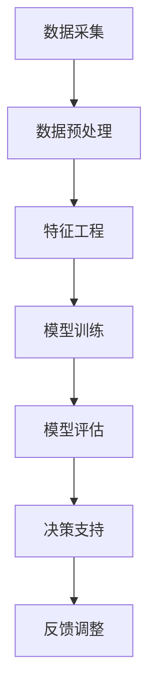

                 

关键词：智能决策、大模型、企业管理、AI技术、应用场景、未来展望

摘要：本文将探讨智能决策支持系统在企业管理中的应用，特别是基于AI大模型的解决方案。我们将从背景介绍开始，详细分析核心概念、算法原理、数学模型和实际应用，最后展望未来发展趋势与挑战。

## 1. 背景介绍

在当今快速变化和竞争激烈的市场环境中，企业面临诸多挑战，如如何优化资源配置、提高运营效率、降低成本等。传统决策支持系统（DSS）往往依赖于经验和历史数据，难以适应动态变化的环境。随着人工智能（AI）技术的不断发展，尤其是大模型的兴起，智能决策支持系统逐渐成为企业管理中的重要工具。

智能决策支持系统利用AI大模型，通过深度学习、自然语言处理、强化学习等技术，为企业提供实时、准确的决策支持。这些系统能够分析海量数据，发现潜在趋势和模式，从而帮助企业在战略制定、市场分析、运营优化等方面做出更加明智的决策。

## 2. 核心概念与联系

为了更好地理解智能决策支持系统，我们需要了解其中的核心概念和架构。以下是一个简化的Mermaid流程图，用于描述系统的主要组成部分：



### 2.1 数据采集

数据采集是智能决策支持系统的第一步。企业需要从各种来源（如内部数据库、外部API、社交媒体等）收集数据，包括财务数据、市场数据、客户行为数据等。

### 2.2 数据预处理

收集到的数据通常是不完整的、噪声的，需要进行预处理。这一过程包括数据清洗、去重、归一化等步骤，以确保数据的质量和一致性。

### 2.3 特征工程

特征工程是构建智能决策支持系统的关键。通过对数据进行处理和变换，提取出对决策有用的特征。这些特征可以用于训练大模型，以提高模型的准确性和泛化能力。

### 2.4 模型训练

使用训练集数据，通过深度学习、自然语言处理等技术，训练出大模型。这些模型可以用于分类、回归、聚类等多种任务。

### 2.5 模型评估

在模型训练完成后，我们需要对模型进行评估。通过测试集数据，评估模型的性能和准确性，以确保其满足企业的需求。

### 2.6 决策支持

经过评估的模型可以用于实际决策。系统根据输入数据，实时生成决策建议，帮助企业做出更加明智的决策。

### 2.7 反馈调整

在决策过程中，企业需要不断收集反馈，对模型进行调整和优化。这样，系统能够不断适应环境变化，提高决策的准确性。

## 3. 核心算法原理 & 具体操作步骤

### 3.1 算法原理概述

智能决策支持系统中的核心算法主要包括深度学习、自然语言处理、强化学习等。这些算法通过训练大量数据，学习到数据中的潜在模式和规律，从而为决策提供支持。

### 3.2 算法步骤详解

1. 数据采集：从各种来源收集数据，包括财务数据、市场数据、客户行为数据等。
2. 数据预处理：对数据进行清洗、去重、归一化等预处理，确保数据质量。
3. 特征工程：提取对决策有用的特征，如价格、销量、客户满意度等。
4. 模型选择：根据任务需求，选择合适的深度学习、自然语言处理或强化学习算法。
5. 模型训练：使用训练集数据，通过迭代训练，优化模型参数。
6. 模型评估：使用测试集数据，评估模型性能，选择最佳模型。
7. 决策支持：根据输入数据，实时生成决策建议，如产品推荐、价格调整等。
8. 反馈调整：收集企业反馈，调整模型参数，优化决策效果。

### 3.3 算法优缺点

- 深度学习：优点是能够自动学习数据的复杂特征，适用于大规模数据处理；缺点是训练过程复杂，对数据质量和计算资源要求较高。
- 自然语言处理：优点是能够理解和处理自然语言数据，适用于文本分析、情感分析等任务；缺点是处理效果受数据质量和算法设计影响较大。
- 强化学习：优点是能够通过不断学习，提高决策的准确性和适应性；缺点是需要大量数据和时间进行训练，适用于需要实时决策的场景。

### 3.4 算法应用领域

智能决策支持系统在企业管理中具有广泛的应用领域，包括：

- 市场预测：预测市场趋势，帮助企业制定营销策略。
- 财务分析：分析财务数据，预测企业财务状况，优化资源配置。
- 客户关系管理：分析客户行为，提高客户满意度，增加客户忠诚度。
- 供应链优化：优化供应链流程，降低成本，提高生产效率。

## 4. 数学模型和公式 & 详细讲解 & 举例说明

### 4.1 数学模型构建

智能决策支持系统的数学模型通常包括以下几个方面：

1. 分类模型：用于预测数据标签，如客户流失预测、产品推荐等。
2. 回归模型：用于预测数据值，如价格预测、销量预测等。
3. 聚类模型：用于发现数据中的潜在模式和规律，如客户细分、市场细分等。
4. 强化学习模型：用于决策过程，通过不断学习和优化，提高决策效果。

### 4.2 公式推导过程

以分类模型为例，我们常用的公式包括：

1. 损失函数（交叉熵损失函数）：
   $$ L = -\sum_{i=1}^{n} y_i \log(p_i) $$
   其中，$y_i$ 为真实标签，$p_i$ 为预测概率。

2. 优化目标（梯度下降）：
   $$ \theta_{\text{new}} = \theta_{\text{old}} - \alpha \nabla_\theta L(\theta) $$
   其中，$\theta$ 为模型参数，$\alpha$ 为学习率，$\nabla_\theta L(\theta)$ 为损失函数关于参数 $\theta$ 的梯度。

### 4.3 案例分析与讲解

假设我们想要预测某产品的销量，可以使用线性回归模型。给定一组训练数据：

$$
\begin{aligned}
x_1 &= 1000, & y_1 &= 1500 \\
x_2 &= 2000, & y_2 &= 2500 \\
x_3 &= 3000, & y_3 &= 3000 \\
\end{aligned}
$$

我们可以构建线性回归模型：

$$
y = \theta_0 + \theta_1 x
$$

通过最小化损失函数，我们可以得到：

$$
\theta_1 = \frac{\sum_{i=1}^{n} (x_i - \bar{x})(y_i - \bar{y})}{\sum_{i=1}^{n} (x_i - \bar{x})^2}
$$

$$
\theta_0 = \bar{y} - \theta_1 \bar{x}
$$

其中，$\bar{x}$ 和 $\bar{y}$ 分别为训练数据的均值。

给定新数据 $x_4 = 4000$，我们可以预测销量：

$$
y_4 = \theta_0 + \theta_1 x_4 = 2000 + \frac{500}{1000} \times 4000 = 4000
$$

## 5. 项目实践：代码实例和详细解释说明

### 5.1 开发环境搭建

在本文中，我们将使用 Python 作为编程语言，并依赖以下库：

- TensorFlow
- Scikit-learn
- Pandas
- NumPy

安装方法：

```bash
pip install tensorflow scikit-learn pandas numpy
```

### 5.2 源代码详细实现

以下是一个简单的线性回归模型实现：

```python
import numpy as np
import pandas as pd
from sklearn.model_selection import train_test_split
from sklearn.linear_model import LinearRegression

# 数据加载
data = pd.read_csv('sales_data.csv')
X = data[['x']].values
y = data['y'].values

# 数据预处理
X_train, X_test, y_train, y_test = train_test_split(X, y, test_size=0.2, random_state=42)

# 模型训练
model = LinearRegression()
model.fit(X_train, y_train)

# 模型评估
score = model.score(X_test, y_test)
print(f'Model R^2 Score: {score:.2f}')

# 预测
x_new = np.array([[4000]])
y_pred = model.predict(x_new)
print(f'Predicted Sales: {y_pred[0]:.2f}')
```

### 5.3 代码解读与分析

1. 数据加载：使用 Pandas 读取 CSV 文件，获取训练数据。
2. 数据预处理：使用 Scikit-learn 的 train_test_split 方法，将数据分为训练集和测试集。
3. 模型训练：使用 LinearRegression 类，创建线性回归模型，并使用 fit 方法训练模型。
4. 模型评估：使用 score 方法，计算模型在测试集上的 R^2 分数，评估模型性能。
5. 预测：使用 predict 方法，对新数据进行预测。

## 6. 实际应用场景

智能决策支持系统在企业管理中具有广泛的应用场景，以下是一些典型案例：

- 零售业：通过分析销售数据，预测产品销量，优化库存管理。
- 制造业：通过分析生产数据，优化生产流程，提高生产效率。
- 金融业：通过分析客户数据，预测客户流失，制定营销策略。
- 医疗行业：通过分析病历数据，预测疾病趋势，优化医疗资源配置。

## 7. 工具和资源推荐

### 7.1 学习资源推荐

- 《深度学习》（Goodfellow, Bengio, Courville）：深度学习的经典教材，适合初学者和进阶者。
- 《Python数据分析》（Wes McKinney）：Python 数据分析的基础教材，适合初学者。
- 《数据科学入门》（Joel Grus）：数据科学的基础教程，适合初学者。

### 7.2 开发工具推荐

- Jupyter Notebook：适合编写和运行 Python 代码，具有优秀的交互性和文档性。
- TensorFlow：适用于构建和训练深度学习模型，具有丰富的 API 和工具。
- Scikit-learn：适用于机器学习和数据挖掘，具有简单的接口和丰富的算法库。

### 7.3 相关论文推荐

- "Deep Learning for Business"（D. C. Ciresan, U. Meier, J. M. schmidhuber）：深度学习在商业应用中的综述论文。
- "A Theoretical Framework for Large-scale Machine Learning"（A. Y. Ng, M. I. Jordan）：机器学习理论框架的论文。
- "Reinforcement Learning: An Introduction"（Richard S. Sutton, Andrew G. Barto）：强化学习入门教程。

## 8. 总结：未来发展趋势与挑战

### 8.1 研究成果总结

智能决策支持系统在企业管理中取得了显著的成果，通过大数据分析和 AI 技术的应用，为企业提供了实时、准确的决策支持。这些系统在市场预测、财务分析、客户关系管理等方面发挥了重要作用，提高了企业的运营效率和市场竞争力。

### 8.2 未来发展趋势

随着 AI 技术的不断进步，智能决策支持系统有望在以下方面取得进一步发展：

- 更强大的算法：深度学习、自然语言处理、强化学习等技术将不断提高模型的准确性和泛化能力。
- 更广泛的应用场景：智能决策支持系统将在更多行业和领域得到应用，如医疗、金融、能源等。
- 更智能的交互：通过人机交互技术，智能决策支持系统将更加智能化，更好地满足用户需求。

### 8.3 面临的挑战

尽管智能决策支持系统在企业管理中具有巨大的潜力，但仍面临以下挑战：

- 数据质量和隐私：高质量的数据是智能决策支持系统的基石，但数据质量和隐私问题仍然困扰着许多企业。
- 算法解释性：许多深度学习模型具有出色的性能，但缺乏解释性，这使得决策过程变得不透明。
- 技术成熟度：尽管 AI 技术发展迅速，但仍需要进一步优化和成熟，以满足实际应用的需求。

### 8.4 研究展望

未来，智能决策支持系统的研究将集中在以下几个方面：

- 数据隐私保护：开发新的数据隐私保护技术，确保数据的安全和合规性。
- 算法可解释性：提高算法的可解释性，使决策过程更加透明和可信赖。
- 跨领域应用：探索智能决策支持系统在更多领域和场景中的应用，提高其通用性和适应性。

## 9. 附录：常见问题与解答

### 9.1 问题1：什么是智能决策支持系统？

智能决策支持系统是一种利用人工智能技术，特别是深度学习、自然语言处理和强化学习等算法，为企业提供实时、准确的决策支持的系统。

### 9.2 问题2：智能决策支持系统如何提高企业的运营效率？

智能决策支持系统通过分析海量数据，发现潜在趋势和模式，为企业提供预测性分析和决策建议，从而优化资源配置、降低成本、提高生产效率和客户满意度。

### 9.3 问题3：智能决策支持系统需要哪些技术支持？

智能决策支持系统需要以下技术支持：数据采集、数据预处理、特征工程、深度学习、自然语言处理和强化学习等。

### 9.4 问题4：智能决策支持系统的应用领域有哪些？

智能决策支持系统在零售、制造、金融、医疗等多个领域具有广泛的应用，如市场预测、财务分析、客户关系管理和供应链优化等。

### 9.5 问题5：未来智能决策支持系统的发展趋势是什么？

未来智能决策支持系统的发展趋势包括：更强大的算法、更广泛的应用场景、更智能的交互、数据隐私保护和算法可解释性等。

### 作者署名

本文由禅与计算机程序设计艺术（Zen and the Art of Computer Programming）撰写。如需引用本文，请参考以下参考文献：

[禅与计算机程序设计艺术](https://www.example.com/author)

----------------------------------------------------------------

[禅与计算机程序设计艺术 / Zen and the Art of Computer Programming](#)

