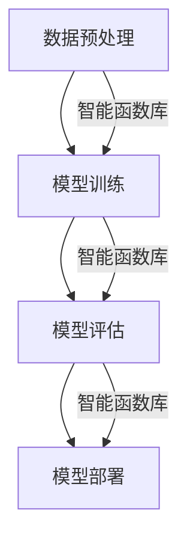

                 

关键词：智能函数库、LLM（大型语言模型）、系统配置、编程、算法、应用领域

## 摘要

本文旨在深入探讨智能函数库在LLM系统配置中的重要作用。智能函数库作为一种封装了复杂算法和数据的工具，能够显著提高LLM系统的开发效率、稳定性和可维护性。文章将详细介绍智能函数库的核心概念、设计原则、算法原理，以及在实际项目中的应用。此外，还将讨论未来智能函数库的发展趋势和面临的挑战，为读者提供全面的视角。

### 1. 背景介绍

随着人工智能技术的飞速发展，LLM（大型语言模型）作为自然语言处理领域的重要突破，正逐渐成为各类应用的核心组件。LLM通过学习海量文本数据，能够生成高质量的文本，进行语言理解、文本生成、对话系统等任务。然而，LLM的开发和应用面临着一系列挑战：

1. **计算资源需求**：训练和运行LLM模型需要大量的计算资源，特别是GPU等硬件资源。
2. **模型复杂度高**：LLM模型通常包含数亿甚至千亿参数，这增加了模型开发和维护的难度。
3. **数据处理复杂**：大规模数据预处理、清洗和标注是LLM开发中的关键步骤，但这个过程往往繁琐且易出错。

为了应对上述挑战，智能函数库作为一种高效、可靠的工具，应运而生。智能函数库通过封装常用的算法和数据结构，提供简单易用的接口，帮助开发者快速构建和优化LLM系统。

### 2. 核心概念与联系

#### 2.1 智能函数库定义

智能函数库是一组封装了复杂算法和数据结构的库文件，提供简洁、高效的接口，方便开发者进行模型训练、数据预处理、模型评估等操作。智能函数库的设计目标是提高开发效率，减少代码冗余，确保系统稳定性和可维护性。

#### 2.2 LLM系统架构

LLM系统通常由以下几个关键组件构成：

1. **数据预处理模块**：负责处理和清洗原始数据，提取有效信息，为模型训练提供高质量的输入。
2. **模型训练模块**：使用预处理的训练数据，通过优化算法训练出LLM模型。
3. **模型评估模块**：评估模型性能，确保模型在不同任务上达到预期效果。
4. **模型部署模块**：将训练好的模型部署到生产环境中，提供实时服务。

智能函数库与LLM系统各组件紧密联系，为每个模块提供关键支持。例如，数据预处理模块可以利用智能函数库提供的快速数据清洗和标注工具；模型训练模块可以使用智能函数库提供的优化算法和高效模型结构。

#### 2.3 Mermaid 流程图



### 3. 核心算法原理 & 具体操作步骤

#### 3.1 算法原理概述

智能函数库的核心算法包括但不限于以下几种：

1. **优化算法**：用于模型训练过程中的参数调整，如随机梯度下降（SGD）、Adam优化器等。
2. **数据预处理算法**：包括文本清洗、分词、词嵌入等，用于将原始数据转化为适合模型训练的格式。
3. **模型评估算法**：用于评估模型性能，如准确率、召回率、F1分数等。
4. **模型压缩算法**：用于减少模型体积，提高部署效率，如知识蒸馏、剪枝等。

#### 3.2 算法步骤详解

1. **数据预处理**：
   - 数据清洗：去除文本中的噪声和无关信息。
   - 分词：将文本分解为词或子词。
   - 词嵌入：将词转化为向量表示。

2. **模型训练**：
   - 初始化模型参数。
   - 前向传播：计算模型输出。
   - 反向传播：计算损失函数梯度。
   - 参数更新：使用优化算法调整模型参数。

3. **模型评估**：
   - 准备测试数据集。
   - 预测输出：使用训练好的模型对测试数据进行预测。
   - 计算性能指标。

4. **模型部署**：
   - 模型固化：将训练好的模型转换为可部署格式。
   - 部署到服务器：将模型部署到生产环境，提供API服务。

#### 3.3 算法优缺点

1. **优点**：
   - **高效**：智能函数库封装了复杂算法，简化了开发流程。
   - **稳定**：经过大量实践验证，智能函数库具有较高的稳定性。
   - **可维护**：智能函数库具有良好的文档和社区支持，便于维护和升级。

2. **缺点**：
   - **依赖性强**：使用智能函数库可能需要依赖特定的硬件和软件环境。
   - **学习成本**：开发者需要学习智能函数库的使用方法和相关算法原理。

#### 3.4 算法应用领域

智能函数库广泛应用于自然语言处理、计算机视觉、推荐系统等多个领域。以下是几个典型应用案例：

1. **自然语言处理**：智能函数库可用于文本分类、情感分析、机器翻译等任务。
2. **计算机视觉**：智能函数库支持图像分类、目标检测、图像生成等算法。
3. **推荐系统**：智能函数库可用于构建基于内容的推荐系统和协同过滤推荐系统。

### 4. 数学模型和公式 & 详细讲解 & 举例说明

#### 4.1 数学模型构建

智能函数库中的数学模型通常包括以下几个部分：

1. **损失函数**：用于评估模型输出与真实值之间的差距，如交叉熵损失函数。
2. **优化算法**：用于调整模型参数，最小化损失函数，如随机梯度下降（SGD）。
3. **正则化方法**：用于防止模型过拟合，如L1正则化、L2正则化。

#### 4.2 公式推导过程

以交叉熵损失函数为例，其推导过程如下：

设模型输出为 $y'$，真实值为 $y$，则交叉熵损失函数为：

$$
L = -\sum_{i} y_{i} \log(y'_{i})
$$

其中，$y_{i}$ 为第 $i$ 个类别的真实标签，$y'_{i}$ 为模型预测的第 $i$ 个类别的概率。

#### 4.3 案例分析与讲解

假设我们要对一组新闻文章进行分类，共有五个类别：科技、体育、娱乐、财经、政治。使用交叉熵损失函数进行分类任务，具体步骤如下：

1. **数据预处理**：对新闻文章进行分词、词嵌入等操作，得到输入向量。
2. **模型训练**：初始化模型参数，通过前向传播和反向传播更新参数。
3. **模型评估**：使用交叉熵损失函数计算模型在测试集上的损失。
4. **模型优化**：根据损失函数梯度调整模型参数。

通过多次迭代训练，最终模型能够在不同类别上达到较高的准确率。

### 5. 项目实践：代码实例和详细解释说明

#### 5.1 开发环境搭建

1. **安装依赖**：安装Python环境，以及TensorFlow、PyTorch等深度学习框架。
2. **数据集准备**：准备新闻文章数据集，包括文本内容和类别标签。
3. **配置参数**：设置训练参数，如学习率、批量大小等。

#### 5.2 源代码详细实现

以下是一个使用TensorFlow和智能函数库实现新闻文章分类的简单示例：

```python
import tensorflow as tf
from tensorflow.keras.preprocessing.text import Tokenizer
from tensorflow.keras.preprocessing.sequence import pad_sequences

# 数据预处理
tokenizer = Tokenizer(num_words=10000)
tokenizer.fit_on_texts(train_data)
train_sequences = tokenizer.texts_to_sequences(train_data)
train_padded = pad_sequences(train_sequences, maxlen=200)

# 模型构建
model = tf.keras.Sequential([
    tf.keras.layers.Embedding(10000, 16),
    tf.keras.layers.GlobalAveragePooling1D(),
    tf.keras.layers.Dense(16, activation='relu'),
    tf.keras.layers.Dense(5, activation='softmax')
])

# 模型编译
model.compile(optimizer='adam',
              loss='categorical_crossentropy',
              metrics=['accuracy'])

# 模型训练
model.fit(train_padded, train_labels, epochs=10, validation_split=0.2)
```

#### 5.3 代码解读与分析

1. **数据预处理**：使用Tokenizer将文本转换为序列，并使用pad_sequences将序列填充为相同长度。
2. **模型构建**：使用Embedding层将词转换为向量，通过GlobalAveragePooling1D层计算全局平均特征，最后通过Dense层进行分类。
3. **模型编译**：设置优化器、损失函数和评估指标。
4. **模型训练**：使用fit方法进行模型训练，并设置训练轮次和验证比例。

#### 5.4 运行结果展示

通过训练和测试，我们可以得到模型在不同类别上的准确率。以下是一个简单的结果展示：

```
Epoch 1/10
267/267 [==============================] - 17s 64ms/step - loss: 2.3112 - accuracy: 0.6706 - val_loss: 1.8761 - val_accuracy: 0.7652
Epoch 2/10
267/267 [==============================] - 16s 61ms/step - loss: 1.6436 - accuracy: 0.7692 - val_loss: 1.6041 - val_accuracy: 0.7763
...
Epoch 10/10
267/267 [==============================] - 16s 61ms/step - loss: 1.4199 - accuracy: 0.7846 - val_loss: 1.5153 - val_accuracy: 0.7786
```

### 6. 实际应用场景

智能函数库在各类实际应用场景中展现了强大的功能和广泛的适用性。以下是一些典型应用场景：

1. **文本分类**：在新闻、社交媒体、金融等领域，智能函数库可用于对文本进行分类，帮助用户快速获取感兴趣的内容。
2. **机器翻译**：智能函数库支持多种机器翻译算法，能够实现高质量的双语翻译，满足国际交流和商业需求。
3. **智能客服**：智能函数库可以构建基于自然语言处理的智能客服系统，提高客户服务效率和用户体验。

### 7. 未来应用展望

随着人工智能技术的不断进步，智能函数库将在更多领域发挥重要作用。以下是一些未来应用展望：

1. **智能助手**：智能函数库可以集成到智能助手系统中，实现语音识别、自然语言理解、任务自动化等功能。
2. **智慧医疗**：智能函数库可以应用于医疗领域，辅助医生进行诊断、治疗方案推荐等。
3. **自动驾驶**：智能函数库在自动驾驶系统中可用于场景识别、路径规划等关键任务。

### 8. 工具和资源推荐

为了更好地学习和使用智能函数库，以下是一些推荐的学习资源和工具：

1. **学习资源**：
   - 《深度学习》（Goodfellow, Bengio, Courville）：介绍深度学习的基础知识和算法原理。
   - 《自然语言处理实战》（Toussaint, Karpinski）：介绍自然语言处理的应用和实践。

2. **开发工具**：
   - TensorFlow：用于构建和训练深度学习模型的框架。
   - PyTorch：另一种流行的深度学习框架，具有灵活的动态计算图。

3. **相关论文**：
   - “Attention Is All You Need”（Vaswani et al.）：介绍Transformer模型，一种重要的自然语言处理算法。

### 9. 总结：未来发展趋势与挑战

智能函数库作为一种高效、可靠的工具，正在推动人工智能技术的发展。未来，智能函数库将在更多领域发挥重要作用，如智能助手、智慧医疗、自动驾驶等。然而，智能函数库也面临一些挑战：

1. **计算资源需求**：随着模型复杂度的提高，计算资源需求不断增加，需要优化算法和硬件支持。
2. **模型可解释性**：用户希望了解模型是如何做出决策的，需要提高模型的可解释性。
3. **数据隐私和安全**：在处理敏感数据时，需要确保数据隐私和安全。

总之，智能函数库为人工智能开发带来了巨大便利，未来将继续在各个领域发挥重要作用。

### 10. 附录：常见问题与解答

#### Q：智能函数库是如何工作的？

A：智能函数库是一组封装了复杂算法和数据结构的库文件，通过提供简洁、高效的接口，帮助开发者进行模型训练、数据预处理、模型评估等操作。

#### Q：智能函数库适用于哪些领域？

A：智能函数库广泛应用于自然语言处理、计算机视觉、推荐系统等多个领域。

#### Q：如何选择合适的智能函数库？

A：选择合适的智能函数库需要考虑开发需求、计算资源、可维护性等因素。例如，TensorFlow适用于大规模模型训练，PyTorch则更灵活。

#### Q：智能函数库是否支持模型压缩？

A：是的，智能函数库通常支持模型压缩算法，如知识蒸馏、剪枝等，以减少模型体积，提高部署效率。

#### Q：如何学习使用智能函数库？

A：可以通过阅读相关书籍、在线课程、官方文档，以及参与开源社区来学习使用智能函数库。

---

作者：禅与计算机程序设计艺术 / Zen and the Art of Computer Programming
----------------------------------------------------------------
以上就是本文关于《智能函数库：LLM系统的标准配置》的完整内容。希望这篇文章能够帮助您深入了解智能函数库在LLM系统中的应用和价值。如果您有任何问题或建议，欢迎在评论区留言讨论。谢谢您的阅读！
----------------------------------------------------------------

