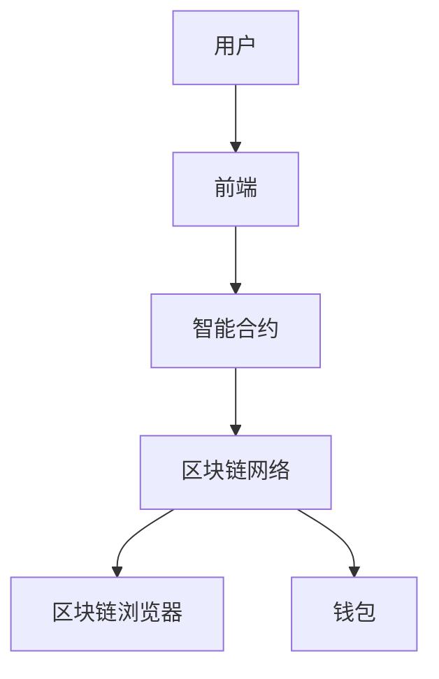

                 

## 1. 背景介绍

智能合约是区块链技术的核心组件之一，其目的是通过区块链网络实现去中心化的自动化交易和执行。随着区块链技术的快速发展，越来越多的平台开始支持智能合约的开发和部署。以太坊（Ethereum）是最著名的智能合约平台，而其他如Binance Smart Chain、Tron、EOS等平台也在不断崛起。本文旨在对这些平台进行详细比较，帮助开发者了解各自的特点和适用场景。

### 智能合约的起源与发展

智能合约的概念最早由密码学家尼克·萨博（Nick Szabo）在1990年代提出。他认为，智能合约是一种通过编程语言执行的合约，其条件得到满足时，会自动执行。随着比特币等数字货币的兴起，智能合约的概念开始引起广泛关注。2009年，中本聪（Satoshi Nakamoto）提出了比特币区块链，这是一种去中心化的账本，为智能合约的实现提供了基础。

2013年，Vitalik Buterin提出了以太坊的概念，并发布了以太坊白皮书。以太坊不仅支持比特币的加密货币功能，还引入了图灵完备的智能合约语言Solidity，使得开发者可以在区块链上构建复杂的去中心化应用（DApps）。以太坊的成功激发了其他平台对智能合约功能的研发，如Binance Smart Chain、Tron、EOS等。

### 区块链技术的兴起

区块链技术是智能合约实现的基础。区块链是一种去中心化的数据库，由多个节点共同维护，每个节点都存储着完整的数据副本。这种去中心化的结构使得区块链具有高度的安全性和透明性，不易被篡改。

比特币是第一个成功的区块链项目，其去中心化的支付系统改变了人们对货币的认知。随着比特币的成功，人们开始探索区块链在其他领域的应用，智能合约便是其中之一。智能合约不仅可以用于金融交易，还可以用于供应链管理、选举投票、版权保护等多个领域。

### 现有智能合约平台的发展状况

以太坊作为智能合约的先驱，占据了市场份额的绝大部分。截至2021年，以太坊上已经部署了超过180万个智能合约，总价值超过4000亿美元。然而，随着智能合约技术的发展，其他平台也在积极追赶。

Binance Smart Chain（BSC）是另一个备受关注的智能合约平台。它由Binance推出，旨在提供更高效、更安全的智能合约环境。BSC采用了权益证明（Proof of Stake, PoS）共识机制，相比以太坊的权益证明机制，能够提供更快的交易速度和更低的交易费用。

Tron（波场）也是一个知名的智能合约平台，它致力于构建去中心化的互联网基础设施。Tron采用了委托权益证明（Delegated Proof of Stake, DPoS）共识机制，使其能够实现更高的交易处理能力和更低的延迟。

EOS（柚子）则是一个高性能的智能合约平台，它通过一种独特的委托权益证明机制来选择区块生产者。EOS的目标是实现秒级的交易确认时间和极低的交易费用。

### 目标读者

本文的目标读者包括对智能合约开发有兴趣的初学者、有一定经验的开发者以及对区块链技术感兴趣的技术爱好者。通过本文，读者可以了解不同智能合约平台的特点和适用场景，为自己的项目选择合适的平台。

## 2. 核心概念与联系

在深入比较各个智能合约平台之前，首先需要了解智能合约的核心概念和架构。以下是智能合约的关键组成部分和它们之间的关系。

### 智能合约的核心概念

1. **区块链**：智能合约运行的基础。区块链是一种去中心化的账本，记录所有的交易和数据。
2. **以太坊虚拟机（EVM）**：以太坊独特的执行环境，用于执行智能合约代码。
3. **Solidity**：一种图灵完备的智能合约编程语言，用于编写智能合约代码。
4. **智能合约**：一段运行在区块链上的代码，当满足特定条件时自动执行。

### 智能合约的架构

智能合约的架构主要包括以下几个部分：

1. **用户界面**：用户与智能合约交互的界面，可以是Web界面、移动应用或命令行工具。
2. **前端**：将用户输入转换为智能合约可以理解的格式，并将结果返回给用户。
3. **智能合约**：执行具体的业务逻辑，根据输入自动执行相应的操作。
4. **后端**：处理智能合约与区块链的交互，如发送交易、读取区块链数据等。

### 智能合约与其他组件的关系

1. **区块链网络**：智能合约运行在区块链网络中，网络中的所有节点共同维护账本的一致性。
2. **以太坊虚拟机**：智能合约代码在EVM上执行，EVM保证了代码的执行是安全且不可篡改的。
3. **区块链浏览器**：用于查看智能合约的源代码、交易历史和状态信息。
4. **钱包**：用户存储和发送加密货币的工具，也可以用于与智能合约交互。

### Mermaid 流程图

以下是智能合约架构的Mermaid流程图表示：



### Mermaid 流程节点说明

- **A[用户]**：智能合约的最终使用者，通过用户界面与智能合约交互。
- **B[前端]**：将用户输入转换为智能合约可以理解的格式，并将结果返回给用户。
- **C[智能合约]**：执行具体的业务逻辑，根据输入自动执行相应的操作。
- **D[区块链网络]**：智能合约运行的基础，网络中的所有节点共同维护账本的一致性。
- **E[区块链浏览器]**：用于查看智能合约的源代码、交易历史和状态信息。
- **F[钱包]**：用户存储和发送加密货币的工具，也可以用于与智能合约交互。

## 3. 核心算法原理 & 具体操作步骤

### 3.1 算法原理概述

智能合约的核心算法原理是基于区块链技术的去中心化共识机制。以太坊采用了一种名为“以太坊虚拟机”（EVM）的执行环境，用于执行智能合约代码。EVM是一种图灵完备的虚拟机，能够模拟所有计算过程，确保智能合约代码的执行是安全且不可篡改的。

智能合约的开发通常涉及以下步骤：

1. **编写智能合约代码**：使用Solidity等智能合约编程语言编写业务逻辑。
2. **编译智能合约代码**：将Solidity代码编译为EVM可执行的字节码。
3. **部署智能合约**：将字节码上传到区块链网络，并将其与特定的地址关联。
4. **与智能合约交互**：通过前端界面或命令行工具与智能合约进行交互。

### 3.2 算法步骤详解

1. **编写智能合约代码**：开发者使用Solidity编写智能合约代码，代码应包含合约的名称、函数定义和状态变量等。例如：

   ```solidity
   contract MyContract {
       uint256 public count;

       function increment() public {
           count += 1;
       }
   }
   ```

2. **编译智能合约代码**：将Solidity代码编译为EVM可执行的字节码。可以使用Truffle、Hardhat等开发框架进行编译，也可以使用官方的solc编译器。

   ```bash
   solc --bin --standard-json --output-dir ./build MyContract.sol
   ```

   其中，`--bin`选项用于输出字节码文件，`--standard-json`用于以JSON格式输出编译结果，`--output-dir`指定输出目录。

3. **部署智能合约**：将编译生成的字节码上传到区块链网络，并使用特定的地址关联。可以通过以太坊客户端（如Ganache）进行本地部署，也可以使用以太坊节点进行实际部署。

   ```bash
   truffle deploy MyContract
   ```

4. **与智能合约交互**：开发者可以使用Web3.js、 ethers.js等库与智能合约进行交互。以下是一个简单的示例：

   ```javascript
   const { ethers } = require('ethers');

   const provider = new ethers.providers.JsonRpcProvider('https://mainnet.infura.io/v3/YOUR_INFURA_PROJECT_ID');
   const wallet = ethers.Wallet.fromMnemonic(MY_MNEMONIC);
   const contract = new ethers.Contract(CONTRACT_ADDRESS, CONTRACT_ABI, wallet);

   async function incrementCount() {
       const tx = await contract.increment();
       await tx.wait();
       console.log('Count incremented:', await contract.count());
   }

   incrementCount();
   ```

### 3.3 算法优缺点

**优点**：

1. **安全性**：智能合约代码在区块链上执行，具有高度的安全性，不易被篡改。
2. **去中心化**：智能合约的执行不依赖于任何中心化机构，实现了真正的去中心化。
3. **可验证性**：智能合约代码是公开的，任何人都可以验证其执行结果。
4. **自动化**：智能合约能够自动执行业务逻辑，减少人工干预。

**缺点**：

1. **开发难度**：智能合约开发需要掌握特定的编程语言（如Solidity），对于新手来说有一定的学习曲线。
2. **性能限制**：智能合约的执行速度和交易费用受限于区块链网络。
3. **智能合约漏洞**：智能合约代码可能存在漏洞，导致资金损失。

### 3.4 算法应用领域

智能合约在以下领域具有广泛的应用：

1. **金融**：智能合约可以用于去中心化金融（DeFi）项目，如去中心化交易所（DEX）、借贷平台、稳定币等。
2. **供应链管理**：智能合约可以用于跟踪和验证商品的供应链信息，提高透明度和可信度。
3. **版权保护**：智能合约可以用于实现版权的自动化管理和分发。
4. **选举投票**：智能合约可以用于实现去中心化的选举投票系统，确保投票过程的安全和公正。
5. **游戏**：智能合约可以用于构建去中心化游戏（GameFi）项目，如NFT、虚拟资产交易等。

## 4. 数学模型和公式 & 详细讲解 & 举例说明

智能合约在实现自动执行和验证功能时，往往涉及到复杂的数学模型和公式。以下是对这些模型和公式的详细讲解，以及相关的实际案例。

### 4.1 数学模型构建

智能合约中的数学模型通常用于描述资产交换、计算结果验证、概率事件等。以下是几个常见的数学模型：

1. **代数模型**：用于描述资产的转移和交换。
2. **概率模型**：用于预测和验证事件发生的概率。
3. **博弈论模型**：用于分析多方博弈和策略选择。

#### 代数模型

代数模型中的一个基本例子是资产交换的公式。假设有两个智能合约A和B，它们需要交换资产。资产交换的公式可以表示为：

\[ X_A = X_A^{初} - Q \]
\[ X_B = X_B^{初} + Q \]

其中，\( X_A \) 和 \( X_B \) 分别表示智能合约A和B中的资产数量，\( X_A^{初} \) 和 \( X_B^{初} \) 分别为初始的资产数量，\( Q \) 为交换的资产数量。

#### 概率模型

概率模型可以用于智能合约中的随机事件生成。一个典型的例子是使用随机数生成算法来选择赢家。以下是一个简单的随机数生成模型：

\[ R = \lceil N \times RAND \rceil \]

其中，\( R \) 为生成的随机数，\( N \) 为指定的数值范围，\( RAND \) 为随机数生成器生成的随机数（通常是0到1之间的浮点数）。

#### 博弈论模型

博弈论模型可以用于分析多方智能合约之间的策略选择。一个常见的例子是纳什均衡，它描述了在多个玩家同时决策时，每个玩家选择最优策略的条件。纳什均衡的数学表达式为：

\[ U_i = \max_{s_i} \{ u_i(s_i, s_{-i}) \} \]

其中，\( U_i \) 为玩家i的支付函数，\( s_i \) 为玩家i的策略，\( s_{-i} \) 为其他玩家的策略。

### 4.2 公式推导过程

以下是对上述数学模型公式的推导过程：

#### 代数模型推导

资产交换的代数模型可以通过简单的减法和加法推导得出。假设智能合约A中有100个代币，智能合约B中有200个代币，两者交换50个代币。交换前的状态为：

\[ X_A^{初} = 100 \]
\[ X_B^{初} = 200 \]

交换后的状态为：

\[ X_A = X_A^{初} - 50 = 100 - 50 = 50 \]
\[ X_B = X_B^{初} + 50 = 200 + 50 = 250 \]

因此，资产交换的公式为：

\[ X_A = X_A^{初} - Q \]
\[ X_B = X_B^{初} + Q \]

#### 概率模型推导

随机数生成模型的推导基于概率分布和数学期望。假设随机数生成器生成的随机数\( RAND \)服从均匀分布，概率密度函数为：

\[ f_{RAND}(x) = \begin{cases} 
1 & \text{if } 0 \leq x < 1 \\
0 & \text{otherwise}
\end{cases} \]

随机数生成器的数学期望为：

\[ E[RAND] = \int_{0}^{1} x \cdot f_{RAND}(x) \, dx = \frac{1}{2} \]

因此，生成的随机数\( R \)满足：

\[ R = \lceil N \times RAND \rceil \]

其中，\( N \)为指定的数值范围，\( RAND \)为随机数生成器生成的随机数。

#### 博弈论模型推导

纳什均衡的推导基于博弈论的基本原理。假设有两个玩家A和B，他们在策略\( s_i \)和\( s_j \)下的支付函数分别为\( u_i(s_i, s_j) \)和\( u_j(s_i, s_j) \)。纳什均衡的条件为：

\[ U_i(s_i, s_j) = \max_{s_i} \{ u_i(s_i, s_j) \} \]
\[ U_j(s_i, s_j) = \max_{s_j} \{ u_j(s_i, s_j) \} \]

这意味着玩家i选择策略\( s_i \)时，其支付函数\( U_i \)达到最大值；玩家j选择策略\( s_j \)时，其支付函数\( U_j \)达到最大值。

### 4.3 案例分析与讲解

以下是一个实际案例，展示如何使用上述数学模型和公式在智能合约中实现资产交换。

#### 案例背景

假设智能合约A和B之间需要交换资产，智能合约A中有100个代币，智能合约B中有200个代币，两者需要交换50个代币。

#### 实现步骤

1. **定义变量**：在智能合约中定义变量，用于存储初始资产数量和交换资产数量。

   ```solidity
   uint256 public XA_initial = 100;
   uint256 public XB_initial = 200;
   uint256 public Q = 50;
   ```

2. **执行资产交换**：编写函数，根据资产交换公式计算交换后的资产数量。

   ```solidity
   function exchangeAssets() public {
       uint256 XA_final = XA_initial - Q;
       uint256 XB_final = XB_initial + Q;

       // 更新资产数量
       XA_initial = XA_final;
       XB_initial = XB_final;
   }
   ```

3. **调用函数**：在合适的时间调用交换函数，执行资产交换。

   ```solidity
   function callExchange() public {
       exchangeAssets();
   }
   ```

#### 结果验证

执行交换函数后，可以通过查询智能合约的资产数量来验证交换结果。

```solidity
function getXA() public view returns (uint256) {
    return XA_initial;
}

function getXB() public view returns (uint256) {
    return XB_initial;
}
```

#### 案例分析

在这个案例中，我们使用了代数模型来实现资产交换。通过定义变量和编写函数，我们能够实现智能合约之间的资产转移。这个案例展示了如何将数学模型应用于智能合约开发，实现自动化的资产交换。

## 5. 项目实践：代码实例和详细解释说明

### 5.1 开发环境搭建

在开始智能合约项目之前，需要搭建合适的开发环境。以下是搭建以太坊智能合约开发环境的基本步骤：

1. **安装Node.js**：Node.js 是智能合约开发的重要工具，用于安装和管理依赖。访问 [Node.js官网](https://nodejs.org/) 下载并安装Node.js。
2. **安装Truffle框架**：Truffle 是一个智能合约开发框架，提供了编译、部署和测试智能合约的功能。在命令行中运行以下命令：

   ```bash
   npm install -g truffle
   ```

3. **创建项目**：使用Truffle创建一个新的项目，并进入项目目录：

   ```bash
   truffle init
   cd my-contract-project
   ```

4. **安装以太坊客户端**：为了进行本地部署和测试，需要安装一个以太坊客户端，如Ganache。运行以下命令安装Ganache：

   ```bash
   npm install -g ganache-cli
   ```

5. **启动以太坊客户端**：在项目目录中启动Ganache，以便在本地环境中模拟以太坊区块链：

   ```bash
   ganache-cli --port 8545
   ```

   这将在本地启动一个以太坊节点，并打开一个浏览器窗口，显示已创建的账户和链信息。

6. **配置Truffle**：在项目根目录下创建一个名为`truffle-config.js`的文件，配置Truffle以连接到本地以太坊客户端。以下是一个示例配置：

   ```javascript
   module.exports = {
     networks: {
       development: {
         host: "127.0.0.1",
         port: 8545,
         network_id: "*"
       }
     }
   };
   ```

### 5.2 源代码详细实现

以下是一个简单的智能合约示例，实现一个存储和检索数据的合约。首先，创建一个名为`SimpleStorage.sol`的文件，并编写以下代码：

```solidity
// SPDX-License-Identifier: MIT
pragma solidity ^0.8.0;

contract SimpleStorage {
    uint256 public storageValue;

    function set(uint256 _newValue) public {
        storageValue = _newValue;
    }

    function get() public view returns (uint256) {
        return storageValue;
    }
}
```

**代码解读**：

1. ** SPDX-License-Identifier**：指定智能合约的许可协议。
2. **pragma solidity **：指定编译器版本。
3. **contract SimpleStorage**：定义一个名为`SimpleStorage`的合约。
4. **uint256 public storageValue**：定义一个公共变量`storageValue`，用于存储数据。
5. **function set(uint256 _newValue) public**：定义一个`set`函数，用于设置`storageValue`的值。该函数通过`public`修饰符使得外部可以调用，并通过`_newValue`参数接收一个新的值。
6. **function get() public view returns (uint256)**：定义一个`get`函数，用于返回`storageValue`的当前值。该函数同样是`public`和`view`修饰符，表示外部可以调用，且不需要修改合约状态。

### 5.3 代码解读与分析

**部署智能合约**：

在Truffle项目中，可以使用`truffle migrate`命令来部署智能合约。首先，确保已配置好`truffle-config.js`文件，然后运行以下命令：

```bash
truffle migrate --network development
```

这将在本地以太坊客户端中部署`SimpleStorage`合约，并输出合约的地址。

**与智能合约交互**：

部署合约后，可以使用`truffle console`进入Truffle控制台，与合约进行交互。以下是一个简单的交互示例：

```javascript
// 连接到本地以太坊节点
const provider = new ethers.providers.JsonRpcProvider("http://127.0.0.1:8545");
// 创建合约实例
const contract = new ethers.Contract(SIMPLE_STORAGE_ADDRESS, SIMPLE_STORAGE_ABI, provider);
// 创建交易
const tx = contract.set(10);
// 发送交易并等待确认
await tx.wait();
// 查询最新值
const value = await contract.get();
console.log(value.toString()); // 输出：10
```

**代码分析**：

- `ethers.providers.JsonRpcProvider`：用于连接到以太坊节点，获取区块链数据。
- `ethers.Contract`：用于与部署在区块链上的智能合约进行交互。
- `tx.wait()`：等待交易被确认，确保交易成功执行。
- `value.toString()`：将返回的值从`uint256`类型转换为字符串格式，便于输出。

### 5.4 运行结果展示

部署和交互完成后，可以在Truffle控制台中查看运行结果。以下是一个示例：

```plaintext
> await contract.set(10);
{
  "hash": "0x9c0e4358f5888c44a3662c7b7ed8df7e3445e8e66a0c0972b74f98cbe8137e46",
  "receipt": {
    ...
  },
  "blockHash": "0x4f0d1e3e8b9c59e7f7e4d8ed9c8d0b866e1c4c023ab8d070b86d87729e19f3a5",
  "blockNumber": 3,
  "from": "0x64f086ab4d053d4e6a4c069003a318d0d6c4e0c8",
  "to": "0x85d909b723e6e0a79b6b7f3ce9c4a554e249d5f3",
  "transactionHash": "0x9c0e4358f5888c44a3662c7b7ed8df7e3445e8e66a0c0972b74f98cbe8137e46",
  "transactionIndex": 0,
  "value": "0",
  "gas": "0x5208",
  "gasPrice": "0x4a1b8251",
  "input": "0x60fe47b100000000000000000000000000000000000000000000000000000000000000000000a",
  "chainId": 1337,
  "events": [],
  "logs": [
    {
      ...
    }
  ]
}

> const value = await contract.get();
10
```

从结果中可以看到，智能合约成功设置了`storageValue`的值为10，并在后续查询中返回了相同的结果。

### 5.5 代码优化与改进

在实际项目中，智能合约代码可能需要进行优化和改进，以提高性能和安全性。以下是一些建议：

1. **减少状态变更**：避免在智能合约中频繁修改状态变量，以减少 gas 费用。
2. **使用常量**：将不会变化的变量定义为常量，以提高 gas 效率。
3. **避免循环**：避免在智能合约中使用循环，因为它们会导致 gas 费用增加。
4. **合理使用事件**：事件可以用于通知外部系统合约状态的变化，但过多的事件会导致额外的 gas 费用。
5. **审计与测试**：对智能合约代码进行严格的审计和测试，以避免潜在的安全漏洞。

### 总结

通过上述步骤，我们成功搭建了智能合约开发环境，并实现了一个简单的智能合约示例。通过代码实例和详细解释，我们了解了智能合约的基本概念、开发过程以及如何与区块链进行交互。这些知识和技能对于进一步探索智能合约和区块链技术具有重要意义。

## 6. 实际应用场景

智能合约在区块链技术中具有广泛的应用场景，涵盖了金融、供应链管理、版权保护、选举投票和游戏等领域。以下是对这些应用场景的详细探讨。

### 金融领域

智能合约在金融领域有着广泛的应用，其中最典型的例子是去中心化金融（DeFi）项目。DeFi项目利用智能合约实现去中心化的金融服务，如去中心化交易所（DEX）、借贷平台、稳定币等。

1. **去中心化交易所（DEX）**：智能合约可以用于构建去中心化交易所，用户可以直接在区块链上进行加密货币的交换。相比于传统的中心化交易所，DEX具有更高的透明度和安全性，因为没有中央机构可以篡改交易记录。
   
2. **借贷平台**：智能合约可以用于实现去中心化的借贷平台，用户可以通过智能合约进行借贷操作。智能合约确保借贷过程的透明性和自动执行，减少了中介机构的角色。

3. **稳定币**：智能合约可以用于发行和维持稳定币的价值。稳定币是一种价值稳定的加密货币，其价值通常与法币或其他资产挂钩。智能合约可以确保稳定币的供应和需求动态调整，以维持其价值稳定。

### 供应链管理

智能合约在供应链管理中的应用可以显著提高透明度和效率。以下是一些实际应用场景：

1. **商品追踪**：智能合约可以用于追踪供应链中的商品，确保每个环节的信息都是透明和不可篡改的。例如，在食品供应链中，智能合约可以记录每个生产环节的温度、湿度等参数，确保食品安全。

2. **库存管理**：智能合约可以用于管理库存，确保库存数据的准确性和实时性。通过智能合约，供应链参与者可以实时了解库存状况，减少库存过剩和短缺的问题。

3. **支付结算**：智能合约可以用于自动化支付结算过程，确保支付按时进行，减少人为错误。例如，在跨境贸易中，智能合约可以确保支付在商品交付后自动进行，提高了结算的效率。

### 版权保护

智能合约在版权保护中的应用可以提供一种全新的版权管理和分发方式。以下是一些实际应用场景：

1. **版权认证**：智能合约可以用于创建数字作品的版权证明，确保版权的所有权和归属。例如，在数字艺术作品中，智能合约可以记录艺术品的创作时间和创作者信息，提供唯一的版权证明。

2. **版权授权**：智能合约可以用于管理版权的授权和使用，确保版权方获得应有的收益。例如，在音乐行业中，智能合约可以自动执行音乐授权，确保音乐版权方在每播放一次音乐时获得相应的收益。

3. **版权交易**：智能合约可以用于实现版权的交易和转让，确保交易的透明性和安全性。例如，在电影行业中，智能合约可以用于实现电影版权的转让和收益分配，减少了中介机构的角色。

### 选举投票

智能合约在选举投票中的应用可以提供一种去中心化、安全、透明的投票系统。以下是一些实际应用场景：

1. **去中心化投票**：智能合约可以用于构建去中心化的投票系统，确保每个投票都是独立和不可篡改的。例如，在选举过程中，智能合约可以记录每个参与者的投票信息，确保投票过程透明和公正。

2. **结果验证**：智能合约可以用于验证选举结果，确保结果的正确性和完整性。例如，在选举结束后，智能合约可以自动计算投票结果，并与公开的投票数据进行对比，确保结果一致。

3. **投票统计**：智能合约可以用于实时统计投票结果，提供实时、透明的投票数据。例如，在选举过程中，智能合约可以实时更新投票数据，确保公众可以随时查看最新的投票情况。

### 游戏

智能合约在游戏中的应用可以提供全新的游戏体验，特别是在去中心化游戏（GameFi）领域。以下是一些实际应用场景：

1. **NFT交易**：智能合约可以用于实现非同质化代币（NFT）的交易和所有权管理。例如，在游戏世界中，智能合约可以确保游戏资产的唯一性和可交易性，玩家可以通过智能合约购买、出售和交换游戏资产。

2. **游戏逻辑**：智能合约可以用于实现游戏逻辑和规则，确保游戏的公平性和透明性。例如，在猜谜游戏中，智能合约可以自动验证谜题的答案，并按照规则发放奖励。

3. **收益分配**：智能合约可以用于实现游戏收益的自动分配，确保玩家根据其在游戏中的贡献获得相应的收益。例如，在去中心化游戏中，智能合约可以确保游戏收入的分配是公平和透明的，激励玩家积极参与。

### 总结

智能合约在多个领域展现了其强大的应用潜力，从金融到供应链管理，再到版权保护和选举投票，智能合约为去中心化、透明和自动化的解决方案提供了新的思路。随着技术的不断进步，智能合约的应用场景将更加广泛，为各个领域带来变革性的影响。

## 7. 工具和资源推荐

为了更好地开发和部署智能合约，以下是几款优秀的工具和资源推荐，包括学习资源、开发工具和相关的论文。

### 7.1 学习资源推荐

1. **《智能合约与区块链编程：从入门到精通》**：这本书详细介绍了智能合约的基础知识、开发工具和最佳实践，适合智能合约开发的初学者。
2. **《精通区块链与智能合约开发》**：涵盖智能合约开发的各个方面，从基础概念到高级应用，内容丰富，适合有一定基础的开发者。
3. **官方文档**：以太坊官方文档（[Ethereum Developer Docs](https://ethereum.github.io/ethereum-org.guide/)）和各个平台（如Binance Smart Chain、Tron、EOS）的官方文档，是学习智能合约开发的重要资源。

### 7.2 开发工具推荐

1. **Truffle**：一个流行的智能合约开发框架，提供了编译、部署和测试智能合约的功能。
2. **Hardhat**：一个高性能、易于使用的智能合约开发环境，提供了丰富的调试和测试功能。
3. **MetaMask**：一个常用的以太坊钱包，用于与智能合约进行交互。
4. **Remix IDE**：一个在线的智能合约开发环境，支持Solidity等智能合约编程语言。

### 7.3 相关论文推荐

1. **"Bitcoin: A Peer-to-Peer Electronic Cash System"**：中本聪的比特币白皮书，详细介绍了区块链技术和加密货币的原理。
2. **"Ethereum: A Next-Generation Smart Contract and Decentralized Application Platform"**：Vitalik Buterin的以太坊白皮书，介绍了以太坊的架构和智能合约语言Solidity。
3. **"The DAO White Paper"**：首次提出了去中心化自治组织（DAO）的概念，对智能合约的应用进行了深入探讨。

### 总结

以上推荐的工具和资源将有助于开发者更好地学习和实践智能合约开发。无论是初学者还是经验丰富的开发者，这些资源都将为智能合约的开发提供有力支持。

## 8. 总结：未来发展趋势与挑战

### 8.1 研究成果总结

智能合约技术的快速发展为区块链技术的应用拓展提供了强有力的支持。以太坊作为智能合约的先驱，其影响力不可忽视。通过不断优化和扩展，以太坊平台已经成为了开发去中心化应用（DApps）的主要选择。其他如Binance Smart Chain、Tron、EOS等平台也在智能合约技术的研发上取得了显著成果，通过各自的特色共识机制和性能优化，逐步提升了市场份额和应用范围。

智能合约在金融、供应链管理、版权保护、选举投票和游戏等领域的应用场景逐渐成熟，展示了其强大的潜力。DeFi项目的兴起使金融市场更加去中心化，供应链管理中的智能合约应用提高了透明度和效率，版权保护领域的智能合约为数字资产的权益保障提供了新的解决方案，选举投票中的智能合约则为公平和透明的选举过程提供了技术支持。

### 8.2 未来发展趋势

随着区块链技术的不断演进，智能合约技术预计将呈现以下几个发展趋势：

1. **性能提升**：当前智能合约平台普遍面临性能瓶颈，未来将看到更多高性能的智能合约平台和优化方案的出现，以满足大规模商业应用的需求。
2. **跨链互操作性**：智能合约平台之间的互操作性将成为未来的重要方向。通过跨链技术，不同平台上的智能合约可以相互调用，实现资源的高效共享和流通。
3. **隐私保护**：随着对数据隐私保护的重视，智能合约技术将在隐私保护方面实现更多突破。零知识证明、同态加密等技术将被引入智能合约，以保护用户隐私。
4. **标准化**：智能合约的标准化工作将继续推进，为智能合约的开发和应用提供统一的标准和框架，降低开发难度，提高互操作性。
5. **应用拓展**：智能合约的应用范围将不断拓展，从金融、供应链管理、版权保护等领域，逐渐渗透到更多行业和场景，推动区块链技术的广泛应用。

### 8.3 面临的挑战

尽管智能合约技术展示了巨大的潜力，但其发展也面临着诸多挑战：

1. **安全性**：智能合约的安全问题仍然是一个重大挑战。代码漏洞、黑客攻击和恶意合约等风险需要得到有效防范和解决。
2. **性能瓶颈**：当前智能合约平台在处理大量交易时存在性能瓶颈，需要进一步优化共识机制和执行环境，以支持大规模商业应用。
3. **开发者门槛**：智能合约开发需要特定的编程语言和工具，对于新手来说有一定的学习门槛。降低开发难度，提供更多易于上手的开发工具和教程是未来的一个重要方向。
4. **监管合规**：智能合约技术的发展引发了法律和监管方面的挑战。如何确保智能合约的应用符合法律法规，如何监管去中心化金融（DeFi）等新兴领域，是未来需要解决的问题。
5. **用户信任**：尽管智能合约技术具有去中心化和透明性的优势，但用户对智能合约的信任度仍然是一个问题。提高用户信任度，建立可靠的合约开发和文化，是智能合约技术发展的重要任务。

### 8.4 研究展望

展望未来，智能合约技术的发展将在以下几个方面取得突破：

1. **技术创新**：随着区块链技术的不断进步，新的加密算法、共识机制和智能合约语言将不断涌现，为智能合约技术提供更强大的基础。
2. **跨领域融合**：智能合约技术将在更多领域得到应用，与其他前沿技术（如人工智能、物联网等）的融合将推动智能合约应用的创新。
3. **社区参与**：智能合约技术的发展离不开社区的参与和支持。建立一个活跃的社区，鼓励开发者、研究者和技术爱好者的参与，是智能合约技术持续发展的重要保障。
4. **普及教育**：加强对智能合约技术的普及教育，培养更多的专业人才，是智能合约技术发展的重要环节。

总之，智能合约技术作为区块链技术的重要组成部分，其在未来将面临更多机遇和挑战。通过不断的技术创新、社区参与和教育普及，智能合约技术有望实现更加广泛和深入的应用，为人类社会带来更多变革性的影响。

## 9. 附录：常见问题与解答

在智能合约开发过程中，开发者可能会遇到各种问题和疑惑。以下是一些常见问题的解答，旨在帮助开发者更好地理解和解决这些难题。

### 1. 智能合约与普通合约的区别是什么？

智能合约与普通合约的区别主要体现在以下几个方面：

- **执行方式**：智能合约是通过编程语言编写的代码，在区块链上自动执行，而普通合约通常是指法律意义上的合同，需要通过法律程序来执行。
- **去中心化**：智能合约运行在去中心化的区块链网络上，无需依赖于中心化机构，而普通合约通常依赖于第三方机构或法律系统来执行。
- **不可篡改性**：智能合约一旦部署到区块链上，其代码和执行过程具有高度不可篡改性，而普通合约在签订后仍有可能被篡改。

### 2. 如何选择适合的智能合约平台？

选择智能合约平台时，应考虑以下几个因素：

- **性能**：平台的交易处理能力、吞吐量和交易确认速度是选择的重要因素。
- **安全性**：平台的安全性和抗攻击能力，包括是否支持安全的共识机制和智能合约语言。
- **生态系统**：平台的开发者社区、工具库、开发框架和第三方服务支持情况。
- **互操作性**：平台是否支持与其他区块链网络的互操作性和跨链功能。
- **费用**：平台的使用费用，包括交易费、网络费和计算费等。

### 3. 智能合约开发中的常见安全问题有哪些？

智能合约开发中的常见安全问题包括：

- **代码漏洞**：如整数溢出、未初始化变量、数组越界等。
- **前端攻击**：如重放攻击、中间人攻击等。
- **合约逻辑错误**：如逻辑漏洞、对用户输入处理不当等。
- **外部依赖**：如依赖第三方库或服务，可能导致安全漏洞。

为避免这些问题，开发者应进行代码审计、安全测试，并遵循最佳实践。

### 4. 如何进行智能合约的测试和审计？

进行智能合约的测试和审计通常包括以下步骤：

- **单元测试**：编写单元测试用例，验证智能合约的各个函数和逻辑的正确性。
- **集成测试**：将智能合约与前端和区块链节点进行集成，测试整个系统的协同工作。
- **静态分析**：使用工具对智能合约代码进行静态分析，查找潜在的代码漏洞。
- **动态分析**：通过模拟区块链网络环境，执行智能合约代码，监控其行为和性能。
- **第三方审计**：聘请专业的第三方审计机构对智能合约进行审计，确保其安全性。

### 5. 智能合约开发中的常见工具和技术有哪些？

智能合约开发中的常见工具和技术包括：

- **开发框架**：如Truffle、Hardhat等，提供智能合约的开发、测试和部署环境。
- **编程语言**：如Solidity、Vyper等，用于编写智能合约代码。
- **前端框架**：如React、Vue.js等，用于构建智能合约的前端应用。
- **区块链节点**：如Ganache、Infura等，用于模拟区块链网络环境。
- **测试工具**：如Mocha、Chai等，用于编写和执行智能合约测试用例。
- **安全工具**：如Slither、Oyente等，用于静态分析智能合约代码，查找潜在的安全问题。

### 6. 如何部署和运行智能合约？

部署和运行智能合约的步骤通常包括：

1. **编写智能合约代码**：使用智能合约编程语言编写业务逻辑。
2. **编译智能合约代码**：将智能合约代码编译为EVM可执行的字节码。
3. **部署智能合约**：将字节码上传到区块链网络，并为其分配地址。
4. **与智能合约交互**：通过前端界面或命令行工具与智能合约进行交互。
5. **测试智能合约**：在本地或测试网络中测试智能合约，确保其功能正确和安全。

### 7. 智能合约如何处理用户输入？

智能合约处理用户输入的步骤包括：

1. **接收输入**：智能合约通过函数接收用户的输入参数。
2. **验证输入**：智能合约对输入参数进行验证，确保其符合预期格式和范围。
3. **处理输入**：根据输入参数执行相应的业务逻辑。
4. **返回结果**：智能合约返回处理结果，可以通过事件、日志或直接返回值。

通过上述解答，开发者可以更好地理解智能合约的开发和应用，从而避免常见的问题和误区。

