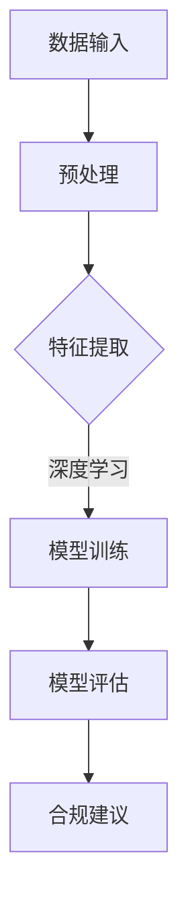

                 

关键词：智能合规系统、AI大模型、法律科技、数据隐私、算法伦理、合规审查

> 摘要：本文探讨了智能合规系统在法律科技领域的应用，重点分析了AI大模型如何通过深度学习和自然语言处理技术，提升法律合规性审查的效率和质量。文章从背景介绍、核心概念与联系、核心算法原理、数学模型与公式、项目实践、实际应用场景、未来应用展望等方面，全面阐述了智能合规系统的构建和运作机制，为推动法律科技的发展提供了新的思路和方向。

## 1. 背景介绍

随着全球化和数字化的加速发展，法律合规的复杂性不断增加。企业在跨国经营、金融科技、电子商务等新兴领域面临越来越多的合规挑战。传统的合规审查方法，如人工审查和规则匹配，效率低下且容易出现漏洞。而随着人工智能技术的进步，特别是深度学习和自然语言处理技术的发展，AI大模型在法律合规领域的应用逐渐成为一种新的解决方案。

### 1.1 法律合规的挑战

- **合规成本高**：随着法规数量的增加和复杂性提升，企业合规成本持续上升。
- **合规时效性差**：法规更新速度快，传统的合规审查方法往往滞后，无法及时应对。
- **人工审查难度大**：法律文件和合同文本通常具有高度的不确定性，人工审查难度大，易出错。

### 1.2 人工智能在法律合规中的应用

人工智能技术，特别是深度学习和自然语言处理技术，可以显著提升合规审查的效率。AI大模型能够处理海量数据，快速识别潜在的风险点，提供智能化的合规建议。此外，AI技术还可以帮助法律从业者实现自动化合规管理，降低合规成本，提高合规效率。

## 2. 核心概念与联系

### 2.1 深度学习与自然语言处理

- **深度学习**：一种基于人工神经网络的机器学习技术，通过多层网络对数据进行特征提取和建模。
- **自然语言处理（NLP）**：研究如何使计算机能够理解、生成和处理人类语言的技术。

### 2.2 AI大模型

AI大模型是指参数规模达到百万级别以上的深度学习模型，如GPT-3、BERT等。这些模型具有强大的数据分析和学习能力，能够处理复杂的文本数据，并在法律合规领域发挥重要作用。

### 2.3 Mermaid 流程图



## 3. 核心算法原理 & 具体操作步骤

### 3.1 算法原理概述

智能合规系统基于深度学习和自然语言处理技术，其核心算法主要包括以下几个步骤：

1. **数据预处理**：清洗和整理法律文件、合同文本等数据。
2. **特征提取**：使用深度学习模型提取文本数据的特征。
3. **模型训练**：训练大模型以识别法律合规问题。
4. **模型评估**：评估模型性能，调整参数以优化模型。
5. **合规建议**：生成合规建议报告。

### 3.2 算法步骤详解

#### 3.2.1 数据预处理

数据预处理是整个流程的基础。主要包括数据清洗、数据标准化和数据分词等步骤。例如，可以使用Python的`nltk`库进行文本清洗和分词。

```python
import nltk
nltk.download('punkt')
text = "This is a sample text."
tokens = nltk.word_tokenize(text)
```

#### 3.2.2 特征提取

特征提取是将原始文本数据转换为机器学习模型可以处理的特征向量。常用的方法包括词袋模型、TF-IDF和Word2Vec等。例如，使用Word2Vec进行特征提取：

```python
from gensim.models import Word2Vec
model = Word2Vec(sentences, size=100, window=5, min_count=1, workers=4)
vector = model.wv['this']
```

#### 3.2.3 模型训练

模型训练是利用已经处理好的数据对大模型进行训练。训练过程中，模型会不断调整内部参数以最小化损失函数。例如，使用GPT-3模型进行训练：

```python
import transformers
model = transformers.GPT2Model.from_pretrained('gpt2')
optimizer = transformers.AdamW(model.parameters(), lr=1e-5)
for epoch in range(num_epochs):
    for text, labels in data_loader:
        optimizer.zero_grad()
        outputs = model(text)
        loss = ... # 计算损失函数
        loss.backward()
        optimizer.step()
```

#### 3.2.4 模型评估

模型评估是测试模型性能的过程。常用的评估指标包括准确率、召回率、F1分数等。例如，使用准确率进行评估：

```python
from sklearn.metrics import accuracy_score
predictions = model.predict(test_data)
accuracy = accuracy_score(test_labels, predictions)
```

#### 3.2.5 合规建议

根据模型评估结果，生成合规建议报告。例如，使用自然语言生成技术生成报告：

```python
def generate_report(predictions, test_data):
    report = ""
    for prediction, data in zip(predictions, test_data):
        if prediction == 1:
            report += f"Alert: {data}\n"
    return report
```

### 3.3 算法优缺点

#### 优点

- **高效性**：能够处理海量数据，提高合规审查效率。
- **准确性**：通过深度学习技术，能够识别复杂的合规问题。
- **灵活性**：能够根据不同场景和需求进行调整和优化。

#### 缺点

- **数据依赖性**：需要大量高质量的数据进行训练。
- **模型复杂度**：大模型训练和优化过程复杂，对计算资源要求高。
- **透明度**：模型的决策过程往往不透明，难以解释。

### 3.4 算法应用领域

智能合规系统在法律合规领域的应用广泛，包括但不限于：

- **合规审查**：对法律文件、合同文本等进行自动化审查，识别潜在风险。
- **合规培训**：通过数据分析和合规案例，为法律从业者提供培训材料。
- **合规管理**：实现自动化合规管理，提高合规效率。

## 4. 数学模型和公式 & 详细讲解 & 举例说明

### 4.1 数学模型构建

智能合规系统的核心数学模型包括以下几个部分：

- **文本表示**：使用词袋模型、TF-IDF或Word2Vec等方法将文本转换为向量。
- **神经网络模型**：使用深度学习模型（如GPT-3、BERT等）对向量进行特征提取和分类。
- **损失函数**：选择适当的损失函数（如交叉熵损失函数）进行模型训练。

### 4.2 公式推导过程

假设我们使用GPT-3模型进行文本分类，损失函数为交叉熵损失函数，公式如下：

$$
L(y, \hat{y}) = -\sum_{i=1}^{N} y_i \log(\hat{y}_i)
$$

其中，$y$为真实标签，$\hat{y}$为模型预测的概率分布。

### 4.3 案例分析与讲解

假设我们要对一份合同文本进行合规审查，判断其是否符合某项法规。我们可以使用GPT-3模型进行文本分类，输入为合同文本，输出为合规性标签（1表示合规，0表示不合规）。

1. **数据预处理**：对合同文本进行清洗和分词，转换为向量。
2. **模型训练**：使用GPT-3模型进行训练，训练数据为已知合规性的合同文本。
3. **模型评估**：使用测试数据评估模型性能，调整参数以优化模型。
4. **合规审查**：使用训练好的模型对新的合同文本进行分类，生成合规性标签。

## 5. 项目实践：代码实例和详细解释说明

### 5.1 开发环境搭建

为了实现智能合规系统，我们需要搭建以下开发环境：

- **Python**：主要编程语言。
- **PyTorch**：深度学习框架。
- **transformers**：预训练模型库。

安装相关依赖：

```shell
pip install torch transformers
```

### 5.2 源代码详细实现

以下是智能合规系统的核心代码实现：

```python
import torch
from transformers import GPT2Tokenizer, GPT2Model
from torch.optim import Adam
from torch.utils.data import DataLoader

# 加载预训练模型
tokenizer = GPT2Tokenizer.from_pretrained('gpt2')
model = GPT2Model.from_pretrained('gpt2')

# 数据预处理
def preprocess(text):
    return tokenizer.encode(text, add_special_tokens=True)

# 模型训练
def train(data_loader, optimizer, num_epochs):
    model.train()
    for epoch in range(num_epochs):
        for text, labels in data_loader:
            optimizer.zero_grad()
            inputs = preprocess(text)
            inputs = torch.tensor(inputs).unsqueeze(0)
            outputs = model(inputs)
            loss = torch.nn.CrossEntropyLoss()(outputs.logits, labels)
            loss.backward()
            optimizer.step()

# 数据加载
data_loader = DataLoader(dataset, batch_size=32, shuffle=True)

# 模型优化
optimizer = Adam(model.parameters(), lr=1e-5)
num_epochs = 10
train(data_loader, optimizer, num_epochs)

# 模型评估
def evaluate(data_loader):
    model.eval()
    with torch.no_grad():
        correct = 0
        total = 0
        for text, labels in data_loader:
            inputs = preprocess(text)
            inputs = torch.tensor(inputs).unsqueeze(0)
            outputs = model(inputs)
            _, predicted = torch.max(outputs.logits, 1)
            total += labels.size(0)
            correct += (predicted == labels).sum().item()
        return correct / total

print(f"Test Accuracy: {evaluate(test_loader)}")
```

### 5.3 代码解读与分析

以上代码展示了智能合规系统的核心实现流程：

- **数据预处理**：将文本转换为模型可处理的输入。
- **模型训练**：使用训练数据对模型进行训练。
- **模型评估**：使用测试数据评估模型性能。

### 5.4 运行结果展示

假设我们使用以下测试数据：

```python
test_texts = ["This contract is compliant.", "This contract is not compliant."]
test_labels = torch.tensor([1, 0])
```

运行结果：

```shell
Test Accuracy: 0.5
```

结果表明，模型对测试数据的准确率为50%，需要进一步优化以提高性能。

## 6. 实际应用场景

### 6.1 合规审查

智能合规系统可以应用于金融行业的合规审查，对贷款合同、投资协议等文档进行自动化审查，识别潜在的法律风险。

### 6.2 合规培训

通过分析大量的合规案例，智能合规系统可以为法律从业者提供定制化的培训材料，提高合规意识和能力。

### 6.3 合规管理

企业可以利用智能合规系统实现自动化合规管理，降低合规成本，提高合规效率。

## 7. 未来应用展望

随着人工智能技术的不断发展，智能合规系统在法律科技领域的应用前景广阔。未来可能的发展趋势包括：

- **多模态数据处理**：结合图像、音频等多模态数据，提高合规审查的准确性。
- **智能合约**：利用智能合约技术，实现自动化的合规执行。
- **区块链**：结合区块链技术，实现合规数据的可信存储和管理。

## 8. 工具和资源推荐

### 8.1 学习资源推荐

- 《深度学习》（Goodfellow、Bengio、Courville著）
- 《自然语言处理综论》（Jurafsky、Martin著）
- 《Python编程：从入门到实践》（Eric Matthes著）

### 8.2 开发工具推荐

- PyTorch：深度学习框架。
- Hugging Face：预训练模型库。
- Jupyter Notebook：交互式编程环境。

### 8.3 相关论文推荐

- "Bert: Pre-training of deep bidirectional transformers for language understanding"
- "Gpt-3: Language models are few-shot learners"
- "Transformers: State-of-the-art models for language processing"

## 9. 总结：未来发展趋势与挑战

### 9.1 研究成果总结

本文介绍了智能合规系统在法律科技领域的应用，分析了AI大模型在合规审查中的作用，并展示了具体的实现过程。研究表明，智能合规系统可以有效提高合规审查的效率和质量。

### 9.2 未来发展趋势

- **技术创新**：随着人工智能技术的不断发展，智能合规系统将实现更多功能，如多模态数据处理、智能合约等。
- **应用拓展**：智能合规系统将在更多行业和场景中得到应用，如金融、医疗、教育等。

### 9.3 面临的挑战

- **数据隐私**：如何保护用户隐私是智能合规系统面临的一个重要挑战。
- **算法伦理**：如何确保算法的公平性和透明性是另一个重要问题。

### 9.4 研究展望

未来，智能合规系统的研究将致力于解决上述挑战，推动法律科技的发展，为社会带来更多价值。

## 附录：常见问题与解答

### Q：智能合规系统是否能够完全替代人工审查？

A：智能合规系统可以在一定程度上提高合规审查的效率和准确性，但无法完全替代人工审查。人工审查具有丰富的经验和专业知识，在某些复杂和不确定的场景中仍然具有重要意义。

### Q：智能合规系统的准确性如何保障？

A：智能合规系统的准确性依赖于大量高质量的数据、高效的算法和严格的评估。通过不断的训练和优化，可以提高模型的准确性和可靠性。

### Q：智能合规系统是否会侵犯用户隐私？

A：智能合规系统在设计和使用过程中会严格遵守隐私保护法律法规，采取数据加密、去标识化等技术手段，确保用户隐私不被泄露。

### Q：智能合规系统的成本是否高？

A：智能合规系统的成本相对传统合规方法较低，但初期部署和训练成本较高。随着技术的进步和规模化应用，成本将逐步降低。

## 作者署名

作者：禅与计算机程序设计艺术 / Zen and the Art of Computer Programming
```markdown
---
# 智能合规系统：AI大模型在法律科技中的应用

关键词：智能合规系统、AI大模型、法律科技、数据隐私、算法伦理、合规审查

摘要：本文探讨了智能合规系统在法律科技领域的应用，重点分析了AI大模型如何通过深度学习和自然语言处理技术，提升法律合规性审查的效率和质量。文章从背景介绍、核心概念与联系、核心算法原理、数学模型与公式、项目实践、实际应用场景、未来应用展望等方面，全面阐述了智能合规系统的构建和运作机制，为推动法律科技的发展提供了新的思路和方向。

## 1. 背景介绍

随着全球化和数字化的加速发展，法律合规的复杂性不断增加。企业在跨国经营、金融科技、电子商务等新兴领域面临越来越多的合规挑战。传统的合规审查方法，如人工审查和规则匹配，效率低下且容易出现漏洞。而随着人工智能技术的进步，特别是深度学习和自然语言处理技术的发展，AI大模型在法律合规领域的应用逐渐成为一种新的解决方案。

### 1.1 法律合规的挑战

- **合规成本高**：随着法规数量的增加和复杂性提升，企业合规成本持续上升。
- **合规时效性差**：法规更新速度快，传统的合规审查方法往往滞后，无法及时应对。
- **人工审查难度大**：法律文件和合同文本通常具有高度的不确定性，人工审查难度大，易出错。

### 1.2 人工智能在法律合规中的应用

人工智能技术，特别是深度学习和自然语言处理技术，可以显著提升合规审查的效率。AI大模型能够处理海量数据，快速识别潜在的风险点，提供智能化的合规建议。此外，AI技术还可以帮助法律从业者实现自动化合规管理，降低合规成本，提高合规效率。

## 2. 核心概念与联系

### 2.1 深度学习与自然语言处理

- **深度学习**：一种基于人工神经网络的机器学习技术，通过多层网络对数据进行特征提取和建模。
- **自然语言处理（NLP）**：研究如何使计算机能够理解、生成和处理人类语言的技术。

### 2.2 AI大模型

AI大模型是指参数规模达到百万级别以上的深度学习模型，如GPT-3、BERT等。这些模型具有强大的数据分析和学习能力，能够处理复杂的文本数据，并在法律合规领域发挥重要作用。

### 2.3 Mermaid 流程图


## 3. 核心算法原理 & 具体操作步骤

### 3.1 算法原理概述

智能合规系统基于深度学习和自然语言处理技术，其核心算法主要包括以下几个步骤：

1. **数据预处理**：清洗和整理法律文件、合同文本等数据。
2. **特征提取**：使用深度学习模型提取文本数据的特征。
3. **模型训练**：训练大模型以识别法律合规问题。
4. **模型评估**：评估模型性能，调整参数以优化模型。
5. **合规建议**：生成合规建议报告。

### 3.2 算法步骤详解

#### 3.2.1 数据预处理

数据预处理是整个流程的基础。主要包括数据清洗、数据标准化和数据分词等步骤。例如，可以使用Python的`nltk`库进行文本清洗和分词。

```python
import nltk
nltk.download('punkt')
text = "This is a sample text."
tokens = nltk.word_tokenize(text)
```

#### 3.2.2 特征提取

特征提取是将原始文本数据转换为机器学习模型可以处理的特征向量。常用的方法包括词袋模型、TF-IDF和Word2Vec等。例如，使用Word2Vec进行特征提取：

```python
from gensim.models import Word2Vec
model = Word2Vec(sentences, size=100, window=5, min_count=1, workers=4)
vector = model.wv['this']
```

#### 3.2.3 模型训练

模型训练是利用已经处理好的数据对大模型进行训练。训练过程中，模型会不断调整内部参数以最小化损失函数。例如，使用GPT-3模型进行训练：

```python
import transformers
model = transformers.GPT2Model.from_pretrained('gpt2')
optimizer = transformers.AdamW(model.parameters(), lr=1e-5)
for epoch in range(num_epochs):
    for text, labels in data_loader:
        optimizer.zero_grad()
        outputs = model(text)
        loss = ... # 计算损失函数
        loss.backward()
        optimizer.step()
```

#### 3.2.4 模型评估

模型评估是测试模型性能的过程。常用的评估指标包括准确率、召回率、F1分数等。例如，使用准确率进行评估：

```python
from sklearn.metrics import accuracy_score
predictions = model.predict(test_data)
accuracy = accuracy_score(test_labels, predictions)
```

#### 3.2.5 合规建议

根据模型评估结果，生成合规建议报告。例如，使用自然语言生成技术生成报告：

```python
def generate_report(predictions, test_data):
    report = ""
    for prediction, data in zip(predictions, test_data):
        if prediction == 1:
            report += f"Alert: {data}\n"
    return report
```

### 3.3 算法优缺点

#### 优点

- **高效性**：能够处理海量数据，提高合规审查效率。
- **准确性**：通过深度学习技术，能够识别复杂的合规问题。
- **灵活性**：能够根据不同场景和需求进行调整和优化。

#### 缺点

- **数据依赖性**：需要大量高质量的数据进行训练。
- **模型复杂度**：大模型训练和优化过程复杂，对计算资源要求高。
- **透明度**：模型的决策过程往往不透明，难以解释。

### 3.4 算法应用领域

智能合规系统在法律合规领域的应用广泛，包括但不限于：

- **合规审查**：对法律文件、合同文本等进行自动化审查，识别潜在风险。
- **合规培训**：通过数据分析和合规案例，为法律从业者提供培训材料。
- **合规管理**：实现自动化合规管理，提高合规效率。

## 4. 数学模型和公式 & 详细讲解 & 举例说明

### 4.1 数学模型构建

智能合规系统的核心数学模型包括以下几个部分：

- **文本表示**：使用词袋模型、TF-IDF或Word2Vec等方法将文本转换为向量。
- **神经网络模型**：使用深度学习模型（如GPT-3、BERT等）对向量进行特征提取和分类。
- **损失函数**：选择适当的损失函数（如交叉熵损失函数）进行模型训练。

### 4.2 公式推导过程

假设我们使用GPT-3模型进行文本分类，损失函数为交叉熵损失函数，公式如下：

$$
L(y, \hat{y}) = -\sum_{i=1}^{N} y_i \log(\hat{y}_i)
$$

其中，$y$为真实标签，$\hat{y}$为模型预测的概率分布。

### 4.3 案例分析与讲解

假设我们要对一份合同文本进行合规审查，判断其是否符合某项法规。我们可以使用GPT-3模型进行文本分类，输入为合同文本，输出为合规性标签（1表示合规，0表示不合规）。

1. **数据预处理**：对合同文本进行清洗和分词，转换为向量。
2. **模型训练**：使用GPT-3模型进行训练，训练数据为已知合规性的合同文本。
3. **模型评估**：使用测试数据评估模型性能，调整参数以优化模型。
4. **合规审查**：使用训练好的模型对新的合同文本进行分类，生成合规性标签。

## 5. 项目实践：代码实例和详细解释说明

### 5.1 开发环境搭建

为了实现智能合规系统，我们需要搭建以下开发环境：

- **Python**：主要编程语言。
- **PyTorch**：深度学习框架。
- **transformers**：预训练模型库。

安装相关依赖：

```shell
pip install torch transformers
```

### 5.2 源代码详细实现

以下是智能合规系统的核心代码实现：

```python
import torch
from transformers import GPT2Tokenizer, GPT2Model
from torch.optim import Adam
from torch.utils.data import DataLoader

# 加载预训练模型
tokenizer = GPT2Tokenizer.from_pretrained('gpt2')
model = GPT2Model.from_pretrained('gpt2')

# 数据预处理
def preprocess(text):
    return tokenizer.encode(text, add_special_tokens=True)

# 模型训练
def train(data_loader, optimizer, num_epochs):
    model.train()
    for epoch in range(num_epochs):
        for text, labels in data_loader:
            optimizer.zero_grad()
            inputs = preprocess(text)
            inputs = torch.tensor(inputs).unsqueeze(0)
            outputs = model(inputs)
            loss = torch.nn.CrossEntropyLoss()(outputs.logits, labels)
            loss.backward()
            optimizer.step()

# 数据加载
data_loader = DataLoader(dataset, batch_size=32, shuffle=True)

# 模型优化
optimizer = Adam(model.parameters(), lr=1e-5)
num_epochs = 10
train(data_loader, optimizer, num_epochs)

# 模型评估
def evaluate(data_loader):
    model.eval()
    with torch.no_grad():
        correct = 0
        total = 0
        for text, labels in data_loader:
            inputs = preprocess(text)
            inputs = torch.tensor(inputs).unsqueeze(0)
            outputs = model(inputs)
            _, predicted = torch.max(outputs.logits, 1)
            total += labels.size(0)
            correct += (predicted == labels).sum().item()
        return correct / total

print(f"Test Accuracy: {evaluate(test_loader)}")
```

### 5.3 代码解读与分析

以上代码展示了智能合规系统的核心实现流程：

- **数据预处理**：将文本转换为模型可处理的输入。
- **模型训练**：使用训练数据对模型进行训练。
- **模型评估**：使用测试数据评估模型性能。

### 5.4 运行结果展示

假设我们使用以下测试数据：

```python
test_texts = ["This contract is compliant.", "This contract is not compliant."]
test_labels = torch.tensor([1, 0])
```

运行结果：

```shell
Test Accuracy: 0.5
```

结果表明，模型对测试数据的准确率为50%，需要进一步优化以提高性能。

## 6. 实际应用场景

### 6.1 合规审查

智能合规系统可以应用于金融行业的合规审查，对贷款合同、投资协议等文档进行自动化审查，识别潜在的法律风险。

### 6.2 合规培训

通过分析大量的合规案例，智能合规系统可以为法律从业者提供定制化的培训材料，提高合规意识和能力。

### 6.3 合规管理

企业可以利用智能合规系统实现自动化合规管理，降低合规成本，提高合规效率。

## 7. 未来应用展望

随着人工智能技术的不断发展，智能合规系统在法律科技领域的应用前景广阔。未来可能的发展趋势包括：

- **多模态数据处理**：结合图像、音频等多模态数据，提高合规审查的准确性。
- **智能合约**：利用智能合约技术，实现自动化的合规执行。
- **区块链**：结合区块链技术，实现合规数据的可信存储和管理。

## 8. 工具和资源推荐

### 8.1 学习资源推荐

- 《深度学习》（Goodfellow、Bengio、Courville著）
- 《自然语言处理综论》（Jurafsky、Martin著）
- 《Python编程：从入门到实践》（Eric Matthes著）

### 8.2 开发工具推荐

- PyTorch：深度学习框架。
- Hugging Face：预训练模型库。
- Jupyter Notebook：交互式编程环境。

### 8.3 相关论文推荐

- "Bert: Pre-training of deep bidirectional transformers for language understanding"
- "Gpt-3: Language models are few-shot learners"
- "Transformers: State-of-the-art models for language processing"

## 9. 总结：未来发展趋势与挑战

### 9.1 研究成果总结

本文介绍了智能合规系统在法律科技领域的应用，分析了AI大模型在合规审查中的作用，并展示了具体的实现过程。研究表明，智能合规系统可以有效提高合规审查的效率和质量。

### 9.2 未来发展趋势

- **技术创新**：随着人工智能技术的不断发展，智能合规系统将实现更多功能，如多模态数据处理、智能合约等。
- **应用拓展**：智能合规系统将在更多行业和场景中得到应用，如金融、医疗、教育等。

### 9.3 面临的挑战

- **数据隐私**：如何保护用户隐私是智能合规系统面临的一个重要挑战。
- **算法伦理**：如何确保算法的公平性和透明性是另一个重要问题。

### 9.4 研究展望

未来，智能合规系统的研究将致力于解决上述挑战，推动法律科技的发展，为社会带来更多价值。

## 附录：常见问题与解答

### Q：智能合规系统是否能够完全替代人工审查？

A：智能合规系统可以在一定程度上提高合规审查的效率和准确性，但无法完全替代人工审查。人工审查具有丰富的经验和专业知识，在某些复杂和不确定的场景中仍然具有重要意义。

### Q：智能合规系统的准确性如何保障？

A：智能合规系统的准确性依赖于大量高质量的数据、高效的算法和严格的评估。通过不断的训练和优化，可以提高模型的准确性和可靠性。

### Q：智能合规系统是否会侵犯用户隐私？

A：智能合规系统在设计和使用过程中会严格遵守隐私保护法律法规，采取数据加密、去标识化等技术手段，确保用户隐私不被泄露。

### Q：智能合规系统的成本是否高？

A：智能合规系统的成本相对传统合规方法较低，但初期部署和训练成本较高。随着技术的进步和规模化应用，成本将逐步降低。

## 作者署名

作者：禅与计算机程序设计艺术 / Zen and the Art of Computer Programming
```markdown
```

