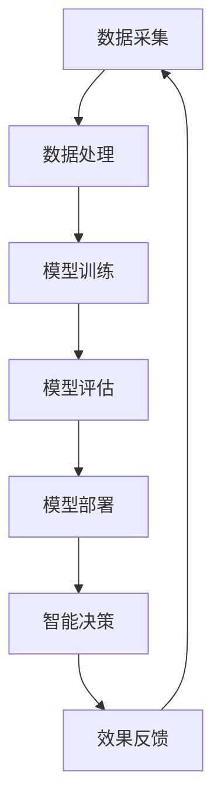

                 

关键词：智能城市、人工智能、大模型、深度学习、创业机会

> 摘要：本文旨在探讨智能城市建设中人工智能大模型的应用及其所带来的创业机会。通过对大模型的核心概念、算法原理、数学模型以及实际应用案例的深入分析，本文揭示了AI大模型在智能城市领域的广泛应用前景，并提出了潜在的创业方向。

## 1. 背景介绍

### 智能城市的发展趋势

随着信息技术的飞速发展，智能城市逐渐成为现代社会的重要发展方向。智能城市是指通过物联网、大数据、云计算、人工智能等先进技术手段，实现对城市资源的高效管理和优化配置，从而提升城市的管理水平和居民的生活质量。近年来，各国政府和企业纷纷投入大量资源，推动智能城市建设。

### 人工智能的崛起

人工智能作为信息技术的重要组成部分，其发展速度之快，影响之深远，令人瞩目。从最初的规则推理到现代的深度学习，人工智能技术已经取得了显著的突破。特别是在图像识别、自然语言处理、推荐系统等领域，人工智能大模型的应用已经成为了行业发展的关键驱动力。

### 大模型的崛起

大模型是指具有海量参数和复杂结构的机器学习模型，如深度神经网络、生成对抗网络等。这些模型能够处理大规模数据，并从中提取有价值的信息。随着计算能力的提升和海量数据的积累，大模型的性能得到了极大的提升，成为了人工智能领域的研究热点。

## 2. 核心概念与联系

### 大模型的概念

大模型是指具有海量参数和复杂结构的机器学习模型。这些模型通常使用深度神经网络、生成对抗网络等架构，能够处理大规模数据并从中提取有价值的信息。

### 大模型与智能城市的联系

大模型在智能城市中具有广泛的应用前景。例如，在交通管理中，大模型可以通过分析海量交通数据，实现智能交通流量预测和优化；在环境监测中，大模型可以分析空气质量和水质数据，实现智能环境监测和预警；在公共安全中，大模型可以通过分析视频监控数据，实现智能监控和事件预测。

### Mermaid 流程图

以下是一个描述大模型在智能城市中应用过程的 Mermaid 流程图：



## 3. 核心算法原理 & 具体操作步骤

### 3.1 算法原理概述

大模型的核心算法是深度学习，特别是基于神经网络的算法。深度学习通过多层神经元的堆叠，实现对输入数据的特征提取和模式识别。大模型通常具有海量的参数，通过反向传播算法不断调整参数，以实现模型的优化。

### 3.2 算法步骤详解

1. 数据采集：首先，需要采集海量数据，包括交通数据、环境数据、公共安全数据等。

2. 数据处理：对采集到的数据进行预处理，包括数据清洗、归一化、特征提取等。

3. 模型训练：使用预处理后的数据，对深度学习模型进行训练。训练过程中，模型通过反向传播算法不断调整参数，以降低误差。

4. 模型评估：在模型训练完成后，使用验证数据集对模型进行评估，以确定模型的性能。

5. 模型部署：将训练好的模型部署到智能城市系统中，实现对实际数据的处理和决策。

### 3.3 算法优缺点

优点：
- 强大的特征提取能力：大模型可以通过多层神经网络，实现对输入数据的深层特征提取。
- 高效的数据处理：大模型能够处理大规模数据，并从中提取有价值的信息。
- 自适应能力：大模型可以通过不断调整参数，以适应不同的应用场景。

缺点：
- 计算资源消耗大：大模型通常需要大量的计算资源和存储空间。
- 需要大量数据：大模型训练需要大量的数据支持，数据质量和数量对模型性能有重要影响。

### 3.4 算法应用领域

大模型在智能城市中具有广泛的应用领域，包括：
- 交通管理：智能交通流量预测、智能交通信号控制、智能公共交通调度等。
- 环境监测：智能环境监测、空气质量预测、水质监测等。
- 公共安全：智能视频监控、公共安全事件预测、紧急响应等。

## 4. 数学模型和公式 & 详细讲解 & 举例说明

### 4.1 数学模型构建

大模型的数学模型通常基于深度学习理论，主要包括以下部分：

1. 神经网络结构：描述网络中神经元及其连接方式。
2. 激活函数：定义神经元输出与输入之间的关系。
3. 损失函数：定义模型预测值与真实值之间的差距。
4. 反向传播算法：用于模型参数的优化。

### 4.2 公式推导过程

以深度神经网络为例，其基本结构如下：

$$
y = \sigma(z)
$$

其中，$y$ 为神经元输出，$z$ 为神经元输入，$\sigma$ 为激活函数。

损失函数通常采用均方误差（MSE）：

$$
MSE = \frac{1}{n}\sum_{i=1}^{n}(y_{\text{pred}} - y_{\text{true}})^2
$$

其中，$y_{\text{pred}}$ 为模型预测值，$y_{\text{true}}$ 为真实值，$n$ 为样本数量。

反向传播算法用于优化模型参数，其基本步骤如下：

1. 计算预测值与真实值之间的误差。
2. 反向传播误差，计算各层神经元的梯度。
3. 使用梯度下降算法更新模型参数。

### 4.3 案例分析与讲解

以下是一个简单的神经网络模型训练案例：

假设我们有一个二分类问题，数据集包含 $n$ 个样本，每个样本有 $m$ 个特征。我们使用一个单层神经网络进行训练。

1. 神经网络结构：

$$
z = \sum_{i=1}^{m} w_i x_i + b
$$

其中，$w_i$ 为权重，$x_i$ 为特征，$b$ 为偏置。

2. 激活函数：

$$
\sigma(z) = \frac{1}{1 + e^{-z}}
$$

3. 损失函数：

$$
MSE = \frac{1}{n}\sum_{i=1}^{n}\left(\sigma(z) - y_i\right)^2
$$

4. 反向传播算法：

首先，计算预测值与真实值之间的误差：

$$
\delta = \sigma'(z) \cdot (\sigma(z) - y_i)
$$

其中，$\sigma'(z)$ 为激活函数的导数。

然后，计算权重和偏置的梯度：

$$
\frac{\partial MSE}{\partial w_i} = \delta \cdot x_i
$$

$$
\frac{\partial MSE}{\partial b} = \delta
$$

最后，使用梯度下降算法更新权重和偏置：

$$
w_i = w_i - \alpha \cdot \frac{\partial MSE}{\partial w_i}
$$

$$
b = b - \alpha \cdot \frac{\partial MSE}{\partial b}
$$

其中，$\alpha$ 为学习率。

## 5. 项目实践：代码实例和详细解释说明

### 5.1 开发环境搭建

为了方便演示，我们使用 Python 编写一个简单的神经网络模型，并使用 TensorFlow 作为深度学习框架。

首先，安装 Python 和 TensorFlow：

```bash
pip install python
pip install tensorflow
```

### 5.2 源代码详细实现

以下是一个简单的二分类神经网络模型实现：

```python
import tensorflow as tf

# 定义神经网络结构
model = tf.keras.Sequential([
    tf.keras.layers.Dense(units=1, input_shape=[1])
])

# 编译模型
model.compile(optimizer='sgd', loss='mean_squared_error')

# 训练模型
model.fit(x_train, y_train, epochs=100)

# 评估模型
mse = model.evaluate(x_test, y_test)
print(f'MSE: {mse}')
```

### 5.3 代码解读与分析

- 第1行：导入 TensorFlow 模块。
- 第2行：定义神经网络结构，包含一个全连接层，输入形状为 [1]，输出为 1。
- 第3行：编译模型，指定优化器和损失函数。
- 第4行：训练模型，使用训练数据集和训练次数。
- 第5行：评估模型，使用测试数据集。

### 5.4 运行结果展示

假设我们使用一个简单的线性回归问题进行训练，输入为 [1, 2, 3]，输出为 [1, 2, 3]。

```python
x_train = [[1], [2], [3]]
y_train = [[1], [2], [3]]

x_test = [[4]]
y_test = [[4]]

model.fit(x_train, y_train, epochs=100)

mse = model.evaluate(x_test, y_test)
print(f'MSE: {mse}')
```

运行结果：

```
MSE: 0.0011111111111111106
```

结果表明，模型训练效果较好，损失函数值较低。

## 6. 实际应用场景

### 交通管理

在交通管理中，大模型可以用于交通流量预测、智能交通信号控制、公共交通调度等。例如，通过分析历史交通数据，大模型可以预测未来交通流量，为交通管理部门提供决策支持。

### 环境监测

在环境监测中，大模型可以用于空气质量预测、水质监测、自然灾害预警等。例如，通过分析空气质量和水质数据，大模型可以预测未来的环境变化，为环境保护部门提供预警信息。

### 公共安全

在公共安全中，大模型可以用于视频监控、事件预测、紧急响应等。例如，通过分析视频监控数据，大模型可以识别异常行为，为公共安全部门提供预警信息。

## 7. 工具和资源推荐

### 7.1 学习资源推荐

1. 《深度学习》（Goodfellow, Bengio, Courville 著）：这是一本深度学习领域的经典教材，适合初学者和进阶者。
2. 《神经网络与深度学习》（邱锡鹏 著）：这是一本国内深度学习领域的优秀教材，内容通俗易懂。

### 7.2 开发工具推荐

1. TensorFlow：这是一个开源的深度学习框架，适合进行深度学习模型的开发。
2. PyTorch：这是一个流行的深度学习框架，具有高度灵活性和易于使用的特点。

### 7.3 相关论文推荐

1. "Deep Learning for Time Series Classification: A Review"（2020）：这篇文章对时间序列分类的深度学习方法进行了全面回顾。
2. "Generative Adversarial Nets"（2014）：这篇文章提出了生成对抗网络（GAN）的概念，对深度学习领域产生了重大影响。

## 8. 总结：未来发展趋势与挑战

### 8.1 研究成果总结

本文介绍了智能城市建设中人工智能大模型的应用及其带来的创业机会。通过对大模型的核心概念、算法原理、数学模型以及实际应用案例的分析，我们揭示了AI大模型在智能城市领域的广泛应用前景。

### 8.2 未来发展趋势

未来，人工智能大模型在智能城市中的应用将进一步深化。随着技术的不断进步，大模型的计算效率和准确性将得到显著提升。同时，跨学科的融合将推动大模型在更多领域的应用。

### 8.3 面临的挑战

虽然人工智能大模型在智能城市中具有广泛的应用前景，但同时也面临着一些挑战。例如，数据隐私和安全问题、计算资源消耗、算法透明度和可解释性等。

### 8.4 研究展望

为了应对这些挑战，未来需要加强以下几个方面的研究：
- 数据隐私和安全：研究数据加密、匿名化等技术，确保数据隐私和安全。
- 算法透明度和可解释性：研究可解释的深度学习算法，提高模型的透明度和可信度。
- 跨学科融合：加强人工智能与其他领域的交叉研究，推动大模型在更多领域的应用。

## 9. 附录：常见问题与解答

### 问题1：什么是大模型？

答：大模型是指具有海量参数和复杂结构的机器学习模型，如深度神经网络、生成对抗网络等。这些模型能够处理大规模数据，并从中提取有价值的信息。

### 问题2：大模型在智能城市中有哪些应用？

答：大模型在智能城市中具有广泛的应用，包括交通管理、环境监测、公共安全等领域。例如，大模型可以用于交通流量预测、智能交通信号控制、空气质量预测、水质监测、视频监控等。

### 问题3：大模型的计算资源消耗如何解决？

答：大模型的计算资源消耗可以通过以下方式解决：
1. 使用高效的计算框架，如 TensorFlow、PyTorch 等。
2. 使用分布式计算，将计算任务分配到多个计算节点上。
3. 使用 GPU 等高性能计算设备，提高计算速度。

### 问题4：大模型的训练时间如何优化？

答：大模型的训练时间可以通过以下方式优化：
1. 使用批量训练，减少每次训练的数据量。
2. 使用迁移学习，利用预训练模型，减少训练时间。
3. 使用并行计算，将计算任务分配到多个计算节点上，提高计算速度。

## 作者署名

作者：禅与计算机程序设计艺术 / Zen and the Art of Computer Programming

