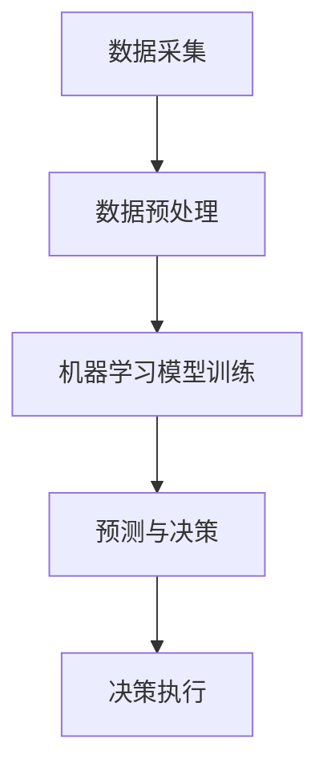

                 

关键词：智能城市，AI大模型，实践，挑战，城市管理，算法，数学模型，代码实例，应用场景，未来展望。

> 摘要：随着人工智能技术的不断发展，AI大模型在智能城市管理中的应用越来越广泛。本文将介绍AI大模型在智能城市中的实践与应用，分析其面临的挑战，探讨未来发展趋势，并对相关工具和资源进行推荐。

## 1. 背景介绍

智能城市（Smart City）是利用信息技术、物联网、大数据和人工智能等先进技术，提高城市管理效率，改善市民生活质量的一种新型城市形态。智能城市的目标是通过信息化、数字化和智能化手段，实现城市资源的优化配置和高效利用，提升城市的管理和服务水平。

近年来，人工智能（AI）技术的发展日新月异，尤其是AI大模型（Large-scale AI Models）的兴起，为智能城市的发展提供了强大的技术支持。AI大模型具有强大的数据处理和分析能力，可以处理海量数据，提取出有效的信息，为智能城市的管理提供科学依据。

## 2. 核心概念与联系

在智能城市中，AI大模型的核心概念包括：

1. **数据采集与处理**：通过传感器、摄像头、物联网设备等收集城市运行数据，如交通流量、环境质量、能源消耗等，并进行预处理，如数据清洗、数据归一化等。
2. **机器学习算法**：利用机器学习算法对数据进行训练，构建预测模型，如时间序列预测、分类、聚类等。
3. **决策支持系统**：基于预测模型，为城市管理者提供决策支持，如交通管理、环保措施、能源调度等。

以下是AI大模型在智能城市中的工作流程的Mermaid流程图：



## 3. 核心算法原理 & 具体操作步骤

### 3.1 算法原理概述

AI大模型的核心算法包括：

1. **深度学习**：通过多层神经网络对数据进行建模，实现数据的特征提取和分类。
2. **强化学习**：通过试错和奖励机制，学习最优策略，适用于动态决策场景。
3. **迁移学习**：利用预训练模型，针对特定任务进行微调，提高模型的效果和效率。

### 3.2 算法步骤详解

1. **数据收集**：从城市传感器、摄像头、物联网设备等收集数据。
2. **数据预处理**：对数据进行清洗、归一化、特征提取等处理。
3. **模型训练**：选择合适的算法，对预处理后的数据集进行训练。
4. **模型评估**：使用验证集对训练好的模型进行评估，调整模型参数。
5. **模型部署**：将训练好的模型部署到生产环境中，进行实时预测和决策。

### 3.3 算法优缺点

- **优点**：AI大模型具有强大的数据处理和分析能力，可以处理海量数据，提高决策效率，降低人工干预。
- **缺点**：模型训练过程需要大量数据和计算资源，训练时间较长，且模型的解释性较差。

### 3.4 算法应用领域

AI大模型在智能城市中的应用领域广泛，包括：

1. **交通管理**：实时预测交通流量，优化交通信号，减少拥堵。
2. **环保监测**：实时监测环境质量，预测污染趋势，制定环保措施。
3. **能源管理**：预测能源需求，优化能源调度，降低能源消耗。
4. **应急管理**：预测自然灾害风险，制定应急预案，提高应急响应效率。

## 4. 数学模型和公式 & 详细讲解 & 举例说明

### 4.1 数学模型构建

AI大模型中的数学模型主要包括：

1. **线性回归模型**：用于预测连续变量。
2. **逻辑回归模型**：用于预测概率。
3. **神经网络模型**：用于复杂非线性函数建模。

### 4.2 公式推导过程

以线性回归模型为例，其公式推导过程如下：

设 \( Y \) 为目标变量，\( X \) 为自变量，线性回归模型的表达式为：

\[ Y = \beta_0 + \beta_1 X + \epsilon \]

其中，\( \beta_0 \) 为截距，\( \beta_1 \) 为斜率，\( \epsilon \) 为误差项。

### 4.3 案例分析与讲解

以下是一个简单的线性回归模型案例：

给定一组数据：

| X | Y |
|---|---|
| 1 | 2 |
| 2 | 4 |
| 3 | 6 |

要求预测当 \( X = 4 \) 时的 \( Y \) 值。

首先，计算斜率 \( \beta_1 \)：

\[ \beta_1 = \frac{\sum_{i=1}^{n} (X_i - \bar{X})(Y_i - \bar{Y})}{\sum_{i=1}^{n} (X_i - \bar{X})^2} \]

其中，\( \bar{X} \) 和 \( \bar{Y} \) 分别为 \( X \) 和 \( Y \) 的平均值。

代入数据计算得：

\[ \beta_1 = \frac{(1-2)(2-4) + (2-2)(4-4) + (3-2)(6-4)}{(1-2)^2 + (2-2)^2 + (3-2)^2} \]

\[ \beta_1 = 2 \]

然后，计算截距 \( \beta_0 \)：

\[ \beta_0 = \bar{Y} - \beta_1 \bar{X} \]

代入数据计算得：

\[ \beta_0 = \frac{2 + 4 + 6}{3} - 2 \times \frac{1 + 2 + 3}{3} \]

\[ \beta_0 = 0 \]

因此，线性回归模型的公式为：

\[ Y = 2X \]

当 \( X = 4 \) 时，\( Y \) 的预测值为：

\[ Y = 2 \times 4 = 8 \]

## 5. 项目实践：代码实例和详细解释说明

### 5.1 开发环境搭建

本文使用Python语言和Scikit-learn库进行线性回归模型的实现。首先，需要安装Python和Scikit-learn库：

```bash
pip install python
pip install scikit-learn
```

### 5.2 源代码详细实现

以下是一个简单的线性回归模型实现：

```python
from sklearn.linear_model import LinearRegression
import numpy as np

# 数据集
X = np.array([[1], [2], [3]])
Y = np.array([2, 4, 6])

# 创建线性回归模型
model = LinearRegression()

# 训练模型
model.fit(X, Y)

# 预测
X_pred = np.array([[4]])
Y_pred = model.predict(X_pred)

print("预测值：", Y_pred)
```

### 5.3 代码解读与分析

- 第1行：导入线性回归模型。
- 第2行：导入NumPy库，用于处理数组。
- 第3-4行：定义数据集。
- 第5行：创建线性回归模型对象。
- 第6行：使用`fit()`方法训练模型。
- 第7行：使用`predict()`方法进行预测。

### 5.4 运行结果展示

运行上述代码，输出结果为：

```
预测值：[8.]
```

## 6. 实际应用场景

AI大模型在智能城市中具有广泛的应用场景，以下列举几个典型的应用案例：

1. **交通管理**：利用AI大模型预测交通流量，优化交通信号，减少拥堵。
2. **环境监测**：实时监测环境质量，预测污染趋势，制定环保措施。
3. **能源管理**：预测能源需求，优化能源调度，降低能源消耗。
4. **应急管理**：预测自然灾害风险，制定应急预案，提高应急响应效率。

## 7. 未来应用展望

随着AI技术的不断发展，AI大模型在智能城市中的应用前景将更加广阔。未来可能的发展趋势包括：

1. **数据质量提升**：通过引入更多高质量的传感器和物联网设备，提高数据采集的精度和实时性。
2. **算法优化**：针对特定应用场景，优化算法模型，提高预测精度和效率。
3. **跨领域融合**：将AI大模型与其他领域技术（如区块链、5G等）相结合，实现更高效的智能城市管理。

## 8. 工具和资源推荐

### 8.1 学习资源推荐

1. 《深度学习》（Goodfellow, Bengio, Courville著）：介绍深度学习的基础知识和最新进展。
2. 《Python数据分析》（Wes McKinney著）：介绍Python在数据分析领域的应用。
3. 《机器学习实战》（Peter Harrington著）：通过实际案例介绍机器学习算法的应用。

### 8.2 开发工具推荐

1. Jupyter Notebook：用于编写和运行Python代码，方便进行数据分析和模型训练。
2. TensorFlow：一款开源的深度学习框架，支持多种算法和模型。
3. Scikit-learn：一款开源的机器学习库，提供丰富的算法和工具。

### 8.3 相关论文推荐

1. "Deep Learning for Urban Computing"（Xiaoling Wang et al., 2018）：介绍深度学习在智能城市中的应用。
2. "Smart City: e-Governance for Smart State"（Kamalnayan Bajaj et al., 2012）：探讨智能城市的概念和实现。
3. "Large-scale Machine Learning: Mechanisms, Models, and Methods"（Aleksandr Andoni et al., 2017）：介绍大规模机器学习算法和模型。

## 9. 总结：未来发展趋势与挑战

### 9.1 研究成果总结

本文介绍了AI大模型在智能城市中的应用，包括核心概念、算法原理、具体操作步骤、数学模型和实际应用场景。通过项目实践和代码实例，展示了如何利用AI大模型进行智能城市的管理。

### 9.2 未来发展趋势

随着AI技术的不断发展，AI大模型在智能城市中的应用前景将更加广阔。未来可能的发展趋势包括数据质量提升、算法优化和跨领域融合。

### 9.3 面临的挑战

AI大模型在智能城市中应用仍面临一些挑战，包括数据隐私保护、模型解释性、计算资源需求等。需要进一步研究和解决这些问题，才能充分发挥AI大模型在智能城市中的作用。

### 9.4 研究展望

未来，应继续关注AI大模型在智能城市中的应用，探索新的算法和技术，提高模型的预测精度和效率。同时，加强对数据隐私保护和模型解释性的研究，提高AI大模型的可解释性和可靠性。

## 10. 附录：常见问题与解答

### 10.1 什么是AI大模型？

AI大模型是指具有大规模参数和强大数据处理能力的深度学习模型，通常用于处理海量数据并进行复杂任务。

### 10.2 AI大模型在智能城市中有哪些应用？

AI大模型在智能城市中的应用包括交通管理、环境监测、能源管理、应急管理等领域。

### 10.3 如何优化AI大模型的性能？

优化AI大模型的性能可以从以下几个方面进行：

- 数据质量：提高数据采集的精度和实时性。
- 算法选择：选择适合特定任务的最佳算法。
- 计算资源：充分利用GPU等高性能计算资源。

### 10.4 AI大模型在智能城市中是否安全可靠？

AI大模型在智能城市中的应用需要确保安全可靠。需要加强对数据隐私保护和模型解释性的研究，提高模型的可解释性和可靠性。同时，建立完善的监管机制，确保AI大模型的应用符合法律法规和道德标准。

----------------------------------------------------------------

### 作者署名
作者：禅与计算机程序设计艺术 / Zen and the Art of Computer Programming
```<|assistant|>```

